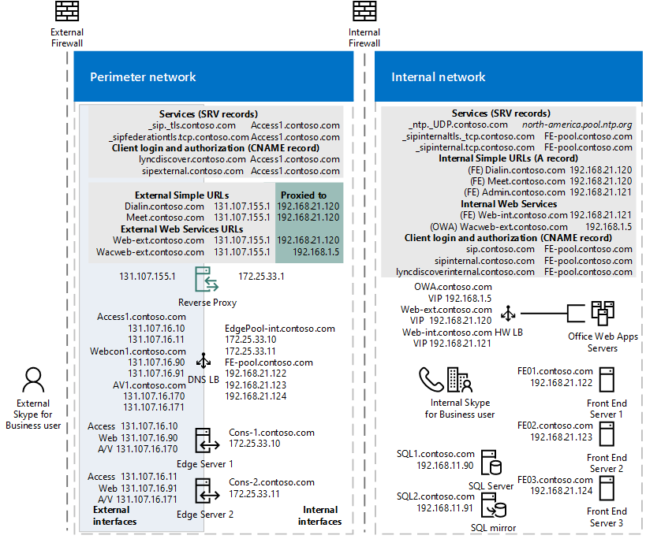

# Requisitos de DNS para o Skype for Business Server

**Resumo:** Revise as considerações de DNS neste tópico antes de implementar o Skype for Business Server.

Este artigo aborda apenas o planejamento de DNS para implantações do Skype for Business Server na rede local de uma organização. Para o Skype for Business Online, consulte "URLs e intervalos de endereços IP do Office [https://aka.ms/o365ips](https://aka.ms/o365ips)365" em.

Um servidor DNS (serviço de nomes de domínio) mapeia nomes de host (  como www. Contoso. com, supostamente um servidor da Web) para endereços IP (como 10.10.10.10). Ele ajuda os clientes e os servidores interdependentes a se comunicar uns com os outros na rede. Ao configurar uma implementação do Skype for Business Server 2015, você precisará certificar-se de que o mapeamento de novos nomes de servidor (geralmente refletindo a função que está sendo tomada) corresponda aos endereços IP aos quais eles estão atribuídos.

Embora isso possa parecer um pouco intimidante primeiro, o trabalho pesado para planejar isso pode ser feito usando a [ferramenta de planejamento do Skype for Business Server 2015](https://www.microsoft.com/download/details.aspx?id=50357). Depois de realizar as perguntas do assistente sobre quais recursos você planeja usar, para cada site que você definir, poderá exibir o relatório DNS no relatório de administração de borda e usar as informações listadas para criar seus registros DNS. Você também pode fazer ajustes em muitos dos nomes e endereços IP usados, para obter detalhes, consulte [rever The DNS Report](../../management-tools/planning-tool/review-the-administrator-reports.md#DNS_Report). Tenha em mente que você pode exportar o relatório de administração de borda para uma planilha do Excel, e o relatório de DNS será uma das planilhas no arquivo. Embora essa ferramenta inclua recursos [preteridos do Skype for Business Server 2019](../../../SfBServer2019/deprecated.md), ele ainda pode ser usado para criar um plano inicial se esses recursos não estiverem selecionados

Quando você estiver instalando uma nova implementação, conforme descrito em [Create DNS Records for Skype for Business Server](../../deploy/install/create-dns-records.md) e Building Your Topology for Skype for Business Server, reconhecemos que você pode optar por usar os recursos de DNS integrados ao Windows Server 2016 ou um pacote de DNS de terceiros, para que possamos manter as discussões neste artigo geral, e não específicos. Estamos detalhando o que é necessário e como você atende a necessidade de fazer a decisão.

Os administradores experientes do Skype for Business, Lync e Office Communications Suite provavelmente encontrarão as seguintes tabelas úteis. Se a tabela for confusa para você, as seções ou artigos mais recentes serão declaradas com os seguintes conceitos:

## Tabelas de resumo

As tabelas a seguir mostram os registros DNS que o Skype for Business Server usa para fornecer serviços aos usuários. Alguns são opcionais, pois são necessários apenas para suportar determinados recursos e podem ser ignorados se esses recursos não forem desejados. Os registros DNS necessários para acesso interno só estão na primeira tabela e uma implantação que permite o acesso interno e externo precisará de registros de ambas as tabelas.

**Mapeamentos de DNS internos**

|Tipo de Registro|Valor|Resolver para|Finalidade|Obrigatório|
|:-----|:-----|:-----|:-----|:-----|
|A/AAAA   |FQDN do pool de front-ends    *FE-pool.  Contoso. com*   |Endereços IP do servidor do pool de front-ends     DNS LB para *192.168.21.122 192.168.21.123 192.168.21.124*   |Balanceamento de carga de DNS de pools de front-ends. Mapeia o nome do pool de front-ends para um conjunto de endereços IP.    Consulte [implantando o balanceamento de carga DNS em pools de front-ends e pools de diretores](load-balancing.md#BK_FE_Dir)  |S   |
|A/AAAA   | FQDN de cada servidor front-end ou servidor Standard Edition em um pool ou um servidor autônomo    *FE01.  contoso.  com FE02.  Contoso. com FE03.  Contoso. com*   |IP correspondente de cada servidor    *192.168.21.122 192.168.21.123 192.168.21.124*   |Mapeia o nome do servidor para seu endereço IP.   |S   |
|A/AAAA   |FQDN de substituição de serviços Web internos do pool corporativo    *Web-int.Contoso. com*   |VIP HLB para serviços Web internos do servidor front-end    *192.168.21.120*   |Obrigatório para habilitar o tráfego da Web do cliente para o servidor, como baixar o Skype for Business Web App. Também necessário para clientes móveis.   |S   |
|A/AAAA   |FQDN de substituição de serviços Web externos do pool corporativo    *Web-ext.Contoso. com*   |VIP HLB para serviços Web externos do servidor front-end   *68.123.56.90*   |Obrigatório para habilitar o tráfego da Web do cliente para o servidor, como baixar o Skype for Business Web App. Obrigatório se clientes móveis resolverem o DNS internamente. Pode resolver para IP de proxy reverso da DMZ ou IP da Internet.   ||
|A/AAAA   | FQDN do servidor de back-end do SQL Server   *SQL1.  Contoso. com*   |Endereço IP do servidor    *192.168.11.90*   |Mapeia o nome do servidor de um SQL Server de back-end que trabalha com o pool de front-ends para seu endereço IP   ||
|A/AAAA   |FQDN do servidor back-end do SQL Server    *Sql2.  Contoso. com*   |Endereço IP do servidor    *192.168.11.91*   |Mapeia o nome do servidor para um servidor espelho de back-end do SQL que funcione com o pool de front-ends para seu endereço IP   ||
|A/AAAA   |FQDN do pool de diretores   **Observação:** Não é aplicável ao usar um servidor de diretor autônomo   *DirPool.  Contoso. com*   |Endereços IP do pool de diretores    DNS LB para *192.168.21.132, 192.168.21.133, 192.168.21.134*   |Balanceamento de carga de DNS de servidores do pool de diretores. Mapeia o nome do pool do pool de diretores para um endereço IP, confira [implantando o balanceamento de carga DNS em pools de front-ends e pools de diretores](load-balancing.md#BK_FE_Dir)   Um diretor pode autenticar um usuário e é opcional.   ||
|A/AAAA   |FQDN do diretor   |Endereço IP do servidor de cada servidor de diretor   |Mapeia o nome do pool para o diretor para um endereço IP, confira [implantando o balanceamento de carga DNS em pools de front-ends e pools de diretores](load-balancing.md#BK_FE_Dir)  ||
|A/AAAA   |FQDN do pool do servidor de mediação   |Endereços IP do pool   |A função de servidor de mediação é opcional. Você pode colocalizar os serviços fornecidos por um servidor de mediação para o servidor front-end ou pool. Consulte [usando o balanceamento de carga DNS em pools do servidor de mediação](load-balancing.md#BK_Mediation)  ||
|A/AAAA   |FQDN do servidor de mediação   |Endereço IP do servidor   |Você pode colocalizar os serviços fornecidos por um servidor de mediação para o servidor front-end ou pool. Consulte [usando o balanceamento de carga DNS em pools do servidor de mediação](load-balancing.md#BK_Mediation)  ||
|A/AAAA   |FQDN do servidor de chat persistente   |Endereço IP do servidor de chat persistente   |Um servidor de chat persistente é necessário para o recurso de chat persistente e, caso contrário, é opcional.   ||
|A/AAAA   |lyncdiscoverinternal. * \<sipdomain\>*   lyncdiscoverinternal. *  Contoso. com*   |IP do diretor de front-ends do HLB     192.168.21.121  |O Service1 interno de descoberta automática, necessário para suporte à mobilidade. Se o DNS interno for usado para resolver dispositivos móveis, ele deve apontar para o IP externo ou VIP do DMZ.    Para serviços Web, exigimos que HLB no pool de front-ends como HTTPS não possa aproveitar o DNS. Para pool de front-ends ou pool de diretores, isso deve ser resolvido para um VIP do HLB ou um IP regular para um servidor Standard Edition ou um servidor diretor autônomo.   |S   |
|CNAME   |lyncdiscoverinternal. * \<sipdomain\>*   lyncdiscoverinternal. *Contoso. com*   |FQDN do pool FE HLB ou FQDN do diretor    Web-int.Contoso. com   |Service1 de descoberta automática interna   Você pode implementar isso como um CNAME em vez de um registro A, se desejado.   ||
|A/AAAA   |SIP. * \<sipdomain\>*   SIP. *  Contoso. com*  |Endereços IP do servidor do pool de front-ends (ou para um endereço IP de cada diretor)     DNS LB para *192.168.21.122 192.168.21.123 192.168.21.124*   |Necessário para a configuração automática, consulte [Walkthrough of Skype for Business clients Localization Services](../../plan-your-deployment/edge-server-deployments/advanced-edge-server-dns.md#WalkthroughOfSkype)   Um registro ou registros que apontam para servidores do pool de front-ends ou servidores de diretor na rede interna ou o serviço de borda de acesso quando o cliente é externo   |&#x2777;  |
|A/AAAA   |ucupdates-r2. * \<sipdomain\>*   ucupdates-r2. *  Contoso. com*  |HLB de pool de FE ou VIP de pool de diretor HLB ou IP de servidor SE/diretor     192.168.21.121  |A implantação deste registro é opcional &#x2778;  ||
|SRV   |\_sipinternaltls. \_TCP. * \<sipdomain\> *  Porta 5061  \_sipinternaltls. \_TCP. *  Contoso. com*  Porta 5061  |FQDN do pool de front-ends   *FE-pool.  Contoso. com*  |Habilita o logon automático de usuário interno 1 ao servidor/pool de front-end ou servidor/pool SE que autentica e redireciona as solicitações do cliente para entrada.  |&#x2777; |
|A/AAAA |sipinternal. * \<sipdomain\>*  sipinternal.   *Contoso. com*  |FQDN do pool de front-ends   _FE-pool.  Contoso. com_  |Acesso de usuário interno &#x2776;  |&#x2777;  |
|SRV   | \_NTP. \_UDP. * \<sipdomain\> *   \_NTP. \_UDP.   *Contoso. com*  |FQDN do servidor de timeserver    north-america.pool.ntp.org   |Fonte NTP necessária para dispositivos do Lync Phone Edition   |Isso é necessário para dar suporte a aparelhos de mesa.   |
|SRV   |\_sipfederationtls. \_TCP. * \<sipdomain\> *  \_sipfederationtls. \_TCP.   *Contoso. com*  | FQDN do serviço de borda de acesso   EdgePool-int.*Contoso. com*  |Crie um registro SRV para cada domínio SIP que tenha clientes móveis do IOS ou Windows Phone.   |Para suporte a clientes móveis   |
|A/AAAA   |URL do administrador   *Web-int.Contoso. com*  |VIP do pool FE HLB    192.168.21.121   |Painel de controle do Skype for Business Server, consulte [URLs simples](dns.md#BK_Simple)  ||
|A/AAAA   |URL de reunião   *Web-int.Contoso. com*  |VIP do pool FE HLB    192.168.21.121   |Reuniões online, consulte [URLs simples](dns.md#BK_Simple)  ||
|A/AAAA   |URL de discagem   *Web-int.Contoso. com*  |VIP do pool FE HLB    192.168.21.121   |Conferência discada, consulte [URLs simples](dns.md#BK_Simple)  ||
|A/AAAA   |FQDN de serviços Web internos   *Web-int.Contoso. com*  |VIP do pool FE HLB    192.168.21.121   |Skype for Business Web Service usado pelo Skype for Business Web App   ||
|A/AAAA   |FQDN do pool de servidores do Office Web Apps    OWA.  Contoso. com   | Endereço VIP do pool de servidores do Office Web Apps   192.168.1.5   |Define o FQDN do pool do servidor do Office Web Apps   ||
|A/AAAA   | FQDN da Web interna   Web-int.Contoso. com   | Endereço VIP do pool de front-ends   192.168.21.121   |Define o FQDN da Web interno usado pelo Skype for Business Web App    Se você estiver usando o balanceamento de carga DNS nesse pool, seu pool de front-ends e o Web farm interno não poderão ter o mesmo FQDN.   ||

&#x2776; usado por um cliente para descobrir o servidor front-end ou o pool de front-ends e ser autenticado e conectado como um usuário. Há mais detalhes sobre isso em [passo a passo dos clientes do Skype for Business que localizam serviços](../../plan-your-deployment/edge-server-deployments/advanced-edge-server-dns.md#WalkthroughOfSkype).

&#x2777; isso só é necessário para dar suporte a clientes herdados antes do Lync 2013 e aparelhos de mesa.

&#x2778; na situação em que um dispositivo de comunicações unificadas está ativado, mas um usuário nunca fez logon no dispositivo, o registro a permite que o dispositivo descubra o serviço Web de atualização do dispositivo de hospedagem do servidor e obtenha as atualizações. Caso contrário, os dispositivos obtêm as informações do servidor através do provisionamento em banda na primeira vez que um usuário faz logon.

O diagrama a seguir mostra um exemplo que inclui registros DNS internos e externos, e muitos dos registros mostrados nas tabelas ao redor:

**Diagrama de rede de borda usando endereços IPv4 públicos**

**Mapeamentos de DNS de rede de perímetro (interfaces internas e externas)**

|Tipo de Registro|Valor|Resolver para|Finalidade|Obrigatório|
|:--- |:--- |:--- |:--- |:--- |
|A/AAAA   |FQDN do pool de borda interna   *EdgePool-int.Contoso. com*  |Endereços IP do pool de borda voltado para o lado interno    172.25.33.10, 172.25.33.11   |Endereços IP de interface interna do pool de borda consolidado   |S   |
|A/AAAA   |FQDN do servidor de borda   *Desvantagens-1.  Contoso. com*  |IP do servidor voltado para o lado interno de um servidor no pool de borda    172.25.33.10   |Criar um registro para cada servidor no pool com o FQDN do servidor apontando para seu IP de nó de servidor interno no pool, consulte [balanceamento de carga de DNS em pools de servidor de borda](load-balancing.md#BK_Edge).   |S   |
|A/AAAA   |FQDN do pool de serviços de borda de acesso   *Access1.  Contoso. com*  |Endereços IP externos do pool de serviços de borda de acesso    131.107.16.10, 131.107.16.11   |O Serviço de Borda de Acesso fornece um ponto de conexão único e confiável para o tráfego de saída e de entrada do protocolo SIP.   |S   |
|A/AAAA   |FQDN do pool de serviços de borda de Webconferência   *Webcon1.  Contoso. com*  |Endereços IP externos do serviço de borda de Webconferência    131.107.16.90, 131.107.16.91   |O serviço de borda de Webconferência permite que usuários externos ingressem em reuniões hospedadas em seu ambiente interno do Skype for Business Server.   |S   |
|A/AAAA   |*Av.\<SIP-Domain\> * FQDN do pool  *AV1.  Contoso. com*  |Endereços IP externos de borda A/V    131.107.16.170, 131.107.16.171   |O serviço de borda A/V disponibiliza áudio, vídeo, compartilhamento de aplicativos e transferência de arquivos para usuários externos.   |S   |
|CNAME   |SIP. * \<sipdomain\>*   SIP. *  Contoso. com*  |FQDN do pool de borda de acesso externo   *Access1.  Contoso. com*  |Localiza o pool do servidor de borda. Confira [orientações de clientes do Skype for Business localizando serviços](../../plan-your-deployment/edge-server-deployments/advanced-edge-server-dns.md#WalkthroughOfSkype)  |S   |
|SRV   |\_SIP. \_TLS. * \<sipdomain\> *  \_SIP. \_TLS.   *Contoso. com*  |FQDN de borda de acesso externo   _Access1.  Contoso. com_  |Usada para acesso de usuário externo. Confira [orientações de clientes do Skype for Business localizando serviços](../../plan-your-deployment/edge-server-deployments/advanced-edge-server-dns.md#WalkthroughOfSkype)  |S   |
|SRV   |\_sipfederationtls. \_TCP. * \<sipdomain\> *  \_sipfederationtls. \_TCP.   *Contoso. com*  |FQDN de borda de acesso externo   *Access1.  Contoso. com*  |Usado para Federação e conectividade de IM pública   |&#x2776;  |
|SRV   |\_XMPP-Server. \_TCP. *<sipdomain\> *  \_XMPP-Server. \_TCP. *  Contoso. com*  |FQDN de borda de acesso externo   *Access1.  Contoso. com*  |O serviço de proxy do XMPP aceita e envia mensagens de XMPP (Extensible Messaging and Presence Protocol) para e de parceiros federados XMPP configurados.   |S, para implantar a Federação, caso contrário, opcional    Não disponível no Skype for Business Server 2019.|
|SRV   |\_sipfederationtls. \_TCP. * \<sipdomain\> *  \_sipfederationtls. \_TCP. *  Contoso. com*  |FQDN de borda de acesso externo   *Access1.  Contoso. com*  |Para dar suporte ao serviço de notificação por push e ao Apple Push Notification Service, você cria um registro SRV para cada domínio SIP. &#x2778;  ||
|A/AAAA   |FQDN de serviços Web do pool de front-ends externo   *Web-ext.Contoso. com*  |Endereço IP público do proxy reverso, proxies para o VIP de serviços Web externos para seu pool de front-ends &#x2776;   proxy do 131.107.155.1 para o 192.168.21.120   |Interface externa do pool de front-ends usada pelo Skype for Business Web App   |S   |
|A/AAAA/CNAME   |lyncdiscover. * \<sipdomain\>*   lyncdiscover. *  Contoso. com*  |Endereço IP público do proxy reverso, resolve para o VIP de serviços Web externos para seu pool de diretor, se você tiver um, ou para seu pool de front-ends se não tiver um diretor &#x2777;   proxy do 131.107.155.1 para o 192.168.21.120   | Registro externo para descoberta automática de cliente, também usado por mobilidade, Skype for Business Web App e Agendador Web App, resolvido pelo servidor de proxy reverso   Para dar suporte ao serviço de notificação por push e ao Apple Push Notification Service, você cria um registro SRV para cada domínio SIP que tenha clientes móveis do Microsoft Lync. 3   |S   |
|A/AAAA   |cumpra. * \<sipdomain\>*   cumpra. *  Contoso. com*  |Endereço IP público do proxy reverso, resolve para a interface Web externa do pool de front-ends    proxy do 131.107.155.1 para o 192.168.21.120   |Proxy para o serviço Web do Skype for Business    Consulte [URLs simples](dns.md#BK_Simple)  |S   |
|A/AAAA   |discagem.*\<sipdomain\>*   discagem.*contoso. com*  |Endereço IP público do proxy reverso, proxies para a interface Web externa do pool de front-ends    proxy do 131.107.155.1 para o 192.168.21.120   |Proxy para o serviço Web do Skype for Business    Consulte [URLs simples](dns.md#BK_Simple)  |S   |
|A/AAAA   |FQDN do pool de servidores do Office Web Apps    OWA.  Contoso. com   | Endereço IP público do proxy reverso, proxies para a interface Web externa do servidor do Office Web Apps   proxy do 131.107.155.1 para o 192.168.1.5   | Endereço VIP do pool de servidores do Office Web Apps   192.168.1.5   |Define o FQDN do pool do servidor do Office Web Apps   |

&#x2776; necessário para implantar a Federação, caso contrário, opcional.

&#x2777; usado por um cliente para descobrir o servidor front-end ou o pool de front-ends e ser autenticado e conectado como um usuário.

&#x2778; esse requisito aplica-se apenas aos clientes em dispositivos móveis baseados em Apple ou Microsoft. Dispositivos Android e Nokia Symbian não usam notificações por push.

 Para obter mais detalhes sobre servidores de borda e redes de perímetro, consulte o conteúdo de [planejamento DNS](../../plan-your-deployment/edge-server-deployments/edge-environmental-requirements.md#DNSPlan) do servidor de borda.

> [!IMPORTANT]
> O Skype for Business Server oferece suporte ao uso de endereçamento IPv6. Consulte [Plan for IPv6 in Skype for Business](ipv6.md) para obter mais detalhes.

> [!IMPORTANT]
> Para obter mais detalhes sobre FQDNs, consulte [DNS Basics](basics.md).

**DNS de Split Brain** 
 

Split Brain DNS é uma configuração de DNS em que você tem duas zonas DNS com o mesmo namespace. A primeira zona DNS trata as solicitações internas, enquanto a segunda zona DNS trata as solicitações externas, conforme mencionado nessas tabelas. Para saber mais sobre isso [, confira DNS Split-Brain](../../plan-your-deployment/edge-server-deployments/advanced-edge-server-dns.md#SplitBrainDNS).

## Considerações híbridas

Se você planeja ter alguns usuários hospedados online e alguns hospedados no local, consulte o artigo de planejamento de conectividade híbrida [do Skype for Business server 2019](../../../SfbHybrid/hybrid/plan-hybrid-connectivity.md?toc=/SkypeForBusiness/sfbhybridtoc/toc.json). Será necessário configurar o DNS normalmente para o Skype for Business Server 2015 e também adicionar outros registros DNS.

Você também deve consultar "URLs e intervalos de endereços IP do Office 365" [https://aka.ms/o365ips](https://aka.ms/o365ips) em para confirmar se os seus usuários terão acesso aos recursos online que precisarão.

## URLs simples

Um URL (Uniform Resource Locator) é uma referência a um recurso da Web que especifica sua localização em uma rede de computadores e um protocolo usado para recuperá-lo.

O Skype for Business Server oferece suporte ao uso de três URLs "simples" para acessar os serviços:

- A **reunião** é usada como a URL base para todas as conferências no site. Um exemplo de URL simples de reunião é https://atender.  Contoso. com. Uma URL para uma reunião específica pode ser https://atender.  Contoso. com/_username_/7322994.

    Com a URL simples de reunião, os links para ingressar em reuniões são fáceis de compreender e de fácil comunicação.

- **A discagem** permite acesso à página da Web configurações de conferência discada. Esta página mostra os números de discagem de conferência com seus idiomas disponíveis, as informações de conferência atribuídas (para reuniões que não necessitam de agendamento), controles DTMF durante a conferência, suporte de gerenciamento do PIN (número de identificação pessoal) e informações atribuídas da conferência. O URL Discar é incluído em todos os convites de reuniões para que o usuário que desejar discar para ingressar na reunião possa obter acesso ao número de telefone necessário, bem como as informações do PIN. Um exemplo da URL simples de discagem é https://discagem.  Contoso. com.

- O **administrador** permite acesso rápido ao painel de controle do Skype for Business Server. A partir de qualquer computador dentro de firewalls da sua organização, um administrador pode abrir o painel de controle do Skype for Business Server digitando a URL simples do administrador em um navegador. A URL simples de Admin é interna à organização. Um exemplo da URL simples de admin é oadministrador do https://.  Contoso. com.

As URLs simples são abordadas em mais detalhes em [requisitos de DNS para URLs simples no Skype for Business Server](simple-urls.md).

## DNS por função de servidor

Você pode definir os nomes desses pools e servidores como desejar, mas torná-los memorizar e refletir sua função no sistema.

### Registros DNS para servidores ou pools individuais

Esses requisitos de registro genérico se aplicam a qualquer função de servidor usada pelo Skype for Business. Um pool é um conjunto de servidores que executam os mesmos serviços que trabalham juntos para lidar com as solicitações de clientes direcionadas a eles por meio de um balanceador de carga. Consulte [requisitos de balanceamento de carga para o Skype for Business](load-balancing.md) para obter detalhes

**Requisitos de registro DNS para funções de servidor/pool (presume que o balanceamento de carga DNS)**

|Cenário da implantação|Requisito de DNS|
|:-----|:-----|
|Um servidor:    Chat persistente, diretor, servidor de mediação, servidor front-end   |Um registro A interno que resolva o FQDN (nome de domínio totalmente qualificado) do servidor como o respectivo endereço IP.    ServerRole.  Contoso. com 10.10.10.0   |
|Pool    Chat persistente, diretor, servidor de borda, servidor de mediação, front-end   |Um registro A interno que resolve o nome de domínio totalmente qualificado (FQDN) de cada nó de servidor no pool para seu endereço IP.   **Exemplo**   ServerRole01.  Contoso. com 10.10.10.1    ServerRole02.  Contoso. com 10.10.10.2    Vários registros internos A que resolvem o FQDN (nome de domínio totalmente qualificado) do pool para os endereços IP dos nós do servidor no pool.   **Exemplo**   ServerPool.  Contoso. com 10.10.10.1    ServerPool.  Contoso. com 10.10.10.2   |

### Tópicos DNS específicos do servidor de borda

 Para planejar a implantação do servidor de borda, revise o [plano de implantações do servidor de borda no Skype for Business server 2015](../../plan-your-deployment/edge-server-deployments/edge-server-deployments.md)e [planejamento de DNS avançado do servidor de borda para o Skype for Business Server 2015](../../plan-your-deployment/edge-server-deployments/advanced-edge-server-dns.md) que tem as seguintes seções

- [Recuperação de desastres DNS](../../plan-your-deployment/edge-server-deployments/advanced-edge-server-dns.md#DNSDR)

- [Balanceamento de carga DNS](../../plan-your-deployment/edge-server-deployments/advanced-edge-server-dns.md#DNSLB)

- [Configuração automática sem DNS de Split-Brain](../../plan-your-deployment/edge-server-deployments/advanced-edge-server-dns.md#NoSplitBrainDNS)

- [DNS de Split-Brain](../../plan-your-deployment/edge-server-deployments/advanced-edge-server-dns.md#SplitBrainDNS)

- [Orientações dos clientes do Skype for Business localizando serviços](../../plan-your-deployment/edge-server-deployments/advanced-edge-server-dns.md#WalkthroughOfSkype)

