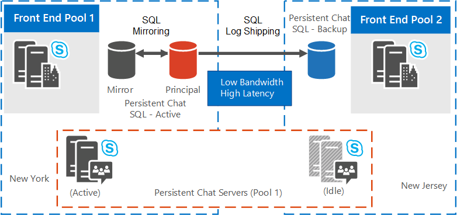

# Planejar alta disponibilidade e recuperação de desastres para o Servidor de Chat Persistente Skype for Business Server 2015
 
**Resumo:** Leia este tópico para saber como planejar alta disponibilidade e recuperação de desastres para o Servidor de Chat Persistente no Skype for Business Server 2015.
  
A alta disponibilidade e a recuperação de desastres para o Servidor de Chat Persistente exigem recursos adicionais além do que normalmente é necessário para a operação completa. 
  
> [!NOTE]
> O uso SQL Grupos de Disponibilidade AlwaysOn não é suportado com bancos de dados do Servidor de Chat Persistente. 

> [!NOTE] 
> O chat persistente está disponível no Skype for Business Server 2015, mas não tem mais suporte no Skype for Business Server 2019. A mesma funcionalidade está disponível no Teams. Para obter mais informações, consulte [Getting started with your Microsoft Teams upgrade](/microsoftteams/upgrade-start-here). Se você precisar usar o chat persistente, suas opções são migrar usuários que exigem essa funcionalidade para Teams ou continuar usando o Skype for Business Server 2015. 
  
## Requisitos de recursos

Antes de configurar o Servidor de Chat Persistente para alta disponibilidade e recuperação de desastres, verifique se você tem os seguintes recursos adicionais. 
  
- Uma instância de banco de dados dedicada localizada no mesmo data center físico no qual o front-end do serviço servidor de Chat Persistente está localizado. Esse banco de dados servirá como o espelho SQL Server para o banco de dados de Chat Persistente principal. Opcionalmente, designe uma SQL Server para servir como testemunha de espelhamento se você quiser um failover automatizado para o banco de dados espelho.
    
- Uma instância de banco de dados dedicada localizada no outro data Center físico. Esse banco de dados servirá como o banco de dados SQL Server envio de log secundário para o banco de dados no data center principal.
    
- Uma instância de banco de dados dedicada para servir como o espelho SQL Server para o banco de dados secundário. Opcionalmente, designe uma SQL Server para o servidor como testemunha de espelhamento. Ambos devem estar localizado no mesmo data Center físico que o banco de dados secundário.
    
- Se a conformidade do Servidor de Chat Persistente estiver habilitada, outras três instâncias de banco de dados dedicadas serão necessárias. Sua distribuição é a mesma descrita anteriormente para o banco de dados de Chat Persistente. Embora seja possível que o banco de dados de conformidade compartilhe a mesma instância SQL Server do banco de dados de Chat Persistente, são recomendadas instâncias autônomas para alta disponibilidade e recuperação de desastres.
    
- Um compartilhamento de arquivos deve ser criado e designado para os logs SQL Server de transação de Envio de Log. Todos SQL servidores em ambos os data centers que executem bancos de dados de Chat Persistente devem ter acesso de leitura/gravação a esse compartilhamento de arquivos. Este compartilhamento não está definido como parte de uma função FileStore.
    
- Um compartilhamento de arquivos no servidor de banco de dados secundário para servir como a pasta de destino para os logs de transação SQL Server que são copiados do compartilhamento de arquivos do servidor principal.
    
## Soluções de recuperação de desastres e alta disponibilidade

Skype for Business Server oferece suporte a vários modos de alta disponibilidade para seus Servidores Back-End, incluindo espelhamento de banco de dados. Para obter mais informações, [consulte Plan for high availability and disaster recovery in Skype for Business Server 2015](../../plan-your-deployment/high-availability-and-disaster-recovery/high-availability-and-disaster-recovery.md). 
  
A solução de recuperação de desastres para o Servidor de Chat Persistente descrito neste tópico é construída em um pool de Servidor de Chat Persistente estendido. Não há requisitos para uma VLAN (rede de área virtual) estendida. Ao estender um pool de Servidor de Chat Persistente, você configura um pool na topologia logicamente, mas coloca fisicamente os servidores no pool em dois data centers diferentes. Você configura SQL Server espelhamento para o banco de dados da mesma maneira e implanta o banco de dados e o espelho no mesmo data center. Você deve configurar um banco de dados de backup no data center secundário (com um espelho opcional para fornecer alta disponibilidade durante a recuperação de desastres). Ele é o banco de dados de backup usado para failover durante a recuperação de desastres. 
  
Para obter detalhes sobre como configurar alta disponibilidade e recuperação de desastres para o Servidor de Chat Persistente, consulte Configure high availability and [disaster recovery for Persistent Chat Server in Skype for Business Server 2015](../../deploy/deploy-persistent-chat-server/configure-hadr-for-persistent-chat.md). 
  
As figuras a seguir mostram como o pool do Servidor de Chat Persistente pode ser configurado em duas topologias de pool estendidas diferentes:
  
- Pool de servidor de chat persistente ampliado quando os data centers estão geo-localizados com alta largura de banda/baixa latência.
    
- Pool de servidor de chat persistente ampliado quando os data centers estão geo-localizados com baixa largura de banda/alta latência.
    
A Figura 1 mostra uma topologia ampliada do pool do Servidor de Chat Persistente onde os data centers estão geo-localizados com alta largura de banda/baixa latência. Suponha o seguinte para as topologias lógicas e físicas:
  
- A topologia lógica consiste no seguinte:
    
  - Um pool de Chat Persistente nos Sites 1 e 2 contendo servidores de 1 a 8.
    
  - Um pool de Servidor front-end, um banco de dados de Chat Persistente, um banco de dados espelhado e, opcionalmente, um banco de dados testemunha (não mostrado no diagrama) residindo fisicamente no Site 1. 
    
  - Um segundo pool de Servidor Front-End e um banco de dados de backup que residem fisicamente no Site 2.
    
- A topologia física consiste nos Sites 1 e 2 da seguinte forma:
    
  - Um pool de Chat Persistente, contendo servidores de 1 a 4, dois ativos, dois ociosos no Site 1.
    
  - Um pool de Chat Persistente, contendo servidores de 5 a 8, dois ativos, dois ociosos no Site 2.
    
  - Um pool de Servidor Front-End, um banco de dados de Chat Persistente, um banco de dados espelhado e, opcionalmente, um banco de dados testemunha (não mostrado no diagrama) no Site 1.
    
  - Um Pool de Servidores front-end e um banco de dados de backup, que é o SQL de envio de log, no Site 2.
    
**Pool de Servidor de Chat Persistente Estendido quando os data centers estão geo-localizados com alta largura de banda/baixa latência**

  
A Figura 2 mostra uma topologia ampliada do pool do Servidor de Chat Persistente onde os data centers estão geo-localizados com baixa largura de banda/alta latência.
  
- A topologia lógica consiste no seguinte:
    
  - Um pool de Chat Persistente nos Sites 1 e 2 contendo servidores de 1 a 8.
    
  - Um pool de Servidor front-end, um banco de dados de Chat Persistente, um banco de dados espelhado e, opcionalmente, um banco de dados testemunha (não mostrado no diagrama) residindo fisicamente no Site 1. 
    
  - Um segundo pool de Servidor Front-End e um banco de dados de backup que residem fisicamente no Site 2.
    
- A topologia física consiste nos Sites 1 e 2 da seguinte forma:
    
  - Um pool de Chat Persistente, contendo servidores de 1 a 4, todos ativos, no Site 1.
    
  - Um pool de Chat Persistente, contendo servidores de 5 a 8, todos ociosos, no Site 2.
    
  - Um pool de Servidor Front-End, um banco de dados de Chat Persistente, um banco de dados espelhado e, opcionalmente, um banco de dados testemunha (não mostrado no diagrama) no Site 1.
    
  - Um pool de Servidor front-end e um banco de dados de backup, que é o SQL de envio de log, no Site 2.
    
**Pool de Servidor de Chat Persistente Estendido quando os data centers estão geo-localizados com baixa largura de banda/alta latência**

  

