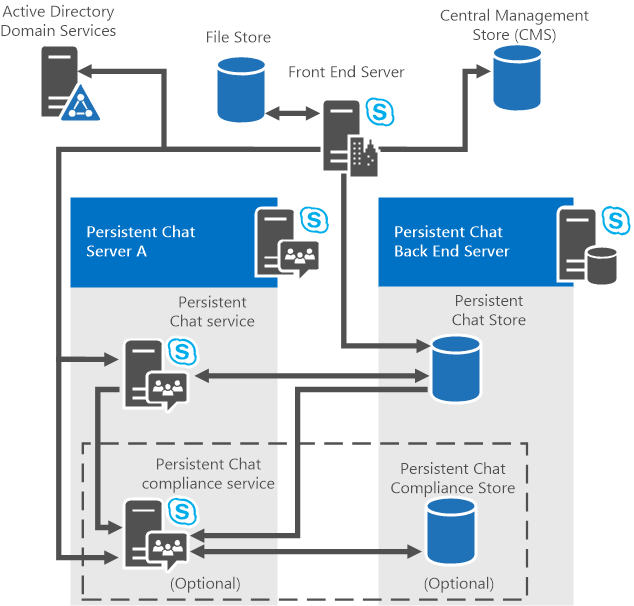

# Plenejamento da topologia do Servidor de Chat Persistente
 
**Resumo:** Leia este tópico para saber mais sobre os componentes de servidor de Chat persistente e topologias em Skype para Business Server 2015.
  
Servidor de Chat persistente suporta as configurações de servidor único e vários servidores. Você pode instalar o servidor de Chat persistente em qualquer um Skype para Business Server 2015 Enterprise Edition ou Standard Edition Server. 

> [!NOTE] 
> Bate-papo persistente está disponível no Skype para Business Server 2015, mas não é mais suportado no Skype para Business Server 2019. A mesma funcionalidade está disponível em equipes. Para obter mais informações, consulte [jornada do Skype para negócios às equipes da Microsoft](/microsoftteams/journey-skypeforbusiness-teams). Se você precisar utilizar o chat persistente, suas opções são para migrar tanto os usuários que requerem essa funcionalidade para equipes ou para continuar usando o Skype para Business Server 2015. 
  
## Componentes de servidor de Chat persistentes

O Servidor de Chat Persistente consiste nos seguintes componentes:
  
- Um ou mais computadores executando o servidor de Chat persistente e fornecem os seguintes serviços:
    
  - Serviço de bate-papo persistente
    
  - Serviço de conformidade, que é ativado quando a conformidade é habilitada
    
- Um ou mais servidores (mais de um caso de espelhamento for usado) executando o banco de dados de back-end do SQL Server para hospedar o banco de dados de conteúdo do Chat persistente onde o conteúdo da sala de chat, salas e categorias são armazenadas.
    
    > [!NOTE]
    > O banco de dados de back-end armazena dados de histórico de chat, incluindo informações sobre categorias e salas de bate-papo persistente que são criadas. 
  
- Se a conformidade estiver habilitada, um ou mais servidores (mais de um caso de espelhamento for usado) executando o banco de dados de back-end do SQL Server para hospedar o banco de dados de conformidade de Chat persistente, onde os eventos de conformidade e bate-papo de conteúdo para fins de conformidade são armazenados.
    
Para obter detalhes sobre requisitos de hardware e software para o servidor de Chat persistente, consulte [requisitos de servidor para Skype para Business Server 2015](../../plan-your-deployment/requirements-for-your-environment/server-requirements.md) e [requisitos de Hardware e software para o servidor de Chat persistente no Skype para Business Server 2015](hardware-and-software-requirements.md). 
  
## Topologias de servidor de Chat persistentes

Você pode implantar um servidor de Chat persistente nos pools de servidor único ou vários servidores e com topologia de pool único ou múltiplo-pool. Servidor de Chat persistente suporta as seguintes topologias:
  
-  Servidor Standard Edition com Servidor de Chat Persistente colocado em um Servidor Front-End
    
-  Servidor Standard Edition com o servidor de Chat persistente em um servidor separado
    
-  Servidor Enterprise Edition com um único Persistent Chat Server em um servidor separado
    
-  Servidor Enterprise Edition com mais de um servidor de Chat persistente em servidores separados
    
Embora seja possível implantar o servidor de Chat persistente em um servidor Standard Edition, lembre-se de que o desempenho e escala serão afetados e alta disponibilidade não é uma opção. Portanto, é recomendável que você implante o Chat persistente em um servidor Standard Edition, principalmente para prova de conceito e avaliação fins. 
  
Skype para Business Server 2015 suporta uma variedade de cenários de colocação fornecem a flexibilidade para salvar os custos de hardware, executando os vários componentes em um servidor (se você tiver uma pequena organização), ou para executar componentes individuais em servidores diferentes ( Se você tiver uma grande organização que precisa de escalabilidade e desempenho). Você deve considerar os fatores de escalabilidade antes de se decidir se colocará os componentes. Cenários de colocação são diferentes para Skype para Business Server 2015 Enterprise Edition e servidores Standard Edition. 
  
As próximas seções descrevem as topologias mais detalhadamente, incluindo cenários de colocação e opções para servidores de banco de dados back-end. Para obter detalhes sobre a colocação de todas as funções de servidor e bancos de dados, consulte [Noções básicas de topologia para Skype para Business Server 2015](../../plan-your-deployment/topology-basics/topology-basics.md).
  
### Servidor Standard Edition com Servidor de Chat Persistente colocado em um Servidor Front-End

Com o Standard Edition, é possível colocar o Chat Persistente no Servidor Front-End. Essa é a configuração mais básica e simples. Assegure-se de que o servidor Front-End existente tem capacidade suficiente em termos de recursos físicos: CPU, memória, espaço em disco e assim por diante.
  
Além disso, você pode colocar o servidor de back-end do servidor de Chat persistente e o banco de dados de conformidade de Chat persistente (se ativado) no servidor local back-end do SQL Server Express. Você também pode optar por usar um SQL Server separado com uma instância dedicada. 
  
> [!IMPORTANT]
> Você não pode adicionar mais servidores a um pool do servidor de Chat persistente, se o primeiro servidor de Chat persistente for colocado com um Standard Edition servidor Front-End. É recomendável que você instale o primeiro servidor como uma instância de autônomo para que você pode adicionar mais servidores mais tarde, se necessário. 
  
### Servidor Standard Edition com Servidor de Chat Persistente instalado em um servidor separado

Com o Standard Edition, você pode instalar o Servidor de Chat Persistente como uma instância autônoma e adicionar mais servidores posteriormente, se necessário.   
  
Você pode colocar o servidor de back-end do servidor de Chat persistente e o banco de dados de conformidade de Chat persistente (se ativado) no servidor local back-end do SQL Server Express. Você também pode optar por usar um SQL Server separado com uma instância dedicada. 
  
### Servidor Enterprise Edition com um único Servidor de Chat Persistente

Com o Enterprise Edition, você deve instalar o Servidor de Chat Persistente em um computador separado. Ou seja, não é possível colocar o Servidor de Chat Persistente no Servidor Front-End Enterprise Edition. Essa implantação requer um servidor separado que executa o servidor de Chat persistente e o serviço de conformidade (se ativado).
  
No entanto, você pode colocar o banco de dados do SQL Server for Persistent Chat Server no banco de dados back-end de um pool de Front End do Enterprise Edition.
  
> [!NOTE]
> Se você pretende usar Grupos de Disponibilidade AlwaysOn do SQL para HA DR, observe que eles não dão suporte a bancos de dados de Servidor de Chat Persistente. 
  
Se você colocar o banco de dados de Chat persistente com o banco de dados de back-end, você pode usar uma única instância do SQL Server para um ou todos os bancos de dados, ou você pode usar uma instância separada do SQL Server para cada banco de dados.
  
> [!IMPORTANT]
> O servidor que hospeda o banco de dados de Chat persistente pode hospedar outros bancos de dados. No entanto, ao considerar colocando o banco de dados de Chat persistente com outros bancos de dados, lembre-se de que se você estiver armazenando as mensagens de mais de alguns usuários, o espaço em disco necessário pelo banco de dados de Chat persistente pode crescer muito grande. Por esse motivo, não é recomendável colocando o banco de dados de Chat persistente com o banco de dados de back-end. 
  
A figura a seguir mostra todos os componentes de uma topologia para um único servidor de Chat persistente com a conformidade ativada (opcional).
  
**Topologia de servidor único**

  
### Servidor Enterprise Edition com um múltiplos Servidores de Chat Persistente

Com o Enterprise Edition, você pode implantar uma topologia de vários servidores para maior capacidade e confiabilidade. Uma topologia de vários servidores é o mesmo que a topologia de servidor único, exceto que vários servidores hospedam Persistent Chat Server e podem ser dimensionado superior. A topologia de vários servidores pode incluir até quatro computadores executando o servidor de Chat persistente do active (configurações de recuperação de desastres e disponibilidade altas permitirá que até oito, mas apenas quatro pode ser ativas e restantes quatro em espera). Cada servidor pode suportar até 20.000 usuários simultâneos, para um total de 80.000 usuários simultâneos conectado a um pool do servidor de Chat persistente com 4 servidores. Vários computadores executando o servidor de Chat persistente devem residir no mesmo domínio do Active Directory Domain Services Skype para Business Server e o serviço de conformidade.
  
A figura a seguir mostra todos os componentes de uma topologia de vários servidores com vários computadores executando o servidor de Chat persistente, o serviço de conformidade opcional e um banco de dados de conformidade separado.
  
**Topologia de vários servidores**

  
As topologias de vários servidores fornecem a funcionalidade de pool de servidores. Em um pool de servidores, os serviços de Chat persistente comunicarem em compartilham dados. Por exemplo, histórico de chat que foi lançado originalmente para um serviço de bate-papo persistente está disponível a partir de qualquer serviço de bate-papo persistente no sistema. Um arquivo carregado por meio de um serviço de Chat persistente pode ser acessado por qualquer serviço de Chat persistente. Os usuários podem se conectar ao diferentes Persistent Chat Server servidores Front-End e podem se comunicar entre si. A porta padrão TCP 8011 conecta um servidor a um pool de servidores e é usado pelos serviços do Chat persistente para se comunicar entre si ou para fins administrativos.
  
Por exemplo, em uma implantação de servidor de Chat persistente de quatro servidores, onde 80.000 usuários podem estar simultaneamente conectados ao Chat persistente, a carga é distribuída uniformemente em 20.000 usuários por servidor. Se um servidor ficar indisponível, os usuários que estão conectados a esse servidor perderão o acesso ao servidor de Chat persistente. Os usuários desconectados serão automaticamente transferidos para os servidores remanescentes até que o servidor indisponível seja restaurado. 
  

