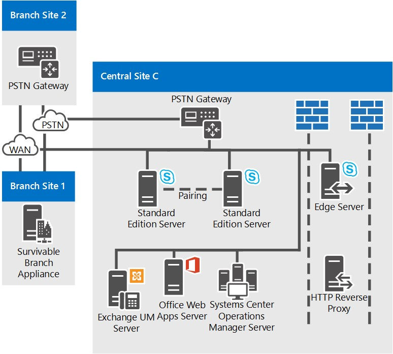

# Topologias de referência para Skype for Business Server

Topologias de referência para Skype for Business Server, incluindo diagramas e decisões a tomar para organizações grandes, médias e pequenas.

A melhor Skype for Business Server topologia para você depende do tamanho da sua organização, das cargas de trabalho que você deseja implantar e das suas preferências por alta disponibilidade versus custo de investimento.

Esta seção descreve três topologias de referência de exemplo, incluindo o raciocínio por trás de muitas das decisões que foram fatoradas em cada topologia.

## Topologia de referência para uma pequena organização

A topologia de referência para pequenas organizações mostra como você pode implantar uma solução robusta e altamente disponível implantando apenas três servidores executando Skype for Business Server.

**Topologia de referência para pequenas organizações**

- **Par de servidores Edição Standard implantados** Essa organização tem 4.000 usuários em seu site central. Eles implantaram dois servidores Edição Standard e os emparelhou para habilitar alta disponibilidade e recuperação de desastres. Cada servidor tem 2.000 usuários, mas as informações sobre todos os usuários são sincronizadas entre os dois servidores. Se um cair, um administrador poderá fazer fail over desses usuários para serem atendidos pelo outro servidor, com um mínimo de interrupção para os usuários. Para obter mais informações sobre recursos de recuperação de desastres e alta disponibilidade no Skype for Business Server, consulte [Plan for high availability and disaster recovery in Skype for Business Server](../../plan-your-deployment/high-availability-and-disaster-recovery/high-availability-and-disaster-recovery.md).

- **A implantação de um Servidor de Borda é recomendada.** Embora não seja necessário ter um Servidor de Borda para IM, presença e conferência, nós o recomendamos até mesmo para pequenas implantações. Você pode maximizar seu Skype for Business Server investimento implantando um Servidor de Borda para fornecer serviço aos usuários atualmente fora dos firewalls da sua organização. Os benefícios são os seguintes:

  - Os próprios usuários da sua organização podem usar Skype for Business Server funcionalidade, se eles estão trabalhando em casa ou estão na estrada.

  - Seus usuários podem convidar usuários de fora para participar de reuniões.

  - Se você tiver um parceiro, fornecedor ou organização do cliente que também usa Skype for Business Server, poderá formar um relacionamento federado com essa organização. Sua Skype for Business Server implantação reconheceria os usuários dessa organização federada, levando a uma melhor colaboração.

  - Seus usuários podem trocar mensagens instantâneas com usuários de alguns serviços públicos de mensagens instantâneas.

- **Sobrevivência do site filial.** Esta organização está executando um programa piloto do recurso Enterprise Voice de Skype for Business Server. Alguns usuários estão usando Skype for Business Server como sua única solução de voz. Alguns desses usuários Enterprise Voice piloto estão localizados no site da filial. O site de filial não tem um link confiável de rede de ampla área (WAN) para o site central, portanto, um Aparelho de Filial Desavivável é implantado lá. Com isso implantado, se o link WAN for baixado, os usuários no site da filial ainda poderão fazer e receber chamadas (chamadas dentro da organização e chamadas PSTN), ter funcionalidade de caixa postal e se comunicar com mensagens instantâneas de duas partes (IM). Os usuários ainda podem ser autenticados quando um link WAN estiver indisponível. Para obter mais informações, [consulte Plan for Enterprise Voice resiliency in Skype for Business Server](../../plan-your-deployment/enterprise-voice-solution/enterprise-voice-resiliency.md).

- **Implantação do Exchange do UM.** Essa topologia de referência inclui um servidor Exchange unificação de mensagens (UM), que executa Microsoft Exchange Server, não Skype for Business Server.

- **Office Servidor Web Apps.** Recomendamos a implantação de um servidor Office Web Apps ou um farm Office Web Apps Server em todas as organizações que usam webconferência. Office O Servidor web apps possibilita que PowerPoint slides sejam apresentados em webconferência..

## Topologia de referência para uma organização média

A topologia de referência com alta disponibilidade e um único data center é projetada para uma organização de pequeno a médio porte com um local central. A topologia exata no diagrama a seguir é para uma organização de 20.000 usuários.

**Topologia de referência para organizações médias**

- **Acomodar mais usuários, adicionando mais Servidores Front-End.** A topologia exata neste diagrama tem três Servidores Front-End para oferecer suporte a 20.000 usuários. Se você tiver um único site central e mais usuários, poderá simplesmente adicionar mais Servidores Front-End ao pool. O número máximo de usuários por pool é de 80.000, com doze Servidores Front-End.

    No entanto, a topologia de site único pode dar suporte a mais usuários adicionando outro pool de Front-End ao site.

- **A Recuperação de Desastre pode ser adicionada.** Para essa organização, a alta disponibilidade para seus serviços Skype for Business Server é um recurso necessário, mas a recuperação de desastres não é. O pool de Servidores Front-End implantados fornece alta disponibilidade.

    Se eles quiserem adicionar a capacidade de recuperação de desastres, eles podem considerar estabelecer outro datacenter e adicionar outro pool de Front-End lá e emparelhá-lo com o pool de Front-End em seu datacenter atual. Em seguida, se houver um desastre afetando seu pool principal, os administradores poderão fazer fail over users para o pool de backup.

- **Servidores back-end são espelhados** Para oferecer mais alta disponibilidade para recursos básicos do usuário, a organização implantou um par espelhado de Servidores Back-End para cada pool de Front-End.

- **Opções de banco de dados do Monitoring Server.** Essa organização implantou o Monitoramento para garantir a qualidade de chamadas Enterprise Voice e conferências A/V. O monitoramento é implantado em todos os Servidores Front-End e o banco de dados de Monitoramento é alocado com os Servidores Back-End. Também suportamos topologias nas quais o banco de dados de Monitoramento está localizado em um servidor separado.

- **Alta disponibilidade do Servidor de Borda** Neste exemplo de organização com 20.000 usuários, apenas um Servidor de Borda seria suficiente para o desempenho. No entanto, eles implantaram um pool de dois Servidores de Borda implantados para fornecer alta disponibilidade.

- **Opções de implantação de site de filiais.** A organização nesta topologia tem o Enterprise Voice implantado como sua solução de voz. O Branch Site 1 não tem um link wan (rede de área ampla) resiliente para o site central, portanto, ele tem um Aparelho de Filial Persistente implantado para manter muitos recursos Skype for Business Server caso o link WAN para o site central seja baixado. No entanto, o Site de Filial 2 tem um link WAN resiliente, portanto, apenas um gateway PSTN (rede telefônica pública comutada) é necessário. O gateway PSTN implantado tem suporte para bypass de mídia, portanto, nenhum Servidor de Mediação é necessário na Filial 2. Para obter mais informações, [consulte Plan for Enterprise Voice resiliency in Skype for Business Server](../../plan-your-deployment/enterprise-voice-solution/enterprise-voice-resiliency.md).

- **Balanceamento de carga do DNS.** O pool de Front-End e o pool de Servidor de Borda têm balanceamento de carga DNS para tráfego SIP implantado. Isso elimina a necessidade de balanceadores de carga de hardware para os Servidores de Borda e reduz significativamente a configuração e a manutenção dos balanceadores de carga de hardware para os outros pools, pois os balanceadores de carga de hardware são necessários somente para tráfego HTTP. Para obter mais informações, consulte [DNS load balancing](../../plan-your-deployment/network-requirements/load-balancing.md#BKMK_DNSLoadBalancing).

- **Implantação do Exchange do UM.** Essa topologia de referência inclui um servidor Exchange unificação de mensagens (UM), que executa Microsoft Exchange Server, não Skype for Business Server.

- **Office Servidor Web Apps.** Recomendamos a implantação de um servidor Office Web Apps ou um farm Office Web Apps Server em todas as organizações que usam webconferência. Office O Servidor web apps possibilita que os slides do Powerpoint sejam apresentados em webconferência.

- **Os diretores podem ser adicionados.** Se essa organização quisesse ajudar a aumentar a segurança contra ataques de negação de serviço, ela também poderia implantar um pool de Diretores. Um Diretor é uma função de servidor opcional separada Skype for Business Server que não tem contas de usuário em casa ou fornece serviços de presença ou conferência. Ele serve como um servidor interno de próximo salto para o qual um Servidor de Borda encaminha o tráfego SIP de entrada destinado a servidores internos. O Diretor pré-autentica solicitações de entrada e as redireciona para o pool ou servidor do usuário. A pré-autenticação no Diretor permite a entrega de solicitações de contas de usuário desconhecidas para a implantação. Um Diretor ajuda a isolar servidores front-end de tráfego mal-intencionado, como ataques de negação de serviço (DoS). Se a rede for inundada com tráfego externo inválido em tal ataque, o tráfego terminará no Diretor.

- **System Center O Operations Manager é recomendado.** Recomendamos que você monitore a saúde da sua implantação Skype for Business Server para ajudar a garantir a disponibilidade do serviço para usuários finais. Você pode usar o System Center de Gerenciamento do Operations Manager para Skype for Business que está disponível como download gratuito da Microsoft. Com o Skype for Business Management Pack, você pode obter alertas em tempo real proativamente quando ocorrerem problemas, executar transações sintéticas para testar a funcionalidade de ponta Skype for Business, obter relatórios para disponibilidade do serviço e assim por diante. Isso ajuda você a responder proativamente a problemas com sua implantação antes que os usuários finais os experimentem.

## Topologia de referência para uma organização grande

A topologia de referência para uma grande organização com suporte a vários data centers é para qualquer tamanho de organização com mais de um site central. A topologia exata no diagrama a seguir é para uma organização de 50.000 usuários, com 20.000 usuários no Site Central A, 20.000 no Site Central B e um total de 10.000 em Sites Centrais C e sites de filial. O tipo de topologia mostrada neste diagrama pode acomodar organizações com qualquer número de usuários.

Além da alta disponibilidade fornecida por pools de Servidores Front-End, essa topologia adiciona suporte à recuperação de desastres. Os pools de Front-End nos Sites Centrais A e B são emparelhados. Se um desses pools cair, o administrador poderá transferir os serviços dos usuários afetados para o pool emparelhado no site não afetado.

Essa topologia é mostrada em vários diagramas, com uma visão geral primeiro seguida de exibições detalhadas dos sites centrais.

**Visão geral da topologia de referência para grandes organizações com vários data centers**

**Topologia de referência para grandes organizações: exibição detalhada do Site Central A**

**Topologia de referência para grandes organizações: exibição detalhada do Site Central B**

**Topologia de referência para grandes organizações: exibição detalhada do Site Central C**

- **Os pools de front-end são emparelhados para habilitar a recuperação de desastres.** Os pools de Front-End no Site A e no Site B são emparelhados uns com os outros, para oferecer suporte à recuperação de desastres. Se o pool em um site falhar, o administrador poderá fazer fail over dos usuários desse site para o pool de Front-End emparelhado no outro site, com um mínimo de interrupção de serviço para os usuários. Cada um desses dois pools de Front-End tem seis servidores, o que é suficiente para todos os 40.000 usuários em ambos os pools em caso de failover. Para obter mais informações, [consulte Plan for high availability and disaster recovery in Skype for Business Server](../../plan-your-deployment/high-availability-and-disaster-recovery/high-availability-and-disaster-recovery.md).

- **Servidores back-end são espelhados** Para oferecer mais alta disponibilidade para recursos básicos do usuário, a organização implantou um par espelhado de Servidores Back-End para cada pool de Front-End. Esta é uma topologia opcional e você pode optar por implantar um único Servidor Back-End. SQL clustering e grupos de Disponibilidade AlwaysOn também são suportados. Para obter mais informações, consulte [Back End Server high availability in Skype for Business Server](../../plan-your-deployment/high-availability-and-disaster-recovery/back-end-server.md).

- **Usando Edição Standard servidor em um site de filial.** Essa organização considera o Site C como um site de filial porque tem apenas 600 funcionários. No entanto, os usuários de lá têm muitas conferências A/V entre si. Se ele foi implantado no Skype for Business Server como um site de filial, a mídia dessas conferências seria executado pela WAN (rede de ampla área) de e para um site central que tem um Servidor de Front-End implantado. Para evitar essa carga de largura de banda potencial, eles instalaram um par de servidores Edição Standard neste site, que hospedará essas conferências. E como Edição Standard servidores estão instalados lá, Skype for Business Server por definição o considera um site central e é tratado como tal no Construtor de Topologias e na Ferramenta de Planejamento.

    Apenas um Edição Standard servidor seria suficiente para o desempenho aqui, mas a organização implantou dois e emparelhou-os para fornecer alta disponibilidade no caso de um servidor cair.

    Embora o Site C seja considerado um site central, você não precisa implantar Servidores de Borda lá. Neste exemplo, o Site C usará os Servidores de Borda implantados no Site A.

- **Monitoramento e Arquivamento** Essa organização implantou monitoramento e arquivamento. Quando você implanta Monitoramento ou Arquivamento, ele é executado em todos os Servidores Front-End. Os bancos de dados para esses recursos podem ser alocados com o Banco de Dados back-end ou localizados em um servidor separado. Essa organização localizou esses bancos de dados em um servidor separado dos Servidores Back-End, no Site Central B. Os bancos de dados aqui recebem dados de Monitoramento e Arquivamento dos Servidores Front-End em todos os sites.

- **Opções de implantação de site de filiais.** Essa organização tem na verdade mais de 50 sites de filial, apenas dois deles são mostrados nos diagramas detalhados. O Branch Site 1 não tem um link WAN resiliente para o site central, portanto, eles têm Aparelhos de Filial Persistente implantados para fornecer serviço de telefone no caso de o link WAN para o site central ficar para baixo. O Branch Site 2, no entanto, tem um link WAN resiliente, portanto, ele precisa apenas de um gateway PSTN (rede telefônica pública comutado). O gateway PSTN implantado tem suporte para bypass de mídia, portanto, nenhum Servidor de Mediação é necessário na Filial 2. Para obter detalhes sobre como decidir o que instalar em um site de filial, consulte [Plan for Enterprise Voice resiliency in Skype for Business Server](../../plan-your-deployment/enterprise-voice-solution/enterprise-voice-resiliency.md).

- **Tronco SIP e Servidor de Mediação.** Observe que, no Site Central B, o Servidor de Mediação não é alocado com os Servidores Front-End. Isso porque o Servidor de Mediação autônomo é recomendado para sites que usam tronco SIP. Na maioria das outras instâncias, recomendamos que você cole o Servidor de Mediação com o Servidor de Front-End. Para obter detalhes sobre topologias do Servidor de Mediação, consulte [Components and Toplogies for Mediation Server](/previous-versions/office/lync-server-2013/lync-server-2013-components-and-topologies-for-mediation-server) na documentação planejamento.

- **O Chat Persistente é Implantado.** Essa organização implantou os servidores necessários para habilitar o Chat Persistente. Ele implantou vários Servidores Front-End de Chat Persistente para lidar com a carga para o número de usuários no pool e para fornecer alta disponibilidade. Ele também implantou a Conformidade para Chat Persistente e localizou o Armazenamento de Chat Persistente e o Armazenamento de Conformidade de Chat Persistente em servidores separados. Esses armazenamentos podem ser alocados e podem até ser alocados com o Servidor back-end, mas essa organização optou por separá-los para oferecer um melhor desempenho.

    > [!NOTE]
    > O chat persistente está disponível no Skype for Business Server 2015, mas não tem mais suporte no Skype for Business Server 2019. A mesma funcionalidade está disponível no Teams. Para obter mais informações, consulte [Getting started with your Microsoft Teams upgrade](/microsoftteams/upgrade-start-here). Se você precisar usar o chat persistente, suas opções são migrar usuários que exigem essa funcionalidade para Teams ou continuar usando o Skype for Business Server 2015.

- **Balanceamento de carga do DNS.** O pool de Front-End e o pool do Servidor de Borda usam balanceamento de carga DNS. Isso elimina a necessidade de balanceadores de carga de hardware para a interface interna dos Servidores de Borda e reduz significativamente o tempo necessário para a instalação e manutenção dos balanceadores de carga de hardware para os outros pools, pois os balanceadores de carga de hardware são necessários apenas para o tráfego HTTP. Para obter mais informações, consulte (.. /.. /plan-your-deployment/network-requirements/load-balancing.md#BKMK_DNSLoadBalancing).

- **Implantação do Exchange do UM.** Skype for Business Server funciona com implantações locais de um Exchange Unificação de Mensagens (UM) e Exchange UM hospedadas. O Site Central A inclui um servidor Exchange Unificação de Mensagens (UM), que executa Microsoft Exchange Server, não Skype for Business Server. A Exchange de UM para Skype for Business Server é executado no pool de Front-End.

    O Site Central B usa Exchange, portanto, Exchange funcionalidade do Servidor de UM também está hospedada.

    Para obter detalhes sobre Exchange UM, consulte [On-Premises Exchange Unified Messaging Integration](/previous-versions/office/lync-server-2013/lync-server-2013-planning-for-exchange-unified-messaging-integration) and [Hosted Exchange Unified Messaging Integration](/previous-versions/office/lync-server-2013/lync-server-2013-hosted-exchange-unified-messaging-integration) na documentação de Planejamento.

- **Office Servidor Web Apps.** Recomendamos a implantação de um servidor Office Web Apps ou um farm Office Web Apps Server em todas as organizações que usam webconferência. Você pode implantar um único farm Office Web Apps Server em um site que atende ao tráfego de todos os sites ou implantá-lo em cada site. Office O Servidor web apps possibilita que os slides do Powerpoint sejam apresentados em webconferência.

- **Os diretores podem ser adicionados.** Se essa organização quisesse aumentar a segurança contra ataques de negação de serviço, ela também poderia implantar um pool de Diretores. Um Diretor é uma função de servidor opcional separada Skype for Business Server que não tem contas de usuário em casa ou fornece serviços de presença ou conferência. Ele serve como um servidor interno de próximo salto para o qual um Servidor de Borda encaminha o tráfego SIP de entrada destinado a servidores internos. O Diretor pré-autentica solicitações de entrada e as redireciona para o pool ou servidor do usuário. A pré-autenticação no Diretor permite a entrega de solicitações de contas de usuário desconhecidas para a implantação. Um Diretor ajuda a isolar servidores front-end de tráfego mal-intencionado, como ataques de negação de serviço (DoS). Se a rede for inundada com tráfego externo inválido em tal ataque, o tráfego terminará no Diretor.

- **System Center O Operations Manager é recomendado.** Recomendamos que você monitore a saúde da sua implantação Skype for Business Server para ajudar a garantir a disponibilidade do serviço para usuários finais. Você pode usar o System Center de Gerenciamento do Operations Manager para Skype for Business que está disponível como download gratuito da Microsoft. Com o Skype for Business Management Pack, você pode obter alertas em tempo real proativamente quando ocorrerem problemas, executar transações sintéticas para testar a funcionalidade de ponta Skype for Business, obter relatórios para disponibilidade do serviço e assim por diante. Isso ajuda você a responder proativamente a problemas com sua implantação antes que os usuários finais os experimentem.