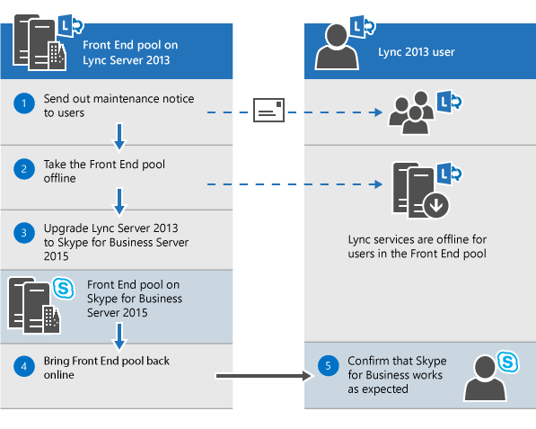

# Planejar a atualização para o Skype for Business Server 2015Plan to upgrade to Skype for Business Server 2015
 
Resumo: saiba mais sobre as coisas que você deve considerar ao planejar uma atualização para o Skype for Business Server 2015.Summary: Learn about the things you should consider when you plan an upgrade to Skype for Business Server 2015. Baixe uma avaliação gratuita do Skype for Business Server 2015 no Centro de Avaliação da Microsoft em: [https://www.microsoft.com/evalcenter/evaluate-skype-for-business-server](https://www.microsoft.com/evalcenter/evaluate-skype-for-business-server) .Download a free trial of Skype for Business Server 2015 from the Microsoft Evaluation center at: [https://www.microsoft.com/evalcenter/evaluate-skype-for-business-server](https://www.microsoft.com/evalcenter/evaluate-skype-for-business-server).
  
Como parte do seu plano de atualização para o Skype for Business Server 2015, use este tópico para entender os caminhos de atualização recomendados para o Skype for Business Server 2015, como funciona In-Place Atualização, quais são os cenários de coexistência suportados e como o processo de atualização é parecido.As part of your plan to upgrade to Skype for Business Server 2015, use this topic to understand the recommended upgrade paths to Skype for Business Server 2015, how the In-Place Upgrade works, what the supported coexistence scenarios are, and what the upgrade process looks like.

> [!NOTE]
> Atualizações in-place estavam disponíveis no Skype for Business Server 2015, mas não são mais suportadas no Skype for Business Server 2019.In-place upgrades were available in Skype for Business Server 2015 but are no longer supported in Skype for Business Server 2019. Coexistência lado a lado é suportada, consulte [Migration to Skype for Business Server 2019](../../SfBServer2019/migration/migration-to-skype-for-business-server-2019.md) para obter mais informações.Side by side coexistance is supported, see [Migration to Skype for Business Server 2019](../../SfBServer2019/migration/migration-to-skype-for-business-server-2019.md) for more information.
  
## Caminhos de atualização recomendados para o Skype for Business Server 2015Recommended upgrade paths to Skype for Business Server 2015

 Para atualizar do Lync Server 2013, do Lync Server 2010 ou do Office Communications Server 2007 R2 para o Skype for Business Server 2015, use os seguintes caminhos de atualização:To upgrade from Lync Server 2013, Lync Server 2010, or Office Communications Server 2007 R2 to Skype for Business Server 2015, use the following upgrade paths:
  
> [!CAUTION]
> In-Place Upgrade move automaticamente os diretórios de conferência do Lync Server 2013 para o Skype for Business Server 2015.In-Place Upgrade automatically moves conference directories from Lync Server 2013 to Skype for Business Server 2015. No entanto, se você planeja mover manualmente diretórios de conferência, é muito importante usar o Shell de Gerenciamento do Skype for Business Server 2015.However, if you plan to manually move conference directories it is very important to use the Skype for Business Server 2015 Management Shell. Se você tentar usar o Shell de Gerenciamento do Lync Server 2013 para mover diretórios de conferência do Lync Server 2013 para o Skype for Business Server 2015, poderá ocorrer perda de dados.If you try to use the Lync Server 2013 Management Shell to move conference directories from Lync Server 2013 to Skype for Business Server 2015 then data loss can occur. Em geral, sempre que você estiver trabalhando com o Skype for Business Server 2015 em qualquer capacidade, use o conjunto de ferramentas do Skype for Business Server 2015.In general, whenever you are working with Skype for Business Server 2015 in any capacity you should use the Skype for Business Server 2015 tool set.  
  
|**Versão****Version**|**Recomendações****Recommendations**|
|:-----|:-----|
|Lync Server 2013Lync Server 2013    | Para atualizar, use o Construtor de Topologias do Skype for Business Server e o novo recurso In-Place Atualização em cada um dos servidores associados ao pool.To upgrade, use the Skype for Business Server Topology Builder and the new In-Place Upgrade feature on each of the servers associated with the pool. consulte Planejar a atualização do [Lync Server 2013 para o Skype for Business Server 2015](upgrade.md#BKMK_PlanUpgradeFromLync2013) e Atualizar para [o Skype for Business Server 2015](../deploy/upgrade-to-skype-for-business-server.md) para etapas detalhadas.see [Plan to upgrade from Lync Server 2013 to Skype for Business Server 2015](upgrade.md#BKMK_PlanUpgradeFromLync2013) and [Upgrade to Skype for Business Server 2015](../deploy/upgrade-to-skype-for-business-server.md) for detailed steps.   |
|Lync Server 2010 + Lync Server 2013 (modo dual)Lync Server 2010 + Lync Server 2013 (dual-mode)    |Primeiro, atualize para o Lync Server 2013 e, em seguida, atualize para o Skype for Business Server 2015 usando o novo recurso In-Place Upgrade.First, upgrade to Lync Server 2013, and then upgrade to Skype for Business Server 2015 by using the new In-Place Upgrade feature. No entanto, se sua topologia for o Lync Server 2010 principal, você também poderá reverter os componentes do Lync Server 2013 para o Lync Server 2010 e atualizar diretamente para o Skype for Business Server 2015.However, if your topology is primary Lync Server 2010 you can also roll back the Lync Server 2013 components to Lync Server 2010 and then upgrade directly to Skype for Business Server 2015. Nesse caso, você não seria capaz de tirar proveito do In-Place Upgrade e usaria a co-existência direta entre o Lync Server 2010 e o Skype for Business Server 2015.In this case you would not be able to take advantage of In-Place Upgrade and would use straight co-existence between Lync Server 2010 and Skype for Business Server 2015. A tri-existência não é suportada, mas há suporte para a co-existência.Tri-existence is not supported but co-existence is supported.    |
|Lync Server 2010Lync Server 2010    |Traga um novo pool do Skype for Business Server 2015 e migre usuários para esse novo pool.Bring up a new Skype for Business Server 2015 pool and then migrate users to this new pool. Em seguida, você pode desmantelar o pool antigo do Lync Server 2010.You can then decommission the old Lync Server 2010 pool. A atualização do Lync Server 2010 para o Skype for Business Server 2015 é semelhante à atualização do Lync Server 2010 para o Lync Server 2013.Upgrading from Lync Server 2010 to Skype for Business Server 2015 is similar to upgrading from Lync Server 2010 to Lync Server 2013. Consulte [Migração do Lync Server 2010 para o Lync Server 2013](/previous-versions/office/lync-server-2013/migration-from-lync-server-2010-to-lync-server-2013).See [Migration from Lync Server 2010 to Lync Server 2013](/previous-versions/office/lync-server-2013/migration-from-lync-server-2010-to-lync-server-2013).    |
|Office Communications Server 2007 R2Office Communications Server 2007 R2    | Escolha uma das duas opções:Pick one of two options:    Configurar um novo ambiente do Skype for Business Server 2015.Set up a new Skype for Business Server 2015 environment.    Ou se seu hardware e software atenderem aos requisitos do Skype for Business Server 2015, atualize para o Lync Server 2013 e atualize para o Skype for Business Server 2015 usando o novo recurso de atualização In-Place.Or if your hardware and software meet the requirements for Skype for Business Server 2015, upgrade to Lync Server 2013, and then upgrade to Skype for Business Server 2015 by using the new In-Place Upgrade feature. Para obter mais informações, consulte Requisitos de servidor para [Skype for Business Server 2015](requirements-for-your-environment/server-requirements.md) e Migração do Office Communications Server [2007 R2 para Lync Server 2013](/previous-versions/office/lync-server-2013/migration-from-office-communications-server-2007-r2-to-lync-server-2013).For more information, see [Server requirements for Skype for Business Server 2015](requirements-for-your-environment/server-requirements.md) and [Migration from Office Communications Server 2007 R2 to Lync Server 2013](/previous-versions/office/lync-server-2013/migration-from-office-communications-server-2007-r2-to-lync-server-2013).    |
   
> [!NOTE]
> SQL Server 2014 é suportado no Skype for Business Server 2015, mas não tem suporte no Lync Server 2013.SQL Server 2014 is supported in Skype for Business Server 2015 but is not supported in Lync Server 2013. Se você quiser atualizar do SQL Server 2012 para o SQL Server 2014, o pool deve primeiro ser atualizado para o Skype for Business Server 2015 usando o método In-Place Upgrade conforme descrito neste documento.If you want to upgrade from SQL Server 2012 to SQL Server 2014 then the pool must first be upgraded to Skype for Business Server 2015 using the In-Place Upgrade method as described in this document. Em seguida, você pode atualizar SQL Server 2012 para SQL Server 2014, consulte [Upgrade to SQL Server 2014](/sql/database-engine/install-windows/upgrade-sql-server?viewFallbackFrom=sql-server-2014).You can then upgrade from SQL Server 2012 to SQL Server 2014, see [Upgrade to SQL Server 2014](/sql/database-engine/install-windows/upgrade-sql-server?viewFallbackFrom=sql-server-2014). Para saber mais sobre os requisitos de banco de dados, consulte [Requisitos de servidor para Skype for Business Server 2015](requirements-for-your-environment/server-requirements.md).To learn more about database requirements, see [Server requirements for Skype for Business Server 2015](requirements-for-your-environment/server-requirements.md). 
  
## Planejar a atualização do Lync Server 2013 para o Skype for Business Server 2015Plan to upgrade from Lync Server 2013 to Skype for Business Server 2015

Você pode atualizar os sistemas do Lync Server 2013 para o Skype for Business Server 2015 usando o novo recurso In-Place Upgrade.You can upgrade Lync Server 2013 systems to Skype for Business Server 2015 using the new In-Place Upgrade feature. A atualização local fornece uma solução de um clique que faz o back up de certificados, desinstala componentes de servidor, atualiza bancos de dados locais e instala as funções do Skype for Business Server 2015.In-place upgrade provides a one-click solution that backs up certificates, uninstalls server components, upgrades local databases, and installs the Skype for Business Server 2015 roles. A atualização in-locar procura preservar os investimentos existentes em hardware e servidor, reduzindo o custo geral para implantar o Skype for Business Server 2015.In-place upgrade seeks to preserve existing hardware and server investments, reducing the overall cost to deploy Skype for Business Server 2015.
  
> [!NOTE]
> In-Place Upgrade permite que você use o mesmo hardware ao atualizar para o Skype for Business Server.In-Place Upgrade allows you to use the same hardware when upgrading to Skype for Business Server. No entanto, o reutilizamento do mesmo hardware não se traduz na mesma capacidade de desempenho.However, reusing the same hardware does not translate into the same performance capacity. Você não deve esperar que as cargas de desempenho do Lync Server 2013 e do Skype for Business Server 2015 sejam idênticas.You should not expect the performance loads for Lync Server 2013 and Skype for Business Server 2015 to be identical. 
  
> [!NOTE]
> In-Place atualização não dá suporte a alta disponibilidade ou recuperação de desastres para o Skype for Business Server.In-Place upgrade does not support high availability or disaster recovery for Skype for Business Server. 
  
A atualização in-locar envolve colocar o pool do Lync Server 2013 offline e atualizando-o para um pool do Skype for Business Server 2015.In-place upgrade involves taking the Lync Server 2013 pool offline and upgrading it to a Skype for Business Server 2015 pool. 
  
### Criar um In-Place de atualizaçãoCreate an In-Place Upgrade plan

Faça um plano que inclua:Make a plan that includes:
  
1. Uma compreensão da sua topologia atual.An understanding of your current topology.
    
    > [!NOTE]
    > Certifique-se de desinstalar a ferramenta de administração LRS para o Lync Server 2013 antes de executar In-Place Atualização.Be sure to uninstall LRS Admin tool for Lync Server 2013 before running In-Place Upgrade. A Ferramenta de Administração LRS do Lync Server 2013 não pode coexistir com o Skype for Business Server 2015.The LRS Admin Tool for Lync Server 2013 cannot coexist with Skype for Business Server 2015. Depois de executar In-Place Upgrade, instale a nova ferramenta de Administração do LRS.After running In-Place Upgrade install the new LRS Admin tool. Consulte [Microsoft Lync Room System Administrative Web Portal for Skype for Business Server 2015](https://go.microsoft.com/fwlink/?LinkID=544807) para obter mais detalhes.See [Microsoft Lync Room System Administrative Web Portal for Skype for Business Server 2015](https://go.microsoft.com/fwlink/?LinkID=544807) for more details.
  
2. O pool principal para a atualização.The primary pool for the upgrade.
    
3. Se você atualizará os bancos de dados de Arquivamento e Monitoramento ou criará novos.Whether you'll upgrade the Archiving and Monitoring databases or create new ones.
    
4. O In-Place de Atualização que você usará: Offline ou Mover Usuários.The In-Place Upgrade method you'll use: Offline or Move Users. Como parte do Move Users, você também precisará migrar os diretórios globais de conferência associados ao pool principal.As part of Move Users you also will need to migrate the global conference directories associated with the primary pool. 
    
5. Um plano de comunicação para usuários afetados.A communication plan for impacted users.
    
6. Um plano de backup caso as atualizações falhem.A backup plan in case the upgrades fails.
    
Todos os usuários que estão no pool principal enquanto ele estiver sendo atualizado não poderão usar os serviços até que a atualização seja concluída.Any users that are in the primary pool while it's being upgraded won't be able to use the services until the upgrade is complete. Se você tiver um pool secundário funcionando, poderá evitar afetar os usuários movendo-os para o pool secundário antes da atualização.If you have a working secondary pool, you can avoid impacting users by moving them to the secondary pool before the upgrade. Após a atualização, mova os usuários de volta para o pool principal.After the upgrade, move the users back to the primary pool.
  
### Métodos de atualização in-in-placeIn-place upgrade methods

Há dois cenários para a In-Place Upgrade:There are two scenarios for In-Place Upgrade: 
  
- O método Move User, que não requer tempo de inatividade para os usuários.The Move User method, which requires no downtime for users. 
    
- O método Offline, que requer tempo de inatividade.The Offline method, which requires downtime.
    
Recomendamos que uma atualização do método Offline seja agendada durante uma janela de manutenção e os usuários sejam notificados do tempo de inatividade.We recommend that an Offline method upgrade be scheduled during a maintenance window and users are notified of the downtime.
  
> [!NOTE]
> Ao atualizar um pool emparelhado no Lync Server 2013 e você deseja atualizar ambos os pools para o Skype for Business Server 2015.When upgrading a paired pool on Lync Server 2013 and you want to upgrade both pools to Skype for Business Server 2015. Certifique-se de atualizar o segundo pool imediatamente após a atualização do primeiro pool.Make sure to upgrade the second pool immediately after upgrading the first pool. Quando um pool estiver executando o Lync Server 2013 e o segundo pool estiver executando o Skype for Business Server 2015, as opções de recuperação de desastres serão minimizadas.When one pool is running Lync Server 2013 and the second pool is running Skype for Business Server 2015 then disaster recovery options are minimized. Por exemplo, se um pool estiver executando 2013 e o segundo for 2015 e houver um desastre, você poderá ter perda de dados porque o failover do pool não é suportado no modo de desastre quando pools emparelhados não são a mesma versão.For example, if one pool is running 2013 and the second is 2015 and there is a disaster then you could experience data loss because pool failover is not supported in disaster mode when paired pools are not the same version. 
  
#### Método Offline de atualização in-locarIn-place upgrade Offline method

Use este método se você não quiser mover usuários entre pools de usuários.Use this method if you don't want to move users between user pools. Durante a atualização, os usuários não poderão usar os serviços do Lync ou do Skype for Business.During the upgrade, users will not be able to use Lync or Skype for Business services. 
  
O diagrama a seguir mostra uma visão geral desse processo.The following diagram shows an overview of this process.
  

  
> [!NOTE]
> Se você tiver pools emparelhados, não desempacodá-los antes da atualização.If you have paired pools, do not unpair them before the upgrade. 
  
Depois de começar a atualizar um pool de servidores, você deve concluir a atualização de todo o pool.Once you start to upgrade a server pool, you must complete the upgrade of the entire pool. O Skype for Business Server não dá suporte a ter apenas uma parte do pool atualizada.Skype for Business Server doesn't support having only a portion of the pool upgraded. 
  
#### Método Move Users (sem tempo de inatividade do usuário)Move Users method (no user downtime)

Para usar esse método, você move os usuários para outro pool antes de iniciar a atualização.To use this method, you move users to another pool before you start the upgrade. Durante a atualização, os usuários podem usar os serviços do Lync.During the upgrade, users can use Lync services. Depois que eles são movidos para o pool atualizado, eles podem usar o Skype for Business.After they're moved to the upgraded pool, they can use Skype for Business. O diagrama a seguir mostra uma visão geral desse processo.The following diagram shows an overview of this process.
  
> [!IMPORTANT]
> Como parte do Move Users, você também precisará migrar os diretórios globais de conferência associados ao pool principal.As part of Move Users you also will need to migrate the global conference directories associated with the primary pool. A conferência discada PSTN ainda resolverá o ConferenceID para o pool que está sendo atualizado, em vez do pool emparelhado.PSTN dial-in conferencing will still resolve ConferenceID to the pool being upgraded, instead of the paired pool. Portanto, você precisa mover diretórios de conferência, se ainda quiser que as conferências PSTN agendadas no pool sejam acessíveis durante a atualização.So you need to move Conference Directories, if you still want PSTN conferences scheduled in the pool to be accessible during upgrade. 
  

  
#### Mover usuários para atualização de hardwareMove users for hardware upgrade

 Se o hardware não atender aos requisitos do Servidor do [Skype for Business Server 2015,](requirements-for-your-environment/server-requirements.md)configurar um novo ambiente do Skype for Business Server 2015 e mover os usuários para lá.If your hardware doesn't meet the [Server requirements for Skype for Business Server 2015](requirements-for-your-environment/server-requirements.md), set up a new Skype for Business Server 2015 environment, and move users there. O diagrama a seguir mostra uma visão geral desse processo para atualização do Lync Server 2010.The following diagram shows an overview of this process for upgrade from Lync Server 2010. 
  

  
### Processo de atualização in-locoIn-place upgrade process

 Atualizar do Lync Server 2013 para o Skype for Business Server 2015 usando as seguintes etapas:Upgrade from Lync Server 2013 to Skype for Business Server 2015 using the following steps:
  
1. Faça o back up de todos os bancos de dados antes da atualização.Back up all databases before the upgrade.
    
2. Certifique-se de que todos os serviços que devem ser atualizados estão em estado de execução.Make sure all services that are to be upgraded are in a running state.
    
3. Atualize e publique o arquivo de topologia usando o construtor de topologias.Upgrade and publish the topology file using the topology builder.
    
4. Pare todos os serviços em todos os servidores Front-End.Stop all services on all Front End servers.
    
5. Instale novos pré-requisitos necessários para o Skype for Business Server.Install new prerequisites required for Skype for Business Server.
    
6. Em cada servidor front-end, inicie o In-Place Upgrade.On each Front End server, start the In-Place Upgrade.
    
7. Quando a atualização for concluída, reinicie todos os serviços.When the upgrade is complete, restart all services.
    
   - Para o pool de Front-End, reinicie os serviços usando o comando Start-CsPool.For the Front End pool, restart services using the command Start-CsPool.
    
   - Para servidores que não são front-end, use Start-CSWindowsService.For non-Front End servers, use Start-CSWindowsService.
    
> [!NOTE]
>  Se você não quiser atualizar seus bancos de dados de Arquivamento e Monitoramento existentes, remova a dependência antes de atualizar a topologia.If you don't want to upgrade your existing Archiving and Monitoring databases, remove the dependency before you upgrade the topology. Se você quiser criar novos bancos de dados de Arquivamento e Monitoramento, durante a atualização, poderá criar um novo SQL e associá-lo ao pool.If you want to create new Archiving and Monitoring databases, during the upgrade, you can create a new SQL store and associate it with the pool. Você pode encontrar as etapas sobre como fazer isso no tópico Upgrade[to Skype for Business Server 2015](../deploy/upgrade-to-skype-for-business-server.md).You can find the steps on how to do this in the topic,[Upgrade to Skype for Business Server 2015](../deploy/upgrade-to-skype-for-business-server.md). > atualização local não dá suporte a alta disponibilidade ou recuperação de desastres para o Skype for Business Server.>  In-place upgrade does not support high availability or disaster recovery for Skype for Business Server. Para evitar interromper os serviços dos usuários, use o método [Move Users (sem](upgrade.md#bkmk_MoveUsersMethod) tempo de inatividade do usuário) para atualizar.> Durante o processo de atualização, a réplica xds é colocada na pasta compartilhada local na unidade de disco com mais espaço livre.To avoid interrupting users' services, use the [Move Users method (no user downtime)](upgrade.md#bkmk_MoveUsersMethod) to upgrade.>  During the upgrade process the xds-replica is placed in the local shared folder on the disk drive with the most free space. Se esse disco for removido posteriormente, você poderá executar problemas como serviços que não estão sendo a partir.If that disk is later removed then you can run into issues such as services not starting.
  
### Ordem de atualizaçãoUpgrade order

Atualize a topologia de dentro para fora.Upgrade the topology from the inside to the outside. Atualize todos os pools primeiro, depois os servidores de borda e, por fim, o pool do CmS (Armazenamento de Gerenciamento Central).Upgrade all your pools first, then the edge servers, and finally the Central Management Store (CMS) pool. 
  
### Considerações sobre autenticação KerberosKerberos authentication considerations

Se você usar a autenticação Kerberos para Serviços Web, deverá reatribuir contas Kerberos e redefinir a senha após a conclusão In-Place Atualização.If you use Kerberos authentication for Web Services, you must reassign Kerberos accounts and reset the password after the In-Place Upgrade is complete. Para saber como fazer isso, consulte [Configurando a autenticação Kerberos](/previous-versions/office/lync-server-2013/lync-server-2013-setting-up-kerberos-authentication).To learn how to do this, see [Setting up Kerberos authentication](/previous-versions/office/lync-server-2013/lync-server-2013-setting-up-kerberos-authentication).
  
## Suporte para coexistência com o Lync Server 2013 e o Lync Server 2010Support for coexistence with Lync Server 2013 and Lync Server 2010

Você pode executar o Skype for Business Server 2015 na mesma topologia que o Lync Server 2013 ou o Lync Server 2010, mas não pode ter todos os três na mesma topologia.You can run Skype for Business Server 2015 in the same topology as Lync Server 2013 or Lync Server 2010, but you can't have all three in the same topology.
  
Se você tiver uma co-existência entre o Lync Server 2010 e o Lync Server 2013, é recomendável atualizar toda a topologia para o Lync Server 2013 e atualizar para o Skype for Business Server 2015 usando a Atualização In-Place.If you have a co-existence between Lync Server 2010 and Lync Server 2013, it is recommended to upgrade the entire topology to Lync Server 2013, and then upgrade to Skype for Business Server 2015 using the In-Place Upgrade. Para obter mais informações, [consulte Migration from Lync Server 2010 to Lync Server 2013](/previous-versions/office/lync-server-2013/migration-from-lync-server-2010-to-lync-server-2013).For more information, see [Migration from Lync Server 2010 to Lync Server 2013](/previous-versions/office/lync-server-2013/migration-from-lync-server-2010-to-lync-server-2013).
  
Se sua topologia for principalmente o Lync Server 2010, reverter os componentes do Lync Server 2013 para o Lync Server 2010 antes de atualizar a topologia para o Skype for Business Server 2015.If your topology is primarily Lync Server 2010, roll back the Lync Server 2013 components to Lync Server 2010 before upgrading the topology to Skype for Business Server 2015. Nesse caso, você perde o benefício do In-Place Upgrade e tem uma topologia de co-existência entre o Lync Server 2010 e o Skype for Business Server 2015.In this case, you lose the benefit of the In-Place Upgrade and have a co-existence topology between Lync Server 2010 and Skype for Business Server 2015.
  
O diagrama a seguir mostra o suporte de coexistência do Skype for Business Server 2015 com o Lync Server 2013 e o Lync Server 2010.The following diagram shows the coexistence support of Skype for Business Server 2015 with Lync Server 2013 and Lync Server 2010.
  

  
## Processo de atualização com dispositivo e servidor de filial existentesUpgrade process with existing Survivable Branch Appliance and Server

O Skype for Business Server 2015 não dá suporte a uma atualização In-Place de um Dispositivo de Filial (SBA) ou um Servidor de Filial (SBS) que sobrevive.Skype for Business Server 2015 doesn't support an In-Place Upgrade of a Survivable Branch Appliance (SBA) or a Survivable Branch Server (SBS).
  
No entanto, suportamos a coexistência dos datacenters do Skype for Business Server com o Lync Server 2010 ou o Lync Server 2013 SBA/SBS.However, we do support coexistence of Skype for Business Server datacenters with Lync Server 2010 or Lync Server 2013 SBA/SBS. 
  
Ao planejar uma atualização In-Place de um pool de Front-End do Lync Server 2013 (FE) com uma filial associada, você pode deixar os usuários existentes no SBA/SBS do Lync Server 2013.When planning for an In-Place Upgrade of a Lync Server 2013 Front End (FE) pool with an associated branch, you can leave the existing users on the Lync Server 2013 SBA/SBS. Durante a atualização, os usuários do SBA/SBS entrarão no modo de resiliência e retornarão à funcionalidade normal após a conclusão da atualização.During the upgrade, the SBA/SBS users will go in resiliency mode and will return to normal functionality after the upgrade has completed. Para obter mais informações sobre a experiência dos usuários durante o modo de resiliência, consulte Recursos de resiliência de site de filial no [Lync Server 2013](/previous-versions/office/lync-server-2013/lync-server-2013-branch-site-resiliency-features).For more information about the users' experience during the resiliency mode, please see [Branch-site resiliency features in Lync Server 2013](/previous-versions/office/lync-server-2013/lync-server-2013-branch-site-resiliency-features).
  
Ao migrar uma topologia do Lync Server 2010 para o Skype for Business Server 2015, o SBA/SBS deve ser adicionado à topologia, semelhante à migração para o Lync Server 2013.When migrating a Lync Server 2010 topology to Skype for Business Server 2015, the SBA/SBS must re-added to the topology, similar to the migration to Lync Server 2013. Para as etapas necessárias, leia Conectando o Aparelho de Filial Suportável ao [pool de Front-End do Lync Server 2013](/previous-versions/office/lync-server-2013/lync-server-2013-connecting-survivable-branch-appliance-to-lync-server-2013-front-end-pool).For the required steps, please read [Connecting Survivable Branch Appliance to Lync Server 2013 Front End pool](/previous-versions/office/lync-server-2013/lync-server-2013-connecting-survivable-branch-appliance-to-lync-server-2013-front-end-pool).
  
Para topologias de coexistência do Lync Server 2010 e do Lync Server 2013, alinhe-se primeiro às recomendações feitas na seção 'Suporte à coexistência com o Lync Server 2013 e o Lync Server 2010'.For co-existence topologies of Lync Server 2010 and Lync Server 2013, align first to the recommendations made in the section 'Support for coexistence with Lync Server 2013 and Lync Server 2010'.
  
## Confira tambémSee also

[Atualizar para o Skype for Business Server 2015Upgrade to Skype for Business Server 2015](../deploy/upgrade-to-skype-for-business-server.md)
  
[Requisitos ambientais para o Skype for Business Server 2015Environmental requirements for Skype for Business Server 2015](requirements-for-your-environment/environmental-requirements.md)
  
[Requisitos de servidor para o Skype for Business Server 2015Server requirements for Skype for Business Server 2015](requirements-for-your-environment/server-requirements.md)