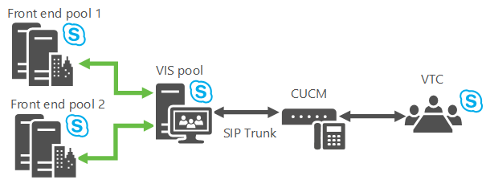

# Planejar o Servidor de Interop de Vídeo Skype for Business Server
 
**Resumo:** Revise este tópico ao planejar a integração Skype for Business Server com dispositivos de teleconferência de terceiros.
  
Skype for Business Server agora permite que você se integre a determinadas soluções de VTC (Video Teleconferencing System) de terceiros. A nova função de servidor que habilita essa interoperabilidade de videoconferência é o VIS (Video Interop Server), que atualmente é implementado como uma função de servidor autônoma disponível apenas para instalações locais. Um VIS atua como um intermediário entre um sistema de teleconferência de terceiros e uma implantação Skype for Business Server terceiros. Para essa versão, o VIS está focado na interoperabilidade com sistemas de vídeo cisco/Tandberg. Revise este artigo para determinar se esse recurso deve ser usado em sua Skype for Business Server instalação.
  
## Interoperabilidade de dispositivos

A interoperação é testada e suportada com VTCs cisco registrando-se com o Cisco Unified Communications Manager (CallManager ou CUCM) versão 10.5 e troncos SIP TCP definidos entre o CUCM e o VIS.
  
Os VTCs atualmente suportados são:
  
- Cisco C40
    
- Cisco C60
    
- Cisco C90
    
- Cisco MX200
    
- Cisco MX300
    
- Cisco DX80
    
- Cisco EX60
    
- Cisco EX90
    
- Cisco SX20
    
> [!NOTE]
>  A versão de software da Cisco TC7.0.0 ou superior é necessária nesses sistemas para que a integração com Skype for Business Server funcione conforme esperado.
  
## Troncos SIP

O Servidor de Interop de Vídeo funciona no modo de tronco SIP, onde os VTCs continuam a se registrar com a infraestrutura da Cisco existente , por exemplo, o Cisco Call Manager (CUCM). Um tronco SIP de vídeo é definido entre o CUCM e o VIS para que as chamadas possam ser roteados entre os dois sistemas. Há suporte apenas para chamadas sobre o tronco SIP do VTC para o VIS. Assim, os VTCs podem discar para uma conferência Skype for Business (discando o número de telefone associado ao Atendente Automatizado de Chamadas), mas não podem ser arrastados e deixados para a conferência.
  

  
## Recursos

Esta função de servidor fornece:
  
- Conversão entre os formatos H.264 usados por sistemas de vídeo de terceiros e a implantação Skype for Business Server de terceiros.
    
- Conversão de um único fluxo de vídeo em uma determinada resolução de um VTC em vários fluxos de simulcast de diferentes resoluções para uso na implantação Skype for Business Server. Esses fluxos podem ser enviados para a AVMCU e, em seguida, para Skype for Business Server pontos de extremidade e outros sistemas de vídeo que solicitaram resoluções diferentes. Essa conversão também é usada quando o sistema de vídeo de terceiros está envolvido em uma chamada Skype for Business conferência A/V. Depois que o limite de transcodificação for atingido em um determinado servidor VIS, quaisquer solicitações a seguir para resoluções diferentes receberão apenas um fluxo com a resolução mais baixa. 
    
- Suporte para um tronco SIP de vídeo entre o gateway CUCM e um servidor de Skype for Business Server de vídeo; Os VTCs continuam se registrando com o gateway cisco e iniciam chamadas para a implantação Skype for Business por meio do gateway. As chamadas são roteados do gateway para o servidor de Skype for Business vídeo sobre o tronco SIP de vídeo.
    
- Suporte para um usuário em uma sala de conferência com um sistema de vídeo com suporte para discar desse sistema para ingressar em uma conferência aberta ou fechada. Essa chamada percorrerá o tronco SIP de vídeo.
    
- Suporte para um usuário em uma sala de conferência com um sistema de vídeo com suporte para chamar um Skype for Business cliente. A chamada percorrerá o tronco SIP.
    
- Suporte para o controle de chamadas médias do lado Skype for Business Server ou do sistema VTC com suporte para chamadas ponto a ponto e de vários pontos, incluindo áudio mudo/não mudo, vídeo de pausa/retomada, vídeo de bloqueio e chamada de bloqueio/não bloqueio.
    
## Limitações conhecidas

Esta função de servidor tem as seguintes limitações:
  
- Novas chamadas da implantação Skype for Business para os VTCs sobre o tronco SIP de vídeo não são suportadas. . Isso significa que apenas novas chamadas dos VTCs para a implantação Skype for Business são suportadas no tronco SIP de vídeo. A presença do sistema de vídeo com suporte não estará disponível no tronco SIP de vídeo para o VIS. 
    
- Somente um pool VIS autônomo terá suporte para o modo de tronco SIP de vídeo.
    
-  TLS + SRTP ou TCP + RTP terão suporte para comunicações entre o VTC e o VIS sobre o tronco SIP de vídeo.
    
- Não há suporte para compartilhamento de aplicativos. Um Skype for Business usuário na sala de conferência precisa ingressar na conferência Skype for Business (por meio de um laptop, por exemplo) e exibir as telas de compartilhamento de aplicativos em um dos monitores gratuitos na sala de conferência não associado ao VTC.
    
- Não há suporte para a capacidade de um VTC ingressar em uma reunião federada por meio do VIS.
    
- Não há suporte para a capacidade de um VTC ingressar em uma reunião online por meio do VIS.
    
- Não há suporte para chamadas de um VTC para o PSTN via VIS.
    
- Não há suporte para chamadas do PSTN para um VTC via VIS.
    
## Mecanismos de resiliência

O VIS dá suporte a chamadas de entrada de um CUCM que são carregadas sobre um tronco SIP de vídeo. É possível perder a conectividade upstream ou downstream, portanto, para resiliência robusta, considere ambas as possibilidades:
  
1. **Failover do Pool VIS** Se o pool vis principal para o que o gateway de vídeo aponta estiver para baixo, a recuperação será possível se o gateway de vídeo tiver definido troncos para dois (ou mais) pools VIS. Se o gateway de vídeo determinar que ele não pode fazer chamadas para o pool vis principal, ele simplesmente encaminha as chamadas para um pool vis secundário.
    
     
  
    Um pool vis específico pode ter troncos para vários gateways, mas normalmente um gateway específico não pode ter troncos para vários pools VIS, portanto, um truque precisa ser feito para dar suporte a esse failover: Definir 2 FDQNs no DNS que resolvem para o mesmo endereço IP de um gateway de vídeo. Represente cada FQDN como um gateway de vídeo separado no Documento de Topologia onde cada gateway de vídeo tem um tronco para um pool vis diferente e a recuperação agora é possível. (Se O TLS for usado, os vários nomes precisarão estar na SAN do certificado de gateway de vídeo.)
    
    > [!NOTE]
    > O VIS só permite chamadas de entrada de gateways configurados no Documento de Topologia. 
  
2. **Failover front-end** Se um pool do VIS receber uma chamada do CUCM, mas não puder alcançar seu Registrador primário de próximo salto ou pool de Front-End, as chamadas serão roteados para um pool de Front-End de backup.
    
     
  
    O VIS acompanhará o status de seu pool front-end principal e seu pool de Front-End de backup (a configuração é encontrada na configuração de backup do serviço Registrador no Documento de Topologia). Ele envia as sondagens de opções uma vez por minuto para ambos os pools e, se houver cinco falhas consecutivas, o VIS pressuina que um pool de Front-End específico está inosso. Se o pool de Front-End principal estiver marcado como baixo e houver um backup configurado disponível, o VIS enviará novas chamadas do gateway para o pool de Front-End de backup. Depois que o pool de Front-End primário voltar, o VIS retomará o uso do pool front-end principal para novas chamadas.
    
    O VIS também implementará um temporizador de 10 segundos para chamadas do tronco SIP de vídeo. Se o pool principal de Front-End de próximo salto foi usado para uma chamada do tronco SIP de vídeo e o pool de Front End de próximo salto principal não respondeu com alguma mensagem SIP (incluindo 100 Tentando) para o Convite enviado a ele dentro desse valor de timer, o proxy de próximo salto de backup para a chamada deve ser tentado se configurado. 
    
    > [!NOTE]
    > Se o próximo salto de backup tiver sido tentado primeiro, o principal não será experimentado em seguida. 
  
    O administrador também pode usar o comando Windows PowerShell failover para forçar o VIS a usar o pool de Front-End de backup, por exemplo, quando a manutenção precisa ser executada no pool front-end principal.
    
## Co-existência de troncos de voz e vídeo para o mesmo par de gateway

Skype for Business Server suporta ter troncos SIP de voz e vídeo que usam o mesmo par de gateway. Portanto, a mesma implantação do CUCM poderia ter troncos SIP de voz para o Servidor de Mediação e troncos SIP de vídeo para VIS.
  
- Um Gateway PSTN precisará ser definido com um FQDN específico no Documento de Topologia para os troncos SIP de voz.
    
- O ponto para o Gateway PSTN será o Servidor de Mediação.
    
- Vários troncos de voz podem ser definidos abrangendo de um Gateway PSTN para vários pools do Servidor de Mediação, se necessário.
    
- Um Gateway de Vídeo precisará ser definido no Documento de Topologia do tronco SIP de vídeo com o mesmo FQDN do Gateway PSTN.
    
- O ponto para o Gateway de Vídeo será VIS.
    
- Um único tronco de vídeo pode ser definido de um Gateway de Vídeo para um pool vis específico.
    
- O CUCM precisará ser configurado para rotear corretamente as chamadas pelo tronco de voz versus o tronco de vídeo. Por exemplo, um prefixo de discagem especial pode ser usado ao discar do VTC; O CUCM poderia associar esse prefixo de discagem a chamadas ao VIS, e as regras de conversão apropriadas desassociam esse prefixo do SIP Invite para VIS.
    
## Co-existência do VIS na versão Skype for Business com versões anteriores do Lync

O VIS só pode ser implantado como parte Skype for Business implantação. Ele pode interoperar com conferências e clientes do Lync 2013 que fazem parte de uma implantação existente; nesses casos, o pool do VIS precisará fazer parte de uma implantação Skype for Business que inclui um pool de Registrador/FE que é o próximo salto para o pool do VIS.
  
O VIS não dá suporte à transcodificação entre RTV e H.264. Não há interoperabilidade de vídeo entre clientes pré-Lync 2013 e participantes do VTC em uma conferência.
  
Ter clientes pré-Lync 2013 em uma conferência fará com que os clientes móveis enviem usando RTV, resultando em VTCs que não recebem vídeo quando o cliente móvel se torna o alto-falante dominante.
  
Para que o Lync 2013 funcione corretamente com o VIS que faz parte de uma implantação do Skype for Business, o Lync 2013 precisa da CU apropriada para ser aplicada que atualize o cliente do Lync 2013, CAA e AVMCU para trabalhar com o VIS.
  
A interoperabilidade do VIS com o Lync 2013 e Skype for Business desktop foi testada e tem suporte.
  
Interoperabilidade do VIS com não desktop (Android, Ipad, Iphone, Windows Phone, LMX, etc.) Skype for Business clientes disponíveis na Loja de Aplicativos aplicável no momento da versão do VIS foram testados e têm suporte.
  
## Recuperação da perda de pacotes por meio do FEC

O FEC pode ser ligado para ajudar na recuperação da perda de pacotes. Se estiver ligado, 50% mais largura de banda de vídeo será usada na direção VIS para VTC.
  
## Custos de redução e transcodificação do VIS

Transcodificar os fluxos de vídeo único do Cisco VTC para vários fluxos de simulcast usa a capacidade da CPU. Aproximadamente 16 VTCs podem ter seus vídeos transcodificados (supondo que um fluxo de vídeo de 720p de cada VTC seja transcodificado em 3 fluxos simulcast separados em 720p, 360p e 180p) em um único VIS em execução no equivalente à plataforma FE recomendada do Lync 2013. Se a Transcodificação estiver desligada, isso salvará na CPU do VIS. No entanto, a imagem de vídeo solicitada pelo VIS do VTC será a resolução comum mais baixa para atender a todos os receptores no Skype for Business lado. Observe que, mesmo com a transcodificação desativada, a transcodificação pode ser ativada quando os clientes Skype for Business solicitam determinadas resoluções baixas que os VTCs não podem enviar.
  
## Distribuição de chamada do Gateway de Vídeo para VIS

A distribuição é realizada por meio de um dos mecanismos de distribuição do CUCM:
  
- Usando dinamicamente o DNS.
    
- No lado cucm, você pode definir troncos individuais, onde cada tronco termina em um servidor diferente no pool do VIS. O CUCM roteia chamadas entre os diferentes troncos.
    
## Sem interoperabilidade híbrida

O suporte para VTCs ingressarem em reuniões online por meio do VIS local não faz parte Skype for Business.
  
## Sem suporte de federação

O suporte para VTCs ingressarem em reuniões federadas por meio do VIS não faz parte Skype for Business.
  
## Confira também

[Implantar o Servidor de Interop de Vídeo Skype for Business Server](../deploy/deploy-video-interop-server/deploy-video-interop-server.md)
