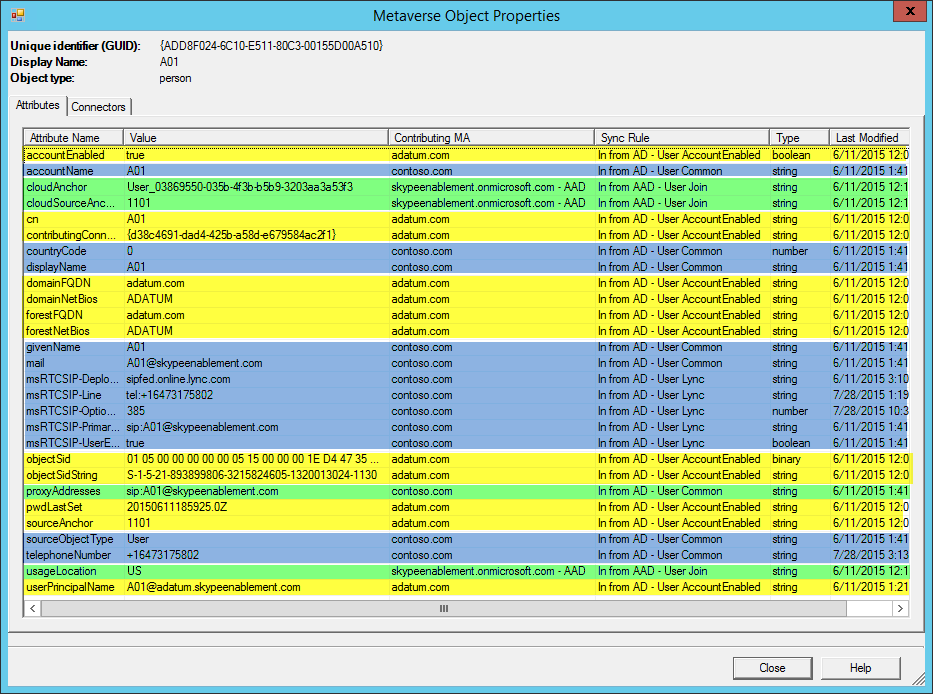

# Configurar um ambiente de várias floresta para o híbrido Skype para negóciosConfigure a multi-forest environment for hybrid Skype for Business
 
As seções a seguir fornecem orientação sobre como configurar um ambiente que possui várias florestas em um modelo de floresta de usuário/recurso para fornecer Skype para a funcionalidade de negócios em um cenário híbrido.The following sections provide guidance on how to configure an environment that has multiple forests in a Resource/User forest model to provide Skype for Business functionality in a hybrid scenario. 
  

  
## Validar a topologia de florestaValidate the Forest Topology

Há compatibilidade para múltiplas florestas de usuários. Considere o seguinte:  Multiple user forests are supported. Keep the following in mind: 
  
- Para uma floresta de usuário único ou vários implantação de floresta de usuário, deve haver uma única implantação do Skype para Business Server.For either a single user forest or multiple user forest deployment, there must be a single deployment of Skype for Business Server.
    
- Para as versões suportadas do Lync Server e Skype para Business Server em uma configuração híbrida, consulte [requisitos de topologia](../../skype-for-business-hybrid-solutions/plan-hybrid-connectivity.md#BKMK_Topology) em [Planejar a conectividade híbrida entre Skype para Business Server e do Skype para negócios Online](../../skype-for-business-hybrid-solutions/plan-hybrid-connectivity.md).For supported versions of Lync Server and Skype for Business Server in a hybrid configuration, see [Topology requirements](../../skype-for-business-hybrid-solutions/plan-hybrid-connectivity.md#BKMK_Topology) in [Plan hybrid connectivity between Skype for Business Server and Skype for Business Online](../../skype-for-business-hybrid-solutions/plan-hybrid-connectivity.md).
    
- Exchange Server podem ser implantado em uma ou mais florestas, que podem ou não incluir a floresta que contém o Skype para Business Server.Exchange Server can be deployed in one or more forests, which may or may not include the forest containing Skype for Business Server. Verifique se que você aplicou a atualização cumulativa mais recente.Make sure you have applied the latest Cumulative Update.
    
- Para obter detalhes sobre a coexistência com o Exchange Server, incluindo os critérios e as limitações de suporte em várias combinações de local e online, consulte [Suporte aos recursos](../../plan-your-deployment/integrate-with-exchange/integrate-with-exchange.md#feature_support) em [Plan to integrate Skype for Business and Exchange](../../plan-your-deployment/integrate-with-exchange/integrate-with-exchange.md).For details on co-existence with Exchange Server, including support criteria and limitations in various combinations of on-premises and online, see [Feature support](../../plan-your-deployment/integrate-with-exchange/integrate-with-exchange.md#feature_support) in [Plan to integrate Skype for Business and Exchange](../../plan-your-deployment/integrate-with-exchange/integrate-with-exchange.md).
    
Para obter mais informações, confira [Environmental requirements for Skype for Business Server 2015](../../plan-your-deployment/requirements-for-your-environment/environmental-requirements.md).For more information, please refer to [Environmental requirements for Skype for Business Server 2015](../../plan-your-deployment/requirements-for-your-environment/environmental-requirements.md).
  
## Considerações de hospedagem do usuárioUser homing considerations

Skype para usuários comerciais hospedagem no local pode ter Exchange hospedado no local ou online.Skype for Business users homed on premises can have Exchange homed on premises or online. Skype para usuários corporativos Online deve usar o Exchange Online para uma experiência ideal; No entanto, isso não é necessário.Skype for Business Online users should use Exchange Online for an optimal experience; however, this is not required. Exchange no local não é necessário para implementar o Skype para negócios em ambos os casos.Exchange on premises is not required to implement Skype for Business in either case.
  
## Configurar relações de confiança da florestaConfigure Forest Trusts

As relações de confiança exigidas são relações bidirecionais transitivas entre a floresta de recursos e cada floresta de usuário.The trusts required are two-way transitive trusts between the resource forest and each of the user forests. Se você tiver várias florestas de usuários, é importante que o Roteamento de sufixo de nome esteja habilitado para cada relação de confiança para habilitar a autenticação entre florestas.If you have multiple user forests, to enable cross-forest authentication it is important that Name Suffix Routing is enabled for each of these forest trusts. Para mais instruções, consulte [Gerenciar relações de confiança de floresta](https://technet.microsoft.com/en-us/library/cc772440.aspx).For instructions, see [Managing Forest Trusts](https://technet.microsoft.com/en-us/library/cc772440.aspx). 
  
## Sincronizar contas para a floresta Skype para a empresa de hospedagemSynchronize Accounts into the forest hosting Skype for Business

Quando Skype para Business Server é implantado em uma floresta (uma floresta de recursos), mas oferece funcionalidade aos usuários em um ou mais outras florestas (florestas conta), os usuários nas outras florestas devem ser representados como objetos de usuário desabilitado na floresta onde Skype para Servidor de negócios é implantado.When Skype for Business Server is deployed in one forest (a resource forest), but provides functionality to users in one or more other forests (account forests), users in the other forests must be represented as disabled user objects in the forest where Skype for Business Server is deployed. Um produto de gerenciamento de identidade, como o Microsoft Identity Manager, precisa ser implantado e configurado para provisionar e sincronizar os usuários de florestas de conta para a floresta onde o Skype para Business Server está implantado.An identity management product, such as Microsoft Identity Manager, needs to be deployed and configured to provision and synchronize the users from the account forests into the forest where Skype for Business Server is deployed. Os usuários devem ser sincronizados para a floresta hospedagem Skype para Business Server como objetos de usuário desabilitadas.Users must be synchronized into the forest hosting Skype for Business Server as disabled user objects. Os usuários não podem ser sincronizados como objetos de contato do Active Directory, porque o Azure Active Directory Connect não adequadamente sincronizará contatos no Azure AD para uso com Skype.Users cannot be synchronized as Active Directory contact objects, because Azure Active Directory Connect will not properly synchronize contacts into Azure AD for use with Skype.
  
Independentemente de qualquer configuração de várias floresta, floresta hospedagem Skype para Business Server também pode fornecer funcionalidade para quaisquer usuários habilitados que existem na mesma floresta.Regardless of any multi-forest configuration, the forest hosting Skype for Business Server can also provide functionality for any enabled users that exist in the same forest.
  
Para obter a sincronização de identidades, os seguintes atributos precisam ser sincronizados:To get proper identity synchronization, the following attributes need to be synchronized: 
  
|**Florestas de usuários****User Forests**|**Florestas de recursos****Resource Forests**|
|:-----|:-----|
|atributo de link da conta escolhidachosen account link attribute    |atributo de link da conta escolhidachosen account link attribute    |
|email mail    |email mail    |
|ProxyAddressesProxyAddresses    |ProxyAddressesProxyAddresses    |
|ObjectSIDObjectSID    |msRTCSIP-OriginatorSIDmsRTCSIP-OriginatorSID    |
   
O [atributo de vínculo de conta foi escolhido](https://azure.microsoft.com/documentation/articles/active-directory-aadconnect-design-concepts/) será usada como a âncora de origem.The [chosen account link attribute](https://azure.microsoft.com/documentation/articles/active-directory-aadconnect-design-concepts/) will be used as the Source Anchor. Se você tiver um atributo diferente e imutável atributo que preferir usar, você pode fazê-lo, certifique-se apenas de editar a regra de declaração do AD FS e selecionar o atributo durante a configuração do AAD Connect.If you have a different and immutable attribute that you would prefer to use, you may do so, just be sure you edit the AD FS claims rule and select the attribute during the AAD Connect configuration.
  
Não sincronize o UPN entre as florestas.Do not sync the UPN's between the forests. Durante os testes, descobrimos que precisávamos usar um único UPN para cada floresta de usuário, pois não é possível usar o mesmo UPN para várias florestas.We found during testing that we needed to use a unique UPN for each user forest, as you cannot use the same UPN across multiple forests. Como resultado, chegamos a duas possibilidades: sincronizar ou não sincronizar o UPN.As a result, we were presented with two possibilities, to synchronize the UPN or to not synchronize. 
  
- Se o UPN exclusivo de cada floresta de usuário não for sincronizado ao objeto desabilitado associado na floresta de recurso, o Logon Único não funciona pelo menos na tentativa de conexão inicial (presumindo que o usuário selecionou a opção de salvar senha). No cliente SfB, supomos que os valores de SIP/UPN são os mesmos. Como o endereço SIP nessa situação é user@company.com, mas o UPN do objeto habilitado na floresta do usuário é na verdade user@contoso.company.com, a tentativa de logon inicial falhará e o usuário será solicitado a inserir as credenciais. Ao entrar seu UPN correto/real, a solicitação de autenticação será concluída para os controladores de domínio na floresta do usuário e a conexão será bem-sucedida.If the unique UPN from each user forest was not synchronized to the associated disabled object in the resource forest, Single Sign-on would be broken for at least the initial sign-in attempt (assuming the user selected the option to save password). In the SfB client, we assume that the SIP/UPN values are the same. Since the SIP address in this scenario is user@company.com, but the UPN of the enabled object in the user forest is in fact user@contoso.company.com, the initial login attempt would fail and the user would be prompted to enter credentials. Upon entering their correct/actual UPN, the authentication request would be completed against the domain controllers in the user forest, and sign-in would be successful.
    
- Se o UPN exclusivo de cada floresta de usuário for sincronizado ao objeto desabilitado associado na floresta de recurso, a autenticação do AD FS falhará. A regra correspondente encontrará o UPN do objeto na floresta de recurso, que foi desabilitado e não pode ser utilizado para a autenticação.If the unique UPN from each user forest was synchronized to the associated disabled object in resource forest, AD FS authentication would fail. The matching rule would find the UPN on the object in the resource forest, which was disabled and could not be used for authentication. 
    
## Criar um locatário do Office 365Create an Office 365 tenant

Em seguida, você precisará provisionar um locatário do Office 365 para usar em sua implantação.You will next need to provision an Office 365 tenant to use with your deployment. Para obter mais informações, confira [Etapas de provisionamento do Office 365.](https://social.technet.microsoft.com/wiki/contents/articles/22808.office-365-provisioning-steps.aspx)For more information, please see [Office 365 Provisioning Steps](https://social.technet.microsoft.com/wiki/contents/articles/22808.office-365-provisioning-steps.aspx). 
  
## Configurar o AD FSConfigure AD FS

Depois de criar um locatário, você precisará configurar os Serviços de Federação do Active Directory (AD FS) em cada uma das florestas de usuários. Isto assume que você tem um SIP e endereço SMTP exclusivos, além de um UPN (nome principal de usuário) para cada floresta. O AD FS é opcional e é usado aqui para Logon Único. O DirSync com sincronização de senha também é suportado e também pode ser usado no lugar do AD FS.Once you have a tenant, you will next need to configure Active Directory Federation Services (AD FS) ineach of the user forests. This assumes you have a unique SIP and SMTP address and User Principal Name (UPN) for each forest. AD FS is optional and is used here to get single-sign on. DirSync with Password Sync is also supported and can also be used in place of AD FS. 
  
Testamos somente implantações com SIP, SMPT e UPNs correspondentes. Não ter SIP/SMTP/UPNs correspondentes pode resultar em uma redução da funcionalidade, como problemas com a integração do Exchange e com o Logon Único.Only deployments with matching SIP/SMTP and UPNs were tested. Not having matching SIP/SMTP/UPNs may result in reduced functionality, such as problems with Exchange integration and single-sign on. 
  
A menos que você use um SIP/SMTP/UPN exclusivo para usuários de cada floresta, você ainda pode executar problemas Single Sign-on (SSO) - independentemente de onde o AD FS está implantado:Unless you use a unique SIP/SMTP/UPN for users from each forest, you can still run into Single Sign-on (SSO) problems - regardless of where AD FS is deployed: 
  
- Relações de uma ou duas vias entre florestas de recursos/usuários com o farm AD FS implantado em cada floresta de usuário, todos os usuários compartilham um domínio SIP/SMTP mas, o UPN é exclusivo para cada floresta de usuário.One-way or two-way trusts between resource/user forests with AD FS farm deployed in each user forest, all users share common SIP/SMTP domain but unique UPN for each user forest. 
    
- Relações de duas vias entre florestas de recursos/usuários com o farm AD FS implantado somente na floresta de recurso, todos os usuários compartilham um domínio SIP/SMTP mas, o UPN é exclusivo para cada floresta de usuário.Two-way trusts between resource/user forests with AD FS farm deployed only in resource forest, all users share common SIP/SMTP domain but unique UPN for each user forest. 
    
Solucionamos os dois problemas ao usar um farm AD FS em cada floresta de usuário e um SIP/SMTP/UPN exclusivo para cada floresta. Apenas as contas dessa floresta de usuário específico poderiam ser pesquisadas e pareadas durante as tentativas de autenticação. Isso ajudará a oferecer um processo de autenticação mais contínuo.By placing an AD FS farm in each user forest and using a unique SIP/SMTP/UPN for each forest, we resolve both issues. Only the accounts in that specific user forest would be searched and matched during authentication attempts. This will help provide a more seamless authentication process. 
  
Essa será uma implantação padrão do AD FS do Windows Server 2012 R2 e deverá estar funcionando antes de continuar.This will be a standard deployment of the Windows Server 2012 R2 AD FS and should be working before continuing. Para ver as instruções, confira [Como Instalar o AD FS 2012 R2 para o Office 365.](https://blogs.technet.com/b/rmilne/archive/2014/04/28/how-to-install-adfs-2012-r2-for-office-365.aspx)For instructions, see [How To Install AD FS 2012 R2 For Office 365](https://blogs.technet.com/b/rmilne/archive/2014/04/28/how-to-install-adfs-2012-r2-for-office-365.aspx). 
  
Depois da implantação, você terá que editar a regra de declaração para corresponder à âncora de origem selecionada anteriormente. No AD FS MMC, em Confianças de terceiras partes confiáveis, clique com o botão direito do mouse em Plataforma de Identidade do Microsoft Office 365 e em Editar Regras de Declaração. Edite a primeira regra e altere ObjectSID para employeeNumber.Once deployed, you then have to edit the claims rule to match the Source Anchor selected earlier. In the AD FS MMC, under Relying Party Trusts, right-click Microsoft Office 365 Identity Platform and then click Edit Claim Rules. Edit the first rule and change ObjectSID to employeeNumber. 
  

  
## Configurar o AAD ConnectConfigure AAD Connect

O AAD Connect será usado para mesclar as contas entre as diferentes florestas e entre as florestas e o Office 365. Você deve implantar o AAD Connect na floresta de recursos. Ele é necessário para poder sincronizar várias florestas e o Office 365, que não é suportado pelo DirSync.AAD Connect will be used to merge the accounts between the different forests and between the forests and Office 365. You should deploy AAD Connect in the resource forest. It is required to be able to synchronize multiple forests and Office 365, which is not supported by Dirsync. 
  
O AAD Connect não sincroniza as contas entre florestas locais. Ele usa conectores AD para ler objetos já sincronizados entre florestas locais (com FIM ou produtos similares). Em seguida, ele aproveita as regras de filtragem para criar uma única representação para os objetos habilitado e desabilitado correspondentes no metaverso e replica esse único objeto mesclado para o Office 365.AAD Connect does not synchronize the accounts between on-premises forests. It uses AD connectors to read objects that are already synchronized across on-premises forests (by FIM or similar products). It then leverages filtering rules to create a single representation of both the matching enabled and disabled object in its metaverse, and then replicates that single, merged object into Office 365. 
  
Quando terminar e o AAD Connect estiver no processo de mesclagem, se você vir um objeto no metaverso, deve ver algo semelhante a isto:When finished and AAD Connect is merging, if you look at an object in the metaverse, you should see something similar to this: 
  

  
Os atributos verdes destacados foram mesclados do Office 365, os amarelos são da floresta do usuário e os azuis são da floresta de recursos.The green highlighted attributes were merged from Office 365, the yellow are from the user forest and the blue are from the resource forest. 
  
Este é um usuário de teste, é possível ver que o AAD Connect identificou o sourceAnchor e o cloudSourceAnchor do usuário e os objetos da floresta de recursos e do Office 365. Em nosso caso, 1101, que é o employeeNumber selecionado anteriormente. Em seguida, ele conseguiu mesclar esse objeto no que você vê acima.This is a test user, and you can see that AAD Connect has identified the sourceAnchor and the cloudSourceAnchor from the user and the resource forest objects and from Office 365, in our case 1101 which is the employeeNumber selected earlier. It then was able to merge this object into what you see above. 
  
Para obter mais informações, consulte [Integração de suas identidades locais com o Active Directory do Azure](https://azure.microsoft.com/documentation/articles/active-directory-aadconnect/).For more information, see [Integrating your on-premises identities with Azure Active Directory](https://azure.microsoft.com/documentation/articles/active-directory-aadconnect/). 
  
Conectar AAD deve ser instalado usando principalmente os padrões.AAD Connect should be installed using mostly the defaults. Exceto para as seguintes etapas:Except for the following steps: 
  
1.  Single sign-on - com o AD FS já implantado e trabalho, selecione não configurarSingle sign-in - with AD FS already deployed and working, select Do not configure
    
2. Conectar seus diretórios - adicionar todos os domíniosConnect your directories - add all of the domains 
    
3.  Identificar usuários em diretórios no local: selecione **as identidades de usuário existirem em vários diretórios** e atributos **ObjectSID** e **msExchangeMasterAccountSID**Identify users in on-premises directories: Select **User identities exist across multiple directories** and select **ObjectSID** and **msExchangeMasterAccountSID** attributes
    
4. Identificar usuários no Windows Azure AD: âncora de origem - selecionar o atributo que você escolheu após ler [selecionando um atributo sourceAnchor bom](https://azure.microsoft.com/documentation/articles/active-directory-aadconnect-design-concepts/), o nome Principal de usuário - **userPrincipalName**Identify users in Azure AD: Source Anchor - Select the attribute you've chosen after reading [Selecting a good sourceAnchor attribute](https://azure.microsoft.com/documentation/articles/active-directory-aadconnect-design-concepts/), User Principal Name - **userPrincipalName**
    
5.  Recursos opcionais - selecione se você tiver o Exchange híbrido implantado ou não.Optional features - select whether you have Exchange hybrid deployed or not.
    
    > [!NOTE]
    >  Se você tiver somente o Exchange Online, pode haver um problema com falhas de OAuth durante a descoberta automática devido ao redirecionamento de CNAME.If you have only Exchange Online, there could be an issue with OAuth failures during autodiscover because of CNAME redirection. Para corrigir esse problema, você precisará definir a URL de descoberta automática do Exchange executando o seguinte cmdlet do Skype do Shell de gerenciamento do servidor de negócios:To correct this, you will need to set the Exchange Autodiscover URL by running the following cmdlet from the Skype for Business Server Management Shell:
  
    Set-CsOAuthConfiguration - ExchangeAutoDiscoverURLhttps://autodiscover-s.outlook.com/autodiscover/autodiscover.svcSet-CsOAuthConfiguration -ExchangeAutoDiscoverURL https://autodiscover-s.outlook.com/autodiscover/autodiscover.svc 
    
6.  Farm AD FS: selecione **Usar um farm do AD FS do Windows Server 2012 R2 existente** e insira o nome do servidor do AD FS.AD FS Farm: Select **Use an existing Windows Server 2012 R2 AD FS farm** and enter the name of the AD FS server.
    
7.  Conclua o assistente e realize as validações necessárias.Finish the wizard and perform the necessary validations.
    
## Configurar o modo híbrido para o Skype for Business ServerConfigure Hybrid mode for Skype for Business Server

Siga as práticas recomendadas para configuração Skype para o híbrido de negócios.Follow the best practices for configuring Skype for Business hybrid. Para obter mais informações de planejamento, confira [Planejar sua implantação híbrida do Skype for Business Server 2015](https://technet.microsoft.com/en-us/library/jj205403.aspx) e, para obter informações de configuração, confira [Configurar implantação híbrida no Skype for Business Online](https://technet.microsoft.com/en-us/library/jj204669.aspx).For more planning information, see [Plan your hybrid deployment for Skype for Business Server 2015](https://technet.microsoft.com/en-us/library/jj205403.aspx), and for configuration information see [Configure hybrid with Skype for Business Online](https://technet.microsoft.com/en-us/library/jj204669.aspx). 
  
## Configurar o modo híbrido para o Exchange ServerConfigure hybrid mode for Exchange Server

Se necessário, siga as práticas recomendadas para configuração híbrida do Exchange.If necessary, follow the best practices for configuring Exchange hybrid. Para obter mais informações, consulte [Implantações híbridas do Exchange Server](https://technet.microsoft.com/en-us/library/jj200581%28v=exchg.150%29.aspx).For more information, see [Exchange Server Hybrid Deployments](https://technet.microsoft.com/en-us/library/jj200581%28v=exchg.150%29.aspx). 
  

