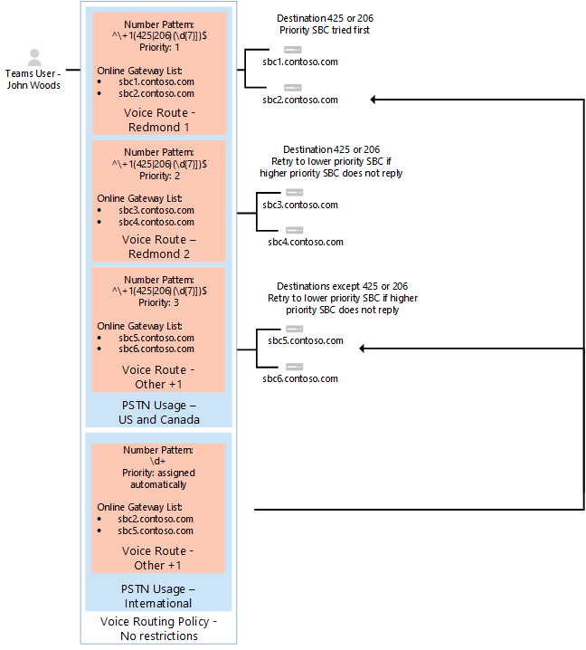

# <a name="configure-direct-routing"></a>Configurar o roteamento direto

  > [!NOTE]
  > Esta é uma versão de visualização de roteamento direto do Microsoft Phone System.  Documentação e funcionalidades do produto estão sujeitos a alterações.

Se você não tiver feito isso, leia [Planejar roteamento direto](plan-direct-routing.md) para os pré-requisitos e para examinar outras etapas você precisará executar antes de configurar sua rede Microsoft Phone System. 

  > [!NOTE]
  > Este documento é destinado a profissionais de TI.  

Este artigo descreve como configurar o roteamento direto do Microsoft Phone System. Ele detalha como emparelhar um suportados borda controlador sessão (SBC) roteamento direto e como configurar usuários Teams da Microsoft para usar o roteamento diretas para conectar-se para a comutação telefônica PSTN (rede pública). Para concluir as etapas explicadas neste artigo, os administradores precisam de familiaridade com os cmdlets do PowerShell. Para obter mais informações sobre como usar o PowerShell, consulte [Configurar o computador para o Windows PowerShell](https://technet.microsoft.com/library/dn362831.aspx). 

Recomendamos que você confirme que seu SBC já foi configurado conforme recomendado pelo seu fornecedor SBC: 

- Documentação de implantação AudioCodes 
- Documentação de implantação de faixa de opções

Você pode configurar seu sistema telefônico de Microsoft e permitem aos usuários utilizar o roteamento direto e depois configurar o Microsoft Teams como o cliente preferencial da chamada ao concluir os procedimentos a seguir: 

- [Emparelhar o SBC com um sistema de telefone da Microsoft e validar o emparelhamento](#pair-the-sbc-to-direct-routing-service-of-phone-system)
- [Habilitar usuários para o serviço de roteamento direto](#enable-users-for-direct-routing-service)
- [Certifique-se de que a Microsoft Teams é o cliente preferencial da chamada para os usuários](#set-microsoft-teams-as-the-preferred-calling-client-for-the-users) 

## <a name="pair-the-sbc-to-direct-routing-service-of-phone-system"></a>Emparelhar o SBC para direcionar o serviço de roteamento do sistema telefônico 

Estes são os três passos de alto nível para permitem que você conecte ou emparelhar, o SBC à interface de roteamento direto: 

- Conecte-se ao centro de administração do **Skype para Business Online** usando o PowerShell 
- Par o SBC 
- Validar o emparelhamento 

### <a name="connect-to--skype-for-business-online-by-using-powershell"></a>Se conectam ao Skype para Business Online usando o PowerShell 

Você pode usar uma sessão do PowerShell conectada ao inquilino emparelhar o SBC à interface de roteamento direto. Para abrir uma sessão do PowerShell, execute as etapas descritas em [configurar seu computador para o Windows PowerShell](https://technet.microsoft.com/library/dn362831.aspx). 
 
Depois de estabelecer uma sessão PowerShell remota, valide que você pode ver os comandos para gerenciar o SBC. Para validar os comandos, digite ou copiar/colar nas seguintes na sessão PowerShell e pressione Enter: 

```
gcm *onlinePSTNGateway*
```

Seu comando vai retornar as funções de quatro mostradas aqui que permitirá que você gerencie os SBCs. 

<pre>
CommandType    Name                       Version    Source 
-----------    ----                       -------    ------ 
Function       Get-CsOnlinePSTNGateway    1.0        tmp_v5fiu1no.wxt 
Function       New-CsOnlinePSTNGateway    1.0        tmp_v5fiu1no.wxt 
Function       Remove-CsOnlinePSTNGateway 1.0        tmp_v5fiu1no.wxt 
Function       Set-CsOnlinePSTNGateway    1.0        tmp_v5fiu1no.wxt
</pre>   


### <a name="pair-the-sbc-to-the-tenant"></a>Par o SBC ao inquilino 

Para emparelhar o SBC ao inquilino, na sessão PowerShell, digite o seguinte e pressione Enter: 

```
New-CsOnlinePSTNGateway -Fqdn <SBC FQDN> -SipSignallingPort <SBC SIP Port> -MaxConcurrentSessions <Max Concurrent Sessions the SBC can handle> -Enabled $true 
```
  > [!NOTE]
  > 1. É altamente recomendável definir um limite para o SBC, usando as informações que podem ser encontradas na documentação de SBC. O limite irá disparar uma notificação se SBC estiver no nível de capacidade.
  > 2. Você só pode emparelhar o SBC com o FQDN, onde a parte de domínio do nome corresponde a um dos domínios registrados no seu locatário, exceto \*. onmicrosoft.com. Usando \*. omicrosoft.com nomes de domínio não é suportado para os nomes de SBC FQDN. Por exemplo, se você tiver dois nomes de domínio:<br/><br/>
  > . XYZ do **ABC**<br/>**ABC**. onmicrosoft.com<br/><br/>
  > Para o nome SBC, você pode usar o nome sbc.abc.xyz. Se você tentar emparelhar o SBC com sbc.xyz.abc um nome, o sistema não permitirá que você, como o domínio não pertence este locatário.

```
New-CsOnlinePSTNGateway -Identity sbc.contoso.com -Enabled $true -SipSignallingPort 5067 -MaxConcurrentSessions 100 
```
Retorna:
<pre>
Identity              : sbc.contoso.com 
Fqdn                  : sbc.contoso.com 
SipSignallingPort     : 5067 
FailoverTimeSeconds   : 10 
ForwardCallHistory    : False 
ForwardPai            : False 
SendSipOptions        : True 
MaxConcurrentSessions : 100 
Enabled               : True   
</pre>
Há opções adicionais que podem ser definidas durante o emparelhamento. No exemplo anterior, no entanto, somente o mínimo necessário parâmetros são mostrados. 
 
A tabela a seguir lista os parâmetros adicionais que você pode usar a configuração de parâmetros para *New-CsOnlinePstnGateway*. 

|**Necessário?**|**Nome**|**Descrição**|**Padrão**|**Valores possíveis**|**Tipo e restrições**|
|:-----|:-----|:-----|:-----|:-----|:-----|
|Sim|FQDN|O nome do FQDN do SBC |Nenhum|Nome de NoneFQDN, limitar 63 caracteres|Cadeia de caracteres, lista de caracteres permitidos e não permitidos nas [convenções de nomenclatura no Active Directory para computadores, domínios, sites e OUs](https://support.microsoft.com/en-us/help/909264)|
|Não|MediaBypass |O parâmetro reservado para uso futuro. Parâmetro indicado do SBC suporta Bypass de mídia e o administrador deseja usá-lo.|Nenhum|Verdadeiro<br/>Falso|Booliano|
|Sim|SipSignallingPort |Porta de escuta usada para comunicação com os serviços de roteamento direta usando o protocolo de segurança de camada de transporte (TLS).|Nenhum|Qualquer porta|0 a 65.535 |
|Não|FailoverTimeSeconds |Quando definido como 10 (valor padrão), chamadas de saída que não for atendidas pelo gateway dentro de 10 segundos são roteadas para o próximo tronco disponível; Se não houver nenhuma troncos adicionais, a chamada será interrompida automaticamente. Em uma organização com respostas de redes e gateway lentas, isso pode resultar em chamadas sendo derrubadas desnecessariamente. O valor padrão é 10.|10|Número|Int|
|Não|ForwardCallHistory |Indica se as informações do histórico de chamada serão encaminhadas por meio do tronco. Se for habilitada, o Proxy do Office 365 PSTN envia dois cabeçalhos: histórico-info e mencionados por. O valor padrão é **False** ($False). |Falso|Verdadeiro<br/>Falso|Booliano|
|Não|ForwardPAI|Indica se o header de P-Asserted-Identity (PAI) será encaminhado junto com a chamada. O cabeçalho PAI oferece uma forma de verificar a identidade do chamador. O valor padrão é **False** ($False).|Falso|Verdadeiro<br/>Falso|Booliano|
|Não|SendSIPOptions |Define se um SBC será ou não enviará as opções de SIP. Se desabilitada, o SBC será excluído do sistema de monitoramento e alerta. É altamente recomendável que você habilite as opções de SIP. Valor padrão é **True**. |True|True<br/>Falso|Booliano|
|Não|MaxConcurrentSessions |Usada pelo sistema de alertas. Quando nenhum valor for definido, o sistema de alertas irá gerar um alerta ao administrador do locatário quando o número de sessão simultânea é 90% ou maior do que esse valor. Se o parâmetro não for definido, os alertas não serão gerados. No entanto, o sistema de monitoramento irá relatar o número de sessão simultânea a cada 24 horas. |NULL|NULL<br/>1 a 100.000 ||
|Não|Habilitado *|Usado para habilitar este SBC para chamadas de saída. Pode ser usado para remover temporariamente o SBC, enquanto ela está sendo atualizada ou durante a manutenção. |Falso|Verdadeiro<br/>Falso|Booliano|
 
### <a name="verify-the-sbc-pairing"></a>Verifique se o emparelhamento de SBC 

Verifique se a conexão: 
- Verifique se o SBC está na lista de SBCs emparelhados. 
- Valide as opções de SIP. 
 
#### <a name="validate-if-sbc-is-on-the-list-of-paired-sbcs"></a>Validar se o SBC está na lista de SBCs emparelhados 

Depois de par de SBC, valide que o SBC está presente na lista de SBCs emparelhados executando o seguinte comando em uma sessão PowerShell remota:`Get-CSOnlinePSTNGateway`

O gateway emparelhado deve aparecer na lista, conforme mostrado no exemplo a seguir e verifique se o parâmetro *Enabled* exibe o valor **True**. Insira:

```
Get-CsOnlinePSTNGateway -Identity sbc.contoso.com  
```
Qual retorna:
<pre>
Identity              : sbc.contoso.com  
Fqdn                  : sbc.contoso.com 
SipSignallingPort     : 5067 
CodecPriority         : SILKWB,SILKNB,PCMU,PCMA 
ExcludedCodecs        :  
FailoverTimeSeconds   : 10 
ForwardCallHistory    : False 
ForwardPai            : False 
SendSipOptions        : True 
MaxConcurrentSessions : 100 
Enabled               : True 
</pre>

#### <a name="validate-sip-options-flow"></a>Validar o fluxo de SIP Options 

Para validar o emparelhamento usando as opções de SIP de saída, use a interface de gerenciamento de SBC e veja o que o SBC obter 200 respostas Okey para as opções de saída.
  
Quando o roteamento direto vê as opções de entrada, será iniciado o envio de opções de saída para o FQDN de SBC configurado no campo de cabeçalho de contato da mensagem de entrada opções. 

Para validar o emparelhamento usando as opções de SIP de entrada, use a interface de gerenciamento de SBC e veja o que o SBC obtém responder às mensagens de opções vindos de roteamento direto e o código de resposta é 200 Okey.  

## <a name="enable-users-for-direct-routing-service"></a>Habilitar usuários para o serviço de roteamento direto 

Quando você estiver pronto para habilitar usuários para o serviço de roteamento direto, siga estas etapas: 

1. Criar um usuário no Office 365 e atribuir uma licença de sistema telefônico. 
2. Certifique-se de que o usuário está hospedado no Skype para negócios Online. 
3. Configurar o número de telefone e habilitar o enterprise voice e caixa postal. 
4. Configure o roteamento de voz. A rota é validada automaticamente.  

### <a name="create-a-user-in-office-365-and-assign-the-license"></a>Criar um usuário no Office 365 e atribuir a licença 

Há duas opções para criar um novo usuário no Office 365. No entanto, recomendamos que sua organização selecione e usar uma opção para evitar problemas de roteamento: 

- Crie o usuário no Active Directory de no local e sincronizar o usuário para a nuvem. Consulte [os diretórios de seu local integra-se com o Windows Azure Active Directory](https://docs.microsoft.com/en-us/azure/active-directory/connect/active-directory-aadconnect).  
- Crie o usuário diretamente no Portal do administrador do Office 365. Consulte [Adicionar usuários individualmente ou em massa para o Office 365 - ajuda de Admin](https://support.office.com/en-us/article/Add-users-individually-or-in-bulk-to-Office-365-Admin-Help-1970f7d6-03b5-442f-b385-5880b9c256ec). 

  Se você construir o sistema que coexiste com Skype para negócios 2015 ou o Lync 2010/2013 local, a única opção com suporte é criar o usuário no Active Directory no local e sincronizar o usuário para a nuvem (opção 1). 

Licenças necessárias: 

- O Office 365 Enterprise E3 (incluindo SfB Plan2, Exchange plano2 e equipes) + sistema de telefone  
- O Office 365 Enterprise E5 (incluindo SfB Plan2, Exchange plano2, equipes e sistema telefônico) 

Licenças opcionais: 

- Chamar o plano 
- Audioconferência 

### <a name="ensure-that-the-user-is-homed-in-skype-for-business-online"></a>Certifique-se de que o usuário está hospedado no Skype para negócios Online 

Roteamento direto exige que o usuário a ser hospedados no Skype para negócios Online. Você pode verificar isso examinando o parâmetro RegistrarPool. Ele precisa ter um valor no domínio infra.lync.com.

1. Conecte ao PowerShell remoto.
2. Execute o comando: 

```
Get-CsOnlineUser -Identity "<User name>" | fl RegistrarPool
``` 

### <a name="configure-the-phone-number-and-enable-enterprise-voice-and-voicemail"></a>Configurar o número de telefone e habilitar o enterprise voice e caixa postal 

Após ter criado o usuário e atribuiu uma licença, a próxima etapa é configurar sua caixa postal e o número de telefone. Isso pode ser feito em uma única etapa. 

Para adicionar o número de telefone e habilitar a caixa postal:
 
1. Conecte a uma sessão PowerShell remota. 
2. Insira o comando: 
    
```
Set-CsUser -Identity "<User name>" -EnterpriseVoiceEnabled $true -HostedVoiceMail $true -OnPremLineURI tel:+ phone number
```

Por exemplo, para adicionar um número de telefone para o usuário "Low Silva", digite o seguinte: 

```
Set-CsUser - “Spencer Low" -OnPremisLineURI tel:+14255388797 -EnterpriseVoiceEnabled $true -HostedVoiceMail $true
```

O número de telefone usado deve ser configurado como um número de telefone e. 164 completo com o código de país. 

  > [!NOTE]
  > Se o número de telefone do usuário é gerenciado no local, use Skype local para o painel de controle ou o Shell de gerenciamento de negócios para configurar o número de telefone do usuário. 

### <a name="configure-voice-routing"></a>Configurar o roteamento de voz 

Sistema de telefone da Microsoft possui um mecanismo de roteamento que permite que uma chamada seja enviada para um SBC específico com base em: 

- Padrão de número chamado 
- Padrão de número chamado + usuário específico que faz a chamada
 
SBCs podem ser designados como ativos e de backup. Isso significa que quando o SBC que está configurado como ativo para este padrão de número, ou padrão de número + usuário específico, não estiver disponível, então, as chamadas serão roteadas para um SBC backup.
 
Roteamento de chamadas é composto pelos seguintes elementos: 
- Política de roteamento de voz – contêiner para usos de PSTN; podem ser atribuídas a um usuário ou a vários usuários 
- Usos da PSTN – contêiner para rotas de voz e usos de PSTN; podem ser compartilhados em diferentes políticas de roteamento de voz 
- Rotas – padrão de número e o conjunto de Gateways de PSTN Online para usar para chamadas onde chamar número corresponde ao padrão de voz 
- Gateway PSTN online - ponteiro de SBC, também armazena a configuração que é aplicada quando a chamada é feita por meio de SBC, como forward P-Asserted-Identity (PAI) ou Codecs preferencial; podem ser adicionados às rotas de voz 

#### <a name="creating-a-voice-routing-policy-with-one-pstn-usage"></a>Criando uma política de roteamento de voz com um uso de PSTN 

O diagrama a seguir mostra dois exemplos de políticas de roteamento de voz no fluxo de chamadas.

**1 de fluxo de chamada (no lado esquerdo):** Se um usuário faz uma chamada para +1 425 XXX XX XX ou +1 206 XXX XX XX, a chamada é roteada para SBC sbc1<span></span>. contoso.biz ou sbc2<span></span>. contoso.biz. Se nenhuma das sbc1<span></span>. contoso.biz nem sbc2<span></span>. contoso.biz estão disponíveis, a chamada será interrompida. 

**2 de fluxo de chamada (à direita):** Se um usuário faz uma chamada para +1 425 XXX XX XX ou +1 206 XXX XX XX, a chamada será encaminhada primeiramente para SBC sbc1<span></span>. contoso.biz ou sbc2<span></span>. contoso.biz. Se nenhuma das SBC estiver disponível, a rota com prioridade mais baixa será tentada (sbc3<span></span>. contoso.biz e sbc4<span></span>. contoso.biz). Se nenhum dos SBCs estiverem disponíveis, a chamada será interrompida. 


Nos dois exemplos, enquanto a rota de voz é atribuída prioridades, os SBCs nas rotas são tentados em ordem aleatória.

  > [!NOTE]
  > A menos que o usuário também tem uma licença Microsoft chamar planejar, chamadas para qualquer número, exceto os padrões de + +1 425 XXX XX XX ou +1 206 XXX XX XX na configuração de exemplo de correspondência de números são colocadas. Se o usuário tem uma licença chamar plano, a chamada automaticamente é roteada de acordo com as políticas do Microsoft chamar plano. 

O Microsoft chamar planeje automaticamente como a rota de última aplica a todos os usuários com a licença Microsoft chamar planejar e não requer configuração de roteamento de chamada adicional.

No exemplo mostrado no diagrama a seguir, uma rota de voz é adicionada para enviar chamadas para todos os outro Estados Unidos e do Canadá número (chamadas que vá para o padrão de número chamado + 1 XXX XXX XX XX).


Para todas as chamadas, se ambas as licenças (sistema de telefone da Microsoft e chamar plano Microsoft), o usuário tem automático rota será usada. Se nada corresponder os padrões de número em que as rotas de voz online criados pelo administrador, rotear via Microsoft chamar planejar.

Se o usuário tiver apenas o Microsoft Phone System, a chamada será interrompida, pois não há regras de correspondência estão disponíveis.

  > [!NOTE]
  > A prioridade de valor para a rota "Outros + 1" não importa nesse caso, pois não há apenas uma rota que corresponde ao padrão + 1 XXX XXX XX XX. Se um usuário faz uma chamada para + 1 324 567 89 89 e sbc5.contoso.biz e o sbc6.contoso.biz não estiverem disponíveis, a chamada será interrompida.

A tabela a seguir resume a configuração usando três rotas de voz. Neste exemplo, todas as rotas de três fazem parte do uso de PSTN mesmo "EUA e Canadá".

|**Uso de PSTN**|**Rota de voz**|**Padrão de número**|**Prioridade**|**SBC**|**Descrição**|
|:-----|:-----|:-----|:-----|:-----|:-----|
|Somente nos EUA|"Redmond 1"|^\\+ 1 (425\|206)(\d{7})$|1|sbc1<span></span>. contoso.biz<br/>sbc2<span></span>. contoso.biz|Roteiro ativo para números chamados +1 425 XXX XX XX ou +1 206 XXX XX XX|
|Somente nos EUA|"Redmond 2"|^\\+ 1 (425\|206)(\d{7})$|2|sbc3<span></span>. contoso.biz<br/>sbc4<span></span>. contoso.biz|Rota de backup para números chamados +1 425 XXX XX XX ou +1 206 XXX XX XX|
|Somente nos EUA|"Outros + 1"|^\\+ 1 (\d{10}) $|3|sbc5<span></span>. contoso.biz<br/>sbc6<span></span>. contoso.biz|Encaminhar para números chamados + 1 XXX XXX XX XX (exceto +1 425 XXX XX XX ou +1 206 XXX XX XX)|
|||||||

Todas as rotas são associadas com o uso da PSTN "EUA e Canadá" e o uso da PSTN é associado a política de roteamento de voz "Somente nos EUA." Neste exemplo, a política de roteamento de voz é atribuída ao usuário Spencer Low.

#### <a name="examples-of-call-routes"></a>Exemplos de rotas de chamada

No exemplo a seguir, podemos Demonstre como configurar rotas, usos da PSTN e políticas de roteamento e atribuímos a política ao usuário.

**Etapa 1:** Criar o uso da PSTN "EUA e Canadá".

Em um Skype para sessão de negócios o PowerShell remoto, digite:

```
Set-CsOnlinePstnUsage  -Identity Global -Usage @{Add="US and Canada"}
```

Valide se o uso foi criado digitando: 
```
Get-CSOnlinePSTNUsage
``` 
Qual retorna uma lista de nomes que pode estar truncada:
```
  Identity  : Global
  Usage     : {testusage, US and Canada, International, karlUsage. . .}
```
No exemplo a seguir, é possível ver o resultado da execução do comando do PowerShell *`(Get-CSOnlinePSTNUsage).usage`* para exibir nomes completos (não truncados).    
<pre>
 testusage
 US and Canada
 International
 karlUsage
 New test env
 Tallinn Lab Sonus
 karlUsage2
 Unrestricted
 Two trunks
</pre>

**Etapa 2:** Em uma sessão do PowerShell no Skype para Business Online, crie três rotas: Redmond 1, Redmond 2 e outros + 1, conforme detalhado na tabela anterior. 

Para criar a rota de "Redmond 1", digite:

  ```
  New-CsOnlineVoiceRoute -Identity "Redmond 1" -NumberPattern "^+1(425|206)
  (\d{7})$" -OnlinePstnGatewayList sbc1.contoso.biz, sbc2.contoso.biz -Priority 1 -OnlinePstnUsages "US and Canada"
  ```

Qual retorna:
<pre>
Identity                : Redmond 1
Priority            : 1
Description         :
NumberPattern       : ^\+1(425|206) (\d{7})$
OnlinePstnUsages    : {US and Canada}
OnlinePstnGatewayList   : {sbc1.contoso.biz, sbc2.contoso.biz}
Name            : Redmond 1
SuppressCallerId    :
AlternateCallerId   :
</pre>
Para criar a rota de Redmond 2, digite:

```
New-CsOnlineVoiceRoute -Identity "Redmond 2" -NumberPattern "^\+1(425|206)
(\d{7})$" -OnlinePstnGatewayList sbc3.contoso.biz, sbc4.contoso.biz -Priority 2 -OnlinePstnUsages "US and Canada"
```

Para criar a rota de + 1, digite:

```
New-CsOnlineVoiceRoute -Identity "Other +1" -NumberPattern "^\+1(\d{10})$"
-OnlinePstnGatewayList sbc5.contoso.biz, sbc6.contoso.biz -OnlinePstnUsages "US and Canada"
```

  > [!CAUTION]
  > Certifique-se de que sua expressão regular no atributo NumberPattern é uma expressão válida. Você pode testá-lo usando este site:[https://www.regexpal.com](https://www.regexpal.com)

Em alguns casos, há uma necessidade para rotear todas as chamadas para o mesmo SBC; use - NumberPattern ". *"

- Rotear todas as chamadas para o mesmo SBC

    ```
    Set-CsOnlineVoiceRoute -id "Redmond 1" -NumberPattern "." 
     -OnlinePstnGatewayList sbc1.contoso.biz
    ```

Validar se você configurou corretamente o roteiro executando o `Get-CSOnlineVoiceRoute` comando do Powershell usando opções, conforme mostrado: 

```
New-CsOnlineVoiceRoute | Where-Object {($_.priority -eq 1) -or ($_.priority -eq 2) or ($_.priority -eq 4) -Identity "Redmond 1" -NumberPattern "^\+1(425|206) (\d{7})$" -OnlinePstnGatewayList sbc1.contoso.biz, sbc2.contoso.biz -Priority 1 -OnlinePstnUsages "US and Canada"
```
Qual deve retornar:
<pre>
Identity            : Redmond 1 
Priority            : 1
Description     : 
NumberPattern       : ^\+1(425|206) (\d{7})$
OnlinePstnUsages    : {US and Canada}    
OnlinePstnGatewayList   : {sbc1.contoso.biz, sbc2.contoso.biz}
Name            : Redmond 1
Identity        : Redmond 2 
Priority            : 2
Description     : 
NumberPattern       : ^\+1(425|206) (\d{7})$
OnlinePstnUsages    : {US and Canada}    
OnlinePstnGatewayList   : {sbc3.contoso.biz, sbc4.contoso.biz}
Name            : Redmond 2
    
Identity        : Other +1 
Priority            : 4
Description     : 
NumberPattern       : ^\+1(425|206) (\d{7})$
OnlinePstnUsages    : {US and Canada}    
OnlinePstnGatewayList   : {sbc5.contoso.biz, sbc6.contoso.biz}
Name            : Other +1
</pre>

No exemplo, a rota "Outros + 1" foi atribuído automaticamente a prioridade. 

**Etapa 3:** Criar uma política de roteamento de voz "Somente nos EUA" e adicionar à política, o uso da PSTN "EUA e Canadá".

Em uma sessão do PowerShell no Skype para Business Online, digite:

```
New-CsOnlineVoiceRoutingPolicy "US Only" -OnlinePstnUsages "US and Canada"
```

O resultado é mostrado neste exemplo:

<pre>
Identity        : Tag:US only
OnlinePstnUsages    : {US and Canada}
Description         :
RouteType           : BYOT
</pre>

**Etapa 4:** Conceda ao usuário Spence Low uma política de roteamento de voz usando o PowerShell.

- Em uma sessão do Powershell no Skype para Business Online, digite:

    ```Grant-CsOnlineVoiceRoutingPolicy -Identity "Spencer Low" -PolicyName "US Only"```

- Valide a atribuição de política digitando o seguinte comando:

```
Get-CsOnlineUser "Spencer Low" | select OnlineVoiceRoutingPolicy
```
Qual retorna:
<pre>
OnlineVoiceRoutingPolicy
------------------------
US Only
</pre>

#### <a name="creating-a-voice-routing-policy-with-several-pstn-usages"></a>Criando uma política de roteamento de voz com vários usos de PSTN

A política de roteamento de voz criado anteriormente só permite chamadas para números de telefone nos Estados Unidos e no Canadá –, a menos que a licença chamar plano Microsoft também é atribuída ao usuário.

No exemplo a seguir, é possível criar a política de roteamento de voz "Sem restrições." A política reutiliza o uso da PSTN "EUA e Canadá" criado no exemplo anterior, bem como o uso da PSTN novo "Internacional". 

Isso encaminha todas as outras chamadas para o sbc2 SBCs<span></span>. contoso.biz e sbc5<span></span>. contoso.biz. Os exemplos mostrados atribuem conosco apenas uma política para o usuário "Low Silva" e sem restrições ao usuário "John Woods".

Baixa Silva – chamadas permitidas somente aos números nos EUA e Canadá. Durante a chamada para o intervalo de números de Redmond, o conjunto específico de SBC deve ser usado. Números de fora dos EUA não serão roteados, a menos que a licença chamar planejar é atribuída ao usuário.

Carlos Lacerda – chamadas permitidas para qualquer número. Durante a chamada para o intervalo de números de Redmond, o conjunto específico de SBC deve ser usado. Fora dos EUA números serão roteados por meio de sbc2<span></span>. contoso.biz e sbc5<span></span>. contoso.biz.


Para todas as chamadas, se ambas as licenças (sistema de telefone da Microsoft e chamar plano Microsoft), o usuário tem automático rota será usada. Se nada corresponder os padrões de número em que as rotas de voz online criados pelo administrador, rotear via Microsoft chamar planejar.

Se o usuário tiver apenas o Microsoft Phone System, a chamada será interrompida, pois não há regras de correspondência estão disponíveis.



A tabela a seguir resume o roteamento designações de uso de "Sem restrições" diretiva e rotas de voz. 

|**Uso de PSTN**|**Rota de voz**|**Padrão de número**|**Prioridade**|**SBC**|**Descrição**|
|:-----|:-----|:-----|:-----|:-----|:-----|
|Somente nos EUA|"Redmond 1"|^ + 1 (425\|206)(\d{7})$|1|sbc1<span></span>. contoso.biz<br/>sbc2<span></span>. contoso.biz|Rota ativa para o receptor números +1 425 XXX XX XX ou +1 206 XXX XX XX|
|Somente nos EUA|"Redmond 2"|^ + 1 (425\|206)(\d{7})$|2|sbc3<span></span>. contoso.biz<br/>sbc4<span></span>. contoso.biz|Rota de backup para números de receptor +1 425 XXX XX XX ou +1 206 XXX XX XX|
|Somente nos EUA|"Outros + 1"|^ + 1 (\d{10}) $|3|sbc5<span></span>. contoso.biz<br/>sbc6<span></span>. contoso.biz|Números de rota para o receptor + 1 XXX XXX XX XX (exceto +1 425 XXX XX XX ou +1 206 XXX XX XX)|
|International|International|\ d \d+|4|sbc2<span></span>. contoso.biz<br/>sbc5<span></span>. contoso.biz|Rota para qualquer número padrão |


  > [!NOTE]
  > - A ordem de usos da PSTN em políticas de roteamento de voz é crítica. Os usos são aplicados na ordem, e se uma correspondência for encontrada no uso do primeiro, em seguida, outros usos são nunca avaliados. O uso da PSTN "Internacional" deve ser colocado após o uso da PSTN "Somente nos EUA." Para alterar a ordem dos usos da PSTN, execute o `Set-CSOnlineRouteRoutingPolicy` comando. <br/>Por exemplo, para alterar a ordem de "EUA e Canadá" primeiro e "Internacional" segundo a ordem inversa execute:<br/>   `Set-CsOnlineVoiceRoutingPolicy -id tag:"no Restrictions" -OnlinePstnUsages @{Replace="International", "US and Canada"}`
 > - A prioridade para "Outros + 1" e "Internacional" Voice routes recebem automaticamente. Eles não importam, desde que eles têm prioridades mais baixas que "Redmond 1" e "Redmond 2".

#### <a name="example-of-voice-routing-policy-for-user-john-woods"></a>Exemplo da política de roteamento de voz para o usuário John Woods

As etapas para criar o uso da PSTN "Internacional", "Internacional", da rota de voz "Sem restrições," política de roteamento de voz e, em seguida, atribuí-la ao usuário "Carlos Lacerda" são os seguintes.


1.  Primeiro, crie o uso da PSTN "Internacional". Em uma sessão PowerShell remota no Skype para Business Online, insira:

  ```
  Set-CsOnlinePstnUsage  -Identity Global -Usage @{Add="International"}
  ```

2.  Em seguida, criar a nova rota de voz "Internacional".

  ```
  New-CsOnlineVoiceRoute -Identity "International" -NumberPattern "\d+" -OnlinePstnGatewayList sbc2.contoso.biz, sbc5.contoso.biz -OnlinePstnUsages "International"
  ```
  Qual retorna:

  <pre>
  Identity                  : International 
  Priority                      : 5
  Description                   : 
  NumberPattern                 : \d+
  OnlinePstnUsages          : {International}    
  OnlinePstnGatewayList           : {sbc2.contoso.biz, sbc5.contoso.biz}
  Name                            : International
  SupressCallerId           :
  AlternateCallerId         :
</pre>
3.  Em seguida, crie uma política de roteamento de voz "Sem restrições". O uso de PSTN "Redmond 1" e "Redmond" são reutilizadas nesta política de roteamento de voz para preservar a ação especial para chamadas de número "+1 425 XXX XX XX" e "+1 206 XXX XX XX" como chamadas locais ou no local.

```
New-CsOnlineVoiceRoutingPolicy "No Restrictions" -OnlinePstnUsages "US and Canada", ”International”
```

    Take note of the order of PSTN Usages:

    a. If a call made to number “+1425 XXX XX XX” with the usages configured as in the following example, the call follows the route set in “US and Canada” usage and the special routing logic is applied. That is, the call is routed using  sbc1<span></span>.contoso.biz and sbc2<span></span>.contoso.biz first, and then  sbc3<span></span>.contoso.biz and sbc4<span></span>.contoso.biz as the backup routes. 

    b.  If “International” PSTN usage is before “US and Canada,” calls to + 1425 XXX XX XX are routed to sbc2<span></span>.contoso.biz and sbc5<span></span>.contoso.biz as part of the routing logic. Enter the command:

    ```New-CsOnlineVoiceRoutingPolicy "No Restrictions" -OnlinePstnUsages "US and Canada", ”International”```

   Qual retorna

  <pre>
   Identity     : International 
   OnlinePstnUsages     : {US and Canada, International}     
   Description      :  
   RouteType        : BYOT
  </pre>

4.  Atribua a política de roteamento de voz ao usuário "John Woods" usando o seguinte comando.

  ```
  Grant-CsOnlineVoiceRoutingPolicy -Identity "John Woods" -PolicyName "No Restrictions”
  ```

  Verifique se a atribuição usando o comando:   

  ```
  Get CsOnlineUser “John Woods” | Select OnlineVoiceRoutingPolicy
  ```
  Qual retorna:

<pre>
    OnlineVoiceRoutingPolicy
    ------------------------
    No Restrictions
</pre>

O resultado é que a política de voz aplicada às chamadas de John Woods são unrestricted e seguirá a lógica de roteamento de chamada disponível para as chamadas dos Estados Unidos, Canadá e internacional.

## <a name="enable-calling-for-microsoft-teams"></a>Habilitar a chamada para equipes da Microsoft

Antes de um usuário pode ver a guia chamadas no Teams da Microsoft, você precisará habilitar privada chamadas para o inquilino no Microsoft Teams. Para fazer isso:

1.  Entrar como administrador de locatários no Centro de administração do Office 365.
2.  Vá para **configurações, serviços e suplementos** e selecione **Equipes da Microsoft**. 
3.  Expanda **chamadas e reuniões** e verifique se **Permitir privada chamar** é **no**.

    

## <a name="set-microsoft-teams-as-the-preferred-calling-client-for-the-users"></a>Definir Teams Microsoft como o cliente de chamada preferencial para os usuários

Roteamento direto encaminharão as chamadas apenas ao Teams da Microsoft, portanto, você deve certificar-se de que a Microsoft Teams é o cliente preferencial da chamada para os usuários. Isso é controlado pelo TeamsCallingPolicy e o TeamsInteropPolicy. 

1. Primeiro, use o seguinte cmdlet em uma sessão PowerShell remota no Skype para o admin center Business Online para ver quais políticas que o usuário tenha sido atribuído. 

  ```
  Get-CsOnlineUser -identity <User Name> | fl *teams*
  ```
 
2. Em seguida, revise as instâncias de política diferente. 

  ```
  Get-CsTeamsCallingPolicy
  ``` 
 e 

  ```
  Get-CsTeamsInteropPolicy
  ``` 

Para que usuários do Microsoft Teams podem usar o serviço, há etapas adicionais que você pode precisar ser adotada para aplicar a política de chamada e permitir chamadas.

### <a name="teams-calling-policy"></a>Política de chamada de equipes

Você deve certificar-se de que o usuário tem um TeamsCallingPolicy com AllowCalling = True. Essa diretiva pode ser a política Global no seu locatário ou uma diretiva específica concedidas ao usuário. Se você precisar conceder a um usuário uma diretiva específica, você pode usar o cmdlet:

```
Grant-CsTeamsCallingPolicy -PolicyName <policy> -Identity <User Name>
```

### <a name="teams-interop-policy"></a>Política de interoperabilidade de equipes

Certifique-se de que o usuário tenha o cliente preferencial da chamada para definir a Teams da Microsoft. Isso pode ser feito de duas maneiras:

- O usuário define o cliente preferencial da chamada no cliente do Microsoft Teams.
- O usuário tenha sido atribuído a uma política que define o cliente preferencial da chamada.

Para atribuir uma política que define o Microsoft Teams como o cliente de chamada preferencial, certifique-se de que o usuário recebe uma política cuja CallingDefaultClient = equipes. Um cmdlet do exemplo é mostrado abaixo:

```
Grant-CsTeamsInteropPolicy -PolicyName DisallowOverrideCallingTeamsChatTeams -Identity “<User Name>”
```

## <a name="see-also"></a>Consulte também

[Planejar o roteamento direto](plan-direct-routing.md)
