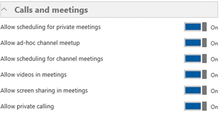

# <a name="configure-direct-routing"></a><span data-ttu-id="c657f-103">Configurar o roteamento direto</span><span class="sxs-lookup"><span data-stu-id="c657f-103">Configure Direct Routing</span></span>

  > [!NOTE]
  > <span data-ttu-id="c657f-104">Esta é uma versão de visualização de roteamento direto do Microsoft Phone System.</span><span class="sxs-lookup"><span data-stu-id="c657f-104">This is a preview release of Microsoft Phone System Direct Routing.</span></span>  <span data-ttu-id="c657f-105">Documentação e funcionalidades do produto estão sujeitos a alterações.</span><span class="sxs-lookup"><span data-stu-id="c657f-105">Product functionality and documentation are subject to change.</span></span>

<span data-ttu-id="c657f-106">Se você não tiver feito isso, leia [Planejar roteamento direto](plan-direct-routing.md) para os pré-requisitos e para examinar outras etapas você precisará executar antes de configurar sua rede Microsoft Phone System.</span><span class="sxs-lookup"><span data-stu-id="c657f-106">If you have not already done so, read [Plan Direct Routing](plan-direct-routing.md) for prerequisites and to review  other steps you’ll need to take before you configure your Microsoft Phone System network.</span></span> 

  > [!NOTE]
  > <span data-ttu-id="c657f-107">Este documento é destinado a profissionais de TI.</span><span class="sxs-lookup"><span data-stu-id="c657f-107">This document is intended for IT professionals.</span></span>  

<span data-ttu-id="c657f-108">Este artigo descreve como configurar o roteamento direto do Microsoft Phone System.</span><span class="sxs-lookup"><span data-stu-id="c657f-108">This article describes how to configure Microsoft Phone System Direct Routing.</span></span> <span data-ttu-id="c657f-109">Ele detalha como emparelhar um suportados borda controlador sessão (SBC) roteamento direto e como configurar usuários Teams da Microsoft para usar o roteamento diretas para conectar-se para a comutação telefônica PSTN (rede pública).</span><span class="sxs-lookup"><span data-stu-id="c657f-109">It details how to pair a supported Session Border Controller (SBC) to Direct Routing and how to configure Microsoft Teams users to use Direct Routing to connect to the Public Switched Telephone Network (PSTN).</span></span> <span data-ttu-id="c657f-110">Para concluir as etapas explicadas neste artigo, os administradores precisam de familiaridade com os cmdlets do PowerShell.</span><span class="sxs-lookup"><span data-stu-id="c657f-110">To complete the steps explained in this article, administrators need some familiarity with PowerShell cmdlets.</span></span> <span data-ttu-id="c657f-111">Para obter mais informações sobre como usar o PowerShell, consulte [Configurar o computador para o Windows PowerShell](https://technet.microsoft.com/library/dn362831.aspx).</span><span class="sxs-lookup"><span data-stu-id="c657f-111">For more information about using PowerShell, see [Set up your computer for Windows PowerShell](https://technet.microsoft.com/library/dn362831.aspx).</span></span> 

<span data-ttu-id="c657f-112">Recomendamos que você confirme que seu SBC já foi configurado conforme recomendado pelo seu fornecedor SBC:</span><span class="sxs-lookup"><span data-stu-id="c657f-112">We recommend that you confirm that your SBC has already been configured as recommended by your SBC vendor's:</span></span> 

- <span data-ttu-id="c657f-113">Documentação de implantação AudioCodes</span><span class="sxs-lookup"><span data-stu-id="c657f-113">AudioCodes deployment documentation</span></span> 
- <span data-ttu-id="c657f-114">Documentação de implantação de faixa de opções</span><span class="sxs-lookup"><span data-stu-id="c657f-114">Ribbon deployment documentation</span></span>

<span data-ttu-id="c657f-115">Você pode configurar seu sistema telefônico de Microsoft e permitem aos usuários utilizar o roteamento direto e depois configurar o Microsoft Teams como o cliente preferencial da chamada ao concluir os procedimentos a seguir:</span><span class="sxs-lookup"><span data-stu-id="c657f-115">You can configure your Microsoft Phone System and enable  users to use Direct Routing, then set up Microsoft Teams as the preferred calling client by completing the following procedures:</span></span> 

- [<span data-ttu-id="c657f-116">Emparelhar o SBC com um sistema de telefone da Microsoft e validar o emparelhamento</span><span class="sxs-lookup"><span data-stu-id="c657f-116">Pair the SBC with a Microsoft Phone System and validate the pairing</span></span>](#pair-the-sbc-to-direct-routing-service-of-phone-system)
- [<span data-ttu-id="c657f-117">Habilitar usuários para o serviço de roteamento direto</span><span class="sxs-lookup"><span data-stu-id="c657f-117">Enable users for Direct Routing Service</span></span>](#enable-users-for-direct-routing-service)
- [<span data-ttu-id="c657f-118">Certifique-se de que a Microsoft Teams é o cliente preferencial da chamada para os usuários</span><span class="sxs-lookup"><span data-stu-id="c657f-118">Ensure that Microsoft Teams is the preferred calling client for the users</span></span>](#set-microsoft-teams-as-the-preferred-calling-client-for-the-users) 

## <a name="pair-the-sbc-to-direct-routing-service-of-phone-system"></a><span data-ttu-id="c657f-119">Emparelhar o SBC para direcionar o serviço de roteamento do sistema telefônico</span><span class="sxs-lookup"><span data-stu-id="c657f-119">Pair the SBC to Direct Routing Service of Phone System</span></span> 

<span data-ttu-id="c657f-120">Estes são os três passos de alto nível para permitem que você conecte ou emparelhar, o SBC à interface de roteamento direto:</span><span class="sxs-lookup"><span data-stu-id="c657f-120">The following are the three high-level steps to let you connect, or pair, the SBC to the Direct Routing interface:</span></span> 

- <span data-ttu-id="c657f-121">Conecte-se ao centro de administração do **Skype para Business Online** usando o PowerShell</span><span class="sxs-lookup"><span data-stu-id="c657f-121">Connect to **Skype for Business Online** admin center using PowerShell</span></span> 
- <span data-ttu-id="c657f-122">Par o SBC</span><span class="sxs-lookup"><span data-stu-id="c657f-122">Pair the SBC</span></span> 
- <span data-ttu-id="c657f-123">Validar o emparelhamento</span><span class="sxs-lookup"><span data-stu-id="c657f-123">Validate the pairing</span></span> 

### <a name="connect-to--skype-for-business-online-by-using-powershell"></a><span data-ttu-id="c657f-124">Se conectam ao Skype para Business Online usando o PowerShell</span><span class="sxs-lookup"><span data-stu-id="c657f-124">Connect to  Skype for Business Online by using PowerShell</span></span> 

<span data-ttu-id="c657f-125">Você pode usar uma sessão do PowerShell conectada ao inquilino emparelhar o SBC à interface de roteamento direto.</span><span class="sxs-lookup"><span data-stu-id="c657f-125">You can use a PowerShell session connected to the tenant to pair the SBC to the Direct Routing interface.</span></span> <span data-ttu-id="c657f-126">Para abrir uma sessão do PowerShell, execute as etapas descritas em [configurar seu computador para o Windows PowerShell](https://technet.microsoft.com/library/dn362831.aspx).</span><span class="sxs-lookup"><span data-stu-id="c657f-126">To open a PowerShell session, please follow the steps outlined in [Set up your computer for Windows PowerShell](https://technet.microsoft.com/library/dn362831.aspx).</span></span> 
 
<span data-ttu-id="c657f-127">Depois de estabelecer uma sessão PowerShell remota, valide que você pode ver os comandos para gerenciar o SBC.</span><span class="sxs-lookup"><span data-stu-id="c657f-127">After you establish a remote PowerShell session, please validate that you can see the commands to manage the SBC.</span></span> <span data-ttu-id="c657f-128">Para validar os comandos, digite ou copiar/colar nas seguintes na sessão PowerShell e pressione Enter:</span><span class="sxs-lookup"><span data-stu-id="c657f-128">To validate the commands, type or copy/paste in the following in the PowerShell session and press Enter:</span></span> 

```
gcm *onlinePSTNGateway*
```

<span data-ttu-id="c657f-129">Seu comando vai retornar as funções de quatro mostradas aqui que permitirá que você gerencie os SBCs.</span><span class="sxs-lookup"><span data-stu-id="c657f-129">Your command will return the four functions shown here that will let you manage the SBCs.</span></span> 

<pre>
CommandType    Name                       Version    Source 
-----------    ----                       -------    ------ 
Function       Get-CsOnlinePSTNGateway    1.0        tmp_v5fiu1no.wxt 
Function       New-CsOnlinePSTNGateway    1.0        tmp_v5fiu1no.wxt 
Function       Remove-CsOnlinePSTNGateway 1.0        tmp_v5fiu1no.wxt 
Function       Set-CsOnlinePSTNGateway    1.0        tmp_v5fiu1no.wxt
</pre>   


### <a name="pair-the-sbc-to-the-tenant"></a><span data-ttu-id="c657f-130">Par o SBC ao inquilino</span><span class="sxs-lookup"><span data-stu-id="c657f-130">Pair the SBC to the tenant</span></span> 

<span data-ttu-id="c657f-131">Para emparelhar o SBC ao inquilino, na sessão PowerShell, digite o seguinte e pressione Enter:</span><span class="sxs-lookup"><span data-stu-id="c657f-131">To pair the SBC to the tenant, in the PowerShell session type the following and press Enter:</span></span> 

```
New-CsOnlinePSTNGateway -Fqdn <SBC FQDN> -SipSignallingPort <SBC SIP Port> -MaxConcurrentSessions <Max Concurrent Sessions the SBC can handle> -Enabled $true 
```
  > [!NOTE]
  > 1. <span data-ttu-id="c657f-132">É altamente recomendável definir um limite para o SBC, usando as informações que podem ser encontradas na documentação de SBC.</span><span class="sxs-lookup"><span data-stu-id="c657f-132">We highly recommend setting a limit for the SBC, using information that can be found in the SBC documentation.</span></span> <span data-ttu-id="c657f-133">O limite irá disparar uma notificação se SBC estiver no nível de capacidade.</span><span class="sxs-lookup"><span data-stu-id="c657f-133">The limit will trigger a notification if SBC is at the capacity level.</span></span>
  > 2. <span data-ttu-id="c657f-134">Você só pode emparelhar o SBC com o FQDN, onde a parte de domínio do nome corresponde a um dos domínios registrados no seu locatário, exceto \*. onmicrosoft.com.</span><span class="sxs-lookup"><span data-stu-id="c657f-134">You can only pair the SBC with FQDN, where the domain portion of the name matches one of the domains registered in your tenant, except \*.onmicrosoft.com.</span></span> <span data-ttu-id="c657f-135">Usando \*. omicrosoft.com nomes de domínio não é suportado para os nomes de SBC FQDN.</span><span class="sxs-lookup"><span data-stu-id="c657f-135">Using \*.omicrosoft.com domain names is not supported for the SBC FQDN names.</span></span> <span data-ttu-id="c657f-136">Por exemplo, se você tiver dois nomes de domínio:</span><span class="sxs-lookup"><span data-stu-id="c657f-136">For example, if you have two domain names:</span></span><br/><br/>
  > <span data-ttu-id="c657f-137">. XYZ do **ABC**</span><span class="sxs-lookup"><span data-stu-id="c657f-137">**abc**.xyz</span></span><br/><span data-ttu-id="c657f-138">**ABC**. onmicrosoft.com</span><span class="sxs-lookup"><span data-stu-id="c657f-138">**abc**.onmicrosoft.com</span></span><br/><br/>
  > <span data-ttu-id="c657f-139">Para o nome SBC, você pode usar o nome sbc.abc.xyz.</span><span class="sxs-lookup"><span data-stu-id="c657f-139">For the SBC name, you can use the name sbc.abc.xyz.</span></span> <span data-ttu-id="c657f-140">Se você tentar emparelhar o SBC com sbc.xyz.abc um nome, o sistema não permitirá que você, como o domínio não pertence este locatário.</span><span class="sxs-lookup"><span data-stu-id="c657f-140">If you try to pair the SBC with a name sbc.xyz.abc, the system will not let you, as the domain is not owned by this tenant.</span></span>

```
New-CsOnlinePSTNGateway -Identity sbc.contoso.com -Enabled $true -SipSignallingPort 5067 -MaxConcurrentSessions 100 
```
<span data-ttu-id="c657f-141">Retorna:</span><span class="sxs-lookup"><span data-stu-id="c657f-141">Returns:</span></span>
<pre>
Identity              : sbc.contoso.com 
Fqdn                  : sbc.contoso.com 
SipSignallingPort     : 5067 
FailoverTimeSeconds   : 10 
ForwardCallHistory    : False 
ForwardPai            : False 
SendSipOptions        : True 
MaxConcurrentSessions : 100 
Enabled               : True   
</pre>
<span data-ttu-id="c657f-142">Há opções adicionais que podem ser definidas durante o emparelhamento.</span><span class="sxs-lookup"><span data-stu-id="c657f-142">There are additional options that can be set during the pairing.</span></span> <span data-ttu-id="c657f-143">No exemplo anterior, no entanto, somente o mínimo necessário parâmetros são mostrados.</span><span class="sxs-lookup"><span data-stu-id="c657f-143">In the previous example, however, only the minimum required parameters are shown.</span></span> 
 
<span data-ttu-id="c657f-144">A tabela a seguir lista os parâmetros adicionais que você pode usar a configuração de parâmetros para *New-CsOnlinePstnGateway*.</span><span class="sxs-lookup"><span data-stu-id="c657f-144">The following table lists the additional parameters that you can use in setting parameters for *New-CsOnlinePstnGateway*.</span></span> 

|<span data-ttu-id="c657f-145">**Necessário?**</span><span class="sxs-lookup"><span data-stu-id="c657f-145">**Required?**</span></span>|<span data-ttu-id="c657f-146">**Nome**</span><span class="sxs-lookup"><span data-stu-id="c657f-146">**Name**</span></span>|<span data-ttu-id="c657f-147">**Descrição**</span><span class="sxs-lookup"><span data-stu-id="c657f-147">**Description**</span></span>|<span data-ttu-id="c657f-148">**Padrão**</span><span class="sxs-lookup"><span data-stu-id="c657f-148">**Default**</span></span>|<span data-ttu-id="c657f-149">**Valores possíveis**</span><span class="sxs-lookup"><span data-stu-id="c657f-149">**Possible values**</span></span>|<span data-ttu-id="c657f-150">**Tipo e restrições**</span><span class="sxs-lookup"><span data-stu-id="c657f-150">**Type and restrictions**</span></span>|
|:-----|:-----|:-----|:-----|:-----|:-----|
|<span data-ttu-id="c657f-151">Sim</span><span class="sxs-lookup"><span data-stu-id="c657f-151">Yes</span></span>|<span data-ttu-id="c657f-152">FQDN</span><span class="sxs-lookup"><span data-stu-id="c657f-152">FQDN</span></span>|<span data-ttu-id="c657f-153">O nome do FQDN do SBC</span><span class="sxs-lookup"><span data-stu-id="c657f-153">The FQDN name of the SBC</span></span> |<span data-ttu-id="c657f-154">Nenhum</span><span class="sxs-lookup"><span data-stu-id="c657f-154">None</span></span>|<span data-ttu-id="c657f-155">Nome de NoneFQDN, limitar 63 caracteres</span><span class="sxs-lookup"><span data-stu-id="c657f-155">NoneFQDN name, limit 63 characters</span></span>|<span data-ttu-id="c657f-156">Cadeia de caracteres, lista de caracteres permitidos e não permitidos nas [convenções de nomenclatura no Active Directory para computadores, domínios, sites e OUs](https://support.microsoft.com/en-us/help/909264)</span><span class="sxs-lookup"><span data-stu-id="c657f-156">String,  list of allowed and disallowed characters on [Naming conventions in Active Directory for computers, domains, sites, and OUs](https://support.microsoft.com/en-us/help/909264)</span></span>|
|<span data-ttu-id="c657f-157">Não</span><span class="sxs-lookup"><span data-stu-id="c657f-157">No</span></span>|<span data-ttu-id="c657f-158">MediaBypass</span><span class="sxs-lookup"><span data-stu-id="c657f-158">MediaBypass</span></span> |<span data-ttu-id="c657f-159">O parâmetro reservado para uso futuro.</span><span class="sxs-lookup"><span data-stu-id="c657f-159">The parameter reserved for future use.</span></span> <span data-ttu-id="c657f-160">Parâmetro indicado do SBC suporta Bypass de mídia e o administrador deseja usá-lo.</span><span class="sxs-lookup"><span data-stu-id="c657f-160">Parameter indicated of the SBC supports Media Bypass and the administrator wants to use it.</span></span>|<span data-ttu-id="c657f-161">Nenhum</span><span class="sxs-lookup"><span data-stu-id="c657f-161">None</span></span>|<span data-ttu-id="c657f-162">Verdadeiro</span><span class="sxs-lookup"><span data-stu-id="c657f-162">True</span></span><br/><span data-ttu-id="c657f-163">Falso</span><span class="sxs-lookup"><span data-stu-id="c657f-163">False</span></span>|<span data-ttu-id="c657f-164">Booliano</span><span class="sxs-lookup"><span data-stu-id="c657f-164">Boolean</span></span>|
|<span data-ttu-id="c657f-165">Sim</span><span class="sxs-lookup"><span data-stu-id="c657f-165">Yes</span></span>|<span data-ttu-id="c657f-166">SipSignallingPort</span><span class="sxs-lookup"><span data-stu-id="c657f-166">SipSignallingPort</span></span> |<span data-ttu-id="c657f-167">Porta de escuta usada para comunicação com os serviços de roteamento direta usando o protocolo de segurança de camada de transporte (TLS).</span><span class="sxs-lookup"><span data-stu-id="c657f-167">Listening port used for communicating with Direct Routing services by using the Transport Layer Security (TLS) protocol.</span></span>|<span data-ttu-id="c657f-168">Nenhum</span><span class="sxs-lookup"><span data-stu-id="c657f-168">None</span></span>|<span data-ttu-id="c657f-169">Qualquer porta</span><span class="sxs-lookup"><span data-stu-id="c657f-169">Any port</span></span>|<span data-ttu-id="c657f-170">0 a 65.535</span><span class="sxs-lookup"><span data-stu-id="c657f-170">0 to 65535</span></span> |
|<span data-ttu-id="c657f-171">Não</span><span class="sxs-lookup"><span data-stu-id="c657f-171">No</span></span>|<span data-ttu-id="c657f-172">FailoverTimeSeconds</span><span class="sxs-lookup"><span data-stu-id="c657f-172">FailoverTimeSeconds</span></span> |<span data-ttu-id="c657f-173">Quando definido como 10 (valor padrão), chamadas de saída que não for atendidas pelo gateway dentro de 10 segundos são roteadas para o próximo tronco disponível; Se não houver nenhuma troncos adicionais, a chamada será interrompida automaticamente.</span><span class="sxs-lookup"><span data-stu-id="c657f-173">When set to 10 (default value), outbound calls that are not answered by the gateway within 10 seconds are routed to the next available trunk; if there are no additional trunks, then the call is automatically dropped.</span></span> <span data-ttu-id="c657f-174">Em uma organização com respostas de redes e gateway lentas, isso pode resultar em chamadas sendo derrubadas desnecessariamente.</span><span class="sxs-lookup"><span data-stu-id="c657f-174">In an organization with slow networks and gateway responses, that could potentially result in calls being dropped unnecessarily.</span></span> <span data-ttu-id="c657f-175">O valor padrão é 10.</span><span class="sxs-lookup"><span data-stu-id="c657f-175">The default value is 10.</span></span>|<span data-ttu-id="c657f-176">10</span><span class="sxs-lookup"><span data-stu-id="c657f-176">10</span></span>|<span data-ttu-id="c657f-177">Número</span><span class="sxs-lookup"><span data-stu-id="c657f-177">Number</span></span>|<span data-ttu-id="c657f-178">Int</span><span class="sxs-lookup"><span data-stu-id="c657f-178">Int</span></span>|
|<span data-ttu-id="c657f-179">Não</span><span class="sxs-lookup"><span data-stu-id="c657f-179">No</span></span>|<span data-ttu-id="c657f-180">ForwardCallHistory</span><span class="sxs-lookup"><span data-stu-id="c657f-180">ForwardCallHistory</span></span> |<span data-ttu-id="c657f-181">Indica se as informações do histórico de chamada serão encaminhadas por meio do tronco.</span><span class="sxs-lookup"><span data-stu-id="c657f-181">Indicates whether call history information will be forwarded through the trunk.</span></span> <span data-ttu-id="c657f-182">Se for habilitada, o Proxy do Office 365 PSTN envia dois cabeçalhos: histórico-info e mencionados por.</span><span class="sxs-lookup"><span data-stu-id="c657f-182">If enabled, the Office 365 PSTN Proxy sends two headers: History-info and Referred-By.</span></span> <span data-ttu-id="c657f-183">O valor padrão é **False** ($False).</span><span class="sxs-lookup"><span data-stu-id="c657f-183">The default value is **False** ($False).</span></span> |<span data-ttu-id="c657f-184">Falso</span><span class="sxs-lookup"><span data-stu-id="c657f-184">False</span></span>|<span data-ttu-id="c657f-185">Verdadeiro</span><span class="sxs-lookup"><span data-stu-id="c657f-185">True</span></span><br/><span data-ttu-id="c657f-186">Falso</span><span class="sxs-lookup"><span data-stu-id="c657f-186">False</span></span>|<span data-ttu-id="c657f-187">Booliano</span><span class="sxs-lookup"><span data-stu-id="c657f-187">Boolean</span></span>|
|<span data-ttu-id="c657f-188">Não</span><span class="sxs-lookup"><span data-stu-id="c657f-188">No</span></span>|<span data-ttu-id="c657f-189">ForwardPAI</span><span class="sxs-lookup"><span data-stu-id="c657f-189">ForwardPAI</span></span>|<span data-ttu-id="c657f-190">Indica se o header de P-Asserted-Identity (PAI) será encaminhado junto com a chamada.</span><span class="sxs-lookup"><span data-stu-id="c657f-190">Indicates whether the P-Asserted-Identity (PAI) header will be forwarded along with the call.</span></span> <span data-ttu-id="c657f-191">O cabeçalho PAI oferece uma forma de verificar a identidade do chamador.</span><span class="sxs-lookup"><span data-stu-id="c657f-191">The PAI header provides a way to verify the identity of the caller.</span></span> <span data-ttu-id="c657f-192">O valor padrão é **False** ($False).</span><span class="sxs-lookup"><span data-stu-id="c657f-192">The default value is **False** ($False).</span></span>|<span data-ttu-id="c657f-193">Falso</span><span class="sxs-lookup"><span data-stu-id="c657f-193">False</span></span>|<span data-ttu-id="c657f-194">Verdadeiro</span><span class="sxs-lookup"><span data-stu-id="c657f-194">True</span></span><br/><span data-ttu-id="c657f-195">Falso</span><span class="sxs-lookup"><span data-stu-id="c657f-195">False</span></span>|<span data-ttu-id="c657f-196">Booliano</span><span class="sxs-lookup"><span data-stu-id="c657f-196">Boolean</span></span>|
|<span data-ttu-id="c657f-197">Não</span><span class="sxs-lookup"><span data-stu-id="c657f-197">No</span></span>|<span data-ttu-id="c657f-198">SendSIPOptions</span><span class="sxs-lookup"><span data-stu-id="c657f-198">SendSIPOptions</span></span> |<span data-ttu-id="c657f-199">Define se um SBC será ou não enviará as opções de SIP.</span><span class="sxs-lookup"><span data-stu-id="c657f-199">Defines if an SBC will or will not send the SIP options.</span></span> <span data-ttu-id="c657f-200">Se desabilitada, o SBC será excluído do sistema de monitoramento e alerta.</span><span class="sxs-lookup"><span data-stu-id="c657f-200">If disabled, the SBC will be excluded from Monitoring and Alerting system.</span></span> <span data-ttu-id="c657f-201">É altamente recomendável que você habilite as opções de SIP.</span><span class="sxs-lookup"><span data-stu-id="c657f-201">We highly recommend that you enable SIP options.</span></span> <span data-ttu-id="c657f-202">Valor padrão é **True**.</span><span class="sxs-lookup"><span data-stu-id="c657f-202">Default value is **True**.</span></span> |<span data-ttu-id="c657f-203">True</span><span class="sxs-lookup"><span data-stu-id="c657f-203">True</span></span>|<span data-ttu-id="c657f-204">True</span><span class="sxs-lookup"><span data-stu-id="c657f-204">True</span></span><br/><span data-ttu-id="c657f-205">Falso</span><span class="sxs-lookup"><span data-stu-id="c657f-205">False</span></span>|<span data-ttu-id="c657f-206">Booliano</span><span class="sxs-lookup"><span data-stu-id="c657f-206">Boolean</span></span>|
|<span data-ttu-id="c657f-207">Não</span><span class="sxs-lookup"><span data-stu-id="c657f-207">No</span></span>|<span data-ttu-id="c657f-208">MaxConcurrentSessions</span><span class="sxs-lookup"><span data-stu-id="c657f-208">MaxConcurrentSessions</span></span> |<span data-ttu-id="c657f-209">Usada pelo sistema de alertas.</span><span class="sxs-lookup"><span data-stu-id="c657f-209">Used by alerting system.</span></span> <span data-ttu-id="c657f-210">Quando nenhum valor for definido, o sistema de alertas irá gerar um alerta ao administrador do locatário quando o número de sessão simultânea é 90% ou maior do que esse valor.</span><span class="sxs-lookup"><span data-stu-id="c657f-210">When any value is set, the alerting system will generate an alert to the tenant administrator when the number of concurrent session is 90% or higher than this value.</span></span> <span data-ttu-id="c657f-211">Se o parâmetro não for definido, os alertas não serão gerados.</span><span class="sxs-lookup"><span data-stu-id="c657f-211">If parameter is not set, the alerts are not generated.</span></span> <span data-ttu-id="c657f-212">No entanto, o sistema de monitoramento irá relatar o número de sessão simultânea a cada 24 horas.</span><span class="sxs-lookup"><span data-stu-id="c657f-212">However, the monitoring system will report number of concurrent session every 24 hours.</span></span> |<span data-ttu-id="c657f-213">NULL</span><span class="sxs-lookup"><span data-stu-id="c657f-213">Null</span></span>|<span data-ttu-id="c657f-214">NULL</span><span class="sxs-lookup"><span data-stu-id="c657f-214">Null</span></span><br/><span data-ttu-id="c657f-215">1 a 100.000</span><span class="sxs-lookup"><span data-stu-id="c657f-215">1 to 100,000</span></span> ||
|<span data-ttu-id="c657f-216">Não</span><span class="sxs-lookup"><span data-stu-id="c657f-216">No</span></span>|<span data-ttu-id="c657f-217">Habilitado \*</span><span class="sxs-lookup"><span data-stu-id="c657f-217">Enabled\*</span></span>|<span data-ttu-id="c657f-218">Usado para habilitar este SBC para chamadas de saída.</span><span class="sxs-lookup"><span data-stu-id="c657f-218">Used to enable this SBC for outbound calls.</span></span> <span data-ttu-id="c657f-219">Pode ser usado para remover temporariamente o SBC, enquanto ela está sendo atualizada ou durante a manutenção.</span><span class="sxs-lookup"><span data-stu-id="c657f-219">Can be used to temporarily remove the SBC, while it is being updated or during maintenance.</span></span> |<span data-ttu-id="c657f-220">Falso</span><span class="sxs-lookup"><span data-stu-id="c657f-220">False</span></span>|<span data-ttu-id="c657f-221">Verdadeiro</span><span class="sxs-lookup"><span data-stu-id="c657f-221">True</span></span><br/><span data-ttu-id="c657f-222">Falso</span><span class="sxs-lookup"><span data-stu-id="c657f-222">False</span></span>|<span data-ttu-id="c657f-223">Booliano</span><span class="sxs-lookup"><span data-stu-id="c657f-223">Boolean</span></span>|
 
### <a name="verify-the-sbc-pairing"></a><span data-ttu-id="c657f-224">Verifique se o emparelhamento de SBC</span><span class="sxs-lookup"><span data-stu-id="c657f-224">Verify the SBC pairing</span></span> 

<span data-ttu-id="c657f-225">Verifique se a conexão:</span><span class="sxs-lookup"><span data-stu-id="c657f-225">Verify the connection:</span></span> 
- <span data-ttu-id="c657f-226">Verifique se o SBC está na lista de SBCs emparelhados.</span><span class="sxs-lookup"><span data-stu-id="c657f-226">Check if the SBC is on the list of paired SBCs.</span></span> 
- <span data-ttu-id="c657f-227">Valide as opções de SIP.</span><span class="sxs-lookup"><span data-stu-id="c657f-227">Validate SIP Options.</span></span> 
 
#### <a name="validate-if-sbc-is-on-the-list-of-paired-sbcs"></a><span data-ttu-id="c657f-228">Validar se o SBC está na lista de SBCs emparelhados</span><span class="sxs-lookup"><span data-stu-id="c657f-228">Validate if SBC is on the list of paired SBCs</span></span> 

<span data-ttu-id="c657f-229">Depois de par de SBC, valide que o SBC está presente na lista de SBCs emparelhados executando o seguinte comando em uma sessão PowerShell remota:`Get-CSOnlinePSTNGateway`</span><span class="sxs-lookup"><span data-stu-id="c657f-229">After you pair the SBC, validate that the SBC is present in the list of paired SBCs by running the following command  in a remote PowerShell session: `Get-CSOnlinePSTNGateway`</span></span>

<span data-ttu-id="c657f-230">O gateway emparelhado deve aparecer na lista, conforme mostrado no exemplo a seguir e verifique se o parâmetro *Enabled* exibe o valor **True**.</span><span class="sxs-lookup"><span data-stu-id="c657f-230">The paired gateway should appear in the list as shown in the example below, and verify that the parameter *Enabled* displays the value **True**.</span></span> <span data-ttu-id="c657f-231">Insira:</span><span class="sxs-lookup"><span data-stu-id="c657f-231">Enter:</span></span>

```
Get-CsOnlinePSTNGateway -Identity sbc.contoso.com  
```
<span data-ttu-id="c657f-232">Qual retorna:</span><span class="sxs-lookup"><span data-stu-id="c657f-232">Which returns:</span></span>
<pre>
Identity              : sbc.contoso.com  
Fqdn                  : sbc.contoso.com 
SipSignallingPort     : 5067 
CodecPriority         : SILKWB,SILKNB,PCMU,PCMA 
ExcludedCodecs        :  
FailoverTimeSeconds   : 10 
ForwardCallHistory    : False 
ForwardPai            : False 
SendSipOptions        : True 
MaxConcurrentSessions : 100 
Enabled               : True 
</pre>

#### <a name="validate-sip-options-flow"></a><span data-ttu-id="c657f-233">Validar o fluxo de SIP Options</span><span class="sxs-lookup"><span data-stu-id="c657f-233">Validate SIP Options flow</span></span> 

<span data-ttu-id="c657f-234">Para validar o emparelhamento usando as opções de SIP de saída, use a interface de gerenciamento de SBC e veja o que o SBC obter 200 respostas Okey para as opções de saída.</span><span class="sxs-lookup"><span data-stu-id="c657f-234">To validate the pairing using outgoing SIP Options, use the SBC management interface and see that the SBC get 200 OK responses to the outgoing OPTIONS.</span></span>
  
<span data-ttu-id="c657f-235">Quando o roteamento direto vê as opções de entrada, será iniciado o envio de opções de saída para o FQDN de SBC configurado no campo de cabeçalho de contato da mensagem de entrada opções.</span><span class="sxs-lookup"><span data-stu-id="c657f-235">When Direct Routing sees incoming OPTIONS, it will start sending outgoing options to the SBC FQDN configured in the Contact header field in the incoming OPTIONS message.</span></span> 

<span data-ttu-id="c657f-236">Para validar o emparelhamento usando as opções de SIP de entrada, use a interface de gerenciamento de SBC e veja o que o SBC obtém responder às mensagens de opções vindos de roteamento direto e o código de resposta é 200 Okey.</span><span class="sxs-lookup"><span data-stu-id="c657f-236">To validate the pairing using incoming SIP Options, use the SBC management interface and see that the SBC gets reply on the OPTIONS messages coming in from Direct Routing and that the response code is 200 OK.</span></span>  

## <a name="enable-users-for-direct-routing-service"></a><span data-ttu-id="c657f-237">Habilitar usuários para o serviço de roteamento direto</span><span class="sxs-lookup"><span data-stu-id="c657f-237">Enable users for Direct Routing Service</span></span> 

<span data-ttu-id="c657f-238">Quando você estiver pronto para habilitar usuários para o serviço de roteamento direto, siga estas etapas:</span><span class="sxs-lookup"><span data-stu-id="c657f-238">When you are ready to enable users for the Direct Routing Service, follow these steps:</span></span> 

1. <span data-ttu-id="c657f-239">Criar um usuário no Office 365 e atribuir uma licença de sistema telefônico.</span><span class="sxs-lookup"><span data-stu-id="c657f-239">Create a user in Office 365 and assign a phone system license.</span></span> 
2. <span data-ttu-id="c657f-240">Certifique-se de que o usuário está hospedado no Skype para negócios Online.</span><span class="sxs-lookup"><span data-stu-id="c657f-240">Ensure that the user is homed in Skype for Business Online.</span></span> 
3. <span data-ttu-id="c657f-241">Configurar o número de telefone e habilitar o enterprise voice e caixa postal.</span><span class="sxs-lookup"><span data-stu-id="c657f-241">Configure the phone number and enable enterprise voice and voicemail.</span></span> 
4. <span data-ttu-id="c657f-242">Configure o roteamento de voz.</span><span class="sxs-lookup"><span data-stu-id="c657f-242">Configure voice routing.</span></span> <span data-ttu-id="c657f-243">A rota é validada automaticamente.</span><span class="sxs-lookup"><span data-stu-id="c657f-243">The route is automatically validated.</span></span>  

### <a name="create-a-user-in-office-365-and-assign-the-license"></a><span data-ttu-id="c657f-244">Criar um usuário no Office 365 e atribuir a licença</span><span class="sxs-lookup"><span data-stu-id="c657f-244">Create a user in Office 365 and assign the license</span></span> 

<span data-ttu-id="c657f-245">Há duas opções para criar um novo usuário no Office 365.</span><span class="sxs-lookup"><span data-stu-id="c657f-245">There are two options for creating a new user in Office 365.</span></span> <span data-ttu-id="c657f-246">No entanto, recomendamos que sua organização selecione e usar uma opção para evitar problemas de roteamento:</span><span class="sxs-lookup"><span data-stu-id="c657f-246">However, we recommend that your organization select and use one option to avoid routing issues:</span></span> 

- <span data-ttu-id="c657f-247">Crie o usuário no Active Directory de no local e sincronizar o usuário para a nuvem.</span><span class="sxs-lookup"><span data-stu-id="c657f-247">Create the user in on-premise Active Directory and sync the user to the cloud.</span></span> <span data-ttu-id="c657f-248">Consulte [os diretórios de seu local integra-se com o Windows Azure Active Directory](https://docs.microsoft.com/en-us/azure/active-directory/connect/active-directory-aadconnect).</span><span class="sxs-lookup"><span data-stu-id="c657f-248">See [Integrate your on-premises directories with Azure Active Directory](https://docs.microsoft.com/en-us/azure/active-directory/connect/active-directory-aadconnect).</span></span>  
- <span data-ttu-id="c657f-249">Crie o usuário diretamente no Portal do administrador do Office 365.</span><span class="sxs-lookup"><span data-stu-id="c657f-249">Create the user directly in the Office 365 Administrator Portal.</span></span> <span data-ttu-id="c657f-250">Consulte [Adicionar usuários individualmente ou em massa para o Office 365 - ajuda de Admin](https://support.office.com/en-us/article/Add-users-individually-or-in-bulk-to-Office-365-Admin-Help-1970f7d6-03b5-442f-b385-5880b9c256ec).</span><span class="sxs-lookup"><span data-stu-id="c657f-250">See [Add users individually or in bulk to Office 365 - Admin Help](https://support.office.com/en-us/article/Add-users-individually-or-in-bulk-to-Office-365-Admin-Help-1970f7d6-03b5-442f-b385-5880b9c256ec).</span></span> 

  <span data-ttu-id="c657f-251">Se você construir o sistema que coexiste com Skype para negócios 2015 ou o Lync 2010/2013 local, a única opção com suporte é criar o usuário no Active Directory no local e sincronizar o usuário para a nuvem (opção 1).</span><span class="sxs-lookup"><span data-stu-id="c657f-251">If you build the system that co-exists with Skype for Business 2015 or Lync 2010/2013 on-premises, the only supported option is to create the user in on-premises Active Directory and sync the user to the cloud (Option 1).</span></span> 

<span data-ttu-id="c657f-252">Licenças necessárias:</span><span class="sxs-lookup"><span data-stu-id="c657f-252">Required licenses:</span></span> 

- <span data-ttu-id="c657f-253">O Office 365 Enterprise E3 (incluindo SfB Plan2, Exchange plano2 e equipes) + sistema de telefone</span><span class="sxs-lookup"><span data-stu-id="c657f-253">Office 365 Enterprise E3 (including SfB Plan2, Exchange Plan2, and Teams) + Phone System</span></span>  
- <span data-ttu-id="c657f-254">O Office 365 Enterprise E5 (incluindo SfB Plan2, Exchange plano2, equipes e sistema telefônico)</span><span class="sxs-lookup"><span data-stu-id="c657f-254">Office 365 Enterprise E5  (including SfB Plan2, Exchange Plan2, Teams, and Phone System)</span></span> 

<span data-ttu-id="c657f-255">Licenças opcionais:</span><span class="sxs-lookup"><span data-stu-id="c657f-255">Optional licenses:</span></span> 

- <span data-ttu-id="c657f-256">Chamar o plano</span><span class="sxs-lookup"><span data-stu-id="c657f-256">Calling Plan</span></span> 
- <span data-ttu-id="c657f-257">Audioconferência</span><span class="sxs-lookup"><span data-stu-id="c657f-257">Audio Conferencing</span></span> 

### <a name="ensure-that-the-user-is-homed-in-skype-for-business-online"></a><span data-ttu-id="c657f-258">Certifique-se de que o usuário está hospedado no Skype para negócios Online</span><span class="sxs-lookup"><span data-stu-id="c657f-258">Ensure that the user is homed in Skype for Business Online</span></span> 

<span data-ttu-id="c657f-259">Roteamento direto exige que o usuário a ser hospedados no Skype para negócios Online.</span><span class="sxs-lookup"><span data-stu-id="c657f-259">Direct Routing requires the user to be homed in Skype for Business Online.</span></span> <span data-ttu-id="c657f-260">Você pode verificar isso examinando o parâmetro RegistrarPool.</span><span class="sxs-lookup"><span data-stu-id="c657f-260">You can check this by looking at the RegistrarPool parameter.</span></span> <span data-ttu-id="c657f-261">Ele precisa ter um valor no domínio infra.lync.com.</span><span class="sxs-lookup"><span data-stu-id="c657f-261">It needs to have a value in the infra.lync.com domain.</span></span>

1. <span data-ttu-id="c657f-262">Conecte ao PowerShell remoto.</span><span class="sxs-lookup"><span data-stu-id="c657f-262">Connect to remote PowerShell.</span></span>
2. <span data-ttu-id="c657f-263">Execute o comando:</span><span class="sxs-lookup"><span data-stu-id="c657f-263">Issue the command:</span></span> 

```
Get-CsOnlineUser -Identity "<User name>" | fl RegistrarPool
``` 

### <a name="configure-the-phone-number-and-enable-enterprise-voice-and-voicemail"></a><span data-ttu-id="c657f-264">Configurar o número de telefone e habilitar o enterprise voice e caixa postal</span><span class="sxs-lookup"><span data-stu-id="c657f-264">Configure the phone number and enable enterprise voice and voicemail</span></span> 

<span data-ttu-id="c657f-265">Após ter criado o usuário e atribuiu uma licença, a próxima etapa é configurar sua caixa postal e o número de telefone.</span><span class="sxs-lookup"><span data-stu-id="c657f-265">After you have created the user and assigned a license, the next step is to configure their phone number and voicemail.</span></span> <span data-ttu-id="c657f-266">Isso pode ser feito em uma única etapa.</span><span class="sxs-lookup"><span data-stu-id="c657f-266">This can be done in one step.</span></span> 

<span data-ttu-id="c657f-267">Para adicionar o número de telefone e habilitar a caixa postal:</span><span class="sxs-lookup"><span data-stu-id="c657f-267">To add the phone number and enable for voicemail:</span></span>
 
1. <span data-ttu-id="c657f-268">Conecte a uma sessão PowerShell remota.</span><span class="sxs-lookup"><span data-stu-id="c657f-268">Connect to a remote PowerShell session.</span></span> 
2. <span data-ttu-id="c657f-269">Insira o comando:</span><span class="sxs-lookup"><span data-stu-id="c657f-269">Enter the command:</span></span> 
    
```
Set-CsUser -Identity "<User name>" -EnterpriseVoiceEnabled $true -HostedVoiceMail $true -OnPremLineURI tel:+ phone number
```

<span data-ttu-id="c657f-270">Por exemplo, para adicionar um número de telefone para o usuário "Low Silva", digite o seguinte:</span><span class="sxs-lookup"><span data-stu-id="c657f-270">For example, to add a phone number for user “Spencer Low,” you would enter the following:</span></span> 

```
Set-CsUser - “Spencer Low" -OnPremisLineURI tel:+14255388797 -EnterpriseVoiceEnabled $true -HostedVoiceMail $true
```

<span data-ttu-id="c657f-271">O número de telefone usado deve ser configurado como um número de telefone e. 164 completo com o código de país.</span><span class="sxs-lookup"><span data-stu-id="c657f-271">The phone number used has to be configured as a full E.164 phone number with country code.</span></span> 

  > [!NOTE]
  > <span data-ttu-id="c657f-272">Se o número de telefone do usuário é gerenciado no local, use Skype local para o painel de controle ou o Shell de gerenciamento de negócios para configurar o número de telefone do usuário.</span><span class="sxs-lookup"><span data-stu-id="c657f-272">If the user’s phone number is managed on premises, use on-premises Skype for Business Management Shell or Control Panel to configure the user's phone number.</span></span> 

### <a name="configure-voice-routing"></a><span data-ttu-id="c657f-273">Configurar o roteamento de voz</span><span class="sxs-lookup"><span data-stu-id="c657f-273">Configure Voice Routing</span></span> 

<span data-ttu-id="c657f-274">Sistema de telefone da Microsoft possui um mecanismo de roteamento que permite que uma chamada seja enviada para um SBC específico com base em:</span><span class="sxs-lookup"><span data-stu-id="c657f-274">Microsoft Phone System has a routing mechanism that allows a call to be sent to a specific SBC based on:</span></span> 

- <span data-ttu-id="c657f-275">Padrão de número chamado</span><span class="sxs-lookup"><span data-stu-id="c657f-275">Called number pattern</span></span> 
- <span data-ttu-id="c657f-276">Padrão de número chamado + usuário específico que faz a chamada</span><span class="sxs-lookup"><span data-stu-id="c657f-276">Called number pattern + Specific User who makes the call</span></span>
 
<span data-ttu-id="c657f-277">SBCs podem ser designados como ativos e de backup.</span><span class="sxs-lookup"><span data-stu-id="c657f-277">SBCs can be designated as active and backup.</span></span> <span data-ttu-id="c657f-278">Isso significa que quando o SBC que está configurado como ativo para este padrão de número, ou padrão de número + usuário específico, não estiver disponível, então, as chamadas serão roteadas para um SBC backup.</span><span class="sxs-lookup"><span data-stu-id="c657f-278">That means when the SBC that is configured as active for this number pattern, or number pattern + specific user, is not available, then the calls will be routed to a backup SBC.</span></span>
 
<span data-ttu-id="c657f-279">Roteamento de chamadas é composto pelos seguintes elementos:</span><span class="sxs-lookup"><span data-stu-id="c657f-279">Call routing is made up of the following elements:</span></span> 
- <span data-ttu-id="c657f-280">Política de roteamento de voz – contêiner para usos de PSTN; podem ser atribuídas a um usuário ou a vários usuários</span><span class="sxs-lookup"><span data-stu-id="c657f-280">Voice Routing Policy – container for PSTN Usages; can be assigned to a user or to multiple users</span></span> 
- <span data-ttu-id="c657f-281">Usos da PSTN – contêiner para rotas de voz e usos de PSTN; podem ser compartilhados em diferentes políticas de roteamento de voz</span><span class="sxs-lookup"><span data-stu-id="c657f-281">PSTN Usages – container for Voice Routes and PSTN Usages; can be shared in different Voice Routing Policies</span></span> 
- <span data-ttu-id="c657f-282">Rotas – padrão de número e o conjunto de Gateways de PSTN Online para usar para chamadas onde chamar número corresponde ao padrão de voz</span><span class="sxs-lookup"><span data-stu-id="c657f-282">Voice Routes – number pattern and set of Online PSTN Gateways to use for calls where calling number matches the pattern</span></span> 
- <span data-ttu-id="c657f-283">Gateway PSTN online - ponteiro de SBC, também armazena a configuração que é aplicada quando a chamada é feita por meio de SBC, como forward P-Asserted-Identity (PAI) ou Codecs preferencial; podem ser adicionados às rotas de voz</span><span class="sxs-lookup"><span data-stu-id="c657f-283">Online PSTN Gateway - pointer at SBC, also stores the configuration that is applied when call is placed via the SBC, such as forward P-Asserted-Identity (PAI) or Preferred Codecs; can be added to Voice Routes</span></span> 

#### <a name="creating-a-voice-routing-policy-with-one-pstn-usage"></a><span data-ttu-id="c657f-284">Criando uma política de roteamento de voz com um uso de PSTN</span><span class="sxs-lookup"><span data-stu-id="c657f-284">Creating a voice routing policy with one PSTN Usage</span></span> 

<span data-ttu-id="c657f-285">O diagrama a seguir mostra dois exemplos de políticas de roteamento de voz no fluxo de chamadas.</span><span class="sxs-lookup"><span data-stu-id="c657f-285">The following diagram shows two examples of voice routing policies in call flow.</span></span>

<span data-ttu-id="c657f-286">**1 de fluxo de chamada (no lado esquerdo):** Se um usuário faz uma chamada para +1 425 XXX XX XX ou +1 206 XXX XX XX, a chamada é roteada para SBC sbc1<span></span>. contoso.biz ou sbc2<span></span>. contoso.biz.</span><span class="sxs-lookup"><span data-stu-id="c657f-286">**Call Flow 1 (on the left):** If a user makes a call to  +1 425 XXX XX XX or +1 206 XXX XX XX, the call is routed  to SBC sbc1<span></span>.contoso.biz or sbc2<span></span>.contoso.biz.</span></span> <span data-ttu-id="c657f-287">Se nenhuma das sbc1<span></span>. contoso.biz nem sbc2<span></span>. contoso.biz estão disponíveis, a chamada será interrompida.</span><span class="sxs-lookup"><span data-stu-id="c657f-287">If neither sbc1<span></span>.contoso.biz nor sbc2<span></span>.contoso.biz are available, the call is dropped.</span></span> 

<span data-ttu-id="c657f-288">**2 de fluxo de chamada (à direita):** Se um usuário faz uma chamada para +1 425 XXX XX XX ou +1 206 XXX XX XX, a chamada será encaminhada primeiramente para SBC sbc1<span></span>. contoso.biz ou sbc2<span></span>. contoso.biz.</span><span class="sxs-lookup"><span data-stu-id="c657f-288">**Call Flow 2 (on the right):** If a user makes a call to  +1 425 XXX XX XX or +1 206 XXX XX XX, the call is first routed to SBC sbc1<span></span>.contoso.biz or sbc2<span></span>.contoso.biz.</span></span> <span data-ttu-id="c657f-289">Se nenhuma das SBC estiver disponível, a rota com prioridade mais baixa será tentada (sbc3<span></span>. contoso.biz e sbc4<span></span>. contoso.biz).</span><span class="sxs-lookup"><span data-stu-id="c657f-289">If neither SBC is available, the route with lower priority will be tried (sbc3<span></span>.contoso.biz and sbc4<span></span>.contoso.biz).</span></span> <span data-ttu-id="c657f-290">Se nenhum dos SBCs estiverem disponíveis, a chamada será interrompida.</span><span class="sxs-lookup"><span data-stu-id="c657f-290">If none of the SBCs are available, the call is dropped.</span></span> 


<span data-ttu-id="c657f-292">Nos dois exemplos, enquanto a rota de voz é atribuída prioridades, os SBCs nas rotas são tentados em ordem aleatória.</span><span class="sxs-lookup"><span data-stu-id="c657f-292">In both examples, while the Voice Route is assigned priorities, the SBCs in the routes are tried in random order.</span></span>

  > [!NOTE]
  > <span data-ttu-id="c657f-293">A menos que o usuário também tem uma licença Microsoft chamar planejar, chamadas para qualquer número, exceto os padrões de + +1 425 XXX XX XX ou +1 206 XXX XX XX na configuração de exemplo de correspondência de números são colocadas.</span><span class="sxs-lookup"><span data-stu-id="c657f-293">Unless the user also has a Microsoft Calling Plan license, calls to any number except numbers matching the patterns + +1 425 XXX XX XX or +1 206 XXX XX XX in the example configuration are dropped.</span></span> <span data-ttu-id="c657f-294">Se o usuário tem uma licença chamar plano, a chamada automaticamente é roteada de acordo com as políticas do Microsoft chamar plano.</span><span class="sxs-lookup"><span data-stu-id="c657f-294">If the user has a Calling Plan license, the call is automatically routed according to the policies of  the Microsoft Calling Plan.</span></span> 

<span data-ttu-id="c657f-295">O Microsoft chamar planeje automaticamente como a rota de última aplica a todos os usuários com a licença Microsoft chamar planejar e não requer configuração de roteamento de chamada adicional.</span><span class="sxs-lookup"><span data-stu-id="c657f-295">The Microsoft Calling Plan applies automatically as the last route to all users with the Microsoft Calling Plan license and does not require additional call routing configuration.</span></span>

<span data-ttu-id="c657f-296">No exemplo mostrado no diagrama a seguir, uma rota de voz é adicionada para enviar chamadas para todos os outro Estados Unidos e do Canadá número (chamadas que vá para o padrão de número chamado + 1 XXX XXX XX XX).</span><span class="sxs-lookup"><span data-stu-id="c657f-296">In the example shown in the following diagram, a voice route is added to send calls to all other US and Canadian number (calls that go to called number pattern +1 XXX XXX XX XX).</span></span>


<span data-ttu-id="c657f-298">Para todas as chamadas, se ambas as licenças (sistema de telefone da Microsoft e chamar plano Microsoft), o usuário tem automático rota será usada.</span><span class="sxs-lookup"><span data-stu-id="c657f-298">For all other calls, if a user has both licenses (Microsoft Phone System and Microsoft Calling Plan), Automatic Route is used.</span></span> <span data-ttu-id="c657f-299">Se nada corresponder os padrões de número em que as rotas de voz online criados pelo administrador, rotear via Microsoft chamar planejar.</span><span class="sxs-lookup"><span data-stu-id="c657f-299">If nothing matches the number patterns in the administrator-created online voice routes, route via Microsoft Calling Plan.</span></span>

<span data-ttu-id="c657f-300">Se o usuário tiver apenas o Microsoft Phone System, a chamada será interrompida, pois não há regras de correspondência estão disponíveis.</span><span class="sxs-lookup"><span data-stu-id="c657f-300">If the user has only Microsoft Phone System, the call is dropped because no matching rules are available.</span></span>

  > [!NOTE]
  > <span data-ttu-id="c657f-301">A prioridade de valor para a rota "Outros + 1" não importa nesse caso, pois não há apenas uma rota que corresponde ao padrão + 1 XXX XXX XX XX.</span><span class="sxs-lookup"><span data-stu-id="c657f-301">The Priority value for route “Other +1” doesn’t matter in this case, as there is only one route that matches the pattern +1 XXX XXX XX XX.</span></span> <span data-ttu-id="c657f-302">Se um usuário faz uma chamada para + 1 324 567 89 89 e sbc5.contoso.biz e o sbc6.contoso.biz não estiverem disponíveis, a chamada será interrompida.</span><span class="sxs-lookup"><span data-stu-id="c657f-302">If a user makes a call to +1 324 567 89 89 and both sbc5.contoso.biz and sbc6.contoso.biz are unavailable, the call is dropped.</span></span>

<span data-ttu-id="c657f-303">A tabela a seguir resume a configuração usando três rotas de voz.</span><span class="sxs-lookup"><span data-stu-id="c657f-303">The following table summarizes the configuration using three voice routes.</span></span> <span data-ttu-id="c657f-304">Neste exemplo, todas as rotas de três fazem parte do uso de PSTN mesmo "EUA e Canadá".</span><span class="sxs-lookup"><span data-stu-id="c657f-304">In this example, all three routes are part of the same PSTN Usage “US and Canada”.</span></span>

|<span data-ttu-id="c657f-305">**Uso de PSTN**</span><span class="sxs-lookup"><span data-stu-id="c657f-305">**PSTN usage**</span></span>|<span data-ttu-id="c657f-306">**Rota de voz**</span><span class="sxs-lookup"><span data-stu-id="c657f-306">**Voice route**</span></span>|<span data-ttu-id="c657f-307">**Padrão de número**</span><span class="sxs-lookup"><span data-stu-id="c657f-307">**Number pattern**</span></span>|<span data-ttu-id="c657f-308">**Prioridade**</span><span class="sxs-lookup"><span data-stu-id="c657f-308">**Priority**</span></span>|<span data-ttu-id="c657f-309">**SBC**</span><span class="sxs-lookup"><span data-stu-id="c657f-309">**SBC**</span></span>|<span data-ttu-id="c657f-310">**Descrição**</span><span class="sxs-lookup"><span data-stu-id="c657f-310">**Description**</span></span>|
|:-----|:-----|:-----|:-----|:-----|:-----|
|<span data-ttu-id="c657f-311">Somente nos EUA</span><span class="sxs-lookup"><span data-stu-id="c657f-311">US only</span></span>|<span data-ttu-id="c657f-312">"Redmond 1"</span><span class="sxs-lookup"><span data-stu-id="c657f-312">“Redmond 1”</span></span>|<span data-ttu-id="c657f-313">^\\+ 1 (425\|206)(\d{7})$</span><span class="sxs-lookup"><span data-stu-id="c657f-313">^\\+1(425\|206)(\d{7})$</span></span>|<span data-ttu-id="c657f-314">1</span><span class="sxs-lookup"><span data-stu-id="c657f-314">1</span></span>|<span data-ttu-id="c657f-315">sbc1<span></span>. contoso.biz</span><span class="sxs-lookup"><span data-stu-id="c657f-315">sbc1<span></span>.contoso.biz</span></span><br/><span data-ttu-id="c657f-316">sbc2<span></span>. contoso.biz</span><span class="sxs-lookup"><span data-stu-id="c657f-316">sbc2<span></span>.contoso.biz</span></span>|<span data-ttu-id="c657f-317">Roteiro ativo para números chamados +1 425 XXX XX XX ou +1 206 XXX XX XX</span><span class="sxs-lookup"><span data-stu-id="c657f-317">Active route for called numbers +1 425 XXX XX XX or +1 206 XXX XX XX</span></span>|
|<span data-ttu-id="c657f-318">Somente nos EUA</span><span class="sxs-lookup"><span data-stu-id="c657f-318">US only</span></span>|<span data-ttu-id="c657f-319">"Redmond 2"</span><span class="sxs-lookup"><span data-stu-id="c657f-319">“Redmond 2”</span></span>|<span data-ttu-id="c657f-320">^\\+ 1 (425\|206)(\d{7})$</span><span class="sxs-lookup"><span data-stu-id="c657f-320">^\\+1(425\|206)(\d{7})$</span></span>|<span data-ttu-id="c657f-321">2</span><span class="sxs-lookup"><span data-stu-id="c657f-321">2</span></span>|<span data-ttu-id="c657f-322">sbc3<span></span>. contoso.biz</span><span class="sxs-lookup"><span data-stu-id="c657f-322">sbc3<span></span>.contoso.biz</span></span><br/><span data-ttu-id="c657f-323">sbc4<span></span>. contoso.biz</span><span class="sxs-lookup"><span data-stu-id="c657f-323">sbc4<span></span>.contoso.biz</span></span>|<span data-ttu-id="c657f-324">Rota de backup para números chamados +1 425 XXX XX XX ou +1 206 XXX XX XX</span><span class="sxs-lookup"><span data-stu-id="c657f-324">Backup route for called numbers +1 425 XXX XX XX or +1 206 XXX XX XX</span></span>|
|<span data-ttu-id="c657f-325">Somente nos EUA</span><span class="sxs-lookup"><span data-stu-id="c657f-325">US only</span></span>|<span data-ttu-id="c657f-326">"Outros + 1"</span><span class="sxs-lookup"><span data-stu-id="c657f-326">"Other +1”</span></span>|<span data-ttu-id="c657f-327">^\\+ 1 (\d{10}) $</span><span class="sxs-lookup"><span data-stu-id="c657f-327">^\\+1(\d{10})$</span></span>|<span data-ttu-id="c657f-328">3</span><span class="sxs-lookup"><span data-stu-id="c657f-328">3</span></span>|<span data-ttu-id="c657f-329">sbc5<span></span>. contoso.biz</span><span class="sxs-lookup"><span data-stu-id="c657f-329">sbc5<span></span>.contoso.biz</span></span><br/><span data-ttu-id="c657f-330">sbc6<span></span>. contoso.biz</span><span class="sxs-lookup"><span data-stu-id="c657f-330">sbc6<span></span>.contoso.biz</span></span>|<span data-ttu-id="c657f-331">Encaminhar para números chamados + 1 XXX XXX XX XX (exceto +1 425 XXX XX XX ou +1 206 XXX XX XX)</span><span class="sxs-lookup"><span data-stu-id="c657f-331">Route for called numbers +1 XXX XXX XX XX (except +1 425 XXX XX XX or +1 206 XXX XX XX)</span></span>|
|||||||

<span data-ttu-id="c657f-332">Todas as rotas são associadas com o uso da PSTN "EUA e Canadá" e o uso da PSTN é associado a política de roteamento de voz "Somente nos EUA."</span><span class="sxs-lookup"><span data-stu-id="c657f-332">All routes are associated with the PSTN Usage “US and Canada” and the PSTN Usage is associated with the Voice Routing Policy “US Only.”</span></span> <span data-ttu-id="c657f-333">Neste exemplo, a política de roteamento de voz é atribuída ao usuário Spencer Low.</span><span class="sxs-lookup"><span data-stu-id="c657f-333">In this example, the voice routing policy is assigned to user Spencer Low.</span></span>

#### <a name="examples-of-call-routes"></a><span data-ttu-id="c657f-334">Exemplos de rotas de chamada</span><span class="sxs-lookup"><span data-stu-id="c657f-334">Examples of call routes</span></span>

<span data-ttu-id="c657f-335">No exemplo a seguir, podemos Demonstre como configurar rotas, usos da PSTN e políticas de roteamento e atribuímos a política ao usuário.</span><span class="sxs-lookup"><span data-stu-id="c657f-335">In the following example,  we demonstrate how to configure Routes, PSTN Usages, and Routing policies, and we assign the policy to the user.</span></span>

<span data-ttu-id="c657f-336">**Etapa 1:** Criar o uso da PSTN "EUA e Canadá".</span><span class="sxs-lookup"><span data-stu-id="c657f-336">**Step 1:** Create the PSTN Usage “US and Canada.”</span></span>

<span data-ttu-id="c657f-337">Em um Skype para sessão de negócios o PowerShell remoto, digite:</span><span class="sxs-lookup"><span data-stu-id="c657f-337">In a  Skype for Business Remote PowerShell session, type:</span></span>

```
Set-CsOnlinePstnUsage  -Identity Global -Usage @{Add="US and Canada"}
```

<span data-ttu-id="c657f-338">Valide se o uso foi criado digitando:</span><span class="sxs-lookup"><span data-stu-id="c657f-338">Validate that the usage was created by entering:</span></span> 
```
Get-CSOnlinePSTNUsage
``` 
<span data-ttu-id="c657f-339">Qual retorna uma lista de nomes que pode estar truncada:</span><span class="sxs-lookup"><span data-stu-id="c657f-339">Which returns a list of names that may be truncated:</span></span>
```
  Identity  : Global
  Usage     : {testusage, US and Canada, International, karlUsage. . .}
```
<span data-ttu-id="c657f-340">No exemplo a seguir, é possível ver o resultado da execução do comando do PowerShell *`(Get-CSOnlinePSTNUsage).usage`* para exibir nomes completos (não truncados).</span><span class="sxs-lookup"><span data-stu-id="c657f-340">In the example below, you can see the result of the running the PowerShell command *`(Get-CSOnlinePSTNUsage).usage`* to display full names (not truncated).</span></span>    
<pre>
 testusage
 US and Canada
 International
 karlUsage
 New test env
 Tallinn Lab Sonus
 karlUsage2
 Unrestricted
 Two trunks
</pre>

<span data-ttu-id="c657f-341">**Etapa 2:** Em uma sessão do PowerShell no Skype para Business Online, crie três rotas: Redmond 1, Redmond 2 e outros + 1, conforme detalhado na tabela anterior.</span><span class="sxs-lookup"><span data-stu-id="c657f-341">**Step 2:** In a PowerShell session in Skype for Business Online, create three routes: Redmond 1, Redmond 2, and Other+1, as detailed in the previous table.</span></span> 

<span data-ttu-id="c657f-342">Para criar a rota de "Redmond 1", digite:</span><span class="sxs-lookup"><span data-stu-id="c657f-342">To create the “Redmond 1” route, enter:</span></span>

  ```
  New-CsOnlineVoiceRoute -Identity "Redmond 1" -NumberPattern "^+1(425|206)
  (\d{7})$" -OnlinePstnGatewayList sbc1.contoso.biz, sbc2.contoso.biz -Priority 1 -OnlinePstnUsages "US and Canada"
  ```

<span data-ttu-id="c657f-343">Qual retorna:</span><span class="sxs-lookup"><span data-stu-id="c657f-343">Which returns:</span></span>
<pre>
Identity                : Redmond 1
Priority            : 1
Description         :
NumberPattern       : ^\+1(425|206) (\d{7})$
OnlinePstnUsages    : {US and Canada}
OnlinePstnGatewayList   : {sbc1.contoso.biz, sbc2.contoso.biz}
Name            : Redmond 1
SuppressCallerId    :
AlternateCallerId   :
</pre>
<span data-ttu-id="c657f-344">Para criar a rota de Redmond 2, digite:</span><span class="sxs-lookup"><span data-stu-id="c657f-344">To create the Redmond 2 route, enter:</span></span>

```
New-CsOnlineVoiceRoute -Identity "Redmond 2" -NumberPattern "^\+1(425|206)
(\d{7})$" -OnlinePstnGatewayList sbc3.contoso.biz, sbc4.contoso.biz -Priority 2 -OnlinePstnUsages "US and Canada"
```

<span data-ttu-id="c657f-345">Para criar a rota de + 1, digite:</span><span class="sxs-lookup"><span data-stu-id="c657f-345">To create the Other +1 route, enter:</span></span>

```
New-CsOnlineVoiceRoute -Identity "Other +1" -NumberPattern "^\+1(\d{10})$"
-OnlinePstnGatewayList sbc5.contoso.biz, sbc6.contoso.biz -OnlinePstnUsages "US and Canada"
```

  > [!CAUTION]
  > <span data-ttu-id="c657f-346">Certifique-se de que sua expressão regular no atributo NumberPattern é uma expressão válida.</span><span class="sxs-lookup"><span data-stu-id="c657f-346">Make sure that your regular expression in the NumberPattern attribute is a valid expression.</span></span> <span data-ttu-id="c657f-347">Você pode testá-lo usando este site:[https://www.regexpal.com](https://www.regexpal.com)</span><span class="sxs-lookup"><span data-stu-id="c657f-347">You can test it using this website: [https://www.regexpal.com](https://www.regexpal.com)</span></span>

<span data-ttu-id="c657f-348">Em alguns casos, há uma necessidade para rotear todas as chamadas para o mesmo SBC; use - NumberPattern ". \*"</span><span class="sxs-lookup"><span data-stu-id="c657f-348">In some cases there is a need to route all calls to the same SBC; please use -NumberPattern “.\*”</span></span>

- <span data-ttu-id="c657f-349">Rotear todas as chamadas para o mesmo SBC</span><span class="sxs-lookup"><span data-stu-id="c657f-349">Route all calls to same SBC</span></span>

    ```
    Set-CsOnlineVoiceRoute -id "Redmond 1" -NumberPattern "." 
     -OnlinePstnGatewayList sbc1.contoso.biz
    ```

<span data-ttu-id="c657f-350">Validar se você configurou corretamente o roteiro executando o `Get-CSOnlineVoiceRoute` comando do Powershell usando opções, conforme mostrado:</span><span class="sxs-lookup"><span data-stu-id="c657f-350">Validate that you’ve correctly configured the route by running the `Get-CSOnlineVoiceRoute` Powershell command using options as shown:</span></span> 

```
New-CsOnlineVoiceRoute | Where-Object {($_.priority -eq 1) -or ($_.priority -eq 2) or ($_.priority -eq 4) -Identity "Redmond 1" -NumberPattern "^\+1(425|206) (\d{7})$" -OnlinePstnGatewayList sbc1.contoso.biz, sbc2.contoso.biz -Priority 1 -OnlinePstnUsages "US and Canada"
```
<span data-ttu-id="c657f-351">Qual deve retornar:</span><span class="sxs-lookup"><span data-stu-id="c657f-351">Which should return:</span></span>
<pre>
Identity            : Redmond 1 
Priority            : 1
Description     : 
NumberPattern       : ^\+1(425|206) (\d{7})$
OnlinePstnUsages    : {US and Canada}    
OnlinePstnGatewayList   : {sbc1.contoso.biz, sbc2.contoso.biz}
Name            : Redmond 1
Identity        : Redmond 2 
Priority            : 2
Description     : 
NumberPattern       : ^\+1(425|206) (\d{7})$
OnlinePstnUsages    : {US and Canada}    
OnlinePstnGatewayList   : {sbc3.contoso.biz, sbc4.contoso.biz}
Name            : Redmond 2
    
Identity        : Other +1 
Priority            : 4
Description     : 
NumberPattern       : ^\+1(425|206) (\d{7})$
OnlinePstnUsages    : {US and Canada}    
OnlinePstnGatewayList   : {sbc5.contoso.biz, sbc6.contoso.biz}
Name            : Other +1
</pre>

<span data-ttu-id="c657f-352">No exemplo, a rota "Outros + 1" foi atribuído automaticamente a prioridade.</span><span class="sxs-lookup"><span data-stu-id="c657f-352">In the example, the route “Other +1” was automatically assigned priority.</span></span> 

<span data-ttu-id="c657f-353">**Etapa 3:** Criar uma política de roteamento de voz "Somente nos EUA" e adicionar à política, o uso da PSTN "EUA e Canadá".</span><span class="sxs-lookup"><span data-stu-id="c657f-353">**Step 3:** Create a Voice Routing Policy  “US Only” and add to the policy the PSTN Usage “US and Canada.”</span></span>

<span data-ttu-id="c657f-354">Em uma sessão do PowerShell no Skype para Business Online, digite:</span><span class="sxs-lookup"><span data-stu-id="c657f-354">In a PowerShell session in Skype for Business Online, type:</span></span>

```
New-CsOnlineVoiceRoutingPolicy "US Only" -OnlinePstnUsages "US and Canada"
```

<span data-ttu-id="c657f-355">O resultado é mostrado neste exemplo:</span><span class="sxs-lookup"><span data-stu-id="c657f-355">The result is shown in this example:</span></span>

<pre>
Identity        : Tag:US only
OnlinePstnUsages    : {US and Canada}
Description         :
RouteType           : BYOT
</pre>

<span data-ttu-id="c657f-356">**Etapa 4:** Conceda ao usuário Spence Low uma política de roteamento de voz usando o PowerShell.</span><span class="sxs-lookup"><span data-stu-id="c657f-356">**Step 4:** Grant to user Spence Low a voice routing policy by using PowerShell.</span></span>

- <span data-ttu-id="c657f-357">Em uma sessão do Powershell no Skype para Business Online, digite:</span><span class="sxs-lookup"><span data-stu-id="c657f-357">In a Powershell session in Skype for Business Online, type:</span></span>

    ```Grant-CsOnlineVoiceRoutingPolicy -Identity "Spencer Low" -PolicyName "US Only"```

- <span data-ttu-id="c657f-358">Valide a atribuição de política digitando o seguinte comando:</span><span class="sxs-lookup"><span data-stu-id="c657f-358">Validate the policy assignment by entering this command:</span></span>

```
Get-CsOnlineUser "Spencer Low" | select OnlineVoiceRoutingPolicy
```
<span data-ttu-id="c657f-359">Qual retorna:</span><span class="sxs-lookup"><span data-stu-id="c657f-359">Which returns:</span></span>
<pre>
OnlineVoiceRoutingPolicy
------------------------
US Only
</pre>

#### <a name="creating-a-voice-routing-policy-with-several-pstn-usages"></a><span data-ttu-id="c657f-360">Criando uma política de roteamento de voz com vários usos de PSTN</span><span class="sxs-lookup"><span data-stu-id="c657f-360">Creating a Voice Routing Policy with several PSTN Usages</span></span>

<span data-ttu-id="c657f-361">A política de roteamento de voz criado anteriormente só permite chamadas para números de telefone nos Estados Unidos e no Canadá –, a menos que a licença chamar plano Microsoft também é atribuída ao usuário.</span><span class="sxs-lookup"><span data-stu-id="c657f-361">The Voice Routing Policy created previously only allows calls to phone numbers in the US and Canada--unless the Microsoft Calling Plan license is also assigned to the user.</span></span>

<span data-ttu-id="c657f-362">No exemplo a seguir, é possível criar a política de roteamento de voz "Sem restrições."</span><span class="sxs-lookup"><span data-stu-id="c657f-362">In the example that follows, you can create the Voice Routing Policy “No Restrictions.”</span></span> <span data-ttu-id="c657f-363">A política reutiliza o uso da PSTN "EUA e Canadá" criado no exemplo anterior, bem como o uso da PSTN novo "Internacional".</span><span class="sxs-lookup"><span data-stu-id="c657f-363">The policy reuses the PSTN Usage “US and Canada” created in the previous example, as well as the new PSTN Usage “International.”</span></span> 

<span data-ttu-id="c657f-364">Isso encaminha todas as outras chamadas para o sbc2 SBCs<span></span>. contoso.biz e sbc5<span></span>. contoso.biz.</span><span class="sxs-lookup"><span data-stu-id="c657f-364">This routes all other calls to the SBCs sbc2<span></span>.contoso.biz and sbc5<span></span>.contoso.biz.</span></span> <span data-ttu-id="c657f-365">Os exemplos mostrados atribuem conosco apenas uma política para o usuário "Low Silva" e sem restrições ao usuário "John Woods".</span><span class="sxs-lookup"><span data-stu-id="c657f-365">The examples that are shown assign US Only policy to user “Spencer Low,” and No Restrictions to the user “John Woods.”</span></span>

<span data-ttu-id="c657f-366">Baixa Silva – chamadas permitidas somente aos números nos EUA e Canadá.</span><span class="sxs-lookup"><span data-stu-id="c657f-366">Spencer Low – Calls allowed only to US and Canadian numbers.</span></span> <span data-ttu-id="c657f-367">Durante a chamada para o intervalo de números de Redmond, o conjunto específico de SBC deve ser usado.</span><span class="sxs-lookup"><span data-stu-id="c657f-367">When calling to Redmond number range, the specific set of SBC must be used.</span></span> <span data-ttu-id="c657f-368">Números de fora dos EUA não serão roteados, a menos que a licença chamar planejar é atribuída ao usuário.</span><span class="sxs-lookup"><span data-stu-id="c657f-368">Non-US numbers will not be routed unless the Calling Plan license is assigned to the user.</span></span>

<span data-ttu-id="c657f-369">Carlos Lacerda – chamadas permitidas para qualquer número.</span><span class="sxs-lookup"><span data-stu-id="c657f-369">John Woods – Calls allowed to any number.</span></span> <span data-ttu-id="c657f-370">Durante a chamada para o intervalo de números de Redmond, o conjunto específico de SBC deve ser usado.</span><span class="sxs-lookup"><span data-stu-id="c657f-370">When calling to Redmond number range, the specific set of SBC must be used.</span></span> <span data-ttu-id="c657f-371">Fora dos EUA números serão roteados por meio de sbc2<span></span>. contoso.biz e sbc5<span></span>. contoso.biz.</span><span class="sxs-lookup"><span data-stu-id="c657f-371">Non-US numbers will be routed via sbc2<span></span>.contoso.biz and sbc5<span></span>.contoso.biz.</span></span>


<span data-ttu-id="c657f-373">Para todas as chamadas, se ambas as licenças (sistema de telefone da Microsoft e chamar plano Microsoft), o usuário tem automático rota será usada.</span><span class="sxs-lookup"><span data-stu-id="c657f-373">For all other calls, if a user has both licenses (Microsoft Phone System and Microsoft Calling Plan), Automatic Route is used.</span></span> <span data-ttu-id="c657f-374">Se nada corresponder os padrões de número em que as rotas de voz online criados pelo administrador, rotear via Microsoft chamar planejar.</span><span class="sxs-lookup"><span data-stu-id="c657f-374">If nothing matches the number patterns in the administrator-created online voice routes, route via Microsoft Calling Plan.</span></span>

<span data-ttu-id="c657f-375">Se o usuário tiver apenas o Microsoft Phone System, a chamada será interrompida, pois não há regras de correspondência estão disponíveis.</span><span class="sxs-lookup"><span data-stu-id="c657f-375">If the user has only Microsoft Phone System, the call is dropped because no matching rules are available.</span></span>


<span data-ttu-id="c657f-377">A tabela a seguir resume o roteamento designações de uso de "Sem restrições" diretiva e rotas de voz.</span><span class="sxs-lookup"><span data-stu-id="c657f-377">The following table  summarizes routing policy “No Restrictions” usage designations and voice routes.</span></span> 

|<span data-ttu-id="c657f-378">**Uso de PSTN**</span><span class="sxs-lookup"><span data-stu-id="c657f-378">**PSTN usage**</span></span>|<span data-ttu-id="c657f-379">**Rota de voz**</span><span class="sxs-lookup"><span data-stu-id="c657f-379">**Voice route**</span></span>|<span data-ttu-id="c657f-380">**Padrão de número**</span><span class="sxs-lookup"><span data-stu-id="c657f-380">**Number pattern**</span></span>|<span data-ttu-id="c657f-381">**Prioridade**</span><span class="sxs-lookup"><span data-stu-id="c657f-381">**Priority**</span></span>|<span data-ttu-id="c657f-382">**SBC**</span><span class="sxs-lookup"><span data-stu-id="c657f-382">**SBC**</span></span>|<span data-ttu-id="c657f-383">**Descrição**</span><span class="sxs-lookup"><span data-stu-id="c657f-383">**Description**</span></span>|
|:-----|:-----|:-----|:-----|:-----|:-----|
|<span data-ttu-id="c657f-384">Somente nos EUA</span><span class="sxs-lookup"><span data-stu-id="c657f-384">US Only</span></span>|<span data-ttu-id="c657f-385">"Redmond 1"</span><span class="sxs-lookup"><span data-stu-id="c657f-385">“Redmond 1”</span></span>|<span data-ttu-id="c657f-386">^ + 1 (425\|206)(\d{7})$</span><span class="sxs-lookup"><span data-stu-id="c657f-386">^+1(425\|206)(\d{7})$</span></span>|<span data-ttu-id="c657f-387">1</span><span class="sxs-lookup"><span data-stu-id="c657f-387">1</span></span>|<span data-ttu-id="c657f-388">sbc1<span></span>. contoso.biz</span><span class="sxs-lookup"><span data-stu-id="c657f-388">sbc1<span></span>.contoso.biz</span></span><br/><span data-ttu-id="c657f-389">sbc2<span></span>. contoso.biz</span><span class="sxs-lookup"><span data-stu-id="c657f-389">sbc2<span></span>.contoso.biz</span></span>|<span data-ttu-id="c657f-390">Rota ativa para o receptor números +1 425 XXX XX XX ou +1 206 XXX XX XX</span><span class="sxs-lookup"><span data-stu-id="c657f-390">Active route for callee numbers +1 425 XXX XX XX or +1 206 XXX XX XX</span></span>|
|<span data-ttu-id="c657f-391">Somente nos EUA</span><span class="sxs-lookup"><span data-stu-id="c657f-391">US Only</span></span>|<span data-ttu-id="c657f-392">"Redmond 2"</span><span class="sxs-lookup"><span data-stu-id="c657f-392">“Redmond 2”</span></span>|<span data-ttu-id="c657f-393">^ + 1 (425\|206)(\d{7})$</span><span class="sxs-lookup"><span data-stu-id="c657f-393">^+1(425\|206)(\d{7})$</span></span>|<span data-ttu-id="c657f-394">2</span><span class="sxs-lookup"><span data-stu-id="c657f-394">2</span></span>|<span data-ttu-id="c657f-395">sbc3<span></span>. contoso.biz</span><span class="sxs-lookup"><span data-stu-id="c657f-395">sbc3<span></span>.contoso.biz</span></span><br/><span data-ttu-id="c657f-396">sbc4<span></span>. contoso.biz</span><span class="sxs-lookup"><span data-stu-id="c657f-396">sbc4<span></span>.contoso.biz</span></span>|<span data-ttu-id="c657f-397">Rota de backup para números de receptor +1 425 XXX XX XX ou +1 206 XXX XX XX</span><span class="sxs-lookup"><span data-stu-id="c657f-397">Backup route for callee numbers +1 425 XXX XX XX or +1 206 XXX XX XX</span></span>|
|<span data-ttu-id="c657f-398">Somente nos EUA</span><span class="sxs-lookup"><span data-stu-id="c657f-398">US Only</span></span>|<span data-ttu-id="c657f-399">"Outros + 1"</span><span class="sxs-lookup"><span data-stu-id="c657f-399">“Other +1”</span></span>|<span data-ttu-id="c657f-400">^ + 1 (\d{10}) $</span><span class="sxs-lookup"><span data-stu-id="c657f-400">^+1(\d{10})$</span></span>|<span data-ttu-id="c657f-401">3</span><span class="sxs-lookup"><span data-stu-id="c657f-401">3</span></span>|<span data-ttu-id="c657f-402">sbc5<span></span>. contoso.biz</span><span class="sxs-lookup"><span data-stu-id="c657f-402">sbc5<span></span>.contoso.biz</span></span><br/><span data-ttu-id="c657f-403">sbc6<span></span>. contoso.biz</span><span class="sxs-lookup"><span data-stu-id="c657f-403">sbc6<span></span>.contoso.biz</span></span>|<span data-ttu-id="c657f-404">Números de rota para o receptor + 1 XXX XXX XX XX (exceto +1 425 XXX XX XX ou +1 206 XXX XX XX)</span><span class="sxs-lookup"><span data-stu-id="c657f-404">Route for callee numbers +1 XXX XXX XX XX (except +1 425 XXX XX XX or +1 206 XXX XX XX)</span></span>|
|<span data-ttu-id="c657f-405">International</span><span class="sxs-lookup"><span data-stu-id="c657f-405">International</span></span>|<span data-ttu-id="c657f-406">International</span><span class="sxs-lookup"><span data-stu-id="c657f-406">International</span></span>|<span data-ttu-id="c657f-407">\ d \d+</span><span class="sxs-lookup"><span data-stu-id="c657f-407">\d+</span></span>|<span data-ttu-id="c657f-408">4</span><span class="sxs-lookup"><span data-stu-id="c657f-408">4</span></span>|<span data-ttu-id="c657f-409">sbc2<span></span>. contoso.biz</span><span class="sxs-lookup"><span data-stu-id="c657f-409">sbc2<span></span>.contoso.biz</span></span><br/><span data-ttu-id="c657f-410">sbc5<span></span>. contoso.biz</span><span class="sxs-lookup"><span data-stu-id="c657f-410">sbc5<span></span>.contoso.biz</span></span>|<span data-ttu-id="c657f-411">Rota para qualquer número padrão</span><span class="sxs-lookup"><span data-stu-id="c657f-411">Route for any number pattern</span></span> |


  > [!NOTE]
  > - <span data-ttu-id="c657f-412">A ordem de usos da PSTN em políticas de roteamento de voz é crítica.</span><span class="sxs-lookup"><span data-stu-id="c657f-412">The order of PSTN Usages in Voice Routing Policies is critical.</span></span> <span data-ttu-id="c657f-413">Os usos são aplicados na ordem, e se uma correspondência for encontrada no uso do primeiro, em seguida, outros usos são nunca avaliados.</span><span class="sxs-lookup"><span data-stu-id="c657f-413">The usages are applied in order, and if a match is found in the first usage, then other usages are never evaluated.</span></span> <span data-ttu-id="c657f-414">O uso da PSTN "Internacional" deve ser colocado após o uso da PSTN "Somente nos EUA."</span><span class="sxs-lookup"><span data-stu-id="c657f-414">The PSTN Usage “International” must be placed after the PSTN Usage “US Only.”</span></span> <span data-ttu-id="c657f-415">Para alterar a ordem dos usos da PSTN, execute o `Set-CSOnlineRouteRoutingPolicy` comando.</span><span class="sxs-lookup"><span data-stu-id="c657f-415">To change the order of the PSTN Usages, please run the `Set-CSOnlineRouteRoutingPolicy` command.</span></span> <br/><span data-ttu-id="c657f-416">Por exemplo, para alterar a ordem de "EUA e Canadá" primeiro e "Internacional" segundo a ordem inversa execute:</span><span class="sxs-lookup"><span data-stu-id="c657f-416">For example, to change the order from “US and Canada” first and “International” second to the reverse order run:</span></span><br/>   `Set-CsOnlineVoiceRoutingPolicy -id tag:"no Restrictions" -OnlinePstnUsages @{Replace="International", "US and Canada"}`
 > - <span data-ttu-id="c657f-417">A prioridade para "Outros + 1" e "Internacional" Voice routes recebem automaticamente.</span><span class="sxs-lookup"><span data-stu-id="c657f-417">The priority for  “Other +1” and “International” Voice routes are assigned automatically.</span></span> <span data-ttu-id="c657f-418">Eles não importam, desde que eles têm prioridades mais baixas que "Redmond 1" e "Redmond 2".</span><span class="sxs-lookup"><span data-stu-id="c657f-418">They don’t matter as long as they have lower priorities than “Redmond 1” and “Redmond 2.”</span></span>

#### <a name="example-of-voice-routing-policy-for-user-john-woods"></a><span data-ttu-id="c657f-419">Exemplo da política de roteamento de voz para o usuário John Woods</span><span class="sxs-lookup"><span data-stu-id="c657f-419">Example of Voice Routing Policy for user John Woods</span></span>

<span data-ttu-id="c657f-420">As etapas para criar o uso da PSTN "Internacional", "Internacional", da rota de voz "Sem restrições," política de roteamento de voz e, em seguida, atribuí-la ao usuário "Carlos Lacerda" são os seguintes.</span><span class="sxs-lookup"><span data-stu-id="c657f-420">The steps to create PSTN Usage “International”, voice route “International,” Voice Routing Policy “No Restrictions,” and then assigning it to the user “John Woods” are as follows.</span></span>


1.  <span data-ttu-id="c657f-421">Primeiro, crie o uso da PSTN "Internacional".</span><span class="sxs-lookup"><span data-stu-id="c657f-421">First, create the PSTN Usage “International."</span></span> <span data-ttu-id="c657f-422">Em uma sessão PowerShell remota no Skype para Business Online, insira:</span><span class="sxs-lookup"><span data-stu-id="c657f-422">In a remote PowerShell session in Skype for Business Online, enter:</span></span>

  ```
  Set-CsOnlinePstnUsage  -Identity Global -Usage @{Add="International"}
  ```

2.  <span data-ttu-id="c657f-423">Em seguida, criar a nova rota de voz "Internacional".</span><span class="sxs-lookup"><span data-stu-id="c657f-423">Next, create the new voice route “International.”</span></span>

  ```
  New-CsOnlineVoiceRoute -Identity "International" -NumberPattern "\d+" -OnlinePstnGatewayList sbc2.contoso.biz, sbc5.contoso.biz -OnlinePstnUsages "International"
  ```
  <span data-ttu-id="c657f-424">Qual retorna:</span><span class="sxs-lookup"><span data-stu-id="c657f-424">Which returns:</span></span>

  <pre>
  Identity                  : International 
  Priority                      : 5
  Description                   : 
  NumberPattern                 : \d+
  OnlinePstnUsages          : {International}    
  OnlinePstnGatewayList           : {sbc2.contoso.biz, sbc5.contoso.biz}
  Name                            : International
  SupressCallerId           :
  AlternateCallerId         :
</pre>
3.  <span data-ttu-id="c657f-425">Em seguida, crie uma política de roteamento de voz "Sem restrições".</span><span class="sxs-lookup"><span data-stu-id="c657f-425">Next, create a Voice Routing Policy “No Restrictions”.</span></span> <span data-ttu-id="c657f-426">O uso de PSTN "Redmond 1" e "Redmond" são reutilizadas nesta política de roteamento de voz para preservar a ação especial para chamadas de número "+1 425 XXX XX XX" e "+1 206 XXX XX XX" como chamadas locais ou no local.</span><span class="sxs-lookup"><span data-stu-id="c657f-426">The PSTN Usage “Redmond 1” and “Redmond “ are reused in this voice routing policy to preserve special handling for calls to number “+1 425 XXX XX XX” and “+1 206 XXX XX XX” as local or on-premise calls.</span></span>

```
New-CsOnlineVoiceRoutingPolicy "No Restrictions" -OnlinePstnUsages "US and Canada", ”International”
```

    Take note of the order of PSTN Usages:

    a. If a call made to number “+1425 XXX XX XX” with the usages configured as in the following example, the call follows the route set in “US and Canada” usage and the special routing logic is applied. That is, the call is routed using  sbc1<span></span>.contoso.biz and sbc2<span></span>.contoso.biz first, and then  sbc3<span></span>.contoso.biz and sbc4<span></span>.contoso.biz as the backup routes. 

    b.  If “International” PSTN usage is before “US and Canada,” calls to + 1425 XXX XX XX are routed to sbc2<span></span>.contoso.biz and sbc5<span></span>.contoso.biz as part of the routing logic. Enter the command:

    ```New-CsOnlineVoiceRoutingPolicy "No Restrictions" -OnlinePstnUsages "US and Canada", ”International”```

   <span data-ttu-id="c657f-427">Qual retorna</span><span class="sxs-lookup"><span data-stu-id="c657f-427">Which returns</span></span>

  <pre>
   Identity     : International 
   OnlinePstnUsages     : {US and Canada, International}     
   Description      :  
   RouteType        : BYOT
  </pre>

4.  <span data-ttu-id="c657f-428">Atribua a política de roteamento de voz ao usuário "John Woods" usando o seguinte comando.</span><span class="sxs-lookup"><span data-stu-id="c657f-428">Assign the voice routing policy to the user “John Woods” using the following command.</span></span>

  ```
  Grant-CsOnlineVoiceRoutingPolicy -Identity "John Woods" -PolicyName "No Restrictions”
  ```

  <span data-ttu-id="c657f-429">Verifique se a atribuição usando o comando:</span><span class="sxs-lookup"><span data-stu-id="c657f-429">Then verify the assignment using the command:</span></span>   

  ```
  Get CsOnlineUser “John Woods” | Select OnlineVoiceRoutingPolicy
  ```
  <span data-ttu-id="c657f-430">Qual retorna:</span><span class="sxs-lookup"><span data-stu-id="c657f-430">Which returns:</span></span>

<pre>
    OnlineVoiceRoutingPolicy
    ------------------------
    No Restrictions
</pre>

<span data-ttu-id="c657f-431">O resultado é que a política de voz aplicada às chamadas de John Woods são unrestricted e seguirá a lógica de roteamento de chamada disponível para as chamadas dos Estados Unidos, Canadá e internacional.</span><span class="sxs-lookup"><span data-stu-id="c657f-431">The result is that the voice policy applied to John Woods’ calls are unrestricted, and will follow the logic of call routing available for US, Canada, and International calling.</span></span>

## <a name="enable-calling-for-microsoft-teams"></a><span data-ttu-id="c657f-432">Habilitar a chamada para equipes da Microsoft</span><span class="sxs-lookup"><span data-stu-id="c657f-432">Enable Calling for Microsoft Teams</span></span>

<span data-ttu-id="c657f-433">Antes de um usuário pode ver a guia chamadas no Teams da Microsoft, você precisará habilitar privada chamadas para o inquilino no Microsoft Teams.</span><span class="sxs-lookup"><span data-stu-id="c657f-433">Before a user can see the Calls tab in Microsoft Teams, you need to enable private calling for the tenant in Microsoft Teams.</span></span> <span data-ttu-id="c657f-434">Para fazer isso:</span><span class="sxs-lookup"><span data-stu-id="c657f-434">To do this:</span></span>

1.  <span data-ttu-id="c657f-435">Entrar como administrador de locatários no Centro de administração do Office 365.</span><span class="sxs-lookup"><span data-stu-id="c657f-435">Sign in as tenant administrator on the Office 365 Admin center.</span></span>
2.  <span data-ttu-id="c657f-436">Vá para **configurações, serviços e suplementos** e selecione **Equipes da Microsoft**.</span><span class="sxs-lookup"><span data-stu-id="c657f-436">Go to **Settings and Services and add-ins** and select **Microsoft Teams**.</span></span> 
3.  <span data-ttu-id="c657f-437">Expanda **chamadas e reuniões** e verifique se **Permitir privada chamar** é **no**.</span><span class="sxs-lookup"><span data-stu-id="c657f-437">Expand **Calls and meetings** and verify that **Allow private calling** is **On**.</span></span>

    

## <a name="set-microsoft-teams-as-the-preferred-calling-client-for-the-users"></a><span data-ttu-id="c657f-439">Definir Teams Microsoft como o cliente de chamada preferencial para os usuários</span><span class="sxs-lookup"><span data-stu-id="c657f-439">Set Microsoft Teams as the preferred calling client for the users</span></span>

<span data-ttu-id="c657f-440">Roteamento direto encaminharão as chamadas apenas ao Teams da Microsoft, portanto, você deve certificar-se de que a Microsoft Teams é o cliente preferencial da chamada para os usuários.</span><span class="sxs-lookup"><span data-stu-id="c657f-440">Direct Routing will route calls only to Microsoft Teams, so you need to make sure that Microsoft Teams is the preferred calling client for the users.</span></span> <span data-ttu-id="c657f-441">Isso é controlado pelo TeamsCallingPolicy e o TeamsInteropPolicy.</span><span class="sxs-lookup"><span data-stu-id="c657f-441">This is controlled by the TeamsCallingPolicy and the TeamsInteropPolicy.</span></span> 

1. <span data-ttu-id="c657f-442">Primeiro, use o seguinte cmdlet em uma sessão PowerShell remota no Skype para o admin center Business Online para ver quais políticas que o usuário tenha sido atribuído.</span><span class="sxs-lookup"><span data-stu-id="c657f-442">First, use the following cmdlet in a remote PowerShell session in the Skype for Business Online admin center to see which policies the user has been assigned.</span></span> 

  ```
  Get-CsOnlineUser -identity <User Name> | fl *teams*
  ```
 
2. <span data-ttu-id="c657f-443">Em seguida, revise as instâncias de política diferente.</span><span class="sxs-lookup"><span data-stu-id="c657f-443">Next, review the different policy instances.</span></span> 

  ```
  Get-CsTeamsCallingPolicy
  ``` 
<span data-ttu-id="c657f-444"> e </span><span class="sxs-lookup"><span data-stu-id="c657f-444">and</span></span>

  ```
  Get-CsTeamsInteropPolicy
  ``` 

<span data-ttu-id="c657f-445">Para que usuários do Microsoft Teams podem usar o serviço, há etapas adicionais que você pode precisar ser adotada para aplicar a política de chamada e permitir chamadas.</span><span class="sxs-lookup"><span data-stu-id="c657f-445">Before Microsoft Teams users can use the service, there are additional steps you may need to take to apply the calling policy and allow calls.</span></span>

### <a name="teams-calling-policy"></a><span data-ttu-id="c657f-446">Política de chamada de equipes</span><span class="sxs-lookup"><span data-stu-id="c657f-446">Teams Calling Policy</span></span>

<span data-ttu-id="c657f-447">Você deve certificar-se de que o usuário tem um TeamsCallingPolicy com AllowCalling = True.</span><span class="sxs-lookup"><span data-stu-id="c657f-447">You need to make sure that the user has a TeamsCallingPolicy with AllowCalling = True.</span></span> <span data-ttu-id="c657f-448">Essa diretiva pode ser a política Global no seu locatário ou uma diretiva específica concedidas ao usuário.</span><span class="sxs-lookup"><span data-stu-id="c657f-448">This policy can either be the Global policy in your tenant or a specific policy granted to the user.</span></span> <span data-ttu-id="c657f-449">Se você precisar conceder a um usuário uma diretiva específica, você pode usar o cmdlet:</span><span class="sxs-lookup"><span data-stu-id="c657f-449">If you need to grant a user a specific policy, you can use the cmdlet:</span></span>

```
Grant-CsTeamsCallingPolicy -PolicyName <policy> -Identity <User Name>
```

### <a name="teams-interop-policy"></a><span data-ttu-id="c657f-450">Política de interoperabilidade de equipes</span><span class="sxs-lookup"><span data-stu-id="c657f-450">Teams Interop Policy</span></span>

<span data-ttu-id="c657f-451">Certifique-se de que o usuário tenha o cliente preferencial da chamada para definir a Teams da Microsoft.</span><span class="sxs-lookup"><span data-stu-id="c657f-451">Make sure that the user has the preferred calling client to set to Microsoft Teams.</span></span> <span data-ttu-id="c657f-452">Isso pode ser feito de duas maneiras:</span><span class="sxs-lookup"><span data-stu-id="c657f-452">This can be done in two ways:</span></span>

- <span data-ttu-id="c657f-453">O usuário define o cliente preferencial da chamada no cliente do Microsoft Teams.</span><span class="sxs-lookup"><span data-stu-id="c657f-453">The user sets the preferred calling client in the Microsoft Teams client.</span></span>
- <span data-ttu-id="c657f-454">O usuário tenha sido atribuído a uma política que define o cliente preferencial da chamada.</span><span class="sxs-lookup"><span data-stu-id="c657f-454">The user has been assigned a policy that sets the preferred calling client.</span></span>

<span data-ttu-id="c657f-455">Para atribuir uma política que define o Microsoft Teams como o cliente de chamada preferencial, certifique-se de que o usuário recebe uma política cuja CallingDefaultClient = equipes.</span><span class="sxs-lookup"><span data-stu-id="c657f-455">To assign a policy that sets Microsoft Teams as the preferred calling client, make sure that the user is granted a policy with CallingDefaultClient = Teams.</span></span> <span data-ttu-id="c657f-456">Um cmdlet do exemplo é mostrado abaixo:</span><span class="sxs-lookup"><span data-stu-id="c657f-456">An example cmdlet is shown below:</span></span>

```
Grant-CsTeamsInteropPolicy -PolicyName DisallowOverrideCallingTeamsChatTeams -Identity “<User Name>”
```

## <a name="see-also"></a><span data-ttu-id="c657f-457">Consulte também</span><span class="sxs-lookup"><span data-stu-id="c657f-457">See also</span></span>

[<span data-ttu-id="c657f-458">Planejar o roteamento direto</span><span class="sxs-lookup"><span data-stu-id="c657f-458">Plan Direct Routing</span></span>](plan-direct-routing.md)
