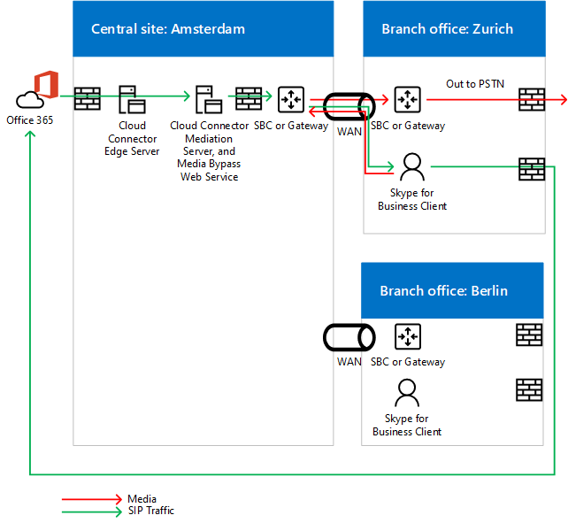

# Planejar o bypass de mídia no Cloud Connector Edition
 
Leia este tópico para revisar as considerações de planejamento para implementar o bypass de mídia com o Cloud Connector Edition versão 2,0 e posterior. Para obter informações sobre como implantar o bypass de mídia, consulte [Deploy Media bypass in Cloud Connector Edition](deploy-media-bypass-in-cloud-connector.md).
  
O bypass de mídia permite que um cliente envie mídia diretamente para o próximo salto da PSTN (rede telefônica pública comutada), um gateway ou um SBC (controlador de borda da sessão), e elimine o componente do Cloud Connector Edition do caminho da mídia.
  
O bypass de mídia pode melhorar a qualidade da voz reduzindo a latência, a possibilidade de perda de pacotes e o número de pontos de falha em potencial. A eliminação do processamento de mídia para chamadas ignoradas reduz a carga no Cloud Connector, que permite um maior número de chamadas simultâneas e pode melhorar a escalabilidade. 
  
 Liberar o Cloud Connector de tarefas de processamento de mídia pode reduzir o número de dispositivos do Cloud Connector que uma infraestrutura requer, portanto, você deve habilitar o bypass de mídia sempre que possível.
  
## Como o bypass de mídia afeta caminhos de mídia e sinalização

Enquanto a sinalização usa o mesmo caminho com ou sem bypass de mídia, o fluxo de mídia será diferente. Os diagramas a seguir mostram caminhos de mídia e sinalização em topologias com e sem bypass de mídia. 
  
Por exemplo, na seguinte topologia, que não emprega o bypass de mídia, um cliente do Skype for Business coloca uma chamada PSTN em um número externo, a sinalização SIP vai para o Office 365 e o Office 365 direciona o tráfego de sinalização de acordo com a voz do usuário final política. Para usuários do Cloud Connector, a política de voz direciona o tráfego de sinalização para o servidor de borda do Cloud Connector, que roteia o tráfego de sinalização para um controlador de borda de sessão PSTN (SBC) ou Gateway por meio do servidor de mediação do Cloud Connector. O fluxo de mídia do cliente Skype for Business para o servidor de mediação do Cloud Connector e, em seguida, para o SBC ou gateway, conforme mostrado no diagrama a seguir:
  
**Caminhos de mídia e sinalização sem bypass de mídia**

  
Uma chamada de entrada da PSTN usa o mesmo caminho de sinalização na direção inversa. Para usuários internos, a mídia ainda será por fim fluir entre o cliente do Skype for Business e o servidor de mediação do Cloud Connector e, em seguida, o SBC ou gateway.
  
Na próxima topologia, que emprega o bypass de mídia, a sinalização utiliza o mesmo caminho, mas a mídia flui diretamente entre o cliente Skype for Business e o SBC ou o gateway, conforme mostrado no diagrama a seguir:
  
**Caminhos de mídia e sinalização com bypass de mídia**

  
## Cenário de vários sites e bypass de mídia

O bypass de mídia também é útil quando você deseja fornecer serviços de telefonia a vários sites usando um único dispositivo do Cloud Connector. Como o Cloud Connector não pode rotear chamadas com base nos números de origem ou de destino, a maioria das empresas implanta um SBC ou Gateway por trás do Cloud Connector para tomar decisões de roteamento. O bypass de mídia neste cenário elimina o salto entre o cliente e o SBC ou gateway central, conforme mostrado no diagrama a seguir:
  
**Aplicativo de vários sites**

  
1. O tráfego SIP flui do usuário em Zurique para o Office 365.
    
2. O tráfego, em seguida, roteia para o dispositivo do Cloud Connector em Amsterdã conforme especificado na política de roteamento de voz do usuário.
    
3. O dispositivo do Cloud Connector no Amsterdã envia o tráfego SIP para o gateway central na Amsterdã.
    
4. O gateway central na Amsterdã toma as decisões de roteamento apropriadas e, em seguida, envia o tráfego para um SBC ou gateway em Zurique, enquanto a mídia flui diretamente entre o cliente Skype for Business e o SBC ou o gateway em Amsterdã.
    
   Essa abordagem permite atender a mais usuários por uma implantação do Cloud Connector onde o Cloud Connector é centralizado. Embora o Cloud Connector seja eliminado do caminho de mídia, em uma mídia de cenário de vários locais centralizados ainda pode atravessar o WAN duas vezes, conforme necessário, para o fluxo de SBC ou gateway centralizado.
  
Se um cliente está fora da rede corporativa que está fazendo uma chamada de saída, o tráfego de mídia flui por meio dos servidores de borda e de mediação do Cloud Connector e link WAN entre o Zurique e o Amsterdã, conforme mostrado no diagrama a seguir:
  

  
## Clientes com suporte para bypass de mídia

Com o primeiro lançamento do bypass de mídia, o único cliente com suporte é o cliente Windows do Skype for Business 2016 que faz parte do Office 365 ProPlus, versão 16.0.7870.2020 ou superior. Os clientes podem usar qualquer canal: atual, adiado ou primeiro lançamento adiado. 
  
> [!NOTE]
> Se você estiver usando uma solução VPN de cliente em combinação com o cliente Skype for Business, o bypass de mídia é suportado apenas com uma configuração de túnel de divisão de VPN. 
  
Para obter mais informações sobre os canais de lançamento, consulte [Overview of Update Channels for Office 365 ProPlus](https://support.office.com/article/Overview-of-update-channels-for-Office-365-ProPlus-9ccf0f13-28ff-4975-9bd2-7e4ea2fefef4?ui=en-US&amp;rs=en-US&amp;ad=US).
  
Para a versão atual de lançamento dos clientes em diferentes canais, consulte [Release Information for updates for Office 365 ProPlus](https://docs.microsoft.com/officeupdates/release-notes-office365-proplus). 
  
## Considerações de capacidade do Cloud Connector com bypass de mídia

Sem bypass de mídia — e dependendo do hardware — um dispositivo do Cloud Connector pode lidar de 50 a 500 chamadas simultâneas que exigem que a mídia viaje por meio de um servidor de mediação. Para obter mais informações, consulte [Plan for Skype for Business Cloud Connector Edition](https://technet.microsoft.com/library/mt605227.aspx). 
  
Com o bypass de mídia habilitado, os clientes internos na versão com suporte não usam o servidor de mediação, portanto, o número de clientes internos pode aumentar significativamente. 
  
Conforme observado acima, clientes externos ou clientes sem suporte usarão os servidores de borda e mediação do Cloud Connector para mídia. Ao calcular quantos dispositivos do Cloud Connector devem ser colocados em um site, você deve considerar o tráfego de usuários externos e usuários em clientes sem suporte.
  
## O Cloud Connector suporta sempre o modo Bypass

O Cloud Connector suporta sempre o modo bypass. Em ambientes locais, há duas opções: sempre ignorar e usar informações do site e da região.
  
Sempre ignorar significa que o bypass de mídia será tentado para todas as chamadas PSTN com clientes internos como um ponto de origem ou de destino. Para determinar se o cliente é interno ou externo, um site da máquina virtual do servidor de mediação é usado. Se o cliente puder acessar o site, ele será considerado interno e o bypass de mídia será usado. Se o cliente não conseguir acessar o site (por exemplo, se o cliente estiver em uma rede doméstica), o bypass de mídia não será usado. 
  
Sempre ignorar requer conectividade desobstruída entre usuários e gateways PSTN em um site PSTN. 
  
Para obter mais informações, consulte [Plan for Skype for Business Cloud Connector Edition](https://technet.microsoft.com/library/mt605227.aspx). 
  
Por exemplo, no diagrama abaixo, os usuários da Europa devem estar bem conectados aos três controladores de borda de sessão (SBCs) no Amsterdã, enquanto os usuários do oeste dos EUA devem estar bem conectados a dois SBCs em Seattle. Bem conectado significa que eles estão localizados no mesmo local de rede que os SBCs ou gateways, ou em links WAN com largura de banda adequada.
  

  
> [!NOTE]
> Se um usuário do Zurique viajar para o escritório de Seattle e você quiser usar a rede interna para entregar o tráfego de mídia entre o usuário e os gateways da Europa (em vez de passar pela Internet), deverá verificar se o escritório de Seattle e o Amsterdã Office onde SBCs ou gateways europeus estão localizados tão bem conectados. 
  
## Codecs usados no bypass de mídia

Com o bypass de mídia habilitado, o tráfego de mídia entre um cliente e um SBC ou gateway usa o codec G. 711. 
  
## Confira também

[Implantar bypass de mídia no Cloud Connector Edition](deploy-media-bypass-in-cloud-connector.md)
