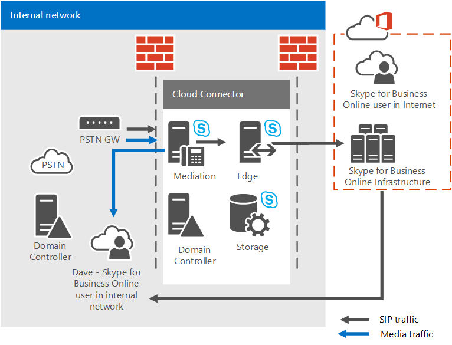

# <a name="plan-for-skype-for-business-cloud-connector-edition"></a><span data-ttu-id="7d3a1-103">Plano do Skype for Business Edição Cloud Connector</span><span class="sxs-lookup"><span data-stu-id="7d3a1-103">Plan for Skype for Business Cloud Connector Edition</span></span>

<span data-ttu-id="7d3a1-104">Encontre informações sobre o Skype for Business Cloud Connector Edition, um conjunto de máquinas virtuais (VMs) compactadas que implementam conectividade PSTN local com o Sistema de Telefonia do Office 365 (Cloud PBX).</span><span class="sxs-lookup"><span data-stu-id="7d3a1-104">Find information on Skype for Business Cloud Connector Edition, a set of packaged Virtual Machines (VMs) that implement on-premises PSTN connectivity with Phone System in Office 365 (Cloud PBX).</span></span>

<span data-ttu-id="7d3a1-105">Nuvem conector Edition pode ser a solução ideal para sua organização se você ainda não tiver um servidor existente do Lync ou Skype para implantação de servidor de negócios.</span><span class="sxs-lookup"><span data-stu-id="7d3a1-105">Cloud Connector Edition might be the right solution for your organization if you do not already have an existing Lync Server or Skype for Business Server deployment.</span></span> <span data-ttu-id="7d3a1-106">Se você ainda está investigando que o sistema telefônico na solução do Office 365 é adequado para sua empresa, consulte [soluções de telefonia da Microsoft](https://docs.microsoft.com/en-us/SkypeForBusiness/hybrid/msft-telephony-solutions).</span><span class="sxs-lookup"><span data-stu-id="7d3a1-106">If you're still investigating which Phone System in Office 365 solution is right for your business, see [Microsoft telephony solutions](https://docs.microsoft.com/en-us/SkypeForBusiness/hybrid/msft-telephony-solutions).</span></span>

<span data-ttu-id="7d3a1-107">Este documento descreve os requisitos de edição do conector de nuvem e as topologias com suporte e ajuda você a planejar sua implantação de edição do conector de nuvem.</span><span class="sxs-lookup"><span data-stu-id="7d3a1-107">This document describes Cloud Connector Edition requirements and supported topologies, and helps you plan your Cloud Connector Edition deployment.</span></span> <span data-ttu-id="7d3a1-108">Certifique-se de ler este tópico antes de configurar seu ambiente do conector de nuvem.</span><span class="sxs-lookup"><span data-stu-id="7d3a1-108">Be sure to read this topic before you configure your Cloud Connector environment.</span></span> <span data-ttu-id="7d3a1-109">Quando você estiver pronto para implantar e configurar a edição do conector de nuvem, consulte [Configurar e gerenciar Skype do conector de nuvem Business Edition](configure-skype-for-business-cloud-connector-edition.md).</span><span class="sxs-lookup"><span data-stu-id="7d3a1-109">When you are ready to deploy and configure Cloud Connector Edition, see [Configure and manage Skype for Business Cloud Connector Edition](configure-skype-for-business-cloud-connector-edition.md).</span></span>

<span data-ttu-id="7d3a1-110">Edição de conector de nuvem 2.1 agora está disponível.</span><span class="sxs-lookup"><span data-stu-id="7d3a1-110">Cloud Connector Edition 2.1 is now available.</span></span> <span data-ttu-id="7d3a1-111">Se você ainda não tiver atualizado para a versão 2.1, veja [Upgrade to a new version of Cloud Connector](upgrade-to-a-new-version-of-cloud-connector.md).</span><span class="sxs-lookup"><span data-stu-id="7d3a1-111">If you have not yet upgraded to 2.1, see [Upgrade to a new version of Cloud Connector](upgrade-to-a-new-version-of-cloud-connector.md).</span></span> <span data-ttu-id="7d3a1-112">Você pode encontrar o arquivo de instalação em [https://aka.ms/CloudConnectorInstaller](https://aka.ms/CloudConnectorInstaller).</span><span class="sxs-lookup"><span data-stu-id="7d3a1-112">You can find the installation file at [https://aka.ms/CloudConnectorInstaller](https://aka.ms/CloudConnectorInstaller).</span></span>

> [!NOTE]
> <span data-ttu-id="7d3a1-113">Microsoft suporta a versão anterior do Edition do conector de nuvem para 60 dias após o lançamento de uma nova versão.</span><span class="sxs-lookup"><span data-stu-id="7d3a1-113">Microsoft supports the previous version of Cloud Connector Edition for 60 days after the release of a new version.</span></span> <span data-ttu-id="7d3a1-114">A Microsoft dará suporte para a versão 2.0.1 por 60 dias após o lançamento da versão 2.1 para que você tenha tempo para fazer a atualização.</span><span class="sxs-lookup"><span data-stu-id="7d3a1-114">Microsoft will support version 2.0.1 for 60 days after the release of 2.1 to allow you time to upgrade.</span></span> <span data-ttu-id="7d3a1-115">Não há mais suporte para as versões anteriores à 2.0.1.</span><span class="sxs-lookup"><span data-stu-id="7d3a1-115">All versions previous to 2.0.1 are no longer supported.</span></span>

<span data-ttu-id="7d3a1-116">Edição de conector de nuvem é uma oferta de híbrida que consiste em um conjunto de Industrializados máquinas virtuais (VMs) implementar a conectividade PSTN local com o sistema telefônico no Office 365.</span><span class="sxs-lookup"><span data-stu-id="7d3a1-116">Cloud Connector Edition is a hybrid offering that consists of a set of packaged Virtual Machines (VMs) that implement on-premises PSTN connectivity with Phone System in Office 365.</span></span> <span data-ttu-id="7d3a1-117">Implantando um Skype mínimo para a topologia de servidor de negócios em um ambiente virtualizado, os usuários em sua organização hospedados na nuvem podem receber serviços PBX de nuvem da Microsoft, mas conectividade PSTN é fornecida por meio de voz no local existente infraestrutura.</span><span class="sxs-lookup"><span data-stu-id="7d3a1-117">By deploying a minimal Skype for Business Server topology in a virtualized environment, users in your organization who are homed in the cloud can receive PBX services from the Microsoft cloud, but PSTN connectivity is provided through the existing on-premises voice infrastructure.</span></span>


<span data-ttu-id="7d3a1-119">Já que o Cloud Connector permite integrar os serviços do Sistema de Telefonia do Office 365 com o seu ambiente de telefonia existente, por exemplo, PBX, dispositivos analógicos e Call Centers, você pode implementar uma migração em fases da sua solução de telefonia existente para o Sistema de Telefonia do Office 365.</span><span class="sxs-lookup"><span data-stu-id="7d3a1-119">Because Cloud Connector enables you to integrate Phone System in Office 365 services with your existing telephony environment—for example, PBX, analog devices, and Call Centers—you can implement a phased migration from your existing telephony solution to Phone System in Office 365.</span></span>

<span data-ttu-id="7d3a1-120">Por exemplo, suponha que sua empresa tenha um Call Center sofisticado com uma funcionalidade específica que o Sistema de Telefonia do Office 365 não oferece.</span><span class="sxs-lookup"><span data-stu-id="7d3a1-120">For example, assume your company has a sophisticated Call Center with specific functionality that Phone System in Office 365 does not provide.</span></span> <span data-ttu-id="7d3a1-121">Você pode optar por deixar os usuários do Call Center com a solução existente, mas migrar outros usuários para o Sistema de Telefonia do Office 365.</span><span class="sxs-lookup"><span data-stu-id="7d3a1-121">You can choose to leave Call Center users with the existing solution, but move other users to Phone System in Office 365.</span></span>

<span data-ttu-id="7d3a1-122">O Cloud Connector fornecerá o roteamento entre os usuários hospedados no local e online, e você pode optar por usar o seu próprio provedor de PSTN com o Sistema de Telefonia do Office 365.</span><span class="sxs-lookup"><span data-stu-id="7d3a1-122">Cloud Connector will provide routing between the users homed on premises and online, and you can choose to use your own PSTN provider with Phone System in Office 365.</span></span>

<span data-ttu-id="7d3a1-123">Considere o seguinte ao planejar a implantação de nuvem conector Edition:</span><span class="sxs-lookup"><span data-stu-id="7d3a1-123">Consider the following when planning your Cloud Connector Edition deployment:</span></span>

- <span data-ttu-id="7d3a1-124">Para usar o conector de nuvem para tirar proveito das soluções de voz de nuvem, você precisará Inscreva-se para um locatário do Office 365 que inclui o sistema telefônico no Office 365.</span><span class="sxs-lookup"><span data-stu-id="7d3a1-124">To use Cloud Connector to take advantage of cloud voice solutions, you'll need to sign up for an Office 365 tenant that includes Phone System in Office 365.</span></span> <span data-ttu-id="7d3a1-125">Se você ainda não tiver um locatário do Office 365, você pode aprender como Inscreva-se aqui: [Office 365 para empresas](https://products.office.com/en-us/business/office).</span><span class="sxs-lookup"><span data-stu-id="7d3a1-125">If you do not yet have an Office 365 tenant you can learn how to sign up here: [Office 365 for Business](https://products.office.com/en-us/business/office).</span></span> <span data-ttu-id="7d3a1-126">Observe que você precisará se inscrever para um plano que inclua Skype para negócios Online.</span><span class="sxs-lookup"><span data-stu-id="7d3a1-126">Note that you'll need to sign up for a plan that includes Skype for Business Online.</span></span>

- <span data-ttu-id="7d3a1-127">Para registrar os aparelhos de conector de nuvem com o Skype para serviço de Business Online e executar vários cmdlets, o conector de nuvem 2.0 e posterior exige uma conta dedicada do Office 365 com o Skype para direitos de administrador de locatário de negócios.</span><span class="sxs-lookup"><span data-stu-id="7d3a1-127">To register Cloud Connector appliances with the Skype for Business Online service, and to run various cmdlets, Cloud Connector 2.0 and later requires a dedicated Office 365 account with the Skype for Business Tenant Administrator rights.</span></span> <span data-ttu-id="7d3a1-128">As versões do Cloud Connector anteriores à 2.0 exigem uma conta dedicada do Office 365 com direitos de administrador global de locatários.</span><span class="sxs-lookup"><span data-stu-id="7d3a1-128">Cloud Connector versions previous to 2.0 require a dedicated Office 365 account with tenant Global Administrator rights.</span></span>

- <span data-ttu-id="7d3a1-129">Conector de nuvem não exige um completo local Skype para implantação de servidor de negócios.</span><span class="sxs-lookup"><span data-stu-id="7d3a1-129">Cloud Connector does not require a full on-premises Skype for Business Server deployment.</span></span>

    <span data-ttu-id="7d3a1-130">Atualmente, o conector de nuvem não podem coexistir com o Lync ou Skype para negócios servidores locais.</span><span class="sxs-lookup"><span data-stu-id="7d3a1-130">Currently, Cloud Connector cannot co-exist with Lync or Skype for Business on-premises servers.</span></span> <span data-ttu-id="7d3a1-131">Se você deseja mover o Lync existente ou Skype para usuários comerciais para o Office 365 e manter fornecendo local telefonia para seus usuários, considere o sistema telefônico no Office 365 com conectividade local usando uma Skype existente para implantação de servidor de negócios.</span><span class="sxs-lookup"><span data-stu-id="7d3a1-131">If you want to move existing Lync or Skype for Business users to Office 365 and keep providing on-premises telephony to your users, consider Phone System in Office 365 with on-premises connectivity using an existing Skype for Business Server deployment.</span></span> <span data-ttu-id="7d3a1-132">Para obter mais informações, consulte [planejar seu sistema telefônico na solução do Office 365 (nuvem PBX)](plan-your-phone-system-cloud-pbx-solution.md) e [Planejar o sistema de telefone no Office 365 com conectividade PSTN local no Skype para Business Server](plan-phone-system-with-on-premises-pstn-connectivity.md).</span><span class="sxs-lookup"><span data-stu-id="7d3a1-132">For more information, see [Plan your Phone System in Office 365 (Cloud PBX) solution](plan-your-phone-system-cloud-pbx-solution.md) and [Plan Phone System in Office 365 with on-premises PSTN connectivity in Skype for Business Server](plan-phone-system-with-on-premises-pstn-connectivity.md).</span></span>

- <span data-ttu-id="7d3a1-133">Se você tinha um Skype anterior para implantação do Lync Server ou de negócios, e você estendeu o esquema, você não precisará limpar o esquema para a implantação do conector de nuvem, desde que você tiver removido todos os Skype para componentes do Lync Server ou de negócios do seu ambiente.</span><span class="sxs-lookup"><span data-stu-id="7d3a1-133">If you had a previous Skype for Business or Lync Server deployment, and you extended the schema, you do not need to clean up the schema for the Cloud Connector deployment, as long as you've removed all Skype for Business or Lync Server components from your environment.</span></span>

- <span data-ttu-id="7d3a1-134">Os usuários estão hospedados on-line.</span><span class="sxs-lookup"><span data-stu-id="7d3a1-134">Your users are homed online.</span></span>

- <span data-ttu-id="7d3a1-135">Se sua organização tiver configurado a DirSync (Sincronização de diretórios), todas as contas de usuários que estão planejadas para voz híbrida devem ser criadas primeiro na sua implantação local e depois sincronizadas com a nuvem.</span><span class="sxs-lookup"><span data-stu-id="7d3a1-135">If your organization has configured Directory Synchronization (DirSync), then all accounts of users who are planned for hybrid voice must be created in your on-premises deployment first, and then synchronized to the cloud.</span></span>

- <span data-ttu-id="7d3a1-136">É possível manter sua operadora de PSTN atual, se necessário.</span><span class="sxs-lookup"><span data-stu-id="7d3a1-136">You can keep your current PSTN carrier if required.</span></span>

- <span data-ttu-id="7d3a1-137">Se você deseja fornecer a conferência discada para usuários hospedados no conector de nuvem, você pode adquirir a licença de conferência PSTN ou pré-pago oferta de conferência de áudio da Microsoft.</span><span class="sxs-lookup"><span data-stu-id="7d3a1-137">If you want to provide dial-in conferencing to users hosted on Cloud Connector, you can purchase PSTN conferencing license or pay as you go Audio Conferencing offer from Microsoft.</span></span>

- <span data-ttu-id="7d3a1-138">A conferência de áudio licença (ou pré-pago oferta) também será necessário para escalonamentos de chamada.</span><span class="sxs-lookup"><span data-stu-id="7d3a1-138">The Audio Conferencing license (or pay as you go offer) also required for call escalations.</span></span> <span data-ttu-id="7d3a1-139">Se um Skype para usuário comercial recebe uma chamada de um usuário externo da PSTN e deseja adicionar um participante mais a chamada (escalar a chamada para uma conferência), o escalonamento será realizado por meio do serviço de conferência de áudio da Microsoft.</span><span class="sxs-lookup"><span data-stu-id="7d3a1-139">If a Skype for Business user receives a call from an external PSTN user and wants to add one more participant to that call (escalate the call to a conference), the escalation will be performed via Microsoft Audio Conferencing service.</span></span>

- <span data-ttu-id="7d3a1-140">Agora, o Cloud Connector 2.0 e versões posteriores têm suporte para bypass de mídia.</span><span class="sxs-lookup"><span data-stu-id="7d3a1-140">Cloud Connector 2.0 and later now supports media bypass.</span></span> <span data-ttu-id="7d3a1-141">Bypass de mídia permite que um cliente enviar mídia diretamente para o próximo salto de rede de telefônica pública comutada (PSTN) — um gateway ou controlador de borda de sessão (SBC) — e eliminar o componente de edição do conector de nuvem do caminho de mídia.</span><span class="sxs-lookup"><span data-stu-id="7d3a1-141">Media bypass allows a client to send media directly to the Public Switched Telephone Network (PSTN) next hop—a gateway or Session Border Controller (SBC)—and eliminate the Cloud Connector Edition component from the media path.</span></span> <span data-ttu-id="7d3a1-142">Para obter mais informações, consulte [Plan for media bypass na nuvem conector Edition](plan-for-media-bypass-in-cloud-connector-edition.md).</span><span class="sxs-lookup"><span data-stu-id="7d3a1-142">For more information, see [Plan for media bypass in Cloud Connector Edition](plan-for-media-bypass-in-cloud-connector-edition.md).</span></span>

- <span data-ttu-id="7d3a1-143">O Cloud Connector 2.1 e versões posteriores dão suporte ao monitoramento do Cloud Connector usando o OMS (Operations Management Suite).</span><span class="sxs-lookup"><span data-stu-id="7d3a1-143">Cloud Connector 2.1 and later supports monitoring Cloud Connector using Operations Management Suite (OMS).</span></span> <span data-ttu-id="7d3a1-144">Para obter mais informações, veja [Monitor Cloud Connector using Operations Management Suite (OMS)](monitor-cloud-connector-using-operations-management-suite-oms.md).</span><span class="sxs-lookup"><span data-stu-id="7d3a1-144">For more information, see [Monitor Cloud Connector using Operations Management Suite (OMS)](monitor-cloud-connector-using-operations-management-suite-oms.md)</span></span>

- <span data-ttu-id="7d3a1-145">Conector de nuvem está disponível em todos os países onde o Office 365 Enterprise E5 está disponível.</span><span class="sxs-lookup"><span data-stu-id="7d3a1-145">Cloud Connector is available in all countries where Office 365 Enterprise E5 is available.</span></span> <span data-ttu-id="7d3a1-146">No entanto, devido a vários regulamentos, o conector de nuvem não pode ser configurado se o local de locatário estiver definido como um dos seguintes países: Argélia, Bangladesh, Botsuana, Brunei, Camarões, Costa do Marfim, Gana, Líbano, Macau, Maurício, Namíbia, Paraguai, Senegal.</span><span class="sxs-lookup"><span data-stu-id="7d3a1-146">However, because of various regulations, Cloud Connector cannot be configured if the tenant location is set to one of the following countries: Algeria, Bangladesh, Botswana, Brunei, Cameroon, Cote d'Ivoire, Ghana, Lebanon, Macau, Mauritius, Namibia, Paraguay, Senegal.</span></span>

<span data-ttu-id="7d3a1-147">Este tópico inclui as seguintes seções:</span><span class="sxs-lookup"><span data-stu-id="7d3a1-147">This topic contains the following sections:</span></span>

- [<span data-ttu-id="7d3a1-148">Componentes da Edição Cloud Connector</span><span class="sxs-lookup"><span data-stu-id="7d3a1-148">Cloud Connector Edition components</span></span>](plan-skype-for-business-cloud-connector-edition.md#BKMK_Components)

- [<span data-ttu-id="7d3a1-149">Topologias da Edição do Cloud Connector</span><span class="sxs-lookup"><span data-stu-id="7d3a1-149">Cloud Connector Edition topologies</span></span>](plan-skype-for-business-cloud-connector-edition.md#BKMK_Topologies)

- [<span data-ttu-id="7d3a1-150">Requisitos para a implantação</span><span class="sxs-lookup"><span data-stu-id="7d3a1-150">Requirements for deployment</span></span>](plan-skype-for-business-cloud-connector-edition.md#BKMK_Requirements)

- [<span data-ttu-id="7d3a1-151">Informações que necessárias para coletar antes da implantação</span><span class="sxs-lookup"><span data-stu-id="7d3a1-151">Information you need to gather before deployment</span></span>](plan-skype-for-business-cloud-connector-edition.md#BKMK_PlanDeployment)

- [<span data-ttu-id="7d3a1-152">Considerações sobre plano de discagem</span><span class="sxs-lookup"><span data-stu-id="7d3a1-152">Dial plan considerations</span></span>](plan-skype-for-business-cloud-connector-edition.md#BKMK_DailPlan)

- [<span data-ttu-id="7d3a1-153">Considerações sobre alta disponibilidade</span><span class="sxs-lookup"><span data-stu-id="7d3a1-153">High availability considerations</span></span>](plan-skype-for-business-cloud-connector-edition.md#BKMK_HA)

- [<span data-ttu-id="7d3a1-154">Fluxo de mídia do Cloud Connector</span><span class="sxs-lookup"><span data-stu-id="7d3a1-154">Cloud Connector media flow</span></span>](plan-skype-for-business-cloud-connector-edition.md#BKMK_MediaFlow)

- [<span data-ttu-id="7d3a1-155">Monitoramento e solução de problemas</span><span class="sxs-lookup"><span data-stu-id="7d3a1-155">Monitoring and troubleshooting</span></span>](plan-skype-for-business-cloud-connector-edition.md#BKMK_Monitor)

- [<span data-ttu-id="7d3a1-156">Para obter mais informações</span><span class="sxs-lookup"><span data-stu-id="7d3a1-156">For more information</span></span>](plan-skype-for-business-cloud-connector-edition.md#BKMK_MoreInfo)

## <a name="cloud-connector-edition-components"></a><span data-ttu-id="7d3a1-157">Componentes da Edição Cloud Connector</span><span class="sxs-lookup"><span data-stu-id="7d3a1-157">Cloud Connector Edition components</span></span>
<span data-ttu-id="7d3a1-158"><a name="BKMK_Components"> </a></span><span class="sxs-lookup"><span data-stu-id="7d3a1-158"></span></span>

<span data-ttu-id="7d3a1-159">Com a edição do conector de nuvem, você implantar um conjunto de Industrializados VMs que contêm um Skype mínimo para a topologia de servidor de negócios — consiste em um componente de borda, o componente de mediação e uma função do repositório de gerenciamento Central (CMS).</span><span class="sxs-lookup"><span data-stu-id="7d3a1-159">With Cloud Connector Edition, you deploy a set of packaged VMs that contain a minimal Skype for Business Server topology—consisting of an Edge component, Mediation component, and a Central Management Store (CMS) role.</span></span> <span data-ttu-id="7d3a1-160">Você também instalará um controlador de domínio, é necessário para o funcionamento interno do conector de nuvem.</span><span class="sxs-lookup"><span data-stu-id="7d3a1-160">You will also install a domain controller, which is required for the internal functioning of Cloud Connector.</span></span> <span data-ttu-id="7d3a1-161">Esses serviços são configurados para o híbrido com seu locatário do Office 365 que inclui Skype para serviços corporativos Online.</span><span class="sxs-lookup"><span data-stu-id="7d3a1-161">These services are configured for hybrid with your Office 365 tenant that includes Skype for Business Online services.</span></span>


<span data-ttu-id="7d3a1-163">Componentes do conector de nuvem fornecem as seguintes funcionalidades:</span><span class="sxs-lookup"><span data-stu-id="7d3a1-163">Cloud Connector components provide the following functionality:</span></span>

- <span data-ttu-id="7d3a1-164">**Componente de borda** - a comunicação entre a topologia do local e os serviços online passa o componente de borda, que inclui os seguintes componentes:</span><span class="sxs-lookup"><span data-stu-id="7d3a1-164">**Edge component** - Communication between the on-premises topology and the online services goes through the Edge component, which includes the following components:</span></span>

  - <span data-ttu-id="7d3a1-165">**Borda de acesso** - fornece SIP roteamento entre a implantação no local e Skype para Business Online.</span><span class="sxs-lookup"><span data-stu-id="7d3a1-165">**Access Edge** - Provides SIP routing between the on-premises deployment and Skype for Business Online.</span></span>

  - <span data-ttu-id="7d3a1-166">**Retransmissão de mídia** - fornece um roteamento de mídia entre o componente de mediação e outros pontos de extremidade de mídia.</span><span class="sxs-lookup"><span data-stu-id="7d3a1-166">**Media Relay** - Provides routing of media between the Mediation component and other media endpoints.</span></span>

  - <span data-ttu-id="7d3a1-167">**Autenticação de retransmissão de mídia / MRAS** -gera tokens de acesso a retransmissão de mídia.</span><span class="sxs-lookup"><span data-stu-id="7d3a1-167">**Media Relay Authentication / MRAS** - Generates tokens for access to media relay.</span></span>

- <span data-ttu-id="7d3a1-168">**Roteamento de saída** - fornece o balanceamento de carga do tráfego de voz entre gateways ou SBCs conectado a um aparelho de conector de nuvem.</span><span class="sxs-lookup"><span data-stu-id="7d3a1-168">**Outbound Routing** - Provides load balancing of the voice traffic between gateways or SBCs connected to a Cloud Connector appliance.</span></span> <span data-ttu-id="7d3a1-169">As chamadas serão divididas igualmente entre os gateways ou os SBCs conectados ao dispositivo do Cloud Connector.</span><span class="sxs-lookup"><span data-stu-id="7d3a1-169">Calls will be split evenly between all gateways or SBCs connected to the Cloud Connector appliance.</span></span>

    <span data-ttu-id="7d3a1-170">Fornece o roteamento para gateways com base em políticas.</span><span class="sxs-lookup"><span data-stu-id="7d3a1-170">Provides routing to gateways based on policies.</span></span> <span data-ttu-id="7d3a1-171">Só há suporte para políticas globais que se baseiam em números PSTN de destino (saída).</span><span class="sxs-lookup"><span data-stu-id="7d3a1-171">Only global policies which are based on destination (outbound) PSTN numbers are supported.</span></span>

- <span data-ttu-id="7d3a1-172">**Função do repositório de gerenciamento central (CMS)** - inclui o repositório de configuração para os componentes da topologia, incluindo a transferência de arquivo do CMS.</span><span class="sxs-lookup"><span data-stu-id="7d3a1-172">**Central Management Store (CMS) role** - Includes the configuration store for the topology components, including CMS File Transfer.</span></span>

- <span data-ttu-id="7d3a1-173">**Repositório de gerenciamento central (CMS) réplica** - sincroniza as informações de configuração a partir do BD de CMS global no servidor de função de CMS.</span><span class="sxs-lookup"><span data-stu-id="7d3a1-173">**Central Management Store (CMS) replica** - Synchronizes configuration information from the global CMS DB on the CMS role server.</span></span>

- <span data-ttu-id="7d3a1-174">**Controlador de domínio** - nuvem conector Active Directory Domain Services para armazenar todos os grupos necessários para implantar os componentes de conector de nuvem e as configurações globais.</span><span class="sxs-lookup"><span data-stu-id="7d3a1-174">**Domain controller** - Cloud Connector Active Directory Domain Services to store all the global settings and groups necessary to deploy Cloud Connector components.</span></span> <span data-ttu-id="7d3a1-175">Uma floresta será criada para cada dispositivo do conector de nuvem.</span><span class="sxs-lookup"><span data-stu-id="7d3a1-175">One forest will be created for each Cloud Connector appliance.</span></span> <span data-ttu-id="7d3a1-176">O controlador de domínio não deve ter todas as conexões com o Active Directory de produção.</span><span class="sxs-lookup"><span data-stu-id="7d3a1-176">The domain controller must not have any connections with the production Active Directory.</span></span> <span data-ttu-id="7d3a1-177">Os serviços do Active Directory incluem:</span><span class="sxs-lookup"><span data-stu-id="7d3a1-177">Active Directory services include:</span></span>

  - <span data-ttu-id="7d3a1-178">Serviços de Domínio Active Directory</span><span class="sxs-lookup"><span data-stu-id="7d3a1-178">Active Directory Domain Services</span></span>

  - <span data-ttu-id="7d3a1-179">Serviços de Certificado do Active Directory para emitir certificados internos</span><span class="sxs-lookup"><span data-stu-id="7d3a1-179">Active Directory Certificate Services to issue internal certificates</span></span>

- <span data-ttu-id="7d3a1-180">**Componente de mediação** - protocolo de mapeamento de gateway de mídia e implementa SIP entre Skype para os gateways PSTN e de negócios.</span><span class="sxs-lookup"><span data-stu-id="7d3a1-180">**Mediation component** - Implements SIP and Media gateway mapping protocol between Skype for Business and PSTN gateways.</span></span> <span data-ttu-id="7d3a1-181">Inclui uma réplica CMS que sincroniza a configuração do banco de dados CMS global.</span><span class="sxs-lookup"><span data-stu-id="7d3a1-181">Includes a CMS replica that synchronizes configuration from the global CMS database.</span></span>

## <a name="cloud-connector-edition-topologies"></a><span data-ttu-id="7d3a1-182">Topologias da Edição do Cloud Connector</span><span class="sxs-lookup"><span data-stu-id="7d3a1-182">Cloud Connector Edition topologies</span></span>
<span data-ttu-id="7d3a1-183"><a name="BKMK_Topologies"> </a></span><span class="sxs-lookup"><span data-stu-id="7d3a1-183"></span></span>

<span data-ttu-id="7d3a1-184">Para os fins desta discussão, vamos nos referir a sites PSTN.</span><span class="sxs-lookup"><span data-stu-id="7d3a1-184">For purposes of this discussion, we will refer to PSTN sites.</span></span> <span data-ttu-id="7d3a1-185">Um site PSTN é uma combinação de aparelhos de conector de nuvem, implantado no mesmo local e com os gateways PSTN comuns conectados a eles.</span><span class="sxs-lookup"><span data-stu-id="7d3a1-185">A PSTN site is a combination of Cloud Connector appliances, deployed at the same location, and with common PSTN gateways connected to them.</span></span> <span data-ttu-id="7d3a1-186">Os sites PSTN permitem:</span><span class="sxs-lookup"><span data-stu-id="7d3a1-186">PSTN sites allow you to:</span></span>

- <span data-ttu-id="7d3a1-187">Fornecer conectividade aos gateways mais próximos aos usuários.</span><span class="sxs-lookup"><span data-stu-id="7d3a1-187">Provide connectivity to gateways that are closest to your users.</span></span>

- <span data-ttu-id="7d3a1-188">Permitir escalabilidade com a implantação de vários dispositivos de nuvem conector dentro de um ou mais sites PSTN.</span><span class="sxs-lookup"><span data-stu-id="7d3a1-188">Allow for scalability by deploying multiple Cloud Connector appliances within one or more PSTN sites.</span></span>

- <span data-ttu-id="7d3a1-189">Permitir para alta disponibilidade com a implantação de vários dispositivos de nuvem conector dentro de um único site do PSTN.</span><span class="sxs-lookup"><span data-stu-id="7d3a1-189">Allow for high availability by deploying multiple Cloud Connector appliances within a single PSTN site.</span></span>

<span data-ttu-id="7d3a1-190">Neste tópico, são apresentados os sites PSTN.</span><span class="sxs-lookup"><span data-stu-id="7d3a1-190">This topic introduces PSTN sites.</span></span> <span data-ttu-id="7d3a1-191">Para obter mais informações sobre o planejamento de seus sites PSTN, veja [Plan for Cloud Connector Edition PSTN sites](plan-for-cloud-connector-edition-pstn-sites.md).</span><span class="sxs-lookup"><span data-stu-id="7d3a1-191">For more information about planning your PSTN sites, see [Plan for Cloud Connector Edition PSTN sites](plan-for-cloud-connector-edition-pstn-sites.md).</span></span>

<span data-ttu-id="7d3a1-192">Você pode implantar as seguintes topologias de conector de nuvem:</span><span class="sxs-lookup"><span data-stu-id="7d3a1-192">You can deploy the following Cloud Connector topologies:</span></span>

- <span data-ttu-id="7d3a1-193">Um único appliance de nuvem conector Edition por site PSTN.</span><span class="sxs-lookup"><span data-stu-id="7d3a1-193">A single Cloud Connector Edition appliance per PSTN site.</span></span> <span data-ttu-id="7d3a1-194">Essa topologia é recomendada apenas para fins de avaliação, pois não fornece alta disponibilidade.</span><span class="sxs-lookup"><span data-stu-id="7d3a1-194">This topology is recommended for evaluation purposes only because it does not provide high availability.</span></span>

- <span data-ttu-id="7d3a1-195">Vários dispositivos de nuvem conector Edition por site PSTN para fornecer alta disponibilidade.</span><span class="sxs-lookup"><span data-stu-id="7d3a1-195">Multiple Cloud Connector Edition appliances per PSTN site to provide high availability.</span></span>

- <span data-ttu-id="7d3a1-196">Vários sites PSTN com vários dispositivos de edição do conector de nuvem para oferecer escalabilidade com alta disponibilidade.</span><span class="sxs-lookup"><span data-stu-id="7d3a1-196">Multiple PSTN sites with multiple Cloud Connector Edition appliances to provide scalability with high availability.</span></span> <span data-ttu-id="7d3a1-197">Você pode implantar até 200 sites.</span><span class="sxs-lookup"><span data-stu-id="7d3a1-197">You can deploy up to 200 sites.</span></span>

<span data-ttu-id="7d3a1-198">Ao planejar sua topologia, considere o seguinte:</span><span class="sxs-lookup"><span data-stu-id="7d3a1-198">When planning your topology, consider the following:</span></span>

- <span data-ttu-id="7d3a1-199">Com a nuvem conector 2.0 e posterior, um site PSTN pode ter até 16 aparelhos de conector de nuvem.</span><span class="sxs-lookup"><span data-stu-id="7d3a1-199">With Cloud Connector 2.0 and later, one PSTN site can have up to 16 Cloud Connector appliances.</span></span> <span data-ttu-id="7d3a1-200">As versões anteriores suportam até 4 dispositivos por site.</span><span class="sxs-lookup"><span data-stu-id="7d3a1-200">Previous versions support up to 4 appliances per site.</span></span>

- <span data-ttu-id="7d3a1-201">Existem dois tipos de configurações de hardware testadas com o conector de nuvem:</span><span class="sxs-lookup"><span data-stu-id="7d3a1-201">There are two types of hardware configurations tested with Cloud Connector:</span></span>

  - <span data-ttu-id="7d3a1-202">A versão grande é capaz de processar grandes volumes de chamadas simultâneas e é compatível com todos os tipos de ambientes de produção.</span><span class="sxs-lookup"><span data-stu-id="7d3a1-202">The larger version is capable of handling large volumes of simultaneous calls and is supported in all types of production environments.</span></span>

  - <span data-ttu-id="7d3a1-p124">A versão pequena deve ser executada em hardware lower-end e pode ser utilizada para avaliação ou para sites com baixos volumes de chamadas. Se você implantar uma versão pequena do Cloud Connector, precisará ficar atento aos requisitos do hardware de classe de produção (como fontes de alimentação duplas).</span><span class="sxs-lookup"><span data-stu-id="7d3a1-p124">The smaller version is intended to run on lower-end hardware and can be used for evaluation purposes or for sites with low call volumes. If you deploy a smaller version of Cloud Connector, you still need to be mindful of production-class hardware requirements (such as dual power supplies).</span></span>

- <span data-ttu-id="7d3a1-205">Se você tiver o conector de nuvem versão 2.0 ou posterior e implantar a configuração máxima de 16 dispositivos (com hardware maior), o seu site PSTN pode manipular até 8.000 chamadas simultâneas.</span><span class="sxs-lookup"><span data-stu-id="7d3a1-205">If you have Cloud Connector version 2.0 or later and you deploy the maximum configuration of 16 appliances (with larger hardware), then your PSTN site can handle up to 8,000 simultaneous calls.</span></span> <span data-ttu-id="7d3a1-206">Se você implantar a versão menor, o limite suportado será 800.</span><span class="sxs-lookup"><span data-stu-id="7d3a1-206">If you deploy the smaller version, the supported limit is 800.</span></span>

    <span data-ttu-id="7d3a1-207">Você também precisa dedicar alguns dispositivos para a alta disponibilidade.</span><span class="sxs-lookup"><span data-stu-id="7d3a1-207">You also need to dedicate some appliances for High Availability.</span></span> <span data-ttu-id="7d3a1-208">A recomendação mínima é que um dispositivo seja reservado para a alta disponibilidade.</span><span class="sxs-lookup"><span data-stu-id="7d3a1-208">The minimal recommendation is that one appliance should be reserved for High Availability.</span></span>

  - <span data-ttu-id="7d3a1-209">Com a versão 2, se você implantar uma configuração de 15 + 1, seu site PSTN pode lidar com até 7.500 chamadas simultâneas.</span><span class="sxs-lookup"><span data-stu-id="7d3a1-209">With version 2, If you deploy a 15+1 configuration, your PSTN site can handle up to 7,500 simultaneous calls.</span></span>

  - <span data-ttu-id="7d3a1-p127">Se você tiver uma versão anterior e implantar a configuração máxima de 3 + 1 (com hardware grande), seu local de PSTN poderá processar até 1.500 chamadas simultâneas. Se você implantar a versão pequena, o limite suportado será 150.</span><span class="sxs-lookup"><span data-stu-id="7d3a1-p127">If you have an earlier version, and deploy the maximum 3 + 1 configuration (with larger hardware), then your PSTN site can handle up to 1500 simultaneous calls. If you deploy the smaller version, the supported limit is 150.</span></span>

-  <span data-ttu-id="7d3a1-212">Se houver a necessidade de mais chamadas por site PSTN, é possível aumentar a escala ao implantar sites PSTN adicionais no mesmo local.</span><span class="sxs-lookup"><span data-stu-id="7d3a1-212">If you need to have more calls per PSTN site, you can scale up by deploying additional PSTN sites in the same location.</span></span>

> [!NOTE]
> <span data-ttu-id="7d3a1-213">A menos que observado, os diagramas e os exemplos a seguir supõem o uso da versão maior do conector de nuvem.</span><span class="sxs-lookup"><span data-stu-id="7d3a1-213">Unless noted, the diagrams and examples below assume the use of the larger version of Cloud Connector.</span></span>

### <a name="single-cloud-connector-appliance-within-a-single-pstn-site"></a><span data-ttu-id="7d3a1-214">Um único dispositivo do Cloud Connector em um único site PSTN</span><span class="sxs-lookup"><span data-stu-id="7d3a1-214">Single Cloud Connector appliance within a single PSTN site</span></span>

<span data-ttu-id="7d3a1-215">O diagrama a seguir mostra um único appliance de nuvem conector Edition em um único site do PSTN.</span><span class="sxs-lookup"><span data-stu-id="7d3a1-215">The following diagram shows a single Cloud Connector Edition appliance within a single PSTN site.</span></span> <span data-ttu-id="7d3a1-216">Observe que o conector de nuvem consiste em quatro VMs instaladas em uma máquina host física que está contido em uma rede de perímetro para fins de segurança.</span><span class="sxs-lookup"><span data-stu-id="7d3a1-216">Note that Cloud Connector consists of four VMs installed on one physical host machine that is within a perimeter network for security purposes.</span></span>


### <a name="multiple-cloud-connector-appliances-within-a-single-pstn-site"></a><span data-ttu-id="7d3a1-218">Vários dispositivos do Cloud Connector em um único site PSTN</span><span class="sxs-lookup"><span data-stu-id="7d3a1-218">Multiple Cloud Connector appliances within a single PSTN site</span></span>

 <span data-ttu-id="7d3a1-219">Para fins de alta disponibilidade e de escalabilidade, você pode optar por ter várias edições do conector de nuvem dentro de um único site do PSTN, conforme mostrado no diagrama a seguir.</span><span class="sxs-lookup"><span data-stu-id="7d3a1-219">For scalability and high availability purposes, you can choose to have multiple Cloud Connector Editions within a single PSTN site as shown in the following diagram.</span></span> <span data-ttu-id="7d3a1-220">Considere o seguinte:</span><span class="sxs-lookup"><span data-stu-id="7d3a1-220">Consider the following:</span></span>

- <span data-ttu-id="7d3a1-221">As chamadas são distribuídas em ordem aleatória entre as instâncias do Cloud Connector em um pool.</span><span class="sxs-lookup"><span data-stu-id="7d3a1-221">Calls are distributed in random order between Cloud Connectors in one pool.</span></span>

- <span data-ttu-id="7d3a1-222">Para fins de planejamento de capacidade, você deve considerar a capacidade de lidar com a carga caso uma ou mais instâncias do Cloud Connector fiquem offline, com base nos seguintes cálculos:</span><span class="sxs-lookup"><span data-stu-id="7d3a1-222">For capacity planning purposes, you must consider the ability to handle the load if one or more Cloud Connectors go offline, based on the following calculations:</span></span>

  - <span data-ttu-id="7d3a1-223">**N+1 caixas.**</span><span class="sxs-lookup"><span data-stu-id="7d3a1-223">**N+1 boxes.**</span></span> <span data-ttu-id="7d3a1-224">Para a versão maior do conector de nuvem, N + 1 caixas suportam 500\*chamadas simultâneas do N com 99,8% de disponibilidade.</span><span class="sxs-lookup"><span data-stu-id="7d3a1-224">For the larger version of Cloud Connector, N+1 boxes support 500\*N concurrent calls with 99.8% availability.</span></span>

    <span data-ttu-id="7d3a1-225">Para a versão menor do conector de nuvem, N + 1 caixas oferecem suporte para 50\*chamadas simultâneas do N com 99,8% de disponibilidade.</span><span class="sxs-lookup"><span data-stu-id="7d3a1-225">For the smaller version of Cloud Connector, N+1 boxes support 50\*N concurrent calls with 99.8% availability.</span></span>

  - <span data-ttu-id="7d3a1-226">**N+2 caixas.**</span><span class="sxs-lookup"><span data-stu-id="7d3a1-226">**N+2 boxes.**</span></span> <span data-ttu-id="7d3a1-227">Para a versão maior do conector de nuvem, N + 2 caixas suportam 500\*chamadas simultâneas do N com disponibilidade de 99,9%.</span><span class="sxs-lookup"><span data-stu-id="7d3a1-227">For the larger version of Cloud Connector, N+2 boxes support 500\*N concurrent calls with 99.9% availability.</span></span>

    <span data-ttu-id="7d3a1-228">Para a versão menor do conector de nuvem, N + 2 caixas suportam 50\*chamadas simultâneas do N com disponibilidade de 99,9%.</span><span class="sxs-lookup"><span data-stu-id="7d3a1-228">For the smaller version of Cloud Connector, N+2 boxes support 50\*N concurrent calls with 99.9% availability.</span></span>


### <a name="multiple-pstn-sites-with-one-or-more-cloud-connectors-per-site"></a><span data-ttu-id="7d3a1-230">Vários sites PSTN com uma ou mais instâncias de Cloud Connector por site</span><span class="sxs-lookup"><span data-stu-id="7d3a1-230">Multiple PSTN sites with one or more Cloud Connectors per site</span></span>

<span data-ttu-id="7d3a1-231">Também é possível ter vários locais de PSTN com uma ou mais instâncias de Cloud Connector Edition em cada site.</span><span class="sxs-lookup"><span data-stu-id="7d3a1-231">You can also choose to have multiple PSTN sites with one or more Cloud Connector Editions in each site.</span></span> <span data-ttu-id="7d3a1-232">Se o seu local de PSTN atingir o limite de chamadas simultâneas, será possível adicionar outro local de PSTN para lidar com a carga.</span><span class="sxs-lookup"><span data-stu-id="7d3a1-232">If your PSTN site reaches the limit of simultaneous calls, you can add another PSTN site to handle the load.</span></span>

<span data-ttu-id="7d3a1-233">Vários sites PSTN também permitem que você fornecer conectividade para gateways mais próximos aos seus usuários.</span><span class="sxs-lookup"><span data-stu-id="7d3a1-233">Multiple PSTN sites also allow you to provide connectivity to gateways that are closest to your users.</span></span> <span data-ttu-id="7d3a1-234">Por exemplo, suponha que você tem os gateways PSTN em Seattle e Amsterdã.</span><span class="sxs-lookup"><span data-stu-id="7d3a1-234">For example, assume you have PSTN gateways in Seattle and Amsterdam.</span></span> <span data-ttu-id="7d3a1-235">Você pode implantar dois sites PSTN — um em Seattle, um Amsterdã — e atribuir aos usuários para usar o site PSTN que está mais próximo a eles.</span><span class="sxs-lookup"><span data-stu-id="7d3a1-235">You can deploy two PSTN sites—one in Seattle, one in Amsterdam—and assign users to use the PSTN site that is closest to them.</span></span> <span data-ttu-id="7d3a1-236">Os usuários de Seattle serão roteados para o site de Seattle PSTN e os gateways, enquanto usuários em Amsterdã serão roteados para o site de Amsterdã PSTN e gateways:</span><span class="sxs-lookup"><span data-stu-id="7d3a1-236">Users from Seattle will be routed to the Seattle PSTN site and gateways, while users in Amsterdam will be routed to the Amsterdam PSTN site and gateways:</span></span>


## <a name="requirements-for-deployment"></a><span data-ttu-id="7d3a1-238">Requisitos para a implantação</span><span class="sxs-lookup"><span data-stu-id="7d3a1-238">Requirements for deployment</span></span>
<span data-ttu-id="7d3a1-239"><a name="BKMK_Requirements"> </a></span><span class="sxs-lookup"><span data-stu-id="7d3a1-239"></span></span>

<span data-ttu-id="7d3a1-240">Antes de implantar Edition do conector de nuvem, certifique-se de que ter o seguinte para seu ambiente:</span><span class="sxs-lookup"><span data-stu-id="7d3a1-240">Before you deploy Cloud Connector Edition, make sure you have the following for your environment:</span></span>

- <span data-ttu-id="7d3a1-241">**Para a máquina host-** VMs de conector de nuvem deve ser implantadas em um hardware dedicado executando o Windows Server 2012 R2 Datacenter edition (em inglês) com a função do Hyper-V habilitada.</span><span class="sxs-lookup"><span data-stu-id="7d3a1-241">**For the host machine -** Cloud Connector VMs must be deployed on dedicated hardware running Windows Server 2012 R2 Datacenter edition (English) with the Hyper-V role enabled.</span></span>

    <span data-ttu-id="7d3a1-242">Para a versão 2.0 e posteriores, a placa de rede do computador host vinculada ao comutador da rede corporativa do Skype for Business deve ter um endereço IP configurado na mesma sub-rede que as máquinas da rede corporativa do Cloud Connector. </span><span class="sxs-lookup"><span data-stu-id="7d3a1-242">For version 2.0 and later, the host computer network card bound to the Skype for Business Corpnet switch must have an IP address configured in the same subnet as the Cloud Connector corporate network machines.</span></span>

- <span data-ttu-id="7d3a1-243">Para versões 2.1 e posteriores, o aparelho de host deve ter o .NET Framework 4.6.1 ou posterior instalado.</span><span class="sxs-lookup"><span data-stu-id="7d3a1-243">For versions 2.1 and later, the host appliance must have .NET Framework 4.6.1 or later installed.</span></span>

- <span data-ttu-id="7d3a1-244">**Para as máquinas virtuais-** Uma imagem do Windows Server 2012 R2 ISO (em inglês) (ISO).</span><span class="sxs-lookup"><span data-stu-id="7d3a1-244">**For the virtual machines -** A Windows Server 2012 R2 ISO (English) image (.iso).</span></span> <span data-ttu-id="7d3a1-245">O ISO será convertido em VHDs para as máquinas virtuais que executarão Skype para o conector de nuvem Business Edition.</span><span class="sxs-lookup"><span data-stu-id="7d3a1-245">The ISO will be converted to VHDs for the virtual machines that will run Skype for Business Cloud Connector Edition.</span></span>

- <span data-ttu-id="7d3a1-246">O hardware necessário para oferecer suporte a instalação das 4 VMs para cada edição do conector de nuvem em sua implantação.</span><span class="sxs-lookup"><span data-stu-id="7d3a1-246">The necessary hardware to support installation of the 4 VMs for each Cloud Connector Edition in your deployment.</span></span> <span data-ttu-id="7d3a1-247">São recomendadas as seguintes configurações:</span><span class="sxs-lookup"><span data-stu-id="7d3a1-247">The following configurations are recommended:</span></span>

  - <span data-ttu-id="7d3a1-248">processador duplo de 64 bits, seis core (12 reais núcleos), 2,50 gigahertz (GHz) ou superior</span><span class="sxs-lookup"><span data-stu-id="7d3a1-248">64-bit dual processor, six core (12 real cores), 2.50 gigahertz (GHz) or higher</span></span>

  - <span data-ttu-id="7d3a1-249">64 gigabytes (GB) de RAM ECC </span><span class="sxs-lookup"><span data-stu-id="7d3a1-249">64 gigabytes (GB) ECC RAM</span></span>

  - <span data-ttu-id="7d3a1-250">Quatro discos SAS de 6Gbps de Cache 128M de 10K de RPM configurados em uma configuração RAID 5</span><span class="sxs-lookup"><span data-stu-id="7d3a1-250">Four 600 GB (or better) 10K RPM 128M Cache SAS 6Gbps disks, configured in a RAID 5 configuration</span></span>

  - <span data-ttu-id="7d3a1-251">Três adaptadores de rede de alto rendimento RJ45 de 1 Gbps</span><span class="sxs-lookup"><span data-stu-id="7d3a1-251">Three 1 Gbps RJ45 high throughput network adapters</span></span>

- <span data-ttu-id="7d3a1-252">Se você optar por implantar a versão menor de edição de conector de nuvem que oferece suporte a até 50 chamadas simultâneas, você precisará de hardware a seguir:</span><span class="sxs-lookup"><span data-stu-id="7d3a1-252">If you choose to deploy the smaller version of Cloud Connector Edition that supports up to 50 simultaneous calls, you will need the following hardware:</span></span>

  - <span data-ttu-id="7d3a1-253">Intel i7 4790 quad core com gráficos Intel 4600 (não é necessário ter gráficos de alta tecnologia)</span><span class="sxs-lookup"><span data-stu-id="7d3a1-253">Intel i7 4790 quad core with Intel 4600 Graphics (no high end graphics needed)</span></span>

  - <span data-ttu-id="7d3a1-254">32 GB DDR3-1600 não ECC</span><span class="sxs-lookup"><span data-stu-id="7d3a1-254">32 GB DDR3-1600 non ECC</span></span>

  - <span data-ttu-id="7d3a1-255">2: 1TB 7200RPM SATA III (6 Gbps) em RAID 0</span><span class="sxs-lookup"><span data-stu-id="7d3a1-255">2: 1TB 7200RPM SATA III (6 Gbps) in RAID 0</span></span>

  - <span data-ttu-id="7d3a1-256">2: Ethernet de 1 Gbps (RJ45)</span><span class="sxs-lookup"><span data-stu-id="7d3a1-256">2: 1 Gbps Ethernet (RJ45)</span></span>

- <span data-ttu-id="7d3a1-257">Se um servidor proxy for necessário no computador host para se navegar na Internet, você deverá fazer as seguintes alterações de configuração:</span><span class="sxs-lookup"><span data-stu-id="7d3a1-257">If a proxy server is required on the host machine for browsing the Internet, then you must make the following configuration changes:</span></span>

  - <span data-ttu-id="7d3a1-258">Para ignorar o proxy, especificar configurações de WinHTTP Proxy definidas com seu servidor proxy e uma lista de proxies incluindo "192.168.213. \*"usada pelos serviços de gerenciamento de conector de nuvem e Skype para negócios Corpnet sub-rede conforme definido em seu arquivo de CloudConnector.ini de rede.</span><span class="sxs-lookup"><span data-stu-id="7d3a1-258">To bypass the proxy, specify WinHTTP Proxy settings set with your proxy server and a Bypass-list including the "192.168.213.\*" network used by your Cloud Connector Managements services and Skype for Business Corpnet subnet as defined in your CloudConnector.ini file.</span></span> <span data-ttu-id="7d3a1-259">Caso contrário, a conectividade de gerenciamento falhará e impedirá a implantação e a recuperação automática do Cloud Connector.</span><span class="sxs-lookup"><span data-stu-id="7d3a1-259">Otherwise, management connectivity will fail and prevent the deployment and auto recovery of Cloud Connector.</span></span> <span data-ttu-id="7d3a1-260">A seguir está um exemplo de comando de configuração de winhttp: "10.10.10.175:8080"-lista de proxies de definir winhttp netsh = "\*. local; 1. \*; 172.20. \*; 192.168.218. \*'\<local\>".</span><span class="sxs-lookup"><span data-stu-id="7d3a1-260">The following is a sample winhttp configuration command: netsh winhttp set proxy "10.10.10.175:8080" bypass-list="\*.local;1.\*;172.20.\*;192.168.218.\*'\<local\>".</span></span>

  - <span data-ttu-id="7d3a1-261">Especifique as configurações de proxy por máquina, em vez de por usuário.</span><span class="sxs-lookup"><span data-stu-id="7d3a1-261">Specify proxy settings per machine rather than per user.</span></span> <span data-ttu-id="7d3a1-262">Caso contrário, o conector de nuvem downloads falhará.</span><span class="sxs-lookup"><span data-stu-id="7d3a1-262">Otherwise Cloud Connector downloads will fail.</span></span> <span data-ttu-id="7d3a1-263">Você pode especificar as configurações de proxy por máquina com uma alteração no Registro ou com a configuração de Política de Grupo da seguinte forma:</span><span class="sxs-lookup"><span data-stu-id="7d3a1-263">You can specify proxy settings per machine with a registry change or with the Group Policy setting as follows:</span></span>

  - <span data-ttu-id="7d3a1-264">**Registro:** Configurações de HKEY_LOCAL_MACHINE\SOFTWARE\Policies\Microsoft\Windows\CurrentVersion\Internet] DWORD: 00000000 de ProxySettingsPerUser</span><span class="sxs-lookup"><span data-stu-id="7d3a1-264">**Registry:** HKEY_LOCAL_MACHINE\SOFTWARE\Policies\Microsoft\Windows\CurrentVersion\Internet Settings] ProxySettingsPerUser dword:00000000</span></span>

  - <span data-ttu-id="7d3a1-265">**a diretiva de grupo:** Computador\>modelos administrativos\>componentes do Windows\> Internet Explorer: Verifique as configurações do Proxy por máquina (em vez de por usuário)</span><span class="sxs-lookup"><span data-stu-id="7d3a1-265">**Group Policy:** Computer\>Administrative Templates\>Windows Components\> Internet Explorer: Make Proxy settings per machine (rather than per user)</span></span>

- <span data-ttu-id="7d3a1-266">PBX/Tronco qualificado ou SBC/Gateway qualificado (um mínimo de dois gateways é recomendado).</span><span class="sxs-lookup"><span data-stu-id="7d3a1-266">Qualified PBX/Trunk or qualified SBC/Gateway (a minimum of two gateways is recommended).</span></span>

    <span data-ttu-id="7d3a1-267">O Cloud Connector dá suporte aos mesmos SBCs (Controladores de Borda da Sessão) que são certificados para o Skype for Business.</span><span class="sxs-lookup"><span data-stu-id="7d3a1-267">Cloud Connector supports the same Session Border Controllers (SBCs) that are certified for Skype for Business.</span></span> <span data-ttu-id="7d3a1-268">Para obter mais informações, consulte [Infraestrutura de telefonia para Skype para negócios](https://docs.microsoft.com/SkypeForBusiness/certification/infra-gateways).</span><span class="sxs-lookup"><span data-stu-id="7d3a1-268">For more information, see [Telephony Infrastructure for Skype for Business](https://docs.microsoft.com/SkypeForBusiness/certification/infra-gateways).</span></span>

- <span data-ttu-id="7d3a1-269">Uma conta de administrador do servidor local com permissões para instalar e configurar o Hyper-V em servidores host.</span><span class="sxs-lookup"><span data-stu-id="7d3a1-269">A local server administrator account with permissions to install and configure Hyper-V on the host servers.</span></span> <span data-ttu-id="7d3a1-270">A conta deve ter permissões de administrador no servidor local onde o Hyper-V está instalado e configurado.</span><span class="sxs-lookup"><span data-stu-id="7d3a1-270">The account must have administrator permissions on the local server where Hyper-V is installed and configured.</span></span>

- <span data-ttu-id="7d3a1-271">Durante a implantação, você será solicitado a criar uma conta de administrador de domínio com as permissões para criar e publicar a topologia no domínio do Cloud Connector. </span><span class="sxs-lookup"><span data-stu-id="7d3a1-271">During the deployment, you will be asked to create a domain administrator account with permissions to create and publish the topology in the Cloud Connector domain.</span></span>

- <span data-ttu-id="7d3a1-272">Os registros DNS externos, que são definidos no arquivo CloudConnector.ini incluído no pacote de instalação:</span><span class="sxs-lookup"><span data-stu-id="7d3a1-272">The external DNS records, which are defined in the CloudConnector.ini file included with the installation package:</span></span>

  - <span data-ttu-id="7d3a1-273">Registro de DNS externo para o serviço de borda de acesso do componente de borda; Por exemplo, ap.\<nome de domínio\>.</span><span class="sxs-lookup"><span data-stu-id="7d3a1-273">External DNS record for Access Edge service of Edge component; for example, ap.\<Domain Name\>.</span></span> <span data-ttu-id="7d3a1-274">Você precisa de um registro por local de PSTN.</span><span class="sxs-lookup"><span data-stu-id="7d3a1-274">You need one record per PSTN site.</span></span> <span data-ttu-id="7d3a1-275">Esse registro deve conter endereços IP de todas as Bordas desse local.</span><span class="sxs-lookup"><span data-stu-id="7d3a1-275">This record must contain IP addresses of all Edges for that site.</span></span>

- <span data-ttu-id="7d3a1-276">Um locatário do Office 365 com necessários todos os registros DNS e SRV criado.</span><span class="sxs-lookup"><span data-stu-id="7d3a1-276">An Office 365 tenant with all required DNS and SRV records created.</span></span>

    > [!IMPORTANT]
    > <span data-ttu-id="7d3a1-277">Ao integrar seu locatário com nuvem conector Edition, o uso do sufixo de domínio padrão,. onmicrosoft.com, como um domínio SIP para sua organização não é suportada.</span><span class="sxs-lookup"><span data-stu-id="7d3a1-277">When you integrate your tenant with Cloud Connector Edition, the use of the default domain suffix, .onmicrosoft.com, as a SIP domain for your organization is not supported.</span></span> <span data-ttu-id="7d3a1-278">gt _ não é possível usar sip. \<Nome de domínio\> como o nome de seu acesso de borda do conector de nuvem proxy interface porque este registro DNS é usado pelo Office 365.</span><span class="sxs-lookup"><span data-stu-id="7d3a1-278">> You cannot use sip.\<Domain Name\> as the name of your Cloud Connector Edge Access proxy interface because this DNS record is used by Office 365.</span></span>

- <span data-ttu-id="7d3a1-279">Um certificado para a Borda externa obtido de uma Autoridade de Certificação (CA) pública</span><span class="sxs-lookup"><span data-stu-id="7d3a1-279">A certificate for the external Edge obtained from a public Certificate Authority (CA).</span></span>

- <span data-ttu-id="7d3a1-280">As regras de Firewall para permitir o tráfego através da portas necessárias foram concluídas.</span><span class="sxs-lookup"><span data-stu-id="7d3a1-280">Firewall rules to allow traffic through the required ports has been completed.</span></span>

- <span data-ttu-id="7d3a1-281">Uma conexão com a Internet para o computador host e as VMs.</span><span class="sxs-lookup"><span data-stu-id="7d3a1-281">An Internet connection for the host machine and the VMs.</span></span> <span data-ttu-id="7d3a1-282">Conector de nuvem downloads alguns softwares da Internet; Portanto, você deve fornecer gateway e informações do servidor DNS para que o computador host de conector de nuvem e VMs possam se conectar à Internet e baixe o software necessário.</span><span class="sxs-lookup"><span data-stu-id="7d3a1-282">Cloud Connector downloads some software from the Internet; therefore, you must provide gateway and DNS server information so that the Cloud Connector host machine and VMs can connect to the Internet and download the necessary software.</span></span>

- <span data-ttu-id="7d3a1-283">Um módulo remoto do PowerShell do locatário instalado no computador host.</span><span class="sxs-lookup"><span data-stu-id="7d3a1-283">A tenant remote PowerShell module installed on the host machine.</span></span>

- <span data-ttu-id="7d3a1-284">As credenciais de administrador do Office 365 Skype for Business para a execução do PowerShell remoto.</span><span class="sxs-lookup"><span data-stu-id="7d3a1-284">The Office 365 Skype for Business administrator credentials to run remote PowerShell.</span></span>

    > [!IMPORTANT]
    > <span data-ttu-id="7d3a1-285">A conta do administrador NÃO DEVE ter a autenticação multifator habilitada.</span><span class="sxs-lookup"><span data-stu-id="7d3a1-285">The administrator account MUST NOT have multi-factor authentication enabled.</span></span>

> [!NOTE]
> <span data-ttu-id="7d3a1-286">Somente há suporte para a implantação do conector de nuvem na plataforma Microsoft Hyper-V virtualizado.</span><span class="sxs-lookup"><span data-stu-id="7d3a1-286">Cloud Connector deployment is only supported on the Microsoft Hyper-V virtualized platform.</span></span> <span data-ttu-id="7d3a1-287">Outras plataformas, como VMware e Amazon Web Services, não têm suporte.</span><span class="sxs-lookup"><span data-stu-id="7d3a1-287">Other platforms, such as VMware and Amazon Web Services, are not supported.</span></span>

> [!NOTE]
> <span data-ttu-id="7d3a1-288">A orientação de hardware mínimos para executar o conector de nuvem baseia-se em básicos de hardware de capacidade (núcleos, MHz, gigabytes e assim por diante) com algum buffer para acomodar os problemas de desempenho intangíveis incluídos na arquitetura de qualquer computador.</span><span class="sxs-lookup"><span data-stu-id="7d3a1-288">The minimum hardware guidance to run Cloud Connector is based on basic hardware capacity (cores, MHz, gigabytes, and so on) with some buffer to accommodate intangible performance impairments buried in the architecture of any computer.</span></span> <span data-ttu-id="7d3a1-289">A Microsoft executou o pior caso de teste de carga em um hardware comercialmente disponível e que atendia a orientação mínima.</span><span class="sxs-lookup"><span data-stu-id="7d3a1-289">Microsoft has run worst case load testing on commercially available hardware meeting the minimum guidance.</span></span> <span data-ttu-id="7d3a1-290">A qualidade da mídia e o desempenho do sistema são verificados.</span><span class="sxs-lookup"><span data-stu-id="7d3a1-290">Media quality and system performance are verified.</span></span> <span data-ttu-id="7d3a1-291">Parceiros de aparelho oficiais do conector de nuvem da Microsoft têm implementações de hardware de conector de nuvem específicas no qual eles foram testadas independentemente o desempenho e eles garantimos a adequação do seu hardware para atender aos requisitos de carga e a qualidade.</span><span class="sxs-lookup"><span data-stu-id="7d3a1-291">Official Cloud Connector appliance partners of Microsoft have specific Cloud Connector hardware implementations on which they have independently tested performance and they stand by the suitability of their hardware to meet load and quality requirements.</span></span>

> [!NOTE]
> <span data-ttu-id="7d3a1-292">Os dispositivos produzidos pela AudioCodes e pela Sonus têm código modificado e são executados nos servidores Windows Server Standard Edition.</span><span class="sxs-lookup"><span data-stu-id="7d3a1-292">Devices produced by AudioCodes and Sonus have modified code and run on Windows Server Standard edition of servers.</span></span> <span data-ttu-id="7d3a1-293">Há suporte para esses dispositivos.</span><span class="sxs-lookup"><span data-stu-id="7d3a1-293">These devices are supported.</span></span>

## <a name="information-you-need-to-gather-before-deployment"></a><span data-ttu-id="7d3a1-294">Informações que necessárias para coletar antes da implantação</span><span class="sxs-lookup"><span data-stu-id="7d3a1-294">Information you need to gather before deployment</span></span>
<span data-ttu-id="7d3a1-295"><a name="BKMK_PlanDeployment"> </a></span><span class="sxs-lookup"><span data-stu-id="7d3a1-295"></span></span>

<span data-ttu-id="7d3a1-p146">Antes de iniciar sua implantação, será necessário determinar o tamanho de sua implantação, os domínios SIP que estão sendo atendidos e as informações de configuração para cada site PSTN que você planeja implantar. Para começar, você deve:</span><span class="sxs-lookup"><span data-stu-id="7d3a1-p146">Before you begin your deployment, you need to determine the size of your deployment, the SIP domains that are being serviced, and the configuration information for each PSTN site you plan to deploy. To begin, you will:</span></span>

- <span data-ttu-id="7d3a1-298">Identifica todos os domínios SIP que serão atendidos por essa implantação com base em URIs do SIP em uso na sua empresa.</span><span class="sxs-lookup"><span data-stu-id="7d3a1-298">Identify all the SIP domains that will be served by this deployment based on the SIP URIs in use in your company.</span></span>

- <span data-ttu-id="7d3a1-299">Determinar o número de sites PSTN que você precisa implantar.</span><span class="sxs-lookup"><span data-stu-id="7d3a1-299">Determine the number of PSTN sites that you need to deploy.</span></span>

- <span data-ttu-id="7d3a1-300">Certifique-se de que você tem o hardware necessário para oferecer suporte as quatro VMs em que você vai ser instalando para cada edição do conector de nuvem.</span><span class="sxs-lookup"><span data-stu-id="7d3a1-300">Ensure you have the hardware necessary to support the four VMs you'll be installing for each Cloud Connector Edition.</span></span>

<span data-ttu-id="7d3a1-301">Para cada site PSTN que você pretende implantar, você precisa:</span><span class="sxs-lookup"><span data-stu-id="7d3a1-301">For each PSTN site you plan to deploy, you need to:</span></span>

- <span data-ttu-id="7d3a1-302">Criar nomes para todos os componentes em cada dispositivo do conector de nuvem (consulte [Determine parâmetros de implantação](plan-skype-for-business-cloud-connector-edition.md#BKMK_SiteParams)).</span><span class="sxs-lookup"><span data-stu-id="7d3a1-302">Create names for all the components in each Cloud Connector appliance (see [Determine deployment parameters](plan-skype-for-business-cloud-connector-edition.md#BKMK_SiteParams)).</span></span>

- <span data-ttu-id="7d3a1-303">Definir intervalos de porta (consulte [Ports and protocols](plan-skype-for-business-cloud-connector-edition.md#BKMB_Ports)). </span><span class="sxs-lookup"><span data-stu-id="7d3a1-303">Define port ranges (see [Ports and protocols](plan-skype-for-business-cloud-connector-edition.md#BKMB_Ports)).</span></span>

- <span data-ttu-id="7d3a1-304">Criar registros DNS externos para o componente de Borda (veja [Requisitos para implantação](plan-skype-for-business-cloud-connector-edition.md#BKMK_Requirements)).</span><span class="sxs-lookup"><span data-stu-id="7d3a1-304">Create external DNS records for the Edge component (see [Requirements for deployment](plan-skype-for-business-cloud-connector-edition.md#BKMK_Requirements)).</span></span>

- <span data-ttu-id="7d3a1-305">Determinar os requisitos de certificado para o componente de Borda (veja [Requisitos de certificado](plan-skype-for-business-cloud-connector-edition.md#BKMK_Certs)).</span><span class="sxs-lookup"><span data-stu-id="7d3a1-305">Determine your certificate requirements for Edge component (see [Certificate requirements](plan-skype-for-business-cloud-connector-edition.md#BKMK_Certs)).</span></span>

### <a name="ports-and-protocols"></a><span data-ttu-id="7d3a1-306">Portas e protocolos</span><span class="sxs-lookup"><span data-stu-id="7d3a1-306">Ports and protocols</span></span>
<span data-ttu-id="7d3a1-307"><a name="BKMB_Ports"> </a></span><span class="sxs-lookup"><span data-stu-id="7d3a1-307"></span></span>

<span data-ttu-id="7d3a1-308">Ao definir os intervalos de porta de mídia, esteja ciente do seguinte:</span><span class="sxs-lookup"><span data-stu-id="7d3a1-308">When defining media port ranges, be aware of the following:</span></span>

- <span data-ttu-id="7d3a1-309">Clientes sempre usem o intervalo de porta 50000 para 50019 para tráfego de mídia — esse intervalo predefinido em Skype para Business Online e não pode ser alterado.</span><span class="sxs-lookup"><span data-stu-id="7d3a1-309">Clients always use port range 50000 to 50019 for media traffic—this range is predefined in Skype for Business Online and cannot be changed.</span></span>

- <span data-ttu-id="7d3a1-310">O componente de Mediação usa, por padrão, o intervalo de porta 49.152 a 57.500 para o tráfego de mídia.</span><span class="sxs-lookup"><span data-stu-id="7d3a1-310">The Mediation component, by default, will use port range 49 152 to 57 500 for media traffic.</span></span> <span data-ttu-id="7d3a1-311">No entanto, conexão for estabelecida por meio do firewall interno e, por motivos de segurança, é possível limitar esse intervalo de portas em sua topologia.</span><span class="sxs-lookup"><span data-stu-id="7d3a1-311">However, connection is established via internal firewall, and, for security reasons, you can limit this port range in your topology.</span></span> <span data-ttu-id="7d3a1-312">Serão necessárias até 4 portas por chamada.</span><span class="sxs-lookup"><span data-stu-id="7d3a1-312">You will need up to 4 ports per call.</span></span> <span data-ttu-id="7d3a1-313">Se quiser limitar o número de portas entre o componente de Mediação e o gateway PSTN, também será preciso configurar o intervalo da porta correspondente no gateway.</span><span class="sxs-lookup"><span data-stu-id="7d3a1-313">If you want to limit the number of ports between the Mediation component and the PSTN gateway, then you will also need to configure the corresponding port range on the gateway.</span></span>

- <span data-ttu-id="7d3a1-314">Você deve implantar o conector de nuvem em uma rede de perímetro.</span><span class="sxs-lookup"><span data-stu-id="7d3a1-314">You must deploy Cloud Connector in a perimeter network.</span></span> <span data-ttu-id="7d3a1-315">Isso significa que você terá dois firewalls:</span><span class="sxs-lookup"><span data-stu-id="7d3a1-315">This means you will have two firewalls:</span></span>

  - <span data-ttu-id="7d3a1-316">O primeiro firewall será externo entre a Internet e sua rede de perímetro.</span><span class="sxs-lookup"><span data-stu-id="7d3a1-316">The first firewall is external between the internet and your perimeter network.</span></span>

  - <span data-ttu-id="7d3a1-317">O segundo firewall é interno entre a rede de perímetro e a rede interna.</span><span class="sxs-lookup"><span data-stu-id="7d3a1-317">The second firewall is internal between the perimeter network and your internal network.</span></span>

    <span data-ttu-id="7d3a1-318">Os clientes podem estar na Internet ou na rede interna: </span><span class="sxs-lookup"><span data-stu-id="7d3a1-318">Your clients can be in the internet or in the internal network:</span></span>

  - <span data-ttu-id="7d3a1-319">Clientes na Internet serão conectados ao seu PSTN através do firewall externo e do componente de Borda.</span><span class="sxs-lookup"><span data-stu-id="7d3a1-319">Clients in the internet will connect to your PSTN via the external firewall through the Edge component.</span></span>

  - <span data-ttu-id="7d3a1-320">Clientes na rede interna se conectará por meio do firewall interno para o componente de mediação na rede de perímetro, o qual se conectará o tráfego para o gateway PSTN ou de SBC.</span><span class="sxs-lookup"><span data-stu-id="7d3a1-320">Clients in the internal network will connect via the internal firewall to the Mediation component in the perimeter network, which will connect traffic to the SBC or PSTN gateway.</span></span>

    <span data-ttu-id="7d3a1-321">Isso significa que será preciso abrir as portas em ambos os firewalls. </span><span class="sxs-lookup"><span data-stu-id="7d3a1-321">This means you need to open ports in both firewalls.</span></span>

<span data-ttu-id="7d3a1-322">As tabelas a seguir descrevem as portas e os intervalos de portas para o firewalls internos e externos.</span><span class="sxs-lookup"><span data-stu-id="7d3a1-322">The following tables describe the ports and port ranges for the external and internal firewalls.</span></span>

<span data-ttu-id="7d3a1-323">Essa tabela mostra as portas e os intervalos de portas para a habilitação da comunicação entre os clientes na rede interna e o componente de Mediação:</span><span class="sxs-lookup"><span data-stu-id="7d3a1-323">This table shows the ports and port ranges for enabling communication between clients in the internal network and the Mediation component:</span></span>

<span data-ttu-id="7d3a1-324">**Firewall interno**</span><span class="sxs-lookup"><span data-stu-id="7d3a1-324">**Internal firewall**</span></span>


|<span data-ttu-id="7d3a1-325">**IP de origem**</span><span class="sxs-lookup"><span data-stu-id="7d3a1-325">**Source IP**</span></span>|<span data-ttu-id="7d3a1-326">**IP de destino**</span><span class="sxs-lookup"><span data-stu-id="7d3a1-326">**Destination IP**</span></span>|<span data-ttu-id="7d3a1-327">**Porta de origem**</span><span class="sxs-lookup"><span data-stu-id="7d3a1-327">**Source Port**</span></span>|<span data-ttu-id="7d3a1-328">**Porta de destino**</span><span class="sxs-lookup"><span data-stu-id="7d3a1-328">**Destination Port**</span></span>|
|:-----|:-----|:-----|:-----|
|<span data-ttu-id="7d3a1-329">Componente de mediação do conector de nuvem</span><span class="sxs-lookup"><span data-stu-id="7d3a1-329">Cloud Connector Mediation component</span></span>  <br/> |<span data-ttu-id="7d3a1-330">SBC/Gateway de PSTN:</span><span class="sxs-lookup"><span data-stu-id="7d3a1-330">SBC/PSTN Gateway</span></span>  <br/> |<span data-ttu-id="7d3a1-331">Qualquer um</span><span class="sxs-lookup"><span data-stu-id="7d3a1-331">Any</span></span>  <br/> |<span data-ttu-id="7d3a1-332">TCP 5060\*\*</span><span class="sxs-lookup"><span data-stu-id="7d3a1-332">TCP 5060\*\*</span></span>  <br/> |
|<span data-ttu-id="7d3a1-333">SBC/Gateway de PSTN:</span><span class="sxs-lookup"><span data-stu-id="7d3a1-333">SBC/PSTN Gateway</span></span>  <br/> |<span data-ttu-id="7d3a1-334">Componente de mediação do conector de nuvem</span><span class="sxs-lookup"><span data-stu-id="7d3a1-334">Cloud Connector Mediation component</span></span>  <br/> |<span data-ttu-id="7d3a1-335">Qualquer um</span><span class="sxs-lookup"><span data-stu-id="7d3a1-335">Any</span></span>  <br/> |<span data-ttu-id="7d3a1-336">TCP 5068/TLS 5067</span><span class="sxs-lookup"><span data-stu-id="7d3a1-336">TCP 5068/ TLS 5067</span></span>  <br/> |
|<span data-ttu-id="7d3a1-337">Componente de mediação do conector de nuvem</span><span class="sxs-lookup"><span data-stu-id="7d3a1-337">Cloud Connector Mediation component</span></span>  <br/> |<span data-ttu-id="7d3a1-338">SBC/Gateway de PSTN:</span><span class="sxs-lookup"><span data-stu-id="7d3a1-338">SBC/PSTN Gateway</span></span>  <br/> |<span data-ttu-id="7d3a1-339">UDP 49 152-57 500</span><span class="sxs-lookup"><span data-stu-id="7d3a1-339">UDP 49 152 - 57 500</span></span>  <br/> |<span data-ttu-id="7d3a1-340">Qualquer\*\*\*</span><span class="sxs-lookup"><span data-stu-id="7d3a1-340">Any\*\*\*</span></span>  <br/> |
|<span data-ttu-id="7d3a1-341">SBC/Gateway de PSTN:</span><span class="sxs-lookup"><span data-stu-id="7d3a1-341">SBC/PSTN Gateway</span></span>  <br/> |<span data-ttu-id="7d3a1-342">Componente de mediação do conector de nuvem</span><span class="sxs-lookup"><span data-stu-id="7d3a1-342">Cloud Connector Mediation component</span></span>  <br/> |<span data-ttu-id="7d3a1-343">Qualquer\*\*\*</span><span class="sxs-lookup"><span data-stu-id="7d3a1-343">Any\*\*\*</span></span>  <br/> |<span data-ttu-id="7d3a1-344">UDP 49 152-57 500</span><span class="sxs-lookup"><span data-stu-id="7d3a1-344">UDP 49 152 - 57 500</span></span>  <br/> |
|<span data-ttu-id="7d3a1-345">Componente de mediação do conector de nuvem</span><span class="sxs-lookup"><span data-stu-id="7d3a1-345">Cloud Connector Mediation component</span></span>  <br/> |<span data-ttu-id="7d3a1-346">Clientes internos</span><span class="sxs-lookup"><span data-stu-id="7d3a1-346">Internal clients</span></span>  <br/> |<span data-ttu-id="7d3a1-347">TCP 49 152-57 500\*</span><span class="sxs-lookup"><span data-stu-id="7d3a1-347">TCP 49 152 - 57 500\*</span></span>  <br/> |<span data-ttu-id="7d3a1-348">TCP 50.000-50.019</span><span class="sxs-lookup"><span data-stu-id="7d3a1-348">TCP 50,000-50,019</span></span>  <br/> <span data-ttu-id="7d3a1-349">(Opcional)</span><span class="sxs-lookup"><span data-stu-id="7d3a1-349">(Optional)</span></span>  <br/> |
|<span data-ttu-id="7d3a1-350">Componente de mediação do conector de nuvem</span><span class="sxs-lookup"><span data-stu-id="7d3a1-350">Cloud Connector Mediation component</span></span>  <br/> |<span data-ttu-id="7d3a1-351">Clientes internos</span><span class="sxs-lookup"><span data-stu-id="7d3a1-351">Internal clients</span></span>  <br/> |<span data-ttu-id="7d3a1-352">UDP 49 152-57 500\*</span><span class="sxs-lookup"><span data-stu-id="7d3a1-352">UDP 49 152 - 57 500\*</span></span>  <br/> |<span data-ttu-id="7d3a1-353">Clientes internos</span><span class="sxs-lookup"><span data-stu-id="7d3a1-353">UDP 50,000-50,019</span></span>  <br/> |
|<span data-ttu-id="7d3a1-354">Clientes internos</span><span class="sxs-lookup"><span data-stu-id="7d3a1-354">Internal clients</span></span>  <br/> |<span data-ttu-id="7d3a1-355">Componente de mediação do conector de nuvem</span><span class="sxs-lookup"><span data-stu-id="7d3a1-355">Cloud Connector Mediation component</span></span>  <br/> |<span data-ttu-id="7d3a1-356">TCP 50.000-50.019</span><span class="sxs-lookup"><span data-stu-id="7d3a1-356">TCP 50,000-50,019</span></span>  <br/> |<span data-ttu-id="7d3a1-357">TCP 49 152-57 500\*</span><span class="sxs-lookup"><span data-stu-id="7d3a1-357">TCP 49 152 - 57 500\*</span></span>  <br/> |
|<span data-ttu-id="7d3a1-358">Clientes internos</span><span class="sxs-lookup"><span data-stu-id="7d3a1-358">Internal clients</span></span>  <br/> |<span data-ttu-id="7d3a1-359">Componente de mediação do conector de nuvem</span><span class="sxs-lookup"><span data-stu-id="7d3a1-359">Cloud Connector Mediation component</span></span>  <br/> |<span data-ttu-id="7d3a1-360">Clientes internos</span><span class="sxs-lookup"><span data-stu-id="7d3a1-360">UDP 50,000-50,019</span></span>  <br/> |<span data-ttu-id="7d3a1-361">UDP 49 152-57 500\*</span><span class="sxs-lookup"><span data-stu-id="7d3a1-361">UDP 49 152 -57 500\*</span></span>  <br/> |

<span data-ttu-id="7d3a1-362">\*Esse é o intervalo de porta padrão no componente de mediação.</span><span class="sxs-lookup"><span data-stu-id="7d3a1-362">\* This is the default port range on the Mediation component.</span></span> <span data-ttu-id="7d3a1-363">Para obter o melhor fluxo de chamadas, quatro portas por chamada são necessárias.</span><span class="sxs-lookup"><span data-stu-id="7d3a1-363">For optimal call flow, four ports per call are required.</span></span>

<span data-ttu-id="7d3a1-364">\*\*Essa porta deve ser configurada no gateway SBC/PSTN; 5060 é um exemplo.</span><span class="sxs-lookup"><span data-stu-id="7d3a1-364">\*\* This port must be configured on the SBC/PSTN gateway; 5060 is an example.</span></span> <span data-ttu-id="7d3a1-365">Você pode configurar outras portas no SBC/gateway de PSTN.</span><span class="sxs-lookup"><span data-stu-id="7d3a1-365">You can configure other ports on your SBC/PSTN gateway.</span></span>

<span data-ttu-id="7d3a1-366">\*\*\*Observe que você também pode limitar o intervalo de portas no seu Gateway SBC se permitido pelo fabricante do Gateway SBC.</span><span class="sxs-lookup"><span data-stu-id="7d3a1-366">\*\*\* Note that you can also limit the port range on your SBC/Gateway if allowed by the SBC/Gateway manufacturer.</span></span>

<span data-ttu-id="7d3a1-367">Para fins de segurança, é possível limitar o intervalo de portas para o componente de mediação usando o cmdlet [Set-CsMediationServer](https://docs.microsoft.com/powershell/module/skype/set-csmediationserver?view=skype-ps) .</span><span class="sxs-lookup"><span data-stu-id="7d3a1-367">For security purposes, you can limit the port range for the Mediation component by using the [Set-CsMediationServer](https://docs.microsoft.com/powershell/module/skype/set-csmediationserver?view=skype-ps) cmdlet.</span></span>

<span data-ttu-id="7d3a1-368">Por exemplo, o comando a seguir limita o número de portas que o componente de mediação usará para tráfego de mídia para 50 000-51 000 para áudio (e sair).</span><span class="sxs-lookup"><span data-stu-id="7d3a1-368">For example, the following command limits the number of ports that the Mediation component will use for media traffic to 50 000 - 51 000 for audio (in and out).</span></span> <span data-ttu-id="7d3a1-369">O componente de Mediação poderá administrar 250 chamadas simultâneas com essa configuração.</span><span class="sxs-lookup"><span data-stu-id="7d3a1-369">The Mediation component will be able to handle 250 simultaneous calls with this configuration.</span></span> <span data-ttu-id="7d3a1-370">Observe que você também pode querer limitar esse intervalo no SBC/gateway de PSTN:</span><span class="sxs-lookup"><span data-stu-id="7d3a1-370">Note that you also might want to limit this range on the SBC/PSTN gateway:</span></span>

```
Set-CSMediationServer -Identity MediationServer:mspool.contoso.com -AudioPortStart 50000 - AudioPortCount 1000
```

<span data-ttu-id="7d3a1-371">Para recuperar o nome do componente de mediação e ver as portas padrão, você pode usar o cmdlet [Get-CsService](https://docs.microsoft.com/powershell/module/skype/get-csservice?view=skype-ps) da seguinte maneira:</span><span class="sxs-lookup"><span data-stu-id="7d3a1-371">To retrieve the name of the Mediation component and see default ports, you can use the [Get-CsService](https://docs.microsoft.com/powershell/module/skype/get-csservice?view=skype-ps) cmdlet as follows:</span></span>

```
Get-CsService -MediationServer | Select-Object Identity, AudioPortStart, AudioPortCount
```

<span data-ttu-id="7d3a1-372">A tabela a seguir mostra as portas e intervalos de portas para habilitar a comunicação entre o componente de borda do conector de nuvem para o firewall externo.</span><span class="sxs-lookup"><span data-stu-id="7d3a1-372">The following table shows ports and port ranges for enabling communication between the Cloud Connector Edge component to the external firewall.</span></span> <span data-ttu-id="7d3a1-373">A tabela mostra a recomendação mínima.</span><span class="sxs-lookup"><span data-stu-id="7d3a1-373">This table shows a minimum recommendation.</span></span>

<span data-ttu-id="7d3a1-374">Nesse caso, todo o tráfego de mídia para a internet irá fluir através da borda Online da seguinte maneira: ponto de extremidade do usuário –\>borda Online –\>nuvem conector de borda:</span><span class="sxs-lookup"><span data-stu-id="7d3a1-374">In this case, all media traffic to the internet will flow via the Online Edge as follows: User end point--\>Online Edge--\>Cloud Connector Edge:</span></span>

<span data-ttu-id="7d3a1-375">**Firewall externo - configuração mínima**</span><span class="sxs-lookup"><span data-stu-id="7d3a1-375">**External firewall - minimum configuration**</span></span>


|<span data-ttu-id="7d3a1-376">**IP de origem**</span><span class="sxs-lookup"><span data-stu-id="7d3a1-376">**Source IP**</span></span>|<span data-ttu-id="7d3a1-377">**IP de destino**</span><span class="sxs-lookup"><span data-stu-id="7d3a1-377">**Destination IP**</span></span>|<span data-ttu-id="7d3a1-378">**Porta de origem**</span><span class="sxs-lookup"><span data-stu-id="7d3a1-378">**Source port**</span></span>|<span data-ttu-id="7d3a1-379">**Porta de destino**</span><span class="sxs-lookup"><span data-stu-id="7d3a1-379">**Destination port**</span></span>|
|:-----|:-----|:-----|:-----|
|<span data-ttu-id="7d3a1-380">Qualquer um</span><span class="sxs-lookup"><span data-stu-id="7d3a1-380">Any</span></span>  <br/> |<span data-ttu-id="7d3a1-381">Interface externa da borda de conector de nuvem</span><span class="sxs-lookup"><span data-stu-id="7d3a1-381">Cloud Connector Edge External Interface</span></span>  <br/> |<span data-ttu-id="7d3a1-382">Qualquer um</span><span class="sxs-lookup"><span data-stu-id="7d3a1-382">Any</span></span>  <br/> |<span data-ttu-id="7d3a1-383">TCP(MTLS) 5061</span><span class="sxs-lookup"><span data-stu-id="7d3a1-383">TCP(MTLS) 5061</span></span>  <br/> |
|<span data-ttu-id="7d3a1-384">Interface externa da borda de conector de nuvem</span><span class="sxs-lookup"><span data-stu-id="7d3a1-384">Cloud Connector Edge External Interface</span></span>  <br/> |<span data-ttu-id="7d3a1-385">Qualquer um </span><span class="sxs-lookup"><span data-stu-id="7d3a1-385">Any</span></span>  <br/> |<span data-ttu-id="7d3a1-386">Qualquer um</span><span class="sxs-lookup"><span data-stu-id="7d3a1-386">Any</span></span>  <br/> |<span data-ttu-id="7d3a1-387">TCP(MTLS) 5061</span><span class="sxs-lookup"><span data-stu-id="7d3a1-387">TCP(MTLS) 5061</span></span>  <br/> |
|<span data-ttu-id="7d3a1-388">Interface externa da borda de conector de nuvem</span><span class="sxs-lookup"><span data-stu-id="7d3a1-388">Cloud Connector Edge External Interface</span></span>  <br/> |<span data-ttu-id="7d3a1-389">Qualquer um </span><span class="sxs-lookup"><span data-stu-id="7d3a1-389">Any</span></span>  <br/> |<span data-ttu-id="7d3a1-390">Qualquer um</span><span class="sxs-lookup"><span data-stu-id="7d3a1-390">Any</span></span>  <br/> |<span data-ttu-id="7d3a1-391">TCP 80</span><span class="sxs-lookup"><span data-stu-id="7d3a1-391">TCP 80</span></span>  <br/> |
|<span data-ttu-id="7d3a1-392">Interface externa da borda de conector de nuvem</span><span class="sxs-lookup"><span data-stu-id="7d3a1-392">Cloud Connector Edge External Interface</span></span>  <br/> |<span data-ttu-id="7d3a1-393">Qualquer um </span><span class="sxs-lookup"><span data-stu-id="7d3a1-393">Any</span></span>  <br/> |<span data-ttu-id="7d3a1-394">Qualquer um</span><span class="sxs-lookup"><span data-stu-id="7d3a1-394">Any</span></span>  <br/> |<span data-ttu-id="7d3a1-395">UDP 53</span><span class="sxs-lookup"><span data-stu-id="7d3a1-395">UDP 53</span></span>  <br/> |
|<span data-ttu-id="7d3a1-396">Interface externa da borda de conector de nuvem</span><span class="sxs-lookup"><span data-stu-id="7d3a1-396">Cloud Connector Edge External Interface</span></span>  <br/> |<span data-ttu-id="7d3a1-397">Qualquer um </span><span class="sxs-lookup"><span data-stu-id="7d3a1-397">Any</span></span>  <br/> |<span data-ttu-id="7d3a1-398">Qualquer um</span><span class="sxs-lookup"><span data-stu-id="7d3a1-398">Any</span></span>  <br/> |<span data-ttu-id="7d3a1-399">TCP 53</span><span class="sxs-lookup"><span data-stu-id="7d3a1-399">TCP 53</span></span>  <br/> |
|<span data-ttu-id="7d3a1-400">Interface externa da borda de conector de nuvem</span><span class="sxs-lookup"><span data-stu-id="7d3a1-400">Cloud Connector Edge External Interface</span></span>  <br/> |<span data-ttu-id="7d3a1-401">Qualquer um</span><span class="sxs-lookup"><span data-stu-id="7d3a1-401">Any</span></span>  <br/> |<span data-ttu-id="7d3a1-402">UDP 3478</span><span class="sxs-lookup"><span data-stu-id="7d3a1-402">UDP 3478</span></span>  <br/> |<span data-ttu-id="7d3a1-403">UDP 3478</span><span class="sxs-lookup"><span data-stu-id="7d3a1-403">UDP 3478</span></span>  <br/> |
|<span data-ttu-id="7d3a1-404">Qualquer um</span><span class="sxs-lookup"><span data-stu-id="7d3a1-404">Any</span></span>  <br/> |<span data-ttu-id="7d3a1-405">Interface externa da borda de conector de nuvem</span><span class="sxs-lookup"><span data-stu-id="7d3a1-405">Cloud Connector Edge External Interface</span></span>  <br/> |<span data-ttu-id="7d3a1-406">TCP 50.000-59.999</span><span class="sxs-lookup"><span data-stu-id="7d3a1-406">TCP 50,000-59,999</span></span>  <br/> |<span data-ttu-id="7d3a1-407">TCP 443</span><span class="sxs-lookup"><span data-stu-id="7d3a1-407">TCP 443</span></span>  <br/> |
|<span data-ttu-id="7d3a1-408">Qualquer um</span><span class="sxs-lookup"><span data-stu-id="7d3a1-408">Any</span></span>  <br/> |<span data-ttu-id="7d3a1-409">Interface externa da borda de conector de nuvem</span><span class="sxs-lookup"><span data-stu-id="7d3a1-409">Cloud Connector Edge External Interface</span></span>  <br/> |<span data-ttu-id="7d3a1-410">UDP 3478</span><span class="sxs-lookup"><span data-stu-id="7d3a1-410">UDP 3478</span></span>  <br/> |<span data-ttu-id="7d3a1-411">UDP 3478</span><span class="sxs-lookup"><span data-stu-id="7d3a1-411">UDP 3478</span></span>  <br/> |
|<span data-ttu-id="7d3a1-412">Interface externa da borda de conector de nuvem</span><span class="sxs-lookup"><span data-stu-id="7d3a1-412">Cloud Connector Edge External Interface</span></span>  <br/> |<span data-ttu-id="7d3a1-413">Qualquer um</span><span class="sxs-lookup"><span data-stu-id="7d3a1-413">Any</span></span>  <br/> |<span data-ttu-id="7d3a1-414">TCP 50.000-59.999</span><span class="sxs-lookup"><span data-stu-id="7d3a1-414">TCP 50,000-59,999</span></span>  <br/> |<span data-ttu-id="7d3a1-415">TCP 443</span><span class="sxs-lookup"><span data-stu-id="7d3a1-415">TCP 443</span></span>  <br/> |

<span data-ttu-id="7d3a1-416">A próxima tabela mostra as portas e intervalos de portas para habilitar a comunicação entre o componente de borda do conector de nuvem para o firewall externo.</span><span class="sxs-lookup"><span data-stu-id="7d3a1-416">The next table shows ports and port ranges for enabling communication between the Cloud Connector Edge component to the external firewall.</span></span> <span data-ttu-id="7d3a1-417">Esta tabela mostra a solução recomendada.</span><span class="sxs-lookup"><span data-stu-id="7d3a1-417">This table shows the recommended solution.</span></span>

<span data-ttu-id="7d3a1-418">Nesse caso, todo o tráfego de mídia para o ponto de extremidade na internet pode fluir diretamente com o componente de borda do conector de nuvem.</span><span class="sxs-lookup"><span data-stu-id="7d3a1-418">In this case all media traffic for the end point in the internet can flow directly to the Cloud Connector Edge component.</span></span> <span data-ttu-id="7d3a1-419">O caminho de mídia será o ponto de extremidade do usuário -\> borda do conector de nuvem.</span><span class="sxs-lookup"><span data-stu-id="7d3a1-419">The media path will be User End Point -\> Cloud Connector Edge.</span></span>

> [!NOTE]
> <span data-ttu-id="7d3a1-420">Essa solução não funcionará se o ponto de extremidade do usuário estiver usando um NAT simétrico.</span><span class="sxs-lookup"><span data-stu-id="7d3a1-420">This solution will not work if the user end point is behind a symmetric NAT.</span></span>

<span data-ttu-id="7d3a1-421">**Firewall externo - configuração recomendada**</span><span class="sxs-lookup"><span data-stu-id="7d3a1-421">**External firewall - recommended configuration**</span></span>


|<span data-ttu-id="7d3a1-422">**IP de origem**</span><span class="sxs-lookup"><span data-stu-id="7d3a1-422">**Source IP**</span></span>|<span data-ttu-id="7d3a1-423">**IP de destino**</span><span class="sxs-lookup"><span data-stu-id="7d3a1-423">**Destination IP**</span></span>|<span data-ttu-id="7d3a1-424">**Porta de origem**</span><span class="sxs-lookup"><span data-stu-id="7d3a1-424">**Source Port**</span></span>|<span data-ttu-id="7d3a1-425">**Porta de destino**</span><span class="sxs-lookup"><span data-stu-id="7d3a1-425">**Destination Port**</span></span>|
|:-----|:-----|:-----|:-----|
|<span data-ttu-id="7d3a1-426">Qualquer um</span><span class="sxs-lookup"><span data-stu-id="7d3a1-426">Any</span></span>  <br/> |<span data-ttu-id="7d3a1-427">Interface externa da borda de conector de nuvem</span><span class="sxs-lookup"><span data-stu-id="7d3a1-427">Cloud Connector Edge External Interface</span></span>  <br/> |<span data-ttu-id="7d3a1-428">Qualquer um</span><span class="sxs-lookup"><span data-stu-id="7d3a1-428">Any</span></span>  <br/> |<span data-ttu-id="7d3a1-429">TCP(MTLS) 5061</span><span class="sxs-lookup"><span data-stu-id="7d3a1-429">TCP(MTLS) 5061</span></span>  <br/> |
|<span data-ttu-id="7d3a1-430">Interface externa da borda de conector de nuvem</span><span class="sxs-lookup"><span data-stu-id="7d3a1-430">Cloud Connector Edge External Interface</span></span>  <br/> |<span data-ttu-id="7d3a1-431">Qualquer um </span><span class="sxs-lookup"><span data-stu-id="7d3a1-431">Any</span></span>  <br/> |<span data-ttu-id="7d3a1-432">Qualquer um</span><span class="sxs-lookup"><span data-stu-id="7d3a1-432">Any</span></span>  <br/> |<span data-ttu-id="7d3a1-433">TCP(MTLS) 5061</span><span class="sxs-lookup"><span data-stu-id="7d3a1-433">TCP(MTLS) 5061</span></span>  <br/> |
|<span data-ttu-id="7d3a1-434">Interface externa da borda de conector de nuvem</span><span class="sxs-lookup"><span data-stu-id="7d3a1-434">Cloud Connector Edge External Interface</span></span>  <br/> |<span data-ttu-id="7d3a1-435">Qualquer um </span><span class="sxs-lookup"><span data-stu-id="7d3a1-435">Any</span></span>  <br/> |<span data-ttu-id="7d3a1-436">Qualquer um</span><span class="sxs-lookup"><span data-stu-id="7d3a1-436">Any</span></span>  <br/> |<span data-ttu-id="7d3a1-437">TCP 80</span><span class="sxs-lookup"><span data-stu-id="7d3a1-437">TCP 80</span></span>  <br/> |
|<span data-ttu-id="7d3a1-438">Interface externa da borda de conector de nuvem</span><span class="sxs-lookup"><span data-stu-id="7d3a1-438">Cloud Connector Edge External Interface</span></span>  <br/> |<span data-ttu-id="7d3a1-439">Qualquer um </span><span class="sxs-lookup"><span data-stu-id="7d3a1-439">Any</span></span>  <br/> |<span data-ttu-id="7d3a1-440">Qualquer um</span><span class="sxs-lookup"><span data-stu-id="7d3a1-440">Any</span></span>  <br/> |<span data-ttu-id="7d3a1-441">UDP 53</span><span class="sxs-lookup"><span data-stu-id="7d3a1-441">UDP 53</span></span>  <br/> |
|<span data-ttu-id="7d3a1-442">Interface externa da borda de conector de nuvem</span><span class="sxs-lookup"><span data-stu-id="7d3a1-442">Cloud Connector Edge External Interface</span></span>  <br/> |<span data-ttu-id="7d3a1-443">Qualquer um </span><span class="sxs-lookup"><span data-stu-id="7d3a1-443">Any</span></span>  <br/> |<span data-ttu-id="7d3a1-444">Qualquer um</span><span class="sxs-lookup"><span data-stu-id="7d3a1-444">Any</span></span>  <br/> |<span data-ttu-id="7d3a1-445">TCP 53</span><span class="sxs-lookup"><span data-stu-id="7d3a1-445">TCP 53</span></span>  <br/> |
|<span data-ttu-id="7d3a1-446">Interface externa da borda de conector de nuvem</span><span class="sxs-lookup"><span data-stu-id="7d3a1-446">Cloud Connector Edge External Interface</span></span>  <br/> |<span data-ttu-id="7d3a1-447">Qualquer um</span><span class="sxs-lookup"><span data-stu-id="7d3a1-447">Any</span></span>  <br/> |<span data-ttu-id="7d3a1-448">TCP 50.000-59.999</span><span class="sxs-lookup"><span data-stu-id="7d3a1-448">TCP 50,000-59,999</span></span>  <br/> |<span data-ttu-id="7d3a1-449">Qualquer um</span><span class="sxs-lookup"><span data-stu-id="7d3a1-449">Any</span></span>  <br/> |
|<span data-ttu-id="7d3a1-450">Interface externa da borda de conector de nuvem</span><span class="sxs-lookup"><span data-stu-id="7d3a1-450">Cloud Connector Edge External Interface</span></span>  <br/> |<span data-ttu-id="7d3a1-451">Qualquer um</span><span class="sxs-lookup"><span data-stu-id="7d3a1-451">Any</span></span>  <br/> |<span data-ttu-id="7d3a1-452">UDP 3478; UDP 50,000-59,999</span><span class="sxs-lookup"><span data-stu-id="7d3a1-452">UDP 3478; UDP 50,000-59,999</span></span>  <br/> |<span data-ttu-id="7d3a1-453">Qualquer um </span><span class="sxs-lookup"><span data-stu-id="7d3a1-453">Any</span></span>  <br/> |
|<span data-ttu-id="7d3a1-454">Qualquer um</span><span class="sxs-lookup"><span data-stu-id="7d3a1-454">Any</span></span>  <br/> |<span data-ttu-id="7d3a1-455">Interface externa da borda de conector de nuvem</span><span class="sxs-lookup"><span data-stu-id="7d3a1-455">Cloud Connector Edge External Interface</span></span>  <br/> |<span data-ttu-id="7d3a1-456">Qualquer um</span><span class="sxs-lookup"><span data-stu-id="7d3a1-456">Any</span></span>  <br/> |<span data-ttu-id="7d3a1-457">TCP 443; TCP 50,000-59,999</span><span class="sxs-lookup"><span data-stu-id="7d3a1-457">TCP 443; TCP 50,000-59,999</span></span>  <br/> |
|<span data-ttu-id="7d3a1-458">Qualquer um</span><span class="sxs-lookup"><span data-stu-id="7d3a1-458">Any</span></span>  <br/> |<span data-ttu-id="7d3a1-459">Interface externa da borda de conector de nuvem</span><span class="sxs-lookup"><span data-stu-id="7d3a1-459">Cloud Connector Edge External Interface</span></span>  <br/> |<span data-ttu-id="7d3a1-460">Qualquer um</span><span class="sxs-lookup"><span data-stu-id="7d3a1-460">Any</span></span>  <br/> |<span data-ttu-id="7d3a1-461">Requisitos de conectividade com a Internet do host</span><span class="sxs-lookup"><span data-stu-id="7d3a1-461">UDP 3478; UDP 50,000 - 59,999</span></span>  <br/> |

### <a name="host-internet-connectivity-requirements"></a><span data-ttu-id="7d3a1-462">Requisitos de conectividade com a Internet do host</span><span class="sxs-lookup"><span data-stu-id="7d3a1-462">Host Internet connectivity requirements</span></span>
<span data-ttu-id="7d3a1-463"><a name="BKMB_Ports"> </a></span><span class="sxs-lookup"><span data-stu-id="7d3a1-463"></span></span>

<span data-ttu-id="7d3a1-464">A máquina host deve ser capaz de acessar recursos externos para instalar com êxito, atualizar e gerenciar o conector de nuvem.</span><span class="sxs-lookup"><span data-stu-id="7d3a1-464">The host machine must be able to reach external resources to successfully install, update, and manage Cloud Connector.</span></span> <span data-ttu-id="7d3a1-465">A tabela a seguir mostra os destinos e portas necessários entre o computador host e os recursos externos.</span><span class="sxs-lookup"><span data-stu-id="7d3a1-465">The following table shows the destinations and ports required between the host machine and external resources.</span></span>

|<span data-ttu-id="7d3a1-466">Direção</span><span class="sxs-lookup"><span data-stu-id="7d3a1-466">Direction</span></span>  <br/> |<span data-ttu-id="7d3a1-467">IP de origem</span><span class="sxs-lookup"><span data-stu-id="7d3a1-467">Source IP</span></span>  <br/> |<span data-ttu-id="7d3a1-468">IP de destino</span><span class="sxs-lookup"><span data-stu-id="7d3a1-468">Destination IP</span></span>  <br/> |<span data-ttu-id="7d3a1-469">Porta de origem</span><span class="sxs-lookup"><span data-stu-id="7d3a1-469">Source Port</span></span>  <br/> |<span data-ttu-id="7d3a1-470">Porta de Destino</span><span class="sxs-lookup"><span data-stu-id="7d3a1-470">Destination Port</span></span>  <br/> |<span data-ttu-id="7d3a1-471">Protocolo</span><span class="sxs-lookup"><span data-stu-id="7d3a1-471">Protocol</span></span>  <br/> |<span data-ttu-id="7d3a1-472">Objetivo</span><span class="sxs-lookup"><span data-stu-id="7d3a1-472">Purpose</span></span>  <br/> |
|:-----|:-----|:-----|:-----|:-----|:-----|:-----|
|<span data-ttu-id="7d3a1-473">Saída</span><span class="sxs-lookup"><span data-stu-id="7d3a1-473">Outbound</span></span>  <br/> |<span data-ttu-id="7d3a1-474">IPs de host do conector de nuvem</span><span class="sxs-lookup"><span data-stu-id="7d3a1-474">Cloud Connector host IPs</span></span>  <br/> |<span data-ttu-id="7d3a1-475">qualquer um</span><span class="sxs-lookup"><span data-stu-id="7d3a1-475">any</span></span>  <br/> |<span data-ttu-id="7d3a1-476">qualquer um</span><span class="sxs-lookup"><span data-stu-id="7d3a1-476">any</span></span>  <br/> |<span data-ttu-id="7d3a1-477">53</span><span class="sxs-lookup"><span data-stu-id="7d3a1-477">53</span></span>  <br/> |<span data-ttu-id="7d3a1-478">TCP/UDP</span><span class="sxs-lookup"><span data-stu-id="7d3a1-478">TCP/UDP</span></span>  <br/> |<span data-ttu-id="7d3a1-479">DNS</span><span class="sxs-lookup"><span data-stu-id="7d3a1-479">DNS</span></span>  <br/> |
|<span data-ttu-id="7d3a1-480">Saída</span><span class="sxs-lookup"><span data-stu-id="7d3a1-480">Outbound</span></span>  <br/> |<span data-ttu-id="7d3a1-481">IPs de host do conector de nuvem</span><span class="sxs-lookup"><span data-stu-id="7d3a1-481">Cloud Connector host IPs</span></span>  <br/> |<span data-ttu-id="7d3a1-482">qualquer um</span><span class="sxs-lookup"><span data-stu-id="7d3a1-482">any</span></span>  <br/> |<span data-ttu-id="7d3a1-483">qualquer um</span><span class="sxs-lookup"><span data-stu-id="7d3a1-483">any</span></span>  <br/> |<span data-ttu-id="7d3a1-484">80, 443</span><span class="sxs-lookup"><span data-stu-id="7d3a1-484">80, 443</span></span>  <br/> |<span data-ttu-id="7d3a1-485">TCP</span><span class="sxs-lookup"><span data-stu-id="7d3a1-485">TCP</span></span>  <br/> |<span data-ttu-id="7d3a1-486">Lista de certificados revogados (CRL)</span><span class="sxs-lookup"><span data-stu-id="7d3a1-486">Certificate Revocation List (CRL)</span></span>  <br/> |
|<span data-ttu-id="7d3a1-487">Saída</span><span class="sxs-lookup"><span data-stu-id="7d3a1-487">Outbound</span></span>  <br/> |<span data-ttu-id="7d3a1-488">IPs de host de Connectorr de nuvem</span><span class="sxs-lookup"><span data-stu-id="7d3a1-488">Cloud Connectorr host IPs</span></span>  <br/> |<span data-ttu-id="7d3a1-489">qualquer um</span><span class="sxs-lookup"><span data-stu-id="7d3a1-489">any</span></span>  <br/> |<span data-ttu-id="7d3a1-490">qualquer um</span><span class="sxs-lookup"><span data-stu-id="7d3a1-490">any</span></span>  <br/> |<span data-ttu-id="7d3a1-491">80, 443</span><span class="sxs-lookup"><span data-stu-id="7d3a1-491">80, 443</span></span>  <br/> |<span data-ttu-id="7d3a1-492">TCP</span><span class="sxs-lookup"><span data-stu-id="7d3a1-492">TCP</span></span>  <br/> |<span data-ttu-id="7d3a1-493">Atualização do conector de nuvem</span><span class="sxs-lookup"><span data-stu-id="7d3a1-493">Cloud Connector update</span></span>  <br/> <span data-ttu-id="7d3a1-494">PowerShell do Administrador</span><span class="sxs-lookup"><span data-stu-id="7d3a1-494">Skype for Business Online</span></span>  <br/> <span data-ttu-id="7d3a1-495">PowerShell do Administrador</span><span class="sxs-lookup"><span data-stu-id="7d3a1-495">Admin PowerShell</span></span>  <br/> <span data-ttu-id="7d3a1-496">Se forem necessárias regras mais restritivas, veja as seguintes URLs de lista de permissões:</span><span class="sxs-lookup"><span data-stu-id="7d3a1-496">Windows Update</span></span>  <br/> |

<span data-ttu-id="7d3a1-497">Se forem necessárias regras mais restritivas, veja as seguintes URLs de lista de permissões:</span><span class="sxs-lookup"><span data-stu-id="7d3a1-497">If more restrictive rules are required, refer to following whitelisting URLs:</span></span>

- <span data-ttu-id="7d3a1-498">[As URLs de listas de revogação de certificado](https://support.office.com/en-us/article/Office-365-URLs-and-IP-address-ranges-8548a211-3fe7-47cb-abb1-355ea5aa88a2) no [Office 365 URLs e intervalos de endereços IP](https://support.office.com/en-us/article/Office-365-URLs-and-IP-address-ranges-8548a211-3fe7-47cb-abb1-355ea5aa88a2?ui=en-US&amp;rs=en-US&amp;ad=US)</span><span class="sxs-lookup"><span data-stu-id="7d3a1-498">[Certificate Revocation List URLs](https://support.office.com/en-us/article/Office-365-URLs-and-IP-address-ranges-8548a211-3fe7-47cb-abb1-355ea5aa88a2) in [Office 365 URLs and IP address ranges](https://support.office.com/en-us/article/Office-365-URLs-and-IP-address-ranges-8548a211-3fe7-47cb-abb1-355ea5aa88a2?ui=en-US&amp;rs=en-US&amp;ad=US)</span></span>

- <span data-ttu-id="7d3a1-499">Atualização do Windows: [como configurar um Firewall para atualizações de Software](https://technet.microsoft.com/en-us/library/bb693717.aspx)</span><span class="sxs-lookup"><span data-stu-id="7d3a1-499">Windows Update: [How to Configure a Firewall for Software Updates](https://technet.microsoft.com/en-us/library/bb693717.aspx)</span></span>

- <span data-ttu-id="7d3a1-500">Skype para negócios Online Admin PowerShell: \*. online.lync.com</span><span class="sxs-lookup"><span data-stu-id="7d3a1-500">Skype for Business Online Admin PowerShell: \*.online.lync.com</span></span>

    <span data-ttu-id="7d3a1-501">Se precisar de uma exclusão de proxy para esse destino, você precisará adicioná-lo à lista de bypass do WinHTTP.</span><span class="sxs-lookup"><span data-stu-id="7d3a1-501">If you need a proxy exclusion for this destination, you will need to add it to the WinHTTP bypass list.</span></span>

- <span data-ttu-id="7d3a1-502">Atualização do conector de nuvem: [Centro de Download](https://aka.ms/CloudConnectorInstaller), [https://go.microsoft.com](https://go.microsoft.com), e[https://download.microsoft.com](https://download.microsoft.com)</span><span class="sxs-lookup"><span data-stu-id="7d3a1-502">Cloud Connector Update: [Download Center](https://aka.ms/CloudConnectorInstaller), [https://go.microsoft.com](https://go.microsoft.com), and [https://download.microsoft.com](https://download.microsoft.com)</span></span>

### <a name="dns-name-resolution-for-the-edge-component"></a><span data-ttu-id="7d3a1-503">Resolução de nome DNS para o componente de Borda</span><span class="sxs-lookup"><span data-stu-id="7d3a1-503">DNS name resolution for the Edge component</span></span>
<span data-ttu-id="7d3a1-504"><a name="BKMB_Ports"> </a></span><span class="sxs-lookup"><span data-stu-id="7d3a1-504"></span></span>

<span data-ttu-id="7d3a1-505">O componente de borda deve resolver os nomes externos dos serviços do Office 365 e os nomes internos dos outros componentes do conector de nuvem.</span><span class="sxs-lookup"><span data-stu-id="7d3a1-505">The Edge component needs to resolve the external names of Office 365 services and the internal names of other Cloud Connector components.</span></span>

<span data-ttu-id="7d3a1-506">Cada componente de Borda é um computador multihomed com interfaces voltadas para o exterior e o interior.</span><span class="sxs-lookup"><span data-stu-id="7d3a1-506">Each Edge component is a multi-homed computer with external and internal facing interfaces.</span></span> <span data-ttu-id="7d3a1-507">Conector de nuvem implanta servidores DNS no componente de controlador de domínio dentro da rede de perímetro.</span><span class="sxs-lookup"><span data-stu-id="7d3a1-507">Cloud Connector deploys DNS servers on the Domain Controller component within the perimeter network.</span></span> <span data-ttu-id="7d3a1-508">É possível apontar o servidor de borda para o servidor de DNS dentro do perímetro para todas as resoluções de nome, mas você precisa ativar o servidor de DNS do conector de nuvem resolver nomes de externos, definindo uma zona DNS contendo um ou mais registros de DNS A para consultas externas que se referem nome pesquisas para outros servidores DNS públicos.</span><span class="sxs-lookup"><span data-stu-id="7d3a1-508">You can point Edge Server to the DNS Server within the perimeter for all name resolutions, but you need to enable the Cloud Connector DNS Server to resolve external names by setting a DNS zone containing one or more DNS A records for external queries that refer name lookups to other public DNS servers.</span></span>

<span data-ttu-id="7d3a1-509">No arquivo .ini, se você definir o nome FQDN para gateways do mesmo espaço de domínio que seu domínio SIP, a zona autoritativa para esse domínio SIP será criada no servidor DNS dentro do perímetro.</span><span class="sxs-lookup"><span data-stu-id="7d3a1-509">In the .ini file, if you set the FQDN name for gateways from the same domain space as your SIP domain, the authoritative zone for this SIP domain will be created in the DNS Server within the perimeter.</span></span> <span data-ttu-id="7d3a1-510">Se o servidor de borda seja apontado para esse servidor DNS para resolver nomes, borda nunca resolverá o sipfederationtls. \<SeuDomínio\> registro de DNS, que é necessário para o fluxo de chamada.</span><span class="sxs-lookup"><span data-stu-id="7d3a1-510">If Edge Server is pointed to this DNS Server to resolve names, Edge will never resolve the _sipfederationtls.\<yourdomain\> DNS record, which is required for call flow.</span></span> <span data-ttu-id="7d3a1-511">Nesse caso, a Microsoft recomenda que você fornecer um servidor DNS na interface externa da borda para resolver pesquisas de nome de Internet, e cada componente de borda deve usar um arquivo HOST para resolver outros nomes de componente do conector de nuvem para endereços IP.</span><span class="sxs-lookup"><span data-stu-id="7d3a1-511">In this case, Microsoft recommends that you provide a DNS Server on the Edge external interface to resolve Internet name lookups, and each Edge component must use a HOST file to resolve other Cloud Connector component names to IP addresses.</span></span>

> [!NOTE]
> <span data-ttu-id="7d3a1-512">Por motivos de segurança, recomendamos que você não apontam o servidor de DNS do conector de nuvem para servidores internos do domínio de produção para resolução de nomes.</span><span class="sxs-lookup"><span data-stu-id="7d3a1-512">For security reasons, we recommend that you do not point the Cloud Connector DNS server to internal servers in the production domain for name resolution.</span></span>

### <a name="determine-deployment-parameters"></a><span data-ttu-id="7d3a1-513">Determinar parâmetros de implantação</span><span class="sxs-lookup"><span data-stu-id="7d3a1-513">Determine deployment parameters</span></span>
<span data-ttu-id="7d3a1-514"><a name="BKMK_SiteParams"> </a></span><span class="sxs-lookup"><span data-stu-id="7d3a1-514"></span></span>

<span data-ttu-id="7d3a1-515">Primeiramente, você deve definir os seguintes parâmetros de implantação comuns:</span><span class="sxs-lookup"><span data-stu-id="7d3a1-515">First you need to define the following common deployment parameters:</span></span>


|<span data-ttu-id="7d3a1-516">**Item**</span><span class="sxs-lookup"><span data-stu-id="7d3a1-516">**Item**</span></span>|<span data-ttu-id="7d3a1-517">**Descrição**</span><span class="sxs-lookup"><span data-stu-id="7d3a1-517">**Description**</span></span>|<span data-ttu-id="7d3a1-518">**Observações**</span><span class="sxs-lookup"><span data-stu-id="7d3a1-518">**Notes**</span></span>|
|:-----|:-----|:-----|
|<span data-ttu-id="7d3a1-519">Domínios SIP</span><span class="sxs-lookup"><span data-stu-id="7d3a1-519">SIP domains</span></span>  <br/> |<span data-ttu-id="7d3a1-520">Do URI do SIP sendo usado por usuários da empresa.</span><span class="sxs-lookup"><span data-stu-id="7d3a1-520">SIP URI's in use by company users.</span></span> <span data-ttu-id="7d3a1-521">Forneça todos as domínios SIP que serão atendidos por essa implantação.</span><span class="sxs-lookup"><span data-stu-id="7d3a1-521">Provide all SIP domains that will be served by this deployment.</span></span> <span data-ttu-id="7d3a1-522">É possível ter mais de um domínio SIP.</span><span class="sxs-lookup"><span data-stu-id="7d3a1-522">You can have more than one SIP domain.</span></span>  <br/> ||
|<span data-ttu-id="7d3a1-523">Número de sites PSTN</span><span class="sxs-lookup"><span data-stu-id="7d3a1-523">Number of PSTN sites</span></span>  <br/> |<span data-ttu-id="7d3a1-524">O número de sites PSTN que você precisa implantar.</span><span class="sxs-lookup"><span data-stu-id="7d3a1-524">The number of PSTN sites you will be deploying.</span></span>  <br/> ||

<span data-ttu-id="7d3a1-525">Para cada site PSTN que você planeja implantar, será necessário coletar as seguintes informações antes de iniciar a implantação.</span><span class="sxs-lookup"><span data-stu-id="7d3a1-525">For each PSTN site you plan to deploy, you will need to gather the following information before you begin the deployment.</span></span> <span data-ttu-id="7d3a1-526">Você deve fornecer estas informações quando atualizar o arquivo CloudConnector.ini.</span><span class="sxs-lookup"><span data-stu-id="7d3a1-526">You will need to provide this information when you update the CloudConnector.ini file.</span></span>

<span data-ttu-id="7d3a1-527">Ao configurar informações de gateway, lembre-se do seguinte:</span><span class="sxs-lookup"><span data-stu-id="7d3a1-527">When configuring gateway information, remember the following:</span></span>

- <span data-ttu-id="7d3a1-528">Se houver apenas um gateway, remova a seção do arquivo .ini para o segundo gateway.</span><span class="sxs-lookup"><span data-stu-id="7d3a1-528">If you only have one gateway, remove the section in the .ini file for the second gateway.</span></span> <span data-ttu-id="7d3a1-529">Se houver mais de dois gateways, siga o formato existente para adicionar novos.</span><span class="sxs-lookup"><span data-stu-id="7d3a1-529">If there are more than two gateways, follow the existing format to add new ones.</span></span>

- <span data-ttu-id="7d3a1-530">Verifique se o endereço IP e a porta do(s) gateway(s) estão corretos.</span><span class="sxs-lookup"><span data-stu-id="7d3a1-530">Make sure the IP address and the port of the gateway(s) are correct.</span></span>

- <span data-ttu-id="7d3a1-531">Para dar suporte a alta disponibilidade no nível do gateway PSTN, mantenha o gateway secundário ou adicione gateways.</span><span class="sxs-lookup"><span data-stu-id="7d3a1-531">To support PSTN gateway-level HA, keep the secondary gateway or add additional gateways.</span></span>

<span data-ttu-id="7d3a1-532">(Opcional) Para limitar os números de chamadas de saída, atualize o valor LocalRoute.</span><span class="sxs-lookup"><span data-stu-id="7d3a1-532">(Optional) To restrict the outbound call numbers, update the LocalRoute value.</span></span>


|<span data-ttu-id="7d3a1-533">**Parâmetros do site**</span><span class="sxs-lookup"><span data-stu-id="7d3a1-533">**Site parameters**</span></span>|<span data-ttu-id="7d3a1-534">**Descrição**</span><span class="sxs-lookup"><span data-stu-id="7d3a1-534">**Description**</span></span>|<span data-ttu-id="7d3a1-535">**Observações**</span><span class="sxs-lookup"><span data-stu-id="7d3a1-535">**Notes**</span></span>|
|:-----|:-----|:-----|
|<span data-ttu-id="7d3a1-536">Nome de domínio da máquina virtual</span><span class="sxs-lookup"><span data-stu-id="7d3a1-536">Virtual machine domain name</span></span>  <br/> |<span data-ttu-id="7d3a1-537">Nome de domínio para os componentes internos do conector de nuvem.</span><span class="sxs-lookup"><span data-stu-id="7d3a1-537">Domain name for the internal components of Cloud Connector.</span></span> <span data-ttu-id="7d3a1-538">Esse domínio precisa ser diferente do domínio de produção.</span><span class="sxs-lookup"><span data-stu-id="7d3a1-538">This domain must be different from the production domain.</span></span> <span data-ttu-id="7d3a1-539">O nome precisa ser o mesmo em todos os dispositivos do Cloud Connector.</span><span class="sxs-lookup"><span data-stu-id="7d3a1-539">The name must be the same across all Cloud Connector appliances.</span></span>  <br/> <span data-ttu-id="7d3a1-540">Nome do arquivo. ini: "VirtualMachineDomain"</span><span class="sxs-lookup"><span data-stu-id="7d3a1-540">Name in .ini file: "VirtualMachineDomain"</span></span>  <br/> |<span data-ttu-id="7d3a1-541">.domínio local é o preferencial. </span><span class="sxs-lookup"><span data-stu-id="7d3a1-541">.local domain is preferred.</span></span>  <br/> |
|<span data-ttu-id="7d3a1-542">Nome do controlador de domínio de conector de nuvem</span><span class="sxs-lookup"><span data-stu-id="7d3a1-542">Cloud Connector domain controller name</span></span>  <br/> |<span data-ttu-id="7d3a1-543">Nome do controlador de domínio </span><span class="sxs-lookup"><span data-stu-id="7d3a1-543">Name of the domain controller.</span></span>  <br/> <span data-ttu-id="7d3a1-544">Nome do arquivo. ini: "ServerName"</span><span class="sxs-lookup"><span data-stu-id="7d3a1-544">Name in .ini file: "ServerName"</span></span>  <br/> |<span data-ttu-id="7d3a1-545">Deve conter 15 caracteres ou menos.</span><span class="sxs-lookup"><span data-stu-id="7d3a1-545">Must be 15 characters or less.</span></span> <span data-ttu-id="7d3a1-546">Insira apenas o nome Netbios.</span><span class="sxs-lookup"><span data-stu-id="7d3a1-546">Enter Netbios name only.</span></span>  <br/> |
|<span data-ttu-id="7d3a1-547">Máscara de sub-rede do IP de controlador de domínio de conector na nuvem</span><span class="sxs-lookup"><span data-stu-id="7d3a1-547">Cloud Connector domain controller IP/subnet mask</span></span>  <br/> |<span data-ttu-id="7d3a1-548">Endereço IP do controlador de domínio </span><span class="sxs-lookup"><span data-stu-id="7d3a1-548">IP address of the domain controller.</span></span>  <br/> <span data-ttu-id="7d3a1-549">Nome do arquivo. ini: "IP"</span><span class="sxs-lookup"><span data-stu-id="7d3a1-549">Name in .ini file: "IP"</span></span>  <br/> ||
|<span data-ttu-id="7d3a1-550">FQDNs do serviço online do O365</span><span class="sxs-lookup"><span data-stu-id="7d3a1-550">O365 Online service FQDNs</span></span>  <br/> |<span data-ttu-id="7d3a1-551">Deve ser o padrão na maioria dos casos, para a instância do O365 mundial.</span><span class="sxs-lookup"><span data-stu-id="7d3a1-551">Must be the default in most cases for the world-wide O365 instance.</span></span>  <br/> <span data-ttu-id="7d3a1-552">Nome do arquivo. ini: "OnlineSipFederationFqdn"</span><span class="sxs-lookup"><span data-stu-id="7d3a1-552">Name in .ini file: "OnlineSipFederationFqdn"</span></span>  <br/> ||
|<span data-ttu-id="7d3a1-553">SiteName</span><span class="sxs-lookup"><span data-stu-id="7d3a1-553">SiteName</span></span>  <br/> |<span data-ttu-id="7d3a1-554">Skype para o nome do site de negócios; Por exemplo, Seattle.</span><span class="sxs-lookup"><span data-stu-id="7d3a1-554">Skype for Business site name; for example, Seattle.</span></span>  <br/> <span data-ttu-id="7d3a1-555">Nome do arquivo. ini: "NomedoSite"</span><span class="sxs-lookup"><span data-stu-id="7d3a1-555">Name in .ini file: "SiteName"</span></span>  <br/> <span data-ttu-id="7d3a1-556">Para a versão 1.4.1 e posterior, o nome do site deve ser diferente para cada site, e o nome deve corresponder ao site PSTN, se existir, definido no Office 365.</span><span class="sxs-lookup"><span data-stu-id="7d3a1-556">For Release 1.4.1 and later, site name must be different for each site and the name must match the PSTN site, if it exists, defined in Office 365.</span></span> <span data-ttu-id="7d3a1-557">Note que os sites PSTN serão criados automaticamente ao registrar o primeiro dispositivo em um site.</span><span class="sxs-lookup"><span data-stu-id="7d3a1-557">Note that PSTN sites will automatically be created when registering the first appliance in a site.</span></span>  <br/> ||
|<span data-ttu-id="7d3a1-558">HardwareType</span><span class="sxs-lookup"><span data-stu-id="7d3a1-558">HardwareType</span></span>  <br/> <span data-ttu-id="7d3a1-559">Versão 1.4.1 e posterior</span><span class="sxs-lookup"><span data-stu-id="7d3a1-559">Release 1.4.1 and later</span></span>  <br/> |<span data-ttu-id="7d3a1-560">Tipo de hardware.</span><span class="sxs-lookup"><span data-stu-id="7d3a1-560">Type of hardware.</span></span> <span data-ttu-id="7d3a1-561">O valor padrão é Normal.</span><span class="sxs-lookup"><span data-stu-id="7d3a1-561">The default value is Normal.</span></span> <span data-ttu-id="7d3a1-562">Você também pode definir como Mínimo.</span><span class="sxs-lookup"><span data-stu-id="7d3a1-562">You can also set to Minimum.</span></span>  <br/> ||
|<span data-ttu-id="7d3a1-563">Código do país</span><span class="sxs-lookup"><span data-stu-id="7d3a1-563">Country Code</span></span>  <br/> |<span data-ttu-id="7d3a1-564">Código do país para discagem.</span><span class="sxs-lookup"><span data-stu-id="7d3a1-564">Country Code for Dialing.</span></span>  <br/> <span data-ttu-id="7d3a1-565">Nome do arquivo. ini: "CountryCode"</span><span class="sxs-lookup"><span data-stu-id="7d3a1-565">Name in .ini file: "CountryCode"</span></span>  <br/> ||
|<span data-ttu-id="7d3a1-566">Cidade</span><span class="sxs-lookup"><span data-stu-id="7d3a1-566">City</span></span>  <br/> |<span data-ttu-id="7d3a1-567">Cidade (opcional).</span><span class="sxs-lookup"><span data-stu-id="7d3a1-567">City (Optional).</span></span>  <br/> <span data-ttu-id="7d3a1-568">Nome do arquivo. ini: "City"</span><span class="sxs-lookup"><span data-stu-id="7d3a1-568">Name in .ini file: "City"</span></span>  <br/> ||
|<span data-ttu-id="7d3a1-569">Estado</span><span class="sxs-lookup"><span data-stu-id="7d3a1-569">State</span></span>  <br/> |<span data-ttu-id="7d3a1-570">Estado (opcional).</span><span class="sxs-lookup"><span data-stu-id="7d3a1-570">State (Optional).</span></span>  <br/> <span data-ttu-id="7d3a1-571">Nome do arquivo. ini: "Estado"</span><span class="sxs-lookup"><span data-stu-id="7d3a1-571">Name in .ini file: "State"</span></span>  <br/> ||
|<span data-ttu-id="7d3a1-572">Endereço IP da VM Base</span><span class="sxs-lookup"><span data-stu-id="7d3a1-572">Base VM IP address</span></span>  <br/> |<span data-ttu-id="7d3a1-573">O endereço IP da VM base temporário que será usado para criar o VHDX para todas as máquinas virtuais de conector de nuvem.</span><span class="sxs-lookup"><span data-stu-id="7d3a1-573">The IP address of the temporary base VM that will be used to create the VHDX for all Cloud Connector virtual machines.</span></span> <span data-ttu-id="7d3a1-574">Esse IP precisa estar na mesma sub-rede da rede corporativa de perímetro definida na próxima etapa e requer acesso à Internet.</span><span class="sxs-lookup"><span data-stu-id="7d3a1-574">This IP must be in the same perimeter corporate network subnet defined in the next step and requires Internet access.</span></span> <span data-ttu-id="7d3a1-575">Defina o gateway padrão corporativo e o DNS que pode ser roteado para a Internet.</span><span class="sxs-lookup"><span data-stu-id="7d3a1-575">Be sure to define the corporate default gateway and the DNS that is routable to the internet.</span></span>  <br/> <span data-ttu-id="7d3a1-576">Nome do arquivo. ini: "BaseVMIP"</span><span class="sxs-lookup"><span data-stu-id="7d3a1-576">Name in .ini file: "BaseVMIP"</span></span>  <br/> ||
|<span data-ttu-id="7d3a1-577">WSUSServer</span><span class="sxs-lookup"><span data-stu-id="7d3a1-577">WSUSServer</span></span>  <br/> <span data-ttu-id="7d3a1-578">WSUSStatusServer</span><span class="sxs-lookup"><span data-stu-id="7d3a1-578">WSUSStatusServer</span></span>  <br/> <span data-ttu-id="7d3a1-579">Versão 1.4.1 e posterior</span><span class="sxs-lookup"><span data-stu-id="7d3a1-579">Release 1.4.1 and later</span></span>  <br/> |<span data-ttu-id="7d3a1-580">O endereço do Windows Server Update Services (WSUS); um servidor de intranet para hospedar atualizações do Microsoft Update.</span><span class="sxs-lookup"><span data-stu-id="7d3a1-580">The address of the Windows Server Update Services (WSUS)—an intranet server to host updates from Microsoft Update.</span></span>  <br/> <span data-ttu-id="7d3a1-581">Você pode deixar em branco, se o WSUS não for necessário. </span><span class="sxs-lookup"><span data-stu-id="7d3a1-581">You can leave blank if WSUS is not needed.</span></span>  <br/> ||
|<span data-ttu-id="7d3a1-582">Máscara de sub-rede para rede interna</span><span class="sxs-lookup"><span data-stu-id="7d3a1-582">Subnet mask for internal network</span></span>  <br/> |<span data-ttu-id="7d3a1-583">Conector de nuvem configura uma rede IP para comunicações internas entre os componentes do conector de nuvem.</span><span class="sxs-lookup"><span data-stu-id="7d3a1-583">Cloud Connector configures an IP network for internal communication between Cloud Connector components.</span></span> <span data-ttu-id="7d3a1-584">A borda também precisa ser conectada a outra sub-rede que permita conexão com a Internet.</span><span class="sxs-lookup"><span data-stu-id="7d3a1-584">Edge also must be connected to another subnet which allows Internet connectivity.</span></span>  <br/> <span data-ttu-id="7d3a1-585">Nome do arquivo. ini: "CorpnetIPPrefixLength" em "Parâmetros para um pool de rede da máquina virtual"</span><span class="sxs-lookup"><span data-stu-id="7d3a1-585">Name in .ini file: "CorpnetIPPrefixLength" under "Parameters for a pool of VM network"</span></span>  <br/> ||
|<span data-ttu-id="7d3a1-586">Máscara de subrede para rede externa </span><span class="sxs-lookup"><span data-stu-id="7d3a1-586">Subnet mask for external network</span></span>  <br/> |<span data-ttu-id="7d3a1-587">Para a rede externa do componente de Borda.</span><span class="sxs-lookup"><span data-stu-id="7d3a1-587">For the external network of the Edge component.</span></span>  <br/> <span data-ttu-id="7d3a1-588">Nome do arquivo. ini: "InternetIPPrefix" em "Parâmetros para um pool de rede da máquina virtual"</span><span class="sxs-lookup"><span data-stu-id="7d3a1-588">Name in .ini file: "InternetIPPrefix" under "Parameters for a pool of VM network"</span></span>  <br/> ||
|<span data-ttu-id="7d3a1-589">Nome do comutador para rede interna</span><span class="sxs-lookup"><span data-stu-id="7d3a1-589">Switch name for internal network</span></span>  <br/> |<span data-ttu-id="7d3a1-590">Nome do comutador que será usada para a rede interna do conector de nuvem.</span><span class="sxs-lookup"><span data-stu-id="7d3a1-590">Name for switch that will be used for the internal Cloud Connector network.</span></span>  <br/> <span data-ttu-id="7d3a1-591">Na maioria dos casos, o valor padrão sugerido pode ser usado.</span><span class="sxs-lookup"><span data-stu-id="7d3a1-591">In most cases the default suggested value can be used.</span></span>  <br/> <span data-ttu-id="7d3a1-592">Nome do arquivo. ini: "CorpnetSwitchName" em "parâmetros para um pool de rede VM</span><span class="sxs-lookup"><span data-stu-id="7d3a1-592">Name in .ini file: "CorpnetSwitchName" under "Parameters for a pool of VM network</span></span>  <br/> ||
|<span data-ttu-id="7d3a1-593">Nome do comutador para rede externa</span><span class="sxs-lookup"><span data-stu-id="7d3a1-593">Switch name for external network</span></span>  <br/> |<span data-ttu-id="7d3a1-594">Nome do comutador que será usada para a rede externa do conector de nuvem.</span><span class="sxs-lookup"><span data-stu-id="7d3a1-594">Name for switch that will be used for the external Cloud Connector network.</span></span>  <br/> <span data-ttu-id="7d3a1-595">Na maioria dos casos, o valor padrão sugerido pode ser usado.</span><span class="sxs-lookup"><span data-stu-id="7d3a1-595">In most cases the default suggested value can be used.</span></span>  <br/> <span data-ttu-id="7d3a1-596">Nome do arquivo. ini: "InternetSwitchName" em "parâmetros para um pool de rede VM</span><span class="sxs-lookup"><span data-stu-id="7d3a1-596">Name in .ini file: "InternetSwitchName" under "Parameters for a pool of VM network</span></span>  <br/> ||
|<span data-ttu-id="7d3a1-597">Gateway Padrão para rede interna</span><span class="sxs-lookup"><span data-stu-id="7d3a1-597">Default Gateway for internal network</span></span>  <br/> |<span data-ttu-id="7d3a1-598">Este gateway deverá fornecer acesso à Internet (Internet também requer a definição de servidor DNS) e serão configurados nas interfaces internas dos componentes do conector de nuvem.</span><span class="sxs-lookup"><span data-stu-id="7d3a1-598">This gateway must provide access to the Internet (Internet also requires setting the DNS server) and will be configured on internal interfaces of Cloud Connector components.</span></span>  <br/> <span data-ttu-id="7d3a1-599">Nome do arquivo. ini: "CorpnetDefaultGateway" em "parâmetros para um pool de rede VM</span><span class="sxs-lookup"><span data-stu-id="7d3a1-599">Name in .ini file: "CorpnetDefaultGateway" under "Parameters for a pool of VM network</span></span>  <br/> ||
|<span data-ttu-id="7d3a1-600">Gateway Padrão para a interface externa do componente de Borda</span><span class="sxs-lookup"><span data-stu-id="7d3a1-600">Default Gateway for external interface of Edge component</span></span>  <br/> |<span data-ttu-id="7d3a1-601">Será configurado na interface externa do componente de Borda.</span><span class="sxs-lookup"><span data-stu-id="7d3a1-601">Will be configured on external interface of Edge component.</span></span>  <br/> <span data-ttu-id="7d3a1-602">Nome do arquivo. ini: "InternetDefaultGateway" em "parâmetros para um pool de rede VM</span><span class="sxs-lookup"><span data-stu-id="7d3a1-602">Name in .ini file: "InternetDefaultGateway" under "Parameters for a pool of VM network</span></span>  <br/> ||
|<span data-ttu-id="7d3a1-603">Servidor DNS para rede interna</span><span class="sxs-lookup"><span data-stu-id="7d3a1-603">DNS server for internal network</span></span>  <br/> |<span data-ttu-id="7d3a1-604">Será configurado na interface interna da VM temporária.</span><span class="sxs-lookup"><span data-stu-id="7d3a1-604">Will be configured on internal interface of temporary VM.</span></span> <span data-ttu-id="7d3a1-605">Deve fornecer uma resolução de nome para nomes da Internet.</span><span class="sxs-lookup"><span data-stu-id="7d3a1-605">Must provide name resolution for Internet names.</span></span> <span data-ttu-id="7d3a1-606">Sem o fornecimento de um servidor DNS, a conexão com a Internet apresentará falha e a implantação não será concluída.</span><span class="sxs-lookup"><span data-stu-id="7d3a1-606">Without providing a DNS server, Internet connection will fail and deployment will not finish.</span></span>  <br/> <span data-ttu-id="7d3a1-607">Nome do arquivo. ini: "CorpnetDNSIPAddress" em "parâmetros para um pool de rede VM</span><span class="sxs-lookup"><span data-stu-id="7d3a1-607">Name in .ini file: "CorpnetDNSIPAddress" under "Parameters for a pool of VM network</span></span>  <br/> ||
|<span data-ttu-id="7d3a1-608">Servidor DNS para a interface externa do componente de Borda</span><span class="sxs-lookup"><span data-stu-id="7d3a1-608">DNS Server for external interface of Edge component</span></span>  <br/> |<span data-ttu-id="7d3a1-609">Será configurado na interface externa de Borda.</span><span class="sxs-lookup"><span data-stu-id="7d3a1-609">Will be configured on external interface of Edge.</span></span>  <br/> <span data-ttu-id="7d3a1-610">Nome do arquivo. ini: "InternetDNSIPAddress" em "parâmetros para um pool de rede VM</span><span class="sxs-lookup"><span data-stu-id="7d3a1-610">Name in .ini file: "InternetDNSIPAddress" under "Parameters for a pool of VM network</span></span>  <br/> ||
|<span data-ttu-id="7d3a1-611">Nome da central de gerenciamento</span><span class="sxs-lookup"><span data-stu-id="7d3a1-611">Management switch name</span></span>  <br/> |<span data-ttu-id="7d3a1-612">Opção de gerenciamento é uma opção temporária que será criada automaticamente, e que será usado para a configuração do conector de nuvem durante a implantação.</span><span class="sxs-lookup"><span data-stu-id="7d3a1-612">Management switch is a temporary switch that will be created automatically, and that will be used for configuration of Cloud Connector during the deployment.</span></span> <span data-ttu-id="7d3a1-613">Ele será desconectado automaticamente após a implantação.</span><span class="sxs-lookup"><span data-stu-id="7d3a1-613">It will be disconnected automatically after the deployment.</span></span> <span data-ttu-id="7d3a1-614">Ela deve ser uma sub-rede diferente do quaisquer outras redes usadas no conector de nuvem.</span><span class="sxs-lookup"><span data-stu-id="7d3a1-614">It must be a different subnet from any other networks used in Cloud Connector.</span></span>  <br/> <span data-ttu-id="7d3a1-615">Na maioria dos casos, o valor padrão sugerido pode ser usado.</span><span class="sxs-lookup"><span data-stu-id="7d3a1-615">In most cases the default suggested value can be used.</span></span>  <br/> <span data-ttu-id="7d3a1-616">Nome do arquivo. ini: "ManagementSwitchName" em "parâmetros para um pool de rede VM</span><span class="sxs-lookup"><span data-stu-id="7d3a1-616">Name in .ini file: "ManagementSwitchName" under "Parameters for a pool of VM network</span></span>  <br/> ||
|<span data-ttu-id="7d3a1-617">Endereço de sub-rede/máscara de sub-rede de gerenciamento</span><span class="sxs-lookup"><span data-stu-id="7d3a1-617">Management subnet address/subnet mask</span></span>  <br/> |<span data-ttu-id="7d3a1-618">A sub-rede de gerenciamento é uma sub-rede temporária que será criada automaticamente, e que será usado para a configuração do conector de nuvem durante a implantação.</span><span class="sxs-lookup"><span data-stu-id="7d3a1-618">Management subnet is a temporary subnet that will be created automatically, and that will be used for configuration of Cloud Connector during the deployment.</span></span> <span data-ttu-id="7d3a1-619">Ela será removida automaticamente após a implantação.</span><span class="sxs-lookup"><span data-stu-id="7d3a1-619">It will be removed automatically after the deployment.</span></span> <span data-ttu-id="7d3a1-620">Ela deve ser uma sub-rede diferente do quaisquer outras redes usadas no conector de nuvem.</span><span class="sxs-lookup"><span data-stu-id="7d3a1-620">It must be a different subnet from any other networks used in Cloud Connector.</span></span>  <br/> <span data-ttu-id="7d3a1-621">Nomes de arquivo. ini: "ManagementIPPrefix" e "ManagementIPPrefixLength" em "parâmetros para um pool de rede VM</span><span class="sxs-lookup"><span data-stu-id="7d3a1-621">Names in .ini file: "ManagementIPPrefix" and "ManagementIPPrefixLength" under "Parameters for a pool of VM network</span></span>  <br/> ||
|<span data-ttu-id="7d3a1-622">Máquina de repositório de gerenciamento central (CMS)</span><span class="sxs-lookup"><span data-stu-id="7d3a1-622">Central Management Store (CMS) Machine</span></span>  <br/> |<span data-ttu-id="7d3a1-623">FQDN exclusivo utilizado para o Repositório de Gerenciamento Central (CMS).</span><span class="sxs-lookup"><span data-stu-id="7d3a1-623">Single FQDN used for Central Management Store (CMS).</span></span> <span data-ttu-id="7d3a1-624">O nome do Domínio do AD será utilizado para gerar o FQDN.</span><span class="sxs-lookup"><span data-stu-id="7d3a1-624">The AD Domain name will be used to generate the FQDN.</span></span>  <br/> <span data-ttu-id="7d3a1-625">Nome do arquivo. ini: "ServerName" em "parâmetros para principal serviço de gerenciamento Central</span><span class="sxs-lookup"><span data-stu-id="7d3a1-625">Name in .ini file: "ServerName" under "Parameters for Primary Central Management Service</span></span>  <br/> |<span data-ttu-id="7d3a1-626">Deve conter 15 caracteres ou menos.</span><span class="sxs-lookup"><span data-stu-id="7d3a1-626">Must be 15 characters or less.</span></span> <span data-ttu-id="7d3a1-627">Insira apenas o nome Netbios.</span><span class="sxs-lookup"><span data-stu-id="7d3a1-627">Enter Netbios name only.</span></span>  <br/> <span data-ttu-id="7d3a1-628">(Nome do Pool do CMS = Nome do Servidor)</span><span class="sxs-lookup"><span data-stu-id="7d3a1-628">(CMS Pool Name = Server Name)</span></span>  <br/> |
|<span data-ttu-id="7d3a1-629">Endereço IP da máquina CMS</span><span class="sxs-lookup"><span data-stu-id="7d3a1-629">CMS Machine IP address</span></span>  <br/> |<span data-ttu-id="7d3a1-630">Endereço IP para o servidor de CMS (interno à rede de perímetro).</span><span class="sxs-lookup"><span data-stu-id="7d3a1-630">IP address for CMS Server (internal in perimeter network).</span></span>  <br/> <span data-ttu-id="7d3a1-631">Nome do arquivo INI: "IP" em "parâmetros para principal serviço de gerenciamento Central</span><span class="sxs-lookup"><span data-stu-id="7d3a1-631">Name in INI file: "IP" under "Parameters for Primary Central Management Service</span></span>  <br/> ||
|<span data-ttu-id="7d3a1-632">Nome do Compartilhamento de Arquivo </span><span class="sxs-lookup"><span data-stu-id="7d3a1-632">File Share Name</span></span>  <br/> |<span data-ttu-id="7d3a1-633">Nome do compartilhamento de arquivo a ser criado no servidor CMS para Skype para dados corporativos de replicação (por exemplo, CmsFileStore).</span><span class="sxs-lookup"><span data-stu-id="7d3a1-633">File Share Name to be created on CMS server for Skype for Business replication data (for example, CmsFileStore).</span></span>  <br/> <span data-ttu-id="7d3a1-634">Na maioria dos casos, o valor padrão sugerido pode ser usado.</span><span class="sxs-lookup"><span data-stu-id="7d3a1-634">In most cases the default suggested value can be used.</span></span>  <br/> <span data-ttu-id="7d3a1-635">Nome do arquivo. ini: "CmsFileStore" em "parâmetros para principal serviço de gerenciamento Central</span><span class="sxs-lookup"><span data-stu-id="7d3a1-635">Name in .ini file: "CmsFileStore" under "Parameters for Primary Central Management Service</span></span>  <br/> ||
|<span data-ttu-id="7d3a1-636">Nome do Pool de componente de mediação</span><span class="sxs-lookup"><span data-stu-id="7d3a1-636">Mediation component Pool Name</span></span>  <br/> |<span data-ttu-id="7d3a1-637">Nome do Pool do componente de Mediação.</span><span class="sxs-lookup"><span data-stu-id="7d3a1-637">Pool Name of Mediation component.</span></span> <span data-ttu-id="7d3a1-638">Insira apenas o nome Netbios.</span><span class="sxs-lookup"><span data-stu-id="7d3a1-638">Enter Netbios name only.</span></span> <span data-ttu-id="7d3a1-639">O nome de domínio AD será usado para gerar o FQDN.</span><span class="sxs-lookup"><span data-stu-id="7d3a1-639">The AD Domain name will be used to generate the FQDN.</span></span>  <br/> <span data-ttu-id="7d3a1-640">Nome do arquivo. ini: "Nome_conjunto" em "Parâmetros para um pool de servidores de mediação"</span><span class="sxs-lookup"><span data-stu-id="7d3a1-640">Name in .ini file: "PoolName" under "Parameters for a pool of Mediation Servers"</span></span>  <br/> |<span data-ttu-id="7d3a1-641">Deve conter 15 caracteres ou menos.</span><span class="sxs-lookup"><span data-stu-id="7d3a1-641">Must be 15 characters or less.</span></span> <span data-ttu-id="7d3a1-642">Insira apenas o nome Netbios.</span><span class="sxs-lookup"><span data-stu-id="7d3a1-642">Enter Netbios name only.</span></span>  <br/> |
|<span data-ttu-id="7d3a1-643">Nome do componente de mediação</span><span class="sxs-lookup"><span data-stu-id="7d3a1-643">Mediation component name</span></span>  <br/> |<span data-ttu-id="7d3a1-644">Nome de Componente do componente de Mediação 1.</span><span class="sxs-lookup"><span data-stu-id="7d3a1-644">Component Name of Mediation component 1.</span></span> <span data-ttu-id="7d3a1-645">Insira apenas o nome Netbios.</span><span class="sxs-lookup"><span data-stu-id="7d3a1-645">Enter Netbios name only.</span></span> <span data-ttu-id="7d3a1-646">O nome de domínio AD será usado para gerar o FQDN.</span><span class="sxs-lookup"><span data-stu-id="7d3a1-646">The AD Domain name will be used to generate the FQDN.</span></span>  <br/> <span data-ttu-id="7d3a1-647">Nome do arquivo. ini: "ServerName" em "Parâmetros para um pool de servidores de mediação"</span><span class="sxs-lookup"><span data-stu-id="7d3a1-647">Name in .ini file: "ServerName" under "Parameters for a pool of Mediation Servers"</span></span>  <br/> |<span data-ttu-id="7d3a1-648">Deve conter 15 caracteres ou menos.</span><span class="sxs-lookup"><span data-stu-id="7d3a1-648">Must be 15 characters or less.</span></span> <span data-ttu-id="7d3a1-649">Insira apenas o nome Netbios.</span><span class="sxs-lookup"><span data-stu-id="7d3a1-649">Enter Netbios name only.</span></span>  <br/> |
|<span data-ttu-id="7d3a1-650">Endereço de IP de máquina de componente de mediação</span><span class="sxs-lookup"><span data-stu-id="7d3a1-650">Mediation component Machine IP address</span></span>  <br/> |<span data-ttu-id="7d3a1-651">IP Corpnet interno para o componente de mediação (interno na rede de perímetro).</span><span class="sxs-lookup"><span data-stu-id="7d3a1-651">Internal Corpnet IP for Mediation component (internal in perimeter network).</span></span>  <br/> <span data-ttu-id="7d3a1-652">Nome do arquivo. ini: "IP" em "Parâmetros para um pool de servidores de mediação"</span><span class="sxs-lookup"><span data-stu-id="7d3a1-652">Name in .ini file: "IP" under "Parameters for a pool of Mediation Servers"</span></span>  <br/> ||
|<span data-ttu-id="7d3a1-653">Nome interno do pool de Borda</span><span class="sxs-lookup"><span data-stu-id="7d3a1-653">Edge pool internal name</span></span>  <br/> |<span data-ttu-id="7d3a1-654">Nome do Pool do componente de Borda.</span><span class="sxs-lookup"><span data-stu-id="7d3a1-654">Pool Name of Edge component.</span></span> <span data-ttu-id="7d3a1-655">Insira apenas o nome Netbios.</span><span class="sxs-lookup"><span data-stu-id="7d3a1-655">Enter Netbios name only.</span></span> <span data-ttu-id="7d3a1-656">O nome de domínio AD será usado para gerar o FQDN.</span><span class="sxs-lookup"><span data-stu-id="7d3a1-656">The AD Domain name will be used to generate the FQDN.</span></span>  <br/> <span data-ttu-id="7d3a1-657">Nome do arquivo. ini: "InternalPoolName" em "Parâmetros para um pool de servidores de borda"</span><span class="sxs-lookup"><span data-stu-id="7d3a1-657">Name in .ini file: "InternalPoolName" under "Parameters for a pool of Edge Servers"</span></span>  <br/> |<span data-ttu-id="7d3a1-658">Deve conter 15 caracteres ou menos.</span><span class="sxs-lookup"><span data-stu-id="7d3a1-658">Must be 15 characters or less.</span></span> <span data-ttu-id="7d3a1-659">Insira apenas o nome Netbios.</span><span class="sxs-lookup"><span data-stu-id="7d3a1-659">Enter Netbios name only.</span></span>  <br/> |
|<span data-ttu-id="7d3a1-660">Nome interno do Servidor de Borda</span><span class="sxs-lookup"><span data-stu-id="7d3a1-660">Edge Server internal name</span></span>  <br/> |<span data-ttu-id="7d3a1-p178">Nome de Componente do componente de Borda. Insira apenas o nome Netbios. O nome de domínio AD será usado para gerar o FQDN. </span><span class="sxs-lookup"><span data-stu-id="7d3a1-p178">Component Name of Edge component. Enter Netbios name only. The AD Domain name will be used to generate the FQDN.</span></span>  <br/> <span data-ttu-id="7d3a1-664">Nome do arquivo. ini: "InternalServerName" em "Parâmetros para um pool de servidores de borda"</span><span class="sxs-lookup"><span data-stu-id="7d3a1-664">Name in .ini file: "InternalServerName" under "Parameters for a pool of Edge Servers"</span></span>  <br/> |<span data-ttu-id="7d3a1-p179">Deve conter 15 caracteres ou menos. Insira apenas o nome Netbios.</span><span class="sxs-lookup"><span data-stu-id="7d3a1-p179">Must be 15 characters or less. Enter Netbios name only.</span></span>  <br/> |
|<span data-ttu-id="7d3a1-667">IP Interno de Servidor de Borda </span><span class="sxs-lookup"><span data-stu-id="7d3a1-667">Edge server internal IP</span></span>  <br/> |<span data-ttu-id="7d3a1-668">Componente de IP de borda de rede de perímetro interno para se comunicar com outros componentes do conector de nuvem.</span><span class="sxs-lookup"><span data-stu-id="7d3a1-668">Internal perimeter network IP of Edge component to communicate with other components of Cloud Connector.</span></span>  <br/> <span data-ttu-id="7d3a1-669">Nome do arquivo. ini: "InternalServerIPs" em "Parâmetros para um pool de servidores de borda"</span><span class="sxs-lookup"><span data-stu-id="7d3a1-669">Name in .ini file: "InternalServerIPs" under "Parameters for a pool of Edge Servers"</span></span>  <br/> ||
|<span data-ttu-id="7d3a1-670">Nome externo do pool de acesso</span><span class="sxs-lookup"><span data-stu-id="7d3a1-670">Access Pool External Name</span></span>  <br/> |<span data-ttu-id="7d3a1-671">Nome da Borda de Acesso; por exemplo, AP.</span><span class="sxs-lookup"><span data-stu-id="7d3a1-671">Name of Access Edge; for example, AP.</span></span> <span data-ttu-id="7d3a1-672">Esse nome deve corresponder ao nome fornecido para o certificado SSL.</span><span class="sxs-lookup"><span data-stu-id="7d3a1-672">This name must match the name provided for the SSL certificate.</span></span> <span data-ttu-id="7d3a1-673">Insira apenas o nome Netbios.</span><span class="sxs-lookup"><span data-stu-id="7d3a1-673">Enter Netbios name only.</span></span> <span data-ttu-id="7d3a1-674">O nome do Domínio SIP será usado para gerar o FQDN.</span><span class="sxs-lookup"><span data-stu-id="7d3a1-674">The SIP Domain name will be used to generate the FQDN.</span></span> <span data-ttu-id="7d3a1-675">Um nome de pool externo será usado para todos os componentes de borda no pool.</span><span class="sxs-lookup"><span data-stu-id="7d3a1-675">One external pool name will be used for all Edge components in the pool.</span></span> <span data-ttu-id="7d3a1-676">Um pool de borda de acesso é necessário por site PSTN.</span><span class="sxs-lookup"><span data-stu-id="7d3a1-676">One Edge Access pool is required per PSTN site.</span></span>  <br/> <span data-ttu-id="7d3a1-677">Nome do arquivo. ini: "ExternalSIPPoolName" em "Parâmetros para um pool de servidores de borda"</span><span class="sxs-lookup"><span data-stu-id="7d3a1-677">Name in .ini file: "ExternalSIPPoolName" under "Parameters for a pool of Edge Servers"</span></span>  <br/> |<span data-ttu-id="7d3a1-678">Deve conter 15 caracteres ou menos.</span><span class="sxs-lookup"><span data-stu-id="7d3a1-678">Must be 15 characters or less.</span></span> <span data-ttu-id="7d3a1-679">Insira apenas o nome Netbios.</span><span class="sxs-lookup"><span data-stu-id="7d3a1-679">Enter Netbios name only.</span></span>  <br/> <span data-ttu-id="7d3a1-680">"sip" é reservado e, portanto, não pode ser usado como o nome.</span><span class="sxs-lookup"><span data-stu-id="7d3a1-680">"sip" is reserved and therefore cannot be used as the name.</span></span>  <br/> <span data-ttu-id="7d3a1-681">O nome FQDN gerado deve corresponder ao nome fornecido para o certificado SSL. </span><span class="sxs-lookup"><span data-stu-id="7d3a1-681">The generated FQDN name must match the name provided for the SSL certificate.</span></span>  <br/> |
|<span data-ttu-id="7d3a1-682">IP externo da borda de acesso</span><span class="sxs-lookup"><span data-stu-id="7d3a1-682">External IP of Access Edge</span></span>  <br/> |<span data-ttu-id="7d3a1-683">Componente de IP de borda externa - qualquer IP público se nenhum NAT estiver disponível, ou traduzida IP (Especifique os dois endereços se mapeado).</span><span class="sxs-lookup"><span data-stu-id="7d3a1-683">External IP of Edge component - either Public IP if no NAT is available, or translated IP (please specify both addresses if mapped).</span></span>  <br/> <span data-ttu-id="7d3a1-684">Nome do arquivo. ini: "ExternalSIPIPs" em "Parâmetros para um pool de servidores de borda"</span><span class="sxs-lookup"><span data-stu-id="7d3a1-684">Name in .ini file: "ExternalSIPIPs" under "Parameters for a pool of Edge Servers"</span></span>  <br/> ||
|<span data-ttu-id="7d3a1-685">Nome de Retransmissão de Mídia</span><span class="sxs-lookup"><span data-stu-id="7d3a1-685">Media Relay name</span></span>  <br/> |<span data-ttu-id="7d3a1-686">Nome da Borda de Media Relay para Áudio e Vídeo; por exemplo, MR.</span><span class="sxs-lookup"><span data-stu-id="7d3a1-686">Name of Audio Video Media Relay Edge; for example, MR.</span></span> <span data-ttu-id="7d3a1-687">Um nome de pool externo será utilizado para todos os componentes de Borda em um pool.</span><span class="sxs-lookup"><span data-stu-id="7d3a1-687">One external pool name will be used for all Edge components in a pool.</span></span> <span data-ttu-id="7d3a1-688">Um pool de retransmissão de mídia de borda é necessário por site PSTN.</span><span class="sxs-lookup"><span data-stu-id="7d3a1-688">One Edge Media Relay pool is required per PSTN site.</span></span>  <br/> <span data-ttu-id="7d3a1-689">Nome do arquivo. ini: "ExternalMRFQDNPoolName" em "Parâmetros para um pool de servidores de borda"</span><span class="sxs-lookup"><span data-stu-id="7d3a1-689">Name in .ini file: "ExternalMRFQDNPoolName" under "Parameters for a pool of Edge Servers"</span></span>  <br/> |<span data-ttu-id="7d3a1-690">Deve conter 15 caracteres ou menos.</span><span class="sxs-lookup"><span data-stu-id="7d3a1-690">Must be 15 characters or less.</span></span> <span data-ttu-id="7d3a1-691">Insira apenas o nome Netbios.</span><span class="sxs-lookup"><span data-stu-id="7d3a1-691">Enter Netbios name only.</span></span>  <br/> |
|<span data-ttu-id="7d3a1-692">IP externo da borda de retransmissão de mídia</span><span class="sxs-lookup"><span data-stu-id="7d3a1-692">External IP of Media Relay Edge</span></span>  <br/> |<span data-ttu-id="7d3a1-693">No momento, há suporte para apenas um IP, portanto, será usado o mesmo IP da Borda de Acesso, seja IP público ou mapeado (especifique ambos os endereços se mapeados).</span><span class="sxs-lookup"><span data-stu-id="7d3a1-693">Currently only one IP is supported, so this will be the same IP as Access Edge, either public or mapped IP (please specify both addresses if mapped).</span></span> <span data-ttu-id="7d3a1-694">Pode ser o mesmo endereço do IP Externo do componente de Borda da Borda de Acesso.</span><span class="sxs-lookup"><span data-stu-id="7d3a1-694">Can be the same address as Edge component External IP of Access Edge.</span></span> <span data-ttu-id="7d3a1-695">Observe que se a Borda estiver usando NAT, você também precisará especificar o valor do próximo parâmetro.</span><span class="sxs-lookup"><span data-stu-id="7d3a1-695">Note if Edge is behind NAT, you also need to specify the value for the next parameter.</span></span>  <br/> <span data-ttu-id="7d3a1-696">Nome do arquivo. ini: "ExternalMRIPs" em "Parâmetros para um pool de servidores de borda"</span><span class="sxs-lookup"><span data-stu-id="7d3a1-696">Name in .ini file: "ExternalMRIPs" under "Parameters for a pool of Edge Servers"</span></span>  <br/> ||
|<span data-ttu-id="7d3a1-697">IP de Media Relay borda externa (se for de borda atrás do NAT)</span><span class="sxs-lookup"><span data-stu-id="7d3a1-697">External IP of Media Relay Edge (if Edge is behind NAT)</span></span>  <br/> |<span data-ttu-id="7d3a1-698">Se a sua Borda estiver usando NAT, você também precisará especificar o endereço público da dispositivo NAT.</span><span class="sxs-lookup"><span data-stu-id="7d3a1-698">If your Edge is behind NAT you also need to specify the public address of the NAT device.</span></span>  <br/> <span data-ttu-id="7d3a1-699">Nome do arquivo. ini: "ExternalMRPublicIPs" em "Parâmetros para um pool de servidores de borda"</span><span class="sxs-lookup"><span data-stu-id="7d3a1-699">Name in .ini file: "ExternalMRPublicIPs" under "Parameters for a pool of Edge Servers"</span></span>  <br/> ||
|<span data-ttu-id="7d3a1-700">Marca de Gateway 1 e o modelo de voz</span><span class="sxs-lookup"><span data-stu-id="7d3a1-700">Voice Gateway 1 Make and Model</span></span>  <br/> |<span data-ttu-id="7d3a1-701">Especifique a marca e o modelo do SBC/Gateway de voz.</span><span class="sxs-lookup"><span data-stu-id="7d3a1-701">Specify the make and model of the SBC/Voice gateway.</span></span> <span data-ttu-id="7d3a1-702">Observe que você pode conectar um dispositivo ou tronco SIP da lista de dispositivos testados em [https://technet.Microsoft.com/UCOIP](https://technet.Microsoft.com/UCOIP).</span><span class="sxs-lookup"><span data-stu-id="7d3a1-702">Note that you can connect a device or SIP trunk from the list of tested devices at [https://technet.Microsoft.com/UCOIP](https://technet.Microsoft.com/UCOIP).</span></span>  <br/> ||
|<span data-ttu-id="7d3a1-703">Gateway 2 fazer e modelo (copiar esta linha se você tiver mais de 2 gateways) de voz</span><span class="sxs-lookup"><span data-stu-id="7d3a1-703">Voice Gateway 2 Make and Model (copy this row if you have more than 2 gateways)</span></span>  <br/> |<span data-ttu-id="7d3a1-704">Especifique a marca e o modelo do gateway de voz.</span><span class="sxs-lookup"><span data-stu-id="7d3a1-704">Specify the make and model of Voice gateway.</span></span> <span data-ttu-id="7d3a1-705">Observe que você pode conectar um dispositivo da lista de dispositivos testados em [https://technet.Microsoft.com/UCOIP](https://technet.Microsoft.com/UCOIP).</span><span class="sxs-lookup"><span data-stu-id="7d3a1-705">Note that you can connect a device from the list of tested devices at [https://technet.Microsoft.com/UCOIP](https://technet.Microsoft.com/UCOIP).</span></span>  <br/> ||
|<span data-ttu-id="7d3a1-706">Nome do Gateway 1 de voz</span><span class="sxs-lookup"><span data-stu-id="7d3a1-706">Voice Gateway 1 Name</span></span>  <br/> |<span data-ttu-id="7d3a1-707">Usado para gerar o FQDN do computador com Domínio do AD.</span><span class="sxs-lookup"><span data-stu-id="7d3a1-707">Used to generate the machine FQDN with AD Domain.</span></span> <span data-ttu-id="7d3a1-708">É necessário se o TLS for usado entre o componente de Mediação e o Gateway de Voz.</span><span class="sxs-lookup"><span data-stu-id="7d3a1-708">Required if TLS will be used between the Mediation component and Voice Gateway.</span></span> <span data-ttu-id="7d3a1-709">Se você não planeja usar o FQDN — por exemplo, o TLS não é necessária ou Gateway de voz não oferece suporte a conexão usando o FQDN (somente IP) — Especifique.</span><span class="sxs-lookup"><span data-stu-id="7d3a1-709">If you do not plan to use FQDN—for example, TLS is not required or Voice Gateway doesn't support connection using FQDN (only IP)—please specify.</span></span>  <br/> ||
|<span data-ttu-id="7d3a1-710">Nome do Gateway 2 (cópia esta linha se você tiver mais de 2 gateways) de voz</span><span class="sxs-lookup"><span data-stu-id="7d3a1-710">Voice Gateway 2 Name (copy this row if you have more than 2 gateways)</span></span>  <br/> |<span data-ttu-id="7d3a1-711">Usado para gerar o FQDN da máquina com Domínio do AD.</span><span class="sxs-lookup"><span data-stu-id="7d3a1-711">Used to generate the machine FQDN with AD Domain.</span></span> <span data-ttu-id="7d3a1-712">É necessário se o TLS for usado entre o componente de Mediação e o Gateway de Voz.</span><span class="sxs-lookup"><span data-stu-id="7d3a1-712">Required if TLS will be used between Mediation component and Voice Gateway.</span></span> <span data-ttu-id="7d3a1-713">Se você não planeja usar o FQDN — por exemplo, o TLS não é necessária ou Gateway de voz não oferece suporte a conexão usando o FQDN (somente IP) — Especifique.</span><span class="sxs-lookup"><span data-stu-id="7d3a1-713">If you do not plan to use FQDN—for example, TLS is not required or Voice Gateway doesn't support connection using FQDN (only IP)—please specify.</span></span>  <br/> ||
|<span data-ttu-id="7d3a1-714">Endereço IP do Gateway 1 de voz</span><span class="sxs-lookup"><span data-stu-id="7d3a1-714">Voice Gateway 1 IP Address</span></span>  <br/> |<span data-ttu-id="7d3a1-715">Endereço IP do Gateway de Voz.</span><span class="sxs-lookup"><span data-stu-id="7d3a1-715">IP Address of Voice Gateway.</span></span>  <br/> ||
|<span data-ttu-id="7d3a1-716">Endereço de IP do Gateway 2 (cópia esta linha se você tiver mais de 2 gateways) de voz</span><span class="sxs-lookup"><span data-stu-id="7d3a1-716">Voice Gateway 2 IP Address (copy this row if you have more than 2 gateways)</span></span>  <br/> |<span data-ttu-id="7d3a1-717">Endereço IP do Gateway de Voz.</span><span class="sxs-lookup"><span data-stu-id="7d3a1-717">IP Address of Voice Gateway.</span></span>  <br/> ||
|<span data-ttu-id="7d3a1-718">Porta de 1 de Gateway de voz # (cópia esta linha se você tiver mais de 2 gateways)</span><span class="sxs-lookup"><span data-stu-id="7d3a1-718">Voice Gateway 1 Port # (copy this row if you have more than 2 gateways)</span></span>  <br/> |<span data-ttu-id="7d3a1-719">Porta que o tronco SIP do Gateway de Voz escutará, por exemplo, 5060.</span><span class="sxs-lookup"><span data-stu-id="7d3a1-719">Port that the Voice Gateway SIP trunk will listen on, e.g. 5060.</span></span>  <br/> ||
|<span data-ttu-id="7d3a1-720">2 de Gateway de voz n º de porta</span><span class="sxs-lookup"><span data-stu-id="7d3a1-720">Voice Gateway 2 Port #</span></span>  <br/> |<span data-ttu-id="7d3a1-721">Porta que o tronco SIP do Gateway de Voz escutará, por exemplo, 5060.</span><span class="sxs-lookup"><span data-stu-id="7d3a1-721">Port that the Voice Gateway SIP trunk will listen on, e.g. 5060.</span></span>  <br/> ||
|<span data-ttu-id="7d3a1-722">Protocolo de Gateway 1 de voz para o tráfego SIP</span><span class="sxs-lookup"><span data-stu-id="7d3a1-722">Voice Gateway 1 Protocol for SIP Traffic</span></span>  <br/> |<span data-ttu-id="7d3a1-723">TCP ou TLS.</span><span class="sxs-lookup"><span data-stu-id="7d3a1-723">TCP or TLS.</span></span>  <br/> ||
|<span data-ttu-id="7d3a1-724">Protocolo de 2 de Gateway de voz para o tráfego SIP (cópia esta linha se você tiver mais de 2 gateways)</span><span class="sxs-lookup"><span data-stu-id="7d3a1-724">Voice Gateway 2 Protocol for SIP Traffic (copy this row if you have more than 2 gateways)</span></span>  <br/> |<span data-ttu-id="7d3a1-725">TCP ou TLS.</span><span class="sxs-lookup"><span data-stu-id="7d3a1-725">TCP or TLS.</span></span>  <br/> ||
|<span data-ttu-id="7d3a1-726">Intervalo de porta de Mídia Externa para tráfego de/para componente de Borda</span><span class="sxs-lookup"><span data-stu-id="7d3a1-726">External Media port range for traffic to and from Edge component</span></span>  <br/> |<span data-ttu-id="7d3a1-727">Intervalo de portas TCP/UDP para tráfego de mídia de/para interface externa da borda.</span><span class="sxs-lookup"><span data-stu-id="7d3a1-727">TCP/UDP port range for media traffic to and from external interface of edge.</span></span> <span data-ttu-id="7d3a1-728">Deve sempre começar a partir de 50000.</span><span class="sxs-lookup"><span data-stu-id="7d3a1-728">Must always start from 50 000.</span></span> <span data-ttu-id="7d3a1-729">Para obter mais informações, consulte "Portas e protocolos".</span><span class="sxs-lookup"><span data-stu-id="7d3a1-729">Refer to "Ports and Protocols" for more information.</span></span>  <br/> |<span data-ttu-id="7d3a1-730">50000 - 59 999</span><span class="sxs-lookup"><span data-stu-id="7d3a1-730">50000 - 59 999</span></span>  <br/> |
|<span data-ttu-id="7d3a1-731">Intervalo para se comunicar por meio do firewall interno, o componente de mediação para/de portas de mídia</span><span class="sxs-lookup"><span data-stu-id="7d3a1-731">Media port range to communicate to/from the Mediation component via the internal firewall</span></span>  <br/> |<span data-ttu-id="7d3a1-732">Intervalo de portas UDP que o componente de mediação usará para se comunicar com clientes e gateways (portas de recomendação 4 por chamada).</span><span class="sxs-lookup"><span data-stu-id="7d3a1-732">UDP port range that the Mediation component will use to communicate to clients and gateways (recommendation 4 ports per call).</span></span>  <br/> ||
|<span data-ttu-id="7d3a1-733">Intervalo para se comunicar ao/do Skype para o cliente de negócios por meio do firewall interno portas de mídia</span><span class="sxs-lookup"><span data-stu-id="7d3a1-733">Media port range to communicate to/from Skype for Business client via internal firewall</span></span>  <br/> |<span data-ttu-id="7d3a1-734">Para fins de planejamento, não pode ser alterado.</span><span class="sxs-lookup"><span data-stu-id="7d3a1-734">For planning purposes, cannot be changed.</span></span> <span data-ttu-id="7d3a1-735">Portas precisam ser abertas no firewall interno para se comunicar entre Skype para clientes corporativos, dentro da rede interna e com o componente de mediação.</span><span class="sxs-lookup"><span data-stu-id="7d3a1-735">Ports need to be opened in the internal firewall to communicate between Skype for Business clients within the internal network and with the Mediation component.</span></span>  <br/> |<span data-ttu-id="7d3a1-736">50 000- 50 019</span><span class="sxs-lookup"><span data-stu-id="7d3a1-736">50 000- 50 019</span></span>  <br/> |
|<span data-ttu-id="7d3a1-737">Senha de Certificado Público</span><span class="sxs-lookup"><span data-stu-id="7d3a1-737">Public Certificate password</span></span>  <br/> |<span data-ttu-id="7d3a1-738">Será fornecida no script.</span><span class="sxs-lookup"><span data-stu-id="7d3a1-738">Must be provided in the script.</span></span>  <br/> ||
|<span data-ttu-id="7d3a1-739">Senha do Administrador do Modo de Segurança</span><span class="sxs-lookup"><span data-stu-id="7d3a1-739">Safe Mode Administrator Password</span></span>  <br/> <span data-ttu-id="7d3a1-740">Somente a versão 1.4.2</span><span class="sxs-lookup"><span data-stu-id="7d3a1-740">Version 1.4.2 only</span></span>  <br/> |<span data-ttu-id="7d3a1-741">Senha de administrador do modo de segurança para domínio interno do CC.</span><span class="sxs-lookup"><span data-stu-id="7d3a1-741">Safe mode administrator password for internal CC domain.</span></span>  <br/> ||
|<span data-ttu-id="7d3a1-742">Senha de administrador de domínio do conector de nuvem</span><span class="sxs-lookup"><span data-stu-id="7d3a1-742">Cloud Connector Domain Administrator password</span></span>  <br/> <span data-ttu-id="7d3a1-743">Somente a versão 1.4.2</span><span class="sxs-lookup"><span data-stu-id="7d3a1-743">Version 1.4.2 only</span></span>  <br/> |<span data-ttu-id="7d3a1-744">Senha para nuvem conector administrador de domínio (diferente do seu domínio de produção).</span><span class="sxs-lookup"><span data-stu-id="7d3a1-744">Password for Cloud Connector Domain Administrator (different from your production domain).</span></span> <span data-ttu-id="7d3a1-745">Nome de Usuário é Administrador.</span><span class="sxs-lookup"><span data-stu-id="7d3a1-745">User name is Administrator.</span></span> <span data-ttu-id="7d3a1-746">Não é possível alterar o nome de usuário.</span><span class="sxs-lookup"><span data-stu-id="7d3a1-746">You cannot change the user name.</span></span>  <br/> ||
|<span data-ttu-id="7d3a1-747">Senha de Administrador de Máquinas Virtuais</span><span class="sxs-lookup"><span data-stu-id="7d3a1-747">Virtual Machines Administrator Password</span></span>  <br/> <span data-ttu-id="7d3a1-748">Somente a versão 1.4.2</span><span class="sxs-lookup"><span data-stu-id="7d3a1-748">Version 1.4.2 only</span></span>  <br/> |<span data-ttu-id="7d3a1-749">Usado para configurar a rede de gerenciamento durante a implantação.</span><span class="sxs-lookup"><span data-stu-id="7d3a1-749">Used to configure management network during the deployment.</span></span>  <br/> <span data-ttu-id="7d3a1-p192">Nome de Usuário é Administrador. Não é possível alterar o nome de usuário. </span><span class="sxs-lookup"><span data-stu-id="7d3a1-p192">User name is Administrator. You cannot change the user name.</span></span>  <br/> ||
|<span data-ttu-id="7d3a1-752">CABackupFile</span><span class="sxs-lookup"><span data-stu-id="7d3a1-752">CABackupFile</span></span>  <br/> <span data-ttu-id="7d3a1-753">Versão 2.0 e posterior</span><span class="sxs-lookup"><span data-stu-id="7d3a1-753">Version 2.0 and later</span></span>  <br/> |<span data-ttu-id="7d3a1-754">Usado para salvar o serviço da autoridade de certificação do servidor do Active Directory em um arquivo durante a implantação de vários dispositivos em um site do conector de nuvem.</span><span class="sxs-lookup"><span data-stu-id="7d3a1-754">Used for saving the Certification Authority Service from the Active Directory server to a file when deploying multiple appliances in a Cloud Connector site.</span></span> <span data-ttu-id="7d3a1-755">Certifique-se de usar a mesma senha para todos os dispositivos em um site do Cloud Connector a fim de importar com êxito o arquivo de backup da AC no novo dispositivo adicionado.</span><span class="sxs-lookup"><span data-stu-id="7d3a1-755">Be sure to use the same password for all appliances within one Cloud Connector site in order to import the CA backup file to new added appliance successfully.</span></span>  <br/> ||
|<span data-ttu-id="7d3a1-756">CCEService</span><span class="sxs-lookup"><span data-stu-id="7d3a1-756">CCEService</span></span>  <br/> <span data-ttu-id="7d3a1-757">Versão 2.0 e posterior</span><span class="sxs-lookup"><span data-stu-id="7d3a1-757">Version 2.0 and later</span></span>  <br/> |<span data-ttu-id="7d3a1-p194">Usado para o serviço de Gerenciamento do Cloud Connector; precisa de acesso ao diretório de sites do Cloud Connector. Certifique-se de usar a mesma senha para todos os dispositivos dentro de um site do Cloud Connector. </span><span class="sxs-lookup"><span data-stu-id="7d3a1-p194">Used for the Cloud Connector Management service; needs access to the Cloud Connector site directory. Be sure to use the same password for all appliances within one Cloud Connector site.</span></span>  <br/> ||
|<span data-ttu-id="7d3a1-760">Administração de locatários do Office 365</span><span class="sxs-lookup"><span data-stu-id="7d3a1-760">Office 365 Tenant Admin</span></span>  <br/> | <span data-ttu-id="7d3a1-761">O Cloud Connector utiliza a conta para atualização e gerenciamento de configurações de locatário do Cloud Connector:</span><span class="sxs-lookup"><span data-stu-id="7d3a1-761">The account is used by Cloud Connector to update and manage tenant settings for Cloud Connector:</span></span> <br/>  <span data-ttu-id="7d3a1-762">Versão 2.0 e posteriores: credenciais para um dedicado do Office 365 considerar com Skype direitos de administrador de negócios.</span><span class="sxs-lookup"><span data-stu-id="7d3a1-762">Version 2.0 and later: Credentials for a dedicated Office 365 account with Skype for Business Administrator rights.</span></span> <br/>  <span data-ttu-id="7d3a1-763">Versões anteriores à 2.0: credenciais para uma conta dedicada do Office 365 com os direitos de administrador global de locatários.</span><span class="sxs-lookup"><span data-stu-id="7d3a1-763">Versions previous to 2.0: Credentials for a dedicated Office 365 account with Global Tenant Administrator rights.</span></span> <br/> ||
|<span data-ttu-id="7d3a1-764">Habilitar o suporte REFER</span><span class="sxs-lookup"><span data-stu-id="7d3a1-764">Enable REFER support</span></span>  <br/> |<span data-ttu-id="7d3a1-765">Isso definirá se o suporte a SIP REFER está habilitado ou não na Configuração do Tronco de seu IP/PBX.</span><span class="sxs-lookup"><span data-stu-id="7d3a1-765">This will define whether SIP REFER support is enabled or disabled on the Trunk Configuration to your IP/PBX.</span></span> <span data-ttu-id="7d3a1-766">O valor padrão é True.</span><span class="sxs-lookup"><span data-stu-id="7d3a1-766">The default value is True.</span></span> <span data-ttu-id="7d3a1-767">Se seu Gateway IP/PBX é compatível com o suporte REFER, deixe True.</span><span class="sxs-lookup"><span data-stu-id="7d3a1-767">If your IP/PBX Gateway supports REFER support, please leave this as True.</span></span> <span data-ttu-id="7d3a1-768">Caso contrário, o valor precisa ser alterado para False.</span><span class="sxs-lookup"><span data-stu-id="7d3a1-768">If it does not, this value needs to be changed to False.</span></span> <span data-ttu-id="7d3a1-769">Se você não tiver certeza se seu gateway suporta REFER, consulte [qualificado IP-PBXs e Gateways](https://docs.microsoft.com/SkypeForBusiness/certification/infra-gateways).</span><span class="sxs-lookup"><span data-stu-id="7d3a1-769">If you are not sure if your gateway supports REFER, please see [Qualified IP-PBXs and Gateways](https://docs.microsoft.com/SkypeForBusiness/certification/infra-gateways).</span></span>   <br/> ||
|<span data-ttu-id="7d3a1-770">EnableFastFailoverTimer</span><span class="sxs-lookup"><span data-stu-id="7d3a1-770">EnableFastFailoverTimer</span></span>  <br/> <span data-ttu-id="7d3a1-771">Versão 2.0 e posterior</span><span class="sxs-lookup"><span data-stu-id="7d3a1-771">Version 2.0 and later</span></span>  <br/> |<span data-ttu-id="7d3a1-772">Com o valor padrão "Verdadeiro", se as chamadas de saída não for atendidas pelo gateway dentro de 10 segundos eles serão roteados para o próximo gateway disponível; Se não houver nenhuma troncos adicionais, em seguida, a chamada será descartada automaticamente.</span><span class="sxs-lookup"><span data-stu-id="7d3a1-772">With the default value "True", if outbound calls are not answered by the gateway within 10 seconds they will be routed to the next available gateway; if there are no additional trunks then the call will be dropped automatically.</span></span>  <br/> <span data-ttu-id="7d3a1-773">No entanto, em uma organização com redes e respostas de gateway lentas, ou quando o processo de estabelecimento de chamadas demora mais de 10 segundos, isso pode resultar em chamadas canceladas sem necessidade.</span><span class="sxs-lookup"><span data-stu-id="7d3a1-773">However, in an organization with slow networks and gateway responses, or when the process of establishing calls takes more than 10 seconds, this could potentially result in calls being dropped unnecessarily.</span></span>  <br/> <span data-ttu-id="7d3a1-774">Quando se faz chamadas para alguns países, por exemplo, os Emirados Árabes Unidos ou o Afeganistão, o processo de estabelecimento de chamada pode levar mais de 10 segundos.</span><span class="sxs-lookup"><span data-stu-id="7d3a1-774">When placing calls to some countries, for example the UAE or Afghanistan, call establishing process can take more than 10 seconds.</span></span> <span data-ttu-id="7d3a1-775">Você precisará alterar o valor para False se encontrar problemas semelhantes.</span><span class="sxs-lookup"><span data-stu-id="7d3a1-775">You will need to change the value to False if you encounter similar issues.</span></span> <span data-ttu-id="7d3a1-776">Não se esqueça de alterar a configuração correspondente no SBC ou no Gateway conectado.</span><span class="sxs-lookup"><span data-stu-id="7d3a1-776">Do not forget to change the corresponding setting on the connected SBC or Gateway.</span></span>  <br/> <span data-ttu-id="7d3a1-p197">O valor pode ser True ou False. O padrão é True.</span><span class="sxs-lookup"><span data-stu-id="7d3a1-p197">The value can be True or False. The default value is True.</span></span>  <br/> ||
|<span data-ttu-id="7d3a1-779">ForwardCallHistory</span><span class="sxs-lookup"><span data-stu-id="7d3a1-779">ForwardCallHistory</span></span>  <br/> <span data-ttu-id="7d3a1-780">Versão 2.0 e posterior</span><span class="sxs-lookup"><span data-stu-id="7d3a1-780">Version 2.0 and later</span></span>  <br/> | <span data-ttu-id="7d3a1-p198">Utiliza-se esse parâmetro para a ativação dos cabeçalhos SIP que são usados para relatar o chamador inicial em cenários de Toque simultâneo, Encaminhamento de chamadas e Transferência de chamadas. Definir o parâmetro como True ativará dois cabeçalhos SIP:</span><span class="sxs-lookup"><span data-stu-id="7d3a1-p198">This parameter is used to turn on SIP headers that are used to report the initial caller in Simultaneous Ringing, Call Forwarding, and Call Transfer scenarios. Setting the parameter to True will turn on two SIP headers: </span></span><br/>  <span data-ttu-id="7d3a1-783">Informações do Histórico</span><span class="sxs-lookup"><span data-stu-id="7d3a1-783">History-Info</span></span> <br/>  <span data-ttu-id="7d3a1-784">Mencionado por</span><span class="sxs-lookup"><span data-stu-id="7d3a1-784">Referred-By</span></span> <br/>  <span data-ttu-id="7d3a1-785">O cabeçalho de histórico-Info é usado para solicitações SIP de direcionamento novamente e "faz recomendações um mecanismo padrão para capturar as informações de histórico de solicitação para habilitar uma ampla variedade de serviços para redes e usuários finais" ([RFC 4244 - seção 1.1](http://www.ietf.org/rfc/rfc4244.txt)).</span><span class="sxs-lookup"><span data-stu-id="7d3a1-785">The History-Info header is used for re-targeting SIP requests and "provide(s) a standard mechanism for capturing the request history information to enable a wide variety of services for networks and end-users" ([RFC 4244 - Section 1.1](http://www.ietf.org/rfc/rfc4244.txt)).</span></span> <span data-ttu-id="7d3a1-786">Para as interfaces de tronco do Cloud Connector, isso é usado em cenários de Toque simultâneo e Encaminhamento de chamadas.</span><span class="sxs-lookup"><span data-stu-id="7d3a1-786">For the Cloud Connector trunk interfaces, this is used in Simulring and Call Forwarding scenarios.</span></span>  <br/>  <span data-ttu-id="7d3a1-p200">O valor pode ser True ou False. O padrão é False.</span><span class="sxs-lookup"><span data-stu-id="7d3a1-p200">The value can be True or False. The default value is False. </span></span><br/> ||
|<span data-ttu-id="7d3a1-789">Encaminhamento PAI</span><span class="sxs-lookup"><span data-stu-id="7d3a1-789">Forward PAI</span></span>  <br/> <span data-ttu-id="7d3a1-790">Versão 2.0 e posteriores</span><span class="sxs-lookup"><span data-stu-id="7d3a1-790">Version 2.0 and later</span></span>  <br/> |<span data-ttu-id="7d3a1-791">A PAI é uma extensão privada para o SIP que permite aos servidores SIP declarar a identidade dos usuários autenticados.</span><span class="sxs-lookup"><span data-stu-id="7d3a1-791">PAI is a private extension to SIP that enables SIP servers to assert the identity of authenticated users.</span></span> <span data-ttu-id="7d3a1-792">Para o provedor de tronco SIP, a PAI pode ser usada para fins de cobrança caso os cabeçalhos Informações do Histórico e Mencionado por não estejam presentes.</span><span class="sxs-lookup"><span data-stu-id="7d3a1-792">For the SIP trunk provider, PAI may be used for bill-to purposes in the event that History-Info and Referred-By headers are not present.</span></span> <span data-ttu-id="7d3a1-793">Quando Forward P-Asserted-Identity está habilitado na configuração, o servidor de mediação encaminhará cabeçalhos PAI com SIP &amp; Tel URI do conector de nuvem para o tronco SIP.</span><span class="sxs-lookup"><span data-stu-id="7d3a1-793">When Forward P-Asserted-Identity is enabled in the configuration, the Mediation Server will forward PAI headers with SIP &amp; Tel URI's from Cloud Connector onto the SIP Trunk.</span></span> <span data-ttu-id="7d3a1-794">O servidor de mediação encaminhará cabeçalhos PAI com tel URI &amp; números e. 164 só recebidos no tronco SIP ao conector de nuvem.</span><span class="sxs-lookup"><span data-stu-id="7d3a1-794">The Mediation Server will forward PAI headers with tel URI's &amp; E.164 numbers ONLY received on the SIP trunk to Cloud Connector.</span></span> <span data-ttu-id="7d3a1-795">O Servidor de Mediação também enviará quaisquer cabeçalhos de Privacidade recebidos em qualquer direção.</span><span class="sxs-lookup"><span data-stu-id="7d3a1-795">The Mediation Server will also forward any Privacy headers received in either direction.</span></span> <span data-ttu-id="7d3a1-796">Se o SIP solicitação enviada pelo servidor de mediação inclui um cabeçalho de privacidade do formulário - "privacidade: id" em conjunto com o cabeçalho do PAI, em seguida, a identidade-declarada deve ser mantida privada fora do domínio de confiança de rede.</span><span class="sxs-lookup"><span data-stu-id="7d3a1-796">If the SIP Request sent by the Mediation Server includes a Privacy header of the form - "Privacy: id" in conjunction with the PAI header, then the asserted identity should be kept private outside of the network trust domain.</span></span>  <br/> <span data-ttu-id="7d3a1-p202">O valor pode ser True ou False. O padrão é False.</span><span class="sxs-lookup"><span data-stu-id="7d3a1-p202">The value can be True or False. The default value is False.</span></span>  <br/> ||

### <a name="certificate-requirements"></a><span data-ttu-id="7d3a1-799">Requisitos de certificado</span><span class="sxs-lookup"><span data-stu-id="7d3a1-799">Certificate requirements</span></span>
<span data-ttu-id="7d3a1-800"><a name="BKMK_Certs"> </a></span><span class="sxs-lookup"><span data-stu-id="7d3a1-800"></span></span>

<span data-ttu-id="7d3a1-801">Cada componente de Borda requer um certificado de uma autoridade de certificação pública.</span><span class="sxs-lookup"><span data-stu-id="7d3a1-801">Each Edge component requires a certificate from a public certification authority.</span></span> <span data-ttu-id="7d3a1-802">Os certificados devem ter uma chave privada exportável para cópia entre os componentes de Borda.</span><span class="sxs-lookup"><span data-stu-id="7d3a1-802">Certificates must have an exportable private key to copy between Edge components.</span></span> <span data-ttu-id="7d3a1-803">Para atender aos requisitos de certificado, você deve decidir entre as seguintes opções e fornecer o Nome de Entidade (SN) e o Nome Alternativo de Entidade (SAN) para o certificado.</span><span class="sxs-lookup"><span data-stu-id="7d3a1-803">To meet the certificate requirements, you will need to decide between the following options and provide the Subject Name (SN) and Subject Alternative Name (SAN) for the certificate.</span></span>

 <span data-ttu-id="7d3a1-804">**Se você tiver um único domínio SIP:**</span><span class="sxs-lookup"><span data-stu-id="7d3a1-804">**If you have a single SIP domain:**</span></span>

- <span data-ttu-id="7d3a1-805">**Opção 1.**</span><span class="sxs-lookup"><span data-stu-id="7d3a1-805">**Option 1.**</span></span> <span data-ttu-id="7d3a1-806">O Nome da Entidade deve conter o nome do pool que você atribuiu aos componentes de borda.</span><span class="sxs-lookup"><span data-stu-id="7d3a1-806">The Subject Name must contain the pool name that you assigned to the Edge components.</span></span> <span data-ttu-id="7d3a1-807">Observe que o nome da entidade não pode ser sip.sipdomain.com porque esse nome é reservado para o Skype online para o componente de borda de negócios.</span><span class="sxs-lookup"><span data-stu-id="7d3a1-807">Note that the Subject Name cannot be sip.sipdomain.com because this name is reserved for the online Skype for Business Edge component.</span></span> <span data-ttu-id="7d3a1-808">A SAN deve conter sip.sipdomain.com e o nome do pool deborda de acesso:</span><span class="sxs-lookup"><span data-stu-id="7d3a1-808">The SAN must contain sip.sipdomain.com and the access Edge pool name:</span></span>

  ```
  SN = accessedgepoolnameforsite1.sipdomain.com, SAN = sip.sipdomain.com,
  acessedgepoolnameforsite1.sipdomain.com
  ```

- <span data-ttu-id="7d3a1-809">\*\*Opção 2. \*\*</span><span class="sxs-lookup"><span data-stu-id="7d3a1-809">**Option 2.**</span></span> <span data-ttu-id="7d3a1-810">Se você gostaria de usar um único certificado curinga em todos os servidores de pool de borda, implantar, então você pode usar uma entrada de SAN curinga de \*. sipdomain.com em vez do nome do pool de borda no certificado.</span><span class="sxs-lookup"><span data-stu-id="7d3a1-810">If you would like to use a single Wildcard certificate on all Edge pool servers you deploy, then you may use a wildcard SAN entry of \*.sipdomain.com instead of the Edge pool name in the certificate.</span></span> <span data-ttu-id="7d3a1-811">O nome da entidade pode ser o nome do pool de Borda de acesso de quaisquer pools de Borda que você tenha implantado:</span><span class="sxs-lookup"><span data-stu-id="7d3a1-811">The subject name can be the access Edge pool name of any of the Edge pools that you have deployed:</span></span>

  ```
  SN = accessedgepoolnameforsite1.sipdomain.com, SAN = sip.sipdomain.com, SAN = *.sipdomain.com
  ```

> [!NOTE]
> <span data-ttu-id="7d3a1-812">Você não deve criar uma entrada DNS externa para sip. \<sipdomain\>.com porque esse nome pertence à implantação do Office 365.</span><span class="sxs-lookup"><span data-stu-id="7d3a1-812">You must not create an external DNS entry for sip.\<sipdomain\>.com because this name belongs to the Office 365 deployment.</span></span>

> [!NOTE]
> <span data-ttu-id="7d3a1-813">Se você quer usar um único certificado para todos os pools de Borda implantados em sua organização e não pode usar um certificado curinga como definido na opção 2, será necessário incluir o FQDN de todos os pools de Borda implantados no nome SAN no certificado. </span><span class="sxs-lookup"><span data-stu-id="7d3a1-813">If you want to use a single certificate for all Edge pools deployed in your organization and cannot use a wildcard certificate as defined in option 2, then you will need to include the FQDN for all deployed Edge pools in the SAN name in the certificate.</span></span>

 <span data-ttu-id="7d3a1-814">**Se você tiver vários domínios SIP:**</span><span class="sxs-lookup"><span data-stu-id="7d3a1-814">**If you have multiple SIP domains:**</span></span>

<span data-ttu-id="7d3a1-815">Será preciso adicionar sip.sipdomain.com a cada domínio SIP e o nome dos pools de Borda de acesso por domínio (pode ser um pool físico, mas com nomes diferentes).</span><span class="sxs-lookup"><span data-stu-id="7d3a1-815">You will need to add sip.sipdomain.com for every SIP domain and the name of the access Edge pools per domain ( it can be one physical pool but with different names).</span></span> <span data-ttu-id="7d3a1-816">Abaixo está um exemplo de entradas de SN e SAN em um cenário com vários domínios SIP:</span><span class="sxs-lookup"><span data-stu-id="7d3a1-816">Below is an example of SN and SAN entries in a multiple sip domain scenario:</span></span>

- <span data-ttu-id="7d3a1-817">**Opção 1.**</span><span class="sxs-lookup"><span data-stu-id="7d3a1-817">**Option 1.**</span></span> <span data-ttu-id="7d3a1-818">O nome da entidade deve conter o nome do pool que você atribuiu para componentes de borda.</span><span class="sxs-lookup"><span data-stu-id="7d3a1-818">The Subject Name must contain the pool name that you assigned for Edge components.</span></span> <span data-ttu-id="7d3a1-819">Observe que o nome da entidade não pode ser sip.sipdomain.com porque esse nome é reservado para o Skype online para o componente de borda de negócios.</span><span class="sxs-lookup"><span data-stu-id="7d3a1-819">Note that the Subject Name cannot be sip.sipdomain.com because this name is reserved for the online Skype for Business Edge component.</span></span> <span data-ttu-id="7d3a1-820">A SAN deve conter sip.sipdomain.com e o nome do pool deborda de acesso:</span><span class="sxs-lookup"><span data-stu-id="7d3a1-820">The SAN must contain sip.sipdomain.com and the access Edge pool name:</span></span>

  ```
  SN = accessedgepoolnameforsite1.sipdomain1.com, SAN = sip.sipdomain1.com, sip.sipdomain2.com,
  acessedgepoolnameforsite1.sipdomain1.com
  ```

- <span data-ttu-id="7d3a1-821"><strong>Opção 2.</strong> Se você gostaria de usar um único certificado curinga em todos os servidores de pool de borda, implantar, então você pode usar uma entrada de SAN curinga de \*. sipdomain.com em vez do nome do pool de borda no certificado.</span><span class="sxs-lookup"><span data-stu-id="7d3a1-821"><strong>Option 2.</strong>If you would like to use a single Wildcard certificate on all Edge pool servers you deploy, then you may use a wildcard SAN entry of \*.sipdomain.com instead of the Edge pool name in the certificate.</span></span> <span data-ttu-id="7d3a1-822">O nome da entidade pode ser o nome do pool de Borda de acesso de quaisquer pools de Borda que você tenha implantado:</span><span class="sxs-lookup"><span data-stu-id="7d3a1-822">The subject name can be the access Edge pool name of any of the Edge pools that you have deployed:</span></span>

  ```
  SN = accessedgepoolnameforsite1.sipdomain.com, SAN = sip.sipdomain1.com, sip.sipdomain2.com,
  SAN = *.sipdomain1.com
  ```

> [!NOTE]
> <span data-ttu-id="7d3a1-823">Você não deve criar uma entrada DNS externa para sip. \<sipdomain\>.com porque esse nome pertence à implantação do Office 365.</span><span class="sxs-lookup"><span data-stu-id="7d3a1-823">You must not create an external DNS entry for sip.\<sipdomain\>.com because this name belongs to the Office 365 deployment.</span></span>

<span data-ttu-id="7d3a1-824">Para fins de implantação, é possível utilizar a tabela seguinte:</span><span class="sxs-lookup"><span data-stu-id="7d3a1-824">For purposes of deployment, you can use the following table:</span></span>

|<span data-ttu-id="7d3a1-825">**Opção**</span><span class="sxs-lookup"><span data-stu-id="7d3a1-825">**Option**</span></span>|<span data-ttu-id="7d3a1-826">**Descrição**</span><span class="sxs-lookup"><span data-stu-id="7d3a1-826">**Description**</span></span>|<span data-ttu-id="7d3a1-827">**Observações**</span><span class="sxs-lookup"><span data-stu-id="7d3a1-827">**Notes**</span></span>|
|:-----|:-----|:-----|
|<span data-ttu-id="7d3a1-828">Qual opção você usará para sua implantação?</span><span class="sxs-lookup"><span data-stu-id="7d3a1-828">Which option will you use for your deployment?</span></span>  <br/> |<span data-ttu-id="7d3a1-829">Opção 1 ou 2</span><span class="sxs-lookup"><span data-stu-id="7d3a1-829">Option 1 or 2</span></span>  <br/> ||
|<span data-ttu-id="7d3a1-830">SN</span><span class="sxs-lookup"><span data-stu-id="7d3a1-830">SN</span></span>  <br/> |<span data-ttu-id="7d3a1-831">Forneça o SN para seu certificado</span><span class="sxs-lookup"><span data-stu-id="7d3a1-831">Provide the SN for your certificate</span></span>  <br/> ||
|<span data-ttu-id="7d3a1-832">SAN</span><span class="sxs-lookup"><span data-stu-id="7d3a1-832">SAN</span></span>  <br/> |<span data-ttu-id="7d3a1-833">Forneça o SAN para seu certificado</span><span class="sxs-lookup"><span data-stu-id="7d3a1-833">Provides the SAN for your certificate</span></span>  <br/> ||

<span data-ttu-id="7d3a1-834">Se você estiver usando o TLS entre o gateway e o Servidor de Mediação, será necessário obter o certificado raiz ou a cadeia de completa do certificado, para o certificado atribuído ao gateway.</span><span class="sxs-lookup"><span data-stu-id="7d3a1-834">If you are using TLS between the gateway and the Mediation Server, you will need to obtain the Root Certificate, or full Certificate chain, for the certificate assigned to the gateway.</span></span>

## <a name="dial-plan-considerations"></a><span data-ttu-id="7d3a1-835">Considerações sobre plano de discagem</span><span class="sxs-lookup"><span data-stu-id="7d3a1-835">Dial plan considerations</span></span>
<span data-ttu-id="7d3a1-836"><a name="BKMK_DailPlan"> </a></span><span class="sxs-lookup"><span data-stu-id="7d3a1-836"></span></span>

<span data-ttu-id="7d3a1-837">O Cloud Connector requer a utilização de um plano de discagem online.</span><span class="sxs-lookup"><span data-stu-id="7d3a1-837">Cloud Connector requires the use of an online dial plan.</span></span> <span data-ttu-id="7d3a1-838">Para obter mais informações sobre como configurar um plano de discagem online, consulte [quais são os planos de discagem?](/microsoftteams/what-are-dial-plans)</span><span class="sxs-lookup"><span data-stu-id="7d3a1-838">For more information on how to configure an online dial plan, see [What are dial plans?](/microsoftteams/what-are-dial-plans)</span></span> 
  
## <a name="high-availability-considerations"></a><span data-ttu-id="7d3a1-839">Considerações de Alta disponibilidade</span><span class="sxs-lookup"><span data-stu-id="7d3a1-839">High availability considerations</span></span>
<span data-ttu-id="7d3a1-840"><a name="BKMK_HA"> </a></span><span class="sxs-lookup"><span data-stu-id="7d3a1-840"></span></span>

<span data-ttu-id="7d3a1-841">Quando você implanta Edition do conector de nuvem para alta disponibilidade, você pode implantar pelo menos dois dispositivos que agem como um backup para umas às outras.</span><span class="sxs-lookup"><span data-stu-id="7d3a1-841">When you deploy Cloud Connector Edition for high availability, you deploy at least two appliances that act as a backup for each other.</span></span> <span data-ttu-id="7d3a1-842">Cada dispositivo consiste em quatro componentes: o controlador de domínio, mediação, repositório de gerenciamento Central (CMS) e borda.</span><span class="sxs-lookup"><span data-stu-id="7d3a1-842">Each appliance consists of four components: Edge, Mediation, Central Management Store (CMS), and domain controller.</span></span>

<span data-ttu-id="7d3a1-843">Em geral, se um componente dentro de um aparelho cair, nuvem conector Edition podem continuar a lidar com as chamadas, mas você deve considerar o seguinte:</span><span class="sxs-lookup"><span data-stu-id="7d3a1-843">In general, if one component within an appliance goes down, Cloud Connector Edition can continue to handle calls, but you must consider the following:</span></span>

- <span data-ttu-id="7d3a1-844">**Considerações sobre componentes de Mediação, CMS e controlador de domínio**</span><span class="sxs-lookup"><span data-stu-id="7d3a1-844">**Mediation, CMS, and domain controller component considerations**</span></span>

    <span data-ttu-id="7d3a1-845">Pressupõem que o componente de controlador CMS ou domínio em um dos dispositivos cair.</span><span class="sxs-lookup"><span data-stu-id="7d3a1-845">Assume the CMS or domain controller component in one appliance goes down.</span></span> <span data-ttu-id="7d3a1-846">O aparelho ainda pode lidar com as chamadas de entrada e saídas — mas se você reiniciar um componente de mediação quando o controlador de domínio ou o componente CMS é inalcançável, mediação não funcionará.</span><span class="sxs-lookup"><span data-stu-id="7d3a1-846">The appliance can still handle inbound and outbound calls—but if you restart a Mediation component when the domain controller or CMS component is not reachable, mediation will not work.</span></span> <span data-ttu-id="7d3a1-847">O mesmo se aplica a reiniciando o componente CMS quando o controlador de domínio está inoperante.</span><span class="sxs-lookup"><span data-stu-id="7d3a1-847">The same applies to restarting the CMS component when the domain controller is down.</span></span>

    <span data-ttu-id="7d3a1-848">**Recomendação:** Antes de reiniciar componentes, verifique a disponibilidade dos outros componentes no aparelho.</span><span class="sxs-lookup"><span data-stu-id="7d3a1-848">**Recommendation:** Before restarting components, check the availability of the other components in the appliance.</span></span>

- <span data-ttu-id="7d3a1-849">**Considerações sobre componentes de Borda**</span><span class="sxs-lookup"><span data-stu-id="7d3a1-849">**Edge component considerations**</span></span>

    <span data-ttu-id="7d3a1-850">Se o componente de Borda em um dispositivo não estiver disponível, o comportamento para chamadas de entrada e de saída será diferente como indicado a seguir:</span><span class="sxs-lookup"><span data-stu-id="7d3a1-850">If the Edge component in one appliance in not available, behavior for inbound and outbound calls will differ as follows:</span></span>

  - <span data-ttu-id="7d3a1-851">**Chamadas de saída**— uma chamada do seu usuário na Internet para uma rede PSTN.</span><span class="sxs-lookup"><span data-stu-id="7d3a1-851">**Outbound call**—a call from your user in the Internet to a PSTN network.</span></span>

    <span data-ttu-id="7d3a1-852">O mecanismo de distribuição de chamadas na nuvem identificará que um componente de Borda está inoperante e encaminhará todas as chamadas para outro dispositivo; portanto, a chamada de saída será realizada com sucesso.</span><span class="sxs-lookup"><span data-stu-id="7d3a1-852">The call distribution mechanism in the cloud will identify that one Edge component is down, and will route all calls to another appliance—so the outbound call is successful.</span></span>

  - <span data-ttu-id="7d3a1-853">**Chamadas de entrada**— uma chamada da rede PSTN para um usuário que está em uma rede local ou na Internet.</span><span class="sxs-lookup"><span data-stu-id="7d3a1-853">**Inbound call**—a call from the PSTN network to a user who is either in a local network or in the Internet.</span></span>

     <span data-ttu-id="7d3a1-854">Se o componente de Borda do dispositivo que recebeu a chamada não estiver funcionando, as chamadas de entrada para esse dispositivo não terão êxito porque o componente de Mediação não poderá redirecionar a chamada para o componente de Borda no outro dispositivo.</span><span class="sxs-lookup"><span data-stu-id="7d3a1-854">If the Edge component of the appliance that received the call is not working, the inbound calls to this appliance will not be successful because the Mediation component cannot redirect the call to the Edge component in the other appliance.</span></span>

    <span data-ttu-id="7d3a1-855">**Recomendação:** Ter um sistema de monitoramento in-loco.</span><span class="sxs-lookup"><span data-stu-id="7d3a1-855">**Recommendation:** Have a monitoring system in place.</span></span> <span data-ttu-id="7d3a1-856">Depois de identificar um mau funcionamento do componente de borda, desligue todos os componentes no aparelho onde o componente de borda não está disponível.</span><span class="sxs-lookup"><span data-stu-id="7d3a1-856">After you identify a malfunction of the Edge component, shut down all components in the appliance where the Edge component is not available.</span></span>

## <a name="cloud-connector-media-flow"></a><span data-ttu-id="7d3a1-857">Fluxo da mídia do Cloud Connector</span><span class="sxs-lookup"><span data-stu-id="7d3a1-857">Cloud Connector media flow</span></span>
<span data-ttu-id="7d3a1-858"><a name="BKMK_MediaFlow"> </a></span><span class="sxs-lookup"><span data-stu-id="7d3a1-858"></span></span>

<span data-ttu-id="7d3a1-859">Os diagramas a seguir destacam o fluxo de uma chamada de entrada e de saída por meio da edição do conector de nuvem.</span><span class="sxs-lookup"><span data-stu-id="7d3a1-859">The following diagrams outline the flow of an outbound and inbound call through Cloud Connector Edition.</span></span> <span data-ttu-id="7d3a1-860">São informações úteis para compreender como a conectividade é estabelecida.</span><span class="sxs-lookup"><span data-stu-id="7d3a1-860">This is useful information for understanding how connectivity is established.</span></span>

<span data-ttu-id="7d3a1-861">No primeiro diagrama, um usuário interno estabelece uma chamada de saída da seguinte maneira:</span><span class="sxs-lookup"><span data-stu-id="7d3a1-861">In the first diagram, an internal user places an outbound call as follows:</span></span>

1. <span data-ttu-id="7d3a1-862">Dave, um usuário hospedado online, mas que agora está na rede interna, faz uma chamada para um usuário PSTN externo.</span><span class="sxs-lookup"><span data-stu-id="7d3a1-862">Dave, a user homed online, but now in the internal network, places a call to an external PSTN user.</span></span>

2. <span data-ttu-id="7d3a1-863">Rotas de tráfego SIP para Skype para negócios Online.</span><span class="sxs-lookup"><span data-stu-id="7d3a1-863">SIP traffic routes to Skype for Business Online.</span></span>

3. <span data-ttu-id="7d3a1-864">Skype para Business Online executa uma pesquisa de número reverso do número.</span><span class="sxs-lookup"><span data-stu-id="7d3a1-864">Skype for Business Online performs a Reverse Number Lookup of the number.</span></span> <span data-ttu-id="7d3a1-865">A pesquisa de número reverso falhar porque não pertence esse número para qualquer pessoa o Skype para organização de negócios.</span><span class="sxs-lookup"><span data-stu-id="7d3a1-865">The Reverse Number Lookup fails because this number does not belong to anyone in the Skype for Business organization.</span></span>

4. <span data-ttu-id="7d3a1-866">A chamada é encaminhada para o componente de Borda (SIP e fluxo de Mídia pela Borda Online, primeiramente; a Mídia, então, passará para o componente de Mediação por meio do firewall interno).</span><span class="sxs-lookup"><span data-stu-id="7d3a1-866">The call is routed to the Edge component (SIP and Media flow via Online Edge first; Media will go to the Mediation component via the internal firewall).</span></span>

5. <span data-ttu-id="7d3a1-867">Se a rota existir, o componente de Borda retransmitirá o tráfego para o componente de Mediação na rede de perímetro.</span><span class="sxs-lookup"><span data-stu-id="7d3a1-867">If the route exists, the Edge component relays the traffic to the Mediation component in the perimeter network.</span></span>

6. <span data-ttu-id="7d3a1-868">O componente de Mediação envia o tráfego para o gateway de PSTN.</span><span class="sxs-lookup"><span data-stu-id="7d3a1-868">The Mediation component sends the traffic to the PSTN gateway.</span></span>


<span data-ttu-id="7d3a1-870">No próximo diagrama, um usuário interno recebe uma chamada de entrada da seguinte maneira:</span><span class="sxs-lookup"><span data-stu-id="7d3a1-870">In the next diagram, an internal user receives an inbound call as follows:</span></span>

1. <span data-ttu-id="7d3a1-871">O gateway de PSTN recebe uma chamada para o usuário Dave, que está hospedado online, mas agora está na rede interna.</span><span class="sxs-lookup"><span data-stu-id="7d3a1-871">The PSTN gateway receives a call for user Dave who is homed online, but now is in the internal network.</span></span>

2. <span data-ttu-id="7d3a1-872">O tráfego SIP é roteado para o componente de Mediação.</span><span class="sxs-lookup"><span data-stu-id="7d3a1-872">SIP traffic is routed to the Mediation component.</span></span>

3. <span data-ttu-id="7d3a1-873">O componente de mediação envia o tráfego SIP para o componente de borda e, em seguida, ele vai para Skype para negócios Online.</span><span class="sxs-lookup"><span data-stu-id="7d3a1-873">The Mediation component sends SIP traffic to the Edge component, and then it goes to Skype for Business Online.</span></span>

4. <span data-ttu-id="7d3a1-874">Skype para Business Online realiza uma pesquisa de número reverso do número e localiza a que se trata de usuário Dave.</span><span class="sxs-lookup"><span data-stu-id="7d3a1-874">Skype for Business Online performs a Reverse Number Lookup of the number and finds that this is user Dave.</span></span>

5. <span data-ttu-id="7d3a1-875">A sinalização SIP vai para todos os pontos de presença de Dave.</span><span class="sxs-lookup"><span data-stu-id="7d3a1-875">SIP signaling goes to all Dave's points of presence.</span></span>

6. <span data-ttu-id="7d3a1-876">O tráfego de mídia será estabelecido entre o gateway e o componente de Mediação e entre o componente de Mediação e o ponto de extremidade.</span><span class="sxs-lookup"><span data-stu-id="7d3a1-876">Media traffic will be established between the gateway and Mediation component and between the Mediation component and the end point.</span></span>



## <a name="monitoring-and-troubleshooting"></a><span data-ttu-id="7d3a1-878">Monitoramento e solução de problemas</span><span class="sxs-lookup"><span data-stu-id="7d3a1-878">Monitoring and troubleshooting</span></span>
<span data-ttu-id="7d3a1-879"><a name="BKMK_Monitor"> </a></span><span class="sxs-lookup"><span data-stu-id="7d3a1-879"></span></span>

<span data-ttu-id="7d3a1-p215">O mecanismo de monitoramento e solução de problemas é instalado automaticamente com cada dispositivo do Cloud Connector. O mecanismo detecta os seguintes eventos:</span><span class="sxs-lookup"><span data-stu-id="7d3a1-p215">The monitoring and troubleshooting mechanism is installed automatically with every Cloud Connector appliance. The mechanism detects the following events:</span></span>

- <span data-ttu-id="7d3a1-882">Uma ou mais máquinas virtuais de um dispositivo do Cloud Connector não estão conectadas a um comutador virtual interno ou da Internet.</span><span class="sxs-lookup"><span data-stu-id="7d3a1-882">One or more virtual machines of a Cloud Connector appliance are not connected to an internal or internet virtual switch.</span></span>

- <span data-ttu-id="7d3a1-883">Uma ou mais máquinas virtuais de um dispositivo do Cloud Connector estão no status salvo ou parado.</span><span class="sxs-lookup"><span data-stu-id="7d3a1-883">One or more virtual machines of a Cloud Connector appliance are in saved or stopped status.</span></span>

- <span data-ttu-id="7d3a1-884">Serviços que não estão em execução.</span><span class="sxs-lookup"><span data-stu-id="7d3a1-884">Services that are not running.</span></span>

  <span data-ttu-id="7d3a1-885">Se um dos seguintes eventos for detectado, o aparelho de conector de nuvem inteiro é esvaziado e marcado como offline para impedir que a tentativa de estabelecer chamadas para um aparelho não está funcionando corretamente.</span><span class="sxs-lookup"><span data-stu-id="7d3a1-885">If one of the following events is detected, the entire Cloud Connector appliance is drained and marked as offline to prevent the attempt to establish calls to a malfunctioning appliance.</span></span> <span data-ttu-id="7d3a1-886">Os recursos de recuperação automática do Cloud Connector restaurarão os serviços posteriormente e marcarão o dispositivo como online.</span><span class="sxs-lookup"><span data-stu-id="7d3a1-886">Cloud Connector automatic recovery features will subsequently restore services and mark the appliance as online.</span></span> <span data-ttu-id="7d3a1-887">Se a recuperação automática falhar por algum motivo, consulte [Troubleshoot your Cloud Connector deployment](troubleshoot-your-cloud-connector-deployment.md).</span><span class="sxs-lookup"><span data-stu-id="7d3a1-887">If automatic recovery fails for some reason, see [Troubleshoot your Cloud Connector deployment](troubleshoot-your-cloud-connector-deployment.md).</span></span>

  - <span data-ttu-id="7d3a1-888">Na máquina virtual do Repositório de Gerenciamento Central: </span><span class="sxs-lookup"><span data-stu-id="7d3a1-888">On the Central Management Store virtual machine:</span></span>

     - <span data-ttu-id="7d3a1-889">Agente Replicador Mestre do Skype for Business</span><span class="sxs-lookup"><span data-stu-id="7d3a1-889">Skype for Business Master Replicator Agent</span></span>

     - <span data-ttu-id="7d3a1-890">Agente Replicador de Réplica do Skype for Business</span><span class="sxs-lookup"><span data-stu-id="7d3a1-890">Skype for Business Replica Replicator Agent</span></span>

  - <span data-ttu-id="7d3a1-891">Na máquina virtual do Servidor de Mediação:</span><span class="sxs-lookup"><span data-stu-id="7d3a1-891">On the Mediation Server virtual machine:</span></span>

     - <span data-ttu-id="7d3a1-892">Agente Replicador de Réplica do Skype for Business</span><span class="sxs-lookup"><span data-stu-id="7d3a1-892">Skype for Business Replica Replicator Agent</span></span>

     - <span data-ttu-id="7d3a1-893">Mediação do Skype for Business Server</span><span class="sxs-lookup"><span data-stu-id="7d3a1-893">Skype for Business Server Mediation</span></span>

  - <span data-ttu-id="7d3a1-894">Na Máquina Virtual do Servidor de Borda</span><span class="sxs-lookup"><span data-stu-id="7d3a1-894">On the Edge Server Virtual Machine</span></span>

     - <span data-ttu-id="7d3a1-895">Agente Replicador de Réplica do Skype for Business</span><span class="sxs-lookup"><span data-stu-id="7d3a1-895">Skype for Business Replica Replicator Agent</span></span>

     -  <span data-ttu-id="7d3a1-896">Borda de Acesso do Skype for Business Server</span><span class="sxs-lookup"><span data-stu-id="7d3a1-896">Skype for Business Server Access Edge</span></span>

     - <span data-ttu-id="7d3a1-897">Borda de Áudio/Vídeo do Skype for Business Server</span><span class="sxs-lookup"><span data-stu-id="7d3a1-897">Skype for Business Server Audio/Video Edge</span></span>

     - <span data-ttu-id="7d3a1-898">Autenticação de Áudio/Vídeo do Skype for Business Server</span><span class="sxs-lookup"><span data-stu-id="7d3a1-898">Skype for Business Server Audio/Video Authentication</span></span>

     - <span data-ttu-id="7d3a1-899">Borda de Webconferência do Skype for Business Server</span><span class="sxs-lookup"><span data-stu-id="7d3a1-899">Skype for Business Server Web Conferencing Edge</span></span>

- <span data-ttu-id="7d3a1-900">A regra de entrada do firewall do Windows para "CS RTCSRV" na Borda, "CS RTCMEDSRV" no Servidor de Mediação, está desabilitada.</span><span class="sxs-lookup"><span data-stu-id="7d3a1-900">Inbound rule of Windows firewall for "CS RTCSRV" on Edge, "CS RTCMEDSRV" on the Mediation Server is disabled.</span></span>

<span data-ttu-id="7d3a1-901">O Cloud Connector 2.1 e versões posteriores dão suporte ao monitoramento do Cloud Connector usando o OMS (Operations Management Suite).</span><span class="sxs-lookup"><span data-stu-id="7d3a1-901">Cloud Connector 2.1 and later supports monitoring Cloud Connector using Operations Management Suite (OMS).</span></span> <span data-ttu-id="7d3a1-902">Para obter mais informações, veja [Monitor Cloud Connector using Operations Management Suite (OMS)](monitor-cloud-connector-using-operations-management-suite-oms.md).</span><span class="sxs-lookup"><span data-stu-id="7d3a1-902">For more information, see [Monitor Cloud Connector using Operations Management Suite (OMS)](monitor-cloud-connector-using-operations-management-suite-oms.md)</span></span>

## <a name="for-more-information"></a><span data-ttu-id="7d3a1-903">Para obter mais informações</span><span class="sxs-lookup"><span data-stu-id="7d3a1-903">For more information</span></span>
<span data-ttu-id="7d3a1-904"><a name="BKMK_MoreInfo"> </a></span><span class="sxs-lookup"><span data-stu-id="7d3a1-904"></span></span>

<span data-ttu-id="7d3a1-905">Para obter mais informações, consulte:</span><span class="sxs-lookup"><span data-stu-id="7d3a1-905">For more information, see the following:</span></span>

- [<span data-ttu-id="7d3a1-906">Soluções de telefonia da Microsoft</span><span class="sxs-lookup"><span data-stu-id="7d3a1-906">Microsoft telephony solutions</span></span>](https://docs.microsoft.com/en-us/SkypeForBusiness/hybrid/msft-telephony-solutions)

- [<span data-ttu-id="7d3a1-907">Configurar e gerenciar o Skype for Business Cloud Connector Edition</span><span class="sxs-lookup"><span data-stu-id="7d3a1-907">Configure and manage Skype for Business Cloud Connector Edition</span></span>](configure-skype-for-business-cloud-connector-edition.md)

- [<span data-ttu-id="7d3a1-908">Plano para bypass de mídia no Cloud Connector Edition</span><span class="sxs-lookup"><span data-stu-id="7d3a1-908">Plan for media bypass in Cloud Connector Edition</span></span>](plan-for-media-bypass-in-cloud-connector-edition.md)

- [<span data-ttu-id="7d3a1-909">Implantar o bypass de mídia no Cloud Connector Edition</span><span class="sxs-lookup"><span data-stu-id="7d3a1-909">Deploy media bypass in Cloud Connector Edition</span></span>](deploy-media-bypass-in-cloud-connector.md)


