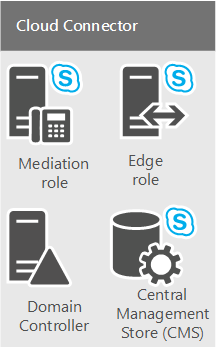

# <a name="plan-for-skype-for-business-cloud-connector-edition"></a>Plano do Skype for Business Edição Cloud Connector
 
Encontre informações sobre o Skype for Business Cloud Connector Edition, um conjunto de máquinas virtuais (VMs) compactadas que implementam conectividade PSTN local com o Sistema de Telefonia do Office 365 (Cloud PBX). 
  
Nuvem conector Edition pode ser a solução ideal para sua organização se você ainda não tiver um servidor existente do Lync ou Skype para implantação de servidor de negócios. Se você ainda está investigando que o sistema telefônico na solução do Office 365 é adequado para sua empresa, consulte [planejar seu sistema telefônico na solução do Office 365 (nuvem PBX)](plan-your-phone-system-cloud-pbx-solution.md). 
  
Este documento descreve os requisitos de edição do conector de nuvem e as topologias com suporte e ajuda você a planejar sua implantação de edição do conector de nuvem. Certifique-se de ler este tópico antes de configurar seu ambiente do conector de nuvem. Quando você estiver pronto para implantar e configurar a edição do conector de nuvem, consulte [Configurar e gerenciar Skype do conector de nuvem Business Edition](configure-skype-for-business-cloud-connector-edition.md). 
  
Edição de conector de nuvem 2.1 agora está disponível. Se você ainda não atualizadas para 2.1, consulte [atualizar para uma nova versão do conector de nuvem](upgrade-to-a-new-version-of-cloud-connector.md). Você pode encontrar o arquivo de instalação em [https://aka.ms/CloudConnectorInstaller](https://aka.ms/CloudConnectorInstaller). 
  
> [!NOTE]
> Microsoft suporta a versão anterior do Edition do conector de nuvem para 60 dias após o lançamento de uma nova versão. A Microsoft dará suporte para a versão 2.0.1 por 60 dias após o lançamento da versão 2.1 para que você tenha tempo para fazer a atualização. Não há mais suporte para as versões anteriores à 2.0.1. 
  
Edição de conector de nuvem é uma oferta de híbrida que consiste em um conjunto de Industrializados máquinas virtuais (VMs) implementar a conectividade PSTN local com o sistema telefônico no Office 365. Implantando um Skype mínimo para a topologia de servidor de negócios em um ambiente virtualizado, os usuários em sua organização hospedados na nuvem podem receber serviços PBX de nuvem da Microsoft, mas conectividade PSTN é fornecida por meio de voz no local existente infraestrutura. 
  

  
Já que o Cloud Connector permite integrar os serviços do Sistema de Telefonia do Office 365 com o seu ambiente de telefonia existente, por exemplo, PBX, dispositivos analógicos e Call Centers, você pode implementar uma migração em fases da sua solução de telefonia existente para o Sistema de Telefonia do Office 365. 
  
Por exemplo, suponha que sua empresa tenha um Call Center sofisticado com uma funcionalidade específica que o Sistema de Telefonia do Office 365 não oferece. Você pode optar por deixar os usuários do Call Center com a solução existente, mas migrar outros usuários para o Sistema de Telefonia do Office 365. 
  
O Cloud Connector fornecerá o roteamento entre os usuários hospedados no local e online, e você pode optar por usar o seu próprio provedor de PSTN com o Sistema de Telefonia do Office 365.
  
Considere o seguinte ao planejar a implantação de nuvem conector Edition: 
  
- Para usar o conector de nuvem para tirar proveito das soluções de voz de nuvem, você precisará Inscreva-se para um locatário do Office 365 que inclui o sistema telefônico no Office 365. Se você ainda não tiver um locatário do Office 365, você pode aprender como Inscreva-se aqui: [Office 365 para empresas](https://products.office.com/en-us/business/office). Observe que você precisará se inscrever para um plano que inclua Skype para negócios Online.
    
- Para registrar os aparelhos de conector de nuvem com o Skype para serviço de Business Online e executar vários cmdlets, o conector de nuvem 2.0 e posterior exige uma conta dedicada do Office 365 com o Skype para direitos de administrador de locatário de negócios. As versões do Cloud Connector anteriores à 2.0 exigem uma conta dedicada do Office 365 com direitos de administrador global de locatários.
    
- Conector de nuvem não exige um completo local Skype para implantação de servidor de negócios. 
    
    Atualmente, o conector de nuvem não podem coexistir com o Lync ou Skype para negócios servidores locais. Se você deseja mover o Lync existente ou Skype para usuários comerciais para o Office 365 e manter fornecendo local telefonia para seus usuários, considere o sistema telefônico no Office 365 com conectividade local usando uma Skype existente para implantação de servidor de negócios. Para obter mais informações, consulte [planejar seu sistema telefônico na solução do Office 365 (nuvem PBX)](plan-your-phone-system-cloud-pbx-solution.md) e [Planejar o sistema de telefone no Office 365 com conectividade PSTN local no Skype para Business Server](plan-phone-system-with-on-premises-pstn-connectivity.md).
    
- Se você tinha um Skype anterior para implantação do Lync Server ou de negócios, e você estendeu o esquema, você não precisará limpar o esquema para a implantação do conector de nuvem, desde que você tiver removido todos os Skype para componentes do Lync Server ou de negócios do seu ambiente. 
    
- Os usuários estão hospedados on-line.
    
- Se sua organização tiver configurado a DirSync (Sincronização de diretórios), todas as contas de usuários que estão planejadas para voz híbrida devem ser criadas primeiro na sua implantação local e depois sincronizadas com a nuvem.
    
- É possível manter sua operadora de PSTN atual, se necessário.
    
- Se você deseja fornecer a conferência discada para usuários hospedados no conector de nuvem, você pode adquirir conferência PSTN da Microsoft ou de parceiros de ACP (provedor) de conferência de áudio.
    
- Agora, o Cloud Connector 2.0 e versões posteriores têm suporte para bypass de mídia. Bypass de mídia permite que um cliente enviar mídia diretamente para o próximo salto de rede de telefônica pública comutada (PSTN) — um gateway ou controlador de borda de sessão (SBC) — e eliminar o componente de edição do conector de nuvem do caminho de mídia. Para obter mais informações, consulte [Plan for media bypass na nuvem conector Edition](plan-for-media-bypass-in-cloud-connector-edition.md).
    
- O Cloud Connector 2.1 e versões posteriores dão suporte ao monitoramento do Cloud Connector usando o OMS (Operations Management Suite). Para obter mais informações, consulte [Monitor conector de nuvem usando o pacote de gerenciamento de operações (OMS)](monitor-cloud-connector-using-operations-management-suite-oms.md)
    
- Conector de nuvem está disponível em todos os países onde o Office 365 Enterprise E5 está disponível. No entanto, devido a vários regulamentos, o conector de nuvem não pode ser configurado se o local de locatário estiver definido como um dos seguintes países: Argélia, Bangladesh, Botsuana, Brunei, Camarões, Costa do Marfim, Gana, Líbano, Macau, Maurício, Namíbia, Paraguai, Senegal.
    
Este tópico inclui as seguintes seções:
  
- [Componentes da Edição Cloud Connector](plan-skype-for-business-cloud-connector-edition.md#BKMK_Components)
    
- [Topologias da Edição do Cloud Connector](plan-skype-for-business-cloud-connector-edition.md#BKMK_Topologies)
    
- [Requisitos para a implantação](plan-skype-for-business-cloud-connector-edition.md#BKMK_Requirements)
    
- [Informações que necessárias para coletar antes da implantação](plan-skype-for-business-cloud-connector-edition.md#BKMK_PlanDeployment)
    
- [Considerações sobre plano de discagem](plan-skype-for-business-cloud-connector-edition.md#BKMK_DailPlan)
    
- [Considerações sobre alta disponibilidade](plan-skype-for-business-cloud-connector-edition.md#BKMK_HA)
    
- [Fluxo de mídia do Cloud Connector](plan-skype-for-business-cloud-connector-edition.md#BKMK_MediaFlow)
    
- [Monitoramento e solução de problemas](plan-skype-for-business-cloud-connector-edition.md#BKMK_Monitor)
    
- [Para obter mais informações](plan-skype-for-business-cloud-connector-edition.md#BKMK_MoreInfo)
    
## <a name="cloud-connector-edition-components"></a>Componentes da Edição Cloud Connector
<a name="BKMK_Components"> </a>

Com a edição do conector de nuvem, você implantar um conjunto de Industrializados VMs que contêm um Skype mínimo para a topologia de servidor de negócios — consiste em um componente de borda, o componente de mediação e uma função do repositório de gerenciamento Central (CMS). Você também instalará um controlador de domínio, é necessário para o funcionamento interno do conector de nuvem. Esses serviços são configurados para o híbrido com seu locatário do Office 365 que inclui Skype para serviços corporativos Online.
  

  
Componentes do conector de nuvem fornecem as seguintes funcionalidades:
  
- **Componente de borda** - a comunicação entre a topologia do local e os serviços online passa o componente de borda, que inclui os seguintes componentes:
    
  - **Borda de acesso** - fornece SIP roteamento entre a implantação no local e Skype para Business Online.
    
  - **Retransmissão de mídia** - fornece um roteamento de mídia entre o componente de mediação e outros pontos de extremidade de mídia.
    
  - **Autenticação de retransmissão de mídia / MRAS** -gera tokens de acesso a retransmissão de mídia.
    
- **Roteamento de saída** - fornece o balanceamento de carga do tráfego de voz entre gateways ou SBCs conectado a um aparelho de conector de nuvem. As chamadas serão divididas igualmente entre os gateways ou os SBCs conectados ao dispositivo do Cloud Connector.
    
    Fornece um roteamento para gateways com base em políticas. Só há suporte para políticas globais que são baseadas em números PSTN de destino (saída).
    
- **Função do repositório de gerenciamento central (CMS)** - inclui o repositório de configuração para os componentes da topologia, incluindo a transferência de arquivo do CMS.
    
- **Repositório de gerenciamento central (CMS) réplica** - sincroniza as informações de configuração a partir do BD de CMS global no servidor de função de CMS.
    
- **Controlador de domínio** - nuvem conector Active Directory Domain Services para armazenar todos os grupos necessários para implantar os componentes de conector de nuvem e as configurações globais. Uma floresta será criada para cada dispositivo do conector de nuvem. O controlador de domínio não deve ter todas as conexões com o Active Directory de produção. Os serviços do Active Directory incluem:
    
  - Serviços de Domínio Active Directory
    
  - Serviços de Certificado do Active Directory para emitir certificados internos
    
- **Componente de mediação** - protocolo de mapeamento de gateway de mídia e implementa SIP entre Skype para os gateways PSTN e de negócios. Inclui uma réplica CMS que sincroniza a configuração do banco de dados CMS global.
    
## <a name="cloud-connector-edition-topologies"></a>Topologias da Edição do Cloud Connector
<a name="BKMK_Topologies"> </a>

Para os fins desta discussão, vamos nos referir a sites PSTN. Um site PSTN é uma combinação de aparelhos de conector de nuvem, implantado no mesmo local e com os gateways PSTN comuns conectados a eles. Os sites PSTN permitem:
  
- Fornecer conectividade aos gateways mais próximos aos usuários.
    
- Permitir escalabilidade com a implantação de vários dispositivos de nuvem conector dentro de um ou mais sites PSTN.
    
- Permitir para alta disponibilidade com a implantação de vários dispositivos de nuvem conector dentro de um único site do PSTN.
    
Neste tópico, são apresentados os sites PSTN. Para obter mais informações sobre como planejar os sites PSTN, consulte [planejar sites de nuvem conector Edition PSTN](plan-for-cloud-connector-edition-pstn-sites.md).
  
Você pode implantar as seguintes topologias de conector de nuvem:
  
- Um único appliance de nuvem conector Edition por site PSTN. Essa topologia é recomendada apenas para fins de avaliação, pois não fornece alta disponibilidade.
    
- Vários dispositivos de nuvem conector Edition por site PSTN para fornecer alta disponibilidade. 
    
- Vários sites PSTN com vários dispositivos de edição do conector de nuvem para oferecer escalabilidade com alta disponibilidade. Você pode implantar até 200 sites.
    
Ao planejar sua topologia, considere o seguinte:
  
- Com a nuvem conector 2.0 e posterior, um site PSTN pode ter até 16 aparelhos de conector de nuvem. As versões anteriores suportam até 4 dispositivos por site. 
    
- Existem dois tipos de configurações de hardware testadas com o conector de nuvem: 
    
  - A versão grande é capaz de processar grandes volumes de chamadas simultâneas e é compatível com todos os tipos de ambientes de produção.
    
  - A versão pequena deve ser executada em hardware lower-end e pode ser utilizada para avaliação ou para sites com baixos volumes de chamadas. Se você implantar uma versão pequena do Cloud Connector, precisará ficar atento aos requisitos do hardware de classe de produção (como fontes de alimentação duplas).
    
- Se você tiver o conector de nuvem versão 2.0 ou posterior e implantar a configuração máxima de 16 dispositivos (com hardware maior), o seu site PSTN pode manipular até 8.000 chamadas simultâneas. Se você implantar a versão menor, o limite suportado será 800. 
    
    Você também precisa dedicar alguns dispositivos para a alta disponibilidade. A recomendação mínima é que um dispositivo seja reservado para a alta disponibilidade.
    
  - Com a versão 2, se você implantar uma configuração de 15 + 1, seu site PSTN pode lidar com até 7.500 chamadas simultâneas.
    
  - Se você tiver uma versão anterior e implantar a configuração máxima de 3 + 1 (com hardware grande), seu local de PSTN poderá processar até 1.500 chamadas simultâneas. Se você implantar a versão pequena, o limite suportado será 150.
    
-  Se houver a necessidade de mais chamadas por site PSTN, é possível aumentar a escala ao implantar sites PSTN adicionais no mesmo local.
    
> [!NOTE]
> A menos que observado, os diagramas e os exemplos a seguir supõem o uso da versão maior do conector de nuvem. 
  
### <a name="single-cloud-connector-appliance-within-a-single-pstn-site"></a>Um único dispositivo do Cloud Connector em um único site PSTN

O diagrama a seguir mostra um único appliance de nuvem conector Edition em um único site do PSTN. Observe que o conector de nuvem consiste em quatro VMs instaladas em uma máquina host física que está contido em uma rede de perímetro para fins de segurança.
  

  
### <a name="multiple-cloud-connector-appliances-within-a-single-pstn-site"></a>Vários dispositivos do Cloud Connector em um único site PSTN

 Para fins de alta disponibilidade e de escalabilidade, você pode optar por ter várias edições do conector de nuvem dentro de um único site do PSTN, conforme mostrado no diagrama a seguir. Considere o seguinte:
  
- As chamadas são distribuídas em ordem aleatória entre as instâncias do Cloud Connector em um pool.
    
- Para fins de planejamento de capacidade, você deve considerar a capacidade de lidar com a carga caso uma ou mais instâncias do Cloud Connector fiquem offline, com base nos seguintes cálculos:
    
  - **N+1 caixas.** Para a versão maior do conector de nuvem, N + 1 caixas suportam 500\*chamadas simultâneas do N com 99,8% de disponibilidade.
    
    Para a versão menor do conector de nuvem, N + 1 caixas oferecem suporte para 50\*chamadas simultâneas do N com 99,8% de disponibilidade.
    
  - **N+2 caixas.** Para a versão maior do conector de nuvem, N + 2 caixas suportam 500\*chamadas simultâneas do N com disponibilidade de 99,9%.
    
    Para a versão menor do conector de nuvem, N + 2 caixas suportam 50\*chamadas simultâneas do N com disponibilidade de 99,9%.
    

  
### <a name="multiple-pstn-sites-with-one-or-more-cloud-connectors-per-site"></a>Vários sites PSTN com uma ou mais instâncias de Cloud Connector por site

Também é possível ter vários locais de PSTN com uma ou mais instâncias de Cloud Connector Edition em cada site. Se o seu local de PSTN atingir o limite de chamadas simultâneas, será possível adicionar outro local de PSTN para lidar com a carga. 
  
Vários sites PSTN também permitem que você fornecer conectividade para gateways mais próximos aos seus usuários. Por exemplo, suponha que você tem os gateways PSTN em Seattle e Amsterdã. Você pode implantar dois sites PSTN — um em Seattle, um Amsterdã — e atribuir aos usuários para usar o site PSTN que está mais próximo a eles. Os usuários de Seattle serão roteados para o site de Seattle PSTN e os gateways, enquanto usuários em Amsterdã serão roteados para o site de Amsterdã PSTN e gateways:
  

  
## <a name="requirements-for-deployment"></a>Requisitos para a implantação
<a name="BKMK_Requirements"> </a>

Antes de implantar Edition do conector de nuvem, certifique-se de que ter o seguinte para seu ambiente:
  
- **Para a máquina host-** VMs de conector de nuvem deve ser implantadas em um hardware dedicado executando o Windows Server 2012 R2 Datacenter edition (em inglês) com a função do Hyper-V habilitada.
    
    Para a versão 2.0 e posteriores, a placa de rede do computador host vinculada ao comutador da rede corporativa do Skype for Business deve ter um endereço IP configurado na mesma sub-rede que as máquinas da rede corporativa do Cloud Connector.  
    
- Para versões 2.1 e posteriores, o aparelho de host deve ter o .NET Framework 4.6.1 ou posterior instalado. 
    
- **Para as máquinas virtuais-** Uma imagem do Windows Server 2012 R2 ISO (em inglês) (ISO). O ISO será convertido em VHDs para as máquinas virtuais que executarão Skype para o conector de nuvem Business Edition.
    
- O hardware necessário para oferecer suporte a instalação das 4 VMs para cada edição do conector de nuvem em sua implantação. São recomendadas as seguintes configurações:
    
  - processador duplo de 64 bits, seis core (12 reais núcleos), 2,50 gigahertz (GHz) ou superior
    
  - 64 gigabytes (GB) de RAM ECC  
    
  - Quatro discos SAS de 6Gbps de Cache 128M de 10K de RPM configurados em uma configuração RAID 5
    
  - Três adaptadores de rede de alto rendimento RJ45 de 1 Gbps
    
- Se você optar por implantar a versão menor de edição de conector de nuvem que oferece suporte a até 50 chamadas simultâneas, você precisará de hardware a seguir:
    
  - Intel i7 4790 quad core com gráficos Intel 4600 (não é necessário ter gráficos de alta tecnologia)
    
  - 32 GB DDR3-1600 não ECC
    
  - 2: 1TB 7200RPM SATA III (6 Gbps) em RAID 0
    
  - 2: Ethernet de 1 Gbps (RJ45)
    
- Se um servidor proxy for necessário no computador host para se navegar na Internet, você deverá fazer as seguintes alterações de configuração:
    
  - Para ignorar o proxy, especificar configurações de WinHTTP Proxy definidas com seu servidor proxy e uma lista de proxies incluindo "192.168.213. \*"usada pelos serviços de gerenciamento de conector de nuvem e Skype para negócios Corpnet sub-rede conforme definido em seu arquivo de CloudConnector.ini de rede. Caso contrário, a conectividade de gerenciamento irá falhar e impedir a implantação e a recuperação automática do conector de nuvem. A seguir está um exemplo de comando de configuração de winhttp: "10.10.10.175:8080"-lista de proxies de definir winhttp netsh = "\*. local; 1. \*; 172.20. \*; 192.168.218. \*'\<local\>".
    
  - Especifique as configurações de proxy por máquina, em vez de por usuário. Caso contrário, o conector de nuvem downloads falhará. Você pode especificar as configurações de proxy por máquina com uma alteração no Registro ou com a configuração de Política de Grupo da seguinte forma:
    
  - **Registro:** Configurações de HKEY_LOCAL_MACHINE\SOFTWARE\Policies\Microsoft\Windows\CurrentVersion\Internet] DWORD: 00000000 de ProxySettingsPerUser
    
  - **a diretiva de grupo:** Computador\>modelos administrativos\>componentes do Windows\> Internet Explorer: Verifique as configurações do Proxy por máquina (em vez de por usuário)
    
- PBX/Tronco qualificado ou SBC/Gateway qualificado (um mínimo de dois gateways é recomendado).
    
    O Cloud Connector dá suporte aos mesmos SBCs (Controladores de Borda da Sessão) que são certificados para o Skype for Business. Para obter mais informações, consulte [Infraestrutura de telefonia para Skype para negócios](https://docs.microsoft.com/SkypeForBusiness/certification/infra-gateways).  
    
- Uma conta de administrador do servidor local com permissões para instalar e configurar o Hyper-V em servidores host. A conta deve ter permissões de administrador no servidor local onde o Hyper-V está instalado e configurado.
    
- Durante a implantação, você será solicitado a criar uma conta de administrador de domínio com as permissões para criar e publicar a topologia no domínio do Cloud Connector.  
    
- Os registros DNS externos, que são definidos no arquivo CloudConnector.ini incluído no pacote de instalação:
    
  - Registro de DNS externo para o serviço de borda de acesso do componente de borda; Por exemplo, ap.\<nome de domínio\>. Você precisa de um registro por site PSTN. Este registro deve conter os endereços IP de todas as bordas do site.
    
- Um locatário do Office 365 com necessários todos os registros DNS e SRV criado.
    
    > [!IMPORTANT]
    > Ao integrar seu locatário com nuvem conector Edition, o uso do sufixo de domínio padrão,. onmicrosoft.com, como um domínio SIP para sua organização não é suportada. > Você não pode usar o sip. \<Nome de domínio\> como o nome de seu acesso de borda do conector de nuvem proxy interface porque este registro DNS é usado pelo Office 365. 
  
- Um certificado para a Borda externa obtido de uma Autoridade de Certificação (CA) pública
    
- As regras de Firewall para permitir o tráfego através da portas necessárias foram concluídas. 
    
- Uma conexão com a Internet para o computador host e as VMs. Conector de nuvem downloads alguns softwares da Internet; Portanto, você deve fornecer gateway e informações do servidor DNS para que o computador host de conector de nuvem e VMs possam se conectar à Internet e baixe o software necessário.
    
- Um módulo remoto do PowerShell do locatário instalado no computador host.
    
- As credenciais de administrador do Office 365 Skype for Business para a execução do PowerShell remoto. 
    
    > [!IMPORTANT]
    > A conta do administrador NÃO DEVE ter a autenticação multifator habilitada. 
  
> [!NOTE]
> Somente há suporte para a implantação do conector de nuvem na plataforma Microsoft Hyper-V virtualizado. Outras plataformas, como VMware e Amazon Web Services, não têm suporte. 
  
> [!NOTE]
> A orientação de hardware mínimos para executar o conector de nuvem baseia-se em básicos de hardware de capacidade (núcleos, MHz, gigabytes e assim por diante) com algum buffer para acomodar os problemas de desempenho intangíveis incluídos na arquitetura de qualquer computador. A Microsoft executou o pior caso de teste de carga em um hardware comercialmente disponível e que atendia a orientação mínima. A qualidade da mídia e o desempenho do sistema são verificados. Parceiros de aparelho oficiais do conector de nuvem da Microsoft têm implementações de hardware de conector de nuvem específicas no qual eles foram testadas independentemente o desempenho e eles garantimos a adequação do seu hardware para atender aos requisitos de carga e a qualidade. 
  
> [!NOTE]
> Os dispositivos produzidos pela AudioCodes e pela Sonus têm código modificado e são executados nos servidores Windows Server Standard Edition. Há suporte para esses dispositivos. 
  
## <a name="information-you-need-to-gather-before-deployment"></a>Informações que necessárias para coletar antes da implantação
<a name="BKMK_PlanDeployment"> </a>

Antes de iniciar sua implantação, será necessário determinar o tamanho de sua implantação, os domínios SIP que estão sendo atendidos e as informações de configuração para cada site PSTN que você planeja implantar. Para começar, você deve:
  
- Identifica todos os domínios SIP que serão atendidos por essa implantação com base em URIs do SIP em uso na sua empresa. 
    
- Determinar o número de sites PSTN que você precisa implantar.
    
- Certifique-se de que você tem o hardware necessário para oferecer suporte as quatro VMs em que você vai ser instalando para cada edição do conector de nuvem. 
    
Para cada site PSTN que você pretende implantar, você precisa:
  
- Criar nomes para todos os componentes em cada dispositivo do conector de nuvem (consulte [Determine parâmetros de implantação](plan-skype-for-business-cloud-connector-edition.md#BKMK_SiteParams)).
    
- Definir intervalos de porta (consulte [Ports and protocols](plan-skype-for-business-cloud-connector-edition.md#BKMB_Ports)).  
    
- Criar registros DNS externos para o componente de Borda (veja [Requisitos para implantação](plan-skype-for-business-cloud-connector-edition.md#BKMK_Requirements)).
    
- Determinar os requisitos de certificado para o componente de Borda (veja [Requisitos de certificado](plan-skype-for-business-cloud-connector-edition.md#BKMK_Certs)).
    
### <a name="ports-and-protocols"></a>Portas e protocolos
<a name="BKMB_Ports"> </a>

Ao definir os intervalos de porta de mídia, esteja ciente do seguinte:
  
- Clientes sempre usem o intervalo de porta 50000 para 50019 para tráfego de mídia — esse intervalo predefinido em Skype para Business Online e não pode ser alterado.
    
- O componente de Mediação usa, por padrão, o intervalo de porta 49.152 a 57.500 para o tráfego de mídia. No entanto, conexão for estabelecida por meio do firewall interno e, por motivos de segurança, é possível limitar esse intervalo de portas em sua topologia. Serão necessárias até 4 portas por chamada. Se quiser limitar o número de portas entre o componente de Mediação e o gateway PSTN, também será preciso configurar o intervalo da porta correspondente no gateway.
    
- Você deve implantar o conector de nuvem em uma rede de perímetro. Isso significa que você terá dois firewalls: 
    
  - O primeiro firewall será externo entre a Internet e sua rede de perímetro.
    
  - O segundo firewall é interno entre a rede de perímetro e a rede interna. 
    
    Os clientes podem estar na Internet ou na rede interna:  
    
  - Clientes na Internet serão conectados ao seu PSTN através do firewall externo e do componente de Borda.
    
  - Clientes na rede interna se conectará por meio do firewall interno para o componente de mediação na rede de perímetro, o qual se conectará o tráfego para o gateway PSTN ou de SBC. 
    
    Isso significa que será preciso abrir as portas em ambos os firewalls.  
    
As tabelas a seguir descrevem as portas e os intervalos de portas para o firewalls internos e externos.
  
Essa tabela mostra as portas e os intervalos de portas para a habilitação da comunicação entre os clientes na rede interna e o componente de Mediação:
  
**Firewall interno**


|**IP de origem**|**IP de destino**|**Porta de origem**|**Porta de Destino**|
|:-----|:-----|:-----|:-----|
|Componente de mediação do conector de nuvem  <br/> |SBC/Gateway de PSTN:  <br/> |Qualquer um  <br/> |TCP 5060\*\*  <br/> |
|SBC/Gateway de PSTN:  <br/> |Componente de mediação do conector de nuvem  <br/> |Qualquer um  <br/> |TCP 5068/TLS 5067  <br/> |
|Componente de mediação do conector de nuvem  <br/> |SBC/Gateway de PSTN:  <br/> |UDP 49 152-57 500  <br/> |Qualquer\*\*\*  <br/> |
|SBC/Gateway de PSTN:  <br/> |Componente de mediação do conector de nuvem  <br/> |Qualquer\*\*\*  <br/> |UDP 49 152-57 500  <br/> |
|Componente de mediação do conector de nuvem  <br/> |Clientes internos  <br/> |TCP 49 152-57 500\*  <br/> |TCP 50.000-50.019  <br/> (Opcional)  <br/> |
|Componente de mediação do conector de nuvem  <br/> |Clientes internos  <br/> |UDP 49 152-57 500\*  <br/> |Clientes internos  <br/> |
|Clientes internos  <br/> |Componente de mediação do conector de nuvem  <br/> |TCP 50.000-50.019  <br/> |TCP 49 152-57 500\*  <br/> |
|Clientes internos  <br/> |Componente de mediação do conector de nuvem  <br/> |Clientes internos  <br/> |UDP 49 152-57 500\*  <br/> |
   
\*Esse é o intervalo de porta padrão no componente de mediação. Para obter o melhor fluxo de chamadas, quatro portas por chamada são necessárias.
  
\*\*Essa porta deve ser configurada no gateway SBC/PSTN; 5060 é um exemplo. Você pode configurar outras portas no SBC/gateway de PSTN.
  
\*\*\*Observe que você também pode limitar o intervalo de portas no seu Gateway SBC se permitido pelo fabricante do Gateway SBC.
  
Para fins de segurança, é possível limitar o intervalo de portas para o componente de mediação usando o cmdlet [Set-CsMediationServer](https://docs.microsoft.com/powershell/module/skype/set-csmediationserver?view=skype-ps) .
  
Por exemplo, o comando a seguir limita o número de portas que o componente de mediação usará para tráfego de mídia para 50 000-51 000 para áudio (e sair). O componente de Mediação poderá administrar 250 chamadas simultâneas com essa configuração. Observe que você também pode querer limitar esse intervalo no SBC/gateway de PSTN:
  
```
Set-CSMediationServer -Identity MediationServer:mspool.contoso.com -AudioPortStart 50000 - AudioPortCount 1000
```

Para recuperar o nome do componente de mediação e ver as portas padrão, você pode usar o cmdlet [Get-CsService](https://docs.microsoft.com/powershell/module/skype/get-csservice?view=skype-ps) da seguinte maneira:
  
```
Get-CsService -MediationServer | Select-Object Identity, AudioPortStart, AudioPortCount
```

A tabela a seguir mostra as portas e intervalos de portas para habilitar a comunicação entre o componente de borda do conector de nuvem para o firewall externo. A tabela mostra a recomendação mínima.
  
Nesse caso, todo o tráfego de mídia para a internet irá fluir através da borda Online da seguinte maneira: ponto de extremidade do usuário –\>borda Online –\>nuvem conector de borda:
  
**Firewall externo - configuração mínima**


|**IP de origem**|**IP de destino**|**Porta de origem**|**Porta de destino**|
|:-----|:-----|:-----|:-----|
|Qualquer  <br/> |Interface externa da borda de conector de nuvem  <br/> |Qualquer um  <br/> |TCP(MTLS) 5061  <br/> |
|Interface externa da borda de conector de nuvem  <br/> |Qualquer  <br/> |Qualquer um  <br/> |TCP(MTLS) 5061  <br/> |
|Interface externa da borda de conector de nuvem  <br/> |Qualquer  <br/> |Qualquer  <br/> |TCP 80  <br/> |
|Interface externa da borda de conector de nuvem  <br/> |Qualquer  <br/> |Qualquer  <br/> |UDP 53  <br/> |
|Interface externa da borda de conector de nuvem  <br/> |Qualquer  <br/> |Qualquer um  <br/> |TCP 53  <br/> |
|Interface externa da borda de conector de nuvem  <br/> |Qualquer um  <br/> |UDP 3478  <br/> |UDP 3478  <br/> |
|Qualquer um  <br/> |Interface externa da borda de conector de nuvem  <br/> |TCP 50.000-59.999  <br/> |TCP 443  <br/> |
|Qualquer um  <br/> |Interface externa da borda de conector de nuvem  <br/> |UDP 3478  <br/> |UDP 3478  <br/> |
|Interface externa da borda de conector de nuvem  <br/> |Qualquer  <br/> |TCP 50.000-59.999  <br/> |TCP 443  <br/> |
   
A próxima tabela mostra as portas e intervalos de portas para habilitar a comunicação entre o componente de borda do conector de nuvem para o firewall externo. Esta tabela mostra a solução recomendada.
  
Nesse caso, todo o tráfego de mídia para o ponto de extremidade na internet pode fluir diretamente com o componente de borda do conector de nuvem. O caminho de mídia será o ponto de extremidade do usuário -\> borda do conector de nuvem.
  
> [!NOTE]
> Essa solução não funcionará se o ponto de extremidade do usuário estiver usando um NAT simétrico. 
  
**Firewall externo - configuração recomendada**


|**IP de origem**|**IP de destino**|**Porta de origem**|**Porta de Destino**|
|:-----|:-----|:-----|:-----|
|Qualquer  <br/> |Interface externa da borda de conector de nuvem  <br/> |Qualquer um  <br/> |TCP(MTLS) 5061  <br/> |
|Interface externa da borda de conector de nuvem  <br/> |Qualquer  <br/> |Qualquer um  <br/> |TCP(MTLS) 5061  <br/> |
|Interface externa da borda de conector de nuvem  <br/> |Qualquer  <br/> |Qualquer  <br/> |TCP 80  <br/> |
|Interface externa da borda de conector de nuvem  <br/> |Qualquer  <br/> |Qualquer  <br/> |UDP 53  <br/> |
|Interface externa da borda de conector de nuvem  <br/> |Qualquer  <br/> |Qualquer um  <br/> |TCP 53  <br/> |
|Interface externa da borda de conector de nuvem  <br/> |Qualquer  <br/> |TCP 50.000-59.999  <br/> |Qualquer  <br/> |
|Interface externa da borda de conector de nuvem  <br/> |Qualquer  <br/> |UDP 3478; UDP 50,000-59,999  <br/> |Qualquer um  <br/> |
|Qualquer  <br/> |Interface externa da borda de conector de nuvem  <br/> |Qualquer  <br/> |TCP 443; TCP 50,000-59,999  <br/> |
|Qualquer  <br/> |Interface externa da borda de conector de nuvem  <br/> |Qualquer um  <br/> |Requisitos de conectividade com a Internet do host  <br/> |
   
### <a name="host-internet-connectivity-requirements"></a>Requisitos de conectividade com a Internet do host
<a name="BKMB_Ports"> </a>

A máquina host deve ser capaz de acessar recursos externos para instalar com êxito, atualizar e gerenciar o conector de nuvem. A tabela a seguir mostra os destinos e portas necessários entre o computador host e os recursos externos. 
  
|Direção  <br/> |IP de origem  <br/> |IP de destino  <br/> |Porta de origem  <br/> |Porta de Destino  <br/> |Protocolo  <br/> |Objetivo  <br/> |
|:-----|:-----|:-----|:-----|:-----|:-----|:-----|
|Saída  <br/> |IPs de host do conector de nuvem  <br/> |qualquer um  <br/> |qualquer um  <br/> |53  <br/> |TCP/UDP  <br/> |DNS  <br/> |
|Saída  <br/> |IPs de host do conector de nuvem  <br/> |qualquer um  <br/> |qualquer um  <br/> |80, 443  <br/> |TCP  <br/> |Lista de certificados revogados (CRL)  <br/> |
|Saída  <br/> |IPs de host de Connectorr de nuvem  <br/> |qualquer um  <br/> |qualquer um  <br/> |80, 443  <br/> |TCP  <br/> |Atualização do conector de nuvem  <br/> Skype for Business Online  <br/> PowerShell do Administrador  <br/> Windows Update  <br/> |
   
Se forem necessárias regras mais restritivas, veja as seguintes URLs de lista de permissões:
  
- [As URLs de listas de revogação de certificado](https://support.office.com/en-us/article/Office-365-URLs-and-IP-address-ranges-8548a211-3fe7-47cb-abb1-355ea5aa88a2) no [Office 365 URLs e intervalos de endereços IP](https://support.office.com/en-us/article/Office-365-URLs-and-IP-address-ranges-8548a211-3fe7-47cb-abb1-355ea5aa88a2?ui=en-US&amp;rs=en-US&amp;ad=US)
    
- Atualização do Windows: [como configurar um Firewall para atualizações de Software](https://technet.microsoft.com/en-us/library/bb693717.aspx)
    
- Skype para negócios Online Admin PowerShell: \*. online.lync.com
    
    Se precisar de uma exclusão de proxy para esse destino, você precisará adicioná-lo à lista de bypass do WinHTTP.
    
- Atualização do conector de nuvem: [Centro de Download](https://aka.ms/CloudConnectorInstaller), [https://go.microsoft.com](https://go.microsoft.com), e[http://download.microsoft.com](http://download.microsoft.com)
    
### <a name="dns-name-resolution-for-the-edge-component"></a>Resolução de nome DNS para o componente de Borda
<a name="BKMB_Ports"> </a>

O componente de borda deve resolver os nomes externos dos serviços do Office 365 e os nomes internos dos outros componentes do conector de nuvem. 
  
Cada componente de Borda é um computador multihomed com interfaces voltadas para o exterior e o interior. Conector de nuvem implanta servidores DNS no componente de controlador de domínio dentro da rede de perímetro. É possível apontar o servidor de borda para o servidor de DNS dentro do perímetro para todas as resoluções de nome, mas você precisa ativar o servidor de DNS do conector de nuvem resolver nomes de externos, definindo uma zona DNS contendo um ou mais registros de DNS A para consultas externas que se referem nome pesquisas para outros servidores DNS públicos. 
  
No arquivo .ini, se você definir o nome FQDN para gateways do mesmo espaço de domínio que seu domínio SIP, a zona autoritativa para esse domínio SIP será criada no servidor DNS dentro do perímetro. Se o servidor de borda seja apontado para esse servidor DNS para resolver nomes, borda nunca resolverá o sipfederationtls. \<SeuDomínio\> registro de DNS, que é necessário para o fluxo de chamada. Nesse caso, a Microsoft recomenda que você fornecer um servidor DNS na interface externa da borda para resolver pesquisas de nome de Internet, e cada componente de borda deve usar um arquivo HOST para resolver outros nomes de componente do conector de nuvem para endereços IP.
  
> [!NOTE]
> Por motivos de segurança, recomendamos que você não apontam o servidor de DNS do conector de nuvem para servidores internos do domínio de produção para resolução de nomes. 
  
### <a name="determine-deployment-parameters"></a>Determinar parâmetros de implantação
<a name="BKMK_SiteParams"> </a>

Primeiramente, você deve definir os seguintes parâmetros de implantação comuns:
  

|**Item**|**Descrição**|**Observações**|
|:-----|:-----|:-----|
|Domínios SIP  <br/> |Do URI do SIP sendo usado por usuários da empresa. Forneça todos as domínios SIP que serão atendidos por essa implantação. É possível ter mais de um domínio SIP.  <br/> ||
|Número de sites PSTN  <br/> |O número de sites PSTN que você precisa implantar.  <br/> ||
   
Para cada site PSTN que você planeja implantar, será necessário coletar as seguintes informações antes de iniciar a implantação. Você deve fornecer estas informações quando atualizar o arquivo CloudConnector.ini.
  
Ao configurar informações de gateway, lembre-se do seguinte:
  
- Se houver apenas um gateway, remova a seção do arquivo .ini para o segundo gateway. Se houver mais de dois gateways, siga o formato existente para adicionar novos. 
    
- Verifique se o endereço IP e a porta do(s) gateway(s) estão corretos.
    
- Para dar suporte a alta disponibilidade no nível do gateway PSTN, mantenha o gateway secundário ou adicione gateways.
    
(Opcional) Para limitar os números de chamadas de saída, atualize o valor LocalRoute.
  


|**Parâmetros do site**|**Descrição**|**Observações**|
|:-----|:-----|:-----|
|Nome de domínio da máquina virtual  <br/> |Nome de domínio para os componentes internos do conector de nuvem. Esse domínio precisa ser diferente do domínio de produção. O nome precisa ser o mesmo em todos os dispositivos do Cloud Connector.  <br/> Nome do arquivo. ini: "VirtualMachineDomain"  <br/> |.domínio local é o preferencial.   <br/> |
|Nome do controlador de domínio de conector de nuvem  <br/> |Nome do controlador de domínio   <br/> Nome do arquivo. ini: "ServerName"  <br/> |Deve conter 15 caracteres ou menos. Insira apenas o nome Netbios.  <br/> |
|Máscara de sub-rede do IP de controlador de domínio de conector na nuvem  <br/> |Endereço IP do controlador de domínio   <br/> Nome do arquivo. ini: "IP"  <br/> ||
|FQDNs do serviço online do O365  <br/> |Deve ser o padrão na maioria dos casos, para a instância do O365 mundial.  <br/> Nome do arquivo. ini: "OnlineSipFederationFqdn"  <br/> ||
|SiteName  <br/> |Skype para o nome do site de negócios; Por exemplo, Seattle.  <br/> Nome do arquivo. ini: "NomedoSite"  <br/> Para a versão 1.4.1 e posterior, o nome do site deve ser diferente para cada site, e o nome deve corresponder ao site PSTN, se existir, definido no Office 365. Note que os sites PSTN serão criados automaticamente ao registrar o primeiro dispositivo em um site.  <br/> ||
|HardwareType  <br/> Versão 1.4.1 e posterior  <br/> |Tipo de hardware. O valor padrão é Normal. Você também pode definir como Mínimo.  <br/> ||
|Código do país  <br/> |Código do país para discagem.  <br/> Nome do arquivo. ini: "CountryCode"  <br/> ||
|Cidade  <br/> |Cidade (opcional).  <br/> Nome do arquivo. ini: "City"  <br/> ||
|Estado  <br/> |Estado (opcional).  <br/> Nome do arquivo. ini: "Estado"  <br/> ||
|Endereço IP da VM Base  <br/> |O endereço IP da VM base temporário que será usado para criar o VHDX para todas as máquinas virtuais de conector de nuvem. Esse IP precisa estar na mesma sub-rede da rede corporativa de perímetro definida na próxima etapa e requer acesso à Internet. Defina o gateway padrão corporativo e o DNS que pode ser roteado para a Internet.  <br/> Nome do arquivo. ini: "BaseVMIP"  <br/> ||
|WSUSServer  <br/> WSUSStatusServer  <br/> Versão 1.4.1 e posterior  <br/> |O endereço do Windows Server Update Services (WSUS); um servidor de intranet para hospedar atualizações do Microsoft Update.  <br/> Você pode deixar em branco, se o WSUS não for necessário.   <br/> ||
|Máscara de sub-rede para rede interna  <br/> |Conector de nuvem configura uma rede IP para comunicações internas entre os componentes do conector de nuvem. A borda também precisa ser conectada a outra sub-rede que permita conexão com a Internet.  <br/> Nome do arquivo. ini: "CorpnetIPPrefixLength" em "Parâmetros para um pool de rede da máquina virtual"  <br/> ||
|Máscara de subrede para rede externa   <br/> |Para a rede externa do componente de Borda.  <br/> Nome do arquivo. ini: "InternetIPPrefix" em "Parâmetros para um pool de rede da máquina virtual"  <br/> ||
|Nome do comutador para rede interna  <br/> |Nome do comutador que será usada para a rede interna do conector de nuvem.  <br/> Na maioria dos casos, o valor padrão sugerido pode ser usado.  <br/> Nome do arquivo. ini: "CorpnetSwitchName" em "parâmetros para um pool de rede VM  <br/> ||
|Nome do comutador para rede externa  <br/> |Nome do comutador que será usada para a rede externa do conector de nuvem.  <br/> Na maioria dos casos, o valor padrão sugerido pode ser usado.  <br/> Nome do arquivo. ini: "InternetSwitchName" em "parâmetros para um pool de rede VM  <br/> ||
|Gateway Padrão para rede interna  <br/> |Este gateway deverá fornecer acesso à Internet (Internet também requer a definição de servidor DNS) e serão configurados nas interfaces internas dos componentes do conector de nuvem.  <br/> Nome do arquivo. ini: "CorpnetDefaultGateway" em "parâmetros para um pool de rede VM  <br/> ||
|Gateway Padrão para a interface externa do componente de Borda  <br/> |Será configurado na interface externa do componente de Borda.  <br/> Nome do arquivo. ini: "InternetDefaultGateway" em "parâmetros para um pool de rede VM  <br/> ||
|Servidor DNS para rede interna  <br/> |Será configurado na interface interna da VM temporária. Deve fornecer uma resolução de nome para nomes da Internet. Sem o fornecimento de um servidor DNS, a conexão com a Internet apresentará falha e a implantação não será concluída.   <br/> Nome do arquivo. ini: "CorpnetDNSIPAddress" em "parâmetros para um pool de rede VM  <br/> ||
|Servidor DNS para a interface externa do componente de Borda  <br/> |Será configurado na interface externa de Borda.  <br/> Nome do arquivo. ini: "InternetDNSIPAddress" em "parâmetros para um pool de rede VM  <br/> ||
|Nome da central de gerenciamento  <br/> |Opção de gerenciamento é uma opção temporária que será criada automaticamente, e que será usado para a configuração do conector de nuvem durante a implantação. Ele será desconectado automaticamente após a implantação. Ela deve ser uma sub-rede diferente do quaisquer outras redes usadas no conector de nuvem.  <br/> Na maioria dos casos, o valor padrão sugerido pode ser usado.  <br/> Nome do arquivo. ini: "ManagementSwitchName" em "parâmetros para um pool de rede VM  <br/> ||
|Endereço de sub-rede/máscara de sub-rede de gerenciamento  <br/> |A sub-rede de gerenciamento é uma sub-rede temporária que será criada automaticamente, e que será usado para a configuração do conector de nuvem durante a implantação. Ela será removida automaticamente após a implantação. Ela deve ser uma sub-rede diferente do quaisquer outras redes usadas no conector de nuvem.  <br/> Nomes de arquivo. ini: "ManagementIPPrefix" e "ManagementIPPrefixLength" em "parâmetros para um pool de rede VM  <br/> ||
|Máquina de repositório de gerenciamento central (CMS)  <br/> |FQDN exclusivo utilizado para o Repositório de Gerenciamento Central (CMS). O nome do Domínio do AD será utilizado para gerar o FQDN.   <br/> Nome do arquivo. ini: "ServerName" em "parâmetros para principal serviço de gerenciamento Central  <br/> |Deve conter 15 caracteres ou menos. Insira apenas o nome Netbios.  <br/> (Nome do Pool do CMS = Nome do Servidor)  <br/> |
|Endereço IP da máquina CMS  <br/> |Endereço IP para o servidor de CMS (interno à rede de perímetro).  <br/> Nome do arquivo INI: "IP" em "parâmetros para principal serviço de gerenciamento Central  <br/> ||
|Nome do Compartilhamento de Arquivo   <br/> |Nome do compartilhamento de arquivo a ser criado no servidor CMS para Skype para dados corporativos de replicação (por exemplo, CmsFileStore).  <br/> Na maioria dos casos, o valor padrão sugerido pode ser usado.  <br/> Nome do arquivo. ini: "CmsFileStore" em "parâmetros para principal serviço de gerenciamento Central  <br/> ||
|Nome do Pool de componente de mediação  <br/> |Nome do Pool do componente de Mediação. Insira apenas o nome Netbios. O nome do Domínio do AD será usado para gerar o FQDN.   <br/> Nome do arquivo. ini: "Nome_conjunto" em "Parâmetros para um pool de servidores de mediação"  <br/> |Deve conter 15 caracteres ou menos. Insira apenas o nome Netbios.  <br/> |
|Nome do componente de mediação  <br/> |Nome de Componente do componente de Mediação 1. Insira apenas o nome Netbios. O nome de domínio AD será usado para gerar o FQDN.   <br/> Nome do arquivo. ini: "ServerName" em "Parâmetros para um pool de servidores de mediação"  <br/> |Deve conter 15 caracteres ou menos. Insira apenas o nome Netbios.  <br/> |
|Endereço de IP de máquina de componente de mediação  <br/> |IP Corpnet interno para o componente de mediação (interno na rede de perímetro).  <br/> Nome do arquivo. ini: "IP" em "Parâmetros para um pool de servidores de mediação"  <br/> ||
|Nome interno do pool de Borda  <br/> |Nome do Pool do componente de Borda. Insira apenas o nome Netbios. O nome do Domínio do AD será usado para gerar o FQDN.
  <br/> Nome do arquivo. ini: "InternalPoolName" em "Parâmetros para um pool de servidores de borda"  <br/> |Deve conter 15 caracteres ou menos. Insira apenas o nome Netbios.  <br/> |
|Nome interno do Servidor de Borda  <br/> |Nome de Componente do componente de Borda. Insira apenas o nome Netbios. O nome de domínio AD será usado para gerar o FQDN.   <br/> Nome do arquivo. ini: "InternalServerName" em "Parâmetros para um pool de servidores de borda"  <br/> |Deve conter 15 caracteres ou menos. Insira apenas o nome Netbios.  <br/> |
|IP Interno de Servidor de Borda   <br/> |Componente de IP de borda de rede de perímetro interno para se comunicar com outros componentes do conector de nuvem.  <br/> Nome do arquivo. ini: "InternalServerIPs" em "Parâmetros para um pool de servidores de borda"  <br/> ||
|Nome externo do pool de acesso  <br/> |Nome da Borda de Acesso; por exemplo, AP. Esse nome deve corresponder ao nome fornecido para o certificado SSL. Insira apenas o nome Netbios. O nome do Domínio SIP será usado para gerar o FQDN. Um nome de pool externo será usado para todos os componentes de borda no pool. Um pool de borda de acesso é necessário por site PSTN.  <br/> Nome do arquivo. ini: "ExternalSIPPoolName" em "Parâmetros para um pool de servidores de borda"  <br/> |Deve conter 15 caracteres ou menos. Insira apenas o nome Netbios.  <br/> "sip" é reservado e, portanto, não pode ser usado como o nome.  <br/> O nome FQDN gerado deve corresponder ao nome fornecido para o certificado SSL.   <br/> |
|IP externo da borda de acesso  <br/> |Componente de IP de borda externa - qualquer IP público se nenhum NAT estiver disponível, ou traduzida IP (Especifique os dois endereços se mapeado).  <br/> Nome do arquivo. ini: "ExternalSIPIPs" em "Parâmetros para um pool de servidores de borda"  <br/> ||
|Nome de Retransmissão de Mídia  <br/> |Nome da Borda de Media Relay para Áudio e Vídeo; por exemplo, MR. Um nome de pool externo será utilizado para todos os componentes de Borda em um pool. Um pool de retransmissão de mídia de borda é necessário por site PSTN.  <br/> Nome do arquivo. ini: "ExternalMRFQDNPoolName" em "Parâmetros para um pool de servidores de borda"  <br/> |Deve conter 15 caracteres ou menos. Insira apenas o nome Netbios.  <br/> |
|IP externo da borda de retransmissão de mídia  <br/> |No momento, há suporte para apenas um IP, portanto, será usado o mesmo IP da Borda de Acesso, seja IP público ou mapeado (especifique ambos os endereços se mapeados). Pode ser o mesmo endereço do IP Externo do componente de Borda da Borda de Acesso. Observe que se a Borda estiver usando NAT, você também precisará especificar o valor do próximo parâmetro.  <br/> Nome do arquivo. ini: "ExternalMRIPs" em "Parâmetros para um pool de servidores de borda"  <br/> ||
|IP de Media Relay borda externa (se for de borda atrás do NAT)  <br/> |Se a sua Borda estiver usando NAT, você também precisará especificar o endereço público da dispositivo NAT.  <br/> Nome do arquivo. ini: "ExternalMRPublicIPs" em "Parâmetros para um pool de servidores de borda"  <br/> ||
|Marca de Gateway 1 e o modelo de voz  <br/> |Especifique a marca e o modelo do SBC/Gateway de voz. Observe que você pode conectar um dispositivo ou tronco SIP da lista de dispositivos testados em [https://technet.Microsoft.com/UCOIP](https://technet.Microsoft.com/UCOIP).  <br/> ||
|Gateway 2 fazer e modelo (copiar esta linha se você tiver mais de 2 gateways) de voz  <br/> |Especifique a marca e o modelo do gateway de voz. Observe que você pode conectar um dispositivo da lista de dispositivos testados em [https://technet.Microsoft.com/UCOIP](https://technet.Microsoft.com/UCOIP).  <br/> ||
|Nome do Gateway 1 de voz  <br/> |Usado para gerar o FQDN do computador com Domínio do AD. É necessário se o TLS for usado entre o componente de Mediação e o Gateway de Voz. Se você não planeja usar o FQDN — por exemplo, o TLS não é necessária ou Gateway de voz não oferece suporte a conexão usando o FQDN (somente IP) — Especifique.  <br/> ||
|Nome do Gateway 2 (cópia esta linha se você tiver mais de 2 gateways) de voz  <br/> |Usado para gerar o FQDN da máquina com Domínio do AD. É necessário se o TLS for usado entre o componente de Mediação e o Gateway de Voz. Se você não planeja usar o FQDN — por exemplo, o TLS não é necessária ou Gateway de voz não oferece suporte a conexão usando o FQDN (somente IP) — Especifique.  <br/> ||
|Endereço IP do Gateway 1 de voz  <br/> |Endereço IP do Gateway de Voz.  <br/> ||
|Endereço de IP do Gateway 2 (cópia esta linha se você tiver mais de 2 gateways) de voz  <br/> |Endereço IP do Gateway de Voz.  <br/> ||
|Porta de 1 de Gateway de voz # (cópia esta linha se você tiver mais de 2 gateways)  <br/> |Porta que o tronco SIP do Gateway de Voz escutará, por exemplo, 5060.  <br/> ||
|2 de Gateway de voz n º de porta  <br/> |Porta que o tronco SIP do Gateway de Voz escutará, por exemplo, 5060.  <br/> ||
|Protocolo de Gateway 1 de voz para o tráfego SIP  <br/> |TCP ou TLS.  <br/> ||
|Protocolo de 2 de Gateway de voz para o tráfego SIP (cópia esta linha se você tiver mais de 2 gateways)  <br/> |TCP ou TLS.  <br/> ||
|Intervalo de porta de Mídia Externa para tráfego de/para componente de Borda  <br/> |Intervalo de portas TCP/UDP para tráfego de mídia de/para interface externa da borda. Deve sempre começar a partir de 50000. Para obter mais informações, consulte "Portas e protocolos".  <br/> |50000-59 999  <br/> |
|Intervalo para se comunicar por meio do firewall interno, o componente de mediação para/de portas de mídia  <br/> |Intervalo de portas UDP que o componente de mediação usará para se comunicar com clientes e gateways (portas de recomendação 4 por chamada).  <br/> ||
|Intervalo para se comunicar ao/do Skype para o cliente de negócios por meio do firewall interno portas de mídia  <br/> |Para fins de planejamento, não pode ser alterado. Portas precisam ser abertas no firewall interno para se comunicar entre Skype para clientes corporativos, dentro da rede interna e com o componente de mediação.  <br/> |50 000- 50 019  <br/> |
|Senha de Certificado Público  <br/> |Será fornecida no script.  <br/> ||
|Senha do Administrador do Modo de Segurança  <br/> Somente a versão 1.4.2  <br/> |Senha de administrador do modo de segurança para domínio interno do CC.  <br/> ||
|Senha de administrador de domínio do conector de nuvem  <br/> Somente a versão 1.4.2  <br/> |Senha para nuvem conector administrador de domínio (diferente do seu domínio de produção). Nome de Usuário é Administrador. Não é possível alterar o nome de usuário.  <br/> ||
|Senha de Administrador de Máquinas Virtuais  <br/> Somente a versão 1.4.2  <br/> |Usado para configurar a rede de gerenciamento durante a implantação.  <br/> Nome de Usuário é Administrador. Não é possível alterar o nome de usuário.   <br/> ||
|CABackupFile  <br/> Versão 2.0 e posteriores  <br/> |Usado para salvar o serviço da autoridade de certificação do servidor do Active Directory em um arquivo durante a implantação de vários dispositivos em um site do conector de nuvem. Verifique se utilizar a mesma senha para todos os aparelhos dentro de um site do conector de nuvem para importar o arquivo de backup de autoridade de certificação para o novo adicionado appliance com êxito.  <br/> ||
|CCEService  <br/> Versão 2.0 e posteriores  <br/> |Usado para o serviço de Gerenciamento do Cloud Connector; precisa de acesso ao diretório de sites do Cloud Connector. Certifique-se de usar a mesma senha para todos os dispositivos dentro de um site do Cloud Connector.   <br/> ||
|Administração de locatários do Office 365  <br/> | O Cloud Connector utiliza a conta para atualização e gerenciamento de configurações de locatário do Cloud Connector: <br/>  Versão 2.0 e posteriores: credenciais para um dedicado do Office 365 considerar com Skype direitos de administrador de negócios. <br/>  Versões anteriores à 2.0: credenciais para uma conta dedicada do Office 365 com os direitos de administrador global de locatários. <br/> ||
|Habilitar o suporte REFER  <br/> |Isso definirá se o suporte a SIP REFER está habilitado ou não na Configuração do Tronco de seu IP/PBX. O valor padrão é True. Se seu Gateway IP/PBX é compatível com o suporte REFER, deixe True. Caso contrário, o valor precisa ser alterado para False. Se você não tiver certeza se seu gateway suporta REFER, consulte [qualificado IP-PBXs e Gateways](https://docs.microsoft.com/SkypeForBusiness/certification/infra-gateways).   <br/> ||
|EnableFastFailoverTimer  <br/> Versão 2.0 e posteriores  <br/> |Com o valor padrão "Verdadeiro", se as chamadas de saída não for atendidas pelo gateway dentro de 10 segundos eles serão roteados para o próximo gateway disponível; Se não houver nenhuma troncos adicionais, em seguida, a chamada será descartada automaticamente.  <br/> No entanto, em uma organização com redes e respostas de gateway lentas, ou quando o processo de estabelecimento de chamadas demora mais de 10 segundos, isso pode resultar em chamadas canceladas sem necessidade.   <br/> Ao fazer chamadas para alguns países, por exemplo o Emirados Árabes Unidos ou Afeganistão, chamada estabelecer processo pode levar mais de 10 segundos. Você precisará alterar o valor como False se você encontrar problemas semelhantes. Não se esqueça de alterar a configuração correspondente no Gateway ou SBC conectado.  <br/> O valor pode ser True ou False. O padrão é True.  <br/> ||
|ForwardCallHistory  <br/> Versão 2.0 e posteriores  <br/> | Utiliza-se esse parâmetro para a ativação dos cabeçalhos SIP que são usados para relatar o chamador inicial em cenários de Toque simultâneo, Encaminhamento de chamadas e Transferência de chamadas. Definir o parâmetro como True ativará dois cabeçalhos SIP:<br/>  Informações do Histórico <br/>  Mencionado por <br/>  O cabeçalho de histórico-Info é usado para solicitações SIP de direcionamento novamente e "faz recomendações um mecanismo padrão para capturar as informações de histórico de solicitação para habilitar uma ampla variedade de serviços para redes e usuários finais" ([RFC 4244 - seção 1.1](http://www.ietf.org/rfc/rfc4244.txt)). Para as interfaces de tronco do Cloud Connector, isso é usado em cenários de Toque simultâneo e Encaminhamento de chamadas.  <br/>  O valor pode ser True ou False. O padrão é False.<br/> ||
|Encaminhamento PAI  <br/> Versão 2.0 e posteriores  <br/> |PAI é uma extensão privada SIP que permite que os servidores SIP reivindicar a identidade de usuários autenticados. Para o provedor de tronco SIP, PAI pode ser usado para fins de bill que histórico-Info e cabeçalhos de mencionados não estão presentes. Quando Forward P-Asserted-Identity está habilitado na configuração, o servidor de mediação encaminhará cabeçalhos PAI com SIP &amp; Tel URI do conector de nuvem para o tronco SIP. O servidor de mediação encaminhará cabeçalhos PAI com tel URI &amp; números e. 164 só recebidos no tronco SIP ao conector de nuvem. O servidor de mediação encaminhará também quaisquer cabeçalhos de privacidade recebidos em ambas as direções. Se o SIP solicitação enviada pelo servidor de mediação inclui um cabeçalho de privacidade do formulário - "privacidade: id" em conjunto com o cabeçalho do PAI, em seguida, a identidade-declarada deve ser mantida privada fora do domínio de confiança de rede.  <br/> O valor pode ser True ou False. O padrão é False.  <br/> ||
   
### <a name="certificate-requirements"></a>Requisitos de certificado
<a name="BKMK_Certs"> </a>

Cada componente de Borda requer um certificado de uma autoridade de certificação pública. Os certificados devem ter uma chave privada exportável para cópia entre os componentes de Borda. Para atender aos requisitos de certificado, você deve decidir entre as seguintes opções e fornecer o Nome de Entidade (SN) e o Nome Alternativo de Entidade (SAN) para o certificado.
  
 **Se você tiver um único domínio SIP:**
  
- **Opção 1.** O Nome da Entidade deve conter o nome do pool que você atribuiu aos componentes de borda. Observe que o nome da entidade não pode ser sip.sipdomain.com porque esse nome é reservado para o Skype online para o componente de borda de negócios. A SAN deve conter sip.sipdomain.com e o nome do pool deborda de acesso:
    
  ```
  SN = accessedgepoolnameforsite1.sipdomain.com, SAN = sip.sipdomain.com, 
acessedgepoolnameforsite1.sipdomain.com 

  ```

- 
    
    **Opção 2. ** Se você gostaria de usar um único certificado curinga em todos os servidores de pool de borda, implantar, então você pode usar uma entrada de SAN curinga de \*. sipdomain.com em vez do nome do pool de borda no certificado. O nome da entidade pode ser o nome do pool de Borda de acesso de quaisquer pools de Borda que você tenha implantado:
    
  ```
  SN = accessedgepoolnameforsite1.sipdomain.com, SAN = sip.sipdomain.com, SAN = *.sipdomain.com

  ```

    > [!NOTE]
    > Você não deve criar uma entrada DNS externa para sip. \<sipdomain\>.com porque esse nome pertence à implantação do Office 365. 
  
> [!NOTE]
> Se você quer usar um único certificado para todos os pools de Borda implantados em sua organização e não pode usar um certificado curinga como definido na opção 2, será necessário incluir o FQDN de todos os pools de Borda implantados no nome SAN no certificado.  
  
 **Se você tiver vários domínios SIP:**
  
Será preciso adicionar sip.sipdomain.com a cada domínio SIP e o nome dos pools de Borda de acesso por domínio (pode ser um pool físico, mas com nomes diferentes). Abaixo está um exemplo de entradas de SN e SAN em um cenário com vários domínios SIP: 
  
- **Opção 1.** O nome da entidade deve conter o nome do pool que você atribuiu para componentes de borda. Observe que o nome da entidade não pode ser sip.sipdomain.com porque esse nome é reservado para o Skype online para o componente de borda de negócios. A SAN deve conter sip.sipdomain.com e o nome do pool deborda de acesso:
    
  ```
  SN = accessedgepoolnameforsite1.sipdomain1.com, SAN = sip.sipdomain1.com,
 sip.sipdomain2.com, acessedgepoolnameforsite1.sipdomain1.com 

  ```

- 
    
    **Opção 2.** Se você gostaria de usar um único certificado curinga em todos os servidores de pool de borda, implantar, então você pode usar uma entrada de SAN curinga de \*. sipdomain.com em vez do nome do pool de borda no certificado. O nome da entidade pode ser o nome do pool de Borda de acesso de quaisquer pools de Borda que você tenha implantado:
    
  ```
  SN = accessedgepoolnameforsite1.sipdomain.com, SAN = sip.sipdomain1.com, sip.sipdomain2.com, SAN = *.sipdomain1.com 
  ```

    > [!NOTE]
    > Você não deve criar uma entrada DNS externa para sip. \<sipdomain\>.com porque esse nome pertence à implantação do Office 365. 
  
Para fins de implantação, é possível utilizar a tabela seguinte:
  
|**Opção**|**Descrição**|**Observações**|
|:-----|:-----|:-----|
|Qual opção você usará para sua implantação?  <br/> |Opção 1 ou 2  <br/> ||
|SN  <br/> |Forneça o SN para seu certificado  <br/> ||
|SAN  <br/> |Forneça o SAN para seu certificado  <br/> ||
   
Se você estiver usando o TLS entre o gateway e o Servidor de Mediação, será necessário obter o certificado raiz ou a cadeia de completa do certificado, para o certificado atribuído ao gateway.
  
## <a name="dial-plan-considerations"></a>Considerações sobre plano de discagem
<a name="BKMK_DailPlan"> </a>

O Cloud Connector requer a utilização de um plano de discagem online. Para obter mais informações sobre como configurar um plano de discagem online, consulte [quais são os planos de discagem?](../../../SfbOnline/what-are-calling-plans-in-office-365/what-are-dial-plans.md) 
  
## <a name="high-availability-considerations"></a>Considerações de Alta disponibilidade
<a name="BKMK_HA"> </a>

Quando você implanta Edition do conector de nuvem para alta disponibilidade, você pode implantar pelo menos dois dispositivos que agem como um backup para umas às outras. Cada dispositivo consiste em quatro componentes: o controlador de domínio, mediação, repositório de gerenciamento Central (CMS) e borda.
  
Em geral, se um componente dentro de um aparelho cair, nuvem conector Edition podem continuar a lidar com as chamadas, mas você deve considerar o seguinte:
  
- **Considerações sobre componentes de Mediação, CMS e controlador de domínio**
    
    Pressupõem que o componente de controlador CMS ou domínio em um dos dispositivos cair. O aparelho ainda pode lidar com as chamadas de entrada e saídas — mas se você reiniciar um componente de mediação quando o controlador de domínio ou o componente CMS é inalcançável, mediação não funcionará. O mesmo se aplica a reiniciando o componente CMS quando o controlador de domínio está inoperante. 
    
    **Recomendação:** Antes de reiniciar componentes, verifique a disponibilidade dos outros componentes no aparelho.
    
- **Considerações sobre componentes de Borda**
    
    Se o componente de Borda em um dispositivo não estiver disponível, o comportamento para chamadas de entrada e de saída será diferente como indicado a seguir:
    
  - **Chamadas de saída**— uma chamada do seu usuário na Internet para uma rede PSTN.
    
    O mecanismo de distribuição de chamadas na nuvem identificará que um componente de Borda está inoperante e encaminhará todas as chamadas para outro dispositivo; portanto, a chamada de saída será realizada com sucesso.
    
  - **Chamadas de entrada**— uma chamada da rede PSTN para um usuário que está em uma rede local ou na Internet.
    
     Se o componente de Borda do dispositivo que recebeu a chamada não estiver funcionando, as chamadas de entrada para esse dispositivo não terão êxito porque o componente de Mediação não poderá redirecionar a chamada para o componente de Borda no outro dispositivo.
    
    **Recomendação:** Ter um sistema de monitoramento in-loco. Depois de identificar um mau funcionamento do componente de borda, desligue todos os componentes no aparelho onde o componente de borda não está disponível.
    
## <a name="cloud-connector-media-flow"></a>Fluxo da mídia do Cloud Connector
<a name="BKMK_MediaFlow"> </a>

Os diagramas a seguir destacam o fluxo de uma chamada de entrada e de saída por meio da edição do conector de nuvem. São informações úteis para compreender como a conectividade é estabelecida.
  
No primeiro diagrama, um usuário interno estabelece uma chamada de saída da seguinte maneira:
  
1. Dave, um usuário hospedado online, mas que agora está na rede interna, faz uma chamada para um usuário PSTN externo.
    
2. Rotas de tráfego SIP para Skype para negócios Online.
    
3. Skype para Business Online executa uma pesquisa de número reverso do número. A pesquisa de número reverso falhar porque não pertence esse número para qualquer pessoa o Skype para organização de negócios.
    
4. A chamada é encaminhada para o componente de Borda (SIP e fluxo de Mídia pela Borda Online, primeiramente; a Mídia, então, passará para o componente de Mediação por meio do firewall interno).
    
5. Se a rota existir, o componente de Borda retransmitirá o tráfego para o componente de Mediação na rede de perímetro.
    
6. O componente de Mediação envia o tráfego para o gateway de PSTN.
    

  
No próximo diagrama, um usuário interno recebe uma chamada de entrada da seguinte maneira:
  
1. O gateway de PSTN recebe uma chamada para o usuário Dave, que está hospedado online, mas agora está na rede interna.
    
2. O tráfego SIP é roteado para o componente de Mediação.
    
3. O componente de mediação envia o tráfego SIP para o componente de borda e, em seguida, ele vai para Skype para negócios Online.
    
4. Skype para Business Online realiza uma pesquisa de número reverso do número e localiza a que se trata de usuário Dave.
    
5. A sinalização SIP vai para todos os pontos de presença de Dave.
    
6. O tráfego de mídia será estabelecido entre o gateway e o componente de Mediação e entre o componente de Mediação e o ponto de extremidade.
    

  
## <a name="monitoring-and-troubleshooting"></a>Monitoramento e solução de problemas
<a name="BKMK_Monitor"> </a>

O mecanismo de monitoramento e solução de problemas é instalado automaticamente com cada dispositivo do Cloud Connector. O mecanismo detecta os seguintes eventos:
  
- Uma ou mais máquinas virtuais de um dispositivo do Cloud Connector não estão conectadas a um comutador virtual interno ou da Internet.
    
- Uma ou mais máquinas virtuais de um dispositivo do Cloud Connector estão no status salvo ou parado.
    
- Serviços que não estão em execução. 
    
  Se um dos seguintes eventos for detectado, o aparelho de conector de nuvem inteiro é esvaziado e marcado como offline para impedir que a tentativa de estabelecer chamadas para um aparelho não está funcionando corretamente. Os recursos de recuperação automática do Cloud Connector restaurarão os serviços posteriormente e marcarão o dispositivo como online. Se a recuperação automática falhar por algum motivo, consulte [Troubleshoot sua implantação do conector de nuvem](troubleshoot-your-cloud-connector-deployment.md).
    
  - Na máquina virtual do Repositório de Gerenciamento Central:  
    
     - Agente Replicador Mestre do Skype for Business
    
     - Agente Replicador de Réplica do Skype for Business
    
  - Na máquina virtual do Servidor de Mediação:
    
     - Agente Replicador de Réplica do Skype for Business
    
     - Mediação do Skype for Business Server
    
  - Na Máquina Virtual do Servidor de Borda
    
     - Agente Replicador de Réplica do Skype for Business
    
     -  Borda de Acesso do Skype for Business Server
    
     - Borda de Áudio/Vídeo do Skype for Business Server
    
     - Autenticação de Áudio/Vídeo do Skype for Business Server
    
     - Borda de Webconferência do Skype for Business Server
    
- A regra de entrada do firewall do Windows para "CS RTCSRV" na Borda, "CS RTCMEDSRV" no Servidor de Mediação, está desabilitada.
    
O Cloud Connector 2.1 e versões posteriores dão suporte ao monitoramento do Cloud Connector usando o OMS (Operations Management Suite). Para obter mais informações, consulte [Monitor conector de nuvem usando o pacote de gerenciamento de operações (OMS)](monitor-cloud-connector-using-operations-management-suite-oms.md)
  
## <a name="for-more-information"></a>Para obter mais informações
<a name="BKMK_MoreInfo"> </a>

Para obter mais informações, consulte:
  
- [Planejar sua solução de Sistema de Telefonia do Office 365 (Cloud PBX)](plan-your-phone-system-cloud-pbx-solution.md)
    
- [Configurar e gerenciar o Skype for Business Cloud Connector Edition](configure-skype-for-business-cloud-connector-edition.md)
    
- [Planejar o bypass de mídia no Cloud Connector Edition](plan-for-media-bypass-in-cloud-connector-edition.md)
    
- [Implantar o bypass de mídia no Cloud Connector Edition](deploy-media-bypass-in-cloud-connector.md)
    

