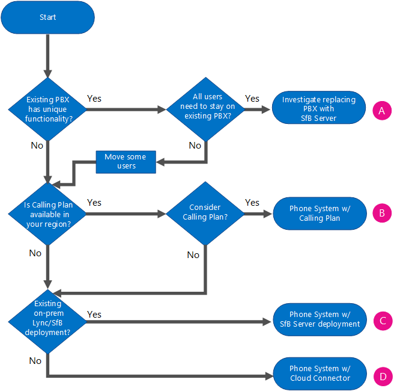

# Planejar sua solução de Sistema de Telefonia do Office 365 (Cloud PBX)
 
Encontre informações no sistema de telefone da Microsoft em soluções do Office 365 (nuvem PBX) para habilitar o controle de chamada e os recursos na nuvem do Office 365 Private Branch Exchange (PBX).
  
A Microsoft oferece uma variedade de opções para habilitar os usuários para chamar landlines e telefones móveis por meio do comutação telefônica PSTN (rede pública) — se suas contas existirem no Office 365 em Skype para Business Online ou em sua Skype local for Business Implantação de servidor ou o Lync Server 2013.
  
Este artigo descreve as diferentes ofertas de voz da Microsoft e então fornece orientação nos quais opções podem estar o melhor para você, dependendo do status atual da sua organização e os planos futuros. Você pode usar este artigo junto com o Skype para pôster de soluções de voz Online de negócios disponível como um download em formatos [Visio](https://download.microsoft.com/download/2/E/E/2EE5C4DE-7F12-475C-A507-37870020F0D3/Plan Voice Solution poster - Final.vsdx) e [PDF](https://download.microsoft.com/download/2/E/E/2EE5C4DE-7F12-475C-A507-37870020F0D3/Plan Voice Solution poster - Final.pdf) .
  
## Enterprise Voice

 **Enterprise Voice** é a voz da Microsoft padrão internacional ativado por software em relação a solução de protocolo da Internet (VoIP), incluída em implantações de local do Skype para Business Server. Enterprise Voice oferece um conjunto rico de capacidades e recursos, incluindo grupos de respostas, estacionamento de chamada, Enhanced 9-1-1 e muito mais. O Enterprise Voice é um sistema PBX (Central Privada de Comutação Telefônica) completo para sua organização, que inclui conectividade PSTN por meio da operadora local.
  

  
Para obter mais informações sobre as soluções do Enterprise Voice da Microsoft, consulte: [Enterprise Voice no Skype para Business Server 2015 planejar](../../plan-your-deployment/enterprise-voice-solution/enterprise-voice.md), [Implantar o Enterprise Voice no Skype para Business Server 2015](../../deploy/deploy-enterprise-voice/deploy-enterprise-voice.md), [planejamento do Enterprise Voice no Lync Server 2013](https://technet.microsoft.com/library/gg413081%28v=ocs.15%29.aspx)e a [implantação do Enterprise Voice no Lync Server 2013](https://technet.microsoft.com/EN-US/library/gg412876%28v=ocs.15%29.aspx).
  
## Sistema de telefonia do Office 365 (Cloud PBX)

 **O sistema telefônico no Office 365** é uma tecnologia da Microsoft para habilitar o controle de chamada e recursos do PBX na nuvem com Skype Office 365 para o Business Online. Sistema telefônico permite que você substitua o seu sistema PBX existente um conjunto de recursos entregues do Office 365 e estreitamente integrado ao experiência de produtividade de nuvem da empresa.
  
Com o sistema telefônico no Office 365, os usuários podem usar o Skype para Business Online para cuidam das tarefas de controle de chamada básica, como fazer e receber chamadas, transferir chamadas e chamadas tirar o som e unmuting. Os usuários do sistema telefônico podem clicar no nome no seu catálogo de endereços e Skype para empresas faz uma chamada para essa pessoa. Para fazer e receber chamadas, os usuários de sistema telefônico podem usar seus dispositivos móveis, um fone de ouvido com um laptop ou PC ou uma das muitas telefones IP que funcionam com o Skype para negócios. Para os administradores, o sistema telefônico fornece a capacidade de gerenciar chamada dentro do mesmo console de administração de locatário usado para mensagens, colaboração e assim por diante.
  
Como com sistemas de PBX tradicionais e com o Enterprise Voice, chamadas entre usuários em sua organização são tratadas internamente em sistema telefônico, nunca indo para a PSTN. Isso se aplica às chamadas entre usuários em sua organização, localizado em áreas geográficas diferentes, removendo os custos de longa distância nessas chamadas internas.
  
Para habilitar chamadas para landlines e celulares, o sistema telefônico pode ser conectado à PSTN em uma das duas maneiras:
  
- Ao comprar o Plano de Chamadas, o plano de chamadas PSTN complementar do Office 365.
    
- Usando o local PSTN, conectividade, onde software no local conecta-se com sua infra-estrutura de telefonia existente. 
    
## Sistema telefônico nas soluções do Office 365

A solução que você optar por tirar vantagem do sistema de telefone da Microsoft no Office 365 oferta depende de suas necessidades atuais e futuras, se você deseja — ou que são necessários — para manter a funcionalidade fornecida pelo sua implantação no local, se você precisa recursos que estão atualmente disponíveis apenas com a solução do Enterprise Voice no local e o que é seu plano para mover pessoas para a nuvem. 
  
Você pode escolher uma oferta completamente na-nuvem ou você pode escolher uma implantação híbrida que tira vantagem do sistema telefônico no Office 365, mas mantém algumas funcionalidades no local. Dependendo das suas necessidades, você pode optar por ter funcionalidade PSTN fornecida pelo serviço do Office 365 ou por seu software de local — conforme mostrado no diagrama a seguir e descrito nas seções a seguir:
  

  
- **Sistema telefônico no Office 365 com chamar plano** - essa opção usa o complemento chamar planejar para o sistema telefônico no Office 365 para habilitar a conectividade PSTN para chamadas landlines e celulares em todo o mundo (dependendo do nível de serviço a serem licenciado). Seus usuários são hospedados na nuvem e são habilitados para o Sistema de Telefonia com o complemento de Plano de Chamadas fornecido pela Microsoft. A oferta do Plano de Chamadas não requer um implantação de servidor local. Chamar o plano funciona somente com o sistema telefônico no Office 365 — você não pode usá-lo com outro sistema PBX. Para obter mais informações, consulte [Chamando planejar no Office 365](plan-your-phone-system-cloud-pbx-solution.md#BKMK_PSTNCalling).
    
- **O sistema telefônico no Office 365 com conectividade PSTN local** - essa opção usa software no local para conectar sua operadora existente de PSTN, circuito e as contrato com o Office 365. Os usuários estão hospedados na nuvem e estão habilitados para o sistema telefônico no Office 365, mas sua chamada é processada por meio de software no local.
    
    Você continua a usar a conectividade PSTN existente (por meio de um PBX, Gateway, Controlador de Borda de Sessão ou conexão de Tronco SIP) ao PSTN de origem para os usuários que transfere para a nuvem. Depois que um usuário é movido para Skype para Business Online e o sistema telefônico no Office 365, seu número de telefone roteará para qualquer um do Skype para clientes corporativos para PCs ou Smartphones, bem como mesa telefones certificados para o Skype para negócios. Depois de duas portas, os usuários na nuvem e herdada do PBX podem chamar umas às outras normalmente bem como fazer e receber chamadas PSTN usando seu número de telefone completo.
    
    Se você deseja implantar na conectividade PSTN local, você pode escolher entre as seguintes opções:
    
  - **Skype para o conector de nuvem Business Edition** - nuvem conector é um híbrido oferecendo que consiste em um conjunto de Industrializados máquinas virtuais (VMs) implementar uma conectividade PSTN local. Implantando um Skype mínimo para a topologia de servidor de negócios em um ambiente virtualizado, os usuários em sua organização, se hospedados na nuvem estão no local, poderá enviar e receber chamadas com landlines e telefones móveis por meio do local existente infraestrutura de voz. Para obter mais informações, consulte [Planejar Skype para Business Edition do conector de nuvem](plan-skype-for-business-cloud-connector-edition.md) e [Configurar e gerenciar Skype do conector de nuvem Business Edition](configure-skype-for-business-cloud-connector-edition.md).
    
  - **Skype para implantação existente do servidor de negócios** - uma Skype existente para implantação Business Server ou o Lync Server pode implementar a conectividade PSTN local também. Este é um híbrido oferecendo que consiste em um Skype para implantação de local Business Server modificada para o híbrido PSTN. Usuários em sua organização, se hospedados na nuvem estão no local, poderá enviar e receber chamadas com landlines e telefones móveis por meio da infra-estrutura de voz existente no local. Para obter mais informações, consulte [Planejar o sistema de telefone no Office 365 com conectividade PSTN em Skype para Business Server local](plan-phone-system-with-on-premises-pstn-connectivity.md) e [habilitar usuários para o sistema telefônico no Office 365 com conectividade PSTN local no Skype para Business Server](enable-users-for-phone-system.md).
    
### Plano de chamada do Office 365

 **Chamar planejar no Office 365** é o serviço que funciona com o sistema telefônico em que permite aos usuários do Office 365 para fazer chamadas para landlines e celulares. Como este plano de chamada PSTN opera fora do Office 365, esta é uma oferta de completamente na-nuvem que não requer uma implantação de servidor local.
  
Os usuários dessa opção estejam hospedados em Skype para negócios Online no Office 365 e têm acesso ao Skype para serviços de voz Online de negócios. A Microsoft é a provedora dos serviços básicos de chamada e PSTN, e pode até mesmo fornecer ou portar os números de telefone de seus usuários. 
  
Plano de chamada do Office 365 permite que você pesquise, adquirir e atribuir números de telefone aos usuários em sua organização para que os usuários podem fazer e receber chamadas telefônicas com pessoas de dentro e fora da sua organização.
  
Em todos os tipos de empresas, ter um número de telefone que permite aos usuários enviar e receber chamadas de voz é um requisito importante para fazer negócios uma vez que números de telefone são utilizados para identificar um usuário e permitem a comunicação entre organizações. Os usuários que são recebem números de telefone serão capazes de fazer chamadas de voz em todos os dispositivos Skype for Business, incluindo telefones VoIP, PCs e dispositivos móveis. 
  

  
Para obter mais informações, consulte [o que é chamada de PSTN?](https://support.office.com/en-us/article/What-is-PSTN-calling-3dc773b9-95e0-4448-b2f1-887c54022429?ui=en-US&amp;rs=en-US&amp;ad=US)
  
Plano de chamada do Office 365 está disponível nas localidades geográficas específicas, mas crescentes. Verifique com o seu representante Microsoft a disponibilidade em sua área. 
  
### Conectividade PSTN local com a Edição Cloud Connector

 **Conector de nuvem** é um conjunto de Industrializados máquinas virtuais (VMs) implementar a conectividade PSTN local com o sistema telefônico no Office 365. Essa oferta híbrida foi criada para organizações que deseja habilitar seu Skype para que os usuários corporativos Online use sua conexão de PSTN existente no local, com Skype para controle de chamada de negócios na nuvem.
  
Com essa opção, você implantar um conjunto de Industrializados VMs que contêm um Skype mínimo para a topologia de servidor de negócios — consiste em um componente de borda, o componente de mediação e uma função do repositório de gerenciamento Central (CMS). Esses serviços são configurados para o híbrido com seu locatário do Office 365 que inclui Skype para serviços corporativos Online. 
  

  
Para obter mais informações sobre essa opção, consulte [Planejar Skype para o conector de nuvem Business Edition](plan-skype-for-business-cloud-connector-edition.md) e [Configurar e gerenciar Skype do conector de nuvem Business Edition](configure-skype-for-business-cloud-connector-edition.md).
  
### Conectividade PSTN com uma implantação existente no local

Você pode implementar uma solução híbrida usando seu Skype existente para implantação de servidor de negócios e conectividade PSTN. Nessa topologia, os usuários estão hospedados na nuvem em Skype para Business Online em vez de sendo hospedado sobre a implantação no local. Você pode escolher essa opção se os seus usuários atuais estiverem hospedados na nuvem ou se você quiser iniciar a migração de usuários para a nuvem. 
  
Com essa opção, sua Skype para usuários corporativos Online Obtenha sua conectividade PSTN por meio do Enterprise Voice em sua Skype local para a implantação de servidor de negócios, com Skype para controle de chamada de negócios na nuvem. 
  

  
Para obter mais informações sobre essa opção, consulte [Planejar o sistema de telefone no Office 365 com conectividade PSTN em Skype para Business Server local](plan-phone-system-with-on-premises-pstn-connectivity.md) e [habilita usuários para o sistema telefônico no Office 365 com local conectividade PSTN em Skype para Business Server ](enable-users-for-phone-system.md).
  
## Escolha a melhor solução 

Para decidir qual é a melhor solução para sua organização, certifique-se de que conhece as respostas às seguintes perguntas e, em seguida, revise o fluxograma que pode lhe ajudar a escolher a sua solução:
  
- Você tem um Skype local existente para implantação de servidor de negócios? 
    
- Os usuários hospedados no Skype para negócios local, em nuvem em Skype para Business Online ou ambos? Você deseja transferir seus usuários locais para a nuvem?
    
- Está chamar planejar da Microsoft no Office 365 disponível na sua região? 
    
- Você deseja para manter sua operadora de telefonia atual? Você precisa manter sua operadora de telefonia atual por causa de um contrato existente?
    
- Você tem um PBX herdado local existente que você deseja ou precisa manter?   
    
- O seu PBX herdado atual oferece funcionalidades únicas que são cruciais para a sua empresa?
    
- Qualquer um ou todos os seus usuários exigem recursos oferecidos não está atualmente no sistema telefônico no Office 365?
    
Antes de fazer sua decisão sobre qual solução é o certa para sua organização — sistema telefônico no Office 365, no local Enterprise Voice, ou uma combinação da solução — você precisa determinar quais recursos você precisa agora e no futuro. Alguns recursos — como grupos de respostas, estacionamento de chamada e atendimento de chamada de grupo — são oferecidas apenas para usuários locais. Para obter uma lista completa de sistema telefônico no Office 365 recursos disponíveis para você, consulte [Eis os resultados obtidos com PBX de nuvem](https://go.microsoft.com/fwlink/p/?LinkId=715517).
  
**Escolha sua solução**

  
|**Sua situação**   |**Sistema telefônico na solução do Office 365**   |
|:-----|:-----|
|Seu sistema PBX oferece recursos exclusivos que você precisa manter.    |**Investigue a substituição de seu PBX pelo Skype for Business Server.** Você pode usar Skype para Business Server Enterprise Voice como um sistema PBX completo da sua organização, incluindo a conectividade PSTN por meio de sua operadora local. Se sua necessidade de PBX recursos alterações no futuro, você pode reexaminar sistema telefônico no Office 365.   Para obter mais informações sobre as soluções do Enterprise Voice da Microsoft, consulte [planejar sua solução do Enterprise Voice no Skype para Business Server 2015](../../plan-your-deployment/enterprise-voice-solution/enterprise-voice-solution.md).    Se não todos os seus usuários exigem recursos exclusivos fornecido pelo seu PBX atual, você pode considerar mover os usuários para Skype para negócios Online.    |
|Seu PBX não oferece recursos exclusivos que você precisa manter, chamar planejar no Office 365 está disponível na sua região e você deseja usar os serviços PSTN fornecida pela Microsoft.    |**Inscrever-se chamar o plano no Office 365.** Todos os seus usuários poderão usar a nuvem, no Skype for Business Online, e sua organização poderá receber serviços PBX e PSTN da nuvem da Microsoft. Se os usuários já tiverem números de telefone da operadora atual, os números de telefone podem ser transferidos para o sistema telefônico no Office 365. Conforme necessário, você poderá obter outros números de telefone da Microsoft.   Para obter mais informações, consulte [o que é chamada de PSTN?](https://support.office.com/en-us/article/What-is-PSTN-calling-3dc773b9-95e0-4448-b2f1-887c54022429?ui=en-US&amp;rs=en-US&amp;ad=US)   |
|Seu PBX não oferece recursos exclusivos que você precisa manter, chamar planejar no Office 365 não está disponível em sua região e possui um Lync existente ou Skype para implantação de servidor de negócios.    Neste cenário também é possível que todos os seus usuários estejam nos Estados Unidos, mas você não pode considerar migrar para a PSTN da Microsoft por outros motivos, como obrigações contratuais com sua operadora.    |**Conecte seu Skype existente para implantação de servidor de negócios com o sistema telefônico no Office 365.** Conectividade PSTN é fornecida por meio do Enterprise Voice em sua Skype local para implantação de servidor de negócios, mas sua organização pode receber serviços PBX de nuvem da Microsoft. Você pode manter os recursos de voz dos usuários conforme você começa a movê-los para Skype para negócios Online. A transferência de seus usuários pode ser feita no seu próprio ritmo, sabendo que seus recursos de voz continuarão independentemente de onde estiverem hospedados.   No futuro, se você decidir que você pode deixar a sua operadora atual, você poderá portar seus usuários de nuvem para o sistema de telefone completo da Microsoft no Office 365 com chamar planejar, com a Microsoft fornecendo a todos os recursos de PBX e PSTN.    Para obter mais informações sobre essa opção, consulte [Planejar o sistema de telefone no Office 365 com conectividade PSTN em Skype para Business Server local](plan-phone-system-with-on-premises-pstn-connectivity.md) e [habilita usuários para o sistema telefônico no Office 365 com local conectividade PSTN em Skype para Business Server ](enable-users-for-phone-system.md).    |
|Seu PBX não oferece recursos exclusivos que você precisa manter, chamar planejar no Office 365 não está disponível em sua região e você não tem um Lync existente ou Skype para implantação de servidor de negócios.    Neste cenário, também é possível que chamar planejar no Office 365 está disponível na sua região, mas não pode considerar a movimentação para PSTN fornecida pela Microsoft por outros motivos — como obrigações contratuais com sua operadora existente.    |**Implantar o Cloud Connector.** Você mantém sua operadora de PSTN atual, mas sua organização pode receber serviços PBX da nuvem da Microsoft. Conector de nuvem permite que você forneça Skype para recursos de controle de chamada de negócios para seus usuários. Essa solução funciona qualquer que seja a localização geográfica de seus usuários, pois cada usuário estará conectado ao seu site local para a conectividade PSTN.   No futuro, se você decidir que você pode deixar a sua operadora atual, você poderá portar seus usuários de nuvem para o sistema de telefone completo da Microsoft no Office 365 com chamar planejar, com a Microsoft fornecendo a todos os recursos de PBX e PSTN.    Para obter mais informações sobre essa opção, consulte [Planejar Skype para o conector de nuvem Business Edition](plan-skype-for-business-cloud-connector-edition.md) e [Configurar e gerenciar Skype do conector de nuvem Business Edition](configure-skype-for-business-cloud-connector-edition.md).    |
   
### Escolha uma solução combinada

Obviamente, você não tem que escolher apenas uma solução para toda sua organização. A seguir estão apenas alguns exemplos de onde a combinação de soluções pode ser a melhor estratégia para sua organização:
  
- **Minha organização tem um Skype existente para implantação de servidor de negócios, chamar planejar no Office 365 está disponível em minha região, eu preciso apenas os recursos de controle de chamada básica e não precisará manter minha troncos PSTN ou um PBX no local.** Você pode usar sistema telefônico no Office 365 com uma conectividade PSTN local para manter os recursos de voz dos usuários que você começar a movê-los online. Eventualmente, você pode mover todos os usuários on-line, preterir servidores seu local e usar o sistema telefônico no Office 365 com chamar planejar.
    
- **Minha organização tem várias localizações geográficas. Os sites maiores têm um Skype local para implantações de servidor de negócios com o Enterprise Voice, enquanto usuários nos sites menores não têm qualquer Skype para recursos de voz de negócios em todas as.** Se esses sites menores em uma região que fornece chamar planejar no Office 365, você poderia mova esses usuários para Skype para Business Online e habilitá-los para recursos de voz por meio de sistema telefônico no Office 365 com chamar planejar. Todo o tempo, os usuários em seus sites maiores podem permanecer no local, ou poderia movê-los para Skype para Business Online em seu próprio ritmo, tirando proveito do sistema telefônico no Office 365 com o local conectividade PSTN.
    
- **Minha organização tem um Skype existente para implantação de servidor de negócios, chamar planejar no Office 365 está disponível em minha região, mas alguns dos meus usuários exigem recursos avançados de chamada como grupos de resposta e atendimento de chamada do grupo.** Os usuários que não é necessário usar os recursos avançados de chamada podem ser movidos para a nuvem agora, usando o sistema telefônico no Office 365 com uma conectividade PSTN local. Posteriormente, quando os recursos necessários são adicionados ao Skype para Business Online, você pode mover o restante de seus usuários para a nuvem também.
    
- **Minha organização tem um Skype existente para implantação de servidor de negócios, eu quiser mover todos os meus usuários para a nuvem, mas chamar planejar no Office 365 não está disponível em todas as regiões.** Você pode mover todos os seus usuários para a nuvem enquanto mantém seus tronco de site local e a funcionalidade de PBX, usando o sistema telefônico no Office 365 com uma conectividade PSTN local. Para os usuários que residem em regiões que fornecem chamar planejar no Office 365 — e que não é necessário avançados recursos de chamada — você opcionalmente pode mover o controle de suas chamadas para a nuvem também usando o sistema telefônico no Office 365 com chamar planejar. Quando fizer isso, você poderá portar seus números de telefone.
    
- **Minha organização tem um Skype existente para o servidor de negócios, mas sem a implantação do Enterprise Voice.** Consulte o fluxograma para determinar a melhor solução para sua organização.
    

