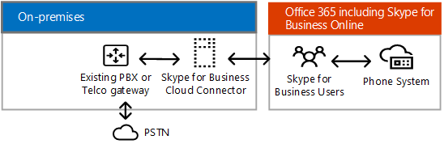

# Skype para soluções híbridas de negóciosSkype for Business hybrid solutions
 
Encontre informações sobre como planejar uma Skype para implantação híbrida do Business.Find information on planning a Skype for Business hybrid deployment. 
  
Este tópico apresenta várias configurações híbridas que o ajudarão a determinar a melhor configuração para sua empresa.This topic introduces you to several hybrid configurations to help you determine which configuration is best for your business. Depois, para saber mais sobre a configuração de seu interesse, siga os links a seguir.You can then read more about the configuration you're interested in by following the links in this topic. Este tópico inclui as seguintes seções:This topic contains the following sections:
  
- [Configurações híbridas do Skype for BusinessSkype for Business hybrid configurations](skype-for-business-hybrid-solutions.md#BKMK_HybridConfigurations)
    
- [Adicionar Skype para negócios Online em sua existente no local Skype para ambiente de negóciosAdd Skype for Business Online into your existing on-premises Skype for Business environment](skype-for-business-hybrid-solutions.md#BKMK_HybridConnectivity)
    
- [Beneficie-se do sistema telefônico no Office 365 (nuvem PBX)Take advantage of Phone System in Office 365 (Cloud PBX)](skype-for-business-hybrid-solutions.md#BKMK_CloudPBX)
    
- [Integração entre o Exchange e o SharePointIntegrate with Exchange and SharePoint](skype-for-business-hybrid-solutions.md#BKMK_IntegratewExchangeSharePoint)
    
- [Tarefas para planejar e configurar um ambiente híbridoTasks for planning and configuring a hybrid environment](skype-for-business-hybrid-solutions.md#BKMK_Tasks)
    
- [Para obter mais informaçõesFor more information](skype-for-business-hybrid-solutions.md#BKMK_MoreInfo)
    
## Configurações híbridas do Skype for BusinessSkype for Business hybrid configurations

Skype para a empresa oferece suporte a várias configurações de híbridas.Skype for Business supports several hybrid configurations. Você pode adicionar Skype para Business Online em sua atual local Skype para ambiente de negócios, integrar seu Skype para implantação de negócios com o Exchange Online e SharePoint Online e aproveitar o sistema telefônico no Office 365 (nuvem PBX) — da Microsoft tecnologia para habilitar o controle de chamada e os recursos de Private Branch Exchange (PBX) no Office 365 nuvem com Skype para Business Online.You can add Skype for Business Online into your existing on-premises Skype for Business environment, integrate your Skype for Business deployment with Exchange Online and SharePoint Online, and take advantage of Phone System in Office 365 (Cloud PBX)—Microsoft's technology for enabling call control and Private Branch Exchange (PBX) capabilities in the Office 365 cloud with Skype for Business Online. 
  
Com um Skype para implantação híbrida do Business, você deve combinar uma Skype para assinatura Business Online com Skype seu local para a oferta de negócios.With a Skype for Business hybrid deployment, you combine a Skype for Business Online subscription with your on-premises Skype for Business offering. Você pode começar a construir as habilidades de gerenciamento de software como serviço em sua organização e mover sua Skype para usuários comerciais para a nuvem em seu próprio ritmo.You can start building software-as-a-service management skills in your organization, and move your Skype for Business users to the cloud at your own pace. Os usuários hospedados na nuvem podem aproveitar sistema telefônico no Office 365 enquanto mantém a conectividade da rede de telefônica pública comutada (PSTN) local.Your users who are homed in the cloud can take advantage of Phone System in Office 365 while retaining your on-premises Public Switched Telephone Network (PSTN) connectivity.
  
Com um Skype para configuração híbrida de negócios, lembre-se do seguinte:With a Skype for Business hybrid configuration, keep the following in mind:
  
- Pode haver usuários hospedados localmente e outros online, mas todos compartilham o mesmo domínio SIP; por exemplo, contoso.com.Some users might be homed on premises and some online, but the users share the same Session Initiation Protocol (SIP) domain, such as contoso.com.
    
- Você pode migrar usuários do Skype for Business no local para Skype para Business Online ao longo do tempo, no seu calendário.You can migrate users from Skype for Business on premises to Skype for Business Online over time, on your schedule.
    
- Você pode fazer a integração com outros aplicativos do Microsoft Office 365, como o Exchange Online e o SharePoint Online.You can integrate with other Microsoft Office 365 applications, including Exchange Online and SharePoint Online.
    
- Você pode fazer a integração com o Exchange e o SharePoint.You can integrate with Exchange and SharePoint.
    
- Você pode utilizar a Transmissão de Reunião do Skype.You can take advantage of Skype Meeting Broadcast.
    
- Você pode utilizar a Conferência PSTN.You can take advantage of PSTN conferencing.
    
## Adicionar Skype para negócios Online em sua existente no local Skype para ambiente de negóciosAdd Skype for Business Online into your existing on-premises Skype for Business environment

Conectividade híbrida entre Skype para Business Server e do Skype para Business Online significa que os usuários de um domínio, por exemplo, contoso.com, são divididos entre usando Skype para Business Server no local e Skype para Business Online.Hybrid connectivity between Skype for Business Server and Skype for Business Online means users of a domain, such as contoso.com, are split between using Skype for Business Server on premises and Skype for Business Online. Alguns usuários do domínio são hospedados no local, e outros são hospedados online.Some of the domain users are homed on premises, and some users are homed online. Você pode configurar sua implantação no local para o híbrido com Skype para Business Online e usar a sincronização do Active Directory para manter seu local e online usuários sincronizados.You can configure your on-premises deployment for hybrid with Skype for Business Online and use Active Directory Synchronization to keep your on-premises and online users synchronized. 
  
O diagrama a seguir mostra como você pode adicionar Skype para Business Online em sua Skype local existente para o ambiente de negócios, permitindo que você mova os usuários para a nuvem em seu próprio ritmo:The following diagram shows how you can add Skype for Business Online into your existing on-premises Skype for Business environment, allowing you to move users to the cloud at your own pace:
  

  
Para obter mais informações, consulte [Planejar a conectividade híbrida entre Skype para Business Server e do Skype para Business Online](plan-hybrid-connectivity.md) e a [conectividade híbrida de Deploy entre Skype para Business Server e do Skype para negócios Online](deploy-hybrid-connectivity/deploy-hybrid-connectivity.md).For more information, see [Plan hybrid connectivity between Skype for Business Server and Skype for Business Online](plan-hybrid-connectivity.md) and [Deploy hybrid connectivity between Skype for Business Server and Skype for Business Online](deploy-hybrid-connectivity/deploy-hybrid-connectivity.md).
  
## Aproveite o Sistema de Telefonia do Office 365 (Cloud PBX)Take advantage of Phone System in Office 365 (Cloud PBX)

 Sistema telefônico no Office 365 (nuvem PBX) é uma tecnologia da Microsoft para habilitar o controle de chamada e os recursos de Private Branch Exchange (PBX) no Office 365 nuvem com Skype para Business Online.Phone System in Office 365 (Cloud PBX) is Microsoft's technology for enabling call control and Private Branch Exchange (PBX) capabilities in the Office 365 cloud with Skype for Business Online. O sistema telefônico no Office 365 permite que você substitua o seu sistema PBX existente um conjunto de recursos entregues do Office 365 e estreitamente integrado ao experiência de produtividade de nuvem da Microsoft.Phone System in Office 365 allows you to replace your existing PBX system with a set of features delivered from Office 365 and tightly integrated into Microsoft's cloud productivity experience.
  
Além de sistema telefônico duas no Office 365 ofertas de híbrido, a Microsoft oferece o sistema telefônico no Office 365 com chamar planejar — uma PSTN chamando serviço — para uma solução de all nuvem que não requer uma implantação de servidor local.In addition to two Phone System in Office 365 hybrid offerings, Microsoft offers Phone System in Office 365 with Calling Plan—a PSTN calling service—for an all-in-the-cloud solution that does not require an on-premises server deployment. Para decidir se o sistema telefônico no Office 365 com chamar planejar pode ser a solução certa para sua organização, consulte [Sistema telefônico nas soluções do Office 365](plan-your-phone-system-cloud-pbx-solution/plan-your-phone-system-cloud-pbx-solution.md#BKMK_PBXOfferings).To decide if Phone System in Office 365 with Calling Plan might be the right solution for your organization, see [ Phone System in Office 365 solutions](plan-your-phone-system-cloud-pbx-solution/plan-your-phone-system-cloud-pbx-solution.md#BKMK_PBXOfferings).
  
Há duas ofertas híbridas para o Sistema de Telefonia do Office 365:There are two Phone System in Office 365 hybrid offerings: 
  
- [Sistema telefônico no Office 365 com conectividade local fornecida pelo seu Skype para implantação de servidor de negóciosPhone System in Office 365 with on-premises connectivity provided by your Skype for Business Server deployment](skype-for-business-hybrid-solutions.md#BKMK_Server)
    
- [Sistema telefônico no Office 365 com conectividade local fornecida pelo Skype para o conector de nuvem Business Server EditionPhone System in Office 365 with on-premises connectivity provided by Skype for Business Server Cloud Connector Edition](skype-for-business-hybrid-solutions.md#BKMK_CCE)
    
### Sistema de Telefonia do Office 365 com conectividade local fornecida pela implantação do Skype for Business ServerPhone System in Office 365 with on-premises connectivity provided by your Skype for Business Server deployment

Essa configuração consiste em um Skype para implantação de local Business Server modificada para o híbrido PSTN.This configuration consists of a Skype for Business Server on-premises deployment modified for hybrid PSTN. Usuários hospedados na nuvem em sua organização podem receber serviços PBX de nuvem da Microsoft, mas a conectividade PSTN é fornecida por meio do Enterprise Voice em sua Skype local para implantação de servidor de negócios.Users in your organization who are homed in the cloud can receive PBX services from the Microsoft cloud, but PSTN connectivity is provided through Enterprise Voice on your on-premises Skype for Business Server deployment. 
  

  
Essa é a melhor configuração quando:This configuration is best if: 
  
- Seu PBX não oferece recursos exclusivos que você precisa manter.Your PBX does not offer unique features that you need to retain.
    
- O Plano de Chamadas, o serviço de chamadas PSTN do Office 365, não está disponível na sua região.Calling Plan, the Office 365 PSTN calling service, is not available in your region.
    
- Possui um Lync existente ou Skype para implantação de servidor de negócios.You have an existing Lync or Skype for Business Server deployment.
    
Para obter mais informações, consulte [Planejar o sistema de telefone no Office 365 com conectividade PSTN em Skype para Business Server local](plan-your-phone-system-cloud-pbx-solution/plan-phone-system-with-on-premises-pstn-connectivity.md) e [habilitar usuários para o sistema telefônico no Office 365 com conectividade PSTN local no Skype para Business Server](plan-your-phone-system-cloud-pbx-solution/enable-users-for-phone-system.md).For more information, see [Plan Phone System in Office 365 with on-premises PSTN connectivity in Skype for Business Server](plan-your-phone-system-cloud-pbx-solution/plan-phone-system-with-on-premises-pstn-connectivity.md) and [Enable users for Phone System in Office 365 with on-premises PSTN connectivity in Skype for Business Server](plan-your-phone-system-cloud-pbx-solution/enable-users-for-phone-system.md).
  
### Sistema de Telefonia do Office 365 com conectividade local fornecida pelo Skype for Business Server Cloud Connector EditionPhone System in Office 365 with on-premises connectivity provided by Skype for Business Server Cloud Connector Edition

Essa configuração consiste em um conjunto de VMs (máquinas virtuais) empacotadas que implementam a conectividade PSTN local.This configuration consists of a set of packaged Virtual Machines (VMs) that implement on-premises PSTN connectivity. Implantando um Skype mínimo para a topologia de servidor de negócios em um ambiente virtualizado, os usuários em sua organização hospedados na nuvem podem receber serviços PBX de nuvem da Microsoft, mas conectividade PSTN é fornecida por meio de voz no local existente infraestrutura.By deploying a minimal Skype for Business Server topology in a virtualized environment, users in your organization who are homed in the cloud can receive PBX services from the Microsoft cloud, but PSTN connectivity is provided through the existing on-premises voice infrastructure. 
  

  
Essa é a melhor configuração quando:This configuration is best if:
  
- Seu PBX não oferece recursos exclusivos que você precisa manter.Your PBX does not offer unique features that you need to retain.
    
- O Plano de Chamadas, o serviço de chamadas PSTN do Office 365, não está disponível na sua região.Calling Plan, the Office 365 PSTN calling service, is not available in your region.
    
- Você não tem um Lync existente ou Skype para implantação de servidor de negócios.You do not have an existing Lync or Skype for Business Server deployment.
    
Para obter mais informações, consulte [Planejar Skype para o conector de nuvem Business Edition](plan-your-phone-system-cloud-pbx-solution/plan-skype-for-business-cloud-connector-edition.md).For more information, see [Plan for Skype for Business Cloud Connector Edition](plan-your-phone-system-cloud-pbx-solution/plan-skype-for-business-cloud-connector-edition.md).
  
## Integração entre o Exchange e o SharePointIntegrate with Exchange and SharePoint

Um Skype para configuração híbrida de negócios permite a integração com outros aplicativos do Microsoft Office 365, incluindo o Exchange Online e SharePoint Online.A Skype for Business hybrid configuration allows you to integrate with other Microsoft Office 365 applications, including Exchange Online and SharePoint Online.
  
### Skype for Business Server com Exchange Online e SharePoint OnlineSkype for Business Server with Exchange Online and SharePoint Online

Você pode integrar Skype para Business Server com o Exchange Online e SharePoint Online, conforme mostrado no diagrama a seguir:You can integrate Skype for Business Server with Exchange Online and SharePoint Online as shown in the following diagram:
  

  
Integrando Skype for Business Server com o Exchange Online e SharePoint Online tem várias vantagens.Integrating Skype for Business Server with Exchange Online and SharePoint Online has several advantages. Você pode:You can:
  
- Use o conjunto completo de recursos do Skype para Business Server.Use the full feature set of Skype for Business Server.
    
- Aproveitar seu equipamento telefônico local existente, como os PBXs.Leverage your existing on-premises phone equipment, such as PBXs.
    
- Usar o email do Exchange Online, aliviando a carga de armazenamento e dos servidores locais de email.Use Exchange Online for email, off-loading the burden of on-premises email servers and storage.
    
- Usar a colaboração do SharePoint Online, aliviando a carga de manutenção dos servidores locais do SharePoint.Use SharePoint Online for collaboration, off-loading the burden of maintaining on-premises SharePoint servers.
    
- Uso Skype para negócios, Exchange e SharePoint integrado de recursos, incluindo Unified Messaging (UM) no Office 365.Use Skype for Business, Exchange, and SharePoint integrated features, including Unified Messaging (UM) in Office 365.
    
Para obter mais informações, consulte [Planejar a integração do Skype para Exchange e de negócios](../plan-your-deployment/integrate-with-exchange/integrate-with-exchange.md).For more information, see [Plan to integrate Skype for Business and Exchange](../plan-your-deployment/integrate-with-exchange/integrate-with-exchange.md).
  
### Exchange Server com Skype for Business OnlineExchange Server with Skype for Business Online

Você pode integrar o Exchange Server com Skype para Business Online conforme mostrado no diagrama a seguir:You can integrate Exchange Server with Skype for Business Online as shown in the following diagram:
  

  
Integrando o Exchange Server com Skype for Business Online tem as seguintes vantagens:Integrating Exchange Server with Skype for Business Online has the following advantages:
  
- Aproveitamento da infraestrutura existente do Exchange.Leverage your existing Exchange infrastructure.
    
- Use o Skype para Business Online para recursos de presença, mensagens Instantâneas e conferência.Use Skype for Business Online for presence, IM, and conferencing capabilities. 
    
Para obter mais informações, consulte [Planejar a integração do Skype para Exchange e de negócios](../plan-your-deployment/integrate-with-exchange/integrate-with-exchange.md).For more information, see [Plan to integrate Skype for Business and Exchange](../plan-your-deployment/integrate-with-exchange/integrate-with-exchange.md).
  
## Tarefas para planejar e configurar um ambiente híbridoTasks for planning and configuring a hybrid environment

Skype para negócios fornece um conjunto rico de recursos, independentemente de como você planejar a implantação.Skype for Business provides a rich set of capabilities no matter how you architect your deployment. A arquitetura escolhida determina quais são as suas responsabilidades de TI e quais estão incluídas na assinatura de suporte da Microsoft.The architecture you choose will determine which IT responsibilities you own, and which you pay Microsoft to support through your subscription. Independentemente de qual seja a melhor arquitetura para sua organização, você sempre será responsável por cinco itens principais:No matter which architecture is best for your organization, there are five core responsibilities that you will always own:
  
- **Rede e conectividade** - garantir a capacidade de rede e a disponibilidade por meio de firewalls, servidores proxy, gateways e em links de WAN executando uma avaliação de rede ou por contratar com um parceiro a fim de fazer a avaliação.**Networking and connectivity** - Ensure network capacity and availability through firewalls, proxy servers, gateways, and across WAN links by performing a network assessment or by contracting with a partner to do the assessment.
    
- **Governança dados &amp; gerenciamento de direitos** - classificar seus dados confidenciais e certifique-se ele está protegido e monitorado onde ele está armazenado e enquanto ele está em trânsito.**Data governance &amp; rights management** - Classify your sensitive data and ensure it is protected and monitored wherever it is stored and while it is in transit.
    
- **Pontos de extremidade do cliente** - estabelecer, medir e impor padrões de segurança moderno em dispositivos que são usados para acessar seus dados e ativos.**Client Endpoints** - Establish, measure, and enforce modern security standards on devices that are used to access your data and assets.
    
- **Conta &amp; gerenciamento de acesso** - estabelecer um perfil para atividade de conta "normal" e a atividade incomum de alerta.**Account &amp; access management** - Establish a profile for "normal" account activity and alert on unusual activity.
    
- **Identidades** - use credenciais protegidas por hardware ou pela MFA (Autenticação Multifator) para todas as identidades. **Identity** - Use credentials secured by hardware or Multi-Factor Authentication (MFA) for all identities.
    
Além das tarefas relacionadas à arquitetura que você realiza em seu ambiente local, também será necessário:In addition to the architectural tasks you perform for your on-premises environment, you will need to:
  
- Planejar e criar requisitos de gerenciamento de identidades, incluindo a integração de identidades locais com o Office 365.Plan and design identity management requirements, including integrating on-premises identities with Office 365.
    
- Garantir a capacidade e a disponibilidade da rede.Ensure network capacity and availability.
    
- Adquirir certificados SSL de terceiros para proporcionar segurança corporativa às ofertas de serviços do Office 365.Acquire third-party SSL certificates to provide enterprise-security for Office 365 service offerings.
    
- Decidir se você deseja se conectar ao Office 365 usando o protocolo IPv6.Decide if you want to connect to Office 365 with Internet Protocol version 6 (IPv6).
    
- Determine quanto integração de recurso com o local e a versões online do Skype para negócios, Exchange e SharePoint for desejada.Determine how much feature integration with on-premises and online versions of Skype for Business, Exchange, and SharePoint is desired. 
    
- Determinar qual dispositivo de servidor proxy será usado para as solicitações do Office 365.Determine which proxy server device will be used for requests from Office 365.
    
Você também precisará executar o acompanhamento tarefas profissional de TI para implementar sua Skype para ambiente híbrido de negócios:You will also need to perform the follow IT Pro tasks to implement your Skype for Business hybrid environment:
  
- Certifique-se de que você tem um locatário do Microsoft Office 365 com Skype para Business Online habilitado.Ensure you have a Microsoft Office 365 tenant with Skype for Business Online enabled.
    
- Implementar o plano de gerenciamento de identidades. Implement the identity management plan. 
    
- Planejar e implementar os registros e o roteamento DNS interno e externo.Plan and implement internal and external DNS records and routing.
    
- Configurar o proxy ou o firewall com os requisitos de endereço IP e URL do Office 365.Configure your proxy or firewall for Office 365 IP address and URL requirements.
    
- Administrar contas de usuário e Skype para configurações de negócios Online.Administer user accounts and Skype for Business Online settings. 
    
- Configurar o dispositivo de servidor proxy, se necessário. Configure the proxy server device, if required. 
    
- Configurar a integração de recursos com as versões locais e online do Exchange Server e do SharePoint.Configure the integration of features with on-premises and online versions of Exchange Server and SharePoint.
    
## Para obter mais informaçõesFor more information

Para obter mais informações, confira:For more information, see the following resources:
  
- [Recursos de arquitetura de TI de nuvem da MicrosoftMicrosoft cloud IT architecture resources](https://aka.ms/clouditarch)
    
- [Identidade de nuvem da Microsoft para arquitetos da empresaMicrosoft cloud identity for enterprise architects](https://aka.ms/cloudidarch)
    
- [Prepare a sua organização para o Office 365 EnterpriseGet your organization ready for Office 365 Enterprise](https://aka.ms/O365EntPrep)
    
- [Planejar a conectividade híbrida entre o Skype for Business Server e o Skype for Business OnlinePlan hybrid connectivity between Skype for Business Server and Skype for Business Online](plan-hybrid-connectivity.md)
    
- [Implantar a conectividade híbrida entre Skype para Business Server e do Skype para negócios OnlineDeploy hybrid connectivity between Skype for Business Server and Skype for Business Online](deploy-hybrid-connectivity/deploy-hybrid-connectivity.md)
    
- [Sistema telefônico nas soluções do Office 365 Phone System in Office 365 solutions](plan-your-phone-system-cloud-pbx-solution/plan-your-phone-system-cloud-pbx-solution.md#BKMK_PBXOfferings)
    
- [Planejar a integração do Skype para Exchange e de negóciosPlan to integrate Skype for Business and Exchange](../plan-your-deployment/integrate-with-exchange/integrate-with-exchange.md)
    
Para baixar a versão deste tópico em .pdf:If you would like to download a poster version of this topic, go to:
  
- [Skype para modelos de arquitetura de negócios (pdf)Skype for Business Architectural Models (pdf)](https://download.microsoft.com/download/7/7/4/7741262C-A60D-41F7-863B-99BF5964FBFE/Skype for Business Architectural Models.pdf)
    
- [Skype para modelos de arquitetura de negócios (Visio)Skype for Business Architectural Models (Visio)](https://download.microsoft.com/download/7/7/4/7741262C-A60D-41F7-863B-99BF5964FBFE/Skype for Business Architectural Models.vsd)
    

