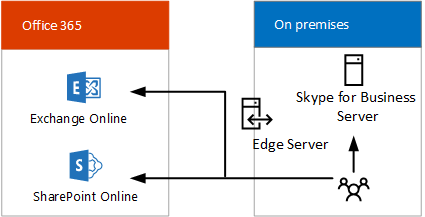

# Skype para soluções híbridas de negócios
 
Encontre informações sobre como planejar uma Skype para implantação híbrida do Business. 
  
Este tópico apresenta várias configurações híbridas que o ajudarão a determinar a melhor configuração para sua empresa. Depois, para saber mais sobre a configuração de seu interesse, siga os links a seguir. Este tópico inclui as seguintes seções:
  
- [Configurações híbridas do Skype for Business](skype-for-business-hybrid-solutions.md#BKMK_HybridConfigurations)
    
- [Adicionar Skype para negócios Online em sua existente no local Skype para ambiente de negócios](skype-for-business-hybrid-solutions.md#BKMK_HybridConnectivity)
    
- [Beneficie-se do sistema telefônico no Office 365 (nuvem PBX)](skype-for-business-hybrid-solutions.md#BKMK_CloudPBX)
    
- [Integração entre o Exchange e o SharePoint](skype-for-business-hybrid-solutions.md#BKMK_IntegratewExchangeSharePoint)
    
- [Tarefas para planejar e configurar um ambiente híbrido](skype-for-business-hybrid-solutions.md#BKMK_Tasks)
    
- [Para obter mais informações](skype-for-business-hybrid-solutions.md#BKMK_MoreInfo)
    
## Configurações híbridas do Skype for Business

Skype para a empresa oferece suporte a várias configurações de híbridas. Você pode adicionar Skype para Business Online em sua atual local Skype para ambiente de negócios, integrar seu Skype para implantação de negócios com o Exchange Online e SharePoint Online e aproveitar o sistema telefônico no Office 365 (nuvem PBX) — da Microsoft tecnologia para habilitar o controle de chamada e os recursos de Private Branch Exchange (PBX) no Office 365 nuvem com Skype para Business Online. 
  
Com um Skype para implantação híbrida do Business, você deve combinar uma Skype para assinatura Business Online com Skype seu local para a oferta de negócios. Você pode começar a construir as habilidades de gerenciamento de software como serviço em sua organização e mover sua Skype para usuários comerciais para a nuvem em seu próprio ritmo. Os usuários hospedados na nuvem podem aproveitar sistema telefônico no Office 365 enquanto mantém a conectividade da rede de telefônica pública comutada (PSTN) local.
  
Com um Skype para configuração híbrida de negócios, lembre-se do seguinte:
  
- Pode haver usuários hospedados localmente e outros online, mas todos compartilham o mesmo domínio SIP; por exemplo, contoso.com.
    
- Você pode migrar usuários do Skype for Business no local para Skype para Business Online ao longo do tempo, no seu calendário.
    
- Você pode fazer a integração com outros aplicativos do Microsoft Office 365, como o Exchange Online e o SharePoint Online.
    
- Você pode fazer a integração com o Exchange e o SharePoint.
    
- Você pode utilizar a Transmissão de Reunião do Skype.
    
- Você pode utilizar a Conferência PSTN.
    
## Adicionar Skype para negócios Online em sua existente no local Skype para ambiente de negócios

Conectividade híbrida entre Skype para Business Server e do Skype para Business Online significa que os usuários de um domínio, por exemplo, contoso.com, são divididos entre usando Skype para Business Server no local e Skype para Business Online. Alguns usuários do domínio são hospedados no local, e outros são hospedados online. Você pode configurar sua implantação no local para o híbrido com Skype para Business Online e usar a sincronização do Active Directory para manter seu local e online usuários sincronizados. 
  
O diagrama a seguir mostra como você pode adicionar Skype para Business Online em sua Skype local existente para o ambiente de negócios, permitindo que você mova os usuários para a nuvem em seu próprio ritmo:
  

  
Para obter mais informações, consulte [Planejar a conectividade híbrida entre Skype para Business Server e do Skype para Business Online](plan-hybrid-connectivity.md) e a [conectividade híbrida de Deploy entre Skype para Business Server e do Skype para negócios Online](deploy-hybrid-connectivity/deploy-hybrid-connectivity.md).
  
## Aproveite o Sistema de Telefonia do Office 365 (Cloud PBX)

 Sistema telefônico no Office 365 (nuvem PBX) é uma tecnologia da Microsoft para habilitar o controle de chamada e os recursos de Private Branch Exchange (PBX) no Office 365 nuvem com Skype para Business Online. O sistema telefônico no Office 365 permite que você substitua o seu sistema PBX existente um conjunto de recursos entregues do Office 365 e estreitamente integrado ao experiência de produtividade de nuvem da Microsoft.
  
Além de sistema telefônico duas no Office 365 ofertas de híbrido, a Microsoft oferece o sistema telefônico no Office 365 com chamar planejar — uma PSTN chamando serviço — para uma solução de all nuvem que não requer uma implantação de servidor local. Para decidir se o sistema telefônico no Office 365 com chamar planejar pode ser a solução certa para sua organização, consulte [Sistema telefônico nas soluções do Office 365](plan-your-phone-system-cloud-pbx-solution/plan-your-phone-system-cloud-pbx-solution.md#BKMK_PBXOfferings).
  
Há duas ofertas híbridas para o Sistema de Telefonia do Office 365: 
  
- [Sistema telefônico no Office 365 com conectividade local fornecida pelo seu Skype para implantação de servidor de negócios](skype-for-business-hybrid-solutions.md#BKMK_Server)
    
- [Sistema telefônico no Office 365 com conectividade local fornecida pelo Skype para o conector de nuvem Business Server Edition](skype-for-business-hybrid-solutions.md#BKMK_CCE)
    
### Sistema de Telefonia do Office 365 com conectividade local fornecida pela implantação do Skype for Business Server

Essa configuração consiste em um Skype para implantação de local Business Server modificada para o híbrido PSTN. Usuários hospedados na nuvem em sua organização podem receber serviços PBX de nuvem da Microsoft, mas a conectividade PSTN é fornecida por meio do Enterprise Voice em sua Skype local para implantação de servidor de negócios. 
  

  
Essa é a melhor configuração quando: 
  
- Seu PBX não oferece recursos exclusivos que você precisa manter.
    
- O Plano de Chamadas, o serviço de chamadas PSTN do Office 365, não está disponível na sua região.
    
- Possui um Lync existente ou Skype para implantação de servidor de negócios.
    
Para obter mais informações, consulte [Planejar o sistema de telefone no Office 365 com conectividade PSTN em Skype para Business Server local](plan-your-phone-system-cloud-pbx-solution/plan-phone-system-with-on-premises-pstn-connectivity.md) e [habilitar usuários para o sistema telefônico no Office 365 com conectividade PSTN local no Skype para Business Server](plan-your-phone-system-cloud-pbx-solution/enable-users-for-phone-system.md).
  
### Sistema de Telefonia do Office 365 com conectividade local fornecida pelo Skype for Business Server Cloud Connector Edition

Essa configuração consiste em um conjunto de VMs (máquinas virtuais) empacotadas que implementam a conectividade PSTN local. Implantando um Skype mínimo para a topologia de servidor de negócios em um ambiente virtualizado, os usuários em sua organização hospedados na nuvem podem receber serviços PBX de nuvem da Microsoft, mas conectividade PSTN é fornecida por meio de voz no local existente infraestrutura. 
  

  
Essa é a melhor configuração quando:
  
- Seu PBX não oferece recursos exclusivos que você precisa manter.
    
- O Plano de Chamadas, o serviço de chamadas PSTN do Office 365, não está disponível na sua região.
    
- Você não tem um Lync existente ou Skype para implantação de servidor de negócios.
    
Para obter mais informações, consulte [Planejar Skype para o conector de nuvem Business Edition](plan-your-phone-system-cloud-pbx-solution/plan-skype-for-business-cloud-connector-edition.md).
  
## Integração entre o Exchange e o SharePoint

Um Skype para configuração híbrida de negócios permite a integração com outros aplicativos do Microsoft Office 365, incluindo o Exchange Online e SharePoint Online.
  
### Skype for Business Server com Exchange Online e SharePoint Online

Você pode integrar Skype para Business Server com o Exchange Online e SharePoint Online, conforme mostrado no diagrama a seguir:
  

  
Integrando Skype for Business Server com o Exchange Online e SharePoint Online tem várias vantagens. Você pode:
  
- Use o conjunto completo de recursos do Skype para Business Server.
    
- Aproveitar seu equipamento telefônico local existente, como os PBXs.
    
- Usar o email do Exchange Online, aliviando a carga de armazenamento e dos servidores locais de email.
    
- Usar a colaboração do SharePoint Online, aliviando a carga de manutenção dos servidores locais do SharePoint.
    
- Uso Skype para negócios, Exchange e SharePoint integrado de recursos, incluindo Unified Messaging (UM) no Office 365.
    
Para obter mais informações, consulte [Planejar a integração do Skype para Exchange e de negócios](../plan-your-deployment/integrate-with-exchange/integrate-with-exchange.md).
  
### Exchange Server com Skype for Business Online

Você pode integrar o Exchange Server com Skype para Business Online conforme mostrado no diagrama a seguir:
  

  
Integrando o Exchange Server com Skype for Business Online tem as seguintes vantagens:
  
- Aproveitamento da infraestrutura existente do Exchange.
    
- Use o Skype para Business Online para recursos de presença, mensagens Instantâneas e conferência. 
    
Para obter mais informações, consulte [Planejar a integração do Skype para Exchange e de negócios](../plan-your-deployment/integrate-with-exchange/integrate-with-exchange.md).
  
## Tarefas para planejar e configurar um ambiente híbrido

Skype para negócios fornece um conjunto rico de recursos, independentemente de como você planejar a implantação. A arquitetura escolhida determina quais são as suas responsabilidades de TI e quais estão incluídas na assinatura de suporte da Microsoft. Independentemente de qual seja a melhor arquitetura para sua organização, você sempre será responsável por cinco itens principais:
  
- **Rede e conectividade** - garantir a capacidade de rede e a disponibilidade por meio de firewalls, servidores proxy, gateways e em links de WAN executando uma avaliação de rede ou por contratar com um parceiro a fim de fazer a avaliação.
    
- **Governança dados &amp; gerenciamento de direitos** - classificar seus dados confidenciais e certifique-se ele está protegido e monitorado onde ele está armazenado e enquanto ele está em trânsito.
    
- **Pontos de extremidade do cliente** - estabelecer, medir e impor padrões de segurança moderno em dispositivos que são usados para acessar seus dados e ativos.
    
- **Conta &amp; gerenciamento de acesso** - estabelecer um perfil para atividade de conta "normal" e a atividade incomum de alerta.
    
- **Identidades** - use credenciais protegidas por hardware ou pela MFA (Autenticação Multifator) para todas as identidades. 
    
Além das tarefas relacionadas à arquitetura que você realiza em seu ambiente local, também será necessário:
  
- Planejar e criar requisitos de gerenciamento de identidades, incluindo a integração de identidades locais com o Office 365.
    
- Garantir a capacidade e a disponibilidade da rede.
    
- Adquirir certificados SSL de terceiros para proporcionar segurança corporativa às ofertas de serviços do Office 365.
    
- Decidir se você deseja se conectar ao Office 365 usando o protocolo IPv6.
    
- Determine quanto integração de recurso com o local e a versões online do Skype para negócios, Exchange e SharePoint for desejada. 
    
- Determinar qual dispositivo de servidor proxy será usado para as solicitações do Office 365.
    
Você também precisará executar o acompanhamento tarefas profissional de TI para implementar sua Skype para ambiente híbrido de negócios:
  
- Certifique-se de que você tem um locatário do Microsoft Office 365 com Skype para Business Online habilitado.
    
- Implementar o plano de gerenciamento de identidades.  
    
- Planejar e implementar os registros e o roteamento DNS interno e externo.
    
- Configurar o proxy ou o firewall com os requisitos de endereço IP e URL do Office 365.
    
- Administrar contas de usuário e Skype para configurações de negócios Online. 
    
- Configurar o dispositivo de servidor proxy, se necessário.  
    
- Configurar a integração de recursos com as versões locais e online do Exchange Server e do SharePoint.
    
## Para obter mais informações

Para obter mais informações, confira:
  
- [Recursos de arquitetura de TI de nuvem da Microsoft](https://aka.ms/clouditarch)
    
- [Identidade de nuvem da Microsoft para arquitetos da empresa](https://aka.ms/cloudidarch)
    
- [Prepare a sua organização para o Office 365 Enterprise](https://aka.ms/O365EntPrep)
    
- [Planejar a conectividade híbrida entre o Skype for Business Server e o Skype for Business Online](plan-hybrid-connectivity.md)
    
- [Implantar a conectividade híbrida entre Skype para Business Server e do Skype para negócios Online](deploy-hybrid-connectivity/deploy-hybrid-connectivity.md)
    
- [Sistema telefônico nas soluções do Office 365](plan-your-phone-system-cloud-pbx-solution/plan-your-phone-system-cloud-pbx-solution.md#BKMK_PBXOfferings)
    
- [Planejar a integração do Skype para Exchange e de negócios](../plan-your-deployment/integrate-with-exchange/integrate-with-exchange.md)
    
Para baixar a versão deste tópico em .pdf:
  
- [Skype para modelos de arquitetura de negócios (pdf)](https://download.microsoft.com/download/7/7/4/7741262C-A60D-41F7-863B-99BF5964FBFE/Skype for Business Architectural Models.pdf)
    
- [Skype para modelos de arquitetura de negócios (Visio)](https://download.microsoft.com/download/7/7/4/7741262C-A60D-41F7-863B-99BF5964FBFE/Skype for Business Architectural Models.vsd)
    

