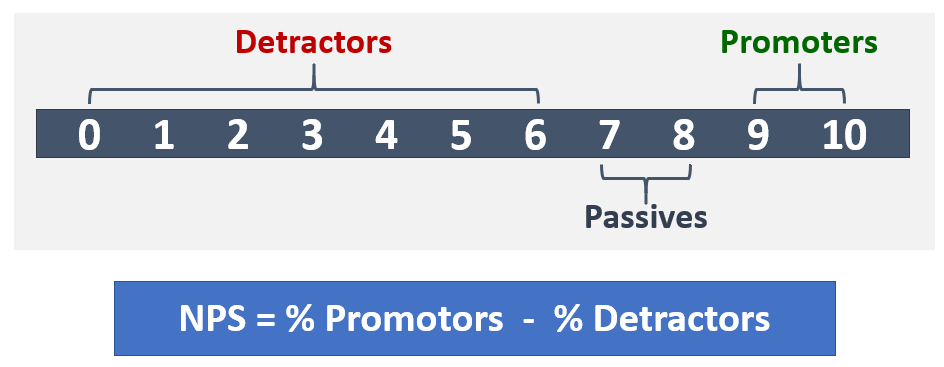

# Operar meu serviçoOperate my service

Este artigo fornece uma visão geral dos requisitos de operando com êxito os serviços de voz de nuvem para sua organização.This article gives an overview of the requirements for successfully operating cloud voice services for your organization. Por operando corretamente seus serviços de voz de nuvem, você pode ser se que você estiver fornecendo uma experiência de alta qualidade, confiável para sua organização.By properly operating your cloud voice services, you can be sure you’re providing a high-quality, reliable experience for your organization.

## Introdução ao Guia de OperaçõesIntroduction to the Operations Guide

Guia de operações oferece uma visão geral de todas as tarefas e atividades necessárias como parte da função de gerenciamento de serviço for Microsoft Teams.The Operations Guide gives you an overview of all the tasks and activities required as part of the service management function for Microsoft Teams.

O gerenciamento do serviço é um tema amplo, que abrange as operações do serviço Microsoft Teams no dia a dia depois que ele é implantado e habilitado para os usuários.Service management is a broad topic that covers day-to-day operations of the Microsoft Teams service after it has been deployed and enabled for users. O serviço Microsoft Teams abrange o Microsoft Office 365 e os componentes de infraestrutura implantados localmente (por exemplo, a rede).The Teams service encompasses Microsoft Office 365 and the infrastructure components that are deployed on-premises (for example, networking).

É provável que a noção de gerenciamento do serviço não seja um conceito novo para a maioria das organizações.The notion of service management is most likely not a new concept for most organizations. Você talvez já implementou processos e as tarefas associadas com serviços existentes.You might have already implemented processes and tasks that are associated with existing services. Além disso, você provavelmente pode incrementar seus processos atuais quando você planejar gerenciamento de serviço de hoje a equipes de suporte no futuro.That said, you can probably augment your current processes when you plan for service management today to support Teams in the future.

Gerenciamento de serviço abrange todas as atividades e processos envolvidos na Gerenciando as equipes de ponta a ponta.Service management encompasses all the activities and processes involved in managing Teams end to end. Conforme observado anteriormente, alguns componentes do gerenciamento de serviços — a infraestrutura que compõe o próprio serviço Office 365 — são responsabilidade da Microsoft, enquanto você, o cliente, é responsáveis aos usuários sobre como gerenciar os vários aspectos da rede, equipes e pontos de extremidade que você fornecer.As noted earlier, some components of service management—the infrastructure that the Office 365 service itself comprises—are Microsoft’s responsibility, whereas you, the customer, are accountable to your users to manage the various aspects of Teams, the network, and endpoints you provide.

As tarefas e atividades neste guia são agrupadas em oito categorias, conforme ilustrado no diagrama a seguir.The tasks and activities in this guide are grouped into eight categories as depicted in the following diagram. Cada uma dessas categorias será expandida após nas seções a seguir.Each of these categories will be expanded upon in the following sections.

Diagrama de ![uma ilustrando uma lista de categorias de tarefas e atividades de gerenciamento de serviço para equipes compreende. O diagrama também mostra que o gerenciamento de serviço é basicamente uma tarefa do cliente.] Diagrama de (media/operate-my-service-image1.png "uma ilustrando uma lista de categorias de tarefas e atividades de gerenciamento de serviço para equipes compreende. O diagrama também mostra que o gerenciamento de serviço é basicamente uma tarefa do cliente.")

<table>
<tr><td>  Pontos de decisãoDecision points</td><td><ul><li>Decida como as operações serão implementadas para equipes.Decide how operations will be implemented for Teams.</li></ul></td></tr>
<tr><td> Próximas etapasNext steps</td><td><ul><li>Revise o guia de operações por completo.Review the Operations Guide in full.</li><li>Implemente uma estratégia de operações que se alinha com as metas da sua organização para oferecer a qualidade e a confiabilidade da nuvem cargas de trabalho de voz.Implement an operations strategy that aligns with your organization’s goals to deliver the quality and reliability of cloud voice workloads.</li><li>Examine a qualidade da experiência Revise o guia.Review the Quality of Experience Review Guide.</li><li> Implemente uma estratégia de operações para executar regularmente a qualidade da experiência revisões para certificar-se de que sua implantação de voz de nuvem está operando em seus recursos de pico.Implement an operations strategy to regularly perform Quality of Experience Reviews to make sure your cloud voice deployment is operating at its peak capabilities.</li></ul></td></tr>
</table>

### Mapeamento de funções operacionaisOperational role mapping

O planejamento que você executou para operações durante a fase de Envision é fundamental, porque as atividades de operações começam quando os usuários piloto primeiro estão habilitados.The planning you undertook for operations during the Envision phase is critical, because operations activities begin when the first pilot users are enabled. Este guia lista as atividades e as tarefas que devem ser executadas em uma base diária, semanal, mensal ou conforme necessário para manter uma implantação de equipes de alta qualidade.This guide lists the activities and tasks that must be performed on a daily, weekly, monthly, or as-needed basis to maintain a high-quality Teams deployment. Este guia fornece conhecimento e orientação sobre como realizar essas tarefas e atividades essenciais.This guide provides knowledge and guidance for how to perform these critical activities and tasks.

Certifique-se de que o planejamento que você faça logo no início da fase Envision inclui determinar quem será responsável pela execução de atividades específicas é um componente essencial de uma implantação bem-sucedida.One crucial component of a successful deployment is to ensure that the planning you do early in the Envision phase includes determining who will be responsible for performing specific activities. Depois que você calculou que tarefas e atividades que se aplicam à sua implantação, elas precisam ser compreendidos e seguido de grupos ou indivíduos que podem ser atribuídos a eles.After you’ve figured out which tasks and activities apply to your deployment, they need to be understood and followed by the groups or individuals that you assign to them.

Cada equipe que você identificar deve revisar e concordam com as tarefas e responsabilidades identificadas e iniciar a preparação.Each team you identify must review and agree on the tasks and responsibilities identified and start preparation. Isso pode incluir o treinamento e preparação, fornecendo atualizações para o plano de pessoal ou garantindo que provedores externos estão prontos para entregar.This might include training and readiness, providing updates to the staffing plan, or ensuring that external providers are ready to deliver.

As atividades e funções definidas neste guia devem ser válidas na maioria dos cenários, mas todas as implantações de equipes é exclusiva; Portanto, você pode usar este guia como ponto de partida para personalizar as atividades e funções de padrão para atender às suas necessidades.The activities and roles defined in this guide should be valid in most scenarios, but every Teams deployment is unique; therefore, you can use this guide as a starting point to customize the activities and default roles to meet your needs.

Certifique-se de que cada equipe responsável tem um bom entendimento das atividades que são necessários para executar o serviço.Ensure that each accountable team has a good understanding of the activities that are required to run the service. É essencial que cada equipe aceita e aprova em sua responsabilidade em sua organização antes de inicia o primeiro piloto.It’s critical that each team accepts and signs off on their accountability in your organization before the first pilot begins.

Depois de um contrato é estabelecido, as equipes correspondentes deverá começar tornem operacional suas funções.After an agreement is in place, the corresponding teams should start to operationalize their roles.

<table>
<tr><td> Próximas etapasNext steps</td>
<td><ul><li>Use este documento para facilitar o exercício de mapeamento de função operacionais.Use this document to facilitate the operational role mapping exercise.</li><li>Se encontrar com as equipes de suporte respectivos para atribuir nomes a cada item na lista de atividades necessárias.Meet with the respective support teams to assign names to each item in the list of required activities.</li><li>Obter a aceitação ou aprovação nas funções atribuídas.Gain acceptance or sign-off on the assigned roles.</li><li>Certifique-se de que as equipes correspondentes tenham o treinamento adequado, preparação e recursos para concluir as atividades necessárias deles.Ensure that the corresponding teams have the appropriate training, readiness, and resources to complete the activities required of them.</li></ul></td></table>

### Dependências de serviços de equipesTeams service dependencies

Microsoft Teams reúne tecnologias across Office 365 para fornecer um hub de trabalho em equipe.Microsoft Teams brings together technologies across Office 365 to provide a hub for teamwork. Exemplos incluem:Examples include:

-   Azure Active Directory (AD Azure) fornece serviços de autenticação e autorização para equipes.Azure Active Directory (Azure AD) provides authentication and authorization services for Teams.

-   O Exchange Online oferece recursos avançados, como o estado de retenção legal e descoberta eletrônica.Exchange Online provides advanced features like legal hold and e-discovery.

-   SharePoint Online oferece a capacidade de compartilhar arquivos em canais e OneDrive for Business oferece um mecanismo para o compartilhamento de arquivos dentro de um bate-papo privado.SharePoint Online provides the ability to share files in channels, and OneDrive for Business provides a mechanism for sharing files within a private chat.

As organizações também podem aproveitar os investimentos existentes na infraestrutura local.Organizations can also leverage existing investments in on-premises infrastructure. Por exemplo, contas existentes de Active Directory local podem ser usadas para autenticação aproveitando Connect do Azure AD.For example, existing on-premises Active Directory accounts can be used for authentication by leveraging Azure AD Connect. Determinadas versões do Exchange Server podem ser usados no lugar do Exchange Online.Certain versions of Exchange Server can be used in place of Exchange Online.

Essas tecnologias se unem para oferecer um pacote de comunicações inteligente rica e colaboração para os usuários.These technologies come together to provide a rich, collaborative, and intelligent communications suite for users. Essa integração conjunta é dos principais benefícios de equipes, mas ele também conduz um requisito para gerenciamento de serviço entre essas tecnologias.This tight integration is a key benefit of Teams, but it also drives a requirement for service management across these technologies.

Este guia abrange as principais áreas de foco para gerenciar o serviço de equipes.This guide covers the key areas of focus to manage the Teams service. Provavelmente, você tem planos de gerenciamento de serviço em vigor para as tecnologias de suporte que depende de equipes.Most likely, you have service management plans in place for the supporting technologies that Teams depends on. Se não, você precisará estabelecer planos de gerenciamento de serviços adequado para esses componentes da tecnologia (tanto no local e online) também.If not, you’ll need to establish proper service management plans for those technology components (both on-premises and online) as well. Isso ajudará a garantir que seus usuários tenham uma experiência de alta qualidade, confiável com equipes.This will help ensure your users enjoy a high-quality, reliable experience with Teams.

#### ReferênciasReferences 

[Visão geral do Microsoft TeamsOverview of Microsoft Teams](teams-overview.md)

[Como o Exchange e o Microsoft Teams interagemHow Exchange and Microsoft Teams interact](exchange-teams-interact.md)

[Como o SharePoint Online e o OneDrive for Business interagem com o Microsoft TeamsHow SharePoint Online and OneDrive for Business interact with Microsoft Teams](sharepoint-onedrive-interact.md)

[Microsoft Teams e Skype para interoperabilidade e coexistência de negóciosMicrosoft Teams and Skype for Business coexistence and interoperability](teams-and-skypeforbusiness-coexistence-and-interoperability.md)

<!--ENDOFSECTION-->

## Atividades do guia de operaçõesOperations Guide activities

As próximas seções fornecem uma visão geral das atividades que são necessários para operar com êxito o serviço de Teams da Microsoft.The following sections give an overview of the activities that are required to successfully operate the Microsoft Teams service. Eles incluem referência às ferramentas, informações contextuais e conteúdo adicional para ajudá-lo a entender a atividade e para auxiliar iniciativas de preparação.They include reference to tools, contextual information, and additional content to help you understand the activity and to assist in readiness initiatives.

<!--ENDOFSECTION-->

## Monitorar a integridade de serviçoMonitor service health

É importante que você entenda a integridade geral do serviço Teams da Microsoft para que você proativamente alertando outras pessoas em sua organização de qualquer evento que afeta o serviço.It’s important that you understand the overall health of the Microsoft Teams service so that you can proactively alert others in your organization of any event that affects the service. Conforme descrito anteriormente, equipes é dependente a outros serviços do Office 365, como o Azure Active Directory, o Exchange Online, SharePoint Online e OneDrive for Business.As described earlier, Teams is dependent on other Office 365 services such as Azure Active Directory, Exchange Online, SharePoint Online, and OneDrive for Business. Por isso, é igualmente importante monitorar a integridade dos serviços dependentes.Because of this, it’s equally important that you monitor the health of the dependent services.

Incorpore esta atividade ao seu processo de gerenciamento de incidentes para proativamente informar aos usuários, a assistência técnica e suas equipes de operações para se preparar para lidar com escalonamentos de usuário.Incorporate this activity into your incident management process to proactively inform users, the helpdesk, and your operations teams to prepare to handle user escalations.

As seções a seguir descrevem as ferramentas que você pode aproveitar para monitorar a [incidentes de serviço](https://technet.microsoft.com/library/office-365-service-health.aspx#Anchor_1) que afetam o serviço de equipes.The following sections describe the tools that you can leverage to monitor for [service incidents](https://technet.microsoft.com/library/office-365-service-health.aspx#Anchor_1) that affect the Teams service. Um resumo dos benefícios do cada ferramenta e, quando você deve usar cada uma delas é incluído na tabela a seguir.A summary of the benefits of each tool, and when you should use each one is included in the following table.

| Ferramenta de monitoramentoMonitoring Tool                       | BenefíciosBenefits                                            | Quando usarWhen to use                                                                                  |
|---------------------------------------|-----------------------------------------------------|----------------------------------------------------------------------------------------------|
| Portal do Office 365Office 365 portal                     | Disponível a partir de qualquer dispositivo com um navegador com suporte.Available from any device with a supported browser. | Use quando você não precisa notificações em tempo real.Use when you don’t need real-time notifications.                                          |
| Aplicativo de administração do Office 365Office 365 Admin app                  | Fornece notificações de push para seu dispositivo móvel.Provides push notifications to your mobile device.  | Use quando você precisa ser notificado dos incidentes de serviço enquanto você estiver em trânsito.Use when you need to be notified of service incidents while you’re on the go.                  |
| Microsoft System CenterMicrosoft System Center               | Integração com o Microsoft System Center.Integration with Microsoft System Center.           | Usar quando for necessário recursos avançados de monitoramento e suporte de notificação.Use when you need advanced monitoring capabilities and notification support.                       |
| Comunicações de serviço do Office 365 APIOffice 365 Service Communications API | Acesso programático a integridade do serviço Office 365.Programmatic access to Office 365 service health.   | Use quando precisar integração com uma ferramenta de monitoramento de terceiros ou deseja compilar sua própria solução.Use when you need integration with a third-party monitoring tool or want to build your own solution. |

> [!NOTE]
> Apenas pessoas que são atribuídas à função de **administrador global** ou **administrador de serviço** podem exibir a integridade do serviço.Only individuals who are assigned the **global admin** or **service administrator** role can view service health.

### Monitorando com o portal do Office 365Monitoring with the Office 365 portal

O [portal do Office 365](https://portal.office.com/) fornece um [Painel de integridade do serviço](https://portal.office.com/adminportal/home#/servicehealth) onde você pode exibir o estado atual do serviço equipes além serviços dependentes.The [Office 365 portal](https://portal.office.com/) provides a [Service Health dashboard](https://portal.office.com/adminportal/home#/servicehealth) where you can view the current health of the Teams service in addition to dependent services.

### Monitorando com o aplicativo móvelMonitoring with the mobile app

O aplicativo de administração do Office 365 está disponível no Apple iOS, Android e Windows (PC e celular).The Office 365 Admin app is available on Apple iOS, Android, and Windows (PC and mobile). O aplicativo fornece informações sobre futuras alterações e de integridade do serviço de administradores de serviço.The app provides service administrators information about service health and upcoming changes. O aplicativo dá suporte a notificações de push alertando você quase imediatamente após um comunicado ter sido enviado.The app supports push notifications that can alert you almost immediately after an advisory has been posted. Isso ajuda a manter-se atualizado sobre o status, integridade e qualquer futuras alterações ao serviço.This helps you stay current on the status, health, and any upcoming changes to the service. O suporte de notificação torna a ferramenta de monitoramento recomendada para administradores.The notification support makes it the recommended monitoring tool for administrators. Para obter mais informações, consulte:For more information, see:

[O Office 365 Admin Mobile AppOffice 365 Admin Mobile App](https://support.office.com/article/Office-365-Admin-Mobile-App-e16f6421-2a1a-4142-bf9d-9846600a060a)

[Baixe o aplicativo de administração móvel do Office 365Download the Office 365 Admin Mobile App](https://products.office.com/business/manage-office-365-admin-app)

### Monitorando com o Microsoft System CenterMonitoring with Microsoft System Center

Microsoft System Center é uma plataforma de gerenciamento integrado que ajuda você a gerenciar datacenter, dispositivos cliente e híbrido em nuvem ambientes de TI.Microsoft System Center is an integrated management platform that helps you manage datacenter, client devices, and hybrid cloud IT environments. Os administradores do Office 365 que usam o System Center agora tem a opção de importar o pacote de gerenciamento do Office 365, que permite que eles vejam todas as comunicações de serviço no Operations Manager no System Center.Office 365 administrators who use System Center now have the option to import the Office 365 Management Pack, which enables them to view all service communications within Operations Manager in System Center. Usando essa ferramenta fornece acesso ao status de seus serviços inscritos, serviço ativas e resolvidas incidentes e suas comunicações do Centro de mensagens (futuras alterações).Using this tool gives you access to the status of your subscribed services, active and resolved service incidents, and your Message Center communications (upcoming changes). Para obter mais informações, consulte o seguinte [postagem de blog](https://blogs.office.com/2014/07/29/new-office-365-admin-tools/?eu=true).For more information, refer to the following [blog post](https://blogs.office.com/2014/07/29/new-office-365-admin-tools/?eu=true).

Se você aproveitar o System Center para monitorar a integridade de serviço de equipes (e serviços dependentes), você pode personalizar o pacote de gerenciamento para alertar ou notificar grupos específicos ou indivíduos que foram identificados reagir a incidentes.If you leverage System Center to monitor Teams service health (and dependent services), you can further customize the management pack to alert or notify specific groups or individuals who have been identified to react to incidents.
Esses grupos podem incluir os proprietários de serviços, los, grupos de suporte de segundo nível e de terceiro nível e os gerentes de incidentes em sua organização.These groups can include service owners, helpdesks, second-level and third-level support groups, and incident managers in your organization.

### Monitoramento para cenários avançadosMonitoring for advanced scenarios

Você pode monitorar a integridade do serviço e futuras alterações aproveitando a API de comunicações do Office 365 Service para acessar as alterações e a integridade do serviço Office 365 programaticamente.You can monitor service health and upcoming changes by leveraging the Office 365 Service Communications API to access Office 365 service health and changes programmatically. Use essa API para criar seu próprio monitoring ferramenta ou conecte suas ferramentas de monitoramento existentes para as comunicações de serviço do Office 365, simplificando potencialmente como monitorar o seu ambiente.Use this API to create your own monitoring tool, or connect your existing monitoring tools to Office 365 service communications, potentially simplifying how you monitor your environment. Para obter mais informações, consulte [Office 365 para desenvolvedores do Enterprise](https://developer.microsoft.com/office).For more information, see [Office 365 for Enterprise developers](https://developer.microsoft.com/office).

### Tarefas diariamente/semanalmente/mensal/conforme necessárioDaily/weekly/monthly/as-needed tasks

| AtividadeActivity               | DescriçãoDescription                                                                                                                                                                                                               | CadênciaCadence   | Equipe atribuídoTeam assigned |
|------------------------|---------------------------------------------------------------------------------------------------------------------------------------------------------------------------------------------------------------------------|-----------|---------------|
| Monitorar a integridade de serviçoMonitor service health | Monitore proativamente a integridade do serviço Microsoft Teams (e serviços dependentes) usando as ferramentas disponíveis.Proactively monitor Microsoft Teams service health, (and dependent services) by using the tools available. Incluem serviços dependentes: OneDrive do Exchange Online, SharePoint Online para empresas, Azure Active Directory.Dependent services include: Exchange Online, SharePoint Online, OneDrive for Business, Azure Active Directory. | Em tempo realReal-time |               |
| Notificação de incidentesIncident notification  | Notifica os participantes internos de eventos que afetam o serviço de equipes.Notify internal stakeholders of events that affect the Teams service. Participantes internos podem incluir usuários, los e gerentes de incidentes.Internal stakeholders can include users, helpdesks, and incident managers.                                                                          | Conforme necessárioAs needed |               |

### ReferênciasReferences 

[Como verificar a integridade do serviço Office 365How to check Office 365 service health](https://support.office.com/article/How-to-check-Office-365-service-health-932AD3AD-533C-418A-B938-6E44E8BC33B0)

[Verificar a integridade do serviço do Microsoft TeamsVerify service health for Microsoft Teams](service-health.md)

[Continuidade e a integridade do serviçoService Health and Continuity](https://technet.microsoft.com/library/office-365-service-health.aspx)

<!--ENDOFSECTION-->

## Gerenciamento de mudanças organizacionaisManage organizational change

Microsoft Teams é um serviço baseado em nuvem.Microsoft Teams is a cloud-based service. Com o que vem a capacidade de oferecer novos recursos e funcionalidades em um ritmo acelerado.With that comes the ability to provide new features and functionality at a rapid pace. Fornecer inovações contínuas proporciona uma vantagem óbvia para as organizações, mas essas alterações precisam ser gerenciados de forma adequada dentro da sua organização para evitar resistência dos usuários ou escalonamentos para a assistência técnica.Delivering ongoing innovation provides an obvious benefit to organizations, but these changes need to be managed appropriately within your organization to avoid user resistance or escalations to your helpdesk.

Atualizações para equipes são distribuídas automaticamente para seus usuários.Updates to Teams are rolled out automatically to your users. Os usuários sempre terão o cliente e os recursos disponíveis no serviço de equipes a mais recente.Your users will always have the latest client and features available in the Teams service. Não é possível gerenciar a distribuição das atualizações de equipes para seus usuários, portanto é extremamente importante gerenciar a alteração através de programas de comunicação, treinamento e adoção efetivas.It’s not possible to manage the rollout of Teams updates to your users, therefore it’s critically important to manage change through effective communication, training, and adoption programs. Se os usuários estão cientes da alteração, instruídos sobre os benefícios e autonomia para aproveitar os novos recursos&mdash;eles serão capazes de se adaptar mais rapidamente e a alteração de boas-vindas.If your users are aware of the change, educated about the benefits, and empowered to leverage the new capabilities&mdash;they’ll be able to adapt more quickly and welcome the change.

### Monitoramento da alteraçãoMonitoring for change

A primeira etapa no gerenciamento de alterações está monitorando as alterações que estão planejadas para equipes.The first step in change management is monitoring the changes that are planned for Teams. A melhor fonte para essas alterações de monitoramento é o [Mapa do Office 365](https://products.office.com/business/office-365-roadmap), que lista os recursos que estão atualmente em desenvolvimento, sendo distribuído aos clientes, ou totalmente tenham sido iniciados.The best source for monitoring these changes is the [Office 365 Roadmap](https://products.office.com/business/office-365-roadmap), which lists features that are currently in development, being rolled out to customers, or have fully launched. Você pode pesquisar recursos específicos de equipes, usando o filtro fornecido ou você pode baixar o mapa para um arquivo do Excel para análise adicional.You can search for Teams-specific features by using the filter provided, or you can download the roadmap to an Excel file for further analysis. Para cada recurso, o mapa dá uma breve descrição, juntamente com a data de lançamento previstas.For each feature, the roadmap gives a short description, along with the anticipated release date.

No [blog de equipes da Microsoft](https://techcommunity.microsoft.com/t5/Microsoft-Teams-Blog/bg-p/MicrosoftTeamsBlog), pode aprender sobre práticas recomendadas, tendências e notícias sobre atualizações de produto de equipes.In the [Microsoft Teams blog](https://techcommunity.microsoft.com/t5/Microsoft-Teams-Blog/bg-p/MicrosoftTeamsBlog), you can learn about best practices, trends, and news about Teams product updates. Espere localizar as atualizações dos principais recursos para equipes a ser anunciado aqui.Expect to find major feature updates to Teams to be announced here. Você também pode assinar o blog por meio de um RSS feed.You can also subscribe to the blog through an RSS feed. Em seguida, você pode adicionar [o RSS feed](https://techcommunity.microsoft.com/gxcuf89792/rss/board?board.id=MicrosoftTeamsBlog) diretamente em um canal de equipes, para que todas as notícias importantes é entregue diretamente dentro de equipes.You can then add [the RSS feed](https://techcommunity.microsoft.com/gxcuf89792/rss/board?board.id=MicrosoftTeamsBlog) directly into a Teams channel, so all the important news is delivered directly inside of Teams.

Todos os recursos que são lançados estão documentados nas [Notas de versão para equipes da Microsoft](https://support.office.com/article/Release-notes-for-Microsoft-Teams-d7092a6d-c896-424c-b362-a472d5f105de).All features that are released are documented in the [Release Notes for Microsoft Teams](https://support.office.com/article/Release-notes-for-Microsoft-Teams-d7092a6d-c896-424c-b362-a472d5f105de).
Aqui, você encontrará uma lista dos recursos que foram lançadas para desktop, web e dispositivos móveis.Here you’ll find a list of features that were released for desktop, web, and mobile devices. O mesmo conjunto de notas de versão também estão disponíveis na guia **What's new** na [Ajuda](get-help-in-microsoft-teams.md).The same set of release notes are also available on the **What's new** tab in [Help](get-help-in-microsoft-teams.md).

Familiarize-se com os recursos disponíveis e certifique-se de que você atribua proprietários aplicáveis para o monitoramento de alteração.Become familiar with the resources available and ensure that you assign applicable owners to monitor for change.

### Planejamento de alteraçõesPlanning for change

Agora que você esteja ciente das futuras alterações para o serviço de equipes, a próxima etapa é preparar e planeje apropriadamente.Now that you’re aware of upcoming changes to the Teams service, the next step is to prepare and plan accordingly. Avalie a cada alteração para determinar quais alterações exigem a comunicação com usuários, campanhas de divulgação, treinamento para equipes de suporte ou usuários ou campanhas de avaliação e adoção do recurso.Assess each change to determine which changes require communication to users, awareness campaigns, training for support teams or users, or feature evaluation and adoption campaigns. Essa é a função principal de uma equipe de gerenciamento de alteração em sua organização.This is the primary role of a change management team in your organization. A seguir, é uma coleção de tabelas que podem ajudá-lo a planejar as mudanças de amostra.Below is a collection of sample tables that can help you plan for change.

#### Recurso: Gravação na nuvem (data de lançamento: janeiro de 2018)Feature: Cloud Recording (Release date: January 2018)

**Acompanhar geral****General track**

| Preparação de alteraçãoChange readiness | StatusStatus   | Notas/próximas etapasNotes/next steps | ProprietárioOwner |
|----|----|----|-----|
| Revisão legalLegal review   | ConcluídoCompleted     | Esse recurso é um pré-requisito para a equipe de treinamento de inclusão.This feature is a prerequisite to onboarding the training team. | Equipe de projetoProject team  |

**Gerenciamento de alteração técnica****Technical change management**

|       Preparação de alteraçãoChange readiness       | StatusStatus |                      Notas/próximas etapasNotes/next steps                      |    ProprietárioOwner     |
|------------------------------|--------|------------------------------------------------------------|--------------|
|     Alterações IT necessáriasIT changes required      |  SimYes   | Administrador precisa habilitar gravação identificados apenas para usuários.Admin needs to enable recording for identified users only. | Equipe de suporteSupport team |
| Prontidão técnica completaTechnical readiness complete |  SimYes   |                                                            | Equipe de suporteSupport team |
|                              |        |                                                            |              |

**Gerenciamento de alterações do usuário****User change management** 

| Preparação de alteraçãoChange readiness | StatusStatus   | Notas/próximas etapasNotes/next steps | ProprietárioOwner |
|----|----|----|-----|
| Impacto do usuárioUser impact                  | BaixoLow                  |                                                                 |                        |
| Preparação do usuário necessáriaUser readiness required      | SimYes                  |                                                                 |                        |
| Comunicações prontasCommunications ready         | NãoNo                   | Email de comunicação foram escreveu — pendentes para revisão.Communication email has been drafted—pending review.            | Equipe de comunicaçõesCommunications Team    |
| Treinamento prontoTraining ready               | SimYes                  | Treinamento irá alavancar o vídeo da Microsoft existente.Training will leverage existing Microsoft video.                | Equipe de treinamentoTraining Team          |

**Faixa de status****Status track**

| Preparação de alteraçãoChange readiness | StatusStatus   | Notas/próximas etapasNotes/next steps | ProprietárioOwner |
|----|----|----|-----|
| Status de lançamentoRelease status               | em andamentoin progress          | Revisão pendente por patrocinador executivo.Pending review by executive sponsor.               | Equipe de gerenciamento de alteraçõesChange Management Team |
| Aprovação da versãoRelease sign-off             |                      |                                                                 |                        |
| Data de lançamentoRelease date                 |                      |                                                                 |                        |

Para obter mais informações sobre o planejamento de gerenciamento de alteração com equipes, consulte [criar uma estratégia de gerenciamento de alteração para equipes da Microsoft](change-management-strategy.md).For more information about planning for change management with Teams, see [Create a change management strategy for Microsoft Teams](change-management-strategy.md).

### Tarefas diariamente/semanalmente/mensal/conforme necessárioDaily/weekly/monthly/as-needed tasks

| AtividadeActivity               | DescriçãoDescription                                                                                                                                                                                                                | CadênciaCadence   | Equipe atribuídoTeam assigned |
|------------------------|----------------------------------------------------------------------------------------------------------------------------------------------------------------------------------------------------------------------------|-----------|---------------|
| Monitor da alteraçãoMonitor for change     | Monitorar a existência de futuras alterações ao serviço Teams da Microsoft.Monitor for upcoming changes to Microsoft Teams service.                                                                                                                                                                   | DiárioDaily     |               |
| Planejamento de alteraçõesPlanning for change    | Avaliar e planejar a novos recursos e capacidades, incluindo planos de comunicação, campanhas de divulgação e treinamento.Evaluate and plan for new features and capabilities, including communication plans, awareness campaigns, and training.                                                                                                     | Conforme necessárioAs needed |               |
| Preparação do usuárioUser readiness             | Execute a comunicação direcionada, divulgação ou campanhas de treinamento para garantir que os usuários estão prontos para as futuras alterações.Perform targeted communication, awareness, or training campaigns to ensure users are ready for the upcoming change.                                                                                                        | Conforme necessárioAs needed |               |
| Preparação da equipe de suporteSupport team readiness | Execute a comunicação direcionada, divulgação ou campanhas de treinamento para garantir que a equipe de suporte está pronta.Perform targeted communication, awareness, or training campaigns to ensure the support team is ready. Equipes de suporte podem incluir a equipe "luva branco", los, camada 2 ou camada 3 suporte, parceiros externos e assim por diante.Support teams can include the “white glove” team, helpdesks, Tier 2 or Tier 3 support, external partners, and so on. | Conforme necessárioAs needed |               |

<!--ENDOFSECTION-->

## Avaliar o uso de equipesAssess Teams usage

Depois que o piloto inicial começa, é essencial para estabelecer uma cadência regular para medir o uso de equipes real.After the initial pilot begins, it’s critical to establish a regular cadence for measuring actual Teams usage. Isso permite que sua organização para obter ideias para uso como real se alinha com o uso previstos por você durante a fase de Envision.This enables your organization to gain insights into how actual usage aligns with the usage you predicted during the Envision phase. Embora esta seção foca no uso de equipes, isso deve ser parte de um esforço amplo para medir e avaliar o uso do Office 365 geral.Although this section focuses on Teams usage, this should be part of a broader effort to measure and assess Office 365 usage overall.

Analisar o uso com frequência no início na implantação oferece a oportunidade de:Reviewing usage frequently early in the deployment gives you the opportunity to:

-   Valide se os usuários estiverem usando equipes.Validate whether users are using Teams.

-   Identifique os desafios de adoção potenciais antes que eles criam problemas críticos em toda a organização.Identify potential adoption challenges before they create critical issues across the organization.

-   Compreenda se há discrepâncias entre os requisitos de fase do Envision e o uso real.Understand whether there are discrepancies between the Envision phase requirements and actual usage.

Se o uso não for o que você espera, isso poderia ser devido a um problema de implantação ou o plano de adoção não está sendo executado corretamente ou outro problema.If usage isn’t what you expect, this could be due to a deployment issue, or the adoption plan isn’t being executed properly, or some other problem. Dependendo do motivo real por trás de pouco uso, o administrador do serviço deve colaborar com as equipes relacionadas para ajudar a remover as barreiras de uso.Depending on the actual reason behind the low usage, the service administrator must collaborate with the related teams to help remove usage barriers.

### Medindo o uso com o Centro de administração do Office 365Measuring usage with the Office 365 admin center

Dados de uso de equipes estão disponíveis no painel do relatório.Usage data from Teams is available in the Reporting dashboard. Dados de uso de equipes podem ser encontrados em três relatórios diferentes.Teams usage data can be found in three different reports. O primeiro relatório fornece um modo de exibição entre produtos de como os usuários se comuniquem e colaborem com os vários serviços no Office 365.The first report provides a cross-product view of how users communicate and collaborate by using the various services in Office 365. Este relatório pode ser encontrado aqui: [relatório de usuários ativos do Office 365](https://support.office.com/article/Office-365-Reports-in-the-Admin-Center-Active-Users-FC1CF1D0-CD84-43FD-ADB7-A4C4DFA8112D)This report can be found here: [Office 365 active users report](https://support.office.com/article/Office-365-Reports-in-the-Admin-Center-Active-Users-FC1CF1D0-CD84-43FD-ADB7-A4C4DFA8112D)

Os dois relatórios são específicos de equipes e eles fornecem mais detalhes sobre o uso de equipes de uma perspectiva de dispositivo e de usuário.The other two reports are Teams-specific, and they provide further detail about Teams usage from a user and device perspective. Ambos os relatórios podem ser encontrados aqui:Both reports can be found here:

[Relatório de uso de dispositivos do Microsoft TeamsMicrosoft Teams device usage report](https://support.office.com/article/Office-365-Reports-in-the-Admin-Center-Microsoft-Teams-device-usage-917b3e1d-203e-4439-8539-634e80196687)

[Relatório de atividades do usuário do Microsoft TeamsMicrosoft Teams user activity report](https://support.office.com/article/Office-365-Reports-in-the-Admin-Center-Microsoft-Teams-user-activity-07f67fc4-c0a4-4d3f-ad20-f40c7f6db524)

#### Permissões necessáriasRequired permissions

Os relatórios de uso no Centro de administração podem ser acessados por pessoas que tiverem sido atribuídas a uma função de **Administrador Global** ou uma função de administrador de produtos específicos (**administrador do Exchange**, **Skype do administrador de negócios**, **do SharePoint administrador**).The usage reports in the admin center can be accessed by people who have been assigned a **Global administrator** role, or a product-specific admin role (**Exchange administrator**, **Skype for Business administrator**, **SharePoint administrator**).

Além disso, a função de **leitor de relatórios** está disponível para usuários que exigem o acesso aos relatórios, mas não realiza tarefas que exijam permissões de nível de administrador.In addition, the **Reports reader** role is available for users who require access to the reports, but don’t perform any tasks that require administrator-level permissions. Você atribuir esta função para fornecer relatórios de uso para qualquer pessoa que é das partes interessadas, para monitorar e impulsionar a adoção.You assign this role to provide usage reports to anyone who is a stakeholder, to monitor and drive adoption. Para obter mais informações sobre as diferentes funções disponíveis, consulte [funções de administrador do Office 365](https://support.office.com/article/About-Office-365-admin-roles-da585eea-f576-4f55-a1e0-87090b6aaa9d).For more information about the different roles available, see [About Office 365 admin roles](https://support.office.com/article/About-Office-365-admin-roles-da585eea-f576-4f55-a1e0-87090b6aaa9d).

### Avaliando o usoAssessing usage

Depois de usar o painel de relatórios para medir o uso, é importante comparar o uso medido contra quaisquer indicadores de sucesso fundamental (KSIs) que você definiu durante a fase de Envision do projeto.After you’ve used the Reporting dashboard to measure usage, it’s important to compare the measured usage against any key success indicators (KSIs) that you defined during the project’s Envision phase. Você pode definir um KSI que pode ser definido como uso ativo, ou um que está vinculada indiretamente para uso ativo.You can define a KSI that might be defined as active usage, or one that’s indirectly linked to active usage.

É importante identificar quaisquer variações entre uso real e planejado antes de continuar a distribuição para outros sites ou usuários.It’s important to identify any variances between actual and planned usage before resuming the rollout to additional sites or users. Provavelmente você vai identificar lições organizacionais como parte dessa atividade que você pode aproveitar para garantir que o próximo lote de sites ou usuários não encontra os mesmos problemas.You’ll likely identify organizational learnings as part of this activity that you can leverage to ensure that the next batch of sites or users don’t encounter the same issues.

Primeiro, identifique se este é um problema técnico ou no adoção.First, pinpoint whether this is an adoption or technical problem. Comece investigando os itens abaixo, em ordem, para determinar onde está o problema.Begin by investigating the items below, in order, to determine where the problem is.

1.  Valide a qualidade, executando uma [Análise de qualidade da experiência](#quality-of-experience-review-guide).Validate quality by performing a [Quality of Experience Review](#quality-of-experience-review-guide).

2.  Trabalhar com a equipe de assistência técnica para verificar que não existem problemas técnicos tendências impedindo que os usuários acessando ou usando o serviço.Work with the helpdesk team to check that there are no trending technical issues preventing users from accessing or using the service. Se as tendências de problema existir, use a seção [solução de problemas do ponto de extremidade](#endpoint-troubleshooting) mais adiante neste artigo para tentar resolver o problema antes de contratar suporte.If issue trends do exist, use the [endpoint troubleshooting](#endpoint-troubleshooting) section later in this article to try to solve the problem before engaging support.

3.  Trabalhar com a equipe de adoção e treinamento para obter feedback direto de usuários (consulte [Assess sentimento de usuário](#assess-user-sentiment) neste artigo) e para verificar a eficácia das atividades de divulgação e adoção.Work with the training and adoption team to gather direct feedback from users (see [Assess user sentiment](#assess-user-sentiment) later in this article), and to check the effectiveness of awareness and adoption activities.

### Tarefas diariamente/semanalmente/mensal/conforme necessárioDaily/weekly/monthly/as-needed tasks

| AtividadeActivity                         | DescriçãoDescription                                                                                                                      | CadênciaCadence   | Equipe atribuídoTeam assigned |
|----------------------------------|----------------------------------------------------------------------------------------------------------------------------------|-----------|---------------|
| Uso de medida (fase de habilitação)Measure usage (enablement phase) | Medir e avaliar o uso de equipes, como sites continuam a ser onboarded durante a fase de habilitação.Measure and assess Teams usage as sites continue to be onboarded during the enablement phase. Solucionar problemas de uso conforme necessário.Address usage issues as required. | SemanalWeekly    |               |
| Uso de medidaMeasure usage                    | Medir e avaliar o uso de equipes na fase de unidade de valor (após a conclusão da implantação).Measure and assess Teams usage in the Drive Value phase (after deployment has been completed). Solucionar problemas de uso conforme necessário.Address usage issues as required. | DuasBiweekly  |               |
| (fase de valor de unidade)(drive value phase)              |                                                                                                                                  |           |               |
| Plano de adoção de atualizaçãoUpdate adoption plan             | Atualização do seu plano de adoção com base no uso como medido compara a suas metas de planejamento.Update your adoption plan based on how measured usage compares to your planning targets.                                         | Conforme necessárioAs needed |               |

### ReferênciasReferences 

[Sobre o Centro de administração do Office 365About the Office 365 admin center](https://support.office.com/article/About-the-Office-365-admin-center-758befc4-0888-4009-9f14-0d147402fd23)

[Relatórios de atividades no Centro de administração do Office 365Activity Reports in the Office 365 admin center](https://support.office.com/article/Activity-Reports-in-the-Office-365-admin-center-0d6dfb17-8582-4172-a9a9-aed798150263)

<!--ENDOFSECTION-->

## Avaliar sentimento de usuárioAssess user sentiment

Noções básicas sobre sentimento de usuário pode atuar como um indicador de chave para avaliar o êxito da sua implantação de equipes.Understanding user sentiment can act as a key indicator for gauging the success of your Teams deployment. Comentários do usuário podem orientar alterações em sua organização; Isso pode incluir alterações em seus planos de comunicação, programas de treinamento ou da maneira que você ofereça suporte aos seus usuários.User feedback can drive changes in your organization; this might include changes to your communication plans, training programs, or the way that you offer support to your users.

É importante obter feedback no início e continue em avaliar sentimento de usuário em todo o ciclo de vida do projeto e além.It’s important to get feedback early and continue with assessing user sentiment throughout the lifecycle of the project and beyond. Use as orientações a seguir para determinar o intervalo no qual a sua organização buscará check-out de comentários:Use the following guidance to determine the interval in which your organization will seek out feedback:

-   **Início do projeto**: avaliando sentimento de usuário no início do projeto, você pode obter um modo de exibição inicial em como os usuários se sente sobre sua experiência de equipes.**Beginning of the project**: By assessing user sentiment at the beginning of the project, you can get an early view into how your users feel about their Teams experience.

-   **Depois de etapas principais**: ao coletar comentários em todo o ciclo de vida do projeto, você pode medir sentimento de usuário em uma base contínua e fazer alterações, conforme necessário.**After major milestones**: By collecting feedback throughout the project lifecycle, you can gauge user sentiment on a continuous basis and make changes as needed. Isso é especialmente útil após principais marcos.This is especially useful after major milestones.

-   **Conclusão do projeto**: avaliar sentimento de usuário no final de um projeto informará quão bem tiver concluído e onde trabalho ainda precisa ser feito e permitem que você compare resultados com a pesquisa anterior.**Project conclusion**: Assessing user sentiment at the end of a project will tell you how well you’ve done and where work still needs to be done, and allow you to compare results against the previous survey.

-   **Contínuo**: continuar medir sentimento usuário indefinidamente.**Ongoing**: Continue to measure user sentiment indefinitely. Alterações no sentimento de usuário podem ser devido às alterações no ambiente da sua organização ou alterações no serviço de equipes.Changes in user sentiment might be due to changes in your organization’s environment or changes in the Teams service. Por avaliar sentimento do usuário a intervalos regulares, é possível entender como suas equipes de gerenciamento de serviço são desempenho e como a sua organização está respondendo às alterações no serviço de equipes.By gauging user sentiment at regular intervals, you can understand how well your service management teams are performing and how your organization is responding to changes in the Teams service.

Sentimento de usuário pode ser avaliado por meio de vários métodos diferentes.User sentiment can be assessed through many different methods. Eles podem incluir pesquisas de email, pessoalmente ou entrevistas estilo telefônica ou simplesmente criando um canal de comentários no equipes ou Yammer.These can include email surveys, in-person or telephone-style interviews, or simply creating a feedback channel in Teams or Yammer. Para obter mais informações, consulte [práticas recomendadas para métodos de comentários do usuário em equipes da Microsoft](best-practices-feedback.md).For more information, see [Best practices for user feedback methods in Microsoft Teams](best-practices-feedback.md).

Você também pode usar uma abordagem industrywide para avaliar sentimento usuário chamado promotor net pontuação (NPS), que é descrita na seção a seguir.You can also use an industrywide approach to assess user sentiment called net promotor score (NPS), which is described in the following section.

### NPSNPS 

Pontuação Promotores NET (NPS) é uma métrica de fidelidade do cliente industrywide e uma boa abordagem usar para avaliar sentimento de usuário.Net promoter score (NPS) is an industrywide customer loyalty metric and a good approach to use to assess user sentiment. NPS pode ser calculado por fazer duas perguntas: "como provável estão você recomendar equipes para um colega?", seguido a pergunta de forma livre, "Por quê?"NPS can be calculated by asking two questions: “How likely are you to recommend Teams to a colleague?”, followed by the freeform question, “Why?”

NPS é um índice, que varia de – 100 a 100, que mede a disposição do cliente para recomendar produto ou serviço de uma empresa.NPS is an index, ranging from –100 to 100, that measures a customer’s willingness to recommend a company’s product or service. NPS se baseia em uma pesquisa anônima que é entregue aos usuários através de email ou outros meios eletrônicos.NPS is based on an anonymous survey that’s delivered to users through email or other electronic means. NPS mede a fidelidade entre um provedor e um consumidor.NPS measures the loyalty between a provider and a consumer. Ele consiste em apenas uma pergunta que solicita aos usuários que classifique sua experiência de 1 a 10, com a opção de fornecer comentários adicionais.It consists of only one question, which asks users to rate their experience from 1 through 10, with the option of providing additional comments. Os usuários, em seguida, são classificados com base nos seguintes classificações:Users are then classified based on the following ratings:

-   9 ou 10 são Promoters: entusiastas leais quem irá promover seu serviço e combustível outras pessoas.9 or 10 are Promoters: Loyal enthusiasts who will promote your service and fuel others.

-   7 ou 8 são passivos: satisfeito, mas unenthusiastic, vulneráveis a outra oferta ou serviço.7 or 8 are Passive: Satisfied but unenthusiastic, vulnerable to another service or offering.

-   A partir de 1 a 6 são detratores: insatisfeitos clientes que podem danificar seu serviço e impedem o crescimento.From 1 through 6 are Detractors: Unhappy customers who can damage your service and impede growth.

![Este diagrama demonstra a escala NPS. Ele mostra que classificações de 0 a 6 são detratores, 7 a 8 são passivos e 9 a 10 são promoters.] (media/operate-my-service-image2.png "Este diagrama demonstra a escala NPS. Ele mostra que classificações de 0 a 6 são detratores, 7 a 8 são passivos e 9 a 10 são promoters.")

Embora o número base do NPS seja útil, você obterá o valor máximo da análise de comentários do usuário.Although the base NPS number is useful, you’ll get the most value from analyzing user comments. Eles vai ajudá-lo a entender por que o usuário seria (ou não seria) recomendar equipes para outras pessoas.They’ll help you understand why the user would (or wouldn’t) recommend Teams to others. Esses comentários podem fornecer comentários valiosos para ajudar o projeto ou equipes de gerenciamento de serviço entender os ajustes necessários para fornecer uma qualidade de serviço.These comments can provide valuable feedback to help the project or service management teams understand the adjustments necessary to provide a quality service.

Para fornecer pesquisas NPS à sua organização, você pode aproveitar a ferramenta de pesquisa online favorito.To provide NPS surveys to your organization, you can leverage your favorite online survey tool.

### Diariamente/semanalmente/mensal/conforme necessidade tarefasDaily/weekly/monthly/as needed tasks

| AtividadeActivity              | DescriçãoDescription                                                                                                                                                                         | CadênciaCadence   | Equipe atribuídoTeam assigned |
|-----------------------|-------------------------------------------------------------------------------------------------------------------------------------------------------------------------------------|-----------|---------------|
| Avaliar sentimento de usuárioAssess user sentiment | Capturar e avaliar sentimento de usuário usando pesquisas ou entrevistas, ou por meio de um canal de comentários em equipes ou Yammer.Capture and assess user sentiment by using surveys or interviews, or through a feedback channel in Teams or Yammer.                                                                 | Conforme necessárioAs needed |               |
| Atualizar os planos de adoçãoUpdate adoption plans | Alteração de unidade em sua organização com base nos comentários do usuário; Isso pode incluir alterações em seus planos de comunicação, programas de treinamento ou da maneira que você ofereça suporte aos seus usuários.Drive change in your organization based on user feedback; this can include changes to your communication plans, training programs, or the way that you offer support to your users. | Conforme necessárioAs needed |               |

### ReferênciasReferences 

[Pontuação Promotores NETNet Promoter Score](https://en.wikipedia.org/wiki/Net_Promoter)

[Usando o Yammer para coletar comentáriosUsing Yammer to collect feedback](https://techcommunity.microsoft.com/t5/Yammer-Blog/The-Microsoft-Teams-team-uses-Yammer/ba-p/55210)

[Práticas recomendadas para comentários do usuárioBest practices for user feedback](best-practices-feedback.md)

<!--ENDOFSECTION-->

## Gerenciar a qualidade da redeManage network quality

Muitos elementos de planejamento de núcleo entram na otimização de dimensionamento à direita e correção de sua infraestrutura de rede para garantir um caminho de alta qualidade e eficiente para o serviço Microsoft Teams.Many core planning elements go into optimizing, right-sizing, and remediating your network infrastructure to ensure a high-quality, efficient path to the Microsoft Teams service. As tarefas de planejamento e requisitos são abordados em nossa orientação de [preparação da rede](3-envision-evaluate-my-environment.md#network-readiness) .The planning tasks and requirements are covered in our [network readiness](3-envision-evaluate-my-environment.md#network-readiness) guidance. Redes frequentemente evoluem ao longo do tempo devido às atualizações, expansão ou outros requisitos de negócios.Networks often evolve over time due to upgrades, expansion, or other business requirements. É importante considerar para seus requisitos para equipes em sua rede atividades de planejamento.It’s important that you account for your requirements for Teams in your network planning activities.

Embora o planejamento da rede é um aspecto crítico de uma implantação de equipes, é igualmente importante garantir que a rede permanece íntegra e permanece atual, com base na alteração requisitos técnicos e comerciais.Although network planning is a critical aspect of a Teams deployment, it’s equally important to ensure the network remains healthy and stays current, based on changing business or technical requirements.

Para garantir a integridade da sua rede, um número de atividades de operações precisa ser executadas em intervalos regulares.To ensure the health of your network, a number of operations activities need to be performed at regular intervals.

### Tarefas diariamente/semanalmente/mensal/conforme necessárioDaily/weekly/monthly/as-needed tasks

| AtividadeActivity                                                       | DescriçãoDescription                                                                                                                                                                                                                                                                                                                                                                 | CadênciaCadence                | Equipe atribuídoTeam assigned |
|----------------------------------------------------------------|-----------------------------------------------------------------------------------------------------------------------------------------------------------------------------------------------------------------------------------------------------------------------------------------------------------------------------------------------------------------------------|------------------------|---------------|
| Monitorar o Office 365 IPs e URLsMonitor Office 365 IPs and URLs                                | Monitorar quaisquer alterações para o [Office 365 URLs e intervalos de endereços IP](https://aka.ms/o365ips) usando o [RSS feed](https://go.microsoft.com/fwlink/p/?linkid=236301) de fornecido e inicia uma solicitação de alteração para grupos de redes aplicáveis.Monitor any changes to the [Office 365 URLs and IP address ranges](https://aka.ms/o365ips) by using the provided [RSS feed](https://go.microsoft.com/fwlink/p/?linkid=236301) and initiate a change request to applicable networking groups.                                                                                                                                | DiárioDaily                  |               |
| Atualizar a rede com base nas alterações para o Office 365 IPs e URLsUpdate the network based on changes to Office 365 IPs and URLs | Faça atualizações para os componentes de rede aplicáveis (firewalls, servidores proxy, VPNs, firewalls do lado do cliente e assim por diante) para refletir as alterações do [Office 365 URLs e intervalos de endereços IP](https://aka.ms/o365ips).Make updates to the applicable network components (firewalls, proxy servers, VPNs, client-side firewalls, and so on) to reflect changes to the [Office 365 URLs and IP address ranges](https://aka.ms/o365ips).                                                                                                                                                              | Conforme necessárioAs needed              |               |
| Fornecer dados de construçãoProvide building data                                          | Fornecem informações de sub-rede atualizado ao campeão de qualidade (ou participantes relevantes) para garantir que a [criação de definições no CQD](https://docs.microsoft.com/SkypeForBusiness/using-call-quality-in-your-organization/turning-on-and-using-call-quality-dashboard#upload-building-information) são mantidos atualizados.Provide updated subnet information to the quality champion (or relevant stakeholders) to ensure that the [building definitions in CQD](https://docs.microsoft.com/SkypeForBusiness/using-call-quality-in-your-organization/turning-on-and-using-call-quality-dashboard#upload-building-information) are kept up to date. | Conforme necessárioAs needed              |               |
| Implementar uma alteraçãoImplement change                                               | Implementar alterações na rede para requisitos técnicos e comerciais em constante mudança equipes suporte.Implement changes on the network to support changing Teams business and technical requirements. Elementos de rede podem incluir:Network elements can include:<ul><li>FirewallsFirewalls</li><li>VPNsVPNs</li><li>Com fio e redes Wi-FiWired and Wi-Fi networks</li><li>Conectividade com a Internet e ExpressRouteInternet connectivity and ExpressRoute</li><li>DNSDNS</li></ul>     | Conforme necessárioAs needed              |               |
| Rede de monitoramento e emissão de relatóriosNetwork monitoring and reporting                               | Monitore a ponta a ponta para disponibilidade, tendências de capacidade e utilização de rede usando suas ferramentas de gerenciamento de rede de terceiros existentes e recursos disponíveis a partir de seus provedores de rede de relatórios.Monitor the network end to end for availability, utilization, and capacity trends by using your existing third-party network management tools and reporting capabilities available from your network providers. Use as tendências de dados para planejamento de capacidade de rede.Use trending data for network capacity planning.                                                                                                            | Diariamente, semanalmente, mensalmenteDaily, weekly, monthly |               |
| Planejamento de capacidadeCapacity planning                                              | Colabore com os proprietários de serviço de equipes para entender os requisitos de negócios e técnicos que talvez mudanças de capacidade adicional de unidade de alteração.Collaborate with the Teams service owners to understand changing business and technical requirements that might drive additional capacity changes. Aproveite os resultados a partir do [Planejador de rede](https://myadvisor.fasttrack.microsoft.com/CloudVoice/NetworkPlanner) para assegurar que largura de banda suficiente está disponível for Microsoft Teams.Leverage the results from the [Network Planner](https://myadvisor.fasttrack.microsoft.com/CloudVoice/NetworkPlanner) to ensure that sufficient bandwidth is available for Microsoft Teams.                               | Conforme necessárioAs needed              |               |
| Solução de problemas de rede e remediaçãoNetwork troubleshooting and remediation                        | Ajudá-los o equipes, os proprietários de serviços e os principais participantes para solucionar problemas e remediar problemas para relacionado a qualidade, confiabilidade ou conectividade equipes.Assist the Teams helpdesks, service owners, and key stakeholders to troubleshoot and remediate issues to related to Teams connectivity, reliability, or quality. Elementos de rede podem incluir:Network elements can include:<ul><li>FirewallsFirewalls</li><li>VPNsVPNs</li><li>Com fio e redes Wi-FiWired and Wi-Fi networks</li><li>Conectividade com a Internet e ExpressRouteInternet connectivity and ExpressRoute</li><li>DNSDNS</li></ul>    | Conforme necessárioAs needed              |               |
| Teste de alta disponibilidade e recuperação de desastresDisaster recovery and high availability testing                | Execute regular alta disponibilidade e recuperação de desastres Testando a infra-estrutura de rede para garantir que ele atenda os objetivos de nível de serviço indicado (SLOs) ou contratos de nível de serviço (SLAs) para o serviço de equipes.Perform regular high availability and disaster recovery testing on the network infrastructure to ensure that it meets the stated service level objectives (SLOs) or service level agreements (SLAs) for the Teams service.                                                                                                                                                  | MensalMonthly                |               |

### ReferênciasReferences 

[Network PlannerNetwork Planner](https://myadvisor.fasttrack.microsoft.com/CloudVoice/NetworkPlanner)

[URLs e intervalos de endereços IP do Office 365Office 365 URLs and IP address ranges](https://aka.ms/o365ips)

[Esquema de dados de construçãoBuilding data schema](https://docs.microsoft.com/SkypeForBusiness/using-call-quality-in-your-organization/turning-on-and-using-call-quality-dashboard#tenant-data-file-format-and-building-data-file-structure)

<!--ENDOFSECTION-->

## Avaliar e garantir a qualidadeAssess and ensure quality 

Todas as empresas precisam de um grupo ou indivíduo para ser responsável qualidade.All organizations need a group or individual to be accountable for quality. Essa é a função mais importante do gerenciamento do serviço.This is the most important role in service management. A função de qualidade campeão é atribuída a uma pessoa ou grupo que esteja entusiasmados pela sobre a experiência dos seus usuários.The Quality Champion role is assigned to a person or group who is passionate about their users’ experience.
Essa função requer a habilidade de identificar tendências no ambiente e a capacidade de trabalhar com outras equipes para possibilitar correções.This role requires the skills to identify trends in the environment and the sponsorship to work with other teams to drive remediation. O melhor candidato para o posto de defensor da qualidade costuma ser o proprietário do serviço do cliente.The best candidate for the quality champion is typically the customer service owner. Dependendo do tamanho e complexidade da organização, isso poderia ser qualquer pessoa ou grupo com entusiasmo para garantir uma experiência de usuário de alta qualidade.Depending on the organization’s size and complexity, this could be any person or group with a passion for ensuring a high-quality user experience.

O campeão de qualidade aproveita as ferramentas existentes e processos documentados, como o painel de controle de qualidade de chamada (CQD) e o guia Quality of experiência revisão, para monitorar a experiência do usuário, identificam tendências de qualidade e remediação de unidade onde for necessário.The quality champion leverages existing tools and documented processes, such as Call Quality Dashboard (CQD) and the Quality of Experience Review Guide, to monitor user experience, identify quality trends, and drive remediation where needed.
O campeão de qualidade deve trabalhar com as respectivas equipes às ações de remediação de unidade e relatório para um comitê de orientação sobre o progresso e quaisquer problemas em aberto.The quality champion should work with the respective teams to drive remediation actions, and report to a steering committee about progress and any open issues.

A [Qualidade da experiência Revise o guia](https://aka.ms/qerguide) inclui atividades que avaliam e oferecem orientação de remediação em áreas principais que têm o maior impacto sobre como melhorar a experiência do usuário.The [Quality of Experience Review Guide](https://aka.ms/qerguide) includes activities that assess and provide remediation guidance in key areas that have the greatest impact on improving user experience. As diretrizes fornecidas no guia de revisão de experiência de qualidade enfoca usando CQD Online como a ferramenta principal para relatar e investigar cada área, com foco para maximizar a adoção e o impacto de áudio.The guidance provided in the Quality Experience Review Guide focuses on using CQD Online as the primary tool to report and investigate each area, with a focus on audio to maximize adoption and impact. Todas as otimizações feitas à rede para melhorar a experiência de área também se converterão diretamente em aprimoramentos no vídeo e no compartilhamento da área de trabalho.Any optimizations made to the network to improve the audio experience will also directly translate to improvements in video and desktop sharing.

É altamente recomendável que você designar desde o início do campeão de qualidade.We strongly recommend that you nominate the quality champion early on. Depois que está sendo indicado, eles devem iniciar podem se familiarizar com o conteúdo no guia de revisão do Quality of Experience e materiais de treinamento associado.After being nominated, they should start to familiarize themselves with the content in the Quality of Experience Review Guide and associated training materials.

### Tarefas diariamente/semanalmente/mensal/conforme necessárioDaily/weekly/monthly/as-needed tasks

| AtividadeActivity                               | DescriçãoDescription                                                                                                                                                                                                                                                                                                 | CadênciaCadence                             | Equipe atribuídoTeam Assigned |
|----------------------------------------|-------------------------------------------------------------------------------------------------------------------------------------------------------------------------------------------------------------------------------------------------------------------------------------------------------------|-------------------------------------|---------------|
| Nomear e treinar champion(s) de qualidadeNominate and train quality champion(s) | Nomear e treinar um campeão de qualidade.Nominate and train a quality champion.                                                                                                                                                                                                                                                                   | Conforme necessárioAs needed                           |               |
| Executar a qualidade da experiência revisões (QERs)Perform Quality of Experience Reviews (QERs)     | Executar um QER para identificar tendências de qualidade e confiabilidade, revise contra as metas definidas e indicá-out para os principais participantes na organização.Perform a QER to identify trends in quality and reliability, review against defined targets, and report out to key stakeholders in the organization.                                                                                                                            | Mensalmente (semanalmente durante implantações)Monthly (weekly during deployments) |               |
| Correção de unidadeDrive remediation                      | Coordene os esforços de remediação em toda a organização baseada na descobertas e avaliações de QER.Coordinate remediation efforts across the organization based on the QER assessments and findings.                                                                                                                                                                                                           | Conforme necessárioAs needed                           |               |
| Atualizar dados de construção em CQDUpdate building data in CQD            | Atualizar ou adicionar novas definições de construção em CQD quando são feitas alterações à rede (veja [informações de construção de carregamento](https://docs.microsoft.com/SkypeForBusiness/using-call-quality-in-your-organization/turning-on-and-using-call-quality-dashboard#upload-building-information)).Update or add new building definitions in CQD when changes are made to the network (see [Upload Building information](https://docs.microsoft.com/SkypeForBusiness/using-call-quality-in-your-organization/turning-on-and-using-call-quality-dashboard#upload-building-information)). | Conforme necessárioAs needed                           |               |
| Preencher a função campeão de qualidadeFill the Quality Champion role      | Responsabilidade de ponta a ponta da qualidade na organização.End-to-end responsibility for quality in the organization. Isso inclui:This includes:<ul><li>Certifique-se de que o QER está sendo conduzido regularmente.Ensure that the QER is being conducted regularly.</li><li>Relatar o check-out para os principais participantes no status de qualidade.Report out to key stakeholders on quality status.</li><li>Verifique se os dados de construção definições são até a data.Ensure the building data definitions are up to date.</li><li>Coordene os esforços de remediação em toda a organização para garantir que os usuários tenham uma experiência de alta qualidade com equipes.Coordinate remediation efforts across the organization to ensure that users have a high-quality experience with Teams.</li></ul>          | DiárioDaily                               |               |

### ReferênciasReferences 

[Learn CQDLearn CQD](https://myadvisor.fasttrack.microsoft.com/CloudVoice/Academy?SOFTrainings=Leverage%20the%20Investigate%20Media%20Quality%20using%20CQD%20Videos)

[Informações de construção de carregamentoUpload Building information](turning-on-and-using-call-quality-dashboard.md#upload-building-information)

[Guia de revisão da experiência de qualidadeQuality of Experience Review Guide](https://aka.ms/qerguide)

<!--ENDOFSECTION-->

## Gerenciar pontos de extremidadeManage endpoints

Pontos de extremidade do Microsoft Teams podem ser definidos como qualquer PC, Mac, tablet ou dispositivo móvel (ou qualquer outro) executando o cliente de equipes.Microsoft Teams endpoints can be defined as any PC, Mac, tablet, or mobile (or any other) device running the Teams client. O *ponto de extremidade* do termo abrange não apenas o dispositivo em si, mas como um usuário se conecta ao dispositivo — por exemplo, usando o alto-falante ou microfone de internas do dispositivo, fones de ouvido com ou um headset otimizada.The term *endpoint* not only encompasses the device itself, but how a user connects to the device—for example, by using the device’s built-in mic or speaker, earbuds, or an optimized headset. Depois que eles estiver implantados, os pontos de extremidade não devem ser esquecidos.After they’re deployed, endpoints must not be forgotten. Os pontos de extremidade de equipes exigem manutenção e atendimento médico em andamento.The Teams endpoints require ongoing care and maintenance. As seções a seguir descrevem as áreas específicas para focalizar em.The following sections describe specific areas to focus on.

### Requisitos de ponto de extremidadeEndpoint requirements

Um dos principais benefícios de equipes é que o cliente sejam mantido atualizado automaticamente.One of the key benefits of Teams is that the client is kept up to date automatically. Os clientes no PC e no Mac são atualizados por meio de um processo em segundo plano que verifica novos builds e baixa o novo cliente assim que o aplicativo fica ocioso.The clients on the PC and Mac are updated by using a background process that checks for new builds and downloads the new client when the app is idle. As equipes de aplicativos móveis são mantidos atualizados através de lojas seus respectivos app.The Teams mobile apps are kept current through their respective app stores.

O cliente de equipes tem requisitos mínimos em termos da plataforma de software subjacente.The Teams client has minimum requirements in terms of the underlying software platform. Esses requisitos podem mudar ao longo do tempo e, portanto, é importante monitorá-los para que as alterações.These requirements might change over time, and therefore it’s important that you monitor them for changes. Por exemplo, o cliente de equipes tem uma versão mínima iOS.For example, the Teams client has a minimum iOS version. Se o cliente usa um navegador da internet, o navegador deve ser mantido atualizado também.If the client uses an internet browser, the browser needs to be kept current as well. Uma lista das plataformas com suporte pode ser encontrada em [obter clientes para equipes da Microsoft](get-clients.md).A list of supported platforms can be found in [Get clients for Microsoft Teams](get-clients.md).

### Firewalls de ponto de extremidadeEndpoint firewalls

Os firewalls do lado do cliente podem ter um impacto significativo sobre a experiência do usuário.Client-side firewalls can have a significant impact on the user experience.
Firewalls do lado do cliente podem afetar a qualidade da chamada e até mesmo impedir que uma chamada de sendo estabelecida.Client-side firewalls can affect call quality and even prevent a call from being established. Depois que as exclusões apropriadas no firewall cliente tiverem sido configuradas, eles precisam ser mantidos atualizados com base nas informações em [URLs do Office 365 e intervalos de endereços IP](https://aka.ms/o365ips).After the appropriate exclusions on the client firewall have been configured, they need to be kept up to date based on the information in [Office 365 URLs and IP address ranges](https://aka.ms/o365ips). O fornecedor terceirizado terão específico orientação sobre como atualizar as exclusões.Your third-party vendor will have specific guidance for how to update the exclusions.

### Drivers de Wi-FiWi-Fi drivers

Drivers de Wi-Fi podem ser problemáticos.Wi-Fi drivers might be problematic. Por exemplo, um driver pode ter muito agressivos comportamentos roaming entre os pontos de acesso que podem provocar desnecessário-ponto de acesso alternando, levando a qualidade de chamadas ruins.As an example, a driver might have very aggressive roaming behaviors between access points that can induce unnecessary access-point switching, leading to poor call quality. Um driver de Wi-Fi com desempenho insatisfatório pode ser descoberto por meio de uma análise de qualidade de experiência (consulte o [Guia de revisão do Quality of Experience](https://aka.ms/qerguide) para obter mais detalhes).A poorly performing Wi-Fi driver might be discovered through a Quality of Experience Review (see [Quality of Experience Review Guide](https://aka.ms/qerguide) for more detail). Ele é essencial para implementar um processo orientado a qualidade que monitora novos drivers Wi-Fi e garante que eles estiver testados antes de serem implantadas à população geral do usuário.It’s essential to implement a quality-driven process that monitors new Wi-Fi drivers and ensures that they’re tested before being deployed to the general user population.

### Gerenciamento de ponto de extremidadeEndpoint management

Um catálogo de pontos de extremidade com suporte e dispositivos de interface (por exemplo, headsets) deve estar disponível e mantida.A catalog of supported endpoints and interface devices (such as headsets) should be available and maintained. Esse catálogo incluirá uma lista de dispositivos aprovados que foram selecionados e validado como parte das fases Onboard e Envision.This catalog will include a list of approved devices that were selected and validated as part of the Envision and Onboard phases. Normalmente, os dispositivos específicos são selecionados para cada tipo de pessoa em sua organização para atender às necessidades dos atributos dessa pessoa.Typically, specific devices are selected for each persona type in your organization to meet the needs of that persona’s attributes. Todos os pontos de extremidade tem um ciclo de vida e você precisa para gerenciar os contratos de fornecedores, a garantia, a substituição, a distribuição e reparar políticas associadas a esses dispositivos.All endpoints have a lifecycle, and you need to manage the vendor contracts, warranty, replacement, distribution, and repair policies associated with these devices.

### Solução de problemas do ponto de extremidadeEndpoint troubleshooting

Mesmo que ter seguido as diretrizes anteriores, usuários em sua organização ainda podem encontrar problemas com equipes.Even if you’ve followed the previous guidance, users in your organization still might run into issues with Teams. Embora o problema pode não estar com o ponto de extremidade em si, os sintomas do problema são geralmente exibidos por meio do cliente para o usuário.Although the problem might not be with the endpoint itself, the symptoms of the issue are typically surfaced through the client to the user. As orientações a seguir é destinada a fornecer etapas gerais que pode ser executadas para resolver o problema; ele não tem deve ser um guia abrangente sobre solução de problemas.The following guidance is intended to provide general steps you can take to resolve the issue; it’s not meant to be a comprehensive troubleshooting guide. As etapas são fornecidas em uma ordem específica, mas eles não precisam ser seguidas explicitamente e talvez não sejam aplicáveis, dependendo da natureza do problema.The steps are provided in a specific order, but they don’t have to be followed explicitly and might not be applicable, depending on the nature of the issue.

1.  **Validar a integridade do serviço:** O problema que um usuário pode estar apresentando pode estar relacionado a um evento que afeta negativamente o serviço de equipes ou seus serviços dependentes.**Validate service health:** The issue a user might be experiencing can be related to an event that negatively affects the Teams service or its dependent services. Como uma primeira etapa, recomendamos que você confirme que não existem problemas serviço ativo.As a first step, we recommend that you confirm there are no active service issues. Consulte [como verificar a integridade do serviço Office 365](https://support.office.com/article/How-to-check-Office-365-service-health-932AD3AD-533C-418A-B938-6E44E8BC33B0).Consult [How to check Office 365 service health](https://support.office.com/article/How-to-check-Office-365-service-health-932AD3AD-533C-418A-B938-6E44E8BC33B0).
    Lembre-se de verificar o status dos serviços dependentes (por exemplo, Exchange, SharePoint, OneDrive for Business).Remember to check for the status of dependent services (for example, Exchange, SharePoint, OneDrive for Business). Monitoramento de integridade do serviço é abordado em mais detalhes na seção anterior, [monitorar a integridade de serviço](#monitor-service-health).Monitoring for service health is discussed in more detail in the previous section, [Monitor service health](#monitor-service-health).

2.  **Validar a conectividade do cliente:** Problemas de conectividade causam funcionalidade ou problemas de login em equipes.**Validate client connectivity:** Connectivity issues cause functionality or sign-in issues in Teams. É recomendável (especialmente para novos sites ou locais) validar a conectividade com o serviço.We recommend (especially for new sites or locations) that you validate connectivity to the service. Certifique-se de que a seguinte diretriz de [URLs do Office 365 e intervalos de endereços IP](https://aka.ms/o365ips) é seguida para cada site.Ensure the following [Office 365 URLs and IP address ranges](https://aka.ms/o365ips) guidance is followed for each site. Você pode aproveitar a [Ferramenta de avaliação de rede Microsoft](https://www.microsoft.com/download/details.aspx?id=53885) para executar um teste de conectividade para validar que as portas de mídia foram abertas corretamente para os recursos de voz de nuvem.You can leverage the [Microsoft Network Assessment Tool](https://www.microsoft.com/download/details.aspx?id=53885) to perform a connectivity test to validate that the media ports have been opened correctly for cloud voice capabilities. Etapas detalhadas sobre como executar os testes de conectividade são fornecidas no guia de [preparação da rede](3-envision-evaluate-my-environment.md#network-readiness) .Detailed steps on how to run the connectivity tests are provided in the [network readiness](3-envision-evaluate-my-environment.md#network-readiness) guidance.

3.  **Verifique a lista de problemas conhecidos:** Consulte a [lista de problemas conhecidos para equipes](known-issues.md) para determinar se o usuário foi afetado negativamente por um desses problemas.**Check the known issues list:** Consult the [list of known issues for Teams](known-issues.md) to determine whether the user has been negatively affected by one of these issues. Siga a solução alternativa fornecida (se houver algum) para resolver o problema.Follow the workaround provided (if there is one) to resolve the issue.

4.  **Visite a comunidade do Microsoft Teams:** [Comunidade de equipes da Microsoft](https://techcommunity.microsoft.com/t5/Microsoft-Teams/ct-p/MicrosoftTeams) oferece espaços dedicados para equipes.**Visit the Microsoft Teams community:** The [Microsoft Teams community](https://techcommunity.microsoft.com/t5/Microsoft-Teams/ct-p/MicrosoftTeams) offers dedicated spaces for Teams. A comunidade de equipes fornece uma lista de discussão, postagens de blog e centralizados em torno de equipes de comunicados.The Teams community provides a discussion list, blog posts, and announcements centered around Teams. Você pode postar uma pergunta ou discussões anteriores para soluções de pesquisa ao seu problema.You can post a question or search previous discussions for solutions to your issue.

5.  **Entre em contato com o suporte da Microsoft:** Você pode contatar o Microsoft Support para problemas com equipes online ou por telefone.**Contact Microsoft Support:** You can contact Microsoft Support for issues with Teams online or by phone. Para obter informações, consulte [suporte para produtos de negócios do contato](https://docs.microsoft.com/office365/admin/contact-support-for-business-products?toc=/microsoftteams/toc.json&bc=/microsoftteams/breadcrumb/toc.json).For information, see [Contact support for business products](https://docs.microsoft.com/office365/admin/contact-support-for-business-products?toc=/microsoftteams/toc.json&bc=/microsoftteams/breadcrumb/toc.json).
    Para Premier clientes, suporte a solicitações podem ser iniciadas seguindo as orientações em [contate o suporte for Microsoft Teams (Premier clientes)](https://support.microsoft.com/premier/contacts).For Premier customers, support requests can be initiated by following the guidance at [Contact support for Microsoft Teams (Premier customers)](https://support.microsoft.com/premier/contacts).

### Tarefas diariamente/semanalmente/mensal/conforme necessárioDaily/weekly/monthly/as-needed tasks

| AtividadeActivity                 | DescriçãoDescription                                                                                                                                                                                                                                                                                                                                                                     | CadênciaCadence   | Equipe atribuídoTeam assigned |
|--------------------------|---------------------------------------------------------------------------------------------------------------------------------------------------------------------------------------------------------------------------------------------------------------------------------------------------------------------------------------------------------------------------------|-----------|---------------|
| Requisitos de ponto de extremidadeEndpoint requirements    | Certifique-se de que as equipes de ponto de extremidade continua a atender a todos os requisitos de software para equipes listadas na [obter clientes para equipes da Microsoft](get-clients.md).Ensure that the Teams endpoint continues to meet all the software requirements for Teams listed in [Get clients for Microsoft Teams](get-clients.md).                                                                                                                                                                                       | MensalMonthly   |               |
| Firewalls de ponto de extremidadeEndpoint firewalls       | Manter as exclusões apropriadas no ponto de extremidade firewall com base nas informações em [URLs do Office 365 e intervalos de endereços IP](https://aka.ms/o365ips).Maintain the appropriate exclusions on the endpoint firewall based on the information in [Office 365 URLs and IP address ranges](https://aka.ms/o365ips). O fornecedor terceirizado terão orientação específica para como manter as exclusões.Your third-party vendor will have specific guidance for how to maintain the exclusions. Assine o [RSS feed](https://support.office.com/o365ip/rss) para ser notificado automaticamente das alterações.Subscribe to the [RSS feed](https://support.office.com/o365ip/rss) to be notified automatically of changes. | Conforme necessárioAs needed |               |
| Drivers de Wi-FiWi-Fi drivers            | Testar e atualizar os drivers de Wi-Fi no PC.Test and update Wi-Fi drivers on the PC. Valide os resultados usando CQD ([Guia de revisão do Quality of Experience](https://aka.ms/qerguide)).Validate the results by using CQD ([Quality of Experience Review Guide](https://aka.ms/qerguide)).                                                                                                                                                                                                                                                                   | Conforme necessárioAs needed |               |
| Gerenciamento de ponto de extremidadeEndpoint management      | Manter o catálogo de pontos de extremidade com suporte e dispositivos de interface (por exemplo, headsets).Maintain the catalog of supported endpoints and interface devices (such as headsets). Gerenciar contratos de fornecedores, garantia, distribuição, substituição e reparar políticas.Manage vendor contracts, warranty, distribution, replacement, and repair policies.                                                                                                                                                                                                        | MensalMonthly   |               |
| Solução de problemas do ponto de extremidadeEndpoint troubleshooting | Tarefas de solução de problemas pode incluir a verificação da conectividade, a lista de problemas conhecidos, log de coleta, análise e escalonamento para o Microsoft Support ou fornecedores terceirizados de consultoria.Troubleshooting tasks can include verifying connectivity, consulting the known issues list, log gathering, analysis, and escalation to Microsoft Support or third-party vendors.                                                                                                                                                                                               | Conforme necessárioAs needed |               |

### ReferênciasReferences 

[URLs e intervalos de endereços IP do Office 365Office 365 URLs and IP address ranges](https://aka.ms/o365ips)

[Obter clientes para o Microsoft TeamsGet clients for Microsoft Teams](get-clients.md)

[Comunidade do Microsoft TeamsMicrosoft Teams community](https://techcommunity.microsoft.com/t5/Microsoft-Teams/ct-p/MicrosoftTeams)

[Problemas conhecidos do Microsoft TeamsKnown issues for Microsoft Teams](known-issues.md)

[Verificar a integridade do serviço do Microsoft TeamsVerify service health for Microsoft Teams](service-health.md)

[Contatar o suporte do Office 365 para empresas - Ajuda para AdministradoresContact support for business products - Admin Help](https://docs.microsoft.com/office365/admin/contact-support-for-business-products?toc=/microsoftteams/toc.json&bc=/microsoftteams/breadcrumb/toc.json)

[Suporte Premier do contatoContact Premier support](https://support.microsoft.com/premier/contacts)

[Vídeo de equipes de solução de problemasTroubleshooting Teams video](https://www.youtube.com/watch?v=4O4d_7uZTQY)

<!--ENDOFSECTION-->

## Gerenciar o TeamsManage Teams

Depois que o serviço Microsoft Teams tiver sido implantado, você precisará executar várias atividades relacionadas a sua administração.After the Microsoft Teams service has been deployed, you’ll need to perform several activities relating to its administration. O intervalo de atividades de administrando o serviço e a usuários individuais para o planejamento de capacidade e o provisionamento de licenciamento e números de telefone.The activities range from administering the service and individual users to capacity planning and provisioning licensing and telephone numbers. As seções a seguir abordam algumas dessas tarefas comuns de administração.The following sections cover some of these common administration tasks.

### Administração do serviçoService administration

O serviço de equipes tem várias configurações que podem ser configuradas todo o inquilino.The Teams service has multiple settings that can be configured tenant-wide.
Alterações feitas nas configurações de locatário afetam todos os usuários que tiverem sido habilitados para equipes.Changes made to the tenant settings affect all users who have been enabled for Teams. Para obter uma lista detalhada dessas configurações, consulte [configurações de gerenciar equipes da Microsoft para sua organização](enable-features-office-365.md).For a detailed list of these settings, see [Manage Microsoft Teams settings for your organization](enable-features-office-365.md).

### Administração do usuárioUser administration

Para suportar usuários, uma organização pode exigir qualquer número de tarefas relacionadas — as tarefas específicas variam de uma organização para a próxima.To support users, an organization might require any number of related tasks—the specific tasks vary from one organization to the next. Por fim, essas tarefas precisam ser gerenciados por uma equipe de suporte que tenha sido atribuída a essas tarefas operacionais.Ultimately, these tasks need to be managed by a support team that has been assigned these operational duties. As seguintes tarefas comumente são necessárias para oferecer suporte a usuários em equipes.The following tasks are commonly required to support users in Teams.

#### Tarefas geraisGeneral tasks

[Gerenciar o acesso de usuários ao Microsoft TeamsManage user access to Microsoft Teams](user-access.md)

#### Tarefas comuns para o sistema telefônicoCommon tasks for Phone System

[Atribuir, alterar ou remover o número de telefone de um usuárioAssign, change, or remove a phone number for a user](https://docs.microsoft.com/skypeforbusiness/what-are-calling-plans-in-office-365/assign-change-or-remove-a-phone-number-for-a-user)

[Atribuir ou alterar o endereço de emergência de um usuárioAssign or change an emergency address for a user](https://docs.microsoft.com/skypeforbusiness/what-are-calling-plans-in-office-365/assign-or-change-an-emergency-address-for-a-user)

[Adicionar, alterar ou remover um local de emergência para sua organizaçãoAdd, change, or remove an emergency location for your organization](https://docs.microsoft.com/skypeforbusiness/what-are-calling-plans-in-office-365/add-change-or-remove-an-emergency-location-for-your-organization)

[Criar e gerenciar planos de discagemCreate and manage dial plans](create-and-manage-dial-plans.md)

#### Tarefas comuns para conferência de áudioCommon tasks for Audio Conferencing

[Alterar as configurações de uma ponte de audioconferênciaChange the settings for an Audio Conferencing bridge](change-the-settings-for-an-audio-conferencing-bridge.md)

[Alterar os números de telefone em sua ponte de AudioconferênciaChange the phone numbers on your Audio Conferencing bridge](change-the-phone-numbers-on-your-audio-conferencing-bridge.md)

[Gerenciar as configurações de audioconferência de um usuárioManage the Audio Conferencing settings for a user](manage-the-audio-conferencing-settings-for-a-user-in-teams.md)

[Redefinir o PIN de audioconferênciaReset the Audio Conferencing PIN](reset-the-audio-conferencing-pin-in-teams.md)

### Gerenciamento de licençaLicense management

Que sua organização cresce ou contrai, é importante que você planeje licenciamento para necessidades atuais e futuras.As your organization grows or contracts, it’s important that you plan licensing for current and future needs. Não há uma licença de equipes base, além de licenciamento para recursos de voz de nuvem ([Sistema de telefonia](here-s-what-you-get-with-phone-system.md) e [Conferência de áudio](https://products.office.com/skype-for-business/audio-conferencing)).There is a base Teams license, in addition to licensing for cloud voice capabilities ([Phone System](here-s-what-you-get-with-phone-system.md) and [Audio Conferencing](https://products.office.com/skype-for-business/audio-conferencing)).

Para equipes, as licenças de sistema telefônico exigem licenças de [Planos de chamar](calling-plan-landing-page.md) associadas.For Teams, Phone System licenses require associated [Calling Plans](calling-plan-landing-page.md) licenses. Chamar o plano de licenciamento permite fazer e receber chamadas de telefone internacionais e/ou domésticas.Calling Plan licensing enables you to make and receive domestic and/or international phone calls. Esses planos são baseados em uso e tem pools minutos associados a eles.These plans are usage-based and have minute pools associated with them. Provisionamento [Communications créditos](what-are-communications-credits.md) garantirá que você nunca executar fora de serviço.Provisioning [Communications Credits](what-are-communications-credits.md) will ensure you never run out of service.

Serviços de audioconferência permite a conferência discada tolled e serviços de conferência de discagem domésticas.Audio Conferencing allows for tolled dial-in conferencing and domestic dial-out conferencing services. Conferência discada gratuita ou não-doméstico cenários de discagem podem causar a incorrer em encargos adicionais para os quais [Comunicações créditos](what-are-communications-credits.md) são necessários.Toll-free dial-in conferencing or non-domestic dial-out scenarios might cause you to incur additional charges for which [Communications Credits](what-are-communications-credits.md) are required.

Comunicações créditos podem suplementar licenças chamar planejar e conferência de áudio.Communications Credits can supplement both Calling Plan and Audio Conferencing licenses. Chamar planejar licenças e a comunicação créditos são baseados em uso e, portanto, devem ser monitorados e provisionado para adequadamente.Both Calling Plan licenses and Communication Credits are usage-based, and therefore need to be monitored and provisioned for accordingly.

Você pode aproveitar o [relatório de uso do PSTN](https://docs.microsoft.com/skypeforbusiness/skype-for-business-online-reporting/pstn-usage-report) para ajudá-lo a monitorar o uso de chamar planejar minutos e créditos de comunicações.You can leverage the [PSTN usage report](https://docs.microsoft.com/skypeforbusiness/skype-for-business-online-reporting/pstn-usage-report) to help you monitor your usage of Calling Plan minutes and Communications Credits. Com base nos resultados dessa atividade, você pode ajustar seu licenciamento de acordo.Based on the results of this activity, you can adjust your licensing accordingly. Em breve, podemos oferecerá um relatório de [pools minutos do PSTN](https://docs.microsoft.com/skypeforbusiness/skype-for-business-online-reporting/pstn-minute-pools-report) para ajudá-lo com mais eficiência com esta tarefa.Coming soon, we will offer a [PSTN minute pools](https://docs.microsoft.com/skypeforbusiness/skype-for-business-online-reporting/pstn-minute-pools-report) report to more effectively assist with this task.

### Gerenciamento de número de telefoneTelephone number management

Há dois métodos para adquirir números em equipes: porta de números de telefone do outro provedor, ou você pode provisionar os números diretamente do inventário de número da Microsoft.There are two methods to acquire numbers in Teams: You can port telephone numbers from another provider or you can provision the numbers directly from Microsoft’s number inventory. Esses dois métodos são descritos na [Getting números de telefone para seus usuários](https://docs.microsoft.com/skypeforbusiness/what-are-calling-plans-in-office-365/getting-phone-numbers-for-your-users).Both methods are described in [Getting phone numbers for your users](https://docs.microsoft.com/skypeforbusiness/what-are-calling-plans-in-office-365/getting-phone-numbers-for-your-users).

Não há um limite no número de números de telefone, que você pode provisionar do estoque de número da Microsoft.There is a limit to the number of telephone numbers you can provision from Microsoft’s number inventory. Os limites são determinados por um número de fatores detalhados nos [números de telefone de quantos você consegue?](how-many-phone-numbers-can-you-get.md).The limits are determined by a number of factors detailed in [How many phone numbers can you get?](how-many-phone-numbers-can-you-get.md).
Os limites dependem do tipo de números — gratuito números de serviço, números de serviço tarifados e números de telefone do assinante (usuário).The limits depend on the type of numbers—toll-free service numbers, toll service numbers, and subscriber (user) numbers. Cada uma tem seus próprios limites e deve ser gerenciada de forma independente.Each has its own limits and must be managed independently. Se você está se aproximando do limite (ou se você tiver atingido o limite), você pode aplicar um incremento ao limite.If you’re nearing the limit (or you’ve reached the limit), you can apply for an increment to the limit. Esse processo é descrito no artigo no parágrafo anterior.This process is described in the article in the previous paragraph.

Pode haver momentos quando um número não está disponível para ser provisionado em uma região onde o serviço está disponível.There might be times when a number isn’t available to be provisioned in a region where service is available. Para obter informações sobre o processo para números solicitantes, consulte [gerenciar números de telefone para sua organização](https://docs.microsoft.com/skypeforbusiness/what-are-calling-plans-in-office-365/manage-phone-numbers-for-your-organization/manage-phone-numbers-for-your-organization).For information about the process for requesting numbers, see [Manage phone numbers for your organization](https://docs.microsoft.com/skypeforbusiness/what-are-calling-plans-in-office-365/manage-phone-numbers-for-your-organization/manage-phone-numbers-for-your-organization).

### Criação de equipe (opcional)Team creation (optional)

Por padrão, todos os usuários com uma caixa de correio no Exchange Online tem permissões para criar grupos de Office 365 e, portanto, uma equipe no Microsoft Teams.By default, all users with a mailbox in Exchange Online have permissions to create Office 365 groups and, therefore, a team in Microsoft Teams. Se você quiser ter controle rigoroso e [restringir a criação de novas equipes](assign-roles-permissions.md#permissions-to-create-teams) (e, portanto, a criação de novos grupos do Office 365), você pode delegar a criação de grupos e direitos de gerenciamento para um conjunto de administradores.If you want to have tighter control and [restrict the creation of new teams](assign-roles-permissions.md#permissions-to-create-teams) (and thus the creation of new Office 365 groups), you can delegate group creation and management rights to a set of administrators. Se sua organização deseja buscar a essa opção, consulte o processo descrito neste artigo para permitir que os usuários enviem solicitações são processadas por uma equipe atribuída.If your organization wants to pursue this option, see the process described in this article to allow users to submit requests that are processed by an assigned team.

### Tarefas diariamente/semanalmente/mensal/conforme necessárioDaily/weekly/monthly/as-needed tasks

| AtividadeActivity                    | DescriçãoDescription                                                                                                                                                                                                                                                                                                                                                                                                             | CadênciaCadence   | Equipe atribuídoTeam assigned |
|-----------------------------|-------------------------------------------------------------------------------------------------------------------------------------------------------------------------------------------------------------------------------------------------------------------------------------------------------------------------------------------------------------------------------------------------------------------------|-----------|---------------|
| Administração do serviçoService administration      | Administração de configurações de equipes de todo o inquilino.Administration of tenant-wide Teams settings.                                                                                                                                                                                                                                                                                                                                                                           | Conforme necessárioAs needed |               |
| Administração do usuárioUser administration         | Administração de configurações do usuário e as equipes de licenciamento.Administration of user-based settings and licensing in Teams.                                                                                                                                                                                                                                                                                                                                                           | Conforme necessárioAs needed |               |
| Gerenciamento de licençaLicense management          | Planejar as necessidades atuais e futuras para o usuário e o licenciamento baseado em consumo (chamar planos e créditos de comunicação) utilizando-se o relatório de [relatório de uso PSTN](https://docs.microsoft.com/skypeforbusiness/skype-for-business-online-reporting/pstn-usage-report) e [pools de minuto do PSTN](https://docs.microsoft.com/skypeforbusiness/skype-for-business-online-reporting/pstn-minute-pools-report) .Plan for current and future needs for both user and consumption-based licensing (Calling Plans and Communication Credits) by leveraging the [PSTN usage report](https://docs.microsoft.com/skypeforbusiness/skype-for-business-online-reporting/pstn-usage-report) and [PSTN minute pools](https://docs.microsoft.com/skypeforbusiness/skype-for-business-online-reporting/pstn-minute-pools-report) report. | SemanalWeekly    |               |
| Gerenciamento de número de telefoneTelephone number management | Gerenciar os números de telefone disponíveis para o crescimento futuro e ajustar os níveis de inventário para atender às suas necessidades organizacionais.Manage the telephone numbers available for future growth, and adjust inventory levels to meet your organizational needs.                                                                                                                                                                                                                                                                                                | SemanalWeekly    |               |
| Criação de equipe (opcional)Team creation (optional)    | Solicitações de revisão e processo para criação de equipe.Review and process requests for team creation.                                                                                                                                                                                                                                                                                                                                                                          | Conforme necessárioAs needed |               |

<!--ENDOFSECTION-->

## Guia de revisão da experiência de qualidadeQuality of Experience Review Guide

A [Qualidade da experiência Revise o guia](https://aka.ms/qerguide) inclui um conjunto de atividades que avaliar e oferecem orientação de remediação em áreas principais que têm o maior impacto sobre como melhorar a experiência do usuário, como ilustrado abaixo.The [Quality of Experience Review Guide](https://aka.ms/qerguide) includes a set of activities that assess and provide remediation guidance in key areas that have the greatest impact on improving the user experience, as illustrated below.

![As principais áreas para examinar durante uma análise de qualidade de experiência: áudio, a confiabilidade e resultados de pesquisa do usuário.] (media/plan-my-service-management-image2.png "As principais áreas para examinar durante uma análise de qualidade de experiência: áudio, a confiabilidade e resultados de pesquisa do usuário.")

Avaliação e correção as áreas descritas no guia continuamente, você pode reduzir seu potencial para afetar negativamente a experiência do usuário.By continually assessing and remediating the areas described in the guide, you can reduce their potential to negatively affect user experience. A maioria dos problemas de experiência do usuário encontrada em uma implantação pode ser agrupada nas seguintes categorias:Most user-experience problems encountered in a deployment can be grouped into the following categories:

-   Configuração incompleta do firewall ou proxyIncomplete firewall or proxy configuration

-   Cobertura insatisfatória da rede Wi-FiPoor Wi-Fi coverage

-   Largura de banda insuficienteInsufficient bandwidth

-   VPNVPN

-   Uso de dispositivos de áudio internos ou não otimizadosUse of unoptimized or built-in audio devices

-   Dispositivos de rede ou sub-redes com problemasProblematic subnets or network devices

As diretrizes fornecidas no guia do Quality of Experience revisão enfoca usando Online do painel de controle de qualidade de chamada (CQD) como a ferramenta principal para relatar e investigar cada área descrita, com foco para maximizar a adoção e o impacto de áudio.The guidance provided in the Quality of Experience Review Guide focuses on using Call Quality Dashboard (CQD) Online as the primary tool to report and investigate each area described, with a focus on audio to maximize adoption and impact. Todas as otimizações feitas à rede para melhorar a experiência de área também se converterão diretamente em aprimoramentos no vídeo e no compartilhamento da área de trabalho.Any optimizations made to the network to improve the audio experience will also directly translate to improvements in video and desktop sharing.

É altamente recomendável que você designar desde o início do campeão de qualidade.We highly recommend that you nominate the quality champion early on. Depois que está sendo indicado, eles devem iniciar podem se familiarizar com o conteúdo no [Guia de revisão do Quality of Experience](https://aka.ms/qerguide).After being nominated, they should start to familiarize themselves with the content in the [Quality of Experience Review Guide](https://aka.ms/qerguide).

<!--ENDOFSECTION-->