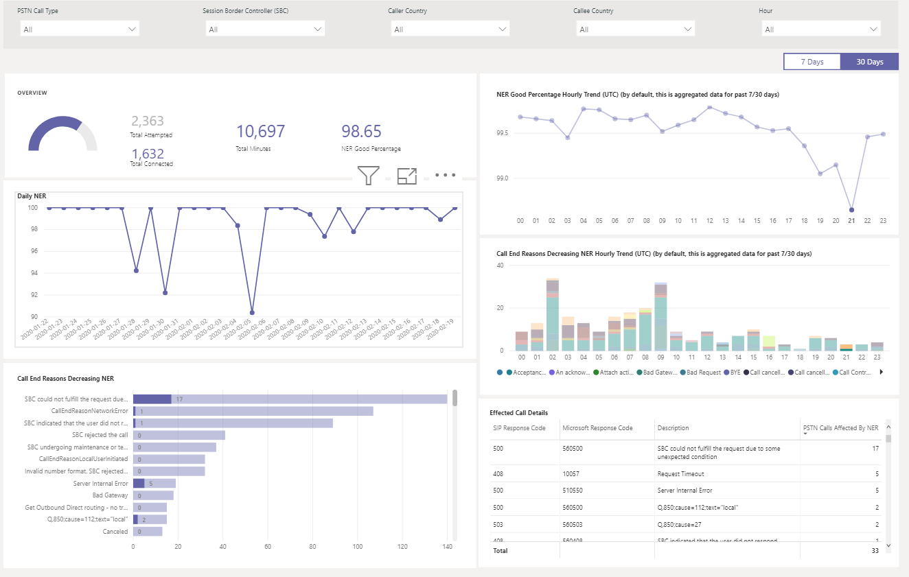
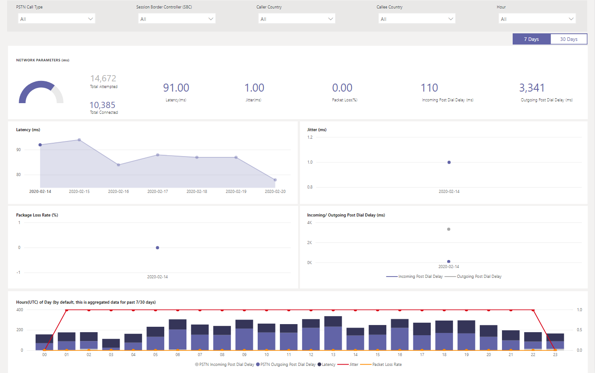

# Usando o relatório de Roteamento Direto PSTN do CQD

Novidade em março de 2020, adicionamos um relatório de Roteamento Direto PSTN PSTN (Painel de Qualidade de Chamada) do Microsoft Teams aos nossos modelos de consulta do [Power BI para download para CQD](https://github.com/MicrosoftDocs/OfficeDocs-SkypeForBusiness/blob/live/Teams/downloads/CQD-Power-BI-query-templates.zip?raw=true). 

O relatório de Roteamento Direto PSTN do CQD (CQD PSTN Direct Routing Report.pbit) ajuda você a entender os padrões de uso e a qualidade dos serviços PSTN. Use este relatório para monitorar o uso do serviço, as informações sobre o controlador de borda de sessão (SBC), o serviço de telefonia, os parâmetros de rede e os detalhes da Taxa de Eficácia de Rede. Essas informações podem ajudá-lo a identificar problemas, incluindo o motivo das chamadas descartadas. Por exemplo, você poderá ver quando o volume cai ou quantas chamadas são afetadas e por qual motivo.

O Relatório de Roteamento Direto PSTN do CQD tem quatro seções:

  - [Visão geral do PSTN](#pstn-overview)

  - [Detalhes do Serviço](#service-details)

  - [Taxa de eficácia da rede](#network-effectiveness-ratio)

  - [Parâmetros de rede](#network-parameters)

## Destaques

1. Analisar por tipo de chamada, SBC, chamador e país do computador chamado

   O relatório de Roteamento Direto PSTN CQD agrega métricas de confiabilidade e uso para todos os SBCs em seu locatário nos últimos 7, 30 ou 180 dias (6 meses). Você pode analisar dados por tipo de chamada, SBC, chamador e país do computador chamado. Se você estiver interessado em um determinado SBC ou país, poderá identificar alterações nas tendências durante o intervalo de tempo selecionado.
   :::image type="content" source="media/CQD-PSTN-report8.png" alt-text="Captura de tela dos filtros disponíveis no relatório de Roteamento Direto PSTN do CQD.":::
   
2. Acompanhar tendências

    A análise de tendências é essencial ao tentar entender o uso e a confiabilidade do serviço. As tendências por hora fornecem uma visão mais próxima do desempenho diário, o que ajuda a identificar incidentes em tempo real. As tendências diárias permitem que você veja a integridade do serviço de uma perspectiva de longo prazo. É importante poder alternar entre esses dois modos com a granularidade de dados apropriada. O relatório de Roteamento Direto PSTN do CQD fornece visão geral de tendências de 6 meses, tendências diárias de 7 e 30 dias e tendências por hora para que você possa analisar o desempenho em cada nível.
    :::image type="content" source="media/CQD-PSTN-report9.png" alt-text="Captura de tela dos grafos de tendências no relatório de Roteamento Direto PSTN do CQD.":::

3. Detalhar até o nível de usuário ou SBC

   Estamos criando uma funcionalidade de detalhamento em várias categorias de dados no CQD, o que permite que você entenda rapidamente a distribuição de uso ou confiabilidade no nível do SBC ou do usuário. Usando o detalhamento, você pode rapidamente identificar problemas e entender o impacto real do usuário. Os recursos do relatório de Roteamento Direto PSTN do CQD detalham as métricas de Detalhe do Serviço e Taxa de Eficácia da Rede. Clique no ponto de dados no qual você está interessado para detalhar até os detalhes no nível do SBC ou do usuário.
   :::image type="content" source="media/CQD-PSTN-report10.png" alt-text="Captura de tela mostrando a funcionalidade de detalhamento em um ponto de dados.":::

## Visão geral do PSTN

O Relatório de Roteamento Direto PSTN do CQD fornece as seguintes informações relacionadas à integridade geral do serviço nos últimos 180 dias.

Por exemplo, se você estiver interessado no uso geral e na integridade de todas as chamadas de entrada que passam pelo SBC abc.bca.adatum.biz com os EUA como o país interno:

| **Chamada** | **Descrição**                                                                                                                                                 |
| ------------ | --------------------------------------------------------------------------------------------------------------------------------------------------------------- |
| 1            | Você pode usar os filtros na parte superior para fazer drill down e selecionar ByotIn como tipo de chamada, abc.bca.contoso.com como Controlador de Boarder de Sessão e EUA como país interno. |
| 2            | Tendência de uso dos últimos 180 dias. Você pode encontrar o relatório de detalhes de uso na página Detalhes do Serviço.                                                                     |
| 3            | Tendência pós-atraso de discagem, latência, tremulação e perda de pacotes nos últimos 180 dias. Você pode encontrar o relatório detalhado na página Parâmetros de Rede.                           |
| 4            | Tendência de Chamada Simultânea e Usuário Ativo Diário nos últimos 180 dias. Este gráfico pode ajudá-lo a entender o volume máximo do serviço.                            |
| 5            | O Principal Motivo de Término da Chamada afetou a qualidade do serviço nos últimos 180 dias. Você pode encontrar detalhes de integridade do serviço na página NER (Network Effective Ratio).                    |

## Detalhes do Serviço

Esta página fornece tendências de uso do serviço por dia e detalhamento de comentários do usuário por geográfico.

  - **Total de chamadas de tentativa –** Total de chamadas de tentativa nesse intervalo de tempo, incluindo chamadas com êxito e com falha

  - **Total de Chamadas Conectadas -** Total de chamadas conectadas nesse intervalo de tempo

  - **Total de minutos –** Uso total de minutos nesse intervalo de tempo

  - **DaU (Usuários Ativos Diários) –** Contagem de usuários ativos diários que fizeram pelo menos uma chamada conectada nesse dia

  - **Chamadas simultâneas –** Máximo de chamadas ativas simultâneas em um minuto

  - **Comentários do usuário –** A pontuação "Rate My Call" vem do usuário. 3-5 é considerado uma boa chamada. 1-2 é considerado uma chamada ruim.

Por exemplo:

1.  Se a duração média da chamada cair para 0 em 14/02/2020, primeiro você poderá verificar se o volume de chamadas parece normal e ver se há uma discrepância grande entre o total de chamadas de conexão e o total de chamadas de tentativa. Em seguida, vá para a página Taxa de Eficácia de Rede para investir em motivos de falha de chamada.

2.  Se você vir o aumento de pontos vermelhos no mapa de comentários do usuário, poderá acessar a página Taxa de Eficácia da Rede e o Parâmetro de Rede para ver se há anomalias e gerar um tíquete usando o MS Service Desk.

## Taxa de eficácia da rede

Essa é a mesma métrica que aparece no painel de Integridade Geral. Você pode verificar o número de NER por hora com detalhes de chamadas afetadas para ambas as direções de chamada (entrada/saída) na taxa de eficácia de rede por hora e no gráfico de motivos de término da chamada abaixo.

  - **NER** – A capacidade (%) de uma rede de entregar chamadas medindo o número de chamadas enviadas versus o número de chamadas entregues a um destinatário.

  - **Código de resposta SIP** - Um código de resposta de inteiro de três dígitos mostra o status da chamada.

  - **Código de resposta da Microsoft** – código de resposta A enviado do componente da Microsoft.

  - **Descrição** – a fase de motivo que corresponde ao código de resposta SIP e ao código de resposta da Microsoft.

  - **Número de chamadas afetadas** – o número total de chamadas foi afetado durante o intervalo de tempo selecionado.

> 
> 
Por exemplo:

Se o NER Diário tiver uma queda em 05/02/2020, você poderá clicar na data e outros gráficos aplicarão zoom a essa data específica.

Na tendência de bom percentual por hora do NER, você pode descobrir que a queda ocorre por volta das 21:00. Em seguida, clique novamente para ampliar para a hora 21 e verifique Detalhes da Chamada Com Efeito para ver quantas chamadas falharam nessa hora e quais são os motivos de término da chamada. Você pode começar com problemas de auto-problemas em qualquer problema de SBC ou relatar ao Service Desk se o problema não estiver relacionado ao SBC.

## Parâmetros de rede

Todos os parâmetros de rede são medidos da interface de Roteamento Direto para o Controlador de Borda de Sessão. Para obter informações sobre os valores recomendados, consulte Preparar a rede da sua organização para [o Microsoft Teams](prepare-network.md) e examine a Borda do Cliente para os valores recomendados do Microsoft Edge.

  - **Tremulação** – é a medida de milissegundos de variação no tempo de atraso de propagação de rede calculado entre dois pontos de extremidade usando RTCP (o protocolo de controle RTP).

  - **Perda de** pacote – é uma medida de pacote que não chegou; ele é calculado entre dois pontos de extremidade.

  - **Latência** - (também conhecida como tempo de viagem de ida e volta) é o tempo necessário para que um sinal seja enviado mais o tempo necessário para que a confirmação desse sinal seja recebida. Esse atraso de tempo consiste nos tempos de propagação entre os dois pontos de um sinal.

> 

Por exemplo:

Se você vir um pico em qualquer um dos quatro gráficos (Latência, Tremulação, Taxa de Perda de Pacote, Atraso Pós-Discagem) para uma data específica, por exemplo, Latência em 14/02/2020, clique no ponto de data. E o gráfico de tendências por hora na parte inferior será atualizado para mostrar o número por hora. Você pode verificar os SBCs ou gerar um tíquete com o MS Service Desk.

## Tópicos relacionados

[Usar o Power BI para analisar dados do CQD para o Microsoft Teams](CQD-PSTN-report.md)

[Solução de problemas do Teams](/MicrosoftTeams/troubleshoot/teams)