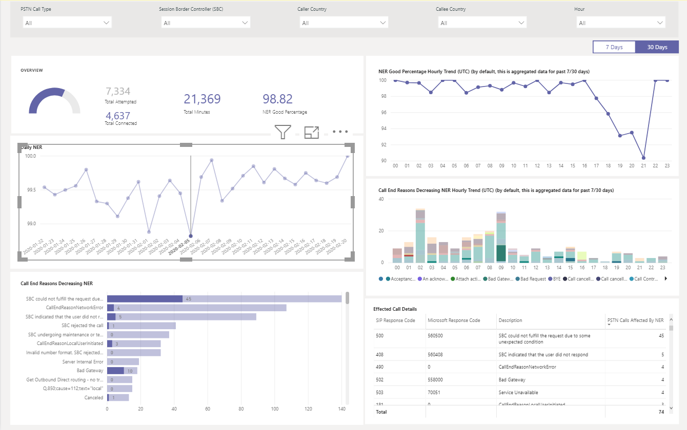

# Usando o relatório de roteamento direto do CQD PSTN

Novidades de março de 2020, adicionamos um relatório de roteamento direto PSTN do Microsoft Teams CQD (Microsoft Teams Call Quality) a nossos [modelos de consulta para download do Power bi para CQD](https://github.com/MicrosoftDocs/OfficeDocs-SkypeForBusiness/blob/live/Teams/downloads/CQD-Power-BI-query-templates.zip?raw=true). 

O CQD PSTN Direct Routing Report (CQD PSTN Direct Routing Report. PBit) ajuda você a entender os padrões de uso e a qualidade dos seus serviços PSTN. Use esse relatório para monitorar o uso do serviço, informações sobre o seu controlador de borda de sessão (SBC), o serviço de telefonia, os parâmetros de rede e os detalhes da taxa de eficácia da rede. Essas informações podem ajudá-lo a identificar problemas, incluindo o motivo para as chamadas descartadas. Por exemplo, você poderá ver quando o volume cai ou quantas chamadas são afetadas e por qual motivo.

O relatório de roteamento direto PSTN CQD tem quatro seções:

  - [Visão geral da PSTN](#pstn-overview)

  - [Detalhes do serviço](#service-details)

  - [Taxa de eficácia da rede](#network-effectiveness-ratio)

  - [Parâmetros de rede](#network-parameters)

## Alça

1. Analisar por tipo de chamada, SBC, chamador e chamado Country

   O CQD PSTN Direct Routing Report agrega as métricas de confiabilidade e uso de todos os SBCs em seu locatário para os últimos 7, 30 ou 180 dias (6 meses). Você pode analisar dados por tipo de chamada, SBC, chamador e chamado país. Se estiver interessado em um determinado SBC ou país, você poderá identificar as alterações nas tendências ao longo do intervalo de tempo selecionado.
   :::image type="content" source="media/CQD-PSTN-report8.png" alt-text="Captura de tela de filtros disponíveis no relatório de roteamento direto PSTN CQD":::
   
2. Controlar tendências

    A análise de tendências é essencial ao tentar entender o uso e a confiabilidade do serviço. As tendências horárias fornecem uma visão detalhada do desempenho diário, o que ajuda a identificar incidentes em tempo real. As tendências diárias permitem que você veja a integridade do seu serviço a partir de uma perspectiva de longo prazo. É importante poder alternar entre esses dois modos com a granularidade de dados adequada. O CQD PSTN Direct Routing Report fornece uma visão geral de tendências de 6 meses, tendências diárias de 7 e 30 dias e tendências horárias, para que você possa analisar o desempenho em cada nível.
    :::image type="content" source="media/CQD-PSTN-report9.png" alt-text="Captura de tela de gráficos de tendências no CQD PSTN Direct Routing Report":::

3. Fazer drill-through para SBC ou em nível de usuário

   Criamos recursos de Drill-through em muitas categorias de dados no CQD, que permite que você entenda rapidamente o uso ou a distribuição de confiabilidade no SBC ou no nível do usuário. Ao usar Drill through, você pode poinpoint rapidamente problemas e entender o impacto real dos usuários. Os recursos do relatório de roteamento direto PSTN CQD analisam as métricas de detalhes do serviço e de eficácia da rede. Clique no ponto de dados em que você está interessado para analisar detalhes do nível do usuário ou do SBC.
   :::image type="content" source="media/CQD-PSTN-report10.png" alt-text="Captura de tela mostrando a funcionalidade de Drill-through em um ponto de dados":::

## Visão geral da PSTN

O CQD PSTN Direct Routing Report fornece as informações a seguir relacionadas à integridade geral do serviço dos últimos 180 dias.

Por exemplo, se você estiver interessado no uso geral e na integridade de todas as chamadas recebidas por meio do SBC abc.bca.adatum.biz conosco como o país interno:

| **Chame para fora** | **Descrição**                                                                                                                                                 |
| ------------ | --------------------------------------------------------------------------------------------------------------------------------------------------------------- |
| 1            | Você pode usar os filtros na parte superior para fazer drill down e selecionar ByotIn como tipo de chamada, abc.bca.contoso.com como controlador de placa de sessão e EUA como país interno. |
| 2            | Tendência de uso dos últimos 180 dias. Você pode encontrar o relatório de detalhes de uso na página de detalhes do serviço.                                                                     |
| 3            | Atraso de discagem, latência, tremulação e tendência de perda de pacote nos últimos 180 dias. Você pode encontrar um relatório detalhado na página parâmetros de rede.                           |
| 4            | Chamada simultânea e tendência de usuário ativo diário para os últimos 180 dias. Este gráfico pode ajudá-lo a entender o volume máximo do serviço.                            |
| 5            | Melhor motivo de término de chamada afetado qualidade do serviço dos últimos 180 dias. Você pode encontrar detalhes de integridade do serviço na página de índice efetivo de rede (NER).                    |

## Detalhes do serviço

Esta página fornece as tendências de uso de serviço por dia e a divisão de comentários do usuário por meio do meio geográfico.

  - **Total de chamadas de tentativa –** Total de chamadas de tentativa nesse intervalo de tempo, incluindo tanto êxito como chamadas com falha

  - **Total de chamadas conectadas-** Total de chamadas conectadas nesse intervalo de tempo

  - **Total de minutos –** Uso total de minutos nesse intervalo de tempo

  - **Usuários ativos diariamente (DAU) –** Contagem de usuários ativos diários que fizeram pelo menos uma chamada conectada nesse dia

  - **Chamadas simultâneas –** Máximo de chamadas ativas simultâneas em um minuto

  - **Comentários do usuário –** A pontuação "classificar minha chamada" vem do usuário. 3-5 é considerado uma boa chamada. 1-2 é considerado como uma chamada incorreta.

Por exemplo:

1.  Se você vir as quedas médias de duração da chamada para 0 no 02/14/2020, você pode primeiro verificar se o volume da chamada está normal e ver se há uma grande discrepância entre o total de chamadas do Connect e as chamadas de tentativas totais. Em seguida, acesse a página de razão da eficácia da rede para investir em motivos de falha na chamada.

2.  Se vir o aumento dos pontos vermelhos no mapa de comentários do usuário, você poderá acessar a página de índice de eficácia da rede e o parâmetro de rede para ver se há anomalias e se você pode disparar um bilhete usando o MS Service Desk.

## Taxa de eficácia da rede

Esta é a mesma métrica que aparece no painel de integridade geral. Você pode verificar o número de NER por hora com os detalhes das chamadas afetadas para as direções da chamada (de entrada/saída) na taxa de eficácia horária da rede e no gráfico de motivo de término da chamada abaixo.

  - **Ner** – a capacidade (%) de uma rede para entregar chamadas medindo o número de chamadas enviadas versus o número de chamadas entregues a um destinatário.

  - **Código de resposta SIP**-um código de resposta de inteiro de três dígitos mostra o status da chamada.

  - **Código de resposta da Microsoft**-um código de resposta enviado do componente da Microsoft.

  - **Descrição** – a fase de motivo correspondente ao código de resposta SIP e ao código de resposta da Microsoft.

  - **Número de chamadas afetadas** – o número total de chamadas que você tem afetado durante o intervalo de tempo selecionado.

> 
> 
Por exemplo:

Se o NER diário tiver um DIP no 02/05/2020, você poderá clicar na data e outros gráficos serão ampliados para essa data específica.

Na NER boa porcentagem de tendência horária, você pode encontrar o DIP em torno de 21:00. Em seguida, clique novamente para aplicar zoom à hora 21 e verificar detalhes de chamadas afetadas para ver quantas chamadas falharam nessa hora e quais são os motivos de término da chamada. Você pode começar com a solução de problemas do SBC em qualquer problema de SBC ou relatório para o serviço de suporte se o problema não estiver relacionado ao SBC.

## Parâmetros de rede

Todos os parâmetros de rede são medidos da interface de roteamento direto para o controlador de borda de sessão. Para obter informações sobre os valores recomendados, consulte [preparar a rede da sua organização para o Microsoft Teams](prepare-network.md)e verificar os valores recomendados de borda do cliente para o Microsoft Edge.

  - **Tremulação** – é a medida de milissegundos da variação no tempo de atraso de propagação de rede calculado entre dois pontos de extremidade usando RTCP (o protocolo de controle RTP).

  - **Perda de pacotes** – é uma medida do pacote que falhou ao chegar; Ele é calculado entre dois pontos de extremidade.

  - **Latência** -(também conhecido como tempo de viagem de ida e volta) é o período de tempo que leva para o envio de um sinal mais o tempo necessário para que a confirmação daquele sinal seja recebida. Esse atraso de tempo consiste nos tempos de propagação entre os dois pontos de um sinal.

> 

Por exemplo:

Se você vir um pico em qualquer um dos quatro gráficos (latência, tremulação, taxa de perda de pacote, atraso de discagem automática) para uma data específica, por exemplo, latência em 02/14/2020, clique no ponto de data. O gráfico de tendências horárias na parte inferior será atualizado para mostrar o número por hora. Você pode verificar o SBCs ou disparar um bilhete com o MS Service Desk.

## Tópicos relacionados

[Usar o Power BI para analisar dados do CQD para o Microsoft Teams](CQD-PSTN-report.md)

[Solução de problemas do Teams](https://docs.microsoft.com/MicrosoftTeams/troubleshoot/teams)