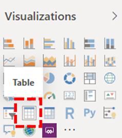

# Instalar o Conector de Qualidade de Chamada da Microsoft para Power BI usar modelos de consulta do Painel de Qualidade de Chamada

Antes de usar os modelos de consulta do Power BI (arquivos PBIX) para o CQD (Painel de Qualidade de Chamadas) do Microsoft Teams), você precisará instalar o conector de Qualidade de Chamada da Microsoft para Power BI, usando o arquivo *MicrosoftCallQuality.pqx* incluído no [download](https://github.com/MicrosoftDocs/OfficeDocs-SkypeForBusiness/blob/live/Teams/downloads/CQD-Power-BI-query-templates.zip?raw=true).

Leia [Use Power BI para analisar dados CQD para Teams](CQD-Power-BI-query-templates.md) para saber mais sobre esses modelos.

Certifique-se de ter a função de acesso [CQD correta](./turning-on-and-using-call-quality-dashboard.md#assign-admin-roles-for-access-to-cqd) para acessar os relatórios Power BI dados.

> [!NOTE]
> O conector de Qualidade de Chamada da Microsoft só dá suporte ao DirectQuery Power BI; O modo de importação não é suportado. 

## Instalação

O processo para instalar um conector personalizado e ajustar a segurança para habilitar o uso do conector é descrito em detalhes na documentação [de Power BI.](/power-bi/desktop-connector-extensibility) Para simplificar, aqui está uma explicação rápida:

1. Verifique se seu computador já tem uma *\[pasta Documents\]\\ Power BI Desktop\\ Custom Connectors*. Caso não seja, crie essa pasta. 1

2. Baixe o arquivo do conector (um *\*arquivo .mez* *\*ou .pqx* ) e coloque-o no *diretório Conectores Personalizados* .

3. **Se o arquivo do conector for *\*um arquivo .mez* ,** você também precisará ajustar suas configurações de segurança, conforme descrito na documentação de instalação [do conector personalizado](/power-bi/desktop-connector-extensibility#data-extension-security).

Se uma nova versão do conector de Qualidade de Chamada da Microsoft for lançada, substitua o arquivo do conector antigo no diretório *Conectores Personalizados* pelo novo arquivo.

## Instalação

Para criar um relatório e executar consultas, primeiro você precisará se conectar à fonte de dados CQD. Siga as etapas abaixo para se conectar:

1. Na guia Página Power BI Desktop, clique em *Obter Dados*.

    

2. A *janela Obter Dados* deve aparecer neste ponto. Navegue *até Serviços Online* e selecione *Qualidade de Chamada da Microsoft (Beta)* *e Conexão.*

    

3. Você será solicitado a entrar em seguida. Use as mesmas credenciais que você usa para Painel de Qualidade de Chamada. 2

4. O próximo prompt dará a opção entre dois modos *de Conectividade de Dados*. Selecione *DirectQuery* e clique em *OK*.

5. Por fim, você receberá um prompt final mostrando todo o modelo de dados do Painel de Qualidade de Chamada. Nenhum dado será visível neste ponto, apenas o modelo de dados para CQD. Selecione *Carregar* para concluir o processo de instalação.

6. Neste ponto, Power BI carregará o modelo de dados no lado direito da janela. A página permanecerá em branco, e nenhuma consulta será carregada por padrão. **Prossiga para a criação de consultas** abaixo para criar uma consulta e retornar dados.

Se alguma das etapas durante esse processo de instalação não foi clara, uma explicação mais detalhada sobre o processo pode ser encontrada em [Início Rápido: Conexão](/power-bi/desktop-quickstart-connect-to-data) dados em Power BI Desktop.

## Criando consultas

Depois que a instalação for concluída, você deverá ver os nomes de várias centenas de dimensões e medidas carregadas no painel *Campos* . A construção de consultas reais a partir daqui é simples, basta selecionar as dimensões e medidas que você deseja para sua consulta e arraste e solte-as na página. Aqui está uma explicação mais detalhada, com um exemplo simples:

1. Selecione a visualização que você deseja usar no painel *Visualizações* . Uma versão em branco dessa visualização deve aparecer na página. Para os fins deste exemplo, vamos usar a visualização *tabela* .

    

2. Determine quais dimensões e medidas (denotadas por um símbolo de agregação pelo nome) que você deseja usar para sua consulta e selecione-as manualmente e arraste-as para a visualização em preto. Como alternativa, arraste-os para o campo *Valores* abaixo das opções de visualização.

    

    > [!IMPORTANT]
    > O Painel de Qualidade de Chamada requer uma medida para que qualquer consulta seja executado. A falha ao adicionar uma medida a uma consulta fará com que essa consulta falhe.

3. Em seguida, selecione as dimensões que você deseja filtrar e arraste-as para o *Filtros neste campo visual* no painel *Filtros* . O conector de Qualidade de Chamada da Microsoft atualmente dá suporte à filtragem *básica (selecione* valores de uma lista  de valores de dimensão possíveis *), filtragem* avançada (especifique manualmente valores e operands para filtrar, semelhante ao Painel de Qualidade de Chamada) e filtragem de  data *relativa (disponível* apenas para as dimensões Hora de Término e Hora de Início). A filtragem de acordo *com o Top N* não é suportada pelo Painel de Qualidade de Chamada.

    

    > [!IMPORTANT]
    > Os filtros só são suportados quando aplicados a Dimensões. A filtragem nos valores de Medidas não é suportada no Painel de Qualidade de Chamada.

4. Por fim, selecione a guia *Formatar* no painel *Visualizações* para estilizar e formatar sua consulta.

    > [!NOTE]
    > As consultas do Painel de Qualidade de Chamada exigem pelo menos uma medida para ser executado. Se a consulta não for carregada, verifique duas vezes se você incluiu uma medida na consulta.

## Criando um relatório passo a passo

[Drillthrough in Power BI](/power-bi/desktop-drillthrough) permite que você crie relatórios focados que você pode filtrar rapidamente usando os valores de outros relatórios como contexto. Depois de saber como criar sua primeira consulta com o conector de Qualidade de Chamada da Microsoft, a criação de um passo a passo é ainda mais simples.

1. Crie outra página para o relatório focado e adicione suas consultas a essa página.

2. Selecione a dimensão que você deseja usar como um filtro passo a passo e arraste-os para o campo *Drillthrough* no painel *Visualizações* .

    

3. **É isso.\!** Qualquer outra consulta em outra página que use essa dimensão agora pode passar por essa página, aplicando automaticamente o valor da dimensão drillthrough como um filtro.

    

Ao contrário do Painel de Qualidade de Chamada, Power BI oferece suporte a drillthrough não sequencial. Se uma consulta incluir a dimensão necessária, ela poderá passar por qualquer outra página.

### Prática prática prática

As consultas do conector de qualidade de chamada da Microsoft devem ser projetadas com a funcionalidade drillthrough em mente. Em vez de tentar carregar todos os dados de uma só vez e cortar com filtros, comece com consultas mais amplas e de baixa cardinalidade e faça uma pesquisa até consultas de alta cardinalidade. Por exemplo, ao tentar diagnosticar quais sub-redes contribuem mais para problemas de qualidade, é útil primeiro identificar essas regiões e países que contribuem para o problema e, em seguida, detalhar as sub-redes nessa região ou país. Os modelos de conector de Qualidade de Chamada foram projetados dessa maneira para atuar como um exemplo.

## Limitações

Apesar de usar o Power BI, nem todas as funcionalidades Power BI são compatíveis com o conector de Qualidade de Chamada da Microsoft, seja como resultado de limitações no modelo de dados do Painel de Qualidade de Chamada ou nos conectores DirectQuery em geral. A lista abaixo observa algumas das limitações mais notáveis do Conector, mas essa lista não deve ser considerada exaustiva:

1. **Colunas Calculadas –** Os conectores do DirectQuery em geral têm suporte limitado para colunas calculadas em Power BI. Algumas colunas calculadas podem funcionar com o Conector, que essas colunas são exceções. Como regra geral, as colunas calculadas não funcionam.

2. **Agregaçãos –** O modelo de dados do Painel de Qualidade de Chamada é criado em um modelo de cubo, o que significa que as agregação já são suportadas na forma de medidas. A tentativa de adicionar agregação manualmente a dimensões diferentes ou alterar o tipo de agregação de uma medida não funcionará com o Conector, e isso geralmente resultará em um erro.

3. **Elementos visuais personalizados –** Embora o conector de Qualidade de Chamada da Microsoft funcione com uma variedade de elementos visuais personalizados, não é possível garantir a compatibilidade com todos os elementos visuais personalizados. Muitos elementos visuais personalizados dependem do uso de colunas calculadas ou dados importados, nenhum deles é suportado por conectores do DirectQuery.

4. **Fazendo referência a Dados Armazenados** em Cache – Power BI atualmente não dá suporte a fazer referência a dados armazenados em cache de um conector DirectQuery de qualquer maneira. Qualquer tentativa de referenciar os resultados de uma consulta resultará em uma nova consulta.

5. **Filtragem de Dados Relativos –** Tem suporte no conector de Qualidade de Chamada da Microsoft, mas somente com as dimensões *Hora* de Início *e Hora de* Término. Embora a *dimensão Date* possa ser a opção óbvia para filtragem de data relativa, *Date* não é armazenada como um objeto de data e, portanto, não dá suporte à filtragem de data relativa em Power BI.

6. **Consultas somente de medida -** Não há suporte no momento no conector de Qualidade de Chamada da Microsoft. Ao criar uma visualização com três ou mais medidas e sem dimensões, os dados da coluna serão transpostos. Para evitar isso, sempre inclua pelo menos uma dimensão (por exemplo: Mês ano) em suas visualizações. Isso deve ser resolvido em uma versão futura do conector de Qualidade de Chamada da Microsoft para Power BI.

7. **Nuvem da Comunidade Governamental (GCC) Suporte –** Para clientes no ambiente GCC, o conector de Qualidade de Chamada da Microsoft funcionará ao usar Power BI Desktop somente. O conector de Qualidade de Chamada da Microsoft atualmente não é compatível com o serviço Power BI para GCC clientes.

A maioria desses problemas são restrições ao design do conector DirectQuery Power BI ou fundamentais para o design do modelo de dados CQD.

## Solução de problemas

### Estou tentando usar a coluna Data como uma slicer Date. Assim que eu converter o tipo de dados dessa coluna em Data, eu receber esse erro

> **Não foi necessário** carregar os dados para este visual: erro OLE DB ou ODBC: [Expressão.Erro] Não conseguimos dobrá-la para a fonte de dados. Tente uma expressão mais simples.

As slicers de data não têm suporte com o conector de Qualidade de Chamada da Microsoft. Para especificar um intervalo de datas, aplique dois filtros ao relatório, especificando uma data menor do que e maior do que a data.

Como alternativa, se as datas que você deseja exibir são recentes, aplique um filtro de data relativa para mostrar apenas os dados dos últimos N dias/semanas/meses.

### Quando adiciono determinadas dimensões aos meus relatórios, o visual retorna imediatamente "Não foi possível carregar os **dados para esse visual"**. Remover a dimensão corrige o visual. O que está acontecendo?

Esse é um problema conhecido no conector de Qualidade de Chamada da Microsoft; qualquer dimensão exposta como um número inteiro aparecerá no Power BI como uma coluna "agregada", onde Power BI tentará uma ação de resumo padrão (normalmente 'Sum'). Em alguns casos, esse comportamento terá êxito ao resumir os valores, mesmo que o resultado não seja útil, pois a "soma" de uma dimensão como o Segundo Canal WiFi não tem significado. Em outros casos, essa ação resumida falhará e causará erros no visual.

Para resolver esse problema, comece removendo a dimensão do visual. Selecione a dimensão na lista 'Campos', navegue até a guia 'Ferramentas de coluna' na faixa de opções, clique no menu suspenso 'Summarização' e selecione **Não resumir**. A dimensão agora pode ser adicionada ao visual novamente.

## Códigos de erro

Como o conector de Qualidade de Chamada da Microsoft para Power BI é menos restrito do que o aplicativo do navegador em termos de tipos de consultas que você pode construir, você pode ocasionalmente encontrar vários erros ao criar suas consultas. Caso você receba uma mensagem de erro do tipo "CQDError. RunQuery – Erro de Execução de Consulta", consulte a lista abaixo com o número ErrorType fornecido para solucionar o possível problema com a consulta. Veja a seguir os códigos de Tipo de Erro mais comuns que você pode encontrar com o conector de Power BI CQD:

- **ErrorType 1 - Erro de Estrutura de Consulta:** Um erro de estrutura de consulta geralmente é causado pela falha do Conector ao criar uma consulta formatada corretamente. Isso acontece com mais frequência ao usar a funcionalidade sem suporte, conforme especificado nas Limitações acima. Verifique duas vezes se você não está usando colunas calculadas ou elementos visuais personalizados para essa consulta.

  - **ErrorType 2 - Erro de construção de consulta:** Um erro de construção de consulta é causado pelo conector de Qualidade de Chamada da Microsoft não conseguir analisar corretamente a consulta que você está tentando criar. Isso acontece com mais frequência ao usar a funcionalidade sem suporte, conforme especificado nas Limitações acima. Verifique duas vezes se você não está usando colunas calculadas ou elementos visuais personalizados para essa consulta.

  - **ErrorType 5 - Tempo de execução:** A consulta atingiu o tempo de execução máximo possível antes do tempo limite. Tente adicionar mais filtros à consulta para limitar seu escopo. Restringir o intervalo de dados geralmente é a maneira mais eficaz de fazer isso.

  - **ErrorType 7 - Nenhum erro de medição:** As consultas do Painel de Qualidade de Chamada exigem uma medida para funcionar. Verifique se sua consulta inclui medida. As medidas no conector de Qualidade de Chamada da Microsoft são anotadas pelo símbolo de agregação (soma) antes de seu nome.

Se você encontrar erros adicionais fora desse escopo, notifique a equipe do Painel de Qualidade de Chamada para que possamos ajudar a solucionar o problema e atualizar a documentação conforme apropriado.

## Notas de rodapé

**1** Determinados processos e aplicativos (por exemplo, OneDrive) podem fazer com que sua pasta raiz Documentos mude; certifique-se de que o diretório *Power BI Desktop\\ Custom Connectors* seja colocado dentro da pasta raiz atual Documentos.

**2** As credenciais de logon que você usa para o Painel  de Qualidade de Chamada não precisam ser as mesmas que você usa para fazer logon no aplicativo Power BI Desktop aplicativo em si.

## Perguntas frequentes

### Quando o conector Power BI será atualizado a partir do status "Beta"?

Apesar da marca Beta, o conector de Qualidade de Chamada da Microsoft (Beta) para Power BI é a primeira versão de "versão" do conector e foi oficialmente assinado pela equipe Power BI para refletir isso. No momento da versão inicial do conector, a equipe Power BI não pôde fornecer suporte e certificação mais ampla, mas ainda estava preparada para atestar a segurança, a autenticidade e a funcionalidade geral do conector de Qualidade de Chamada da Microsoft. Olhando para frente, estamos planejando investir no conector de Qualidade de Chamada da Microsoft para Power BI futuro próximo.

### Por que o conector parece mais lento em comparação com o Painel de Qualidade de Chamada no navegador? O que posso fazer para melhorar o desempenho?

O desempenho da consulta para os vários modelos é, na verdade, o mesmo no navegador e no conector.  Assim como qualquer outro aplicativo autônomo, o Power BI adiciona seu tempo de autenticação e renderização ao nosso desempenho. Além disso, a diferença vem no número de consultas simultâneas sendo executados. Como a versão no navegador do Painel de Qualidade de Chamada tinha opções de visualização menos desenvolvidas e densas de informações, a maioria dos nossos relatórios estava limitada ao carregamento de consultas de 2 a 3 por vez. Por outro lado, os modelos de conector geralmente exibem mais de 20 consultas simultâneas. Se você deseja criar relatórios que sejam tão responsivos quanto os mais antigos aos quais você estava acostumado, tente criar relatórios com no máximo 2 a 3 consultas por guia.

Para obter mais informações, consulte os seguintes artigos:

- [Guia de otimização para Power BI](/power-bi/guidance/power-bi-optimization)
- [Diretrizes do modelo DirectQuery](/power-bi/guidance/directquery-model-guidance)

### Eu acho que eu corro rotineiramente para o limite de 10.000 linhas ao executar consultas. Como fazer com que o conector retorne mais de 10.000 linhas?

O limite de 10.000 linhas é realmente especificado no final da API e foi projetado para ajudar a melhorar significativamente o desempenho e reduzir o risco de erros de execução de consulta resultantes de condições de memória baixa.

Em vez de tentar aumentar a contagem de linhas de resultados, é melhor reestruturar seus relatórios de acordo com as práticas recomendadas do conector. Os modelos que incluímos foram projetados para demonstrar essas práticas recomendadas. Sempre que possível, comece olhando para seus KPIs usando dimensões mais amplas e de menor cardinalidade, como Mês, Ano, Data, Região, País, etc. A partir daí, você pode detalhar as dimensões cada vez mais elevadas. O Helpdesk e Location-Enhanced relatórios fornecem bons exemplos desse fluxo de trabalho de detalhamento.

## Tópicos relacionados

[Use Power BI para analisar dados CQD para Teams](CQD-Power-BI-query-templates.md)
