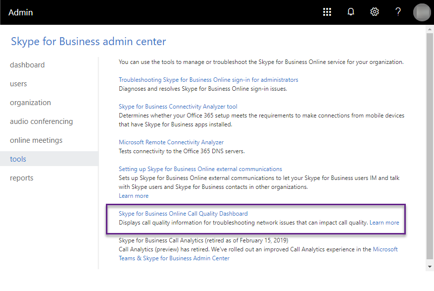

# <a name="data-and-reports-in-call-quality-dashboard-cqd"></a><span data-ttu-id="58132-103">Dados e relatórios no Painel de Qualidade da Chamada (CQD)</span><span class="sxs-lookup"><span data-stu-id="58132-103">Data and reports in Call Quality Dashboard (CQD)</span></span>

<span data-ttu-id="58132-104">O Microsoft Call Quality Dashboard (CQD) usa um feed de dados quase em tempo real (NRT).</span><span class="sxs-lookup"><span data-stu-id="58132-104">Microsoft Call Quality Dashboard (CQD) uses a near-real-time (NRT) data feed.</span></span> <span data-ttu-id="58132-105">Os registros de chamada estão disponíveis no CQD dentro de 30 minutos após o final de uma chamada.</span><span class="sxs-lookup"><span data-stu-id="58132-105">Call records are available in CQD within 30 minutes of the end of a call.</span></span> <span data-ttu-id="58132-106">Os registros de chamada do pipeline de NRT só estão disponíveis por alguns meses antes de eles ser removidos do conjunto de dados.</span><span class="sxs-lookup"><span data-stu-id="58132-106">Call records from the NRT pipeline are only available for a few months before they are removed from the data set.</span></span> 


## <a name="many-ways-to-access-cqd-data"></a><span data-ttu-id="58132-107">Muitas maneiras de acessar dados CQD</span><span class="sxs-lookup"><span data-stu-id="58132-107">Many ways to access CQD data</span></span>

<span data-ttu-id="58132-108">Você pode acessar dados do CQD por várias vias diferentes.</span><span class="sxs-lookup"><span data-stu-id="58132-108">You can access CQD data by several different avenues.</span></span> <span data-ttu-id="58132-109">Escolha o que melhor atende às suas necessidades:</span><span class="sxs-lookup"><span data-stu-id="58132-109">Pick the one that best meets your needs:</span></span>

|  |  |
|---------|---------|
|<span data-ttu-id="58132-110">Centro de administração do Teams [( https://admin.teams.microsoft.com) ](https://admin.teams.microsoft.com)</span><span class="sxs-lookup"><span data-stu-id="58132-110">Teams admin center [(https://admin.teams.microsoft.com)](https://admin.teams.microsoft.com)</span></span>    | <span data-ttu-id="58132-111">Os dados do CQD são incluídos na página Usuários no Centro de administração do Teams, mostrando os dados mais comuns de que você precisa em um formato de fácil leitura. </span><span class="sxs-lookup"><span data-stu-id="58132-111">CQD data is included on the **Users** page in the Teams admin center, showing the most common data you need in an easy-to-read format.</span></span> <span data-ttu-id="58132-112">Não é possível personalizar os dados do CQD que você encontra em **Usuários.**</span><span class="sxs-lookup"><span data-stu-id="58132-112">You can't customize CQD data that you find under **Users**.</span></span>  |
|<span data-ttu-id="58132-113">Portal do CQD [( https://cqd.teams.microsoft.com) ](https://cqd.teams.microsoft.com)</span><span class="sxs-lookup"><span data-stu-id="58132-113">CQD portal [(https://cqd.teams.microsoft.com)](https://cqd.teams.microsoft.com)</span></span>     | <span data-ttu-id="58132-114">Resumo robusto e relatórios detalhados que atendem à maioria das necessidades, com filtragem detalhada.</span><span class="sxs-lookup"><span data-stu-id="58132-114">Robust summary and detailed reports that meet most needs, with drill-through filtering.</span></span> <span data-ttu-id="58132-115">Você também pode personalizar relatórios no portal do CQD.</span><span class="sxs-lookup"><span data-stu-id="58132-115">You can also customize reports in the CQD portal.</span></span> <br><br><span data-ttu-id="58132-116">Obter dois [modelos de relatório CQD](#import-the-cqd-report-templates) para ajudá-lo a analisar dados no portal do CQD.</span><span class="sxs-lookup"><span data-stu-id="58132-116">Get two [CQD report templates](#import-the-cqd-report-templates) to help you analyze data in the CQD portal.</span></span>       |
|<span data-ttu-id="58132-117">Power BI</span><span class="sxs-lookup"><span data-stu-id="58132-117">Power BI</span></span>     | <span data-ttu-id="58132-118">Use consultas diretas para exibir seus dados CQD no Power BI usando [modelos personalizáveis do Power BI.](CQD-Power-BI-query-templates.md)</span><span class="sxs-lookup"><span data-stu-id="58132-118">Use direct queries to view your CQD data in Power BI using [customizable Power BI templates](CQD-Power-BI-query-templates.md).</span></span> <span data-ttu-id="58132-119">[Baixe modelos de consulta do Power BI para CQD.](https://github.com/MicrosoftDocs/OfficeDocs-SkypeForBusiness/blob/live/Teams/downloads/CQD-Power-BI-query-templates.zip?raw=true)</span><span class="sxs-lookup"><span data-stu-id="58132-119">[Download Power BI query templates for CQD](https://github.com/MicrosoftDocs/OfficeDocs-SkypeForBusiness/blob/live/Teams/downloads/CQD-Power-BI-query-templates.zip?raw=true).</span></span><br><br><span data-ttu-id="58132-120">Você também pode [usar a API REST para acessar dados CQD](https://docs.microsoft.com/skypeforbusiness/management-tools/call-quality-dashboard/data-api) por meio do Power BI.</span><span class="sxs-lookup"><span data-stu-id="58132-120">You can also [use the REST API to access CQD data](https://docs.microsoft.com/skypeforbusiness/management-tools/call-quality-dashboard/data-api) through Power BI.</span></span> <span data-ttu-id="58132-121">Use este método se quiser baixar os dados do CQD para trabalhar neles offline.</span><span class="sxs-lookup"><span data-stu-id="58132-121">Use this method if you want to download your CQD data so you can work on it offline.</span></span> <span data-ttu-id="58132-122">A vantagem de usar esse método é o melhor desempenho, especialmente útil para grandes conjuntos de dados que se ajustam ao Power BI quando você está online.</span><span class="sxs-lookup"><span data-stu-id="58132-122">The benefit of using this method is better performance, especially useful for large data sets that bog down in Power BI when you're online.</span></span>       |
|<span data-ttu-id="58132-123">API do Graph</span><span class="sxs-lookup"><span data-stu-id="58132-123">Graph API</span></span>     | <span data-ttu-id="58132-124">Acesse os dados de qualidade de chamada por conta própria usando [a API do Graph.](https://docs.microsoft.com/graph/api/resources/callrecords-api-overview?view=graph-rest-beta)</span><span class="sxs-lookup"><span data-stu-id="58132-124">Access call quality data yourself using the [Graph API](https://docs.microsoft.com/graph/api/resources/callrecords-api-overview?view=graph-rest-beta).</span></span> <span data-ttu-id="58132-125">Esse é o método mais complexo, mas oferece mais controle e flexibilidade na análise de seus dados de qualidade de chamada.</span><span class="sxs-lookup"><span data-stu-id="58132-125">This is the most complex method, but it gives you the most control and flexibility in analyzing your call quality data.</span></span> <span data-ttu-id="58132-126">Por exemplo, se você precisar ingressar nele com outros dados para sua organização, poderá usar a API do Graph para criar um modelo de dados e incorporar dados de qualidade de chamada.</span><span class="sxs-lookup"><span data-stu-id="58132-126">For example, if you need to join it with other data for your organization, you can use the Graph API to create a data model and incorporate call quality data.</span></span>        |

## <a name="import-the-cqd-report-templates"></a><span data-ttu-id="58132-127">Importar os modelos de relatório CQD</span><span class="sxs-lookup"><span data-stu-id="58132-127">Import the CQD report templates</span></span>

<span data-ttu-id="58132-128">Baixe dois modelos de relatório [CQD](https://aka.ms/qertemplates) (Todas as Redes e Redes Gerenciadas) para ajudá-lo a se comunicar rapidamente com o CQD.</span><span class="sxs-lookup"><span data-stu-id="58132-128">Download [two curated CQD report templates](https://aka.ms/qertemplates) (All Networks and Managed Networks) to help you get up to speed quickly with CQD.</span></span> <span data-ttu-id="58132-129">O modelo Todas as Redes, embora otimizado para trabalhar com um arquivo de dados de construção, pode ser usado enquanto você trabalha para coletar e carregar informações de construção no CQD, conforme descrito na próxima seção.</span><span class="sxs-lookup"><span data-stu-id="58132-129">The All Networks template, though optimized to work with a building data file, can be used while you work toward collecting and uploading building information into CQD, as described in the next section.</span></span>

<span data-ttu-id="58132-130">**Para importar os modelos (. CQDX) no CQD**</span><span class="sxs-lookup"><span data-stu-id="58132-130">**To import the templates (.CQDX) into CQD**</span></span>

1. <span data-ttu-id="58132-131">No CQD, selecione **Relatórios Detalhados** no menu na parte superior da página.</span><span class="sxs-lookup"><span data-stu-id="58132-131">In CQD, select **Detailed Reports** from the menu at the top of the page.</span></span>

2. <span data-ttu-id="58132-132">No painel esquerdo, selecione **Importar.**</span><span class="sxs-lookup"><span data-stu-id="58132-132">In the left panel, select **Import**.</span></span> <span data-ttu-id="58132-133">Navegue até o primeiro modelo CQDX e selecione **Abrir.**</span><span class="sxs-lookup"><span data-stu-id="58132-133">Browse to the first CQDX template and select **Open**.</span></span>

3. <span data-ttu-id="58132-134">Depois que o modelo for carregado, uma janela pop-up exibirá a mensagem "A importação de relatório foi bem-sucedida".</span><span class="sxs-lookup"><span data-stu-id="58132-134">After the template is uploaded, a pop-up window will display the message "Report import was successful."</span></span> 

4. <span data-ttu-id="58132-135">Repita as etapas 2 e 3 para o segundo modelo CQD.</span><span class="sxs-lookup"><span data-stu-id="58132-135">Repeat steps 2 and 3 for the second CQD template.</span></span>

   > [!NOTE]
   > <span data-ttu-id="58132-136">Cada usuário deve importar os modelos CQD para sua instância do CQD.</span><span class="sxs-lookup"><span data-stu-id="58132-136">Each user must import the CQD templates into their CQD instance.</span></span> 


## <a name="euii-data"></a><span data-ttu-id="58132-137">Dados EUII</span><span class="sxs-lookup"><span data-stu-id="58132-137">EUII data</span></span>

<span data-ttu-id="58132-138">Por motivos de conformidade, os dados de informações de identificação do usuário final (EUII) (também conhecidos como informações de identificação pessoal ou PII) só são mantidos por 28 dias.</span><span class="sxs-lookup"><span data-stu-id="58132-138">For compliance reasons, end-user identifiable information (EUII) data (also known as personally-identifiable information or PII) is only kept for 28 days.</span></span> <span data-ttu-id="58132-139">Como os dados de NRT cruzam a marca de 28 dias, os campos que contêm EUII são limpos, resultando em dados de NRT sem EUII.</span><span class="sxs-lookup"><span data-stu-id="58132-139">As NRT data crosses the 28-day mark, fields that contain EUII are cleared, resulting in EUII-free NRT data.</span></span> <span data-ttu-id="58132-140">Os campos que contêm dados EUII são:</span><span class="sxs-lookup"><span data-stu-id="58132-140">Fields that contain EUII data are:</span></span>

- <span data-ttu-id="58132-141">Endereço IP completo</span><span class="sxs-lookup"><span data-stu-id="58132-141">Full IP address</span></span>
- <span data-ttu-id="58132-142">Endereço do Controle de Acesso à Mídia (MAC)</span><span class="sxs-lookup"><span data-stu-id="58132-142">Media Access Control (MAC) Address</span></span>
- <span data-ttu-id="58132-143">Identificador de Conjunto de Serviços Básicos (BSSID)</span><span class="sxs-lookup"><span data-stu-id="58132-143">Basic Service Set identifier (BSSID)</span></span>
- <span data-ttu-id="58132-144">URI sip (protocolo sip) (somente Skype for Business)</span><span class="sxs-lookup"><span data-stu-id="58132-144">Session Initiation Protocol (SIP) URI (Skype for Business only)</span></span>
- <span data-ttu-id="58132-145">Nome UPN</span><span class="sxs-lookup"><span data-stu-id="58132-145">User Principal Name (UPN)</span></span>
- <span data-ttu-id="58132-146">Nome do Ponto de Extremidade da Máquina</span><span class="sxs-lookup"><span data-stu-id="58132-146">Machine Endpoint Name</span></span>
- <span data-ttu-id="58132-147">Comentários do Usuário Verbatim</span><span class="sxs-lookup"><span data-stu-id="58132-147">User Verbatim Feedback</span></span>
- <span data-ttu-id="58132-148">ID do Objeto (a ID de objeto do Active Directory do usuário do ponto de extremidade)</span><span class="sxs-lookup"><span data-stu-id="58132-148">Object ID (the Active Directory object ID of the endpoint's user)</span></span>

### <a name="admin-roles-with-and-without-euii-access"></a><span data-ttu-id="58132-149">Funções de administrador com e sem acesso à EUII</span><span class="sxs-lookup"><span data-stu-id="58132-149">Admin roles with and without EUII access</span></span>

<span data-ttu-id="58132-150">Estas [funções RBAC](https://docs.microsoft.com/azure/role-based-access-control/overview) **têm** acesso à EUII:</span><span class="sxs-lookup"><span data-stu-id="58132-150">These [RBAC](https://docs.microsoft.com/azure/role-based-access-control/overview) roles **DO** have EUII access:</span></span>
- <span data-ttu-id="58132-151">Administrador Global</span><span class="sxs-lookup"><span data-stu-id="58132-151">Global Admin</span></span>
- <span data-ttu-id="58132-152">Administrador de Serviços do Teams</span><span class="sxs-lookup"><span data-stu-id="58132-152">Teams Service Admin</span></span>
- <span data-ttu-id="58132-153">Administrador de Comunicações do Teams</span><span class="sxs-lookup"><span data-stu-id="58132-153">Teams Communications Admin</span></span>
- <span data-ttu-id="58132-154">Engenheiro de Suporte de Comunicações de Equipes</span><span class="sxs-lookup"><span data-stu-id="58132-154">Teams Communications Support Engineer</span></span>
- <span data-ttu-id="58132-155">Leitor Global</span><span class="sxs-lookup"><span data-stu-id="58132-155">Global Reader</span></span>
- <span data-ttu-id="58132-156">Administrador do Skype for Business</span><span class="sxs-lookup"><span data-stu-id="58132-156">Skype for Business Admin</span></span>

<span data-ttu-id="58132-157">Estas funções RBAC **não têm** acesso a EUII:</span><span class="sxs-lookup"><span data-stu-id="58132-157">These RBAC roles **DON'T** have EUII access:</span></span>
- <span data-ttu-id="58132-158">Leitor de Relatórios</span><span class="sxs-lookup"><span data-stu-id="58132-158">Reports Reader</span></span>
- <span data-ttu-id="58132-159">Especialista em Suporte de Comunicações do Teams</span><span class="sxs-lookup"><span data-stu-id="58132-159">Teams Communications Support Specialist</span></span>


## <a name="date-controls"></a><span data-ttu-id="58132-160">Controles de data</span><span class="sxs-lookup"><span data-stu-id="58132-160">Date controls</span></span>

<span data-ttu-id="58132-161">O CQD dá suporte aos seguintes tipos de tendência de rolagem:</span><span class="sxs-lookup"><span data-stu-id="58132-161">CQD supports the following Rolling Trend types:</span></span>

- <span data-ttu-id="58132-162">5 dias</span><span class="sxs-lookup"><span data-stu-id="58132-162">5-day</span></span>
- <span data-ttu-id="58132-163">7 dias</span><span class="sxs-lookup"><span data-stu-id="58132-163">7-day</span></span>
- <span data-ttu-id="58132-164">30 dias</span><span class="sxs-lookup"><span data-stu-id="58132-164">30-day</span></span>
- <span data-ttu-id="58132-165">60 dias</span><span class="sxs-lookup"><span data-stu-id="58132-165">60-day</span></span>
- <span data-ttu-id="58132-166">90 dias</span><span class="sxs-lookup"><span data-stu-id="58132-166">90-day</span></span>

<span data-ttu-id="58132-167">O parâmetro Data da URL aceita um campo Dia.</span><span class="sxs-lookup"><span data-stu-id="58132-167">The URL Date parameter accepts a Day field.</span></span> <span data-ttu-id="58132-168">Os relatórios de dia útil usam datas especificadas no formato AAAA-MM-DD como o último dia da tendência.</span><span class="sxs-lookup"><span data-stu-id="58132-168">Rolling-day reports use dates specified in the YYYY-MM-DD format as the last day of the trend.</span></span> <span data-ttu-id="58132-169">O parâmetro Data da URL "00" indica "hoje".</span><span class="sxs-lookup"><span data-stu-id="58132-169">The URL Date parameter “00”  indicates “today”.</span></span>

|<span data-ttu-id="58132-170">URL</span><span class="sxs-lookup"><span data-stu-id="58132-170">URL</span></span>| <span data-ttu-id="58132-171">Data de término da tendência de dia de rolagem</span><span class="sxs-lookup"><span data-stu-id="58132-171">End date of Rolling Day Trend</span></span>|
|:---|:---|
|<span data-ttu-id="58132-172"><span>https:// <cqdv3> /spd/#/Dashboard/ <reportid> /2019-02/</span></span><span class="sxs-lookup"><span data-stu-id="58132-172"><span>https://<cqdv3>/spd/#/Dashboard/<reportid>/2019-02/</span></span></span>   |<span data-ttu-id="58132-173">Dia Atual de fevereiro de 2019</span><span class="sxs-lookup"><span data-stu-id="58132-173">Current Day of Feb 2019</span></span>|
|<span data-ttu-id="58132-174"><span>https:// <cqdv3> /spd/#/Dashboard/ <reportid> /2019-02-15/</span></span><span class="sxs-lookup"><span data-stu-id="58132-174"><span>https://<cqdv3>/spd/#/Dashboard/<reportid>/2019-02-15/</span></span></span>|<span data-ttu-id="58132-175">15 de fevereiro de 2019</span><span class="sxs-lookup"><span data-stu-id="58132-175">Feb 15, 2019</span></span>|
|<span data-ttu-id="58132-176"><span>https:// <cqdv3> /spd/#/Dashboard/ <reportid> /00/</span></span><span class="sxs-lookup"><span data-stu-id="58132-176"><span>https://<cqdv3>/spd/#/Dashboard/<reportid>/00/</span></span></span>        |<span data-ttu-id="58132-177">Dia Atual</span><span class="sxs-lookup"><span data-stu-id="58132-177">Current Day</span></span>|
|||

<span data-ttu-id="58132-178">Por padrão, o dia atual do mês é usado como o último dia da Tendência de Dia Útil.</span><span class="sxs-lookup"><span data-stu-id="58132-178">By default, the current day of the month is used as the last day of the Rolling Day Trend.</span></span>


## <a name="data-available-in-cqd-reports"></a><span data-ttu-id="58132-179">Dados disponíveis em relatórios CQD</span><span class="sxs-lookup"><span data-stu-id="58132-179">Data available in CQD reports</span></span>

<span data-ttu-id="58132-180">O resumo padrão e os relatórios detalhados do CQD podem ser tudo o que você precisa para gerenciar a qualidade da chamada para sua organização. Se for necessário, você pode [criar relatórios personalizados.](#create-custom-detailed-reports)</span><span class="sxs-lookup"><span data-stu-id="58132-180">The default summary and detailed CQD reports may be all you need to manage call quality for your org. If you need to, you can [create custom reports](#create-custom-detailed-reports).</span></span> 

<span data-ttu-id="58132-181">Se você quiser usar o Power BI para analisar seus dados CQD, leia Use o Power BI para analisar dados [CQD para Teams.](CQD-Power-BI-query-templates.md)</span><span class="sxs-lookup"><span data-stu-id="58132-181">If you want to use Power BI to analyze your CQD data, read [Use Power BI to analyze CQD data for Teams](CQD-Power-BI-query-templates.md).</span></span>

|<span data-ttu-id="58132-182">Recurso</span><span class="sxs-lookup"><span data-stu-id="58132-182">Feature</span></span>|<span data-ttu-id="58132-183">Relatórios resumidos</span><span class="sxs-lookup"><span data-stu-id="58132-183">Summary Reports</span></span>|<span data-ttu-id="58132-184">Relatórios detalhados</span><span class="sxs-lookup"><span data-stu-id="58132-184">Detailed Reports</span></span>|
|:--- |:--- |:--- |
|<span data-ttu-id="58132-185">Métrica de compartilhamento de aplicativos</span><span class="sxs-lookup"><span data-stu-id="58132-185">Application sharing metric</span></span> | <span data-ttu-id="58132-186">Não</span><span class="sxs-lookup"><span data-stu-id="58132-186">No</span></span> | <span data-ttu-id="58132-187">Sim</span><span class="sxs-lookup"><span data-stu-id="58132-187">Yes</span></span> |
|<span data-ttu-id="58132-188">Suporte a informações de criação de clientes</span><span class="sxs-lookup"><span data-stu-id="58132-188">Customer building information support</span></span> | <span data-ttu-id="58132-189">Sim</span><span class="sxs-lookup"><span data-stu-id="58132-189">Yes</span></span> | <span data-ttu-id="58132-190">Sim</span><span class="sxs-lookup"><span data-stu-id="58132-190">Yes</span></span> |
|<span data-ttu-id="58132-191">Suporte a informações do ponto de extremidade do cliente</span><span class="sxs-lookup"><span data-stu-id="58132-191">Customer endpoint information support</span></span> | <span data-ttu-id="58132-192">Somente em <span> cqd.teams.microsoft.com<span/></span><span class="sxs-lookup"><span data-stu-id="58132-192">Only in <span>cqd.teams.microsoft.com<span/></span></span> | <span data-ttu-id="58132-193">Somente em <span> cqd.teams.microsoft.com<span/></span><span class="sxs-lookup"><span data-stu-id="58132-193">Only in <span>cqd.teams.microsoft.com<span/></span></span> |
|<span data-ttu-id="58132-194">Suporte para análise detalhada</span><span class="sxs-lookup"><span data-stu-id="58132-194">Drill down analysis support</span></span>   | <span data-ttu-id="58132-195">Não</span><span class="sxs-lookup"><span data-stu-id="58132-195">No</span></span>   | <span data-ttu-id="58132-196">Sim</span><span class="sxs-lookup"><span data-stu-id="58132-196">Yes</span></span>   |
|<span data-ttu-id="58132-197">Métricas de confiabilidade de mídia</span><span class="sxs-lookup"><span data-stu-id="58132-197">Media reliability metrics</span></span>   | <span data-ttu-id="58132-198">Não</span><span class="sxs-lookup"><span data-stu-id="58132-198">No</span></span>   | <span data-ttu-id="58132-199">Sim</span><span class="sxs-lookup"><span data-stu-id="58132-199">Yes</span></span>   |
|<span data-ttu-id="58132-200">Relatórios in-lo locar</span><span class="sxs-lookup"><span data-stu-id="58132-200">Out-of-the-box reports</span></span>   | <span data-ttu-id="58132-201">Sim</span><span class="sxs-lookup"><span data-stu-id="58132-201">Yes</span></span>   | <span data-ttu-id="58132-202">Sim</span><span class="sxs-lookup"><span data-stu-id="58132-202">Yes</span></span>   |
|<span data-ttu-id="58132-203">Relatórios de visão geral</span><span class="sxs-lookup"><span data-stu-id="58132-203">Overview reports</span></span>   | <span data-ttu-id="58132-204">Sim</span><span class="sxs-lookup"><span data-stu-id="58132-204">Yes</span></span>   | <span data-ttu-id="58132-205">Sim</span><span class="sxs-lookup"><span data-stu-id="58132-205">Yes</span></span>   |
|<span data-ttu-id="58132-206">Conjunto de relatório por usuário</span><span class="sxs-lookup"><span data-stu-id="58132-206">Per-user report set</span></span>   | <span data-ttu-id="58132-207">Não</span><span class="sxs-lookup"><span data-stu-id="58132-207">No</span></span>   | <span data-ttu-id="58132-208">Sim</span><span class="sxs-lookup"><span data-stu-id="58132-208">Yes</span></span>   |
|<span data-ttu-id="58132-209">Personalização de conjunto de relatórios (adicionar, excluir, modificar relatórios)</span><span class="sxs-lookup"><span data-stu-id="58132-209">Report set customization (add, delete, modify reports)</span></span>   | <span data-ttu-id="58132-210">Não</span><span class="sxs-lookup"><span data-stu-id="58132-210">No</span></span>   | <span data-ttu-id="58132-211">Sim</span><span class="sxs-lookup"><span data-stu-id="58132-211">Yes</span></span>   |
|<span data-ttu-id="58132-212">Métricas de compartilhamento de tela baseadas em vídeo</span><span class="sxs-lookup"><span data-stu-id="58132-212">Video-based screen sharing metrics</span></span>   | <span data-ttu-id="58132-213">Não</span><span class="sxs-lookup"><span data-stu-id="58132-213">No</span></span>   | <span data-ttu-id="58132-214">Sim</span><span class="sxs-lookup"><span data-stu-id="58132-214">Yes</span></span>   |
|<span data-ttu-id="58132-215">Métricas de vídeo</span><span class="sxs-lookup"><span data-stu-id="58132-215">Video metrics</span></span>   | <span data-ttu-id="58132-216">Não</span><span class="sxs-lookup"><span data-stu-id="58132-216">No</span></span>   | <span data-ttu-id="58132-217">Sim</span><span class="sxs-lookup"><span data-stu-id="58132-217">Yes</span></span>   |
|<span data-ttu-id="58132-218">Quantidade de dados disponíveis</span><span class="sxs-lookup"><span data-stu-id="58132-218">Amount of data available</span></span>   | <span data-ttu-id="58132-219">Últimos 12 meses</span><span class="sxs-lookup"><span data-stu-id="58132-219">Last 12 months</span></span>   | <span data-ttu-id="58132-220">Últimos 12 meses</span><span class="sxs-lookup"><span data-stu-id="58132-220">Last 12 months</span></span>   |
|<span data-ttu-id="58132-221">Dados do Microsoft Teams</span><span class="sxs-lookup"><span data-stu-id="58132-221">Microsoft Teams data</span></span>   | <span data-ttu-id="58132-222">Sim</span><span class="sxs-lookup"><span data-stu-id="58132-222">Yes</span></span>   | <span data-ttu-id="58132-223">Sim</span><span class="sxs-lookup"><span data-stu-id="58132-223">Yes</span></span>   |
| | | |


 
### <a name="select-product-data-to-see-in-reports"></a><span data-ttu-id="58132-224">Selecionar dados do produto para ver em relatórios</span><span class="sxs-lookup"><span data-stu-id="58132-224">Select product data to see in reports</span></span>

<span data-ttu-id="58132-225">Nos Relatórios resumo e Location-Enhanced, você  pode usar o drop-down Filtro de Produto para mostrar todos os dados do produto, somente dados do Microsoft Teams ou apenas dados do Skype for Business Online.</span><span class="sxs-lookup"><span data-stu-id="58132-225">In the Summary and Location-Enhanced Reports, you can use the **Product Filter** drop-down to show all product data, only Microsoft Teams data, or only Skype for Business Online data.</span></span>
  

  
<span data-ttu-id="58132-227">Em relatórios detalhados, você pode usar a dimensão **Is Teams** para filtrar os dados para o Microsoft Teams ou dados do Skype for Business Online.</span><span class="sxs-lookup"><span data-stu-id="58132-227">In Detailed reports, you can use the **Is Teams** dimension to filter the data to Microsoft Teams or Skype for Business Online data.</span></span>

## <a name="summary-reports"></a><span data-ttu-id="58132-228">Relatórios resumidos</span><span class="sxs-lookup"><span data-stu-id="58132-228">Summary Reports</span></span>

<span data-ttu-id="58132-229">Estes são os relatórios que você verá no Painel do CQD quando entrar pela primeira vez no CQD.</span><span class="sxs-lookup"><span data-stu-id="58132-229">These are the reports that you'll see on the CQD Dashboard when you first sign in to CQD.</span></span> <span data-ttu-id="58132-230">Eles dão uma olhada rápida nas tendências de qualidade com relatórios diários, mensais e de tabela para ajudar a identificar sub-redes com baixa qualidade.</span><span class="sxs-lookup"><span data-stu-id="58132-230">They give you an at-a-glance look at quality trends with daily, monthly, and table reports to assist with identifying subnets that have poor quality.</span></span> 

| <span data-ttu-id="58132-231">Guia</span><span class="sxs-lookup"><span data-stu-id="58132-231">Tab</span></span> | <span data-ttu-id="58132-232">Descrição</span><span class="sxs-lookup"><span data-stu-id="58132-232">Description</span></span> |
|---------|---------|
|<span data-ttu-id="58132-233">Qualidade Geral da Chamada</span><span class="sxs-lookup"><span data-stu-id="58132-233">Overall Call Quality</span></span>     | <span data-ttu-id="58132-234">Agregação das outras 3 guias.</span><span class="sxs-lookup"><span data-stu-id="58132-234">Aggregate of the other 3 tabs.</span></span>       |
|<span data-ttu-id="58132-235">Servidor — Cliente</span><span class="sxs-lookup"><span data-stu-id="58132-235">Server—Client</span></span>     |<span data-ttu-id="58132-236">Detalhes dos fluxos entre os pontos de extremidade do servidor e do cliente.</span><span class="sxs-lookup"><span data-stu-id="58132-236">Details of the streams between server and client endpoints.</span></span>        |
|<span data-ttu-id="58132-237">Cliente — Cliente</span><span class="sxs-lookup"><span data-stu-id="58132-237">Client—Client</span></span>     |<span data-ttu-id="58132-238">Detalhes dos fluxos entre dois pontos de extremidade do cliente.</span><span class="sxs-lookup"><span data-stu-id="58132-238">Details of the streams between two client endpoints.</span></span>        |
|<span data-ttu-id="58132-239">SLA de qualidade de voz</span><span class="sxs-lookup"><span data-stu-id="58132-239">Voice Quality SLA</span></span>     |<span data-ttu-id="58132-240">Informações sobre chamadas incluídas no [SLA](https://go.microsoft.com/fwlink/p/?linkid=846252)de qualidade de voz do Skype for Business.</span><span class="sxs-lookup"><span data-stu-id="58132-240">Info about calls included in the Skype for Business voice quality [SLA](https://go.microsoft.com/fwlink/p/?linkid=846252).</span></span>        |

### <a name="overall-call-quality-tab"></a><span data-ttu-id="58132-241">Guia Qualidade Geral da Chamada</span><span class="sxs-lookup"><span data-stu-id="58132-241">Overall Call Quality tab</span></span>

<span data-ttu-id="58132-242">Use os dados nesta guia para avaliar o status da qualidade da chamada e tendências com base em contagens de fluxo e porcentagens ruins.</span><span class="sxs-lookup"><span data-stu-id="58132-242">Use the data on this tab to evaluate call quality status and trends based on stream counts and poor percentages.</span></span> <span data-ttu-id="58132-243">A legenda no canto superior direito mostra quais cores e elementos visuais representam essas métricas.</span><span class="sxs-lookup"><span data-stu-id="58132-243">The legend in the upper-right corner shows which color and visual elements represent these metrics.</span></span>
  

  
<span data-ttu-id="58132-245">Os fluxos são classificados em três grupos: Bom, Ruim e Não Classificado.</span><span class="sxs-lookup"><span data-stu-id="58132-245">Streams are classified in three groups: Good, Poor, and Unclassified.</span></span> <span data-ttu-id="58132-246">Também há valores de  *% ruim calculados*  que dão a você a proporção de fluxos classificados como Ruins *para*  a contagem total de fluxos classificados.</span><span class="sxs-lookup"><span data-stu-id="58132-246">There are also calculated  *Poor %*  values that give you the ratio of streams classified as *Poor*  to the total classified stream count.</span></span> <span data-ttu-id="58132-247">Como *% Ruim = Fluxos Ruins/ (Fluxos ruins+ Fluxos bons) \* 100,* a *%*  Ruim não é afetada pela presença de vários *fluxos*  não classificados.</span><span class="sxs-lookup"><span data-stu-id="58132-247">Since *Poor % = Poor streams/ (Poor streams+ Good streams) \* 100*, the *Poor %*  is unaffected by the presence of multiple *Unclassified*  streams.</span></span> <span data-ttu-id="58132-248">Para ver o que classifica um fluxo como ruim ou bom, confira a Classificação de Fluxo [no Painel de Qualidade da Chamada.](stream-classification-in-call-quality-dashboard.md)</span><span class="sxs-lookup"><span data-stu-id="58132-248">To see what classifies a stream as poor or good, refer to [Stream Classification in Call Quality Dashboard](stream-classification-in-call-quality-dashboard.md).</span></span>
  
<span data-ttu-id="58132-249">Use a escala à esquerda para medir os valores da contagem de fluxos.</span><span class="sxs-lookup"><span data-stu-id="58132-249">Use the scale on the left to measure the stream count values.</span></span>
  

  
<span data-ttu-id="58132-251">Use a escala à direita para medir os valores % Ruim.</span><span class="sxs-lookup"><span data-stu-id="58132-251">Use the scale on the right to measure the Poor % values.</span></span>
  

  
<span data-ttu-id="58132-253">Você também pode obter os valores numéricos reais ao passar o mouse sobre uma barra.</span><span class="sxs-lookup"><span data-stu-id="58132-253">You can also obtain the actual numerical values by hovering the mouse over a bar.</span></span>
  
> [!NOTE]
> <span data-ttu-id="58132-254">O exemplo a seguir é de um conjunto de dados de amostra muito pequeno, e os valores não são realistas para uma implantação real.</span><span class="sxs-lookup"><span data-stu-id="58132-254">The following example is from a very small sample data set, and the values aren't realistic for an actual deployment.</span></span>
  

  
<span data-ttu-id="58132-256">O volume geral do fluxo ajuda a determinar a relevância das porcentagens ruins calculadas.</span><span class="sxs-lookup"><span data-stu-id="58132-256">The overall stream volume helps determine how relevant the calculated Poor percentages are.</span></span> <span data-ttu-id="58132-257">Quanto menor o volume dos fluxos gerais, menos confiáveis são os valores de porcentagem ruim relatados.</span><span class="sxs-lookup"><span data-stu-id="58132-257">The smaller the volume of overall streams, the less reliable the reported Poor percentage values are.</span></span>
  
### <a name="server-client-tab-and-client-client-tabs"></a><span data-ttu-id="58132-258">Server-Client guia e Client-Client guias</span><span class="sxs-lookup"><span data-stu-id="58132-258">Server-Client tab and Client-Client tabs</span></span>

<span data-ttu-id="58132-259">Essas duas guias fornecem detalhes sobre os fluxos que ocorreram em seus cenários de ponto de extremidade para ponto de extremidade.</span><span class="sxs-lookup"><span data-stu-id="58132-259">These two tabs provide details for the streams that took place in their endpoint-to-endpoint scenarios.</span></span> <span data-ttu-id="58132-260">A Server-Client tem quatro seções que podem ser colapsáveis que representam quatro cenários em que fluxos de mídia fluiriam.</span><span class="sxs-lookup"><span data-stu-id="58132-260">The Server-Client tab has four collapsible sections that represent four scenarios under which media streams would flow.</span></span>
  
- <span data-ttu-id="58132-261">Wired Inside</span><span class="sxs-lookup"><span data-stu-id="58132-261">Wired Inside</span></span>
- <span data-ttu-id="58132-262">Com fio externo</span><span class="sxs-lookup"><span data-stu-id="58132-262">Wired Outside</span></span>
- <span data-ttu-id="58132-263">WiFi Inside</span><span class="sxs-lookup"><span data-stu-id="58132-263">WiFi Inside</span></span>
- <span data-ttu-id="58132-264">WiFi Externo</span><span class="sxs-lookup"><span data-stu-id="58132-264">WiFi Outside</span></span>

<span data-ttu-id="58132-265">Da mesma forma, a guia Client-Client tem cinco seções reacionáveis:</span><span class="sxs-lookup"><span data-stu-id="58132-265">Similarly, the Client-Client tab has five collapsible sections:</span></span>

- <span data-ttu-id="58132-266">Wired Inside — Wired Inside</span><span class="sxs-lookup"><span data-stu-id="58132-266">Wired Inside — Wired Inside</span></span>
- <span data-ttu-id="58132-267">Wired Inside — Wired Outside</span><span class="sxs-lookup"><span data-stu-id="58132-267">Wired Inside — Wired Outside</span></span>
- <span data-ttu-id="58132-268">Com fio externo — com fio externo</span><span class="sxs-lookup"><span data-stu-id="58132-268">Wired Outside — Wired Outside</span></span>
- <span data-ttu-id="58132-269">Wired Inside — WiFi Inside</span><span class="sxs-lookup"><span data-stu-id="58132-269">Wired Inside — WiFi Inside</span></span>
- <span data-ttu-id="58132-270">Wired Inside — WiFi Outside</span><span class="sxs-lookup"><span data-stu-id="58132-270">Wired Inside — WiFi Outside</span></span>

#### <a name="inside-versus-outside"></a><span data-ttu-id="58132-271">Inside versus Outside</span><span class="sxs-lookup"><span data-stu-id="58132-271">Inside versus Outside</span></span>

<span data-ttu-id="58132-272">O CQD classifica um fluxo como  *Dentro*  ou Fora *usando*  informações de Construção, se houver.</span><span class="sxs-lookup"><span data-stu-id="58132-272">CQD classifies a stream as  *Inside*  or *Outside*  using Building information, if it exists.</span></span> <span data-ttu-id="58132-273">Os pontos de extremidade de cada fluxo estão associados a um endereço de sub-rede.</span><span class="sxs-lookup"><span data-stu-id="58132-273">Endpoints of each stream are associated with a subnet address.</span></span> <span data-ttu-id="58132-274">Se a sub-rede estiver na lista de sub-redes marcadas como InsideCorp nas informações de Construção carregadas, então ela será considerada *Interna.*</span><span class="sxs-lookup"><span data-stu-id="58132-274">If the subnet is in the list of the subnets marked InsideCorp in the uploaded Building information, then it is considered *Inside*.</span></span> <span data-ttu-id="58132-275">Se as informações de criação ainda não foram carregadas, o Teste Interno sempre classifica os fluxos como *Externos.*</span><span class="sxs-lookup"><span data-stu-id="58132-275">If Building information has not yet been uploaded, then Inside Test always classifies the streams as *Outside*.</span></span> 

<span data-ttu-id="58132-276">O Teste Interno para um Server-Client considera apenas o ponto de extremidade do cliente.</span><span class="sxs-lookup"><span data-stu-id="58132-276">The Inside Test for a Server-Client scenario only considers the client endpoint.</span></span> <span data-ttu-id="58132-277">Como os servidores estão sempre fora da perspectiva de um usuário, isso não é contabilado no teste.</span><span class="sxs-lookup"><span data-stu-id="58132-277">Because servers are always outside from a user's perspective, this isn't accounted for in the test.</span></span>
  
#### <a name="wired-versus-wifi"></a><span data-ttu-id="58132-278">Wired versus WiFi</span><span class="sxs-lookup"><span data-stu-id="58132-278">Wired versus WiFi</span></span>

<span data-ttu-id="58132-279">Como os nomes indicam, os critérios de classificação se baseiam no tipo de conexões do cliente.</span><span class="sxs-lookup"><span data-stu-id="58132-279">As the names indicate, the classification criteria is based on the type of client connections.</span></span> <span data-ttu-id="58132-280">O servidor está sempre com fio e não está incluído no cálculo.</span><span class="sxs-lookup"><span data-stu-id="58132-280">Server is always wired and it isn't included in the calculation.</span></span> <span data-ttu-id="58132-281">Em um determinado fluxo, se um dos dois pontos de extremidade estiver conectado a uma rede WiFi, o CQD o classifica como WiFi.</span><span class="sxs-lookup"><span data-stu-id="58132-281">In a given stream, if one of the two endpoints is connected to a WiFi network, then CQD classifies it as WiFi.</span></span>

> [!NOTE]
> <span data-ttu-id="58132-282">Dado um fluxo, se um dos dois pontos de extremidade estiver conectado a uma rede WiFi, ele será classificado como WiFi no CQD.</span><span class="sxs-lookup"><span data-stu-id="58132-282">Given a stream, if one of the two endpoints is connected to a WiFi network, then it is classified as WiFi in CQD.</span></span>
  
  
## <a name="tenant-data-information"></a><span data-ttu-id="58132-283">Informações sobre dados do locatário</span><span class="sxs-lookup"><span data-stu-id="58132-283">Tenant Data information</span></span>

<span data-ttu-id="58132-284">O painel Relatórios de Resumo  do CQD inclui  uma página de Carregamento de Dados do Locatário, acessada selecionando o Carregamento de Dados do Locatário no menu de configurações no canto superior direito.</span><span class="sxs-lookup"><span data-stu-id="58132-284">The CQD Summary Reports dashboard includes a **Tenant Data Upload** page, accessed by selecting **Tenant Data Upload** from the settings menu in the top-right corner.</span></span> <span data-ttu-id="58132-285">Esta página é usada para administradores carregarem suas próprias informações, como:</span><span class="sxs-lookup"><span data-stu-id="58132-285">This page is used for admins to upload their own information, such as:</span></span>

- <span data-ttu-id="58132-286">Um mapa de endereço IP e informações geográficas.</span><span class="sxs-lookup"><span data-stu-id="58132-286">A map of IP address and geographical information.</span></span>
- <span data-ttu-id="58132-287">Um mapa de cada AP sem fio e seu endereço MAC.</span><span class="sxs-lookup"><span data-stu-id="58132-287">A map of each wireless AP and its MAC address.</span></span>
- <span data-ttu-id="58132-288">Um mapa do Ponto de Extremidade para o Tipo/Modelo/Modelo do Ponto de Extremidade, etc.</span><span class="sxs-lookup"><span data-stu-id="58132-288">A map of Endpoint to Endpoint Make/Model/Type, etc.</span></span>
  
<span data-ttu-id="58132-289">Recomendamos que você carregue seus dados de locatário, edifício e localização para que o CQD possa incluir essas informações em seus relatórios.</span><span class="sxs-lookup"><span data-stu-id="58132-289">We recommend that you upload your tenant, building, and location data so CQD can include this information in your reports.</span></span> <span data-ttu-id="58132-290">Se você ainda não carregou esses dados, leia [Carregar locatário e construir dados.](CQD-upload-tenant-building-data.md)</span><span class="sxs-lookup"><span data-stu-id="58132-290">If you haven't already uploaded this data, read [Upload tenant and building data](CQD-upload-tenant-building-data.md).</span></span> 


## <a name="detailed-reports"></a><span data-ttu-id="58132-291">Relatórios detalhados</span><span class="sxs-lookup"><span data-stu-id="58132-291">Detailed reports</span></span>

| <span data-ttu-id="58132-292">Nome</span><span class="sxs-lookup"><span data-stu-id="58132-292">Name</span></span> | <span data-ttu-id="58132-293">Descrição</span><span class="sxs-lookup"><span data-stu-id="58132-293">Description</span></span> |
|---------|---------|
|<span data-ttu-id="58132-294">Location-Enhanced relatórios</span><span class="sxs-lookup"><span data-stu-id="58132-294">Location-Enhanced Reports</span></span>     |<span data-ttu-id="58132-295">Mostra tendências de qualidade com base nas informações de localização.</span><span class="sxs-lookup"><span data-stu-id="58132-295">Shows quality trends based on location information.</span></span> <span data-ttu-id="58132-296">Este relatório só será exibido se você tiver [carregado os dados do locatário.](CQD-upload-tenant-building-data.md)</span><span class="sxs-lookup"><span data-stu-id="58132-296">This report appears only if you've [uploaded your tenant data](CQD-upload-tenant-building-data.md).</span></span>        |
|<span data-ttu-id="58132-297">Relatórios de confiabilidade</span><span class="sxs-lookup"><span data-stu-id="58132-297">Reliability Reports</span></span>     |<span data-ttu-id="58132-298">Inclui áudio, vídeo, compartilhamento de tela baseado em vídeo (VBSS) e relatórios de compartilhamento de aplicativos.</span><span class="sxs-lookup"><span data-stu-id="58132-298">Includes audio, video, video-based screen sharing (VBSS), and app sharing reports.</span></span>        |
|<span data-ttu-id="58132-299">Relatórios de qualidade da experiência</span><span class="sxs-lookup"><span data-stu-id="58132-299">Quality of Experience Reports</span></span>     |<span data-ttu-id="58132-300">Qualidade e confiabilidade de áudio para todos os clientes e dispositivos, incluindo salas de reunião.</span><span class="sxs-lookup"><span data-stu-id="58132-300">Audio quality and reliability for all clients and devices, including meeting rooms.</span></span> <span data-ttu-id="58132-301">Esses relatórios são uma versão "emagreceda" dos modelos [CQD](https://aka.ms/QERtemplates)baixáveis, com foco nas principais áreas para analisar a qualidade e a confiabilidade do áudio.</span><span class="sxs-lookup"><span data-stu-id="58132-301">These reports are a “slimmed-down” version of the downloadable [CQD templates](https://aka.ms/QERtemplates), focusing on key areas for analyzing audio quality and reliability.</span></span>         |
|<span data-ttu-id="58132-302">Relatórios de drill down de qualidade</span><span class="sxs-lookup"><span data-stu-id="58132-302">Quality Drill Down Reports</span></span>     | <span data-ttu-id="58132-303">Drill downs: Data por região, locais, sub-redes, hora e usuários.</span><span class="sxs-lookup"><span data-stu-id="58132-303">Drill downs: Date by region, locations, subnets, hour, and users.</span></span>        |
|<span data-ttu-id="58132-304">Relatórios de Drill Down de Falha</span><span class="sxs-lookup"><span data-stu-id="58132-304">Failure Drill Down Reports</span></span>     | <span data-ttu-id="58132-305">Drill downs: Data por região, locais, sub-redes, hora e usuários.</span><span class="sxs-lookup"><span data-stu-id="58132-305">Drill downs: Date by region, locations, subnets, hour, and users.</span></span>        |
|<span data-ttu-id="58132-306">Taxa meus relatórios de chamada</span><span class="sxs-lookup"><span data-stu-id="58132-306">Rate My Call Reports</span></span>     |<span data-ttu-id="58132-307">Analisar classificações de chamada de usuário por região, local ou por usuário.</span><span class="sxs-lookup"><span data-stu-id="58132-307">Analyze user call ratings by region, location, or by user.</span></span> <span data-ttu-id="58132-308">Inclui comentários verbais.</span><span class="sxs-lookup"><span data-stu-id="58132-308">Includes verbatim feedback.</span></span>         |
|<span data-ttu-id="58132-309">Relatórios do Help Desk</span><span class="sxs-lookup"><span data-stu-id="58132-309">Help Desk Reports</span></span>     |<span data-ttu-id="58132-310">Os Relatórios do Help Desk pesquisam dados de chamada e reunião para usuários individuais, grupos de usuários ou todos.</span><span class="sxs-lookup"><span data-stu-id="58132-310">Help Desk Reports look at call and meeting data for individual users, groups of users, or everyone.</span></span> <span data-ttu-id="58132-311">Incorporando dados de construção e EUII, esses relatórios ajudam a identificar possíveis problemas do sistema com base na localização da rede, detalhes da conferência, dispositivos ou firmware.</span><span class="sxs-lookup"><span data-stu-id="58132-311">Incorporating building and EUII data, these reports help identify possible system issues based on network location, conference details, devices, or firmware.</span></span>         |
|<span data-ttu-id="58132-312">Relatórios de Versão do Cliente</span><span class="sxs-lookup"><span data-stu-id="58132-312">Client Version Reports</span></span>     |<span data-ttu-id="58132-313">Resumo da Versão do Cliente: Exibir as contagens de Sessões e Usuários para cada versão do aplicativo cliente</span><span class="sxs-lookup"><span data-stu-id="58132-313">Client Version Summary: View the Sessions and Users counts for each client app version</span></span><br><br><span data-ttu-id="58132-314">Versão do Cliente por Usuário: Exibir nomes de usuário para cada versão do aplicativo cliente</span><span class="sxs-lookup"><span data-stu-id="58132-314">Client Version by User: View user names for each client app version</span></span> <br><br><span data-ttu-id="58132-315">Filtros pré-criado para Tipo de Produto e Cliente ajudam a concentrar as versões em clientes específicos.</span><span class="sxs-lookup"><span data-stu-id="58132-315">Pre-built filters for Product and Client Type help focus the versions to specific clients.</span></span>         |
|<span data-ttu-id="58132-316">Relatórios do ponto de extremidade</span><span class="sxs-lookup"><span data-stu-id="58132-316">Endpoint Reports</span></span>     |<span data-ttu-id="58132-317">Mostra a qualidade da chamada por pontos de extremidade de máquina (modelo e make do computador).</span><span class="sxs-lookup"><span data-stu-id="58132-317">Shows call quality by machine endpoints (computer make and model).</span></span> <span data-ttu-id="58132-318">Esses relatórios incluem a criação de dados, se você os carregou.</span><span class="sxs-lookup"><span data-stu-id="58132-318">These reports include building data, if you've uploaded it.</span></span>         |


## <a name="create-custom-detailed-reports"></a><span data-ttu-id="58132-319">Criar relatórios detalhados personalizados</span><span class="sxs-lookup"><span data-stu-id="58132-319">Create custom detailed reports</span></span>

<span data-ttu-id="58132-320">Se os relatórios CQD padrão não atenderem às suas necessidades, use estas instruções para criar um relatório personalizado.</span><span class="sxs-lookup"><span data-stu-id="58132-320">If the default CQD reports don't meet your needs, use these instructions to create a custom report.</span></span> <span data-ttu-id="58132-321">Ou ,a partir de janeiro de 2020, [use o Power BI para relatórios CQD. ](cqd-power-bi-query-templates.md)</span><span class="sxs-lookup"><span data-stu-id="58132-321">Or (as of January 2020) [Use Power BI for CQD reports ](cqd-power-bi-query-templates.md)instead.</span></span>

<span data-ttu-id="58132-322">Na lista pull-down de relatórios na parte superior da tela exibida ao entrar na tela Relatórios de Resumo, selecione Relatórios Detalhados e, em seguida, \(  \) **Novo.** </span><span class="sxs-lookup"><span data-stu-id="58132-322">From the pull-down list of reports at the top of the screen displayed at login \(the **Summary Reports** screen\) Select **Detailed Reports**  and then **New**.</span></span> <span data-ttu-id="58132-323">Clique **em Editar** em um relatório para ver o Editor de Consultas.</span><span class="sxs-lookup"><span data-stu-id="58132-323">Click **Edit** in a report to see the Query Editor.</span></span> <span data-ttu-id="58132-324">Cada relatório é respaldado por uma consulta no cubo.</span><span class="sxs-lookup"><span data-stu-id="58132-324">Each report is backed by a query into the cube.</span></span> <span data-ttu-id="58132-325">Um relatório é uma visualização dos dados retornados por sua consulta.</span><span class="sxs-lookup"><span data-stu-id="58132-325">A report is a visualization of the data returned by its query.</span></span> <span data-ttu-id="58132-326">O Editor de Consultas ajuda você a editar essas consultas e as opções de exibição do relatório.</span><span class="sxs-lookup"><span data-stu-id="58132-326">The Query Editor helps you edit these queries and the display options of the report.</span></span>

> [!IMPORTANT]
> <span data-ttu-id="58132-327">O intervalo de rede pode ser usado para representar uma super-rede (combinação de várias sub-redes com um único prefixo de roteamento).</span><span class="sxs-lookup"><span data-stu-id="58132-327">The network range can be used to represent a supernet (combination of several subnets with a single routing prefix).</span></span> <span data-ttu-id="58132-328">Todos os novos carregamentos de construção serão verificados em busca de intervalos sobrepostos.</span><span class="sxs-lookup"><span data-stu-id="58132-328">All new building uploads will be checked for any overlapping ranges.</span></span> <span data-ttu-id="58132-329">Se você já carregou um arquivo de construção, baixe o arquivo atual e carregue-o novamente para identificar sobreposições e corrigir o problema antes de carregar novamente.</span><span class="sxs-lookup"><span data-stu-id="58132-329">If you have previously uploaded a building file, you should download the current file and re-upload it to identify any overlaps and fix the issue before uploading again.</span></span> <span data-ttu-id="58132-330">Qualquer sobreposição em arquivos carregados anteriormente pode resultar em mapeamentos errados de sub-redes para edifícios nos relatórios.</span><span class="sxs-lookup"><span data-stu-id="58132-330">Any overlap in previously uploaded files may result in the wrong mappings of subnets to buildings in the reports.</span></span> <span data-ttu-id="58132-331">Determinadas implementações de VPN não relatam com precisão as informações da sub-rede.</span><span class="sxs-lookup"><span data-stu-id="58132-331">Certain VPN implementations do not accurately report the subnet information.</span></span> <span data-ttu-id="58132-332">É recomendável que, ao adicionar uma sub-rede VPN ao arquivo de construção, em vez de uma entrada para a sub-rede, entradas separadas sejam adicionadas para cada endereço na sub-rede VPN como uma rede de 32 bits separada.</span><span class="sxs-lookup"><span data-stu-id="58132-332">It is recommended that when adding a VPN subnet to the building file, instead of one entry for the subnet, separate entries are added for each address in the VPN subnet as a separate 32-bit network.</span></span> <span data-ttu-id="58132-333">Cada linha pode ter os mesmos metadados de construção.</span><span class="sxs-lookup"><span data-stu-id="58132-333">Each row can have the same building metadata.</span></span> <span data-ttu-id="58132-334">Por exemplo, em vez de uma linha para 172.16.18.0/24, você deve ter 256 linhas, com uma linha para cada endereço entre 172.16.18.0/32 e 172.16.18.255/32, inclusive.</span><span class="sxs-lookup"><span data-stu-id="58132-334">For example, instead of one row for 172.16.18.0/24, you should have 256 rows, with one row for each address between 172.16.18.0/32 and 172.16.18.255/32, inclusive.</span></span>
>
> <span data-ttu-id="58132-335">A coluna VPN é opcional e será padrão para 0.</span><span class="sxs-lookup"><span data-stu-id="58132-335">The VPN column is optional and will default to 0.</span></span>  <span data-ttu-id="58132-336">Se o valor da coluna VPN estiver definido como 1, a sub-rede representada por essa linha será totalmente expandida para corresponder a todos os endereços IP dentro da sub-rede.</span><span class="sxs-lookup"><span data-stu-id="58132-336">If the VPN column's value is set to 1, the subnet represented by that row will be fully expanded to match all IP addresses within the subnet.</span></span>  <span data-ttu-id="58132-337">Use isso com moderação e somente para sub-redes VPN, uma vez que a expansão total dessas sub-redes terá um impacto negativo nos tempos de consulta para consultas que envolvem a criação de dados.</span><span class="sxs-lookup"><span data-stu-id="58132-337">Please use this sparingly and only for VPN subnets since fully expanding these subnets will have a negative impact on query times for queries involving building data.</span></span>

<span data-ttu-id="58132-338">Aponte para gráficos de barras e linhas de tendência no relatório para exibir valores detalhados.</span><span class="sxs-lookup"><span data-stu-id="58132-338">Point to bar charts and trend lines in the report to display detailed values.</span></span> <span data-ttu-id="58132-339">O relatório com foco mostrará o menu de ação: **Editar,** **Clonar,** **Excluir,** **Baixar** e **Exportar Árvore de Relatório.**</span><span class="sxs-lookup"><span data-stu-id="58132-339">The report that has focus will show the action menu: **Edit**, **Clone**, **Delete**, **Download**, and **Export Report Tree**.</span></span>


## <a name="query-filters"></a><span data-ttu-id="58132-340">Filtros de consulta</span><span class="sxs-lookup"><span data-stu-id="58132-340">Query filters</span></span>

<span data-ttu-id="58132-341">Os filtros de consulta são implementados usando o Editor de Consultas no CQD.</span><span class="sxs-lookup"><span data-stu-id="58132-341">Query filters are implemented by using the Query Editor in CQD.</span></span> <span data-ttu-id="58132-342">Esses filtros são usados para reduzir o número de registros retornados pelo CQD, minimizando assim o tamanho geral e os tempos de consulta do relatório.</span><span class="sxs-lookup"><span data-stu-id="58132-342">These filters are used to reduce the number of records returned by CQD, thus minimizing the report’s overall size and query times.</span></span> <span data-ttu-id="58132-343">Isso é especialmente útil para filtrar redes nãomaniadas.</span><span class="sxs-lookup"><span data-stu-id="58132-343">This is especially useful for filtering out unmanaged networks.</span></span> <span data-ttu-id="58132-344">Os filtros listados na tabela a seguir usam expressões regulares (RegEx).</span><span class="sxs-lookup"><span data-stu-id="58132-344">The filters listed in the following table use regular expressions (RegEx).</span></span>


| <span data-ttu-id="58132-345">Filter</span><span class="sxs-lookup"><span data-stu-id="58132-345">Filter</span></span>         | <span data-ttu-id="58132-346">Descrição</span><span class="sxs-lookup"><span data-stu-id="58132-346">Description</span></span>          | <span data-ttu-id="58132-347">Exemplo de filtro de consulta CQD</span><span class="sxs-lookup"><span data-stu-id="58132-347">CQD query filter example</span></span>      |
|----------------|----------------------|-------------------------------|
| <span data-ttu-id="58132-348">Nenhum valor em branco</span><span class="sxs-lookup"><span data-stu-id="58132-348">No blank values</span></span>   | <span data-ttu-id="58132-349">Alguns filtros não têm a opção de filtrar valores em branco.</span><span class="sxs-lookup"><span data-stu-id="58132-349">Some filters don’t have the option to filter for blank values.</span></span> <span data-ttu-id="58132-350">Para filtrar valores em branco manualmente, use a expressão em branco e de definir o filtro como Igual ou Não é Igual, dependendo das suas necessidades.</span><span class="sxs-lookup"><span data-stu-id="58132-350">To filter blank values manually, use the blank expression and set the filter to Equals or Not Equals, depending on your needs.</span></span>      | <span data-ttu-id="58132-351">Second Building Name \<\> \^ \\ s\*\$</span><span class="sxs-lookup"><span data-stu-id="58132-351">Second Building Name \<\> \^\\s\*\$</span></span>                       |
| <span data-ttu-id="58132-352">Excluir sub-redes comuns</span><span class="sxs-lookup"><span data-stu-id="58132-352">Exclude common subnets</span></span> | <span data-ttu-id="58132-353">Sem um arquivo de construção válido para separar as redes gerenciadas de redes não gerenciadas, as redes de uso residencial serão incluídas nos relatórios.</span><span class="sxs-lookup"><span data-stu-id="58132-353">Without a valid building file to separate managed from unmanaged networks, home networks will be included in the reports.</span></span> <span data-ttu-id="58132-354">Essas sub-redes da página home estão fora do escopo do controle de IT e podem ser rapidamente excluídas de um relatório.</span><span class="sxs-lookup"><span data-stu-id="58132-354">These home subnets are outside the scope of IT’s control and can be quickly excluded from a report.</span></span> <span data-ttu-id="58132-355">As sub-redes comuns, conforme definido neste guia, são 10.0.0.0, 192.168.1.0 e 192.168.0.0.</span><span class="sxs-lookup"><span data-stu-id="58132-355">Common subnets, as defined in this guide, are 10.0.0.0, 192.168.1.0 and 192.168.0.0.</span></span> | <span data-ttu-id="58132-356">Second Subnet \<\> 10.0.0.0 \| 192.168.0.0 \| 192.168.1.0</span><span class="sxs-lookup"><span data-stu-id="58132-356">Second Subnet \<\> 10.0.0.0 \| 192.168.0.0 \| 192.168.1.0</span></span> |
| <span data-ttu-id="58132-357">Exibir somente dentro</span><span class="sxs-lookup"><span data-stu-id="58132-357">View inside only</span></span>  | <span data-ttu-id="58132-358">Usado para filtrar um relatório para gerenciado (dentro) ou não gerenciado (fora).</span><span class="sxs-lookup"><span data-stu-id="58132-358">Used to filter a report for managed (inside) or unmanaged (outside).</span></span> <span data-ttu-id="58132-359">O modelo CQD gerenciado já está pré-configurado com esses filtros.</span><span class="sxs-lookup"><span data-stu-id="58132-359">The managed CQD template is already preconfigured with these filters.</span></span>       | <span data-ttu-id="58132-360">Second Inside Corp = Inside</span><span class="sxs-lookup"><span data-stu-id="58132-360">Second Inside Corp = Inside</span></span>        |

## <a name="report-filters"></a><span data-ttu-id="58132-361">Filtros de relatório</span><span class="sxs-lookup"><span data-stu-id="58132-361">Report filters</span></span>

<span data-ttu-id="58132-362">Use filtros de relatório CQD para restringir o foco de suas investigações.</span><span class="sxs-lookup"><span data-stu-id="58132-362">Use CQD report filters to narrow the focus of your investigations.</span></span> <span data-ttu-id="58132-363">Use filtros de relatório adicionando um filtro ao relatório renderizado no Editor de Consultas ou diretamente no relatório.</span><span class="sxs-lookup"><span data-stu-id="58132-363">Use report filters by adding a filter to the rendered report either in the Query Editor or directly in the report.</span></span> <span data-ttu-id="58132-364">Os seguintes filtros de relatório são usados em todos os modelos [CQD.](https://aka.ms/QERtemplates)</span><span class="sxs-lookup"><span data-stu-id="58132-364">The following report filters are used throughout the [CQD templates](https://aka.ms/QERtemplates).</span></span>


| <span data-ttu-id="58132-365">Filter</span><span class="sxs-lookup"><span data-stu-id="58132-365">Filter</span></span>     | <span data-ttu-id="58132-366">Descrição</span><span class="sxs-lookup"><span data-stu-id="58132-366">Description</span></span>                            | <span data-ttu-id="58132-367">Exemplo de filtro de relatório CQD</span><span class="sxs-lookup"><span data-stu-id="58132-367">CQD report filter example</span></span>         |
|------------|----------------------------------------|-----------------------------------|
| <span data-ttu-id="58132-368">Mês</span><span class="sxs-lookup"><span data-stu-id="58132-368">Month</span></span>      | <span data-ttu-id="58132-369">Comece com o ano primeiro e depois o mês.</span><span class="sxs-lookup"><span data-stu-id="58132-369">Start with the year first, then month.</span></span> | <span data-ttu-id="58132-370">2017-10</span><span class="sxs-lookup"><span data-stu-id="58132-370">2017-10</span></span>                           |
| <span data-ttu-id="58132-371">Alfabético</span><span class="sxs-lookup"><span data-stu-id="58132-371">Alphabetic</span></span> | <span data-ttu-id="58132-372">Filtros para caracteres alfabéticos.</span><span class="sxs-lookup"><span data-stu-id="58132-372">Filters for any alphabetic characters.</span></span> | <span data-ttu-id="58132-373">[a-z]</span><span class="sxs-lookup"><span data-stu-id="58132-373">[a-z]</span></span>                             |
| <span data-ttu-id="58132-374">Numérico</span><span class="sxs-lookup"><span data-stu-id="58132-374">Numeric</span></span>    | <span data-ttu-id="58132-375">Filtra para quaisquer caracteres numéricos.</span><span class="sxs-lookup"><span data-stu-id="58132-375">Filters for any numeric characters.</span></span>    | <span data-ttu-id="58132-376">[0-9]</span><span class="sxs-lookup"><span data-stu-id="58132-376">[0-9]</span></span>                             |
| <span data-ttu-id="58132-377">Porcentagem</span><span class="sxs-lookup"><span data-stu-id="58132-377">Percentage</span></span> | <span data-ttu-id="58132-378">Filtros para uma porcentagem.</span><span class="sxs-lookup"><span data-stu-id="58132-378">Filters for a percentage.</span></span>              | <span data-ttu-id="58132-379">([3-9] \\ .) \| ([3-9]) \| ([1-9][0-9])</span><span class="sxs-lookup"><span data-stu-id="58132-379">([3-9]\\.)\|([3-9])\|([1-9][0-9])</span></span> |


### <a name="drill-down-filters"></a><span data-ttu-id="58132-380">Filtros de busca drill-down</span><span class="sxs-lookup"><span data-stu-id="58132-380">Drill-down filters</span></span>

<span data-ttu-id="58132-381">Os relatórios do CQD apresentam vários filtros de busca drill down, que são ferramentas poderosas para restringir o foco das suas investigações de qualidade de chamada.</span><span class="sxs-lookup"><span data-stu-id="58132-381">CQD reports feature several drill-down filters, which are powerful tools for narrowing the focus of your call-quality investigations.</span></span> <span data-ttu-id="58132-382">Se você selecionar um campo de busca, o relatório abrirá automaticamente a guia apropriada e filtra o valor selecionado.</span><span class="sxs-lookup"><span data-stu-id="58132-382">If you select a drill-down field, the report automatically opens the appropriate tab and filters on the selected value.</span></span> <span data-ttu-id="58132-383">Se essa guia tiver seus próprios campos de busca e um estiver selecionado, ambos os conjuntos de filtros serão aplicados, restringindo progressivamente o conjunto de dados resultante.</span><span class="sxs-lookup"><span data-stu-id="58132-383">If that tab has its own drill-down fields and one is selected, both sets of filters are applied, progressively narrowing the resulting data set.</span></span>


#### <a name="adding-and-editing-drill-down-fields"></a><span data-ttu-id="58132-385">Adicionar e editar campos de drill down</span><span class="sxs-lookup"><span data-stu-id="58132-385">Adding and editing drill-down fields</span></span>

<span data-ttu-id="58132-386">Ao editar um relatório, você tem a opção de especificar seus próprios campos de busca usando o Editor de Consultas.</span><span class="sxs-lookup"><span data-stu-id="58132-386">When editing a report, you have the option to specify drill-down fields of your own using the Query Editor.</span></span>

<span data-ttu-id="58132-387">Comece clicando **em ...**</span><span class="sxs-lookup"><span data-stu-id="58132-387">Start by clicking **…**</span></span> <span data-ttu-id="58132-388">para o relatório que você deseja editar e selecione **Editar.**</span><span class="sxs-lookup"><span data-stu-id="58132-388">for the report you want to edit, then select **Edit**.</span></span>


<span data-ttu-id="58132-390">Selecione uma Dimensão na lista no lado esquerdo do Editor de Consultas.</span><span class="sxs-lookup"><span data-stu-id="58132-390">Select a Dimension from the list on the left side of the Query Editor.</span></span> <span data-ttu-id="58132-391">Em seguida, clique na  lista abaixo do rótulo Navegar para e selecione a guia e o grupo de expansão para o que você deseja que a Dimensão faça uma drill through.</span><span class="sxs-lookup"><span data-stu-id="58132-391">Then click on the dropdown below the **Navigate To** label and select the tab and expander group that you want that Dimension to drill through to.</span></span> <span data-ttu-id="58132-392">Observação: Atualmente, a funcionalidade de drill down só funciona navegando para guias diferentes.</span><span class="sxs-lookup"><span data-stu-id="58132-392">Note: Presently, drill-down functionality only works by navigating to different tabs.</span></span> <span data-ttu-id="58132-393">O suporte para drilling em um expansador específico será adicionado mais tarde.</span><span class="sxs-lookup"><span data-stu-id="58132-393">Support for drilling through to a specific expander will be added later.</span></span> <span data-ttu-id="58132-394">Por fim, **clique em Fechar** para salvar suas alterações na Dimensão e, em seguida, clique em Salvar para salvar e fechar o Editor de Consultas. </span><span class="sxs-lookup"><span data-stu-id="58132-394">Finally, click **Close** to save your changes to the Dimension, then click **Save** to save and close the Query Editor.</span></span>


### <a name="multi-select-filters"></a><span data-ttu-id="58132-396">Filtros com várias seleções</span><span class="sxs-lookup"><span data-stu-id="58132-396">Multi-select filters</span></span>

<span data-ttu-id="58132-397">Além da funcionalidade de drill down, o CQD também dá suporte à especificação de Filtros com vários valores (ou filtros).</span><span class="sxs-lookup"><span data-stu-id="58132-397">In addition to drill-down functionality, CQD also supports specifying Filters with multiple values (OR filters).</span></span>

<span data-ttu-id="58132-398">Para selecionar vários valores de filtro, comece adicionando um novo filtro ao relatório.</span><span class="sxs-lookup"><span data-stu-id="58132-398">In order to select multiple filter values, begin by adding a new filter to the report.</span></span> <span data-ttu-id="58132-399">Clique **+** ao lado do rótulo **Filtros,** insira o nome da Dimensão que você deseja usar e clique em **Adicionar.**</span><span class="sxs-lookup"><span data-stu-id="58132-399">Click **+** beside the **Filters** label, enter the name of the Dimension you want to use, and click **Add**.</span></span>


<span data-ttu-id="58132-401">Em seguida, **clique em Pesquisar** (um ícone de lupa ao lado do novo filtro).</span><span class="sxs-lookup"><span data-stu-id="58132-401">Then, click **Search** (a magnifying glass icon next to the new filter).</span></span> <span data-ttu-id="58132-402">Você verá um campo de texto e várias opções, incluindo **Selecionar Tudo** e **Inverter.**</span><span class="sxs-lookup"><span data-stu-id="58132-402">You'll see a text field, and a number of options, including **Select All** and **Invert**.</span></span> <span data-ttu-id="58132-403">Insira um valor e clique **em Pesquisar** ao lado desse campo para pesquisar.</span><span class="sxs-lookup"><span data-stu-id="58132-403">Enter a value,  and click **Search** next to that field to search.</span></span> <span data-ttu-id="58132-404">Como alternativa, deixe o campo de texto vazio e clique **em Pesquisar** para exibir até as 100 primeiras opções.</span><span class="sxs-lookup"><span data-stu-id="58132-404">Alternatively, leave the text field empty and click **Search** to view up to the first 100 options.</span></span>

```powershell
/filter/[AllStreams].[Second Tenant Id]\|[YOUR TENANT ID HERE]
```

<span data-ttu-id="58132-405">Exemplo:</span><span class="sxs-lookup"><span data-stu-id="58132-405">Example:</span></span>  


### <a name="dashboard-level-filters"></a><span data-ttu-id="58132-407">Filtros de nível de painel</span><span class="sxs-lookup"><span data-stu-id="58132-407">Dashboard level filters</span></span>
<span data-ttu-id="58132-408">Determinados relatórios do CQD têm filtros no nível do painel adicionados a eles, facilitando a filtragem por parâmetros comuns.</span><span class="sxs-lookup"><span data-stu-id="58132-408">Certain CQD reports have dashboard-level filters added to them, making it easy to filter by common parameters.</span></span> <span data-ttu-id="58132-409">Esses filtros aparecem fora das guias de relatório regulares e diretamente abaixo do filtro Produto, e se aplicam a todos os filtros no Painel.</span><span class="sxs-lookup"><span data-stu-id="58132-409">These filters appear outside the regular report tabs and directly beneath the Product filter, and they apply to all filters in the Dashboard.</span></span>


```powershell
/filter/[AllStreams].[Is Teams]|[TRUE | FALSE]
```

### <a name="url-filters"></a><span data-ttu-id="58132-411">Filtros de URL</span><span class="sxs-lookup"><span data-stu-id="58132-411">URL filters</span></span>

<span data-ttu-id="58132-412">O CQD dá suporte à adição de filtros à URL.</span><span class="sxs-lookup"><span data-stu-id="58132-412">CQD supports adding filters to the URL.</span></span> <span data-ttu-id="58132-413">Isso facilita o compartilhamento ou o indicador de uma consulta CQD.</span><span class="sxs-lookup"><span data-stu-id="58132-413">This makes it easy to share or bookmark a CQD query.</span></span> <span data-ttu-id="58132-414">Você pode definir parâmetros na URL, como Mês Em Tendência, ID do locatário ou idioma.</span><span class="sxs-lookup"><span data-stu-id="58132-414">You can define parameters in the URL, such as Trending Month, tenant ID, or language.</span></span> <span data-ttu-id="58132-415">Você também pode adicionar filtros de nível de Produto ou Painel à URL.</span><span class="sxs-lookup"><span data-stu-id="58132-415">You can also add Product or Dashboard level filters to the URL.</span></span>
<span data-ttu-id="58132-416">Excluir dados federados de relatórios CQD é útil quando você está remediando edifícios gerenciados ou redes onde pontos de extremidade federados podem influenciar seus relatórios.</span><span class="sxs-lookup"><span data-stu-id="58132-416">Excluding federated data from CQD reports is useful when you're remediating managed buildings or networks where federated endpoints might influence your reports.</span></span>

<span data-ttu-id="58132-417">Para adicionar um filtro, acrescente o seguinte ao final da URL:</span><span class="sxs-lookup"><span data-stu-id="58132-417">To add a filter, append the following to the end of the URL:</span></span>

```console
/filter/[AllStreams].[Second Tenant Id]\|[YOUR TENANT ID HERE]
```

<span data-ttu-id="58132-418">Exemplo:</span><span class="sxs-lookup"><span data-stu-id="58132-418">Example:</span></span>  

`https://cqd.teams.microsoft.com/cqd/#/1234567/2018-08/filter/[AllStreams].[Second Tenant Id]|[TENANTID]`

<span data-ttu-id="58132-419">Para adicionar um filtro no nível do painel a uma URL, esse filtro deve existir no CQD como um filtro de nível de Produto ou painel.</span><span class="sxs-lookup"><span data-stu-id="58132-419">To add a Dashboard-level filter to a URL, that filter must exist in CQD as either a Product or Dashboard level filter.</span></span> <span data-ttu-id="58132-420">Adicione esses filtros à URL após o Mês De Tendência e antes dos parâmetros da URL:</span><span class="sxs-lookup"><span data-stu-id="58132-420">Add these filters to the URL after the Trending Month and before the URL parameters:</span></span>

`filter/DATA_MODEL_NAME|VALUE`

<span data-ttu-id="58132-421">Por exemplo, para aplicar um valor de filtro de produto do Microsoft Teams, adicione o seguinte:</span><span class="sxs-lookup"><span data-stu-id="58132-421">For example, to apply a Product filter value of Microsoft Teams, you'd add the following:</span></span>

`filter/[AllStreams].[Is%20Teams]|[True]`

<span data-ttu-id="58132-422">Sua URL inteira teria esta aparência:</span><span class="sxs-lookup"><span data-stu-id="58132-422">Your entire URL would look something like this:</span></span>

`https://cqd.teams.microsoft.com/spd/#/Dashboard/2624085/2018-9/filter/[AllStreams].[Is%20Teams]|[True]`

<span data-ttu-id="58132-423">Para aplicar filtros de URL com valores de seleção várias, separe cada valor com um caractere | cano.</span><span class="sxs-lookup"><span data-stu-id="58132-423">To apply URL filters with multi-select values, separate each value with a pipe ( | ) character.</span></span> <span data-ttu-id="58132-424">Por exemplo:</span><span class="sxs-lookup"><span data-stu-id="58132-424">For example:</span></span>

`filter/[AllStreams].[Media%20Type]|[Video]|[Audio]|[VBSS]`

<span data-ttu-id="58132-425">Se você especificar um nome ou valor inválido, o filtro de URL não será aplicado.</span><span class="sxs-lookup"><span data-stu-id="58132-425">If you specify an invalid name or value, the URL filter won't be applied.</span></span>


<span data-ttu-id="58132-426">Você pode usar um filtro de URL para filtrar cada relatório para uma dimensão específica.</span><span class="sxs-lookup"><span data-stu-id="58132-426">You can use a URL filter to filter every report for a specific dimension.</span></span> <span data-ttu-id="58132-427">Os filtros de URL mais comuns são usados para filtrar relatórios para excluir a telemetria de participantes federados ou se concentrar somente no Teams ou no Skype for Business Online.</span><span class="sxs-lookup"><span data-stu-id="58132-427">The most common URL filters are used to filter reports to exclude federated participant telemetry, or focus on only Teams or Skype for Business Online.</span></span> <span data-ttu-id="58132-428">Excluir dados federados de relatórios CQD é útil quando você está remediando edifícios gerenciados ou redes onde pontos de extremidade federados podem influenciar seus relatórios.</span><span class="sxs-lookup"><span data-stu-id="58132-428">Excluding federated data from CQD reports is useful when you're remediating managed buildings or networks where federated endpoints might influence your reports.</span></span>

| <span data-ttu-id="58132-429">Filter</span><span class="sxs-lookup"><span data-stu-id="58132-429">Filter</span></span>         | <span data-ttu-id="58132-430">Descrição</span><span class="sxs-lookup"><span data-stu-id="58132-430">Description</span></span>          | <span data-ttu-id="58132-431">Exemplo de filtro de consulta CQD</span><span class="sxs-lookup"><span data-stu-id="58132-431">CQD query filter example</span></span>      |
|----------------|----------------------|-------------------------------|
| <span data-ttu-id="58132-432">Nenhum valor em branco</span><span class="sxs-lookup"><span data-stu-id="58132-432">No blank values</span></span>   | <span data-ttu-id="58132-433">Alguns filtros não têm a opção de filtrar valores em branco.</span><span class="sxs-lookup"><span data-stu-id="58132-433">Some filters don't have the option to filter for blank values.</span></span> <span data-ttu-id="58132-434">Para filtrar valores em branco manualmente, use a expressão em branco e de definir o filtro como Igual ou Não é Igual, dependendo das suas necessidades.</span><span class="sxs-lookup"><span data-stu-id="58132-434">To filter blank values manually, use the blank expression and set the filter to Equals or Not Equals, depending on your needs.</span></span>      | <span data-ttu-id="58132-435">Second Building Name \<\> \^ \\ s\*\$</span><span class="sxs-lookup"><span data-stu-id="58132-435">Second Building Name \<\> \^\\s\*\$</span></span>                       |
| <span data-ttu-id="58132-436">Excluir sub-redes comuns</span><span class="sxs-lookup"><span data-stu-id="58132-436">Exclude common subnets</span></span> | <span data-ttu-id="58132-437">Sem um arquivo de construção válido para separar as redes gerenciadas de redes não gerenciadas, as redes de uso residencial serão incluídas nos relatórios.</span><span class="sxs-lookup"><span data-stu-id="58132-437">Without a valid building file to separate managed from unmanaged networks, home networks will be included in the reports.</span></span> <span data-ttu-id="58132-438">Essas sub-redes da página home estão fora do escopo do controle de IT e podem ser rapidamente excluídas de um relatório.</span><span class="sxs-lookup"><span data-stu-id="58132-438">These home subnets are outside the scope of IT's control and can be quickly excluded from a report.</span></span> <span data-ttu-id="58132-439">As sub-redes comuns, conforme definido neste artigo, são 10.0.0.0, 192.168.1.0 e 192.168.0.0.</span><span class="sxs-lookup"><span data-stu-id="58132-439">Common subnets, as defined in this article, are 10.0.0.0, 192.168.1.0 and 192.168.0.0.</span></span> | <span data-ttu-id="58132-440">Second Subnet \<\> 10.0.0.0 \| 192.168.0.0 \| 192.168.1.0</span><span class="sxs-lookup"><span data-stu-id="58132-440">Second Subnet \<\> 10.0.0.0 \| 192.168.0.0 \| 192.168.1.0</span></span> |
| <span data-ttu-id="58132-441">Exibir somente dentro</span><span class="sxs-lookup"><span data-stu-id="58132-441">View inside only</span></span>  | <span data-ttu-id="58132-442">Usado para filtrar um relatório para gerenciado (dentro) ou não gerenciado (fora).</span><span class="sxs-lookup"><span data-stu-id="58132-442">Used to filter a report for managed (inside) or unmanaged (outside).</span></span> <span data-ttu-id="58132-443">O modelo CQD gerenciado já está pré-configurado com esses filtros.</span><span class="sxs-lookup"><span data-stu-id="58132-443">The managed CQD template is already preconfigured with these filters.</span></span>       | <span data-ttu-id="58132-444">Second Inside Corp = Inside</span><span class="sxs-lookup"><span data-stu-id="58132-444">Second Inside Corp = Inside</span></span>        |


#### <a name="how-to-find-your-tenant-id"></a><span data-ttu-id="58132-445">Como encontrar sua ID de locatário</span><span class="sxs-lookup"><span data-stu-id="58132-445">How to find your tenant ID</span></span>

<span data-ttu-id="58132-446">A ID do locatário no CQD corresponde à ID do Diretório no Azure.</span><span class="sxs-lookup"><span data-stu-id="58132-446">The tenant ID in CQD corresponds to the Directory ID in Azure.</span></span> <span data-ttu-id="58132-447">Se você não conhece sua ID de Diretório, pode encontrá-la no portal do Azure:</span><span class="sxs-lookup"><span data-stu-id="58132-447">If you don't know your Directory ID, you can find it in the Azure portal:</span></span>

1.  <span data-ttu-id="58132-448">Entre no portal do Microsoft Azure: <https://portal.azure.com></span><span class="sxs-lookup"><span data-stu-id="58132-448">Sign in to the Microsoft Azure portal: <https://portal.azure.com></span></span>

2.  <span data-ttu-id="58132-449">Selecione **O Azure Active Directory.**</span><span class="sxs-lookup"><span data-stu-id="58132-449">Select **Azure Active Directory**.</span></span>

3.  <span data-ttu-id="58132-450">Em **Gerenciar,** selecione **Propriedades.**</span><span class="sxs-lookup"><span data-stu-id="58132-450">Under **Manage**, select **Properties**.</span></span> <span data-ttu-id="58132-451">Sua ID de locatário está na caixa **ID do** Diretório.</span><span class="sxs-lookup"><span data-stu-id="58132-451">Your tenant ID is in the **Directory ID** box.</span></span>

<span data-ttu-id="58132-452">Você também pode encontrar sua ID de locatário usando o PowerShell:</span><span class="sxs-lookup"><span data-stu-id="58132-452">You can also find your tenant ID by using PowerShell:</span></span> 

```powershell
Login-AzureRmAccount
```

## <a name="comparing-teams-and-skype-for-business-cqd-data"></a><span data-ttu-id="58132-453">Comparando dados do Teams e do Skype for Business CQD</span><span class="sxs-lookup"><span data-stu-id="58132-453">Comparing Teams and Skype for Business CQD data</span></span>

<span data-ttu-id="58132-454">Mesmo dentro das últimas CQD (cqd.teams.microsoft.com), você verá diferenças nos dados entre o Teams e o Skype for Business.</span><span class="sxs-lookup"><span data-stu-id="58132-454">Even within the latest CQD (cqd.teams.microsoft.com), you'll see differences in data between Teams and Skype for Business.</span></span> <span data-ttu-id="58132-455">Alguns motivos:</span><span class="sxs-lookup"><span data-stu-id="58132-455">Some reasons:</span></span>
- <span data-ttu-id="58132-456">Diferenças nos mecanismos para garantir desempenho e confiabilidade:</span><span class="sxs-lookup"><span data-stu-id="58132-456">Differences in the mechanisms for ensuring performance and reliability:</span></span>
  - <span data-ttu-id="58132-457">O Teams tem roaming rápido e reconectado automaticamente.</span><span class="sxs-lookup"><span data-stu-id="58132-457">Teams has auto-reconnect and fast roaming.</span></span> <span data-ttu-id="58132-458">O Skype for Business não.</span><span class="sxs-lookup"><span data-stu-id="58132-458">Skype for Business doesn't.</span></span>
  - <span data-ttu-id="58132-459">O Teams tem gerenciamento dinâmico de largura de banda.</span><span class="sxs-lookup"><span data-stu-id="58132-459">Teams has dynamic bandwidth management.</span></span> <span data-ttu-id="58132-460">O Skype for Business não.</span><span class="sxs-lookup"><span data-stu-id="58132-460">Skype for Business doesn't.</span></span>
- <span data-ttu-id="58132-461">Diferenças nos [intervalos de endereços IP](Office-365-URLs-IP-address-ranges.md) entre o Teams e o Skype for Business.</span><span class="sxs-lookup"><span data-stu-id="58132-461">Differences in [IP address ranges](Office-365-URLs-IP-address-ranges.md) between Teams and Skype for Business.</span></span> <span data-ttu-id="58132-462">Os intervalos de IP do Teams são mais novos, o que pode causar problemas de conectividade no firewall.</span><span class="sxs-lookup"><span data-stu-id="58132-462">The Teams IP ranges are newer, which could cause connectivity problems at the firewall.</span></span>

## <a name="open-cqd-from-the-skype-for-business-legacy-portal"></a><span data-ttu-id="58132-463">Abrir o CQD no portal herdado do Skype for Business</span><span class="sxs-lookup"><span data-stu-id="58132-463">Open CQD from the Skype for Business legacy portal</span></span>

<span data-ttu-id="58132-464"> **usando o portal herdada do Skype for Business**</span><span class="sxs-lookup"><span data-stu-id="58132-464"> **Using the Skype for Business legacy portal**</span></span>

1. <span data-ttu-id="58132-465">Entre na sua organização do Office 365 usando  uma conta de administrador e selecione o painel Administrador para abrir o Centro de administração.</span><span class="sxs-lookup"><span data-stu-id="58132-465">Sign in to your Office 365 organization using an admin account, and then select the **Admin** tile to open the Admin center.</span></span>

2. <span data-ttu-id="58132-466">No painel esquerdo, em **Centros** de administração, selecione Microsoft **Teams** para abrir o centro de administração do Teams.</span><span class="sxs-lookup"><span data-stu-id="58132-466">In the left pane, under **Admin centers**, select **Microsoft Teams** to open the Teams admin center.</span></span>

3. <span data-ttu-id="58132-467">No Centro de administração do Teams, selecione **Portal** Herdar no painel esquerdo, selecione Ferramentas **e,** em seguida, selecione Painel de Qualidade de Chamada do Skype for **Business Online.**</span><span class="sxs-lookup"><span data-stu-id="58132-467">In the Teams admin center, select **Legacy Portal** in the left pane, select **Tools**, and then select **Skype for Business Online Call Quality Dashboard**.</span></span>

   

4. <span data-ttu-id="58132-469">Na página que é aberta, entre com sua conta de Administrador Global e forneça as credenciais para a conta quando solicitado.</span><span class="sxs-lookup"><span data-stu-id="58132-469">On the page that opens, sign in with your Global Administrator account, and then provide the credentials for the account when prompted.</span></span>

<span data-ttu-id="58132-470">Após a primeira vez que você entrar, o CQD começará a coletar e processar dados.</span><span class="sxs-lookup"><span data-stu-id="58132-470">After the first time you sign in, CQD will begin collecting and processing data.</span></span> 

> [!IMPORTANT]
> <span data-ttu-id="58132-471">A partir de dezembro de 2019, você ainda poderá acessar a versão mais antiga do CQD (cqd.lync.com), embora o portal herdado lhe dê um link para o CQD (cqd.teams.microsoft.com) mais recente.</span><span class="sxs-lookup"><span data-stu-id="58132-471">As of December 2019, you can still access the older version of CQD (cqd.lync.com), although the legacy portal gives you a link to the latest CQD (cqd.teams.microsoft.com).</span></span> <span data-ttu-id="58132-472">Eventualmente, a versão mais antiga do CQD será desativada.</span><span class="sxs-lookup"><span data-stu-id="58132-472">Eventually, the older version of CQD will be decommissioned.</span></span> <span data-ttu-id="58132-473">A partir de 1º de julho de 2020, a versão mais antiga do CQD acessa dados do novo CQD ( e você não pode mais exportar dados de criação e https://CQD.teams.microsoft.com) relatório.</span><span class="sxs-lookup"><span data-stu-id="58132-473">As of July 1, 2020, the older version of CQD accesses data from the new CQD (https://CQD.teams.microsoft.com), and you can no longer export building and report data.</span></span> <span data-ttu-id="58132-474">Em algum momento no final de 2020, desativaremos o CQD antigo e você não poderá mais acessá-lo.</span><span class="sxs-lookup"><span data-stu-id="58132-474">Sometime in late 2020, we'll turn off the old CQD and you'll no longer be able to access it.</span></span>


## <a name="related-topics"></a><span data-ttu-id="58132-475">Tópicos relacionados</span><span class="sxs-lookup"><span data-stu-id="58132-475">Related topics</span></span>

[<span data-ttu-id="58132-476">Melhorar e monitorar a qualidade da chamada para o Teams</span><span class="sxs-lookup"><span data-stu-id="58132-476">Improve and monitor call quality for Teams</span></span>](monitor-call-quality-qos.md)

[<span data-ttu-id="58132-477">O que é CQD?</span><span class="sxs-lookup"><span data-stu-id="58132-477">What is CQD?</span></span>](CQD-what-is-call-quality-dashboard.md)

[<span data-ttu-id="58132-478">Configurar o Painel de Qualidade de Chamada (CQD)</span><span class="sxs-lookup"><span data-stu-id="58132-478">Set up Call Quality Dashboard (CQD)</span></span>](turning-on-and-using-call-quality-dashboard.md)

[<span data-ttu-id="58132-479">Carregar dados de locatário e de construção</span><span class="sxs-lookup"><span data-stu-id="58132-479">Upload tenant and building data</span></span>](CQD-upload-tenant-building-data.md)

[<span data-ttu-id="58132-480">Usar o CQD para gerenciar a qualidade da chamada e da reunião</span><span class="sxs-lookup"><span data-stu-id="58132-480">Use CQD to manage call and meeting quality</span></span>](quality-of-experience-review-guide.md)

[<span data-ttu-id="58132-481">Dimensões e medidas disponíveis no CQD</span><span class="sxs-lookup"><span data-stu-id="58132-481">Dimensions and measures available in CQD</span></span>](dimensions-and-measures-available-in-call-quality-dashboard.md)

[<span data-ttu-id="58132-482">Classificação de Fluxo no CQD</span><span class="sxs-lookup"><span data-stu-id="58132-482">Stream Classification in CQD</span></span>](stream-classification-in-call-quality-dashboard.md)

[<span data-ttu-id="58132-483">Usar o Power BI para analisar dados CQD</span><span class="sxs-lookup"><span data-stu-id="58132-483">Use Power BI to analyze CQD data</span></span>](CQD-Power-BI-query-templates.md)
