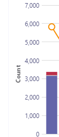

# <a name="data-and-reports-in-call-quality-dashboard-cqd"></a>Dados e relatórios no Painel de Qualidade de Chamada (CQD)

O Microsoft Call Quality Dashboard (CQD) usa um feed de dados quase em tempo real (NRT). Os registros de chamada estão disponíveis no CQD dentro de 30 minutos após o final de uma chamada. Os registros de chamada do pipeline NRT só estão disponíveis por alguns meses antes de eles ser removidos do conjunto de dados. 


## <a name="many-ways-to-access-cqd-data"></a>Muitas maneiras de acessar dados CQD

Você pode acessar dados CQD por várias vias diferentes. Escolha o que melhor atende às suas necessidades:

|  |  |
|---------|---------|
|Teams centro de administração [( https://admin.teams.microsoft.com) ](https://admin.teams.microsoft.com)    | Os dados do CQD são incluídos na página Usuários no centro de administração Teams, mostrando os dados mais comuns de que você precisa em um formato fácil de ler.  Você não pode personalizar dados CQD que você encontra em **Usuários**.  |
|Portal CQD [( https://cqd.teams.microsoft.com) ](https://cqd.teams.microsoft.com)     | Resumo robusto e relatórios detalhados que atendem à maioria das necessidades, com filtragem detalhada. Você também pode personalizar relatórios no portal do CQD. <br><br>Obter dois [modelos de relatório CQD para](#import-the-cqd-report-templates) ajudá-lo a analisar dados no portal do CQD.       |
|Power BI     | Use consultas diretas para exibir seus dados CQD em Power BI usando modelos de Power BI [personalizáveis.](CQD-Power-BI-query-templates.md) [Baixe Power BI de consulta para CQD](https://github.com/MicrosoftDocs/OfficeDocs-SkypeForBusiness/blob/live/Teams/downloads/CQD-Power-BI-query-templates.zip?raw=true).<br><br>Você também pode [usar a API REST para acessar dados CQD](/skypeforbusiness/management-tools/call-quality-dashboard/data-api) por meio Power BI. Use este método se quiser baixar seus dados CQD para que possa trabalhar neles offline. O benefício de usar esse método é o melhor desempenho, especialmente útil para conjuntos de dados grandes que se Power BI quando você está online.       |
|API do Graph     | Acesse os dados de qualidade da chamada usando a [API Graph](/graph/api/resources/callrecords-api-overview?view=graph-rest-beta). Esse é o método mais complexo, mas oferece mais controle e flexibilidade na análise dos dados de qualidade de chamada. Por exemplo, se você precisar juná-lo com outros dados para sua organização, poderá usar a API Graph para criar um modelo de dados e incorporar dados de qualidade de chamada.        |

## <a name="import-the-cqd-report-templates"></a>Importar os modelos de relatório do CQD

Baixe dois modelos de relatório [do CQD](https://aka.ms/qertemplates) com cura (Todas as Redes e Redes Gerenciadas) para ajudá-lo a se acelerar rapidamente com o CQD. O modelo Todas as Redes, embora otimizado para trabalhar com um arquivo de dados de construção, pode ser usado enquanto você trabalha para coletar e carregar informações de construção no CQD, conforme descrito na próxima seção.

**Para importar os modelos (. CQDX) em CQD**

1. No CQD, selecione **Relatórios Detalhados** no menu na parte superior da página.

2. No painel esquerdo, selecione **Importar**. Navegue até o primeiro modelo CQDX e selecione **Abrir**.

3. Depois que o modelo for carregado, uma janela pop-up exibirá a mensagem "A importação de relatório foi bem-sucedida". 

4. Repita as etapas 2 e 3 para o segundo modelo CQD.

   > [!NOTE]
   > Cada usuário deve importar os modelos CQD para sua instância do CQD. 


## <a name="euii-data"></a>Dados EUII

Por motivos de conformidade, os dados euII (informações de identificação do usuário final) (também conhecidos como informações de identificação pessoal ou PII) são mantidos apenas por 28 dias. À medida que os dados NRT cruzam a marca de 28 dias, os campos que contêm EUII são limpos, resultando em dados NRT sem EUII. Os campos que contêm dados EUII são:

- Endereço IP completo
- Endereço MAC (Controle de Acesso à Mídia)
- Identificador básico do Conjunto de Serviços (BSSID)
- URI sip (protocolo sip) (somente Skype for Business de sessão)
- Nome UPN
- Nome do Ponto de Extremidade da Máquina
- Comentários do Usuário Verbatim
- ID do objeto (a ID do objeto Active Directory do usuário do ponto de extremidade)

### <a name="admin-roles-with-and-without-euii-access"></a>Funções de administrador com e sem acesso EUII

Essas [funções RBAC](/azure/role-based-access-control/overview) **DO** têm acesso EUII:
- Administrador Global
- Teams Administrador do Serviço
- Teams Administrador de Comunicações
- Engenheiro de Suporte de Comunicações de Equipes
- Leitor Global
- Skype for Business Admin

Essas funções do RBAC **não têm** acesso a EUII:
- Leitor de relatórios
- Teams Especialista em Suporte de Comunicações


## <a name="date-controls"></a>Controles de data

O CQD dá suporte aos seguintes tipos de Tendência de Rolagem:

- 5 dias
- 7 dias
- 30 dias
- 60 dias
- 90 dias

O parâmetro Url Date aceita um campo Day. Os relatórios de dia de rolagem usam datas especificadas no formato YYYY-MM-DD como o último dia da tendência. O parâmetro URL Date "00" indica "hoje".

|URL| Data de término da tendência do dia de rolagem|
|:---|:---|
|<span>https:// <cqdv3> /spd/#/Dashboard/ <reportid> /2019-02/</span>   |Dia atual de fevereiro de 2019|
|<span>https:// <cqdv3> /spd/#/Dashboard/ <reportid> /2019-02-15/</span>|15 de fevereiro de 2019|
|<span>https:// <cqdv3> /spd/#/Dashboard/ <reportid> /00/</span>        |Dia Atual|
|||

Por padrão, o dia atual do mês é usado como o último dia da Tendência do Dia de Rolagem.


## <a name="data-available-in-cqd-reports"></a>Dados disponíveis em relatórios CQD

O resumo padrão e relatórios CQD detalhados podem ser tudo o que você precisa para gerenciar a qualidade de chamada para sua organização. Se precisar, você pode criar [relatórios personalizados.](#create-custom-detailed-reports) 

Se você quiser usar o Power BI para analisar seus dados CQD, leia Use Power BI para analisar dados [CQD para Teams](CQD-Power-BI-query-templates.md).

|Recurso|Relatórios de resumo|Relatórios detalhados|
|:--- |:--- |:--- |
|Métrica de compartilhamento de aplicativos | Não | Sim |
|Suporte a informações de criação de clientes | Sim | Sim |
|Suporte a informações do ponto de extremidade do cliente | Somente em <span> cqd.teams.microsoft.com<span/> | Somente em <span> cqd.teams.microsoft.com<span/> |
|Suporte à análise de detalhamento   | Não   | Sim   |
|Métricas de confiabilidade de mídia   | Não   | Sim   |
|Relatórios in-locar   | Sim   | Sim   |
|Relatórios de visão geral   | Sim   | Sim   |
|Conjunto de relatório por usuário   | Não   | Sim   |
|Personalização do conjunto de relatórios (adicionar, excluir, modificar relatórios)   | Não   | Sim   |
|Métricas de compartilhamento de tela baseada em vídeo   | Não   | Sim   |
|Métricas de vídeo   | Não   | Sim   |
|Quantidade de dados disponíveis   | Últimos 12 meses   | Últimos 12 meses   |
|Microsoft Teams dados   | Sim   | Sim   |
| | | |


 
### <a name="select-product-data-to-see-in-reports"></a>Selecionar dados do produto para ver em relatórios

Nos Relatórios resumo e Location-Enhanced, você  pode usar o drop-down Filtro de Produto para mostrar todos os dados do produto, somente Microsoft Teams dados ou somente dados Skype for Business Online.

> [!div class="mx-imgBorder"]
> 
  
Em relatórios detalhados, você pode usar a **dimensão Is Teams** para filtrar os dados para Microsoft Teams ou Skype for Business online.

## <a name="summary-reports"></a>Relatórios de resumo

Estes são os relatórios que você verá no Painel do CQD quando entrar pela primeira vez no CQD. Eles dão uma olhada rápida nas tendências de qualidade com relatórios diários, mensais e de tabelas para ajudar na identificação de sub-redes com baixa qualidade. 

| Guia | Descrição |
|---------|---------|
|Qualidade geral da chamada     | Agregação das outras três guias.       |
|Servidor — Cliente     |Detalhes dos fluxos entre os pontos de extremidade do servidor e do cliente.        |
|Client— Client     |Detalhes dos fluxos entre dois pontos de extremidade do cliente.        |
|SLA de qualidade de voz     |Informações sobre chamadas incluídas no [SLA](https://go.microsoft.com/fwlink/p/?linkid=846252)Skype for Business qualidade da voz.        |

### <a name="overall-call-quality-tab"></a>Guia Qualidade geral da Chamada

Use os dados nesta guia para avaliar o status e as tendências de qualidade de chamada com base em contagens de fluxo e porcentagens ruins. A legenda no canto superior direito mostra quais cores e elementos visuais representam essas métricas.

> [!div class="mx-imgBorder"]
> 
  
Fluxos são classificados em três grupos: Bom, Ruim e Não Classificado. Também há valores  *de % ruins calculados*  que dão a você a taxa de fluxos classificados como *Ruim*  para a contagem total de fluxos classificados. Como *% Ruim = Fluxos Ruins/ (Fluxos Ruins+ Fluxos Bons) * 100*,  o *% Ruim* não é afetado pela presença de vários fluxos não classificados. Para ver o que classifica um fluxo como ruim ou bom, consulte Classificação de fluxo no Painel de Qualidade [de Chamada.](stream-classification-in-call-quality-dashboard.md)
  
Use a escala à esquerda para medir os valores de contagem de fluxo.

> [!div class="mx-imgBorder"]
> 
  
Use a escala à direita para medir os valores % ruins.

> [!div class="mx-imgBorder"]
> 
  
Você também pode obter os valores numéricos reais ao passar o mouse sobre uma barra.
  
> [!NOTE]
> O exemplo a seguir é de um conjunto de dados de exemplo muito pequeno, e os valores não são realistas para uma implantação real.

> [!div class="mx-imgBorder"]
> 
  
O volume geral do fluxo ajuda a determinar a relevância das porcentagens ruins calculadas. Quanto menor o volume de fluxos gerais, menos confiáveis são os valores de porcentagem ruins relatados.
  
### <a name="server-client-tab-and-client-client-tabs"></a>Server-Client guia e Client-Client guias

Essas duas guias fornecem detalhes para os fluxos que ocorreram em seus cenários de ponto de extremidade para ponto de extremidade. A guia Server-Client tem quatro seções retutíveis que representam quatro cenários em que fluxos de mídia fluiriam.
  
- Com fio interno
- Com fio externo
- WiFi Inside
- WiFi Externo

Da mesma forma, a guia Client-Client tem cinco seções retutíveis:

- Com fio interno — com fio interno
- Com fio interno — com fio externo
- Com fio externo — com fio para fora
- Com fio interno — WiFi Inside
- Wired Inside — WiFi Outside

#### <a name="inside-versus-outside"></a>Inside versus Outside

O CQD classifica um fluxo como  *Inside*  ou *Outside*  usando informações de construção, se existir. Os pontos de extremidade de cada fluxo são associados a um endereço de sub-rede. Se a sub-rede estiver na lista das sub-redes marcadas insideCorp nas informações de construção carregadas, ela será considerada *Inside*. Se a criação de informações ainda não tiver sido carregada, o Inside Test sempre classifica os fluxos como *Outside*. 

O Inside Test para um Server-Client considera apenas o ponto de extremidade do cliente. Como os servidores estão sempre fora da perspectiva de um usuário, isso não é contabilado no teste.
  
#### <a name="wired-versus-wifi"></a>Com fio versus WiFi

Como os nomes indicam, os critérios de classificação se baseiam no tipo de conexões do cliente. O servidor está sempre com fio e não está incluído no cálculo. Em um determinado fluxo, se um dos dois pontos de extremidade estiver conectado a uma rede WiFi, o CQD a classifica como WiFi.

> [!NOTE]
> Dado um fluxo, se um dos dois pontos de extremidade estiver conectado a uma rede WiFi, ele será classificado como WiFi no CQD.
  
  
## <a name="tenant-data-information"></a>Informações sobre dados do locatário

O painel Relatórios de Resumo  do CQD inclui uma  página de Upload de Dados de Locatários, acessada selecionando a Upload de Dados de Locatário no menu configurações no canto superior direito. Esta página é usada para administradores carregarem suas próprias informações, como:

- Um mapa de endereço IP e informações geográficas.
- Um mapa de cada AP sem fio e seu endereço MAC.
- Um mapa do Ponto de Extremidade para o Ponto de Extremidade Make/Model/Type, etc.
  
Recomendamos que você carregue seus dados de locatário, construção e localização para que o CQD possa incluir essas informações em seus relatórios. Se você ainda não tiver carregado esses dados, leia Upload [locatário e criar dados.](CQD-upload-tenant-building-data.md) 


## <a name="detailed-reports"></a>Relatórios detalhados

| Nome | Descrição |
|---------|---------|
|Location-Enhanced Relatórios     |Mostra tendências de qualidade com base nas informações de local. Este relatório será exibido somente se você [tiver carregado seus dados de locatário.](CQD-upload-tenant-building-data.md)        |
|Relatórios de confiabilidade     |Inclui áudio, vídeo, compartilhamento de tela baseado em vídeo (VBSS) e relatórios de compartilhamento de aplicativos.        |
|Relatórios de Qualidade de Experiência     |Qualidade e confiabilidade de áudio para todos os clientes e dispositivos, incluindo salas de reunião. Esses relatórios são uma versão "emagreceda" dos modelos [de CQD](https://aka.ms/QERtemplates)baixáveis, com foco nas principais áreas para analisar a qualidade e a confiabilidade do áudio.         |
|Relatórios de Detalhamento de Qualidade     | Detalhamentos: Data por região, locais, sub-redes, hora e usuários.        |
|Relatórios de detalhamento de falha     | Detalhamentos: Data por região, locais, sub-redes, hora e usuários.        |
|Taxar meus relatórios de chamada     |Analisar classificações de chamada do usuário por região, local ou por usuário. Inclui comentários verbatim.         |
|Relatórios do Help Desk     |Os Relatórios do Help Desk pesquisam dados de chamada e reunião para usuários individuais, grupos de usuários ou todos. Incorporando dados de construção e EUII, esses relatórios ajudam a identificar possíveis problemas do sistema com base no local da rede, detalhes da conferência, dispositivos ou firmware.         |
|Relatórios de versão do cliente     |Resumo da versão do cliente: exibir as sessões e as contagens de usuários para cada versão do aplicativo cliente<br><br>Versão do cliente por usuário: exibir nomes de usuário para cada versão do aplicativo cliente <br><br>Filtros pré-construídos para Produto e Tipo de Cliente ajudam a focalizar as versões para clientes específicos.         |
|Relatórios de ponto de extremidade     |Mostra a qualidade da chamada por pontos de extremidade do computador (modelo e make do computador). Esses relatórios incluem a criação de dados, se você os tiver carregado.         |


## <a name="create-custom-detailed-reports"></a>Criar relatórios detalhados personalizados

Se os relatórios CQD padrão não atenderem às suas necessidades, use estas instruções para criar um relatório personalizado. Ou (a partir de janeiro de 2020) [Use Power BI para relatórios CQD. ](cqd-power-bi-query-templates.md)

Na lista pull-down de relatórios na parte superior da tela exibida ao entrar na tela Relatórios de Resumo Selecione Relatórios Detalhados \(  \) e, em **seguida, Novo**.  Clique **em Editar** em um relatório para ver o Editor de Consulta. Cada relatório é respaldado por uma consulta no cubo. Um relatório é uma visualização dos dados retornados por sua consulta. O Editor de Consultas ajuda você a editar essas consultas e as opções de exibição do relatório.

> [!IMPORTANT]
> O intervalo de rede pode ser usado para representar uma super-rede (combinação de várias sub-redes com um único prefixo de roteamento). Todos os novos carregamentos de construção serão verificados em busca de intervalos sobrepostos. Se você tiver carregado anteriormente um arquivo de construção, baixe o arquivo atual e o carregue novamente para identificar quaisquer sobreposições e corrigir o problema antes de carregar novamente. Qualquer sobreposição em arquivos carregados anteriormente pode resultar em mapeamentos errados de sub-redes para edifícios nos relatórios. Determinadas implementações vpn não relatam com precisão as informações da sub-rede. É recomendável que, ao adicionar uma sub-rede VPN ao arquivo de construção, em vez de uma entrada para a sub-rede, entradas separadas sejam adicionadas para cada endereço na sub-rede VPN como uma rede separada de 32 bits. Cada linha pode ter os mesmos metadados de construção. Por exemplo, em vez de uma linha para 172.16.18.0/24, você deve ter 256 linhas, com uma linha para cada endereço entre 172.16.18.0/32 e 172.16.18.255/32, inclusive.
>
> A coluna VPN é opcional e será padrão como 0.  Se o valor da coluna VPN for definido como 1, a sub-rede representada por essa linha será totalmente expandida para corresponder a todos os endereços IP dentro da sub-rede.  Use isso com moderação e somente para sub-redes VPN, pois a expansão total dessas sub-redes terá um impacto negativo nos tempos de consulta para consultas envolvendo a criação de dados.

Aponte para gráficos de barras e linhas de tendência no relatório para exibir valores detalhados. O relatório que tem foco mostrará o menu de ação: **Editar,** **Clonar,** **Excluir,** **Baixar** e **Exportar Árvore de Relatório.**


## <a name="query-filters"></a>Filtros de consulta

Os filtros de consulta são implementados usando o Editor de Consulta no CQD. Esses filtros são usados para reduzir o número de registros retornados pelo CQD, minimizando assim o tamanho geral e os tempos de consulta do relatório. Isso é especialmente útil para filtrar redes nãomanagedas. Os filtros listados na tabela a seguir usam expressões regulares (RegEx).


| Filter         | Descrição          | Exemplo de filtro de consulta CQD      |
|----------------|----------------------|-------------------------------|
| Nenhum valor em branco   | Alguns filtros não têm a opção de filtrar valores em branco. Para filtrar valores em branco manualmente, use a expressão em branco e desempate o filtro como Igual ou Não Igual, dependendo de suas necessidades.      | Second Building Name \<\> \^ \\ s\*\$                       |
| Excluir sub-redes comuns | Sem um arquivo de construção válido para separar o gerenciado de redes não gerenciadas, as redes home serão incluídas nos relatórios. Essas sub-redes internas estão fora do escopo do controle de IT e podem ser excluídas rapidamente de um relatório. As sub-redes comuns, conforme definido neste guia, são 10.0.0.0, 192.168.1.0 e 192.168.0.0. | Segunda Sub-rede \<\> 10.0.0.0 \| 192.168.0.0 \| 192.168.1.0 |
| Exibir somente dentro  | Usado para filtrar um relatório para gerenciado (dentro) ou não gerenciado (fora). O modelo CQD gerenciado já está pré-configurado com esses filtros.       | Second Inside Corp = Inside        |

## <a name="report-filters"></a>Filtros de relatório

Use filtros de relatório CQD para restringir o foco de suas investigações. Use filtros de relatório adicionando um filtro ao relatório renderizado no Editor de Consulta ou diretamente no relatório. Os filtros de relatório a seguir são usados em todos os modelos [CQD.](https://aka.ms/QERtemplates)


| Filter     | Descrição                            | Exemplo de filtro de relatório do CQD         |
|------------|----------------------------------------|-----------------------------------|
| Mês      | Comece com o ano primeiro, depois mês. | 2017-10                           |
| Alfabético | Filtra todos os caracteres alfabéticos. | [a-z]                             |
| Numérico    | Filtra para quaisquer caracteres numéricos.    | [0-9]                             |
| Porcentagem | Filtra para uma porcentagem.              | ([3-9] \\ .) \| ([3-9]) \| ([1-9][0-9]) |


### <a name="drill-down-filters"></a>Filtros de detalhamento

Os relatórios do CQD apresentam vários filtros de detalhamento, que são ferramentas poderosas para restringir o foco de suas investigações de qualidade de chamada. Se você selecionar um campo de detalhamento, o relatório abrirá automaticamente a guia apropriada e filtra o valor selecionado. Se essa guia tiver seus próprios campos de pesquisa e um estiver selecionado, ambos os conjuntos de filtros serão aplicados, restringindo progressivamente o conjunto de dados resultante.


#### <a name="adding-and-editing-drill-down-fields"></a>Adicionando e editando campos de detalhamento

Ao editar um relatório, você tem a opção de especificar campos de detalhamento próprios usando o Editor de Consulta.

Comece clicando **em ...** para o relatório que você deseja editar e selecione **Editar**.


Selecione uma Dimensão na lista no lado esquerdo do Editor de Consulta. Em seguida, clique na lista suspenso abaixo do rótulo **Navegar** para e selecione a guia e o grupo do expansador para o que você deseja que Dimension faça a análise. Observação: Atualmente, a funcionalidade de detalhamento só funciona navegando para guias diferentes. O suporte para o detalhamento de um expansador específico será adicionado posteriormente. Por fim, **clique em Fechar** para salvar suas alterações na Dimensão e clique em **Salvar** para salvar e fechar o Editor de Consulta.


### <a name="multi-select-filters"></a>Filtros de seleção multisseleccionáveis

Além da funcionalidade de detalhamento, o CQD também oferece suporte à especificação de Filtros com vários valores (filtros OR).

Para selecionar vários valores de filtro, comece adicionando um novo filtro ao relatório. Clique **+** ao lado do rótulo **Filtros,** insira o nome da Dimensão que você deseja usar e clique em **Adicionar**.


Em seguida, **clique em Pesquisar** (um ícone de lupa ao lado do novo filtro). Você verá um campo de texto e várias opções, incluindo **Selecionar Tudo** e **Inverter**. Insira um valor e clique em **Pesquisar** ao lado desse campo para pesquisar. Como alternativa, deixe o campo de texto vazio e clique em **Pesquisar** para exibir até as primeiras 100 opções.

```powershell
/filter/[AllStreams].[Second Tenant Id]\|[YOUR TENANT ID HERE]
```

Exemplo:  


### <a name="dashboard-level-filters"></a>Filtros de nível de painel
Determinados relatórios CQD têm filtros no nível do painel adicionados a eles, facilitando a filtragem por parâmetros comuns. Esses filtros aparecem fora das guias de relatório regulares e diretamente abaixo do filtro Produto e se aplicam a todos os filtros no Painel.


```powershell
/filter/[AllStreams].[Is Teams]|[TRUE | FALSE]
```

### <a name="url-filters"></a>Filtros de URL

O CQD dá suporte à adição de filtros à URL. Isso facilita o compartilhamento ou o indicador de uma consulta CQD. Você pode definir parâmetros na URL, como Mês de Tendência, ID de locatário ou idioma. Você também pode adicionar filtros de nível de produto ou painel à URL.
Excluir dados federados de relatórios CQD é útil quando você está remediando edifícios gerenciados ou redes onde pontos de extremidade federados podem influenciar seus relatórios.

Para adicionar um filtro, adicione o seguinte ao final da URL:

```console
/filter/[AllStreams].[Second Tenant Id]\|[YOUR TENANT ID HERE]
```

Exemplo:  

`https://cqd.teams.microsoft.com/cqd/#/1234567/2018-08/filter/[AllStreams].[Second Tenant Id]|[TENANTID]`

Para adicionar um filtro no nível do Painel a uma URL, esse filtro deve existir no CQD como um filtro de nível de produto ou painel. Adicione esses filtros à URL após o Mês de Tendência e antes dos parâmetros de URL:

`filter/DATA_MODEL_NAME|VALUE`

Por exemplo, para aplicar um valor de filtro de produto de Microsoft Teams, adicione o seguinte:

`filter/[AllStreams].[Is%20Teams]|[True]`

Sua URL inteira teria esta aparência:

`https://cqd.teams.microsoft.com/spd/#/Dashboard/2624085/2018-9/filter/[AllStreams].[Is%20Teams]|[True]`

Para aplicar filtros de URL com valores de várias seleções, separe cada valor com um caractere | pipe. Por exemplo:

`filter/[AllStreams].[Media%20Type]|[Video]|[Audio]|[VBSS]`

Se você especificar um nome ou valor inválido, o filtro URL não será aplicado.


Você pode usar um filtro de URL para filtrar cada relatório para uma dimensão específica. Os filtros de URL mais comuns são usados para filtrar relatórios para excluir a telemetria de participantes federados ou se concentrar apenas em Teams ou Skype for Business Online. Excluir dados federados de relatórios CQD é útil quando você está remediando edifícios gerenciados ou redes onde pontos de extremidade federados podem influenciar seus relatórios.

| Filter         | Descrição          | Exemplo de filtro de consulta CQD      |
|----------------|----------------------|-------------------------------|
| Nenhum valor em branco   | Alguns filtros não têm a opção de filtrar valores em branco. Para filtrar valores em branco manualmente, use a expressão em branco e desempate o filtro como Igual ou Não Igual, dependendo de suas necessidades.      | Second Building Name \<\> \^ \\ s\*\$                       |
| Excluir sub-redes comuns | Sem um arquivo de construção válido para separar o gerenciado de redes não gerenciadas, as redes home serão incluídas nos relatórios. Essas sub-redes internas estão fora do escopo do controle de IT e podem ser excluídas rapidamente de um relatório. As sub-redes comuns, conforme definido neste artigo, são 10.0.0.0, 192.168.1.0 e 192.168.0.0. | Segunda Sub-rede \<\> 10.0.0.0 \| 192.168.0.0 \| 192.168.1.0 |
| Exibir somente dentro  | Usado para filtrar um relatório para gerenciado (dentro) ou não gerenciado (fora). O modelo CQD gerenciado já está pré-configurado com esses filtros.       | Second Inside Corp = Inside        |


#### <a name="how-to-find-your-tenant-id"></a>Como encontrar sua ID de locatário

A ID do locatário no CQD corresponde à ID do Diretório no Azure. Se você não conhece a ID do Diretório, pode encontrá-la no portal do Azure:

1.  Entre no portal Microsoft Azure:<https://portal.azure.com>

2.  Selecione **Azure Active Directory**.

3.  Em **Gerenciar**, selecione **Propriedades**. Sua ID de locatário está na caixa **ID do** Diretório.

Você também pode encontrar sua ID de locatário usando o PowerShell: 

```powershell
Login-AzureRmAccount
```

## <a name="comparing-teams-and-skype-for-business-cqd-data"></a>Comparando Teams dados Skype for Business CQD

Ao analisar seus dados, você pode ver diferenças nos dados entre Teams e Skype for Business. Alguns motivos:
- Diferenças nos mecanismos para garantir o desempenho e a confiabilidade:
  - Teams tem reconexão automática e roaming rápido. Skype for Business não.
  - Teams gerenciamento dinâmico de largura de banda. Skype for Business não.
- Diferenças nos [intervalos de endereços IP](Office-365-URLs-IP-address-ranges.md) entre Teams e Skype for Business. Os Teams ip são mais novos, o que pode causar problemas de conectividade no firewall.


## <a name="related-topics"></a>Tópicos relacionados

[Melhorar e monitorar a qualidade de chamada para Teams](monitor-call-quality-qos.md)

[O que é CQD?](CQD-what-is-call-quality-dashboard.md)

[Configurar o Painel de Qualidade de Chamada (CQD)](turning-on-and-using-call-quality-dashboard.md)

[Upload locatário e a criação de dados](CQD-upload-tenant-building-data.md)

[Usar o CQD para gerenciar a qualidade de chamada e reunião](quality-of-experience-review-guide.md)

[Dimensões e medidas disponíveis no CQD](dimensions-and-measures-available-in-call-quality-dashboard.md)

[Classificação de fluxo no CQD](stream-classification-in-call-quality-dashboard.md)

[Usar Power BI para analisar dados CQD](CQD-Power-BI-query-templates.md)
