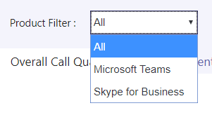

# <a name="data-and-reports-in-call-quality-dashboard-cqd"></a><span data-ttu-id="20fb9-103">Dados e relatórios no painel de qualidade de chamada (CQD)</span><span class="sxs-lookup"><span data-stu-id="20fb9-103">Data and reports in Call Quality Dashboard (CQD)</span></span>

<span data-ttu-id="20fb9-104">O Microsoft Call Quality Dashboard (CQD) usa um feed de dados near-real-time (NRT).</span><span class="sxs-lookup"><span data-stu-id="20fb9-104">Microsoft Call Quality Dashboard (CQD) uses a near-real-time (NRT) data feed.</span></span> <span data-ttu-id="20fb9-105">Os registros de chamadas estão disponíveis no CQD dentro de 30 minutos após o término de uma chamada.</span><span class="sxs-lookup"><span data-stu-id="20fb9-105">Call records are available in CQD within 30 minutes of the end of a call.</span></span> <span data-ttu-id="20fb9-106">Os registros de chamadas do pipeline do NRT só estão disponíveis por alguns meses antes de serem removidos do conjunto de dados.</span><span class="sxs-lookup"><span data-stu-id="20fb9-106">Call records from the NRT pipeline are only available for a few months before they are removed from the data set.</span></span> 


## <a name="many-ways-to-access-cqd-data"></a><span data-ttu-id="20fb9-107">Muitas maneiras de acessar dados do CQD</span><span class="sxs-lookup"><span data-stu-id="20fb9-107">Many ways to access CQD data</span></span>

<span data-ttu-id="20fb9-108">Você pode acessar os dados do CQD por várias avenidas diferentes.</span><span class="sxs-lookup"><span data-stu-id="20fb9-108">You can access CQD data by several different avenues.</span></span> <span data-ttu-id="20fb9-109">Escolha uma que melhor atenda às suas necessidades:</span><span class="sxs-lookup"><span data-stu-id="20fb9-109">Pick the one that best meets your needs:</span></span>

|  |  |
|---------|---------|
|<span data-ttu-id="20fb9-110">Centro de administração [do https://admin.teams.microsoft.com) ](https://admin.teams.microsoft.com) Teams (</span><span class="sxs-lookup"><span data-stu-id="20fb9-110">Teams admin center [(https://admin.teams.microsoft.com)](https://admin.teams.microsoft.com)</span></span>    | <span data-ttu-id="20fb9-111">Os dados do CQD estão incluídos na página **usuários** no centro de administração do Teams, mostrando os dados mais comuns que você precisa em um formato fácil de ler.</span><span class="sxs-lookup"><span data-stu-id="20fb9-111">CQD data is included on the **Users** page in the Teams admin center, showing the most common data you need in an easy-to-read format.</span></span> <span data-ttu-id="20fb9-112">Não é possível personalizar dados do CQD que você encontra em **usuários**.</span><span class="sxs-lookup"><span data-stu-id="20fb9-112">You can't customize CQD data that you find under **Users**.</span></span>  |
|<span data-ttu-id="20fb9-113">Portal [de CQD https://cqd.teams.microsoft.com) (](https://cqd.teams.microsoft.com)</span><span class="sxs-lookup"><span data-stu-id="20fb9-113">CQD portal [(https://cqd.teams.microsoft.com)](https://cqd.teams.microsoft.com)</span></span>     | <span data-ttu-id="20fb9-114">Resumos robustos e relatórios detalhados que atendem à maioria das necessidades, com filtragem de Drill-through.</span><span class="sxs-lookup"><span data-stu-id="20fb9-114">Robust summary and detailed reports that meet most needs, with drill-through filtering.</span></span> <span data-ttu-id="20fb9-115">Você também pode personalizar relatórios no portal do CQD.</span><span class="sxs-lookup"><span data-stu-id="20fb9-115">You can also customize reports in the CQD portal.</span></span> <br><br><span data-ttu-id="20fb9-116">Obtenha dois [modelos de relatório CQD](#import-the-cqd-report-templates) para ajudá-lo a analisar dados no portal do CQD.</span><span class="sxs-lookup"><span data-stu-id="20fb9-116">Get two [CQD report templates](#import-the-cqd-report-templates) to help you analyze data in the CQD portal.</span></span>       |
|<span data-ttu-id="20fb9-117">Power BI</span><span class="sxs-lookup"><span data-stu-id="20fb9-117">Power BI</span></span>     | <span data-ttu-id="20fb9-118">Use consultas diretas para exibir seus dados do CQD no Power BI usando [modelos personalizáveis do Power bi](CQD-Power-BI-query-templates.md).</span><span class="sxs-lookup"><span data-stu-id="20fb9-118">Use direct queries to view your CQD data in Power BI using [customizable Power BI templates](CQD-Power-BI-query-templates.md).</span></span> <span data-ttu-id="20fb9-119">[Baixe os modelos de consulta do Power bi para CQD](https://github.com/MicrosoftDocs/OfficeDocs-SkypeForBusiness/blob/live/Teams/downloads/CQD-Power-BI-query-templates.zip?raw=true).</span><span class="sxs-lookup"><span data-stu-id="20fb9-119">[Download Power BI query templates for CQD](https://github.com/MicrosoftDocs/OfficeDocs-SkypeForBusiness/blob/live/Teams/downloads/CQD-Power-BI-query-templates.zip?raw=true).</span></span><br><br><span data-ttu-id="20fb9-120">Você também pode [usar a API REST para acessar dados do CQD](https://docs.microsoft.com/skypeforbusiness/management-tools/call-quality-dashboard/data-api) por meio do Power bi.</span><span class="sxs-lookup"><span data-stu-id="20fb9-120">You can also [use the REST API to access CQD data](https://docs.microsoft.com/skypeforbusiness/management-tools/call-quality-dashboard/data-api) through Power BI.</span></span> <span data-ttu-id="20fb9-121">Use esse método se desejar baixar seus dados do CQD para que você possa trabalhar nele offline.</span><span class="sxs-lookup"><span data-stu-id="20fb9-121">Use this method if you want to download your CQD data so you can work on it offline.</span></span> <span data-ttu-id="20fb9-122">A vantagem de usar esse método é um desempenho melhor, especialmente útil para grandes conjuntos de dados que Bog no Power BI quando você estiver online.</span><span class="sxs-lookup"><span data-stu-id="20fb9-122">The benefit of using this method is better performance, especially useful for large data sets that bog down in Power BI when you're online.</span></span>       |
|<span data-ttu-id="20fb9-123">API do Graph</span><span class="sxs-lookup"><span data-stu-id="20fb9-123">Graph API</span></span>     | <span data-ttu-id="20fb9-124">Acesse os dados de qualidade da chamada usando a [API do Graph](https://docs.microsoft.com/graph/api/resources/callrecords-api-overview?view=graph-rest-beta).</span><span class="sxs-lookup"><span data-stu-id="20fb9-124">Access call quality data yourself using the [Graph API](https://docs.microsoft.com/graph/api/resources/callrecords-api-overview?view=graph-rest-beta).</span></span> <span data-ttu-id="20fb9-125">Esse é o método mais complexo, mas oferece o maior controle e flexibilidade na análise dos dados de qualidade da chamada.</span><span class="sxs-lookup"><span data-stu-id="20fb9-125">This is the most complex method, but it gives you the most control and flexibility in analyzing your call quality data.</span></span> <span data-ttu-id="20fb9-126">Por exemplo, se você precisar ingressar com outros dados para sua organização, poderá usar a API do Graph para criar um modelo de dados e incorporar os dados de qualidade da chamada.</span><span class="sxs-lookup"><span data-stu-id="20fb9-126">For example, if you need to join it with other data for your organization, you can use the Graph API to create a data model and incorporate call quality data.</span></span>        |

## <a name="import-the-cqd-report-templates"></a><span data-ttu-id="20fb9-127">Importar os modelos de relatório do CQD</span><span class="sxs-lookup"><span data-stu-id="20fb9-127">Import the CQD report templates</span></span>

<span data-ttu-id="20fb9-128">Baixe [dois modelos de relatório CQDs](https://aka.ms/qertemplates) (todas as redes e redes gerenciadas) para ajudá-lo a se familiarizar rapidamente com o CQD.</span><span class="sxs-lookup"><span data-stu-id="20fb9-128">Download [two curated CQD report templates](https://aka.ms/qertemplates) (All Networks and Managed Networks) to help you get up to speed quickly with CQD.</span></span> <span data-ttu-id="20fb9-129">O modelo todas as redes, embora otimizado para trabalhar com um arquivo de construção de dados, pode ser usado enquanto você trabalha para coletar e carregar informações de construção no CQD, conforme descrito na próxima seção.</span><span class="sxs-lookup"><span data-stu-id="20fb9-129">The All Networks template, though optimized to work with a building data file, can be used while you work toward collecting and uploading building information into CQD, as described in the next section.</span></span>

<span data-ttu-id="20fb9-130">**Para importar os modelos (. CQDX) em CQD**</span><span class="sxs-lookup"><span data-stu-id="20fb9-130">**To import the templates (.CQDX) into CQD**</span></span>

1. <span data-ttu-id="20fb9-131">No CQD, selecione **relatórios detalhados** no menu na parte superior da página.</span><span class="sxs-lookup"><span data-stu-id="20fb9-131">In CQD, select **Detailed Reports** from the menu at the top of the page.</span></span>

2. <span data-ttu-id="20fb9-132">No painel esquerdo, selecione **importar**.</span><span class="sxs-lookup"><span data-stu-id="20fb9-132">In the left panel, select **Import**.</span></span> <span data-ttu-id="20fb9-133">Navegue até o primeiro modelo CQDX e selecione **abrir**.</span><span class="sxs-lookup"><span data-stu-id="20fb9-133">Browse to the first CQDX template and select **Open**.</span></span>

3. <span data-ttu-id="20fb9-134">Após o carregamento do modelo, uma janela pop-up exibirá a mensagem "relatório de importação foi bem-sucedido".</span><span class="sxs-lookup"><span data-stu-id="20fb9-134">After the template is uploaded, a pop-up window will display the message "Report import was successful."</span></span> 

4. <span data-ttu-id="20fb9-135">Repita as etapas 2 e 3 para o segundo modelo CQD.</span><span class="sxs-lookup"><span data-stu-id="20fb9-135">Repeat steps 2 and 3 for the second CQD template.</span></span>

> [!NOTE]
> <span data-ttu-id="20fb9-136">Cada usuário deve importar os modelos do CQD para a sua instância do CQD.</span><span class="sxs-lookup"><span data-stu-id="20fb9-136">Each user must import the CQD templates into their CQD instance.</span></span> 


## <a name="euii-data"></a><span data-ttu-id="20fb9-137">Dados do EUII</span><span class="sxs-lookup"><span data-stu-id="20fb9-137">EUII data</span></span>

<span data-ttu-id="20fb9-138">Por motivos de conformidade, os dados de informações de identificação de usuário final (EUII) (também conhecidos como informações de identificação pessoal ou PII) só são mantidos por 30 dias.</span><span class="sxs-lookup"><span data-stu-id="20fb9-138">For compliance reasons, end-user identifiable information (EUII) data (also known as personally-identifiable information or PII) is only kept for 30 days.</span></span> <span data-ttu-id="20fb9-139">Como os dados do NRT atravessam a marca de 30 dias, os campos que contêm EUII são limpos, resultando em dados de NRT grátis do EUII.</span><span class="sxs-lookup"><span data-stu-id="20fb9-139">As NRT data crosses the 30-day mark, fields that contain EUII are cleared, resulting in EUII-free NRT data.</span></span> <span data-ttu-id="20fb9-140">Os campos que contêm dados EUII são:</span><span class="sxs-lookup"><span data-stu-id="20fb9-140">Fields that contain EUII data are:</span></span>

- <span data-ttu-id="20fb9-141">Endereço IP completo</span><span class="sxs-lookup"><span data-stu-id="20fb9-141">Full IP address</span></span>
- <span data-ttu-id="20fb9-142">Endereço de controle de acesso à mídia (MAC)</span><span class="sxs-lookup"><span data-stu-id="20fb9-142">Media Access Control (MAC) Address</span></span>
- <span data-ttu-id="20fb9-143">Identificador do conjunto de serviços básico (BSSID)</span><span class="sxs-lookup"><span data-stu-id="20fb9-143">Basic Service Set identifier (BSSID)</span></span>
- <span data-ttu-id="20fb9-144">URI de protocolo SIP (protocolo de iniciação de sessão) (somente Skype for Business)</span><span class="sxs-lookup"><span data-stu-id="20fb9-144">Session Initiation Protocol (SIP) URI (Skype for Business only)</span></span>
- <span data-ttu-id="20fb9-145">Nome UPN</span><span class="sxs-lookup"><span data-stu-id="20fb9-145">User Principal Name (UPN)</span></span>
- <span data-ttu-id="20fb9-146">Nome do ponto de extremidade do computador</span><span class="sxs-lookup"><span data-stu-id="20fb9-146">Machine Endpoint Name</span></span>
- <span data-ttu-id="20fb9-147">Feedback textual do usuário</span><span class="sxs-lookup"><span data-stu-id="20fb9-147">User Verbatim Feedback</span></span>
- <span data-ttu-id="20fb9-148">ID do objeto (a ID de objeto do Active Directory do usuário do ponto de extremidade)</span><span class="sxs-lookup"><span data-stu-id="20fb9-148">Object ID (the Active Directory object ID of the endpoint's user)</span></span>

### <a name="admin-roles-with-and-without-euii-access"></a><span data-ttu-id="20fb9-149">Funções de administrador com e sem o acesso EUII</span><span class="sxs-lookup"><span data-stu-id="20fb9-149">Admin roles with and without EUII access</span></span>

<span data-ttu-id="20fb9-150">Estas [RBAC](https://docs.microsoft.com/azure/role-based-access-control/overview) funções RBAC **DO** têm acesso EUII:</span><span class="sxs-lookup"><span data-stu-id="20fb9-150">These [RBAC](https://docs.microsoft.com/azure/role-based-access-control/overview) roles **DO** have EUII access:</span></span>
- <span data-ttu-id="20fb9-151">Administrador global</span><span class="sxs-lookup"><span data-stu-id="20fb9-151">Global Admin</span></span>
- <span data-ttu-id="20fb9-152">Administrador do teams Service</span><span class="sxs-lookup"><span data-stu-id="20fb9-152">Teams Service Admin</span></span>
- <span data-ttu-id="20fb9-153">Administrador de comunicações do teams</span><span class="sxs-lookup"><span data-stu-id="20fb9-153">Teams Communications Admin</span></span>
- <span data-ttu-id="20fb9-154">Engenheiro de Suporte de Comunicações de Equipes</span><span class="sxs-lookup"><span data-stu-id="20fb9-154">Teams Communications Support Engineer</span></span>
- <span data-ttu-id="20fb9-155">Leitor global</span><span class="sxs-lookup"><span data-stu-id="20fb9-155">Global Reader</span></span>
- <span data-ttu-id="20fb9-156">Administrador do Skype for Business</span><span class="sxs-lookup"><span data-stu-id="20fb9-156">Skype for Business Admin</span></span>

<span data-ttu-id="20fb9-157">Essas funções RBAC **não** têm acesso EUII:</span><span class="sxs-lookup"><span data-stu-id="20fb9-157">These RBAC roles **DON'T** have EUII access:</span></span>
- <span data-ttu-id="20fb9-158">Leitor de relatórios</span><span class="sxs-lookup"><span data-stu-id="20fb9-158">Reports Reader</span></span>
- <span data-ttu-id="20fb9-159">Especialista em suporte do teams Communications</span><span class="sxs-lookup"><span data-stu-id="20fb9-159">Teams Communications Support Specialist</span></span>


## <a name="date-controls"></a><span data-ttu-id="20fb9-160">Controles de data</span><span class="sxs-lookup"><span data-stu-id="20fb9-160">Date controls</span></span>

<span data-ttu-id="20fb9-161">O CQD dá suporte aos seguintes tipos de tendência revertida:</span><span class="sxs-lookup"><span data-stu-id="20fb9-161">CQD supports the following Rolling Trend types:</span></span>

- <span data-ttu-id="20fb9-162">5 dias</span><span class="sxs-lookup"><span data-stu-id="20fb9-162">5-day</span></span>
- <span data-ttu-id="20fb9-163">7 dias</span><span class="sxs-lookup"><span data-stu-id="20fb9-163">7-day</span></span>
- <span data-ttu-id="20fb9-164">30 dias</span><span class="sxs-lookup"><span data-stu-id="20fb9-164">30-day</span></span>
- <span data-ttu-id="20fb9-165">60-dia</span><span class="sxs-lookup"><span data-stu-id="20fb9-165">60-day</span></span>
- <span data-ttu-id="20fb9-166">90-dia</span><span class="sxs-lookup"><span data-stu-id="20fb9-166">90-day</span></span>

<span data-ttu-id="20fb9-167">O parâmetro de data da URL aceita um campo Day.</span><span class="sxs-lookup"><span data-stu-id="20fb9-167">The URL Date parameter accepts a Day field.</span></span> <span data-ttu-id="20fb9-168">Os relatórios de dia transcorrido usam datas especificadas no formato AAAA-MM-DD como o último dia da tendência.</span><span class="sxs-lookup"><span data-stu-id="20fb9-168">Rolling-day reports use dates specified in the YYYY-MM-DD format as the last day of the trend.</span></span> <span data-ttu-id="20fb9-169">O parâmetro de data de URL "00" indica "hoje".</span><span class="sxs-lookup"><span data-stu-id="20fb9-169">The URL Date parameter “00”  indicates “today”.</span></span>

|<span data-ttu-id="20fb9-170">URL</span><span class="sxs-lookup"><span data-stu-id="20fb9-170">URL</span></span>| <span data-ttu-id="20fb9-171">Data de término da tendência do dia transcorrido</span><span class="sxs-lookup"><span data-stu-id="20fb9-171">End date of Rolling Day Trend</span></span>|
|:---|:---|
|<span data-ttu-id="20fb9-172"><span>https:// <cqdv3> /SPD/#/Dashboard/ <reportid> /2019-02/</span></span><span class="sxs-lookup"><span data-stu-id="20fb9-172"><span>https://<cqdv3>/spd/#/Dashboard/<reportid>/2019-02/</span></span></span>   |<span data-ttu-id="20fb9-173">Dia atual de fevereiro de 2019</span><span class="sxs-lookup"><span data-stu-id="20fb9-173">Current Day of Feb 2019</span></span>|
|<span data-ttu-id="20fb9-174"><span>https:// <cqdv3> /SPD/#/Dashboard/ <reportid> /2019-02-15/</span></span><span class="sxs-lookup"><span data-stu-id="20fb9-174"><span>https://<cqdv3>/spd/#/Dashboard/<reportid>/2019-02-15/</span></span></span>|<span data-ttu-id="20fb9-175">15 de fevereiro de 2019</span><span class="sxs-lookup"><span data-stu-id="20fb9-175">Feb 15, 2019</span></span>|
|<span data-ttu-id="20fb9-176"><span>https:// <cqdv3> /SPD/#/Dashboard/ <reportid> /00/</span></span><span class="sxs-lookup"><span data-stu-id="20fb9-176"><span>https://<cqdv3>/spd/#/Dashboard/<reportid>/00/</span></span></span>        |<span data-ttu-id="20fb9-177">Dia atual</span><span class="sxs-lookup"><span data-stu-id="20fb9-177">Current Day</span></span>|
|||

<span data-ttu-id="20fb9-178">Por padrão, o dia atual do mês é usado como o último dia da tendência do dia transcorrido.</span><span class="sxs-lookup"><span data-stu-id="20fb9-178">By default, the current day of the month is used as the last day of the Rolling Day Trend.</span></span>


## <a name="data-available-in-cqd-reports"></a><span data-ttu-id="20fb9-179">Dados disponíveis nos relatórios do CQD</span><span class="sxs-lookup"><span data-stu-id="20fb9-179">Data available in CQD reports</span></span>

<span data-ttu-id="20fb9-180">O resumo padrão e os relatórios detalhados do CQD podem ser tudo o que você precisa para gerenciar a qualidade das chamadas para a sua organização. Se for necessário, você pode [criar relatórios personalizados](#create-custom-detailed-reports).</span><span class="sxs-lookup"><span data-stu-id="20fb9-180">The default summary and detailed CQD reports may be all you need to manage call quality for your org. If you need to, you can [create custom reports](#create-custom-detailed-reports).</span></span> 

<span data-ttu-id="20fb9-181">Se você quiser usar o Power BI para analisar os dados do CQD, leia [usar o Power bi para analisar os dados do CQD para o Teams](CQD-Power-BI-query-templates.md).</span><span class="sxs-lookup"><span data-stu-id="20fb9-181">If you want to use Power BI to analyze your CQD data, read [Use Power BI to analyze CQD data for Teams](CQD-Power-BI-query-templates.md).</span></span>

|<span data-ttu-id="20fb9-182">Recurso</span><span class="sxs-lookup"><span data-stu-id="20fb9-182">Feature</span></span>|<span data-ttu-id="20fb9-183">Relatórios de resumo</span><span class="sxs-lookup"><span data-stu-id="20fb9-183">Summary Reports</span></span>|<span data-ttu-id="20fb9-184">Relatórios detalhados</span><span class="sxs-lookup"><span data-stu-id="20fb9-184">Detailed Reports</span></span>|
|:--- |:--- |:--- |
|<span data-ttu-id="20fb9-185">Métrica de compartilhamento de aplicativos</span><span class="sxs-lookup"><span data-stu-id="20fb9-185">Application sharing metric</span></span> | <span data-ttu-id="20fb9-186">Não</span><span class="sxs-lookup"><span data-stu-id="20fb9-186">No</span></span> | <span data-ttu-id="20fb9-187">Sim</span><span class="sxs-lookup"><span data-stu-id="20fb9-187">Yes</span></span> |
|<span data-ttu-id="20fb9-188">Suporte a informações de prédio do cliente</span><span class="sxs-lookup"><span data-stu-id="20fb9-188">Customer building information support</span></span> | <span data-ttu-id="20fb9-189">Sim</span><span class="sxs-lookup"><span data-stu-id="20fb9-189">Yes</span></span> | <span data-ttu-id="20fb9-190">Sim</span><span class="sxs-lookup"><span data-stu-id="20fb9-190">Yes</span></span> |
|<span data-ttu-id="20fb9-191">Suporte a informações de ponto de extremidade do cliente</span><span class="sxs-lookup"><span data-stu-id="20fb9-191">Customer endpoint information support</span></span> | <span data-ttu-id="20fb9-192">Somente no <span> CQD.Teams.Microsoft.com<span/></span><span class="sxs-lookup"><span data-stu-id="20fb9-192">Only in <span>cqd.teams.microsoft.com<span/></span></span> | <span data-ttu-id="20fb9-193">Somente no <span> CQD.Teams.Microsoft.com<span/></span><span class="sxs-lookup"><span data-stu-id="20fb9-193">Only in <span>cqd.teams.microsoft.com<span/></span></span> |
|<span data-ttu-id="20fb9-194">Suporte para análise de busca detalhada</span><span class="sxs-lookup"><span data-stu-id="20fb9-194">Drill down analysis support</span></span>   | <span data-ttu-id="20fb9-195">Não</span><span class="sxs-lookup"><span data-stu-id="20fb9-195">No</span></span>   | <span data-ttu-id="20fb9-196">Sim</span><span class="sxs-lookup"><span data-stu-id="20fb9-196">Yes</span></span>   |
|<span data-ttu-id="20fb9-197">Métricas de confiabilidade de mídia</span><span class="sxs-lookup"><span data-stu-id="20fb9-197">Media reliability metrics</span></span>   | <span data-ttu-id="20fb9-198">Não</span><span class="sxs-lookup"><span data-stu-id="20fb9-198">No</span></span>   | <span data-ttu-id="20fb9-199">Sim</span><span class="sxs-lookup"><span data-stu-id="20fb9-199">Yes</span></span>   |
|<span data-ttu-id="20fb9-200">Relatórios prontos da caixa</span><span class="sxs-lookup"><span data-stu-id="20fb9-200">Out-of-the-box reports</span></span>   | <span data-ttu-id="20fb9-201">Sim</span><span class="sxs-lookup"><span data-stu-id="20fb9-201">Yes</span></span>   | <span data-ttu-id="20fb9-202">Sim</span><span class="sxs-lookup"><span data-stu-id="20fb9-202">Yes</span></span>   |
|<span data-ttu-id="20fb9-203">Relatórios de visão geral</span><span class="sxs-lookup"><span data-stu-id="20fb9-203">Overview reports</span></span>   | <span data-ttu-id="20fb9-204">Sim</span><span class="sxs-lookup"><span data-stu-id="20fb9-204">Yes</span></span>   | <span data-ttu-id="20fb9-205">Sim</span><span class="sxs-lookup"><span data-stu-id="20fb9-205">Yes</span></span>   |
|<span data-ttu-id="20fb9-206">Conjunto de relatórios por usuário</span><span class="sxs-lookup"><span data-stu-id="20fb9-206">Per-user report set</span></span>   | <span data-ttu-id="20fb9-207">Não</span><span class="sxs-lookup"><span data-stu-id="20fb9-207">No</span></span>   | <span data-ttu-id="20fb9-208">Sim</span><span class="sxs-lookup"><span data-stu-id="20fb9-208">Yes</span></span>   |
|<span data-ttu-id="20fb9-209">Personalização do conjunto de relatórios (adicionar, excluir, modificar relatórios)</span><span class="sxs-lookup"><span data-stu-id="20fb9-209">Report set customization (add, delete, modify reports)</span></span>   | <span data-ttu-id="20fb9-210">Não</span><span class="sxs-lookup"><span data-stu-id="20fb9-210">No</span></span>   | <span data-ttu-id="20fb9-211">Sim</span><span class="sxs-lookup"><span data-stu-id="20fb9-211">Yes</span></span>   |
|<span data-ttu-id="20fb9-212">Métricas de compartilhamento de tela com base em vídeo</span><span class="sxs-lookup"><span data-stu-id="20fb9-212">Video-based screen sharing metrics</span></span>   | <span data-ttu-id="20fb9-213">Não</span><span class="sxs-lookup"><span data-stu-id="20fb9-213">No</span></span>   | <span data-ttu-id="20fb9-214">Sim</span><span class="sxs-lookup"><span data-stu-id="20fb9-214">Yes</span></span>   |
|<span data-ttu-id="20fb9-215">Métricas de vídeo</span><span class="sxs-lookup"><span data-stu-id="20fb9-215">Video metrics</span></span>   | <span data-ttu-id="20fb9-216">Não</span><span class="sxs-lookup"><span data-stu-id="20fb9-216">No</span></span>   | <span data-ttu-id="20fb9-217">Sim</span><span class="sxs-lookup"><span data-stu-id="20fb9-217">Yes</span></span>   |
|<span data-ttu-id="20fb9-218">Quantidade de dados disponíveis</span><span class="sxs-lookup"><span data-stu-id="20fb9-218">Amount of data available</span></span>   | <span data-ttu-id="20fb9-219">Últimos 12 meses</span><span class="sxs-lookup"><span data-stu-id="20fb9-219">Last 12 months</span></span>   | <span data-ttu-id="20fb9-220">Últimos 12 meses</span><span class="sxs-lookup"><span data-stu-id="20fb9-220">Last 12 months</span></span>   |
|<span data-ttu-id="20fb9-221">Dados do Microsoft Teams</span><span class="sxs-lookup"><span data-stu-id="20fb9-221">Microsoft Teams data</span></span>   | <span data-ttu-id="20fb9-222">Sim</span><span class="sxs-lookup"><span data-stu-id="20fb9-222">Yes</span></span>   | <span data-ttu-id="20fb9-223">Sim</span><span class="sxs-lookup"><span data-stu-id="20fb9-223">Yes</span></span>   |
| | | |


 
### <a name="select-product-data-to-see-in-reports"></a><span data-ttu-id="20fb9-224">Selecionar dados do produto para ver nos relatórios</span><span class="sxs-lookup"><span data-stu-id="20fb9-224">Select product data to see in reports</span></span>

<span data-ttu-id="20fb9-225">Nos relatórios Resumo e local-avançado, você pode usar o menu suspenso **filtro do produto** para mostrar todos os dados do produto, somente dados do Microsoft Teams ou somente dados do Skype for Business online.</span><span class="sxs-lookup"><span data-stu-id="20fb9-225">In the Summary and Location-Enhanced Reports, you can use the **Product Filter** drop-down to show all product data, only Microsoft Teams data, or only Skype for Business Online data.</span></span>
  

  
<span data-ttu-id="20fb9-227">Em relatórios detalhados, você pode usar a dimensão **is Teams** para filtrar os dados para o Microsoft Teams ou dados do Skype for Business online.</span><span class="sxs-lookup"><span data-stu-id="20fb9-227">In Detailed reports, you can use the **Is Teams** dimension to filter the data to Microsoft Teams or Skype for Business Online data.</span></span>

## <a name="summary-reports"></a><span data-ttu-id="20fb9-228">Relatórios de resumo</span><span class="sxs-lookup"><span data-stu-id="20fb9-228">Summary Reports</span></span>

<span data-ttu-id="20fb9-229">Estes são os relatórios que você verá no painel CQD ao entrar pela primeira vez no CQD.</span><span class="sxs-lookup"><span data-stu-id="20fb9-229">These are the reports that you'll see on the CQD Dashboard when you first sign in to CQD.</span></span> <span data-ttu-id="20fb9-230">Elas fornecem uma visão geral de tendências de qualidade com relatórios diários, mensais e de tabela para ajudar a identificar sub-redes com baixa qualidade.</span><span class="sxs-lookup"><span data-stu-id="20fb9-230">They give you an at-a-glance look at quality trends with daily, monthly, and table reports to assist with identifying subnets that have poor quality.</span></span> 

|<span data-ttu-id="20fb9-231">Abas</span><span class="sxs-lookup"><span data-stu-id="20fb9-231">Tab</span></span>  |  |
|---------|---------|
|<span data-ttu-id="20fb9-232">Qualidade geral das chamadas</span><span class="sxs-lookup"><span data-stu-id="20fb9-232">Overall Call Quality</span></span>     | <span data-ttu-id="20fb9-233">Agregar das outras 3 guias</span><span class="sxs-lookup"><span data-stu-id="20fb9-233">Aggregate of the other 3 tabs</span></span>        |
|<span data-ttu-id="20fb9-234">Servidor — cliente</span><span class="sxs-lookup"><span data-stu-id="20fb9-234">Server—Client</span></span>     |<span data-ttu-id="20fb9-235">Detalhes dos fluxos entre os pontos de extremidade do servidor e do cliente</span><span class="sxs-lookup"><span data-stu-id="20fb9-235">Details of the streams between server and client endpoints</span></span>         |
|<span data-ttu-id="20fb9-236">Cliente — cliente</span><span class="sxs-lookup"><span data-stu-id="20fb9-236">Client—Client</span></span>     |<span data-ttu-id="20fb9-237">Detalhes dos fluxos entre dois pontos de extremidade do cliente</span><span class="sxs-lookup"><span data-stu-id="20fb9-237">Details of the streams between two client endpoints</span></span>         |
|<span data-ttu-id="20fb9-238">SLA de qualidade de voz</span><span class="sxs-lookup"><span data-stu-id="20fb9-238">Voice Quality SLA</span></span>     |<span data-ttu-id="20fb9-239">Informações sobre chamadas incluídas no [SLA](https://go.microsoft.com/fwlink/p/?linkid=846252) de qualidade de voz do Skype for Business</span><span class="sxs-lookup"><span data-stu-id="20fb9-239">Info about calls included in the Skype for Business voice quality [SLA](https://go.microsoft.com/fwlink/p/?linkid=846252)</span></span>         |

### <a name="overall-call-quality-tab"></a><span data-ttu-id="20fb9-240">Guia qualidade geral da chamada</span><span class="sxs-lookup"><span data-stu-id="20fb9-240">Overall Call Quality tab</span></span>

<span data-ttu-id="20fb9-241">Use os dados nesta guia para avaliar o status e as tendências da qualidade da chamada com base em contagens de fluxo e percentuais insatisfatórios.</span><span class="sxs-lookup"><span data-stu-id="20fb9-241">Use the data on this tab to evaluate call quality status and trends based on stream counts and poor percentages.</span></span> <span data-ttu-id="20fb9-242">A legenda no canto superior direito mostra quais elementos visuais e de cor representam essas métricas.</span><span class="sxs-lookup"><span data-stu-id="20fb9-242">The legend in the upper-right corner shows which color and visual elements represent these metrics.</span></span>
  

  
<span data-ttu-id="20fb9-244">Os fluxos são classificados em três grupos: satisfatório, fraco e não classificados.</span><span class="sxs-lookup"><span data-stu-id="20fb9-244">Streams are classified in three groups: Good, Poor, and Unclassified.</span></span> <span data-ttu-id="20fb9-245">Também são calculados valores de *baixa qualidade* que proporcionam a taxa de fluxos classificados como *deficientes* para a contagem total de fluxos classificados.</span><span class="sxs-lookup"><span data-stu-id="20fb9-245">There are also calculated  *Poor %*  values that give you the ratio of streams classified as *Poor*  to the total classified stream count.</span></span> <span data-ttu-id="20fb9-246">Como *baixa% = fluxos ruins/(fluxos de má qualidade + bom fluxo) \* 100*, os *% deficientes* não são afetados pela presença de vários fluxos não *classificados* .</span><span class="sxs-lookup"><span data-stu-id="20fb9-246">Since *Poor % = Poor streams/ (Poor streams+ Good streams) \* 100*, the *Poor %*  is unaffected by the presence of multiple *Unclassified*  streams.</span></span> <span data-ttu-id="20fb9-247">Para ver o que classifica um fluxo como ruim ou bom, consulte [classificação de fluxo no painel de qualidade de chamada](stream-classification-in-call-quality-dashboard.md).</span><span class="sxs-lookup"><span data-stu-id="20fb9-247">To see what classifies a stream as poor or good, refer to [Stream Classification in Call Quality Dashboard](stream-classification-in-call-quality-dashboard.md).</span></span>
  
<span data-ttu-id="20fb9-248">Use a escala à esquerda para medir os valores de contagem de fluxo.</span><span class="sxs-lookup"><span data-stu-id="20fb9-248">Use the scale on the left to measure the stream count values.</span></span>
  

  
<span data-ttu-id="20fb9-250">Use a escala à direita para medir os valores de baixa%.</span><span class="sxs-lookup"><span data-stu-id="20fb9-250">Use the scale on the right to measure the Poor % values.</span></span>
  

  
<span data-ttu-id="20fb9-252">Você também pode obter os valores numéricos reais passando o mouse sobre uma barra.</span><span class="sxs-lookup"><span data-stu-id="20fb9-252">You can also obtain the actual numerical values by hovering the mouse over a bar.</span></span>
  
> [!NOTE]
> <span data-ttu-id="20fb9-253">O exemplo a seguir é de um conjunto de dados de exemplo muito pequeno, e os valores não são realistas para uma implantação real.</span><span class="sxs-lookup"><span data-stu-id="20fb9-253">The following example is from a very small sample data set, and the values aren't realistic for an actual deployment.</span></span>
  

  
<span data-ttu-id="20fb9-255">O volume de fluxo geral ajuda a determinar a relevância das porcentagens insatisfatórias calculadas.</span><span class="sxs-lookup"><span data-stu-id="20fb9-255">The overall stream volume helps determine how relevant the calculated Poor percentages are.</span></span> <span data-ttu-id="20fb9-256">Quanto menor for o volume de fluxos gerais, menos confiável será a porcentagem dos valores de porcentagem deficientes reportados.</span><span class="sxs-lookup"><span data-stu-id="20fb9-256">The smaller the volume of overall streams, the less reliable the reported Poor percentage values are.</span></span>
  
### <a name="server-client-tab-and-client-client-tabs"></a><span data-ttu-id="20fb9-257">Guias servidor-cliente e cliente-cliente</span><span class="sxs-lookup"><span data-stu-id="20fb9-257">Server-Client tab and Client-Client tabs</span></span>

<span data-ttu-id="20fb9-258">Essas duas guias fornecem detalhes para os fluxos que ocorreram em seus cenários de ponto de extremidade a ponto de extremidade.</span><span class="sxs-lookup"><span data-stu-id="20fb9-258">These two tabs provide details for the streams that took place in their endpoint-to-endpoint scenarios.</span></span> <span data-ttu-id="20fb9-259">A guia servidor-cliente tem quatro seções recolhíveis que representam quatro cenários em que os fluxos de mídia fluiriam.</span><span class="sxs-lookup"><span data-stu-id="20fb9-259">The Server-Client tab has four collapsible sections that represent four scenarios under which media streams would flow.</span></span>
  
- <span data-ttu-id="20fb9-260">Com fio interno</span><span class="sxs-lookup"><span data-stu-id="20fb9-260">Wired Inside</span></span>
- <span data-ttu-id="20fb9-261">Com fio externo</span><span class="sxs-lookup"><span data-stu-id="20fb9-261">Wired Outside</span></span>
- <span data-ttu-id="20fb9-262">Sem fio dentro</span><span class="sxs-lookup"><span data-stu-id="20fb9-262">WiFi Inside</span></span>
- <span data-ttu-id="20fb9-263">Sem fio externo</span><span class="sxs-lookup"><span data-stu-id="20fb9-263">WiFi Outside</span></span>

<span data-ttu-id="20fb9-264">Da mesma forma, a guia cliente/cliente tem cinco seções recolhíveis:</span><span class="sxs-lookup"><span data-stu-id="20fb9-264">Similarly, the Client-Client tab has five collapsible sections:</span></span>

- <span data-ttu-id="20fb9-265">Com fio interno – com fio dentro</span><span class="sxs-lookup"><span data-stu-id="20fb9-265">Wired Inside — Wired Inside</span></span>
- <span data-ttu-id="20fb9-266">Com fio interno – com fio externo</span><span class="sxs-lookup"><span data-stu-id="20fb9-266">Wired Inside — Wired Outside</span></span>
- <span data-ttu-id="20fb9-267">Com fio externo — com fio externo</span><span class="sxs-lookup"><span data-stu-id="20fb9-267">Wired Outside — Wired Outside</span></span>
- <span data-ttu-id="20fb9-268">Com fio interno — WiFi Inside</span><span class="sxs-lookup"><span data-stu-id="20fb9-268">Wired Inside — WiFi Inside</span></span>
- <span data-ttu-id="20fb9-269">Com fio interno — WiFi externo</span><span class="sxs-lookup"><span data-stu-id="20fb9-269">Wired Inside — WiFi Outside</span></span>

#### <a name="inside-versus-outside"></a><span data-ttu-id="20fb9-270">Dentro e fora</span><span class="sxs-lookup"><span data-stu-id="20fb9-270">Inside versus Outside</span></span>

<span data-ttu-id="20fb9-271">O CQD classifica um fluxo de *dentro* ou de *fora* usando as informações de construção, se houver.</span><span class="sxs-lookup"><span data-stu-id="20fb9-271">CQD classifies a stream as  *Inside*  or *Outside*  using Building information, if it exists.</span></span> <span data-ttu-id="20fb9-272">Os pontos de extremidade de cada fluxo estão associados a um endereço de sub-rede.</span><span class="sxs-lookup"><span data-stu-id="20fb9-272">Endpoints of each stream are associated with a subnet address.</span></span> <span data-ttu-id="20fb9-273">Se a sub-rede estiver na lista das sub-redes marcadas InsideCorp nas informações de construção carregadas, ela será considerada *dentro*.</span><span class="sxs-lookup"><span data-stu-id="20fb9-273">If the subnet is in the list of the subnets marked InsideCorp in the uploaded Building information, then it is considered *Inside*.</span></span> <span data-ttu-id="20fb9-274">Se as informações de construção ainda não tiverem sido carregadas, então dentro do teste sempre classifica os fluxos como *fora*.</span><span class="sxs-lookup"><span data-stu-id="20fb9-274">If Building information has not yet been uploaded, then Inside Test always classifies the streams as *Outside*.</span></span> 

<span data-ttu-id="20fb9-275">O teste interno para um cenário de servidor-cliente apenas considera o ponto de extremidade do cliente.</span><span class="sxs-lookup"><span data-stu-id="20fb9-275">The Inside Test for a Server-Client scenario only considers the client endpoint.</span></span> <span data-ttu-id="20fb9-276">Como os servidores estão sempre fora da perspectiva de um usuário, isso não é contabilizado no teste.</span><span class="sxs-lookup"><span data-stu-id="20fb9-276">Because servers are always outside from a user's perspective, this isn't accounted for in the test.</span></span>
  
#### <a name="wired-versus-wifi"></a><span data-ttu-id="20fb9-277">Com fio versus WiFi</span><span class="sxs-lookup"><span data-stu-id="20fb9-277">Wired versus WiFi</span></span>

<span data-ttu-id="20fb9-278">Conforme os nomes indicam, os critérios de classificação são baseados no tipo de conexões de cliente.</span><span class="sxs-lookup"><span data-stu-id="20fb9-278">As the names indicate, the classification criteria is based on the type of client connections.</span></span> <span data-ttu-id="20fb9-279">O servidor é sempre conectado e não está incluído no cálculo.</span><span class="sxs-lookup"><span data-stu-id="20fb9-279">Server is always wired and it isn't included in the calculation.</span></span> <span data-ttu-id="20fb9-280">Em um determinado fluxo, se um dos dois pontos de extremidade estiver conectado a uma rede WiFi, o CQD o classificará como WiFi.</span><span class="sxs-lookup"><span data-stu-id="20fb9-280">In a given stream, if one of the two endpoints is connected to a WiFi network, then CQD classifies it as WiFi.</span></span>
> [!NOTE]
> <span data-ttu-id="20fb9-281">Dado um fluxo, se um dos dois pontos de extremidade estiver conectado a uma rede WiFi, ele será classificado como WiFi no CQD.</span><span class="sxs-lookup"><span data-stu-id="20fb9-281">Given a stream, if one of the two endpoints is connected to a WiFi network, then it is classified as WiFi in CQD.</span></span>
  
  
## <a name="tenant-data-information"></a><span data-ttu-id="20fb9-282">Informações de dados do locatário</span><span class="sxs-lookup"><span data-stu-id="20fb9-282">Tenant Data information</span></span>

<span data-ttu-id="20fb9-283">O painel relatórios de resumo CQD inclui uma página de **carregamento de dados de locatários** , acessada selecionando **carregar dados do locatário** no menu configurações no canto superior direito.</span><span class="sxs-lookup"><span data-stu-id="20fb9-283">The CQD Summary Reports dashboard includes a **Tenant Data Upload** page, accessed by selecting **Tenant Data Upload** from the settings menu in the top-right corner.</span></span> <span data-ttu-id="20fb9-284">Esta página é usada para os administradores carregarem suas próprias informações, como:</span><span class="sxs-lookup"><span data-stu-id="20fb9-284">This page is used for admins to upload their own information, such as:</span></span>

- <span data-ttu-id="20fb9-285">Um mapa de endereço IP e informações geográficas</span><span class="sxs-lookup"><span data-stu-id="20fb9-285">A map of IP address and geographical information</span></span>
- <span data-ttu-id="20fb9-286">Um mapa de cada AP sem fio e seu endereço MAC</span><span class="sxs-lookup"><span data-stu-id="20fb9-286">A map of each wireless AP and its MAC address</span></span>
- <span data-ttu-id="20fb9-287">Um mapa de ponto de extremidade para marca/modelo/tipo de ponto de extremidade, etc.</span><span class="sxs-lookup"><span data-stu-id="20fb9-287">A map of Endpoint to Endpoint Make/Model/Type, etc.</span></span>
  
<span data-ttu-id="20fb9-288">Recomendamos que você carregue os dados do locatário, da criação e do local para que o CQD possa incluir essas informações em seus relatórios.</span><span class="sxs-lookup"><span data-stu-id="20fb9-288">We recommend that you upload your tenant, building, and location data so CQD can include this information in your reports.</span></span> <span data-ttu-id="20fb9-289">Se você ainda não carregou esses dados, leia [locatário de carregamento de carregamento e dados de construção](CQD-upload-tenant-building-data.md).</span><span class="sxs-lookup"><span data-stu-id="20fb9-289">If you haven't already uploaded this data, read [Upload tenant and building data](CQD-upload-tenant-building-data.md).</span></span> 


## <a name="detailed-reports"></a><span data-ttu-id="20fb9-290">Relatórios detalhados</span><span class="sxs-lookup"><span data-stu-id="20fb9-290">Detailed reports</span></span>

|<span data-ttu-id="20fb9-291">Nome</span><span class="sxs-lookup"><span data-stu-id="20fb9-291">Name</span></span>  |  |
|---------|---------|
|<span data-ttu-id="20fb9-292">Localização-relatórios aprimorados</span><span class="sxs-lookup"><span data-stu-id="20fb9-292">Location-Enhanced Reports</span></span>     |<span data-ttu-id="20fb9-293">Mostra as tendências de qualidade com base nas informações de localização.</span><span class="sxs-lookup"><span data-stu-id="20fb9-293">Shows quality trends based on location information.</span></span> <span data-ttu-id="20fb9-294">Esse relatório só será exibido se você tiver [carregado seus dados locatário](CQD-upload-tenant-building-data.md).</span><span class="sxs-lookup"><span data-stu-id="20fb9-294">This report appears only if you've [uploaded your tenant data](CQD-upload-tenant-building-data.md).</span></span>        |
|<span data-ttu-id="20fb9-295">Relatórios de confiabilidade</span><span class="sxs-lookup"><span data-stu-id="20fb9-295">Reliability Reports</span></span>     |<span data-ttu-id="20fb9-296">Inclui áudio, vídeo, compartilhamento de tela baseado em vídeo (VBSS) e relatórios de compartilhamento de aplicativos</span><span class="sxs-lookup"><span data-stu-id="20fb9-296">Includes audio, video, video-based screen sharing (VBSS), and app sharing reports</span></span>         |
|<span data-ttu-id="20fb9-297">Relatórios de qualidade da experiência</span><span class="sxs-lookup"><span data-stu-id="20fb9-297">Quality of Experience Reports</span></span>     |<span data-ttu-id="20fb9-298">Qualidade de áudio e confiabilidade para todos os clientes e dispositivos, incluindo salas de reunião.</span><span class="sxs-lookup"><span data-stu-id="20fb9-298">Audio quality and reliability for all clients and devices, including meeting rooms.</span></span> <span data-ttu-id="20fb9-299">Esses relatórios são uma versão "reduzida" dos [modelos CQD](https://aka.ms/QERtemplates)para download, com foco em áreas essenciais para a análise da qualidade e da confiabilidade do áudio.</span><span class="sxs-lookup"><span data-stu-id="20fb9-299">These reports are a “slimmed-down” version of the downloadable [CQD templates](https://aka.ms/QERtemplates), focusing on key areas for analyzing audio quality and reliability.</span></span>         |
|<span data-ttu-id="20fb9-300">Relatórios de busca detalhada de qualidade</span><span class="sxs-lookup"><span data-stu-id="20fb9-300">Quality Drill Down Reports</span></span>     | <span data-ttu-id="20fb9-301">Buscas detalhadas: data por região, locais, sub-redes, hora e usuários</span><span class="sxs-lookup"><span data-stu-id="20fb9-301">Drill downs: Date by region, locations, subnets, hour, and users</span></span>         |
|<span data-ttu-id="20fb9-302">Relatórios de busca detalhada de falha</span><span class="sxs-lookup"><span data-stu-id="20fb9-302">Failure Drill Down Reports</span></span>     | <span data-ttu-id="20fb9-303">Buscas detalhadas: data por região, locais, sub-redes, hora e usuários</span><span class="sxs-lookup"><span data-stu-id="20fb9-303">Drill downs: Date by region, locations, subnets, hour, and users</span></span>        |
|<span data-ttu-id="20fb9-304">Classificar relatórios de minhas chamadas</span><span class="sxs-lookup"><span data-stu-id="20fb9-304">Rate My Call Reports</span></span>     |<span data-ttu-id="20fb9-305">Analisar classificações de chamadas do usuário por região, local ou por usuário.</span><span class="sxs-lookup"><span data-stu-id="20fb9-305">Analyze user call ratings by region, location, or by user.</span></span> <span data-ttu-id="20fb9-306">Inclui feedback textual.</span><span class="sxs-lookup"><span data-stu-id="20fb9-306">Includes verbatim feedback.</span></span>         |
|<span data-ttu-id="20fb9-307">Relatórios de Help Desk</span><span class="sxs-lookup"><span data-stu-id="20fb9-307">Help Desk Reports</span></span>     |<span data-ttu-id="20fb9-308">Relatórios de suporte técnico Veja os dados de chamada e reunião para usuários individuais, grupos de usuários ou todos.</span><span class="sxs-lookup"><span data-stu-id="20fb9-308">Help Desk Reports look at call and meeting data for individual users, groups of users, or everyone.</span></span> <span data-ttu-id="20fb9-309">A incorporação de dados de construção e EUII, esses relatórios ajudam a identificar possíveis problemas de sistema com base no local de rede, nos detalhes da conferência, em dispositivos ou firmware.</span><span class="sxs-lookup"><span data-stu-id="20fb9-309">Incorporating building and EUII data, these reports help identify possible system issues based on network location, conference details, devices, or firmware.</span></span>         |
|<span data-ttu-id="20fb9-310">Relatórios de versão do cliente</span><span class="sxs-lookup"><span data-stu-id="20fb9-310">Client Version Reports</span></span>     |<span data-ttu-id="20fb9-311">Resumo da versão do cliente: exibir as contagens de sessões e usuários para cada versão do aplicativo cliente</span><span class="sxs-lookup"><span data-stu-id="20fb9-311">Client Version Summary: View the Sessions and Users counts for each client app version</span></span><br><br><span data-ttu-id="20fb9-312">Versão do cliente por usuário: exibir nomes de usuário para cada versão do aplicativo cliente</span><span class="sxs-lookup"><span data-stu-id="20fb9-312">Client Version by User: View user names for each client app version</span></span> <br><br><span data-ttu-id="20fb9-313">Os filtros predefinidos para o produto e o tipo de cliente ajudam a concentrar as versões em clientes específicos.</span><span class="sxs-lookup"><span data-stu-id="20fb9-313">Pre-built filters for Product and Client Type help focus the versions to specific clients.</span></span>         |
|<span data-ttu-id="20fb9-314">Relatórios de ponto de extremidade</span><span class="sxs-lookup"><span data-stu-id="20fb9-314">Endpoint Reports</span></span>     |<span data-ttu-id="20fb9-315">Mostra a qualidade da chamada por pontos de extremidade do computador (marca e modelo do computador).</span><span class="sxs-lookup"><span data-stu-id="20fb9-315">Shows call quality by machine endpoints (computer make and model).</span></span> <span data-ttu-id="20fb9-316">Esses relatórios incluem a criação de dados, se você o carregou.</span><span class="sxs-lookup"><span data-stu-id="20fb9-316">These reports include building data, if you've uploaded it.</span></span>         |


## <a name="create-custom-detailed-reports"></a><span data-ttu-id="20fb9-317">Criar relatórios detalhados personalizados</span><span class="sxs-lookup"><span data-stu-id="20fb9-317">Create custom detailed reports</span></span>

<span data-ttu-id="20fb9-318">Se os relatórios padrão do CQD não atenderem às suas necessidades, use estas instruções para criar um relatório personalizado.</span><span class="sxs-lookup"><span data-stu-id="20fb9-318">If the default CQD reports don't meet your needs, use these instructions to create a custom report.</span></span> <span data-ttu-id="20fb9-319">Ou (desde janeiro de 2020), [use os relatórios do Power bi para CQD ](cqd-power-bi-query-templates.md).</span><span class="sxs-lookup"><span data-stu-id="20fb9-319">Or (as of January 2020) [Use Power BI for CQD reports ](cqd-power-bi-query-templates.md)instead.</span></span>

<span data-ttu-id="20fb9-320">Na lista suspensa de relatórios na parte superior da tela exibida ao fazer logon \( na tela **relatórios resumidos** , \) selecione **relatórios detalhados** e **novo**.</span><span class="sxs-lookup"><span data-stu-id="20fb9-320">From the pull-down list of reports at the top of the screen displayed at login \(the **Summary Reports** screen\) Select **Detailed Reports**  and then **New**.</span></span> <span data-ttu-id="20fb9-321">Clique em **Editar** em um relatório para ver o editor de consultas.</span><span class="sxs-lookup"><span data-stu-id="20fb9-321">Click **Edit** in a report to see the Query Editor.</span></span> <span data-ttu-id="20fb9-322">Cada relatório é respaldado por uma consulta no cubo.</span><span class="sxs-lookup"><span data-stu-id="20fb9-322">Each report is backed by a query into the cube.</span></span> <span data-ttu-id="20fb9-323">Um relatório é uma visualização dos dados retornados por sua consulta.</span><span class="sxs-lookup"><span data-stu-id="20fb9-323">A report is a visualization of the data returned by its query.</span></span> <span data-ttu-id="20fb9-324">O editor de consultas ajuda você a editar essas consultas e as opções de exibição do relatório.</span><span class="sxs-lookup"><span data-stu-id="20fb9-324">The Query Editor helps you edit these queries and the display options of the report.</span></span>
> [!IMPORTANT]
> <span data-ttu-id="20fb9-325">O intervalo de rede pode ser usado para representar um Supernet (combinação de várias sub-redes com um único prefixo de roteamento).</span><span class="sxs-lookup"><span data-stu-id="20fb9-325">The network range can be used to represent a supernet (combination of several subnets with a single routing prefix).</span></span> <span data-ttu-id="20fb9-326">Todos os novos carregamentos de construção serão verificados em busca de intervalos sobrepostos.</span><span class="sxs-lookup"><span data-stu-id="20fb9-326">All new building uploads will be checked for any overlapping ranges.</span></span> <span data-ttu-id="20fb9-327">Se você já carregou um arquivo de construção, baixe o arquivo atual e carregue-o novamente para identificar se há sobreposições e corrigir o problema antes de carregá-lo novamente.</span><span class="sxs-lookup"><span data-stu-id="20fb9-327">If you have previously uploaded a building file, you should download the current file and re-upload it to identify any overlaps and fix the issue before uploading again.</span></span> <span data-ttu-id="20fb9-328">Qualquer sobreposição em arquivos carregados anteriormente pode resultar em mapeamentos errados de sub-redes para prédios nos relatórios.</span><span class="sxs-lookup"><span data-stu-id="20fb9-328">Any overlap in previously uploaded files may result in the wrong mappings of subnets to buildings in the reports.</span></span> <span data-ttu-id="20fb9-329">Algumas implementações de VPN não reportam precisamente as informações de sub-rede.</span><span class="sxs-lookup"><span data-stu-id="20fb9-329">Certain VPN implementations do not accurately report the subnet information.</span></span> <span data-ttu-id="20fb9-330">É recomendável que, ao adicionar uma sub-rede VPN ao arquivo de construção, em vez de uma entrada para a sub-rede, as entradas separadas sejam adicionadas para cada endereço na sub-rede VPN como uma rede de 32 bits separada.</span><span class="sxs-lookup"><span data-stu-id="20fb9-330">It is recommended that when adding a VPN subnet to the building file, instead of one entry for the subnet, separate entries are added for each address in the VPN subnet as a separate 32-bit network.</span></span> <span data-ttu-id="20fb9-331">Cada linha pode ter os mesmos metadados de construção.</span><span class="sxs-lookup"><span data-stu-id="20fb9-331">Each row can have the same building metadata.</span></span> <span data-ttu-id="20fb9-332">Por exemplo, em vez de uma linha para 172.16.18.0/24, você deve ter 256 linhas, com uma linha para cada endereço entre 172.16.18.0/32 e 172.16.18.255/32, inclusive.</span><span class="sxs-lookup"><span data-stu-id="20fb9-332">For example, instead of one row for 172.16.18.0/24, you should have 256 rows, with one row for each address between 172.16.18.0/32 and 172.16.18.255/32, inclusive.</span></span>
>
> <span data-ttu-id="20fb9-333">A coluna VPN é opcional e será definida como padrão 0.</span><span class="sxs-lookup"><span data-stu-id="20fb9-333">The VPN column is optional and will default to 0.</span></span>  <span data-ttu-id="20fb9-334">Se o valor da coluna VPN estiver definido como 1, a sub-rede representada por essa linha será totalmente expandida para corresponder a todos os endereços IP dentro da sub-rede.</span><span class="sxs-lookup"><span data-stu-id="20fb9-334">If the VPN column's value is set to 1, the subnet represented by that row will be fully expanded to match all IP addresses within the subnet.</span></span>  <span data-ttu-id="20fb9-335">Use isso de maneira moderada e somente para sub-redes VPN, já que expandir totalmente essas sub-redes terá um impacto negativo nos tempos de consulta para consultas que envolvem a construção de dados.</span><span class="sxs-lookup"><span data-stu-id="20fb9-335">Please use this sparingly and only for VPN subnets since fully expanding these subnets will have a negative impact on query times for queries involving building data.</span></span>

<span data-ttu-id="20fb9-336">Aponte para gráficos de barras e linhas de tendências no relatório para exibir valores detalhados.</span><span class="sxs-lookup"><span data-stu-id="20fb9-336">Point to bar charts and trend lines in the report to display detailed values.</span></span> <span data-ttu-id="20fb9-337">O relatório que tem o foco mostrará o menu de ação: **Editar**, **clonar**, **excluir**, **baixar**e **Exportar árvore de relatórios**.</span><span class="sxs-lookup"><span data-stu-id="20fb9-337">The report that has focus will show the action menu: **Edit**, **Clone**, **Delete**, **Download**, and **Export Report Tree**.</span></span>


## <a name="query-filters"></a><span data-ttu-id="20fb9-338">Filtros de consulta</span><span class="sxs-lookup"><span data-stu-id="20fb9-338">Query filters</span></span>

<span data-ttu-id="20fb9-339">Os filtros de consulta são implementados usando o editor de consultas no CQD.</span><span class="sxs-lookup"><span data-stu-id="20fb9-339">Query filters are implemented by using the Query Editor in CQD.</span></span> <span data-ttu-id="20fb9-340">Esses filtros são usados para reduzir o número de registros retornados pela CQD, minimizando assim o tamanho geral do relatório e os tempos de consulta.</span><span class="sxs-lookup"><span data-stu-id="20fb9-340">These filters are used to reduce the number of records returned by CQD, thus minimizing the report’s overall size and query times.</span></span> <span data-ttu-id="20fb9-341">Isso é especialmente útil para filtrar redes não gerenciadas.</span><span class="sxs-lookup"><span data-stu-id="20fb9-341">This is especially useful for filtering out unmanaged networks.</span></span> <span data-ttu-id="20fb9-342">Os filtros listados na tabela a seguir usam expressões regulares (RegEx).</span><span class="sxs-lookup"><span data-stu-id="20fb9-342">The filters listed in the following table use regular expressions (RegEx).</span></span>


| <span data-ttu-id="20fb9-343">Filter</span><span class="sxs-lookup"><span data-stu-id="20fb9-343">Filter</span></span>         | <span data-ttu-id="20fb9-344">Descrição</span><span class="sxs-lookup"><span data-stu-id="20fb9-344">Description</span></span>          | <span data-ttu-id="20fb9-345">Exemplo de filtro de consulta CQD</span><span class="sxs-lookup"><span data-stu-id="20fb9-345">CQD query filter example</span></span>      |
|----------------|----------------------|-------------------------------|
| <span data-ttu-id="20fb9-346">Nenhum valor em branco</span><span class="sxs-lookup"><span data-stu-id="20fb9-346">No blank values</span></span>   | <span data-ttu-id="20fb9-347">Alguns filtros não têm a opção de filtrar valores em branco.</span><span class="sxs-lookup"><span data-stu-id="20fb9-347">Some filters don’t have the option to filter for blank values.</span></span> <span data-ttu-id="20fb9-348">Para filtrar valores em branco manualmente, use a expressão em branco e defina o filtro para igual ou não igual, dependendo das suas necessidades.</span><span class="sxs-lookup"><span data-stu-id="20fb9-348">To filter blank values manually, use the blank expression and set the filter to Equals or Not Equals, depending on your needs.</span></span>      | <span data-ttu-id="20fb9-349">Segundo nome da compilação \<\> \^ \\ s\*\$</span><span class="sxs-lookup"><span data-stu-id="20fb9-349">Second Building Name \<\> \^\\s\*\$</span></span>                       |
| <span data-ttu-id="20fb9-350">Excluir sub-redes comuns</span><span class="sxs-lookup"><span data-stu-id="20fb9-350">Exclude common subnets</span></span> | <span data-ttu-id="20fb9-351">Sem um arquivo de construção válido para separar o gerenciamento de redes não gerenciadas, as redes domésticas serão incluídas nos relatórios.</span><span class="sxs-lookup"><span data-stu-id="20fb9-351">Without a valid building file to separate managed from unmanaged networks, home networks will be included in the reports.</span></span> <span data-ttu-id="20fb9-352">Essas sub-redes residenciais estão fora do escopo do controle de ti e podem ser rapidamente excluídas de um relatório.</span><span class="sxs-lookup"><span data-stu-id="20fb9-352">These home subnets are outside the scope of IT’s control and can be quickly excluded from a report.</span></span> <span data-ttu-id="20fb9-353">As sub-redes comuns, conforme definido neste guia, são 10.0.0.0, 192.168.1.0 e 192.168.0.0.</span><span class="sxs-lookup"><span data-stu-id="20fb9-353">Common subnets, as defined in this guide, are 10.0.0.0, 192.168.1.0 and 192.168.0.0.</span></span> | <span data-ttu-id="20fb9-354">Segunda sub-rede \<\> 10.0.0.0 \| 192.168.0.0 \| 192.168.1.0</span><span class="sxs-lookup"><span data-stu-id="20fb9-354">Second Subnet \<\> 10.0.0.0 \| 192.168.0.0 \| 192.168.1.0</span></span> |
| <span data-ttu-id="20fb9-355">Exibir somente dentro</span><span class="sxs-lookup"><span data-stu-id="20fb9-355">View inside only</span></span>  | <span data-ttu-id="20fb9-356">Usado para filtrar um relatório para gerenciado (interno) ou não gerenciado (externo).</span><span class="sxs-lookup"><span data-stu-id="20fb9-356">Used to filter a report for managed (inside) or unmanaged (outside).</span></span> <span data-ttu-id="20fb9-357">O modelo CQD gerenciado já está pré-configurado com esses filtros.</span><span class="sxs-lookup"><span data-stu-id="20fb9-357">The managed CQD template is already preconfigured with these filters.</span></span>       | <span data-ttu-id="20fb9-358">Segunda interna Corp = Inside</span><span class="sxs-lookup"><span data-stu-id="20fb9-358">Second Inside Corp = Inside</span></span>        |

## <a name="report-filters"></a><span data-ttu-id="20fb9-359">Filtros de relatório</span><span class="sxs-lookup"><span data-stu-id="20fb9-359">Report filters</span></span>

<span data-ttu-id="20fb9-360">Use CQD filtros de relatório para restringir o foco de suas investigações.</span><span class="sxs-lookup"><span data-stu-id="20fb9-360">Use CQD report filters to narrow the focus of your investigations.</span></span> <span data-ttu-id="20fb9-361">Use filtros de relatório adicionando um filtro ao relatório renderizado no editor de consultas ou diretamente no relatório.</span><span class="sxs-lookup"><span data-stu-id="20fb9-361">Use report filters by adding a filter to the rendered report either in the Query Editor or directly in the report.</span></span> <span data-ttu-id="20fb9-362">Os filtros de relatório a seguir são usados em todos os [modelos do CQD](https://aka.ms/QERtemplates).</span><span class="sxs-lookup"><span data-stu-id="20fb9-362">The following report filters are used throughout the [CQD templates](https://aka.ms/QERtemplates).</span></span>


| <span data-ttu-id="20fb9-363">Filter</span><span class="sxs-lookup"><span data-stu-id="20fb9-363">Filter</span></span>     | <span data-ttu-id="20fb9-364">Descrição</span><span class="sxs-lookup"><span data-stu-id="20fb9-364">Description</span></span>                            | <span data-ttu-id="20fb9-365">Exemplo de filtro de relatório CQD</span><span class="sxs-lookup"><span data-stu-id="20fb9-365">CQD report filter example</span></span>         |
|------------|----------------------------------------|-----------------------------------|
| <span data-ttu-id="20fb9-366">Mensais</span><span class="sxs-lookup"><span data-stu-id="20fb9-366">Month</span></span>      | <span data-ttu-id="20fb9-367">Comece com o ano primeiro e, em seguida, mês.</span><span class="sxs-lookup"><span data-stu-id="20fb9-367">Start with the year first, then month.</span></span> | <span data-ttu-id="20fb9-368">2017-10</span><span class="sxs-lookup"><span data-stu-id="20fb9-368">2017-10</span></span>                           |
| <span data-ttu-id="20fb9-369">Maiúscula</span><span class="sxs-lookup"><span data-stu-id="20fb9-369">Alphabetic</span></span> | <span data-ttu-id="20fb9-370">Filtros para qualquer caractere alfabético.</span><span class="sxs-lookup"><span data-stu-id="20fb9-370">Filters for any alphabetic characters.</span></span> | <span data-ttu-id="20fb9-371">[a-z]</span><span class="sxs-lookup"><span data-stu-id="20fb9-371">[a-z]</span></span>                             |
| <span data-ttu-id="20fb9-372">Alfanumérico</span><span class="sxs-lookup"><span data-stu-id="20fb9-372">Numeric</span></span>    | <span data-ttu-id="20fb9-373">Filtros para caracteres numéricos.</span><span class="sxs-lookup"><span data-stu-id="20fb9-373">Filters for any numeric characters.</span></span>    | <span data-ttu-id="20fb9-374">[0-9]</span><span class="sxs-lookup"><span data-stu-id="20fb9-374">[0-9]</span></span>                             |
| <span data-ttu-id="20fb9-375">Porcentual</span><span class="sxs-lookup"><span data-stu-id="20fb9-375">Percentage</span></span> | <span data-ttu-id="20fb9-376">Filtros para uma porcentagem.</span><span class="sxs-lookup"><span data-stu-id="20fb9-376">Filters for a percentage.</span></span>              | <span data-ttu-id="20fb9-377">([3-9] \\ .) \| ([3-9]) \| ([1-9] [0-9])</span><span class="sxs-lookup"><span data-stu-id="20fb9-377">([3-9]\\.)\|([3-9])\|([1-9][0-9])</span></span> |


### <a name="drill-down-filters"></a><span data-ttu-id="20fb9-378">Filtros de detalhamento</span><span class="sxs-lookup"><span data-stu-id="20fb9-378">Drill-down filters</span></span>

<span data-ttu-id="20fb9-379">Os relatórios do CQD apresentam vários filtros de busca detalhada, que são ferramentas poderosas para restringir o foco das suas investigações de qualidade de chamada.</span><span class="sxs-lookup"><span data-stu-id="20fb9-379">CQD reports feature several drill-down filters, which are powerful tools for narrowing the focus of your call-quality investigations.</span></span> <span data-ttu-id="20fb9-380">Se você selecionar um campo de busca detalhada, o relatório abrirá automaticamente a guia apropriada e os filtros no valor selecionado.</span><span class="sxs-lookup"><span data-stu-id="20fb9-380">If you select a drill-down field, the report automatically opens the appropriate tab and filters on the selected value.</span></span> <span data-ttu-id="20fb9-381">Se essa guia tiver seus próprios campos de drill-down e um estiver selecionado, ambos os conjuntos de filtros serão aplicados, restringindo progressivamente o conjunto de dados resultante.</span><span class="sxs-lookup"><span data-stu-id="20fb9-381">If that tab has its own drill-down fields and one is selected, both sets of filters are applied, progressively narrowing the resulting data set.</span></span>


#### <a name="adding-and-editing-drill-down-fields"></a><span data-ttu-id="20fb9-383">Adicionar e editar campos de drill-down</span><span class="sxs-lookup"><span data-stu-id="20fb9-383">Adding and editing drill-down fields</span></span>

<span data-ttu-id="20fb9-384">Ao editar um relatório, você tem a opção de especificar os campos de busca detalhada usando o editor de consultas.</span><span class="sxs-lookup"><span data-stu-id="20fb9-384">When editing a report, you have the option to specify drill-down fields of your own using the Query Editor.</span></span>

<span data-ttu-id="20fb9-385">Comece clicando em **..** .</span><span class="sxs-lookup"><span data-stu-id="20fb9-385">Start by clicking **…**</span></span> <span data-ttu-id="20fb9-386">para o relatório que você deseja editar e, em seguida, selecione **Editar**.</span><span class="sxs-lookup"><span data-stu-id="20fb9-386">for the report you want to edit, then select **Edit**.</span></span>


<span data-ttu-id="20fb9-388">Selecione uma dimensão na lista no lado esquerdo do editor de consultas.</span><span class="sxs-lookup"><span data-stu-id="20fb9-388">Select a Dimension from the list on the left side of the Query Editor.</span></span> <span data-ttu-id="20fb9-389">Em seguida, clique na lista suspensa abaixo do botão **navegar para** etiquetar e selecione a guia e o grupo de expansores para os quais você deseja que a dimensão faça drill-through.</span><span class="sxs-lookup"><span data-stu-id="20fb9-389">Then click on the dropdown below the **Navigate To** label and select the tab and expander group that you want that Dimension to drill through to.</span></span> <span data-ttu-id="20fb9-390">Observação: no momento, a funcionalidade de busca detalhada só funciona ao navegar para guias diferentes.</span><span class="sxs-lookup"><span data-stu-id="20fb9-390">Note: Presently, drill-down functionality only works by navigating to different tabs.</span></span> <span data-ttu-id="20fb9-391">O suporte para análise detalhada para um expansor específico será adicionado mais tarde.</span><span class="sxs-lookup"><span data-stu-id="20fb9-391">Support for drilling through to a specific expander will be added later.</span></span> <span data-ttu-id="20fb9-392">Por fim, clique em **fechar** para salvar as alterações na dimensão e, em seguida, clique em **salvar** para salvar e fechar o editor de consultas.</span><span class="sxs-lookup"><span data-stu-id="20fb9-392">Finally, click **Close** to save your changes to the Dimension, then click **Save** to save and close the Query Editor.</span></span>


### <a name="multi-select-filters"></a><span data-ttu-id="20fb9-394">Filtros de seleção múltipla</span><span class="sxs-lookup"><span data-stu-id="20fb9-394">Multi-select filters</span></span>

<span data-ttu-id="20fb9-395">Além da funcionalidade de busca detalhada, o CQD também oferece suporte à especificação de filtros com vários valores (ou filtros).</span><span class="sxs-lookup"><span data-stu-id="20fb9-395">In addition to drill-down functionality, CQD also supports specifying Filters with multiple values (OR filters).</span></span>

<span data-ttu-id="20fb9-396">Para selecionar vários valores de filtro, comece adicionando um novo filtro ao relatório.</span><span class="sxs-lookup"><span data-stu-id="20fb9-396">In order to select multiple filter values, begin by adding a new filter to the report.</span></span> <span data-ttu-id="20fb9-397">Clique **+** ao lado do rótulo **filtros** , insira o nome da dimensão que você deseja usar e clique em **Adicionar**.</span><span class="sxs-lookup"><span data-stu-id="20fb9-397">Click **+** beside the **Filters** label, enter the name of the Dimension you want to use, and click **Add**.</span></span>


<span data-ttu-id="20fb9-399">Em seguida, clique em **Pesquisar** (um ícone de lupa ao lado do novo filtro).</span><span class="sxs-lookup"><span data-stu-id="20fb9-399">Then, click **Search** (a magnifying glass icon next to the new filter).</span></span> <span data-ttu-id="20fb9-400">Você verá um campo de texto e várias opções, incluindo **selecionar tudo** e **inverter**.</span><span class="sxs-lookup"><span data-stu-id="20fb9-400">You'll see a text field, and a number of options, including **Select All** and **Invert**.</span></span> <span data-ttu-id="20fb9-401">Insira um valor e clique em **Pesquisar** ao lado desse campo para pesquisar.</span><span class="sxs-lookup"><span data-stu-id="20fb9-401">Enter a value,  and click **Search** next to that field to search.</span></span> <span data-ttu-id="20fb9-402">Você também pode deixar o campo de texto vazio e clicar em **Pesquisar** para exibir até as primeiras opções do 100.</span><span class="sxs-lookup"><span data-stu-id="20fb9-402">Alternatively, leave the text field empty and click **Search** to view up to the first 100 options.</span></span>

```PowerShell
/filter/[AllStreams].[Second Tenant Id]\|[YOUR TENANT ID HERE]
```

<span data-ttu-id="20fb9-403">Exemplo</span><span class="sxs-lookup"><span data-stu-id="20fb9-403">Example:</span></span>  


### <a name="dashboard-level-filters"></a><span data-ttu-id="20fb9-405">Filtros em nível de painel</span><span class="sxs-lookup"><span data-stu-id="20fb9-405">Dashboard level filters</span></span>
<span data-ttu-id="20fb9-406">Certos relatórios do CQD têm filtros em nível de painel adicionados a eles, facilitando a filtragem por parâmetros comuns.</span><span class="sxs-lookup"><span data-stu-id="20fb9-406">Certain CQD reports have dashboard-level filters added to them, making it easy to filter by common parameters.</span></span> <span data-ttu-id="20fb9-407">Esses filtros são exibidos fora das guias relatório regular e logo abaixo do filtro de produto, e eles se aplicam a todos os filtros no painel.</span><span class="sxs-lookup"><span data-stu-id="20fb9-407">These filters appear outside the regular report tabs and directly beneath the Product filter, and they apply to all filters in the Dashboard.</span></span>


```PowerShell
/filter/[AllStreams].[Is Teams]|[TRUE | FALSE]
```

### <a name="url-filters"></a><span data-ttu-id="20fb9-409">Filtros de URL</span><span class="sxs-lookup"><span data-stu-id="20fb9-409">URL filters</span></span>

<span data-ttu-id="20fb9-410">CQD dá suporte à adição de filtros à URL.</span><span class="sxs-lookup"><span data-stu-id="20fb9-410">CQD supports adding filters to the URL.</span></span> <span data-ttu-id="20fb9-411">Isso facilita o compartilhamento ou a marcação de uma consulta CQD.</span><span class="sxs-lookup"><span data-stu-id="20fb9-411">This makes it easy to share or bookmark a CQD query.</span></span> <span data-ttu-id="20fb9-412">Você pode definir parâmetros na URL, como mês de tendências, ID de locatário ou idioma.</span><span class="sxs-lookup"><span data-stu-id="20fb9-412">You can define parameters in the URL, such as Trending Month, tenant ID, or language.</span></span> <span data-ttu-id="20fb9-413">Você também pode adicionar filtros de produto ou de nível de painel à URL.</span><span class="sxs-lookup"><span data-stu-id="20fb9-413">You can also add Product or Dashboard level filters to the URL.</span></span>
<span data-ttu-id="20fb9-414">Excluir dados federados dos relatórios do CQD é útil quando você está remediando prédios gerenciados ou redes nas quais pontos de extremidade federados podem influenciar seus relatórios.</span><span class="sxs-lookup"><span data-stu-id="20fb9-414">Excluding federated data from CQD reports is useful when you're remediating managed buildings or networks where federated endpoints might influence your reports.</span></span>

<span data-ttu-id="20fb9-415">Para adicionar um filtro, acrescente o seguinte ao final da URL:</span><span class="sxs-lookup"><span data-stu-id="20fb9-415">To add a filter, append the following to the end of the URL:</span></span>

```
/filter/[AllStreams].[Second Tenant Id]\|[YOUR TENANT ID HERE]
```

<span data-ttu-id="20fb9-416">Exemplo</span><span class="sxs-lookup"><span data-stu-id="20fb9-416">Example:</span></span>  

```https://cqd.teams.microsoft.com/cqd/#/1234567/2018-08/filter/[AllStreams].[Second Tenant Id]|[TENANTID]```

<span data-ttu-id="20fb9-417">Para adicionar um filtro em nível de painel a uma URL, esse filtro deve existir no CQD como um filtro de produto ou de nível de painel.</span><span class="sxs-lookup"><span data-stu-id="20fb9-417">To add a Dashboard-level filter to a URL, that filter must exist in CQD as either a Product or Dashboard level filter.</span></span> <span data-ttu-id="20fb9-418">Adicione esses filtros à URL após o mês de tendência e antes dos parâmetros de URL:</span><span class="sxs-lookup"><span data-stu-id="20fb9-418">Add these filters to the URL after the Trending Month and before the URL parameters:</span></span>

```filter/DATA_MODEL_NAME|VALUE```

<span data-ttu-id="20fb9-419">Por exemplo, para aplicar um valor de filtro de produto do Microsoft Teams, adicione o seguinte:</span><span class="sxs-lookup"><span data-stu-id="20fb9-419">For example, to apply a Product filter value of Microsoft Teams, you'd add the following:</span></span>

```filter/[AllStreams].[Is%20Teams]|[True]```

<span data-ttu-id="20fb9-420">Sua URL inteira teria uma aparência semelhante a esta:</span><span class="sxs-lookup"><span data-stu-id="20fb9-420">Your entire URL would look something like this:</span></span>

```https://cqd.teams.microsoft.com/spd/#/Dashboard/2624085/2018-9/filter/[AllStreams].[Is%20Teams]|[True]```

<span data-ttu-id="20fb9-421">Para aplicar filtros de URL com valores de seleção múltipla, separe cada valor com um caractere de pipe (|).</span><span class="sxs-lookup"><span data-stu-id="20fb9-421">To apply URL filters with multi-select values, separate each value with a pipe ( | ) character.</span></span> <span data-ttu-id="20fb9-422">Por exemplo:</span><span class="sxs-lookup"><span data-stu-id="20fb9-422">For example:</span></span>

```filter/[AllStreams].[Media%20Type]|[Video]|[Audio]|[VBSS]```

<span data-ttu-id="20fb9-423">Se você especificar um nome ou um valor inválido, o filtro de URL não será aplicado.</span><span class="sxs-lookup"><span data-stu-id="20fb9-423">If you specify an invalid name or value, the URL filter won't be applied.</span></span>


<span data-ttu-id="20fb9-424">Você pode usar um filtro de URL para filtrar cada relatório de uma dimensão específica.</span><span class="sxs-lookup"><span data-stu-id="20fb9-424">You can use a URL filter to filter every report for a specific dimension.</span></span> <span data-ttu-id="20fb9-425">Os filtros de URL mais comuns são usados para filtrar relatórios e excluir telemetria de participantes federados ou se concentrar apenas em equipes ou no Skype for Business online.</span><span class="sxs-lookup"><span data-stu-id="20fb9-425">The most common URL filters are used to filter reports to exclude federated participant telemetry, or focus on only Teams or Skype for Business Online.</span></span> <span data-ttu-id="20fb9-426">Excluir dados federados dos relatórios do CQD é útil quando você está remediando prédios gerenciados ou redes nas quais pontos de extremidade federados podem influenciar seus relatórios.</span><span class="sxs-lookup"><span data-stu-id="20fb9-426">Excluding federated data from CQD reports is useful when you're remediating managed buildings or networks where federated endpoints might influence your reports.</span></span>

| <span data-ttu-id="20fb9-427">Filter</span><span class="sxs-lookup"><span data-stu-id="20fb9-427">Filter</span></span>         | <span data-ttu-id="20fb9-428">Descrição</span><span class="sxs-lookup"><span data-stu-id="20fb9-428">Description</span></span>          | <span data-ttu-id="20fb9-429">Exemplo de filtro de consulta CQD</span><span class="sxs-lookup"><span data-stu-id="20fb9-429">CQD query filter example</span></span>      |
|----------------|----------------------|-------------------------------|
| <span data-ttu-id="20fb9-430">Nenhum valor em branco</span><span class="sxs-lookup"><span data-stu-id="20fb9-430">No blank values</span></span>   | <span data-ttu-id="20fb9-431">Alguns filtros não têm a opção de filtrar valores em branco.</span><span class="sxs-lookup"><span data-stu-id="20fb9-431">Some filters don't have the option to filter for blank values.</span></span> <span data-ttu-id="20fb9-432">Para filtrar valores em branco manualmente, use a expressão em branco e defina o filtro para igual ou não igual, dependendo das suas necessidades.</span><span class="sxs-lookup"><span data-stu-id="20fb9-432">To filter blank values manually, use the blank expression and set the filter to Equals or Not Equals, depending on your needs.</span></span>      | <span data-ttu-id="20fb9-433">Segundo nome da compilação \<\> \^ \\ s\*\$</span><span class="sxs-lookup"><span data-stu-id="20fb9-433">Second Building Name \<\> \^\\s\*\$</span></span>                       |
| <span data-ttu-id="20fb9-434">Excluir sub-redes comuns</span><span class="sxs-lookup"><span data-stu-id="20fb9-434">Exclude common subnets</span></span> | <span data-ttu-id="20fb9-435">Sem um arquivo de construção válido para separar o gerenciamento de redes não gerenciadas, as redes domésticas serão incluídas nos relatórios.</span><span class="sxs-lookup"><span data-stu-id="20fb9-435">Without a valid building file to separate managed from unmanaged networks, home networks will be included in the reports.</span></span> <span data-ttu-id="20fb9-436">Essas sub-redes residenciais estão fora do escopo do controle de ti e podem ser rapidamente excluídas de um relatório.</span><span class="sxs-lookup"><span data-stu-id="20fb9-436">These home subnets are outside the scope of IT's control and can be quickly excluded from a report.</span></span> <span data-ttu-id="20fb9-437">As sub-redes comuns, conforme definido neste artigo, são 10.0.0.0, 192.168.1.0 e 192.168.0.0.</span><span class="sxs-lookup"><span data-stu-id="20fb9-437">Common subnets, as defined in this article, are 10.0.0.0, 192.168.1.0 and 192.168.0.0.</span></span> | <span data-ttu-id="20fb9-438">Segunda sub-rede \<\> 10.0.0.0 \| 192.168.0.0 \| 192.168.1.0</span><span class="sxs-lookup"><span data-stu-id="20fb9-438">Second Subnet \<\> 10.0.0.0 \| 192.168.0.0 \| 192.168.1.0</span></span> |
| <span data-ttu-id="20fb9-439">Exibir somente dentro</span><span class="sxs-lookup"><span data-stu-id="20fb9-439">View inside only</span></span>  | <span data-ttu-id="20fb9-440">Usado para filtrar um relatório para gerenciado (interno) ou não gerenciado (externo).</span><span class="sxs-lookup"><span data-stu-id="20fb9-440">Used to filter a report for managed (inside) or unmanaged (outside).</span></span> <span data-ttu-id="20fb9-441">O modelo CQD gerenciado já está pré-configurado com esses filtros.</span><span class="sxs-lookup"><span data-stu-id="20fb9-441">The managed CQD template is already preconfigured with these filters.</span></span>       | <span data-ttu-id="20fb9-442">Segunda interna Corp = Inside</span><span class="sxs-lookup"><span data-stu-id="20fb9-442">Second Inside Corp = Inside</span></span>        |


#### <a name="how-to-find-your-tenant-id"></a><span data-ttu-id="20fb9-443">Como encontrar sua ID de locatário</span><span class="sxs-lookup"><span data-stu-id="20fb9-443">How to find your tenant ID</span></span>

<span data-ttu-id="20fb9-444">A ID do locatário em CQD corresponde à ID do diretório no Azure.</span><span class="sxs-lookup"><span data-stu-id="20fb9-444">The tenant ID in CQD corresponds to the Directory ID in Azure.</span></span> <span data-ttu-id="20fb9-445">Se não souber a ID do diretório, você pode encontrá-la no portal do Azure:</span><span class="sxs-lookup"><span data-stu-id="20fb9-445">If you don't know your Directory ID, you can find it in the Azure portal:</span></span>

1.  <span data-ttu-id="20fb9-446">Entre no portal do Microsoft Azure:<https://portal.azure.com></span><span class="sxs-lookup"><span data-stu-id="20fb9-446">Sign in to the Microsoft Azure portal: <https://portal.azure.com></span></span>

2.  <span data-ttu-id="20fb9-447">Selecione **Azure Active Directory**.</span><span class="sxs-lookup"><span data-stu-id="20fb9-447">Select **Azure Active Directory**.</span></span>

3.  <span data-ttu-id="20fb9-448">Em **gerenciar**, selecione **Propriedades**.</span><span class="sxs-lookup"><span data-stu-id="20fb9-448">Under **Manage**, select **Properties**.</span></span> <span data-ttu-id="20fb9-449">A ID do locatário está na caixa **ID do diretório** .</span><span class="sxs-lookup"><span data-stu-id="20fb9-449">Your tenant ID is in the **Directory ID** box.</span></span>

<span data-ttu-id="20fb9-450">Você também pode encontrar sua ID de locatário usando o PowerShell:</span><span class="sxs-lookup"><span data-stu-id="20fb9-450">You can also find your tenant ID by using PowerShell:</span></span> 
  ```
  Login-AzureRmAccount
  ```


## <a name="comparing-teams-and-skype-for-business-cqd-data"></a><span data-ttu-id="20fb9-451">Comparar o Microsoft Teams e os dados do Skype for Business CQD</span><span class="sxs-lookup"><span data-stu-id="20fb9-451">Comparing Teams and Skype for Business CQD data</span></span>

<span data-ttu-id="20fb9-452">Mesmo dentro da versão mais recente do CQD (cqd.teams.microsoft.com), você verá diferenças nos dados entre o Teams e o Skype for Business.</span><span class="sxs-lookup"><span data-stu-id="20fb9-452">Even within the latest CQD (cqd.teams.microsoft.com), you'll see differences in data between Teams and Skype for Business.</span></span> <span data-ttu-id="20fb9-453">Alguns motivos:</span><span class="sxs-lookup"><span data-stu-id="20fb9-453">Some reasons:</span></span>
- <span data-ttu-id="20fb9-454">Diferenças nos mecanismos para garantir o desempenho e a confiabilidade</span><span class="sxs-lookup"><span data-stu-id="20fb9-454">Differences in the mechanisms for ensuring performance and reliability</span></span>
  - <span data-ttu-id="20fb9-455">O Microsoft Teams tem reconexão automática e roaming rápido.</span><span class="sxs-lookup"><span data-stu-id="20fb9-455">Teams has auto-reconnect and fast roaming.</span></span> <span data-ttu-id="20fb9-456">O Skype for Business não.</span><span class="sxs-lookup"><span data-stu-id="20fb9-456">Skype for Business doesn't.</span></span>
  - <span data-ttu-id="20fb9-457">O Microsoft Teams tem gerenciamento dinâmico de largura de banda.</span><span class="sxs-lookup"><span data-stu-id="20fb9-457">Teams has dynamic bandwidth management.</span></span> <span data-ttu-id="20fb9-458">O Skype for Business não.</span><span class="sxs-lookup"><span data-stu-id="20fb9-458">Skype for Business doesn't.</span></span>
- <span data-ttu-id="20fb9-459">Diferenças em [intervalos de endereços IP](Office-365-URLs-IP-address-ranges.md) entre o Teams e o Skype for Business.</span><span class="sxs-lookup"><span data-stu-id="20fb9-459">Differences in [IP address ranges](Office-365-URLs-IP-address-ranges.md) between Teams and Skype for Business.</span></span> <span data-ttu-id="20fb9-460">Os intervalos de IP do teams são mais recentes, o que pode causar problemas de conectividade no firewall.</span><span class="sxs-lookup"><span data-stu-id="20fb9-460">The Teams IP ranges are newer, which could cause connectivity problems at the firewall.</span></span>

## <a name="open-cqd-from-the-skype-for-business-legacy-portal"></a><span data-ttu-id="20fb9-461">Abrir o CQD a partir do portal herdado do Skype for Business</span><span class="sxs-lookup"><span data-stu-id="20fb9-461">Open CQD from the Skype for Business legacy portal</span></span>

<span data-ttu-id="20fb9-462"> **usando o portal herdado do Skype for Business**</span><span class="sxs-lookup"><span data-stu-id="20fb9-462"> **Using the Skype for Business legacy portal**</span></span>

1. <span data-ttu-id="20fb9-463">Entre em sua organização do Office 365 usando uma conta de administrador e, em seguida, selecione o bloco **administrador** para abrir o centro de administração.</span><span class="sxs-lookup"><span data-stu-id="20fb9-463">Sign in to your Office 365 organization using an admin account, and then select the **Admin** tile to open the Admin center.</span></span>
2. <span data-ttu-id="20fb9-464">No painel esquerdo, em **centros de administração**, selecione **Microsoft Teams** para abrir o centro de administração do teams.</span><span class="sxs-lookup"><span data-stu-id="20fb9-464">In the left pane, under **Admin centers**, select **Microsoft Teams** to open the Teams admin center.</span></span>
3. <span data-ttu-id="20fb9-465">No centro de administração do Teams, selecione **portal herdado** no painel esquerdo, selecione **ferramentas**e, em seguida, selecione **painel de qualidade de chamada do Skype for Business online**.</span><span class="sxs-lookup"><span data-stu-id="20fb9-465">In the Teams admin center, select **Legacy Portal** in the left pane, select **Tools**, and then select **Skype for Business Online Call Quality Dashboard**.</span></span>

     

4. <span data-ttu-id="20fb9-467">Na página que é aberta, entre com sua conta de administrador global e forneça as credenciais da conta quando for solicitado.</span><span class="sxs-lookup"><span data-stu-id="20fb9-467">On the page that opens, sign in with your Global Administrator account, and then provide the credentials for the account when prompted.</span></span>

<span data-ttu-id="20fb9-468">Após a primeira vez que você se conectar, o CQD começará a coletar e processar dados.</span><span class="sxs-lookup"><span data-stu-id="20fb9-468">After the first time you sign in, CQD will begin collecting and processing data.</span></span> 

> [!IMPORTANT]
> <span data-ttu-id="20fb9-469">A partir de dezembro de 2019, você ainda pode acessar a versão mais antiga do CQD (cqd.lync.com), embora o portal herdado forneça um link para o CQD mais recente (cqd.teams.microsoft.com).</span><span class="sxs-lookup"><span data-stu-id="20fb9-469">As of December 2019, you can still access the older version of CQD (cqd.lync.com), although the legacy portal gives you a link to the latest CQD (cqd.teams.microsoft.com).</span></span> <span data-ttu-id="20fb9-470">Por fim, a versão mais antiga do CQD será descomissionada.</span><span class="sxs-lookup"><span data-stu-id="20fb9-470">Eventually, the older version of CQD will be decommissioned.</span></span> <span data-ttu-id="20fb9-471">A partir de 1 ° de julho de 2020, a versão mais antiga do CQD acessa os dados do novo CQD ( https://CQD.teams.microsoft.com) , e você não pode mais exportar dados de criação e de relatório.</span><span class="sxs-lookup"><span data-stu-id="20fb9-471">As of July 1, 2020, the older version of CQD accesses data from the new CQD (https://CQD.teams.microsoft.com), and you can no longer export building and report data.</span></span> <span data-ttu-id="20fb9-472">Um dia no final de 2020, desativaremos o antigo CQD, e você não poderá mais acessá-lo.</span><span class="sxs-lookup"><span data-stu-id="20fb9-472">Sometime in late 2020, we'll turn off the old CQD and you'll no longer be able to access it.</span></span>


## <a name="related-topics"></a><span data-ttu-id="20fb9-473">Tópicos relacionados</span><span class="sxs-lookup"><span data-stu-id="20fb9-473">Related topics</span></span>

[<span data-ttu-id="20fb9-474">Melhorar e monitorar a qualidade da chamada para equipes</span><span class="sxs-lookup"><span data-stu-id="20fb9-474">Improve and monitor call quality for Teams</span></span>](monitor-call-quality-qos.md)

[<span data-ttu-id="20fb9-475">O que é CQD?</span><span class="sxs-lookup"><span data-stu-id="20fb9-475">What is CQD?</span></span>](CQD-what-is-call-quality-dashboard.md)

[<span data-ttu-id="20fb9-476">Configurar o painel de qualidade da chamada (CQD)</span><span class="sxs-lookup"><span data-stu-id="20fb9-476">Set up Call Quality Dashboard (CQD)</span></span>](turning-on-and-using-call-quality-dashboard.md)

[<span data-ttu-id="20fb9-477">Carregar dados do locatário e construção</span><span class="sxs-lookup"><span data-stu-id="20fb9-477">Upload tenant and building data</span></span>](CQD-upload-tenant-building-data.md)

[<span data-ttu-id="20fb9-478">Usar o CQD para gerenciar a qualidade da chamada e da reunião</span><span class="sxs-lookup"><span data-stu-id="20fb9-478">Use CQD to manage call and meeting quality</span></span>](quality-of-experience-review-guide.md)

[<span data-ttu-id="20fb9-479">Dimensões e medidas disponíveis no CQD</span><span class="sxs-lookup"><span data-stu-id="20fb9-479">Dimensions and measures available in CQD</span></span>](dimensions-and-measures-available-in-call-quality-dashboard.md)

[<span data-ttu-id="20fb9-480">Classificação de fluxo no CQD</span><span class="sxs-lookup"><span data-stu-id="20fb9-480">Stream Classification in CQD</span></span>](stream-classification-in-call-quality-dashboard.md)

[<span data-ttu-id="20fb9-481">Usar o Power BI para analisar dados do CQD</span><span class="sxs-lookup"><span data-stu-id="20fb9-481">Use Power BI to analyze CQD data</span></span>](CQD-Power-BI-query-templates.md)
