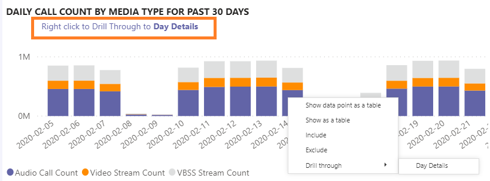
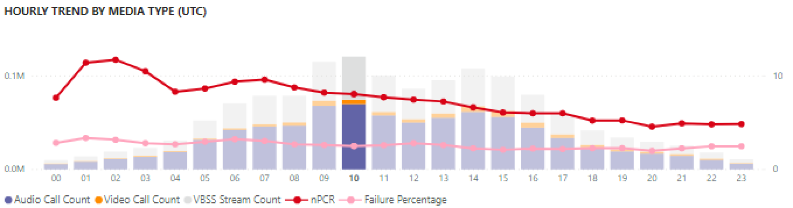
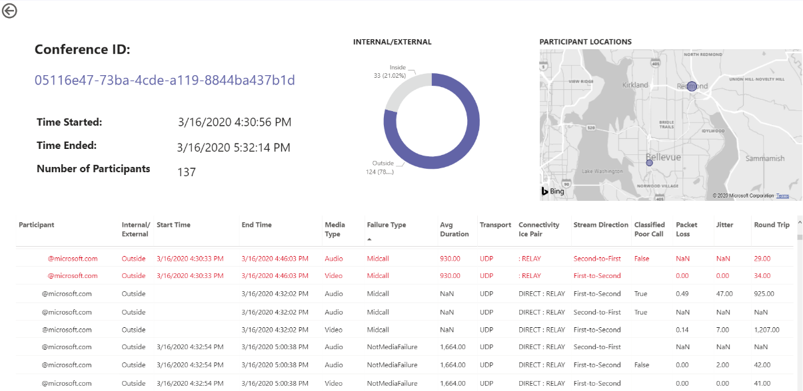
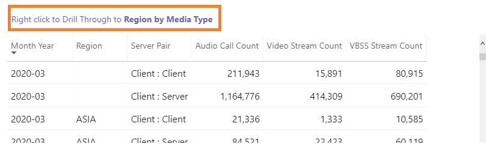
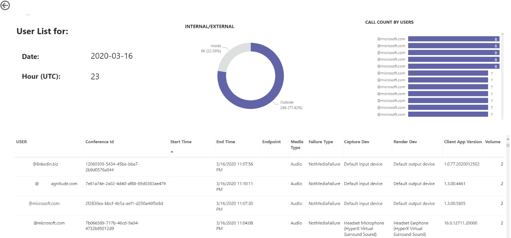

# Exibir a utilização do Microsoft Teams no Power BI usando dados CQD

Novidade em março de 2020, adicionamos um relatório de utilização do Teams aos nossos modelos de consulta do [Power BI para download para CQD](https://github.com/MicrosoftDocs/OfficeDocs-SkypeForBusiness/blob/live/Teams/downloads/CQD-Power-BI-query-templates.zip?raw=true). 

Esses novos relatórios de Utilização do Teams permitem que você veja como (e quanto) os usuários estão usando o Microsoft Teams acessando os dados do CQD (Painel de Qualidade de Chamadas) do Teams. Esses relatórios destinam-se a ser um local centralizado para o qual administradores e líderes de negócios podem acessar rapidamente esses dados.

O relatório do Power BI de Utilização do Teams consiste em dois relatórios principais: Resumo **[da Contagem de](#call-count-summary-report)** Chamadas e **[Resumo de Minutos de Áudio](#audio-minutes-summary-report)**. Os [relatórios uso diário](#daily-usage), [detalhes](#regional-audio-details) regionais de [áudio, detalhes](#conference-details) de conferência e lista de usuários são reproduzidos quando um usuário aproveita os relatórios de busca detalhada, anotados nas descrições abaixo.

> [!NOTE]
> Os dados de criação e sub-rede devem ser preenchidos para fornecer recursos regionais e de filtragem de rede.

## Relatório de Resumo da Contagem de Chamadas

A página principal (Resumo da Contagem de Chamadas) fornece imediatamente o número de sessões de compartilhamento de áudio, vídeo e tela nos últimos 30 e 90 dias, conforme anotado no título da seção. Os dados inicialmente exibidos são para a organização como um todo e podem ser filtrados usando as opções suspensas da segmentação de dados no lado esquerdo da página.

1. À direita das listas suspensas da segmentação de dados, o número de chamadas por tipo de mídia é dividido em uma exibição interna/externa nos últimos trinta dias. Podemos ver por meio da captura de tela acima que há mais chamadas acontecendo de locais organizacionais externos, o que faz sentido considerando o ambiente global atual.
  

1. À direita da caixa de contagem de tipos de mídia, temos a Contagem de Chamadas Mensais por Tipo de Mídia dos últimos 90 dias. Cada coluna e tipo de mídia podem ser focalizados para exibir a contagem de um mês anterior ou do mês atual até a data, fornecendo informações de tendência de uso.
  
 

1. O grafo do meio funciona como o grafo de 90 dias, no entanto, ele fornece uma exibição de uso diário dos últimos 30 dias e permite que um usuário clique com o botão direito do mouse e faça uma busca detalhada em detalhes de um dia específico.
  

Na seção inferior esquerda da página, você encontrará uma tabela que fornece valores totais para cada tipo de mídia no ano passado. 
    
       

À direita da tabela, um gráfico de barras mostra os clientes com mais uso (chamadas/fluxos) dos últimos 30 dias.
   

O último conjunto de gráficos para esta página mostra cada tipo de mídia individualmente, com um detalhamento mostrando o uso de conferência e P2P. Os gráficos a seguir mostram que há um número significativamente maior de uso de conferência em comparação com p2P.
  

## Relatório de Resumo de Minutos de Áudio

No relatório de uso de Minutos de Áudio, o uso total de minutos é fornecido por meio de algumas exibições diferentes. 

Temos o resumo de uso de trinta dias mostrado ao lado das segmentações de dados como fácil de consumir caixas de texto. O número superior mostra o total de trinta dias, com detalhamentos internos e externos abaixo disso.

O gráfico de barras superior direita fornece uma exibição anual do uso de áudio de conferência. Passe o mouse sobre o mês para mostrar os minutos de áudio da conferência.

Para mostrar a diferença no áudio de conferência e P2P, o gráfico inferior esquerdo usa todo o áudio do ano passado e o divide entre os dois tipos.

O último gráfico da página Minutos de áudio mostra o uso de minutos de áudio em uma sobreposição global do mapa. Esse gráfico só funcionará se os dados de compilação e sub-rede são carregados no locatário. A sobreposição do gráfico de pizza no mapa pode ser detalhada, fornecendo posteriormente o uso regional de áudio.

## Funcionalidades de detalhamento

Conforme mencionado anteriormente, os usuários podem analisar os relatórios de uso diário e regional.

### Uso Diário

O relatório uso diário permite que um administrador identifique períodos de pico de consumo ao longo de um dia. Além do uso, também podemos capturar comentários e sentimentos gerais do usuário para esse dia.

O relatório de uso diário exibe o número de compartilhamentos de áudio, vídeo e tela para o dia selecionado com a capacidade adicional de diferenciar entre conectividade interna e externa. Um detalhamento de Conferência e Ponto a Ponto está no direito imediato da caixa de total de modalidades. O canto superior direito do relatório fornece uma lista de conferências com sua ID e participantes associados para o dia. A lista de conferências também fornece uma busca detalhada adicional para o relatório detalhes da conferência. SUBSTITUIR GRÁFICO

O gráfico de barras na área central permite que o usuário identifique períodos de pico de consumo ao longo de um dia. Os usuários podem fazer uma busca detalhada na hora representada no grafo que apresentará o relatório da Lista de Usuários para a hora.

À direita do gráfico de barras, os Comentários do Usuário são apresentados em um formato visual. Embora o sentimento do usuário possa ser subjetivo, ele fornece informações que podem ser usadas para identificar possíveis problemas.

A tabela inferior fornece um intervalo de métricas para o dia. Porcentagens ruins, juntamente com as taxas de falha, podem fornecer a um administrador possíveis áreas de melhoria. Cada hora também pode ser selecionada individualmente, conforme mostrado abaixo.

Esses dados podem ser usados para identificar regiões com problemas durante os horários de pico de consumo.

Clique na coluna desse dia para exibir as métricas dessa hora.

  
  1.  A tabela abaixo do gráfico exibirá as métricas dessa hora. Isso pode ser classificados por qualquer cabeçalho de coluna; no entanto, nos interessaria encontrar áreas problemáticas.  
    
    
  2.  Vemos que a região do IND está enfrentando um desempenho de vídeo ruim em conferências durante esse período. Posteriormente, os relatórios CQD QER da Microsoft podem ser usados para restringir o local problemático à medida que a região e o período de tempo foram identificados.

### Detalhes da Conferência

O relatório Detalhes da Conferência fornece informações adicionais para reuniões, desde uma lista de participantes até os tipos de mídia usados durante a sessão.

Clique com o botão direito do mouse em uma conferência na barra de participantes no gráfico de IDs de conferência na página Uso diário para fazer uma busca detalhada nos detalhes da conferência.

  

Podemos ver os participantes da conferência, bem como todas as informações pertinentes até a perda de pacotes e tremulação para ajudar com possíveis esforços de solução de problemas na tabela inferior.

### Detalhes regionais do áudio

A busca detalhada de Detalhes regionais de áudio mostra especificamente o uso de minutos de áudio para a região selecionada. Os usuários com acesso ao CQD podem ver tendências de uso para áudio P2P e de conferência dentro da região selecionada.

1.  Na página Resumo da Contagem de Chamadas, faça drill-through para uma região específica por meio da tabela.
  

2.  Selecione a linha para a qual as informações adicionais da região são necessárias.
  

3.  As tendências de dados mostram um número significativo de minutos sendo usados na rede interna, com a conferência superando muito o uso de P2P.
  

A tendência de áudio regional pode ser usada para mostrar como os usuários são afetados por influências externas no mundo. Especificamente, agora, esperamos ver o uso externo para as regiões emEA e APAC aumentarem com as pessoas que estão sendo solicitados a trabalhar remotamente.

### Lista de usuários

A busca detalhada da Lista de Usuários fornece, como se pode esperar, informações específicas do usuário para uma hora específica selecionada pela pessoa que está exibindo o relatório. O relatório lista de usuários é acessível por meio de uma busca detalhada no grafo Tendências por Hora no relatório uso diário. Clique com o botão direito do mouse na hora para as informações adicionais necessárias e selecione Detalhar e Lista de Usuários, conforme mostrado abaixo.

O relatório lista de usuários mostra conectividade interna/externa por meio do gráfico de rosca no centro superior da página. Podemos ver que há uma grande quantidade de participação de Fora da rede corporativa na imagem abaixo.

O canto superior direito do grafo mostra o número de chamadas feitas por cada usuário dentro dessa hora.

A tabela inferior fornece informações detalhadas para as sessões em que cada usuário participou durante essa hora. A coluna Tipo de Falha é útil para determinar o que causou a queda de uma chamada. As colunas Capturar e Renderizar Dispositivo são úteis para identificar por que uma chamada foi relatada com baixa qualidade.

## Tópicos relacionados

[Dimensões e medidas disponíveis no Painel de Qualidade de Chamadas](dimensions-and-measures-available-in-call-quality-dashboard.md)

[Classificação de fluxo no painel de qualidade da chamada](stream-classification-in-call-quality-dashboard.md)

[Configurar a Análise de Chamada do Skype for Business](set-up-call-analytics.md)

[Usar a Análise de Chamada para solucionar problemas de baixa qualidade da chamada](use-call-analytics-to-troubleshoot-poor-call-quality.md)

[Análise de Chamada e Painel de Qualidade de Chamadas](./monitor-call-quality-qos.md)

[Solução de problemas do Teams](/MicrosoftTeams/troubleshoot/teams)
