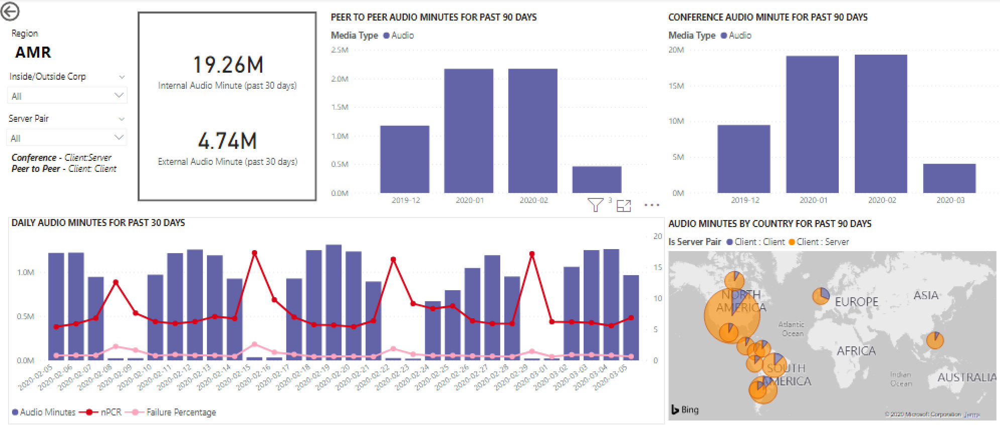

# Exibir o uso do Microsoft Teams no Power BI usando dados CQDView Microsoft Teams utilization in Power BI using CQD data

Novo em março de 2020, adicionamos um relatório de Uso do Teams aos nossos modelos de consulta do Power BI para [download para CQD.](https://github.com/MicrosoftDocs/OfficeDocs-SkypeForBusiness/blob/live/Teams/downloads/CQD-Power-BI-query-templates.zip?raw=true)New in March 2020, we've added a Teams Utilization report to our downloadable [Power BI query templates for CQD](https://github.com/MicrosoftDocs/OfficeDocs-SkypeForBusiness/blob/live/Teams/downloads/CQD-Power-BI-query-templates.zip?raw=true). 

Esses novos relatórios de Uso do Teams permitem que você veja como (e quanto) seus usuários estão usando o Microsoft Teams acessando dados do Painel de Qualidade de Chamada do Teams (CQD).This new Teams Utilization reports lets you see how (and how much) your users are using Microsoft Teams by accessing Teams Call Quality Dashboard (CQD) data. Esses relatórios destinam-se a ser um local centralizado que tanto os administradores quanto os líderes de negócios podem ir rapidamente para esses dados.These reports are intended to be a centralized location that both administrators and business leaders can quickly go to for this data.

O relatório do Power BI de Uso do Teams consiste em dois relatórios principais: Resumo da Contagem de Chamada **[e](#call-count-summary-report)** Resumo **[de Minutos de Áudio.](#audio-minutes-summary-report)**The Teams Utilization Power BI report consists of two primary reports: **[Call Count Summary](#call-count-summary-report)** and **[Audio Minutes Summary](#audio-minutes-summary-report)**. Os [relatórios Uso Diário,](#daily-usage)Detalhes  de [Áudio Regional,](#regional-audio-details)Detalhes de Conferência e Lista de Usuários são lançados quando um usuário tira proveito dos relatórios de drill down, que estão nas descrições abaixo. The [Daily Usage](#daily-usage), [Regional Audio Details](#regional-audio-details), [Conference Details](#conference-details) and [User List](#user-list) reports come into play when a user takes advantage of the drill-down reports, noted in the descriptions below.

> [!NOTE]
> Os dados de construção e sub-rede devem ser preenchidos para fornecer recursos regionais e de filtragem de rede.Building and subnet data must be populated to provide regional and network filtering capabilities.

## Relatório de Resumo da Contagem de ChamadaCall Count Summary Report

A página principal (Resumo da Contagem de Chamada) fornece imediatamente o número de sessões de áudio, vídeo e compartilhamento de tela dos últimos 30 e 90 dias, conforme o título da seção.The main page (Call Count Summary) immediately provides the number of audio, video and screen sharing sessions over the last 30 and 90 days as noted in the section title. Os dados exibidos inicialmente são para a organização como um todo e podem ser filtrados usando as opções de menu suspenso da slicer no lado esquerdo da página.The data initially displayed is for the organization as a whole and can be filtered using the slicer dropdown options on the left side of the page.

1. À direita dos menus suspensos da slicer, o número de chamadas por tipo de mídia é dividido em uma exibição interna/externa nos últimos 30 dias.To the right of the slicer dropdowns, the number of calls by media type is broken down to an internal/external view over the past thirty days. Podemos ver através da captura de tela acima que há mais chamadas acontecendo de locais organizacionais externos, o que faz sentido considerando o ambiente global atual.We can see through the above screenshot that there are more calls happening from outside organizational locations, which makes sense considering the current global environment.
  

1. À direita da caixa de contagem de tipos de mídia, temos a Contagem Mensal de Chamada por Tipo de Mídia dos últimos 90 dias.To the right of the media type count box, we have the Monthly Call Count by Media Type for the last 90 days. Cada tipo de coluna e mídia pode ser passado o mouse sobre para exibir a contagem de um mês anterior ou o mês atual até a data, fornecendo informações de tendência de uso.Each column and media type can be hovered over to display the count for a previous month or the current month to date, providing usage trend information.
  
 

1. O gráfico intermediário funciona como o gráfico de 90 dias, no entanto, ele fornece uma exibição de uso diário dos últimos 30 dias e permite que um usuário clique com o botão direito do mouse e faça uma busca drill down nos detalhes de um dia específico.The middle graph functions as the 90-day graph does, however it provides a daily usage view for the past 30 days and allows a user to right click and drill down into details for a specific day.
  

Na seção inferior esquerda da página, você encontrará uma tabela que fornece valores totais para cada tipo de mídia no ano passado.On the bottom left section of the page, you'll find a table providing total values for each media type over the past year. 
         

À direita da tabela, um gráfico de barras mostra os clientes com mais uso (chamadas/fluxos) dos últimos 30 dias.To the right of the table, a bar chart shows clients with the most use (calls/streams) for the past 30 days.
   

O último conjunto de gráficos desta página mostra cada tipo de mídia individualmente, com uma divisão mostrando o uso de conferência e P2P.The last set of charts for this page show each media type individually, with a breakdown showing conference and P2P usage. Os gráficos a seguir mostram que há um número significativamente maior de uso de conferência em comparação com P2P.The charts below show that there is a significantly higher number of conference usage as compared to P2P.
  

## Relatório de Resumo de Minutos de ÁudioAudio Minutes Summary Report

No relatório de uso de Minutos de Áudio, o uso total de minutos é fornecido por meio de algumas exibições diferentes.On the Audio Minutes usage report, the total minute usage is provided through a few different views. 

Temos o resumo de uso de 30 dias mostrado ao lado das slicers como fácil de consumir caixas de texto.We have the thirty-day usage summary shown next to the slicers as easy to consume text boxes. O número superior mostra o total de 30 dias, com detalhamentos internos e externos abaixo disso.The top number shows the thirty-day total, with internal and external breakdowns below that.

O gráfico de barras superior direita fornece uma exibição anual do uso de áudio de conferência.The top right bar graph provides a yearlong view of conference audio usage. Passe o mouse sobre o mês para mostrar os minutos de áudio da conferência.Hover over the month to show the conference audio minutes.

Para mostrar a diferença no áudio de conferência e P2P, o gráfico inferior esquerdo leva todo o áudio do ano passado e divide-o entre os dois tipos.To show the difference in P2P and conference audio, the bottom left chart takes all audio for the past year and breaks it up between the two types.

O último gráfico da página Minutos de áudio mostra o uso de minutos de áudio em uma sobreposição global de mapa.The last chart for the Audio minutes page shows audio minute usage on a global map overlay. Esse gráfico só funcionará se dados de construção e sub-rede são carregados para o locatário.This chart will only work if building and subnet data is uploaded to the tenant. A sobreposição do gráfico de pizza no mapa pode ser detalhada, fornecendo posteriormente o uso de áudio regional.The pie chart overlay on the map can be drilled into, subsequently providing regional audio usage.

## Recursos de drill-throughDrill-through capabilities

Conforme mencionado anteriormente, os usuários podem detalhar os relatórios de uso diário e regional.As previously noted, users can drill into the daily and regional usage reports.

### Uso DiárioDaily Usage

O relatório Uso Diário permite que um administrador identifique períodos de pico de consumo durante um dia.The Daily Usage report allows an administrator to identify peak consumption periods through the course of a day. Além do uso, também podemos capturar o sentimento geral do usuário e os comentários desse dia.In addition to usage, we are also able to capture overall user sentiment and feedback for that day.

O relatório de uso diário exibe o número de compartilhamentos de Áudio, Vídeo e Tela do dia selecionado com a capacidade de diferenciar conectividade interna e externa.The Daily usage report displays the number of Audio, Video and Screen shares for the selected day with the added ability to differentiate between internal and external connectivity. Uma divisão de Conferência e Ponto a Ponto está à direita imediata da caixa de total de modalidades.A Conference and Peer to Peer breakdown is to the immediate right of the modality total box. O canto superior direito do relatório fornece uma lista de conferências com sua ID associada e os participantes do dia.The top right of the report provides a list of conferences with their associated ID and participants for the day. A lista de conferências fornece um drill down adicional para o relatório Detalhes da Conferência também.The conference list provides an additional drill down to the Conference Details report as well. SUBSTITUIR GRÁFICOREPLACE GRAPHIC

O gráfico de barras na área central permite que o usuário identifique os períodos de pico de consumo durante um dia.The bar graph in the center area allows the user to identify peak consumption periods through the course of a day. Os usuários podem fazer drill down na hora representada no gráfico que apresentará o relatório da Lista de Usuários por hora.Users may drill down into the hour represented on the graph which will present the User List report for the hour.

À direita do gráfico de barras, os Comentários do Usuário são apresentados em um formato visual.To the right of the bar graph, User Feedback is presented in a visual format. Embora o sentimentos do usuário possa ser subjetivo, ele fornece informações que podem ser usadas para identificar possíveis problemas.While user sentiment can be subjective, it does provide insight that can be used to identify potential issues.

A tabela inferior fornece um intervalo de métricas para o dia.The bottom table provides a range of metrics for the day. Porcentagens ruins juntamente com taxas de falha podem fornecer ao administrador áreas potenciais de melhoria.Poor percentages along with failure rates can provide an administrator with potential areas of improvement. Cada hora também pode ser selecionada individualmente, conforme mostrado abaixo.Each hour can also be selected individually as shown below.

Esses dados podem ser usados para identificar regiões com problemas durante os períodos de consumo máximo.This data can be used to identify regions having problems during peak consumption times.

Clique na coluna desse dia para exibir as métricas dessa hora.Click on the column for that day to display metrics for that hour.

  
  1.  A tabela abaixo do gráfico exibirá as métricas para essa hora.The table below the chart will display the metrics for that hour. Isso pode ser classificação por qualquer header de coluna; no entanto, teríamos interesse em encontrar áreas problemáticas.This can be sorted by any column header; however, we would be interested in finding problematic areas.  
    
    
  2.  Vemos que a região IND está enfrentando um desempenho de vídeo ruim em conferências durante esse período.We see that the IND region is experiencing poor video performance in conferences during this time frame. Posteriormente, os relatórios CQD QER Microsoft podem ser usados para restringir o local problemático à medida que a região e o período de tempo foram identificados.Subsequently, the CQD QER Microsoft reports can be used to narrow down the problematic location as the region and time frame has been identified.

### Detalhes da ConferênciaConference Details

O relatório Detalhes da Conferência fornece informações adicionais para reuniões, desde uma lista de participantes até os tipos de mídia usados durante a sessão.The Conference Details report provides additional insight for meetings, from an attendee list, to the media types used during the session.

Clique com o botão direito do mouse em uma conferência na barra de participantes no gráfico de ID de conferência na página Uso diário para detalhar os detalhes da conferência.Right click a conference the participant bar in the conference ID chart on the Daily usage page to drill down into the conference details.

  

Podemos ver os participantes da conferência, bem como todas as informações pertinentes até a perda de pacotes e tremidação para ajudar com possíveis esforços de solução de problemas na tabela inferior.We can see the participants in the conference as well as all the pertinent information down to packet loss and jitter to assist with potential troubleshooting efforts in the bottom table.

### Detalhes regionais do áudioRegional Audio Details

A busca de Detalhes Regionais do Áudio mostra especificamente o uso de minutos de áudio para a região selecionada.The Regional Audio Details drill down specifically shows the audio minute usage for the selected region. Os usuários com acesso ao CQD podem ver tendências de uso para P2P e áudio de conferência dentro da região selecionada.Users with access to CQD can see usage trends for both P2P and conference audio within the selected region.

1.  Na página Resumo da Contagem de Chamada, faça drill-through para uma região específica na tabela.On the Call Count Summary page, drill-through to as specific region through the table.
  

2.  Selecione a linha com as informações adicionais de região necessárias.Select the row with the region additional information is needed for.
  

3.  As tendências de dados mostram um número significativo de minutos sendo usados na rede interna, com a conferência superando o uso de P2P.The data trends show a significant number of minutes being used on the internal network, with conferencing far surpassing P2P use.
  

A tendência de áudio regional pode ser usada para mostrar como os usuários são afetados por influencias externas no mundo.The regional audio trend can be used to show how users are impacted by external influences in the world. Especificamente, no momento, esperamos ver o uso externo para as regiões emEA e APAC aumentarem, com as pessoas sendo convidadas a trabalhar remotamente.Specifically, right now, we would expect to see the external usage for the EMEA and APAC regions to increase with people being asked to work remotely.

### Lista de UsuáriosUser List

O drill down da Lista de Usuários fornece, como se espera, informações específicas do usuário para uma hora específica selecionada pela pessoa que está exibindo o relatório.The User List drill down provides, as one might expect, user specific information for a specific hour selected by the person viewing the report. O relatório lista de usuários pode ser acessado por meio de uma análise do gráfico De tendências por hora no relatório Uso Diário.The User List report is accessible through a drill down in the Hourly Trends graph on the Daily Usage report. Clique com o botão direito do mouse nas informações adicionais de hora necessárias e selecione Drill through e Lista de Usuários, conforme mostrado abaixo.Right click on the hour additional information is needed for and select Drill through and User List, as shown below.

O relatório lista de usuários mostra conectividade interna/externa por meio do gráfico de rosca na parte superior central da página.The User List report shows internal/external connectivity through the doughnut chart in the top center of the page. Podemos ver que há uma grande quantidade de participação de Fora da rede corporativa na imagem abaixo.We can see that there is a large amount of participation from Outside the corporate network in the below image.

O canto superior direito do gráfico mostra o número de chamadas feitas por cada usuário dentro dessa hora.The top right of the graph shows the number of calls made by each user within that hour.

A tabela inferior fornece informações detalhadas para as sessões em que cada usuário participou durante essa hora.The bottom table provides detailed information for the sessions each user participated in during that hour. A coluna Tipo de Falha é útil para determinar o que causou a queda de uma chamada.The Failure Type column is useful in determining what caused a call to drop. As colunas Capturar e Renderizar Dispositivo são úteis para identificar por que uma chamada foi relatada com baixa qualidade.The Capture and Render Device columns are useful in identifying why a call was reported having poor quality.

## Tópicos relacionadosRelated topics

[Dimensões e medidas disponíveis no Painel de Qualidade de ChamadasDimensions and measures available in Call Quality Dashboard](dimensions-and-measures-available-in-call-quality-dashboard.md)

[Classificação de fluxo no painel de qualidade da chamadaStream Classification in Call Quality Dashboard](stream-classification-in-call-quality-dashboard.md)

[Configurar a Análise de Chamada do Skype for BusinessSet up Skype for Business Call Analytics](set-up-call-analytics.md)

[Usar a Análise de Chamada para solucionar problemas de baixa qualidade da chamadaUse Call Analytics to troubleshoot poor call quality](use-call-analytics-to-troubleshoot-poor-call-quality.md)

[Análise de Chamada e Painel de Qualidade de ChamadasCall Analytics and Call Quality Dashboard](difference-between-call-analytics-and-call-quality-dashboard.md)

[Solução de problemas do TeamsTeams Troubleshooting](https://docs.microsoft.com/MicrosoftTeams/troubleshoot/teams)
 