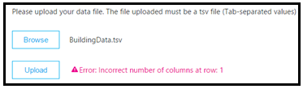

# Carregar dados de locatário e de construção no Painel de Qualidade de Chamada (CQD)

Para obter o máximo do CQD (Painel de Qualidade de Chamada), recomendamos que você carregue seu locatário e dados de construção. Há dois tipos de arquivos de dados de locatário, [Building](#upload-building-data-file) e [Endpoint.](#endpoint-data-file)

Você pode baixar um modelo de dados de locatário de [exemplo aqui.](https://github.com/MicrosoftDocs/OfficeDocs-SkypeForBusiness/blob/live/Teams/downloads/locations-template.zip?raw=true) Para ajuda com o mapeamento de construção, leia [Criar um mapa de construção para o CQD.](CQD-building-mapping.md)

No painel Relatórios de Resumo  do CQD, selecione Upload de Dados do Locatário no **menu** Configurações do CQD (um ícone de engrenagem na parte superior do CQD). A partir daqui, os administradores podem carregar informações do edifício e do ponto de extremidade da organização, como o mapeamento de endereços IP e informações geográficas, o mapeamento de cada ponto de acesso sem fio e seu endereço MAC, etc.

1. Abra o CQD (no Centro de administração do Teams ou em ), selecione o ícone de engrenagem no canto superior direito e escolha Carregar Dados do Locatário na página Relatórios [https://cqd.teams.microsoft.com](https://cqd.teams.microsoft.com) **de** Resumo. 

   
    
2. Como alternativa, se esta for sua primeira visita ao CQD, você será solicitado a carregar dados de construção. Você pode selecionar **Carregar Agora** para navegar rapidamente até a página Upload de **Dados do** Locatário.

   

3. Na página **Carregamento de Dados do** Locatário, selecione **Procurar** para escolher um arquivo de dados.

4. Depois de selecionar um arquivo de dados, especifique a data **de** início e, opcionalmente, especifique uma data de término.

5. Depois de **selecionar a data de início,** selecione **Carregar** para carregar o arquivo para o CQD.   Antes de carregar o arquivo, ele será validado. Se a validação falhar, será exibida uma mensagem de erro solicitando que você corrija o arquivo. A figura a seguir mostra um erro que ocorre quando o número de colunas no arquivo de dados está incorreto.

   
 
6. Se nenhum erro ocorrer durante a validação, o carregamento do arquivo será bem-sucedido. Em seguida, você pode ver o arquivo de dados carregado na tabela Meus **carregamentos,** que mostra a lista completa de todos os arquivos carregados para o locatário atual na parte inferior dessa página.

> [!NOTE]
> Pode levar até quatro horas para concluir o processamento do arquivo de construção.    Se você já carregou um arquivo de construção e precisa adicionar sub-redes que possam ter sido perdidas ou excluídas, modifique o arquivo original adicionando as novas sub-redes, remova o arquivo atual e carregue novamente o arquivo recém-editado. Pode haver apenas um arquivo de dados de construção ativo no CQD. 

## Carregar arquivo de dados de construção

O primeiro tipo de arquivo de dados do locatário no CQD é o **arquivo de** dados Building. A coluna Sub-rede é derivada expandindo a coluna Network+NetworkRange e, em seguida, unindo a coluna Sub-rede à primeira sub-rede ou segunda sub-rede do registro de chamada para mostrar informações de Construção, Cidade, País ou Região. O formato do arquivo de dados carregado deve atender aos seguintes critérios para passar na verificação de validação antes de carregar:
  
- O arquivo deve ser um arquivo .tsv (as colunas são separadas por uma TAB) ou um arquivo .csv (as colunas são separadas por uma vírgula).

- O arquivo de dados não inclui uma linha de cabeça de tabela. Espera-se que a primeira linha do arquivo de dados seja dados reais, não rótulos de título, como "Rede".

- Os tipos de dados no arquivo só podem ser Cadeia de Caracteres, Inteiro ou Booliana. Para o tipo de dados Inteiro, o valor deve ser numérico. Os valores boolianas devem ser 0 ou 1.

- Se uma coluna usar o tipo de dados Cadeia de Caracteres, um campo de dados pode estar vazio, mas ainda deve ser separado por uma tabulação ou vírgula. Um campo de dados vazio apenas atribui um valor de cadeia de caracteres vazio.

- Há um limite de 1.000.000 linhas expandida por arquivo de dados do locatário.

- Deve haver 15 colunas para cada linha, cada coluna deve ter o tipo de dados apropriado e as colunas devem estar na ordem listada na tabela a seguir (delimitada por vírgula ou tabulação):

  **Criar formato de arquivo de dados**
  
  | Nome da coluna        | Tipo de dados | Exemplo                   | Orientação              |
  |--------------------|-----------|---------------------------|-----------------------|
  | NetworkIP          | Cadeia de caracteres    | 192.168.1.0               | Obrigatório              |
  | Nomeda Rede        | Cadeia de caracteres    | EUA/Seattle/SEATTLE-SEA-1 | Obrigatório1  |
  | NetworkRange       | Número    | 26                        | Obrigatório              |
  | BuildingName       | Cadeia de caracteres    | SEATTLE-SEA-1             | Obrigatório1  |
  | OwnershipType      | Cadeia de caracteres    | Contoso                   | Opcional              |
  | BuildingType       | Cadeia de caracteres    | Rescisão de IT            | Opcional              |
  | BuildingOfficeType | Cadeia de caracteres    | Engenharia               | Opcional              |
  | Cidade               | Cadeia de caracteres    | Seattle                   | Recomendado           |
  | ZipCode            | Cadeia de caracteres    | 98001                     | Recomendado           |
  | País            | Cadeia de caracteres    | Nos                        | Recomendado           |
  | Estado              | Cadeia de caracteres    | Wa                        | Recomendado           |
  | Região             | Cadeia de caracteres    | MSUS                      | Recomendado           |
  | InsideCorp2         | Bool      | 1             | Obrigatório              |
  | ExpressRoute3       | Bool      | 0             | Obrigatório              |
  | VPN                | Bool      | 0                         | Opcional              |

  1 Embora não seja necessário pelo CQD, os modelos estão configurados para exibir o nome de Building e Network.

  2 Essa configuração pode ser usada para refletir se a sub-rede está ou não dentro da rede corporativa. Você pode personalizar o uso para outras finalidades.

  3 Essa configuração pode ser usada para refletir se a rede usa ou não o Azure ExpressRoute. Você pode personalizar o uso para outras finalidades.  

  **Exemplo de linha:**

  `192.168.1.0,USA/Seattle/SEATTLE-SEA-1,26,SEATTLE-SEA-1,Contoso,IT Termination,Engineering,Seattle,98001,US,WA,MSUS,1,0,0`

> [!IMPORTANT]
> O intervalo de rede pode ser usado para representar uma super-rede (combinação de várias sub-redes com um único prefixo de roteamento). Todos os novos carregamentos de construção serão verificados em busca de intervalos sobrepostos. Se você já carregou um arquivo de construção, baixe o arquivo atual e carregue-o novamente para identificar sobreposições e corrigir o problema antes de carregar novamente. Qualquer sobreposição em arquivos carregados anteriormente pode resultar em mapeamentos errados de sub-redes para edifícios nos relatórios. Determinadas implementações de VPN não relatam com precisão as informações da sub-rede. 
>
> A coluna VPN é opcional e será padrão para 0. Se o valor da coluna VPN estiver definido como 1, a sub-rede representada por essa linha será totalmente expandida para corresponder a todos os endereços IP dentro da sub-rede. Use isso com moderação e somente para sub-redes VPN, uma vez que a expansão total dessas sub-redes terá um impacto negativo nos tempos de consulta para consultas que envolvem a criação de dados. Se a expansão da sub-rede resulta no limite de linha de expansão de 1.000.000 sendo excedido, o arquivo de construção não será aceito.

### Sobre-rede

Você pode usar a super-rede, normalmente chamada de Roteamento de Inter-Domain Classe (CIDR), em vez de definir cada sub-rede. Uma *super-rede* é uma combinação de várias sub-redes que compartilham um único prefixo de roteamento. Em vez de adicionar uma entrada para cada sub-rede, você pode usar o endereço sobrepacod. Há suporte para super-rede, mas não recomendamos usá-la.

Por exemplo, a criação de marketing da Contoso é feita das sub-redes abaixo:

-   10.1.0.0/24 — primeiro andar
-   10.1.1.0/24 — segundo andar
-   10.1.2.0/24 — terceiro andar
-   10.1.3.0/24 — quarto andar

Em vez de adicionar uma entrada para cada sub-rede, você pode usar o endereço sobrecodado — neste exemplo, 10.1.0.0/22.

-   Rede = 10.1.0.0
-   Intervalo de Rede = 22

Veja algumas coisas a considerar antes de implementar a super-rede:

-   A super-rede só pode ser usada em um mapeamento de sub-rede com máscara de 8 bits a 28 bits.

-   A sobre-rede demora menos tempo na frente, mas ela tem o custo de reduzir a richness dos seus dados. Digamos que haja um problema de qualidade envolvendo a sub-rede 10.1.2.0. Se você implementou a super-rede, não sabe onde no edifício a sub-rede está localizada ou que tipo de rede ela é (por exemplo, um laboratório). Se você tivesse definido todas as sub-redes para um prédio e carregado informações de localização no andar, poderia ver essa distinção.

-   É importante garantir que o endereço sobrecarrado está correto e não está capturando sub-redes indesejadas.

-   É muito comum encontrar 192.168.0.0 em dados. Para muitas organizações, isso indica que o usuário está em casa. Para outras pessoas, este é o esquema de endereços IP para uma sede de satélite. Se sua organização tiver escritórios que usam essa configuração, não inclua-a no arquivo de construção porque é difícil distinguir entre redes internas e residencial usando [sub-redes comuns.](quality-of-experience-review-guide.md#common-subnets) 

> [!IMPORTANT]
> O intervalo de rede pode ser usado para representar uma super-rede. Todos os novos carregamentos de arquivos de dados de construção serão verificados em busca de intervalos sobrepostos. Se você já carregou um arquivo de construção anteriormente, baixe o arquivo atual e carregue-o novamente para identificar sobreposições e corrigir o problema. Qualquer sobreposição em arquivos carregados anteriormente pode resultar em mapeamentos errados de sub-redes para edifícios nos relatórios.

### VPN

A qualidade dos dados de experiência (QoE) que os clientes enviam para o Microsoft 365 ou o Office 365, que é de onde os dados CQD são fonte, incluem um sinalizador VPN. O CQD verá isso como as dimensões First VPN e Second VPN. No entanto, esse sinalizador depende do relatório dos fornecedores de VPN para o Windows de que o adaptador de rede VPN registrado é um adaptador de Acesso Remoto. Nem todos os fornecedores de VPN registram corretamente adaptadores de Acesso Remoto. Por isso, talvez você não consiga usar os filtros de consulta VPN integrados. Use a coluna VPN abordada acima para marcar e identificar com precisão as sub-redes VPN. Também é uma boa prática rotular suas redes VPN para facilitar a identificação em seus relatórios. Veja a seguir dois exemplos de como rotular suas sub-redes VPN:

- Defina **um Nome de Rede** inserindo "VPN" neste campo para sub-redes VPN.

  

- Defina **um Nome de Construção** inserindo "VPN" neste campo para sub-redes VPN.

  

> [!NOTE]
> As conexões VPN são conhecidas por identificar erromente o tipo de conexão de rede como com fio quando a conexão subjacente é sem fio. Ao ver a qualidade em conexões VPN, você não pode supor que o tipo de conexão tenha sido identificado com precisão.

## Arquivo de dados do ponto de extremidade

O outro tipo de arquivo de dados de locatário CQD é o **arquivo de dados do Ponto** de Extremidade. Os valores da coluna são usados na coluna Nome do Ponto de Extremidade do Primeiro Cliente do registro de chamada ou na coluna Nome do Ponto de Extremidade do Segundo Cliente para mostrar informações de Marca de Ponto de Extremidade, Modelo ou Tipo. O formato do arquivo de dados carregado deve atender aos seguintes critérios para passar na verificação de validação antes de carregar:

- O arquivo deve ser um arquivo .tsv (as colunas são separadas por uma TAB) ou um arquivo .csv (as colunas são separadas por uma vírgula).

- O conteúdo do arquivo de dados não inclui os títulos da tabela. Espera-se que a primeira linha do arquivo de dados seja dados reais, não um rótulo de título, como "Nomedo Ponto de Extremidade".

- Todas as sete colunas usam apenas o tipo de dados Cadeia de Caracteres. O comprimento máximo permitido é de 64 caracteres.

- Um campo de dados pode estar vazio, mas ainda deve ser separado por uma tabulação ou vírgula. Um campo de dados vazio apenas atribui um valor de cadeia de caracteres vazio.

- O Nomedo Ponto de Extremidade deve ser exclusivo, caso contrário, o carregamento falha. Se houver uma linha ou duas linhas duplicadas que usem o mesmo Nomedo Ponto de Extremidade, o conflito causará uma junção incorreta.

- Os pontos de extremidadeLabel1, EndpointLabel2 e EndpointLabel3 são rótulos personalizáveis. Elas podem ser cadeias de caracteres vazias ou valores como "Laptop designado pelo Departamento de IT 2018" ou "Asset Tag 5678".

- Deve haver sete colunas para cada linha e as colunas devem estar na seguinte ordem:

  **Ordem de campo:**

  EndpointName, EndpointMake, EndpointModel, EndpointType, EndpointLabel1, EndpointLabel2, EndpointLabel3

  **Exemplo de linha:**

  `1409W3534, Fabrikam, Model 123, Laptop, IT designated 2018 Laptop, Asset Tag 5678, Purchase 2018`

## Atualizar um arquivo de construção

Ao reunir informações de construção e sub-rede, os administradores geralmente carregarão o arquivo de construção em várias i iterações ao longo do tempo, adicionando novas sub-redes e suas informações de construção à medida que ele estiver disponível. Quando isso ocorrer, você precisará carregar o arquivo de construção de novo. Esse processo é como o carregamento inicial conforme descrito na seção anterior, com algumas exceções conforme descrito na seção a seguir.

> [!Important]
> Somente um arquivo de construção pode estar ativo por vez. Vários arquivos de construção não são cumulativos.

## Adicionar novas sub-redes da Rede

Há momentos em que você precisará adicionar novas sub-redes de rede ao CQD que não eram originalmente parte de sua topologia de rede. Para adicionar novas sub-redes, faça o seguinte na página Upload de Dados **do** Locatário no CQD:

1.  Baixe o arquivo original, caso ainda não tenha uma cópia atualizada.

1.  Remover o arquivo atual no CQD.

1.  Edite o arquivo de construção original e forneça uma data de término que ocorre pelo menos um dia antes de as novas sub-redes da rede ser adquiridas.

1.  Anexar as novas sub-redes da Rede ao arquivo de construção original.

1.  Carregue o arquivo de construção recém-modificado e de definir a data de início para um dia após o arquivo de construção anterior terminar.

## Adicionar sub-redes ausentes

Depois de carregar informações de construção para redes gerenciadas, todas as redes gerenciadas devem ter uma associação de construção. No entanto, nem sempre será o caso; normalmente, algumas sub-redes são perdidas. Para encontrar essas redes ausentes, consulte  o Relatório **de Sub-rede** Ausente na página Relatórios de Qualidade da Experiência no CQD. Isso apresenta todas as sub-redes com 10 ou mais fluxos de áudio que não estão definidos no arquivo de dados do edifício e estão sendo marcados como externos. Certifique-se de que não haja redes gerenciadas nesta lista. Se as sub-redes não estão disponíveis, use o procedimento a seguir para atualizar o arquivo de dados do edifício original e carregar-o no CQD.

1. Vá para a **página Upload de Dados do Locatário** no CQD.

1. Baixe o arquivo original, caso ainda não tenha uma cópia atualizada.

1. Remover o arquivo atual no CQD.

1. Anexar as novas sub-redes ao arquivo original.

1. Carregue o arquivo de construção. Certifique-se de definir a data de início como pelo menos oito meses antes para que o CQD processe dados históricos.

> [!IMPORTANT]
> Você precisará adicionar sua ID de locatário como um filtro de consulta para a **Segunda ID** de Locatário a este relatório para filtrar o relatório para exibir somente os dados de locatário da sua organização. Caso contrário, o relatório mostrará sub-redes federadas.

> [!NOTE] 
> Certifique-se de ajustar o filtro do relatório Ano Mensal ao mês atual. Selecione **Editar** e ajuste o filtro de relatório **Ano** Mensal para salvar o novo mês padrão.

## Tópicos relacionados

[Criar um mapa de construção para o CQD](CQD-building-mapping.md)

[Melhorar e monitorar a qualidade da chamada para o Teams](monitor-call-quality-qos.md)

[O que é CQD?](CQD-what-is-call-quality-dashboard.md)

[Configurar o Painel de Qualidade de Chamada (CQD)](turning-on-and-using-call-quality-dashboard.md)

[Dados e relatórios do CQD](CQD-data-and-reports.md)

[Usar o CQD para gerenciar a qualidade da chamada e da reunião](quality-of-experience-review-guide.md)

[Dimensões e medidas disponíveis no CQD](dimensions-and-measures-available-in-call-quality-dashboard.md)

[Classificação de Fluxo no CQD](stream-classification-in-call-quality-dashboard.md)

[Usar o Power BI para analisar dados CQD](CQD-Power-BI-query-templates.md)
