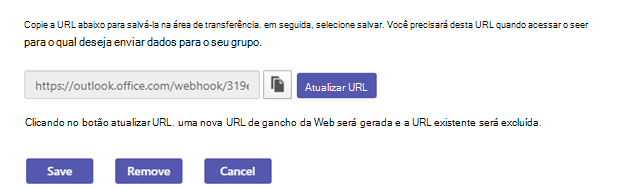
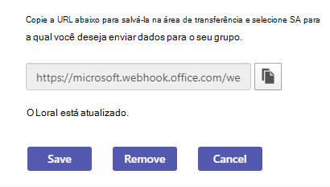

# Gerenciar Microsoft 365 e conectores personalizados

Para manter sua equipe atualizada, os conectores fornecem atualizações de conteúdo e serviço usadas com frequência diretamente em um Teams canal. Com os conectores, Teams seus usuários podem receber atualizações de serviços populares, como Trello, Wunderlist, GitHub e Azure DevOps Services. As atualizações são postadas diretamente no fluxo de chat em sua equipe.

Microsoft 365 conectores são usados com grupos Microsoft Teams e Microsoft 365, facilitando a sincronização e o recebimento rápido de informações relevantes por todos os membros. O Microsoft Teams e o Exchange usam o mesmo modelo de conector, permitindo que você use os mesmos conectores em ambas as plataformas. No entanto, se você desabilitar todos os conectores configurados para um grupo Microsoft 365, ele também desabilitará a capacidade do grupo Microsoft 365 criar conectores.

Qualquer membro de uma equipe poderá conectar sua equipe a serviços de nuvem populares com os conectores se as permissões da equipe permitirem, e todos os membros da equipe serão notificados sobre atividades desse serviço. Os conectores continuam a funcionar após o membro que inicialmente tiver configurado o conector. Qualquer membro da equipe com as permissões para adicionar ou remover pode modificar a configuração de conectores por outros membros.

## Habilitar ou desabilitar conectores no Teams

O Exchange Online powershell V2 usa autenticação moderna e funciona com autenticação multifator, chamada MFA para se conectar Exchange todos os ambientes do PowerShell relacionados Microsoft 365 no Microsoft 365. Os administradores podem usar Exchange Online PowerShell para desabilitar conectores para um locatário inteiro ou uma caixa de correio de grupo específica, afetando todos os usuários nesse locatário ou caixa de correio. Não é possível desabilitar para poucos usuários específicos. Além disso, os conectores são desabilitados por padrão para Nuvem da Comunidade Governamental, chamados GCC locatários.

A configuração de locatário substitui a configuração de grupo. Por exemplo, se um administrador habilitar conectores para o grupo e desabilitá-los no locatário, os conectores do grupo serão desabilitados. Para habilitar um conector no Teams, [conecte-se Exchange Online PowerShell](/powershell/exchange/connect-to-exchange-online-powershell?view=exchange-ps#connect-to-exchange-online-powershell-using-modern-authentication-with-or-without-mfa&preserve-view=true) usando autenticação moderna com ou sem MFA.

### Comandos para habilitar ou desabilitar conectores

Execute os seguintes comandos no Exchange Online PowerShell:

* Para desabilitar conectores para o locatário: `Set-OrganizationConfig -ConnectorsEnabled:$false`.
* Para desabilitar mensagens acionáveis para o locatário: `Set-OrganizationConfig -ConnectorsActionableMessagesEnabled:$false`.
* Para habilitar conectores para Teams, execute os seguintes comandos:
  * `Set-OrganizationConfig -ConnectorsEnabled:$true`
  * `Set-OrganizationConfig -ConnectorsEnabledForTeams:$true`
  * `Set-OrganizationConfig -ConnectorsActionableMessagesEnabled:$true`

Para obter mais informações sobre a troca de módulos do PowerShell, consulte [Set-OrganizationConfig](/powershell/module/exchange/Set-OrganizationConfig?view=exchange-ps&preserve-view=true). Para habilitar ou desabilitar Outlook conectores, [conecte aplicativos aos seus grupos Outlook](https://support.microsoft.com/topic/connect-apps-to-your-groups-in-outlook-ed0ce547-038f-4902-b9b3-9e518ae6fbab).

<!---TBD: Delete this section after customer migration to new Webhook URL is complete --->

#### Notificação de atualização da URL do conector

Os Teams estão fazendo a transição para uma nova URL para aprimorar a segurança. Durante a transição, você receberá uma notificação para atualizar o conector configurado. Atualize o conector o mais cedo possível para evitar qualquer interrupção nos serviços do conector. Para atualizar o conector:

1. Na página de configuração de conectores, verifique se há **uma mensagem de** Atenção Necessária ao lado do conector configurado.

   

1. Para recriar a conexão para conectores de webhook de entrada, selecione Atualizar **URL** e use a URL de webhook gerada.

   

1. Para outros tipos de conector, remova o conector e recrie a configuração do conector. Uma **URL é exibida com uma mensagem** atualizada.

   

## Confira também

* [visão geral de conectores personalizados e webhooks](/microsoftteams/platform/webhooks-and-connectors/what-are-webhooks-and-connectors)
* [Criar Office 365 conectores](/microsoftteams/platform/webhooks-and-connectors/how-to/connectors-creating)