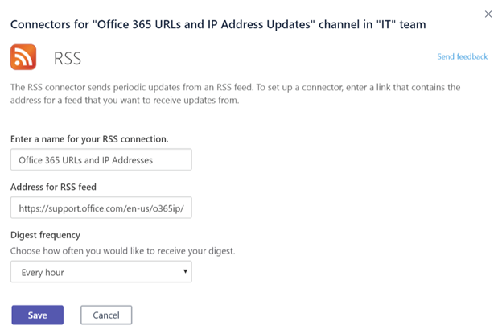

# Use Microsoft 365 conectores personalizados e Microsoft Teams

Para manter sua equipe atualizada, os Conectores oferecem atualizações de conteúdo e serviço com frequência diretamente em um Teams canal. Com conectores, seus Teams usuários podem receber atualizações de serviços populares, como Trello, Wunderlist, GitHub e Azure DevOps Services. As atualizações são postadas diretamente no fluxo de chat em sua equipe.

Microsoft 365 conectores são usados com grupos de Microsoft Teams e Microsoft 365, facilitando que todos os membros fiquem em sincronia e recebam informações relevantes rapidamente. O Microsoft Teams e o Exchange usam o mesmo modelo de conector, permitindo que você use os mesmos conectores em ambas as plataformas. No entanto, vale a pena notar que desabilitar conectores para o grupo Microsoft 365 que uma equipe depende desabilita a capacidade de criar conectores para essa equipe também.

Qualquer membro de uma equipe pode conectar sua equipe a serviços de nuvem populares com os conectores se as permissões de equipe permitirem e todos os membros da equipe são notificados das atividades desse serviço. Os conectores continuam a funcionar depois que o membro que tiver configurado inicialmente o conector foi deixado. Qualquer membro da equipe com as permissões para adicionar ou remover pode modificar a configuração de conectores por outros membros.

> [!NOTE]
> Os conectores são desabilitados por padrão nos ambientes de Community (GCC) do Governo. Para habilita-los, de `ConnectorsEnabled` definir os parâmetros `ConnectorsEnabledForTeams` ou com `$true` o `SetOrganizationConfig` cmdlet. Conexão para o [Exchange Online PowerShell](/powershell/exchange/connect-to-exchange-online-powershell?view=exchange-ps).

## Adicionar um conector a um canal

Atualmente, você pode adicionar conectores usando Microsoft Teams da área de trabalho e da Web. No entanto, as informações postadas por esses conectores podem ser exibidas em **todos os clientes,** incluindo móveis.

1. Para adicionar um conector a um canal, clique nas **releições (...),** à direita de um nome de canal e clique em **Conectores**.

    > [!div class="mx-imgBorder"]
    > 

2. Você pode selecionar entre vários conectores disponíveis e, em seguida, clique em **Adicionar**.

    > [!div class="mx-imgBorder"]
    > 

3. Preencha as informações necessárias do conector selecionado e clique em **Salvar**. Cada conector precisa de um conjunto de informações diversas para funcionar corretamente e alguns podem exigir que você inicie sessão no serviço usando os links fornecidos na página de configuração do conector.

    > [!div class="mx-imgBorder"]
    > 

4. Os dados fornecidos pelo conector são publicados automaticamente no canal.

    > [!div class="mx-imgBorder"]
    > 

<!---Delete this section after customer migration to new Webhook URL is complete --->

> [!IMPORTANT]
> **Notificação de atualização da URL do conector**
>
> Os Teams conectores estão fazendo a transição para uma nova URL para melhorar a segurança. Durante o curso dessa transição, você receberá determinadas notificações para atualizar seu conector configurado para usar a nova URL. É altamente recomendável que você atualize seu conector imediatamente para evitar qualquer interrupção nos serviços do conector. As etapas a seguir precisam ser seguidas para atualizar a URL:
>
> 1. Na página de configuração de conectores, uma mensagem "Atenção Necessária" será exibida no botão "Gerenciar" para as conexões que precisam ser atualizadas.
> 
> 2. Para conectores de webhook de entrada, os usuários podem recriar a conexão simplesmente selecionando **Atualizar URL** e usando a URL de webhook recém-gerada.
> 
> 3. Para outros tipos de conector, o usuário precisaria remover o conector e recriar a configuração do conector.
> 4. Você verá uma mensagem "A URL está atualizada" depois que a URL tiver sido atualizada com êxito.
> 

## Confira também

* [Criar conectores personalizados e webhooks](/microsoftteams/platform/webhooks-and-connectors/what-are-webhooks-and-connectors)
