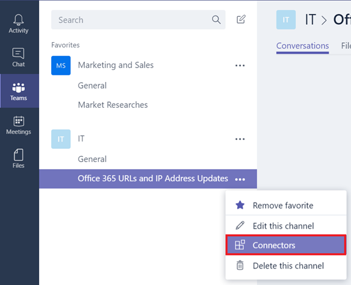

Usar o Office 365 e conectores personalizados no Microsoft Teams
=======================================================

Os conectores mantêm a sua equipe atualizada ao entregar conteúdo e atualizações de serviços que você usa com frequência diretamente em um canal. Com os conectores, os usuários do Microsoft Teams podem receber atualizações de serviços populares, como Twitter, Trello, Wunderlist, GitHub e VSTS no fluxo de bate-papo de suas equipes.

Qualquer membro da equipe pode conectar sua equipe a serviços populares em nuvem com os conectores, e todos os membros da equipe são notificados das atividades desse serviço. Se um usuário for removido de uma equipe, todos os conectores adicionados à equipe pelo usuário removido deixam de funcionar. As reuniões agendadas continuam funcionando porque estão no calendário do grupo.

Os conectores do Office 365 podem ser usados com o Microsoft Teams e com os grupos do Office 365, facilitando para todos os membros manter a sincronia e receber informações relevantes rapidamente. O Microsoft Teams e o Exchange usam o mesmo modelo de conector, permitindo que você use os mesmos conectores em ambas as plataformas.

No momento, os conectores podem ser adicionados usando os clientes Microsoft Teams de desktop e web. No entanto, as informações publicadas por esses conectores podem ser visualizadas usando **todos os clientes**, inclusive de celular.

1.  Para adicionar um conector a um canal, clique nas **reticências (…),** ao lado direito do nome do canal, e então clique em **Conectores.**

    

2.  Os usuários podem escolher a partir de uma grande variedade de conectores, e então clicar em **Adicionar**.

    

3.  Preencha as informações necessárias do conector selecionado e clique em **Salvar**. Cada conector precisa de um conjunto de informações diversas para funcionar corretamente e alguns podem exigir que você inicie sessão no serviço usando os links fornecidos na página de configuração do conector.

    

4.  Os dados fornecidos pelo conector são publicados automaticamente no canal.

    

Desenvolvimento de conectores personalizados
-----------------------------

Desenvolver conectores personalizados que podem se integrar aos seus aplicativos Line-of-Business (LOB) é muito fácil. Você pode usar o conector interno **Incoming Webhook** para criar um endpoint para um canal que pega dados de qualquer aplicativo usando métodos de publicação HTTP.

1.  E o **Incoming Webhook** como qualquer outro conector.

    

2.  Para criar um Webhook, especifique um **nome**, atualize a imagem do Webhook, se necessário, e clique em **Criar**.

    

3.  Os aplicativos que levam dados para este canal precisam da URL do conector Webhook. É criada uma **URL exclusiva** ao criar o **Webhook**. Compartilhe essa URL com os seus desenvolvedores para que eles possam configurar seus aplicativos para pegar os dados conforme necessário.

    

4.  Quando um aplicativo externo leva dados para um conector, a mensagem é mostrada na lista de conversas do canal como uma mensagem especial chamada de mensagem do **Cartão do Conector**.

    

Os desenvolvedores podem configurar seus aplicativos para criar esses cartões enviando uma solicitação HTTP com um payload JSON simples para o endereço Webhook do Microsoft Team, que é uma URL exclusiva desse endpoint fornecido pelo assistente. Solicite que os seus desenvolvedores consultem [Introdução aos Conectores do Office 365 para o Microsoft Teams](https://go.microsoft.com/fwlink/?linkid=855783) na Rede do Desenvolvedor da Microsoft, com instruções detalhadas e exemplos de conectores. Outros recursos incluem [Conectar aplicativos aos seus grupos no Outlook](https://support.office.com/en-us/article/Connect-apps-to-your-groups-in-Outlook-ed0ce547-038f-4902-b9b3-9e518ae6fbab) e [Centro de Desenvolvimento do Office – Microsoft Teams](https://go.microsoft.com/fwlink/?linkid=855784).
