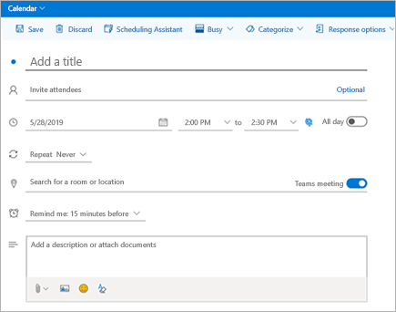
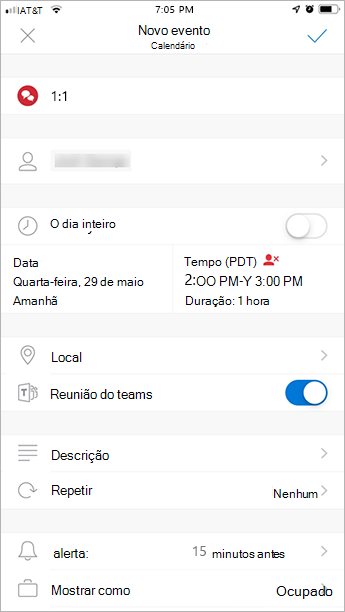

# Usar o suplemento de Reunião do Teams no Outlook

Este artigo detalha os requisitos de autenticação e a funcionalidade do suplemento Reunião do Teams no Outlook para seus usuários finais. Ele também mostra como você pode habilitar reuniões privadas e ajustar as configurações de política para usuários no Modo Ilha. Se você estiver tendo problemas com o suplemento, consulte nossas [diretrizes de solução de problemas mais recentes](/MicrosoftTeams/troubleshoot/meetings/resolve-teams-meeting-add-in-issues).

O suplemento de reunião do Teams permite que os usuários agendem uma reunião do Teams no Outlook. O suplemento está disponível para o Outlook no Windows, Mac, Web e dispositivos móveis.

## Suplemento de reunião do Teams no Outlook para Windows

O suplemento de Reunião do Teams é instalado automaticamente para usuários que possuem o Microsoft Teams e o Office 2013, Office 2016, Office 2019 ou Office 2021 instalado em seus computadores Windows. Os usuários verão o suplemento de Reunião do Teams na faixa de opções Calendário do Outlook.

> [!NOTE]
>
>
> - Não há **nenhum URL direto** vinculado ao suplemento Teams.
> - Há considerações adicionais se sua organização executa o Teams e o Skype for Business. Em algumas circunstâncias, o suplemento Teams não está disponível no Outlook. Consulte [Atualização do Skype for Business para Teams](upgrade-to-Teams-on-prem-tools.md) para obter detalhes.
> - Ter permissões do usuário para executar o arquivo Regsvr32.exe é um requisito mínimo para que o suplemento Reunião do Teams seja instalado no computador.
> - Se o suplemento de Reunião do Teams não for exibido, instrua os usuários a fechar o Outlook e o Teams e reiniciar o cliente Teams primeiro, depois entrar no Teams e então reiniciar o cliente Outlook, exatamente nessa ordem.
> - Se você estiver usando uma instalação do Outlook do Office da Microsoft Store, não haverá suporte para o suplemento Reunião do Teams. Os usuários que precisam desse suplemento são aconselhados a instalar a versão Click-to-Run do Office, conforme descrito no artigo [Office no Windows 10 no modo S](https://support.office.com/article/faq-office-on-windows-10-in-s-mode-717193b5-ff9f-4388-84c0-277ddf07fe3f).
> - A instalação do [Webview2](/microsoft-edge/webview2/concepts/distribution) será necessária para o recurso Suplemento de Reunião do Teams, opções de reunião incorporadas. Se o WebView2 não estiver instalado, os usuários serão redirecionados para o navegador, o que pode fornecer uma experiência prejudicada, especialmente no momento da criação da reunião.

## Suplemento de reunião do Teams no Outlook para Mac

O botão de Reunião do Teams no Outlook para Mac aparecerá na faixa de opções do Outlook para Mac se o Outlook estiver executando a versão de produção 16.24.414.0 ou posterior e estiver ativado com uma assinatura de cliente Microsoft 365 ou Office 365.

As coordenadas da reunião (os números de discagem e de ingresso no Teams) serão adicionadas ao convite da reunião depois que o usuário clicar em **Enviar**.  

## Suplemento de reunião do Teams no Outlook Web App

O botão Reunião do Teams no Outlook Web App aparecerá como parte da criação de um novo evento se o usuário estiver em uma versão anterior do novo Outlook na Web. Consulte o [Blog do Outlook](https://techcommunity.microsoft.com/t5/Outlook-Blog/Designed-to-be-fast-The-Outlook-on-the-web-user-experience-gets/ba-p/234909?utm_source=t.co&utm_medium=referral) para saber como os usuários podem experimentar a versão inicial do novo Outlook na Web.

As coordenadas da reunião (os números de discagem e de ingresso no Teams) serão adicionadas ao convite da reunião depois que o usuário clicar em **Enviar**.  

## Suplemento de reunião do Teams no Outlook para dispositivos móveis (iOS e Android)

O botão Reunião do Teams é exibido nas versões mais recentes do aplicativo do Outlook para iOS e Android.

As coordenadas da reunião (os números de discagem e de ingresso no Teams) serão adicionadas ao convite da reunião depois que o usuário clicar em **Enviar**.  

## Suplemento de Reunião do Teams e Verificador de Horas para o Outlook

O Verificador de Horas é um suplemento para o Outlook que ajuda os usuários a chegarem a um consenso entre as empresas sobre um horário de reunião. Depois que os convidados da reunião fornecem seu horário preferido, o Verificador de Horas envia o convite da reunião em nome do usuário. Se a opção **Reunião online** estiver selecionada no Verificador de Horas, o Verificador de Horas agendará uma reunião do Skype for Business ou Microsoft Teams. (O Verificador de Horas usará o que tiver sido definido pela sua organização como o canal de reunião online padrão.)

> [!NOTE]  
> Se você salvou uma configuração do Skype for Business no [painel do Verificador de Horas](https://findtime.microsoft.com/UserDashboard), o Verificador de Horas usará essa configuração em vez do Microsoft Teams. Se você deseja usar o Microsoft Teams, exclua a configuração do Skype for Business no seu painel.

Para obter mais informações, consulte [Agendar reuniões com o Verificador de Horas ](https://support.office.com/article/scheduling-meetings-with-findtime-4dc806ed-fde3-4ea7-8c5e-b5d1fddab4a6).

## Requisitos de autenticação

O suplemento de Reunião do Teams requer que os usuários entrem no Teams usando a autenticação moderna. Se os usuários não usarem este método para entrar, eles ainda poderão usar o cliente Teams, mas não poderão agendar [ reuniões online do Teams ](https://www.microsoft.com/microsoft-teams/online-meetings) usando o suplemento do Outlook. Você pode corrigir isso da seguinte maneira:

- Se a autenticação moderna não estiver configurada para a sua organização, você deverá fazer isso.
- Se a Autenticação Moderna estiver configurada, mas os usuários tiverem cancelado a mesma na caixa de diálogo, você deve instruir os usuários a entrarem novamente usando a autenticação multifator.

Para saber mais sobre como configurar a autenticação, veja [Modelos de identidade e autenticação no Microsoft Teams](identify-models-authentication.md).

## Habilitar reuniões privadas

A **permissão para agendar reuniões privadas** deve estar ativada no centro de administração do Microsoft Teams para que o suplemento seja implantado. No centro de administração, vá para **Reuniões** > **Políticas de Reunião**, e na seção **Geral**, ative **Permitir agendamento de reuniões particulares** para Ativado.)

O cliente Teams instala o suplemento correto, determinando se os usuários precisam da versão de 32 ou de 64 bits.

> [!NOTE]
> Talvez os usuários precisem reiniciar o Outlook após uma instalação ou atualização do Teams para obter o suplemento mais recente.

## Diretiva de atualização do Teams e o suplemento de reunião do Teams para Outlook

Os clientes podem [escolher sua jornada de atualização do Skype for Business para o Teams](upgrade-and-coexistence-of-skypeforbusiness-and-teams.md). Os administradores de locatários podem usar o modo de coexistência do Teams para definir essa jornada para seus usuários. Os administradores de locatários têm a opção de permitir que os usuários usem o Teams juntamente ao Skype for Business (modo Ilhas).

Quando os usuários que estão no modo Ilha agendam uma reunião no Outlook, eles normalmente esperam poder escolher agendar uma reunião do Skype for Business ou do Teams. No Outlook na Web, Outlook para Windows e Outlook para Mac, os usuários veem tanto o suplemento do Skype for Business como o do Teams quando estão no modo Ilhas por padrão. Você pode definir uma configuração de política de reunião do Teams para controlar se os usuários no modo Ilhas só podem usar o suplemento de Runião do Teams ou os suplementos de Reunião do Teams e de Reunião do Skype for Business.

Devido a certas limitações na versão inicial, o Outlook mobile pode oferecer suporte apenas à criação de reuniões do Skype for Business **ou** do Teams. Veja a tabela a seguir para obter detalhes.

| Modo de coexistência no centro de administração do Teams | Provedor de reuniões padrão no Outlook mobile |
| --------------------------------------|---------------------------------------------|
| Ilhas | Skype for Business |
| Somente Skype for Business | Skype for Business |
| Colaboração do Skype for Business com o Teams | Skype for Business |
| Colaboração e reuniões do Skype for Business com o Teams | Teams |
| Somente Teams | Teams |

### Defina se os usuários no modo Ilhas podem usar apenas o suplemento de Reunião do Teams ou os suplementos de Reunião do Teams e Reuniões do Skype for Business

Como administrador, você pode definir uma configuração de política de reunião do Teams para controlar qual suplemento de reunião do Outlook é usado para *usuários que estão no modo Ilhas*. Você pode especificar se os usuários podem usar apenas o suplemento de Reunião do Teams ou os suplementos de Reunião do Teams e de Reunião do Skype for Business para agendar reuniões no Outlook.

Você só pode aplicar esta política aos usuários que estão no modo Uso Paralelo e possuem o parâmetro **AllowOutlookAddIn** definido como **Verdadeiro** na política de reunião do Teams. Para obter as etapas sobre como definir esta política, confira [Configurações de política de reunião - Geral](meeting-policies-in-teams-general.md#meeting-provider-for-islands-mode).

## Outras considerações

O suplemento de Reunião do Teams ainda está desenvolvendo funcionalidades, então esteja ciente do seguinte:

- O suplemento de Reunião do Teams requer uma caixa de correio do Exchange para o usuário principal que está agendando a reunião. Certifique-se de ter pelo menos uma caixa de correio do Exchange configurada em seu perfil do Outlook e use-a para agendar reuniões do Teams com o suplemento. Para requisitos do Exchange, consulte [Como o Exchange e o Teams interagem](./exchange-teams-interact.md).
- O suplemento destina-se a reuniões agendadas com participantes específicos, não a reuniões em um canal. As reuniões do canal devem ser agendadas dentro do Teams.
- O suplemento não funcionará se houver um Proxy de Autenticação no caminho de rede do computador do usuário e dos Serviços do Teams.
- Os usuários não podem agendar eventos ao vivo no Outlook. Vá para o Teams para agendar eventos ao vivo. Para obter mais informações, consulte [O que são eventos ao vivo do Microsoft Teams?](teams-live-events/what-are-teams-live-events.md).

Saiba mais sobre [reuniões e chamadas no Microsoft Teams](https://support.office.com/article/Meetings-and-calls-d92432d5-dd0f-4d17-8f69-06096b6b48a8).

## Tópicos relacionados

- [Solução de problemas do Teams](/MicrosoftTeams/troubleshoot/teams)

- [Agende uma reunião de Teams no Outlook](https://support.microsoft.com/office/schedule-a-teams-meeting-from-outlook-883cc15c-580f-441a-92ea-0992c00a9b0f)
