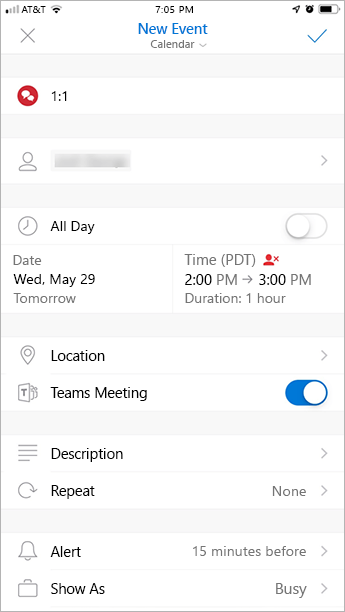

Usar o suplemento de Reunião do Teams no OutlookUse the Teams Meeting add-in in Outlook
=======================================

O suplemento de reunião do Teams permite que os usuários agendem uma reunião do Teams no Outlook.The Teams Meeting add-in lets users schedule a Teams meeting from Outlook. O suplemento está disponível para o Outlook no Windows, Mac, Web e dispositivos móveis.The add-in is available for Outlook on Windows, Mac, web, and mobile.

## Suplemento de reunião do Teams no Outlook para WindowsTeams Meeting add-in in Outlook for Windows

O suplemento de reunião do Teams é instalado automaticamente para usuários que possuem o Microsoft Teams e o Office 2010, Office 2013 ou Office 2016 instalado no PC com Windows.The Teams Meeting add-in is automatically installed for users who have Microsoft Teams and either Office 2010, Office 2013 or Office 2016 installed on their Windows PC. Os usuários verão o suplemento de reunião do Teams na faixa de opções Calendário do Outlook.Users will see the Teams Meeting add-in on the Outlook Calendar ribbon.

> [!NOTE]
> - Permissões de usuário para executar o arquivo regsvr32. exe é um requisito mínimo para o suplemento de reunião do teams ser instalado no computador.User permissions to execute the Regsvr32.exe file is a minimum requirement for the Teams Meeting add-in to be installed on the computer.
> - Se o suplemento de Reunião do Teams não for exibido, instrua os usuários a fechar o Outlook e o Teams e reiniciar o cliente Teams primeiro, depois entrar no Teams e então reiniciar o cliente Outlook, exatamente nessa ordem.If users do not see the Teams Meeting add-in, instruct them to close Outlook and Teams, then restart the Teams client first, then sign in to Teams, and then restart the Outlook client, in that specific order.
> - Os usuários do Windows 7 devem instalar a [Atualização para o Universal C Runtime no Windows](https://support.microsoft.com/help/2999226/update-for-universal-c-runtime-in-windows) no Windows para que o suplemento de reunião do Teams funcione.Windows 7 users must install the [Update for Universal C Runtime in Windows](https://support.microsoft.com/help/2999226/update-for-universal-c-runtime-in-windows) in Windows for the Teams Meeting add-in to work.
> - Se você estiver usando uma instalação do Office Outlook da Microsoft Store, não há suporte para o suplemento de reunião do teams.If you are using an Office Outlook installation from the Microsoft Store, the Teams Meeting add-in isn't supported. Os usuários que precisam desse suplemento são aconselhados a instalar a versão Click-to-Run do Office, conforme descrito no artigo [Office no Windows 10 no modo S](https://support.office.com/article/faq-office-on-windows-10-in-s-mode-717193b5-ff9f-4388-84c0-277ddf07fe3f).Users who require this add-in are advised to install Click-to-Run version of Office, as outlined in [Office on Windows 10 in S mode](https://support.office.com/article/faq-office-on-windows-10-in-s-mode-717193b5-ff9f-4388-84c0-277ddf07fe3f) article.

## Suplemento de reunião do Teams no Outlook para MacTeams Meeting add-in in Outlook for Mac

O botão reunião do teams no Outlook para Mac será exibido na faixa de opções do Outlook para Mac se o Outlook estiver executando o Build Build 16.24.414.0 e posterior e estiver ativado com uma assinatura de cliente do Office 365.The Teams Meeting button in Outlook for Mac will appear in the Outlook for Mac ribbon if Outlook is running production build 16.24.414.0 and later and is activated with an Office 365 client subscription.

As coordenadas da reunião (os números de discagem e de ingresso no Teams) serão adicionadas ao convite da reunião depois que o usuário clicar em **Enviar**.The meeting coordinates (the Teams join link and dial-in numbers) will be added to the meeting invite after the user clicks **Send**.  

## Suplemento de reunião do Teams no Outlook Web AppTeams Meeting add-in in Outlook Web App

O botão Reunião do Teams no Outlook Web App aparecerá como parte da criação de um novo evento se o usuário estiver em uma versão anterior do novo Outlook na Web.The Teams Meetings button in Outlook Web App will appear as part of new event creation if the user is on an early version of the new Outlook on the web. Consulte o [Blog do Outlook](https://techcommunity.microsoft.com/t5/Outlook-Blog/Designed-to-be-fast-The-Outlook-on-the-web-user-experience-gets/ba-p/234909?utm_source=t.co&utm_medium=referral) para saber como os usuários podem experimentar a versão inicial do novo Outlook na Web.See the [Outlook Blog](https://techcommunity.microsoft.com/t5/Outlook-Blog/Designed-to-be-fast-The-Outlook-on-the-web-user-experience-gets/ba-p/234909?utm_source=t.co&utm_medium=referral) to learn about how users can try the early version of the new Outlook on the web.

As coordenadas da reunião (os números de discagem e de ingresso no Teams) serão adicionadas ao convite da reunião depois que o usuário clicar em **Enviar**.The meeting coordinates (the Teams join link and dial-in numbers) will be added to the meeting invite after the user clicks **Send**.  

## Suplemento de reunião do Teams no Outlook para dispositivos móveis (iOS e Android)Teams Meeting add-in in Outlook mobile (iOS and Android)

O botão Reunião do Teams é exibido nas versões mais recentes do aplicativo do Outlook para iOS e Android.The Teams Meeting button shows up in latest builds of the Outlook iOS and Android app.

As coordenadas da reunião (os números de discagem e de ingresso no Teams) serão adicionadas ao convite da reunião depois que o usuário clicar em **Enviar**.The meeting coordinates (the Teams join link and dial-in numbers) will be added to the meeting invite after the user clicks **Send**.  

## Suplemento de reunião do Teams e Verificador de Horas para o OutlookTeams Meeting add-in in and FindTime for Outlook
O Verificador de Horas é um suplemento para o Outlook que ajuda os usuários a chegarem a um consenso entre as empresas sobre um horário de reunião.FindTime is an add-in for Outlook that helps users reach a consensus on a meeting time across companies. Depois que os convidados da reunião fornecem seu horário preferido, o Verificador de Horas envia o convite da reunião em nome do usuário.Once the meeting invitees have provided their preferred times, FindTime sends out the meeting invite on the user's behalf. Se a opção **Reunião online** estiver selecionada no Verificador de Horas, o Verificador de Horas agendará uma reunião do Skype for Business ou Microsoft Teams.If the **Online meeting** option is selected in FindTime, FindTime will schedule a Skype for Business or Microsoft Teams meeting. (O Verificador de Horas usará o que tiver sido definido pela sua organização como o canal de reunião online padrão.)(FindTime will use whichever has been set by your organization as the default online meeting channel.)

> [!NOTE]  
> Se você salvou uma configuração do Skype for Business no [painel do Verificador de Horas](https://findtime.microsoft.com/UserDashboard), o Verificador de Horas usará essa configuração em vez do Microsoft Teams.If you saved a Skype for Business setting in your [Findtime dashboard](https://findtime.microsoft.com/UserDashboard), FindTime will use that instead of Microsoft Teams. Se você deseja usar o Microsoft Teams, exclua a configuração do Skype for Business no seu painel.If you want to use Microsoft Teams, delete the Skype for Business setting in your dashboard.

Consulte [Agendar reuniões com o Verificador de Horas](https://support.office.com/article/scheduling-meetings-with-findtime-4dc806ed-fde3-4ea7-8c5e-b5d1fddab4a6) para obter mais informações.See [Schedule meetings with FindTime](https://support.office.com/article/scheduling-meetings-with-findtime-4dc806ed-fde3-4ea7-8c5e-b5d1fddab4a6) for more information.

## Requisitos de autenticaçãoAuthentication requirements

O suplemento de Reunião do Teams requer que os usuários entrem no Teams usando a autenticação moderna.The Teams Meeting add-in requires users to sign in to Teams using Modern Authentication. Se os usuários não utilizarem esse método para entrar, poderão usar o cliente Teams, mas não conseguirão agendar reuniões online do Teams usando o suplemento do Outlook.If users do not use this method to sign in, they’ll still be able to use the Teams client, but will be unable to schedule Teams online meetings using the Outlook add-in. Você pode corrigir isso da seguinte maneira:You can fix this by doing one of the following:

- Se a autenticação moderna não estiver configurada para a sua organização, você deverá fazer isso.If Modern Authentication is not configured for your organization, you should configure Modern Authentication.
- Se a Autenticação Moderna estiver configurada, mas os usuários tiverem cancelado a mesma na caixa de diálogo, você deve instruir os usuários a entrarem novamente usando a autenticação multifator.If Modern Authentication is configured, but they canceled out on the dialog box, you should instruct users to sign in again using multi-factor authentication.

Para saber mais sobre como configurar a autenticação, veja [Modelos de identidade e autenticação no Microsoft Teams](identify-models-authentication.md).To learn more about how to configure authentication, see [Identity models and authentication in Microsoft Teams](identify-models-authentication.md).

## Habilitar reuniões privadasEnable private meetings

A **permissão para agendar reuniões privadas** deve estar ativada no centro de administração do Microsoft Teams para que o suplemento seja implantado.**Allow scheduling for private meetings** must be enabled in the Microsoft Teams admin center for the add-in to get deployed. No centro de administração, vá para **Reuniões** > **Políticas de Reunião**, e na seção **Geral**, ative **Permitir agendamento de reuniões particulares** para Ativado.)In the admin center, go to **Meetings** > **Meeting Policies**, and in the **General** section, toggle **Allow scheduling private meetings** to On.)

O cliente Teams instala o suplemento correto, determinando se os usuários precisam da versão de 32 ou de 64 bits.The Teams client installs the correct add-in by determining if users need the 32-bit or 64-bit version.

> [!NOTE]
> Talvez os usuários precisem reiniciar o Outlook após uma instalação ou atualização do Teams para obter o suplemento mais recente.Users might need to restart Outlook after an installation or upgrade of Teams to get the latest add-in.

## Diretiva de atualização do Teams e o suplemento de reunião do Teams para OutlookTeams upgrade policy and the Teams Meeting add-in for Outlook

Os clientes podem [escolher sua jornada de atualização do Skype for Business para o Teams](upgrade-and-coexistence-of-skypeforbusiness-and-teams.md).Customers can [choose their upgrade journey from Skype for Business to Teams](upgrade-and-coexistence-of-skypeforbusiness-and-teams.md). Os administradores de locatários podem usar o modo de coexistência do Teams para definir essa jornada para seus usuários.Tenant admins can use the Teams co-existence mode to define this journey for their users. Os administradores de locatários têm a opção de permitir que os usuários usem o Teams juntamente ao Skype for Business (modo Ilhas).Tenant admins have the option to enable users to use Teams alongside Skype for Business (Islands mode). 

Quando os usuários que estão no modo Ilha agendam uma reunião no Outlook, eles normalmente esperam poder escolher agendar uma reunião do Skype for Business ou do Teams.When users who are in Island mode schedule a meeting in Outlook, they typically expect to be able to choose whether to schedule a Skype for Business or a Teams meeting. No Outlook na Web, Outlook para Windows e Outlook para Mac, os usuários veem tanto o suplemento do Skype for Business como o do Teams quando estão no modo Ilhas.In Outlook on the web, Outlook Windows, and Outlook Mac, users see both Skype for Business and Teams add-ins when in Islands mode. Devido a certas limitações na versão inicial, o Outlook mobile pode oferecer suporte apenas à criação de reuniões do Skype for Business **ou** do Teams.Due to certain limitations in the initial release, Outlook mobile can only support creating Skype for Business **or** Teams meetings. Veja a tabela a seguir para obter detalhes.See the following table for details.

| Modo de coexistência no centro de administração do TeamsCoexistence mode in the Teams admin center | Provedor de reuniões padrão no Outlook mobileDefault meetings provider in Outlook mobile |
| --------------------------------------|---------------------------------------------|
| IlhasIslands | Skype for BusinessSkype for Business |
| Somente Skype for BusinessSkype for Business only | Skype for BusinessSkype for Business |
| Colaboração do Skype for Business com o TeamsSkype for Business with Teams collaboration | Skype for BusinessSkype for Business |
| Colaboração e reuniões do Skype for Business com o TeamsSkype for Business with Teams collaboration and meetings | TeamsTeams |
| Somente TeamsTeams only | TeamsTeams |

## Outras consideraçõesOther considerations

O suplemento de Reunião do Teams ainda está desenvolvendo funcionalidades, então esteja ciente do seguinte:The Teams Meeting add-in is still building functionality, so be aware of the following:

- O suplemento destina-se a reuniões agendadas com participantes específicos, não a reuniões em um canal.The add-in is for scheduled meetings with specific participants, not for meetings in a channel. As reuniões do canal devem ser agendadas dentro do Teams.Channel meetings must be scheduled from within Teams.
- O suplemento não funcionará se houver um proxy de autenticação no caminho de rede do computador do usuário e dos serviços do Teams.The add-in will not work if an Authentication Proxy is in the network path of user's PC and Teams Services.
- Os usuários não podem agendar eventos ao vivo no Outlook.Users can't schedule live events from within Outlook. Vá para o Teams para agendar eventos ao vivo.Go to Teams to schedule live events. Para obter mais informações, consulte [O que são eventos ao vivo do Microsoft Teams?](teams-live-events/what-are-teams-live-events.md).For more information, see [What are Microsoft Teams live events?](teams-live-events/what-are-teams-live-events.md).

## Solução de problemasTroubleshooting

Se você não conseguir instalar o suplemento Teams Meeting para o Outlook, tente estas etapas de solução de problemas.If you cannot get the Teams Meeting add-in for Outlook to install, try these troubleshooting steps.

- Verifique se todas as atualizações disponíveis para o cliente da área de trabalho do Outlook foram aplicadas.Ensure all available updates for Outlook desktop client have been applied.
- Reinicie o cliente de área de trabalho do Teams.Restart the Teams desktop client.
- Saia e entre novamente no cliente de área de trabalho do Teams.Sign out and then sign back in to the Teams desktop client.
- Reinicie o cliente para área de trabalho do Outlook.Restart the Outlook desktop client. (Certifique-se de que o Outlook não esteja sendo executado no modo de administrador.)(Make sure Outlook isn’t running in admin mode.)
- Certifique-se de que o nome da conta do usuário que efetuou logon não contenha espaços.Make sure the logged-in user account name does not contain spaces. (Esse é um problema conhecido e será corrigido em uma atualização futura.)(This is a known issue, and will be fixed in a future update.)
- Certifique-se de que o logon único (SSO) esteja ativado.Make sure single sign-on (SSO) is enabled.

Se o seu administrador configurou o Microsoft Exchange para [controlar o acesso ao Exchange Web Server (EWS)](https://docs.microsoft.com/exchange/client-developer/exchange-web-services/how-to-control-access-to-ews-in-exchange), um representante não poderá agendar uma reunião do Teams em nome do chefe.If your administrator has configured Microsoft Exchange to [control access to Exchange Web Server (EWS)](https://docs.microsoft.com/exchange/client-developer/exchange-web-services/how-to-control-access-to-ews-in-exchange), a delegate won't be able to schedule a Teams meeting on behalf of the boss. A solução para esta configuração está em desenvolvimento e será lançada no futuro.The solution for this configuration is under development and will be released in the future. 

Para obter orientações gerais sobre como desabilitar suplementos, veja [Exibir, gerenciar e instalar suplemento nos programas do Office](https://support.office.com/article/View-manage-and-install-add-ins-in-Office-programs-16278816-1948-4028-91E5-76DCA5380F8D).For general guidance about how to disable add-ins, see [View, manage, and install add-ins in Office programs](https://support.office.com/article/View-manage-and-install-add-ins-in-Office-programs-16278816-1948-4028-91E5-76DCA5380F8D).

Saiba mais sobre [reuniões e chamadas no Microsoft Teams](https://support.office.com/article/Meetings-and-calls-d92432d5-dd0f-4d17-8f69-06096b6b48a8).Learn more about [meetings and calling in Microsoft Teams](https://support.office.com/article/Meetings-and-calls-d92432d5-dd0f-4d17-8f69-06096b6b48a8).
