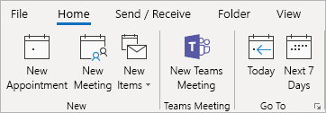

Usar o suplemento de Reunião do Teams no OutlookUse the Teams Meeting add-in in Outlook
=======================================
> [!IMPORTANT]
> [!INCLUDE [new-teams-sfb-admin-center-notice](includes/new-teams-sfb-admin-center-notice.md)]

O suplemento de Reunião do Teams é instalado automaticamente para os usuários que têm o Microsoft Teams e o Office 2013 ou o Office 2016 instalados em seus computadores Windows.The Teams Meeting add-in is automatically installed for users who have Microsoft Teams and either Office 2013 or Office 2016 installed on their Windows PC. Os usuários verão o suplemento de Reunião do Teams na faixa de opções Calendário do Outlook.Users will see the Teams Meeting add-in on the Outlook Calendar ribbon. 

Se o suplemento de Reunião do Teams não for exibido, instrua os usuários a fechar o Outlook e o Teams e reiniciar o cliente Teams primeiro, depois entrar no Teams e então reiniciar o cliente Outlook, exatamente nessa ordem.If users do not see the Teams Meeting add-in, instruct them to close Outlook and Teams, then restart the Teams client first, then sign in to Teams, and then restart the Outlook client, in that specific order.

> [!NOTE]
> O suplemento de Reunião do Teams para o Outlook ainda não está disponível para usuários do Mac.The Teams Meeting add-in for Outlook is currently not available for Mac users.

## Requisitos de autenticaçãoAuthentication requirements

O suplemento de Reunião do Teams requer que os usuários entrem no Teams usando a autenticação moderna.The Teams Meeting add-in requires users to sign in to Teams using Modern Authentication. Se os usuários não utilizarem esse método para entrar, poderão usar o cliente Teams, mas não conseguirão agendar reuniões online do Teams usando o suplemento do Outlook.If users do not use this method to sign in, they’ll still be able to use the Teams client, but will be unable to schedule Teams online meetings using the Outlook add-in. Você pode corrigir isso da seguinte maneira:You can fix this by doing one of the following:

- Se a autenticação moderna não estiver configurada para a sua organização, você deverá fazer isso.If Modern Authentication is not configured for your organization, you should configure Modern Authentication.
- Se a autenticação moderna estiver configurada, mas os usuários cancelaram a caixa de diálogo, você deverá instruí-los para entrar novamente usando a autenticação multifator.If Modern Authentication is configured, but they cancelled out on the dialog box, you should instruct users to sign in again using multi-factor authentication.

Para saber mais sobre como configurar a autenticação, veja [Modelos de identidade e autenticação no Microsoft Teams](identify-models-authentication.md).To learn more about how to configure authentication, see [Identity models and authentication in Microsoft Teams](identify-models-authentication.md).

## Habilitar reuniões privadasEnable private meetings

A permissão de agendamento de reuniões privadas deve ser habilitada no [Centro de administração do Office 365](https://portal.office.com/adminportal/home) para que o plug-in seja implantado.Allow scheduling for private meetings must be enabled from the [Office 365 admin center](https://portal.office.com/adminportal/home) for the plug-in to get deployed.

O cliente Teams instala o suplemento correto, determinando se os usuários precisam da versão de 32 ou de 64 bits.The Teams client installs the correct add-in by determining if users need the 32-bit or 64-bit version.

> [!NOTE]
> Talvez os usuários precisem reiniciar o Outlook após uma instalação ou atualização do Teams para obter o suplemento mais recente.Users might need to restart Outlook after an installation or upgrade of Teams to get the latest add-in.

## Outras consideraçõesOther considerations

O suplemento de Reunião do Teams ainda está desenvolvendo funcionalidades, então esteja ciente do seguinte:The Teams Meeting add-in is still building functionality, so be aware of the following:
- Alguns recursos de reunião online, como a gravação, a votação e o quadro de comunicações, ainda não estão disponíveis.Some online meeting features, such as recording, polling, and whiteboarding are not yet available.
- As opções de reunião ainda não estão disponíveis.Meeting options are currently not available.
- No momento, você pode apenas convidar pessoas da sua empresa, pois ainda não é possível o ingresso de usuários externos nas reuniões.Currently, you can only invite people from within your company, as it is not yet possible for external users to join meetings.
- O suplemento destina-se a reuniões agendadas com participantes específicos, não a reuniões em um canal.The add-in is for scheduled meetings with specific participants, not for meetings in a channel. As reuniões do canal devem ser agendadas dentro do Teams.Channel meetings must be scheduled from within Teams. Atualmente, o suplemento de Reunião do Teams no Outlook está disponível apenas para usuários do Windows, mas o suporte para Mac será disponibilizado em breve.Currently, the Teams Meeting add-in in Outlook is only available for Windows users, but support for Mac is coming.
- O suplemento não funcionará se houver um proxy de autenticação no caminho de rede do computador do usuário e dos serviços do Teams.The add-in will not work if an Authentication Proxy is in the network path of user's PC and Teams Services.

## Solução de problemasTroubleshooting

Se você não conseguir a reunião de equipes suplemento para Outlook a fim de instalar, tente essas etapas de solução de problemas.If you cannot get the Teams Meeting add-in for Outlook to install, try these troubleshooting steps.

- Reinicie o cliente de área de trabalho de equipes.Restart the Teams desktop client.
- Sair e entrar novamente para o cliente de desktop equipes.Sign out and then sign back in to the Teams desktop client.
- Reinicie o cliente de desktop do Outlook.Restart the Outlook desktop client. (Certifique-se de que o Outlook não está em execução no modo de admin.)(Make sure Outlook isn’t running in admin mode.)
- Verifique se que o nome da conta de usuário que fez logon não contém espaços.Make sure the logged-in user account name does not contain spaces. (Isso é um problema conhecido e será corrigido em uma atualização futura.)(This is a known issue, and will be fixed in a future update.)
- Certifique-se de logon único (SSO) está habilitado.Make sure single sign-on (SSO) is enabled.

Para obter orientações gerais sobre como desabilitar suplementos, veja [Exibir, gerenciar e instalar suplemento nos programas do Office](https://support.office.com/article/View-manage-and-install-add-ins-in-Office-programs-16278816-1948-4028-91E5-76DCA5380F8D).For general guidance about how to disable add-ins, see [View, manage, and install add-ins in Office programs](https://support.office.com/article/View-manage-and-install-add-ins-in-Office-programs-16278816-1948-4028-91E5-76DCA5380F8D).

Saiba mais sobre [reuniões e chamadas no Microsoft Teams](https://support.office.com/article/Meetings-and-calls-d92432d5-dd0f-4d17-8f69-06096b6b48a8).Learn more about [meetings and calling in Microsoft Teams](https://support.office.com/article/Meetings-and-calls-d92432d5-dd0f-4d17-8f69-06096b6b48a8).
