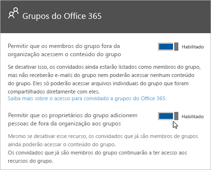

Autorizar o acesso para convidado no Microsoft Teams
===========================================

Para atender às exigências de sua organização, você pode gerenciar os recursos e as funcionalidades de acesso de convidados no Microsoft Teams por meio de quatro níveis diferentes de autorização. Todos os níveis de autorização são aplicáveis ao seu locatário do Office 365. Cada nível de autorização controla a experiência do convidado conforme mostrado a seguir:

- **Azure Active Directory**: O acesso de convidados no Microsoft Teams usa a plataforma B2B (entre empresas) do Azure AD. Esse nível de autorização controla a experiência dos convidados com relação a diretório, locatário e aplicativo.
- **Microsoft Teams**: controla a experiência do convidado somente no Microsoft Teams.
- **Grupos do Office 365**: Controla a experiência dos convidados nos Grupos do Office 365 e no Microsoft Teams.
- **SharePoint Online e OneDrive for Business**: Controla a experiência dos convidados no SharePoint Online, no OneDrive for Business, nos Grupos do Office 365 e no Microsoft Teams.

Esses níveis diferentes de autorização fornecem flexibilidade para a forma como você configura o acesso de convidados para sua organização. Por exemplo, se você não quiser permitir o acesso a usuários convidados em suas equipes da Microsoft, mas quiser permiti-lo em sua organização, basta desativar o acesso de convidados no Microsoft Teams. Outro exemplo: você pode habilitar o acesso de convidados no Azure AD, no Microsoft Teams e nos Grupos do Office 365, mas depois desabilitar a adição de usuários convidados em equipes selecionadas que correspondam a um ou mais critérios, como a classificação de dados correspondente à confidencialidade. O SharePoint Online e o OneDrive for Business têm suas próprias configurações de acesso de convidados que não dependem dos Grupos do Office 365.

> [!NOTE]
> Os convidados estão sujeitos aos limites de serviço do [Office 365](https://go.microsoft.com/fwlink/p/?linkid=282347) e do [Azure Active Directory](https://go.microsoft.com/fwlink/p/?linkid=853019). 

O diagrama a seguir mostra como a dependência de autorização de acesso de convidados é concedida e integrada entre o Azure Active Directory, o Microsoft Teams e o Office 365.

O próximo diagrama mostra, em um nível elevado, como a experiência do usuário funciona com o modelo de permissão por meio de um convite de acesso a convidados e um fluxo de resgate típicos.

É importante observar aqui que aplicativos, bots e conectores podem exigir seu próprio conjunto de permissões e/ou consentimento específico para a conta do usuário. Estes podem precisar ser concedidos separadamente. Da mesma forma, o SharePoint pode impor limites de compartilhamento externo adicionais para um usuário específico ou grupos de usuários, ou até mesmo no nível do site.

Os dois diagramas anteriores também estão disponíveis no [Visio](https://github.com/MicrosoftDocs/OfficeDocs-SkypeForBusiness/blob/live/Teams/media/teams_dependencies.vsdx?raw=true).

## Controlar o acesso de convidados no Active Directory do Azure

Use o Azure AD para determinar se os colaboradores externos podem ser receber um convite para acessar o seu locatário como convidados, e de que maneira. Para obter mais informações sobre o acesso a convidados B2B do Azure, consulte [O que é o acesso do usuário convidado no B2B do Azure Active Directory](https://docs.microsoft.com/pt-BR/azure/active-directory/b2b/what-is-b2b). Para obter informações sobre as funções do Azure AD, consulte [Conceder permissões a usuários de organizações parceiras em seu locatário do Azure Active Directory](https://docs.microsoft.com/pt-BR/azure/active-directory/b2b/add-guest-to-role).

As configurações de convites são aplicáveis no nível do locatário e controlam a experiência dos convidados no nível de diretório, locatário e aplicativo. Para definir essas configurações no portal do Azure, vá para **Azure Active Directory** > **Usuários** > **Configurações do usuário** e, sob **Usuários externos**, selecione **Gerenciar configurações de colaboração externa**.

O Azure AD inclui as seguintes configurações para configurar usuários externos:

- **As permissões de usuário convidado são limitadas**: **Sim** significa que os convidados não têm permissão para determinadas tarefas de diretório, como enumerar usuários, grupos ou outros recursos de diretório. Além disso, os convidados não podem ser atribuídos a funções administrativas em seu diretório. **Não** significa que os convidados têm o mesmo acesso aos dados de diretório que os usuários comuns têm em seu diretório.
- **Os administradores e usuários na função de emissor de convite para convidado podem enviar convites**: **Sim** significa que os administradores e usuários na função de emissor de convite para convidado poderão convidar pessoas para o locatário. **Não** significa que os administradores e usuários não podem convidar pessoas para o locatário.
- **Membros podem convidar**: **Sim** significa que os membros não administradores do seu diretório podem enviar convites a convidados a fim de que colaborem em recursos protegidos pelo seu Azure AD, como sites do SharePoint ou recursos do Azure. **Não** significa que apenas os administradores podem convidar pessoas para o seu diretório. 
      
    > [!NOTE]
    > Atualmente, o Teams não possui suporte para a função de emissor de convite a convidado. No mínimo, a opção de **Membros podem convidar** deve ser definida como **Sim** para que o acesso a convidados funcione no Teams.
- **Convidados podem convidar**: **Sim** significa que os convidados em seu diretório podem enviar convites a outros convidados a fim de que colaborem em recursos protegidos pelo seu Azure AD, como sites do SharePoint ou recursos do Azure. **Não** significa que os convidados não podem enviar convites a outros convidados a fim de que colaborem com a sua organização.
 
Para obter mais informações sobre como controlar quem pode convidar pessoas, consulte [Delegar convites para colaboração B2B do Active Directory do Azure](https://docs.microsoft.com/pt-BR/azure/active-directory/b2b/delegate-invitations).

> [!NOTE]
> Você também pode gerenciar quais domínios podem receber convites para acessar seu locatário como convidados. Consulte [Permitir/Bloquear o acesso de convidados a Grupos do Office 365](https://docs.microsoft.com/exchange/recipients-in-exchange-online/manage-group-access-to-office-365-groups).

Não é necessário adicionar a conta de convidado do usuário manualmente ao B2B do Azure AD, pois a conta será adicionada ao diretório automaticamente quando você adicionar o convidado ao Teams.

O licenciamento do Azure AD permite adicionar até 5 convidados por licença. Para obter mais informações sobre o licenciamento do Azure AD, consulte o [guia de licenciamento de colaboração B2B do Azure Active Directory](https://docs.microsoft.com/pt-BR/azure/active-directory/b2b/licensing-guidance).

## Controle o acesso de convidados no Teams

No Teams, você pode controlar se a experiência do convidado está ativada ou desativada para sua organização. A configuração é desativada por padrão e se aplica no nível do locatário somente para o Teams.

Você pode gerenciar as configurações de acesso de convidado do Teams no centro de administração do Microsoft Teams. Para obter mais informações, consulte [Ativar ou desativar o acesso de convidados ao Microsoft Teams](set-up-guests.md). 

## Controlar o acesso de convidados em grupos do Office 365

Nos Grupos do Office 365, você pode controlar a adição de usuários convidados e o acesso de convidados a todos os Grupos do Office 365 e ao Microsoft Teams em sua organização.

1. Entre com sua conta de administrador global do Office 365 em [https://portal.office.com/adminportal/home](https://portal.office.com/adminportal/home).

2. No menu de navegação, escolha **Configurações** e, em seguida, selecione **Serviços &amp; complementos**.

3. Selecione **Grupos do Office 365**.

     
  
4. Na página de Grupos do Office 365, alterne entre **Ativado** e **Desativado**, conforme você desejar permitir que os proprietários de equipes e grupos fora da sua organização acessem os Grupos do Office 365. Clique ou toque no botão para defini-lo como **Ativado** ao lado de **Permitir que os proprietários do grupo adicionem pessoas fora da organização aos grupos**. Se esta opção for definida como **Ativado**, você verá outra opção para controlar se deseja permitir que os proprietários de grupos e equipes adicionem pessoas fora da sua organização a Grupos do Office 365 e Microsoft Teams. Defina esta opção como **Ativado** se você quiser permitir que os proprietários de grupos e equipes adicionem usuários convidados. 
 
   

Essas configurações se aplicam no nível do locatário e controlam a experiência do convidado nos Grupos do Office 365 e no Microsoft Teams.

Consulte [Acesso a convidados nos Grupos do Office 365](https://support.office.com/pt-BR/article/Guest-access-in-Office-365-Groups-bfc7a840-868f-4fd6-a390-f347bf51aff6) para obter mais informações sobre o acesso a convidados nos grupos, incluindo como o acesso a convidados funciona e como gerenciar o acesso a convidados e respostas a perguntas frequentes.

## Controle o acesso a convidados no SharePoint Online e OneDrive for Business

O Teams depende do SharePoint Online e do OneDrive for Business para armazenar arquivos e documentos para canais e conversas de bate-papo.  

Para habilitar a experiência completa de acesso de convidados no Teams, os administradores do Office 365 precisam selecionar **Habilitar** nas seguintes configurações:

- No SharePoint Online: **Convidados existentes**, **Convidados novos e existentes**, ou **Qualquer pessoa**

    Para obter mais informações, confira [Ativar ou desativar o compartilhamento externo](https://docs.microsoft.com/sharepoint/turn-external-sharing-on-or-off).

- Nos Grupos do Office 365: **Permitir que os proprietários do grupo adicionem pessoas fora da organização aos grupos**

    Para obter mais informações, confira [Controlar o acesso a convidados nos Grupos do Office 365](#control-guest-access-in-office-365-groups), acima.
  
Essas configurações se aplicam no nível do locatário e controlam a experiência do convidado no SharePoint Online, no OneDrive for Business, nos Grupos do Office 365 e no Teams.

Você pode gerenciar as configurações de usuário externo do SharePoint Online para o site de equipe conectado ao Teams. Para obter mais detalhes, veja [Gerenciar as configurações do site da sua equipe do SharePoint](https://support.office.com/article/Manage-your-SharePoint-team-site-settings-8376034d-d0c7-446e-9178-6ab51c58df42).

## Acesso de convidado vs. acesso externo (federação)

[!INCLUDE [guest-vs-external-access](includes/guest-vs-external-access.md)]
