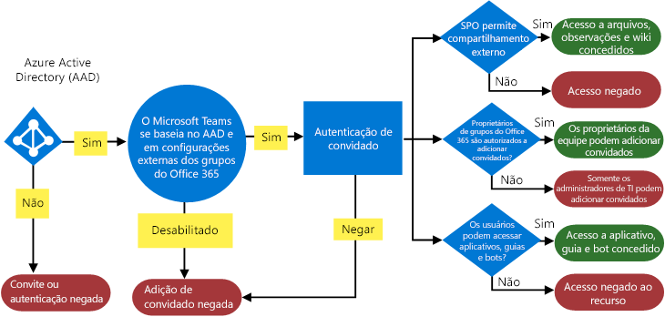
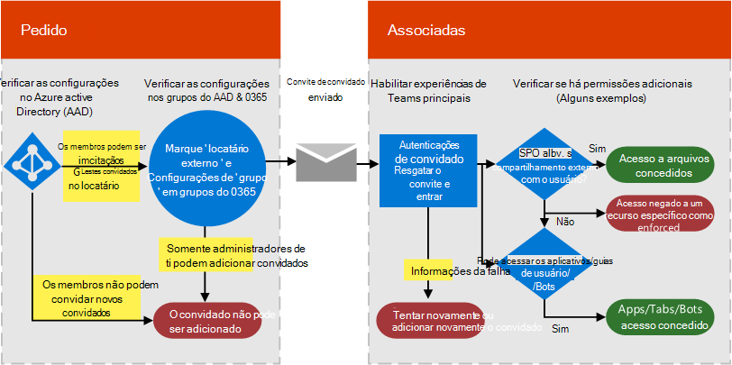

# Autorizar o acesso para convidado no Microsoft Teams

Para satisfazer os requisitos da sua organização, você pode gerenciar recursos e recursos do acesso de convidados do teams por meio de quatro níveis diferentes de autorização. Todos os níveis de autorização se aplicam à sua organização do Microsoft 365. Cada nível de autorização controla a experiência do convidado conforme mostrado a seguir:

- **Active Directory do Azure**: o acesso de convidado no Teams depende da plataforma do Azure ad Business-to-Business (B2B). Esse nível de autorização controla a experiência dos convidados com relação a diretório, locatário e aplicativo.
- **Teams**: controla a experiência de convidado somente em Teams.
- **Grupos do microsoft 365**: controla a experiência de convidado no Microsoft 365 grupos e equipes.
- **SharePoint e onedrive**: controla a experiência de convidado no SharePoint, no onedrive, nos grupos do Microsoft 365 e nas equipes.

Esses níveis diferentes de autorização fornecem flexibilidade para a forma como você configura o acesso de convidados para sua organização. Por exemplo, se você não quiser permitir usuários convidados no Microsoft Teams, mas quiser permitir que ele seja geral em sua organização, basta desativar o acesso de convidado no Microsoft Teams. Outro exemplo: você pode habilitar o acesso de convidado nos níveis do Azure AD, do Teams e de grupos, mas então [desabilitar a adição de usuários convidados em equipes selecionadas que correspondam a um ou mais critérios, como a classificação de dados é igual a confidencial](https://docs.microsoft.com/microsoft-365/compliance/sensitivity-labels-teams-groups-sites). O SharePoint e o OneDrive têm suas próprias configurações de acesso de convidado que não dependem dos grupos do Microsoft 365.

Para obter instruções de configuração do acesso a convidados ponto a ponto, consulte [colaborar com convidados em uma equipe](https://docs.microsoft.com/microsoft-365/solutions/collaborate-as-team).

> [!NOTE]
> Os convidados estão sujeitos aos limites de serviços descritos nas [Descrições de serviços do Microsoft 365 e do Office 365](https://go.microsoft.com/fwlink/p/?linkid=282347) e [Limitações da colaboração B2B do Azure AD](https://docs.microsoft.com/azure/active-directory/external-identities/current-limitations). 

O diagrama a seguir mostra como a dependência de autorização de acesso de convidado é concedida e integrada entre o Azure Active Directory, o Teams e o Microsoft 365.

O próximo diagrama mostra, em um nível elevado, como a experiência do usuário funciona com o modelo de permissão por meio de um convite de acesso a convidados e um fluxo de resgate típicos.

É importante observar aqui que aplicativos, bots e conectores podem exigir seu próprio conjunto de permissões e/ou consentimento específicos para a conta de usuário. Estes podem precisar ser concedidos separadamente. Da mesma forma, o SharePoint pode impor limites de compartilhamento externo adicionais para um usuário específico ou grupos de usuários, ou até mesmo no nível do site.

Os dois diagramas anteriores também estão disponíveis no [Visio](https://github.com/MicrosoftDocs/OfficeDocs-SkypeForBusiness/blob/live/Teams/media/teams_dependencies.vsdx?raw=true).

## Controlar o acesso de convidados no Active Directory do Azure

Use o Azure AD para determinar se os colaboradores externos podem ser receber um convite para acessar o seu locatário como convidados, e de que maneira. Para obter mais informações sobre o acesso a convidados B2B do Azure, consulte [O que é o acesso do usuário convidado no B2B do Azure Active Directory](https://docs.microsoft.com/azure/active-directory/b2b/what-is-b2b). Para obter informações sobre as funções do Azure AD, consulte [Conceder permissões a usuários de organizações parceiras em seu locatário do Azure Active Directory](https://docs.microsoft.com/azure/active-directory/b2b/add-guest-to-role).

As configurações de convites se aplicam ao nível da organização e controlam a experiência de convidado no nível do diretório e do aplicativo. Você pode definir essas configurações em [configurações de colaboração externa](https://aad.portal.azure.com/#blade/Microsoft_AAD_IAM/CompanyRelationshipsMenuBlade/Settings).

O Azure AD inclui as seguintes configurações para configurar usuários externos:

- [Restrições de acesso de usuário convidado](https://docs.microsoft.com/azure/active-directory/users-groups-roles/users-restrict-guest-permissions)

- **Os administradores e usuários na função de emissor de convite para convidado podem enviar convites**: **Sim** significa que os administradores e usuários na função de emissor de convite para convidado poderão convidar pessoas para o locatário. **Não** significa que os administradores e usuários não podem convidar pessoas para o locatário.
- **Os membros podem convidar**: para permitir que os membros não administradores do seu diretório convidem pessoas, defina essa política como **Sim** (recomendado). Se preferir que somente os administradores sejam capazes de adicionar convidados, você pode definir essa política como **Não**. Lembre-se de que definir **Não** limitará a experiência de convidado para proprietários de equipes não administrativos; eles só poderão adicionar convidados ao Teams que já foram adicionados ao AAD pelo administrador.
- **Convidados podem convidar**: **Sim** significa que os convidados em seu diretório podem enviar convites a outros convidados a fim de que colaborem em recursos protegidos pelo seu Azure AD, como sites do SharePoint ou recursos do Azure. **Não** significa que os convidados não podem enviar convites a outros convidados a fim de que colaborem com a sua organização.
    > [!IMPORTANT]
    > Atualmente, o Teams não oferece suporte à função de emissor de convites, portanto, mesmo se você definir **Convidados possam convidar** para **Sim**, os convidados não conseguirão convidar outros convidados no Teams.
 
Para obter mais informações sobre como controlar quem pode convidar convidados, consulte [habilitar a colaboração externa B2B e gerenciar quem pode convidar convidados](https://docs.microsoft.com/azure/active-directory/b2b/delegate-invitations).

> [!NOTE]
> Você também pode gerenciar quais domínios podem receber convites para acessar seu locatário como convidados. Consulte [permitir ou bloquear convites para usuários B2B de organizações específicas](https://docs.microsoft.com/azure/active-directory/external-identities/allow-deny-list).

Não é necessário adicionar a conta de convidado do usuário manualmente ao B2B do Azure AD, pois a conta será adicionada ao diretório automaticamente quando você adicionar o convidado ao Teams.

### Licenciamento para acesso de convidado

O licenciamento de acesso de convidado usa o preço de identidade externa do Azure AD e baseia-se em convidados ativos mensais. Consulte o [modelo de cobrança para identidades externas do Azure ad](https://docs.microsoft.com/azure/active-directory/external-identities/external-identities-pricing) para obter detalhes.

> [!NOTE]
> Os usuários em sua organização que possuem apenas planos independentes de assinatura do Office 365, como o Plano 2 do Exchange Online, não podem receber convites para acessar a sua organização como convidados, pois o Teams considera esses usuários como pertencentes à mesma organização. Para esses usuários usarem o Teams, eles devem receber uma assinatura do Microsoft 365 Business Standard, do Office 365 Enterprise ou do Office 365 Education. 

## Acesso externo (federação) e o acesso de convidado

[!INCLUDE [guest-vs-external-access](includes/guest-vs-external-access.md)]

## Tópicos relacionados

- [Referência das configurações de compartilhamento de convidados do Microsoft 365](https://docs.microsoft.com/Office365/Enterprise/microsoft-365-guest-settings)

[Configurar a colaboração segura com o Microsoft 365](https://docs.microsoft.com/microsoft-365/solutions/setup-secure-collaboration-with-teams)
