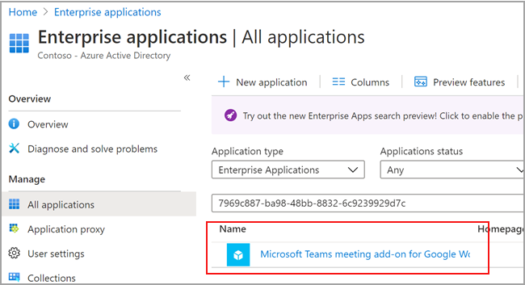

# <a name="set-up-microsoft-teams-meeting-add-on-for-google-workspace"></a>Configurar o complemento de reunião do Microsoft Teams para o Google Workspace

Usar o complemento de reunião do Microsoft Teams permite aos usuários do calendário do Google agendar e ingressar em uma reunião do Microsoft Teams diretamente do Google Workspace. Os usuários receberão acesso a recursos de reuniões de equipes, incluindo videoconferência e videoconferência, compartilhamento de tela, chat de reunião, quadros de comunicações digitais e muito mais. Mantenha-se conectado e organizado para se reunir mais juntos no trabalho, na escola e na vida.

O suplemento de reunião do Microsoft Teams para Google Workspace deve ser habilitado por um administrador de equipe antes que os usuários do locatário possam acessar o aplicativo.

## <a name="enable-or-disable-microsoft-teams-meeting-add-on-for-google-workspace-in-the-azure-portal"></a>Habilitar ou desabilitar o complemento Microsoft Teams Meeting para o Google Workspace no portal do Azure

Como administrador de locatários, você pode habilitar ou desabilitar um complemento de reunião do Microsoft Teams para o Google Workspace da conta de administrador da sua organização usando o portal do Azure.

O complemento está habilitado por padrão.

1. Entre no portal do Azure.

2. Selecione **aplicativos corporativos**  >  **todos os aplicativos**.

3. Pesquisar **o complemento de reunião do Microsoft Teams para Google Workspace**.

   

4. Selecione **Sim**.

   

5. Adicionais Para desabilitar o complemento, selecione **não** , em vez de **Sim** , na etapa 4.

## <a name="disable-microsoft-teams-meeting-add-on-for-google-workspace-using-powershell"></a>Desabilitar o complemento de reunião do Microsoft Teams para Google Workspace usando o PowerShell

```powershell
Connect-AzureAD

$displayName = 'Microsoft Teams meeting add-on for Google Workspace'
$appId = '7969c887-ba98-48bb-8832-6c9239929d7c'

# Check if a service principal already exists for the app
$servicePrincipal = Get-AzureADServicePrincipal -Filter "appId eq '$appId'"
if ($servicePrincipal) {
    # Service principal exists already, disable it
    Set-AzureADServicePrincipal -ObjectId $servicePrincipal.ObjectId -AccountEnabled $false
    Write-Host "Disabled existing Service Principal \n"
} else {
    # Service principal does not yet exist, create it and disable it at the same time
    New-AzureADServicePrincipal -AppId $appId -DisplayName $displayName
    $servicePrincipal = New-AzureADServicePrincipal -AppId $appId -DisplayName $displayName -AccountEnabled $false
    Write-Host "Created and disabled the Service Principal \n"
}
```

Para obter mais informações, consulte [criar uma entidade de serviço do Azure com o PowerShell do Azure](https://docs.microsoft.com/powershell/azure/create-azure-service-principal-azureps?view=azps-5.0.0).

## <a name="delete-the-microsoft-teams-meeting-add-on-for-google-workspace"></a>Excluir o complemento Microsoft Teams Meeting para o Google Workspace

Consulte a documentação do Google [excluir um aplicativo Marketplace do Google Workspace](https://support.google.com/a/answer/6216211?hl=en) para obter instruções.
