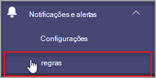
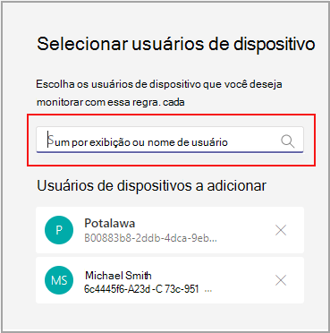

# Microsoft Teams monitoramento de saúde do dispositivo

O monitoramento de saúde do dispositivo no centro de administração Microsoft Teams oferece a capacidade de monitorar proativamente a saúde de vários Teams dispositivos. Monitore o estado offline de um dispositivo e receba alertas em tempo real se o dispositivo monitorado em sua organização ficar offline.  

Antes de começar, você precisará das permissões de criação de equipes/canal em seu locatário. [Saiba mais](/microsoft-365/solutions/manage-creation-of-groups?view=o365-worldwide).

## Configurar a regra de estado do dispositivo

1. Na navegação à esquerda do centro de administração Microsoft Teams, selecione **Notificações & regras de alertas.**  >  

   

2. Na página **Regras,** selecione **Regra de estado do dispositivo**.

3. Selecione o dispositivo para configurar a regra de estado para habilite alertas.

    

## Interpretar a configuração de regra

|Campo |Descrição  |
|--------|-------------|
|**Tipo de regra**   |A regra de estado do dispositivo ajuda você a gerenciar efetivamente. Teams e é classificado como um tipo de gerenciamento de dispositivo. No futuro, mais regras do tipo de gerenciamento de dispositivo estarão disponíveis para monitorar outros recursos relacionados (exemplos podem incluir: dispositivo não aldo e o status de entrada do dispositivo).|
|**Condição**   |Você pode monitorar a saúde dos dispositivos se eles ficarem offline. [Saiba mais sobre](../devices/device-management.md) o gerenciamento de dispositivos Teams centro de administração. |
|**Escopo**   |Você pode especificar com que frequência deseja monitorar o status de saúde do dispositivo mencionando a frequência de avaliação de regra. Por padrão, os dispositivos teams serão monitorados em tempo real quase em tempo real se eles ficarem offline. |
|**Usuários do dispositivo**   |Você pode especificar quais dispositivos precisam de monitoramento proativo de estatueta offline selecionando-os com base nos usuários conectados. Consulte [Selecionar dispositivos para obter](#select-devices-for-configuration) mais detalhes. |
|**Ações**  >  **Alerta de canal**   |Na seção Ações, você pode especificar canais de equipe para os quais deseja receber alertas. Atualmente, uma equipe padrão chamada **Alertas** e Notificações de Administrador e um canal chamado **MonitoringAlerts** será criado no qual as notificações serão entregues.     Administradores globais e Teams administradores em seu locatário serão adicionados automaticamente a essa equipe padrão.|
|**Ações**  >  **Webhook**   |Você também pode receber notificações com um webhook externo (opcional). Especifique uma URL de webhook pública externa na seção webhook onde uma carga de notificação JSON será enviada.      A carga de notificação, por meio de webhooks, pode ser integrada a outros sistemas em sua organização para criar fluxos de trabalho personalizados.   

**Esquema de carga JSON para webhook:**   
<pre lang="json">{      "type": "object",     "properties": {        "AlertTitle": { "type": "string "} ,       "DeviceLoggedInUserId": { "type": "string" } ,       "DeviceId": { "type": "string" } ,        "MetricValues": {              "type": "object",             "properties": {                   "DeviceHealthStatus": { "type": "string"}              }         } ,        "RuleName": { "type": "string"} ,        "RuleDescription": { "type": "string"} ,        "RuleFrequency": { "type": "string"} ,        "RuleType": { "type": "string"} ,        "TenantId": { "type": "string"} ,         "RuleCondition": { "type": "string"} ,         "AlertRaisedAt": { "type": "string"}      }  } </pre>   

  **Amostra de carga JSON**:    <pre lang="JSON">    {        "AlertTitle":"*sample_device_name* of *User_Name* has become offline",       "DeviceLoggedInUserId": *User_GUID* ,       "DeviceId": *Device_GUID* ,        "MetricValues": {           DeviceHealthStatus": "offline"              },                  "RuleName": "Device state rule" ,        "RuleDescription": ":"Alerts when device health status is detected as offline" ,        "RuleFrequency": "Real-time" ,        "RuleType": "Device Management" ,        "TenantId": *Tenant_GUID* ,         "RuleCondition": "DeviceHealthStatus = Offline" ,         "AlertRaisedAt": "2020-02-28T12:49:06Z"      }  </pre>   

## Selecionar dispositivos para configuração

1. Você pode selecionar Teams que deseja monitorar selecionando usuários conectados a esses dispositivos. Selecione **Adicionar** na seção **Usuários do** dispositivo.

2. Selecione um ou mais usuários para os quais você deseja monitorar o estado de saúde do dispositivo

   

   A lista selecionada de usuários mostra na **seção Usuários do** dispositivo. Você pode modificar essa lista adicionando ou removendo usuários.

Todos os dispositivos de entrada usados pela lista selecionada de usuários serão monitorados para o estado de saúde offline.

## Notificações no Teams cliente

As notificações são entregues no canal **MonitoringAlerts** criado automaticamente da Equipe de **Alertas e** Notificações do Administrador. Você receberá um alerta dentro de 15 minutos após o dispositivo ficar offline. 

Uma notificação offline de dispositivo pode incluir as seguintes informações:

- O nome do dispositivo que está offline.
- O usuário do dispositivo offline.
- A que horas o dispositivo ficou offline. (Atualmente, o tempo é apresentado em UTC.)
- O tipo de regra que gerou o alerta.
- Por que um alerta é gerado.
