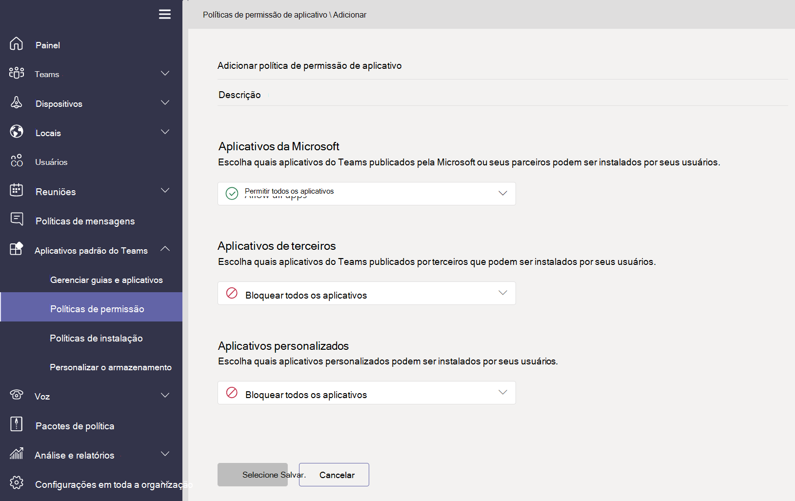

# Visão geral das políticas de aplicativo usadas para gerenciar aplicativos no Microsoft Teams

As políticas de aplicativo são usadas para controlar aplicativos Microsoft Teams.

## Políticas de permissão do aplicativo

**As políticas de permissão** de aplicativo são usadas para controlar quais aplicativos estão disponíveis para seus usuários. Como administrador, você pode permitir ou bloquear aplicativos específicos que os usuários instalam da Teams de aplicativos. [As políticas de permissão de](teams-app-permission-policies.md) aplicativo são gerenciadas por meio do Microsoft Teams de administração.

## Políticas de configuração de aplicativo

**As políticas de configuração** de aplicativo permitem que você fixe e instale aplicativos em nome de seus usuários e controle essas configurações para sua organização. [As políticas de configuração](teams-app-setup-policies.md) de aplicativo são gerenciadas no Teams de administração.

## Políticas de aplicativo personalizadas

Você pode controlar quem pode carregar aplicativos personalizados para Teams com **políticas de aplicativo personalizadas**. [As configurações e políticas personalizadas do aplicativo](teams-custom-app-policies-and-settings.md) são gerenciadas por meio do Microsoft Teams de administração.

## Tópicos relacionados

* [Gerenciar políticas de aplicativo personalizado e as configurações no Teams](teams-custom-app-policies-and-settings.md)
* [Gerenciar políticas de configuração de aplicativo no Teams](teams-app-setup-policies.md)
* [Gerenciar políticas de permissões de aplicativo no Teams](teams-app-permission-policies.md)
* [Gerenciar Teams com políticas](manage-teams-with-policies.md)
