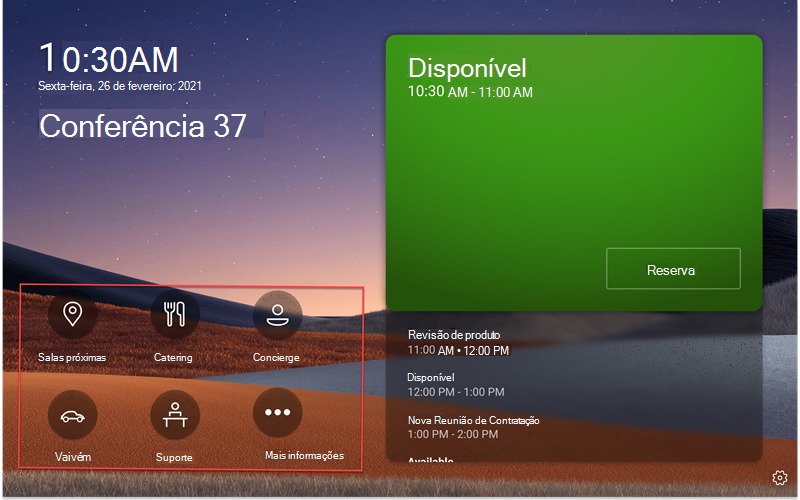

# Microsoft Teams de aplicativos/lob (linha de negócios) em Teams painéis

Teams painéis adicionam suporte para Teams [aplicativos/aplicativos de linha de negócios (LOB](/microsoftteams/platform/overview)). Isso permitirá que as empresas adicionem experiências adicionais nos painéis para atender às necessidades da sua organização. Esta versão dá suporte a conteúdo estático da Web.

> [!IMPORTANT]
> Esse recurso só está disponível depois de atualizar seus Teams dispositivos de painéis. Você precisa ter o aplicativo Teams versão 1449/1.0.97.2021070601 ou mais recente para ter suporte a aplicativos em Teams painéis.

## Teams experiência do aplicativo em Teams painéis

 

*A Teams tela inicial dos painéis inclui opções de navegação do aplicativo, descritas na captura de tela em vermelho. Observe que esses são ícones de exemplo e podem não estar disponíveis para uso.*

*Quando um usuário final tocar em um dos ícones do aplicativo, ele verá a tela Teams aplicativo exibida na captura de tela anterior. O retângulo cinza na captura de tela é onde os aplicativos são exibidos no painel do Teams. A barra de aplicativos é fixa e faz parte do Teams aplicativo de painéis.*

## Configurar e gerenciar aplicativos Teams painéis no Teams de administração 

Microsoft Teams aplicativos trazem informações importantes, ferramentas comuns e processos confiáveis para onde as pessoas se reúnem, aprendem e trabalham. Teams aplicativos funcionam [por meio de funcionalidades integradas](/microsoftteams/platform/concepts/capabilities-overview). Agora, como administrador de TI, você tem a opção de quais aplicativos incluir no dispositivo de painéis Teams sua organização e personalizar permissões por meio do centro de administração Teams[.](https://admin.teams.microsoft.com/)

Agora você pode usar os Teams em Teams e personalizar a experiência do usuário com base nas necessidades da sua organização. Você pode decidir qual aplicativo Web seus usuários podem acessar e usar e priorizar as exibições do aplicativo. Algumas opções, como os recursos de bot e mensagens, não têm suporte no momento. Saiba mais sobre [os Teams aplicativos](/microsoftteams/platform/overview) [e como gerenciar seus dispositivos Microsoft Teams](/microsoftteams/devices/device-management).

## Gerenciar aplicativos Teams painéis no Teams de administração

**Observação**: você deve ser um administrador global ou um Teams de serviço para acessar o [Teams de administração](https://admin.teams.microsoft.com/).

Os usuários finais podem exibir, mas não instalar aplicativos Teams painéis. Como administrador, você pode exibir e gerenciar todos os Teams para sua organização por meio do Teams de administração. Saiba mais sobre como você pode [gerenciar seus aplicativos no Microsoft Teams de](/microsoftteams/manage-apps) administração por meio da página **Gerenciar aplicativos**. A **página Gerenciar aplicativos** no Teams de administração também é onde você pode carregar [aplicativos personalizados](/microsoftteams/manage-apps#publish-a-custom-app-to-your-organizations-app-store).

Depois de configurar aplicativos, você pode  usar políticas de permissão  de aplicativo e políticas de configuração de aplicativo para configurar a experiência do aplicativo para contas de sala específicas em sua organização.

## Fixar aplicativos em Teams com políticas de configuração de aplicativo

Como Teams oferece a capacidade de exibir uma ampla variedade de aplicativos, os administradores podem decidir quais aplicativos são mais essenciais para a organização e fixá-lo apenas na tela inicial dos painéis  do Teams para acesso rápido. Se houver mais de cinco aplicativos fixados ou aplicativos desafixados, eles aparecerão na **tela** Mais. A Microsoft recomenda criar uma política de configuração de aplicativo personalizada especificamente para Teams painéis.

 

Para gerenciar aplicativos **fixados** \>  \>  \> exibidos nos painéis do Teams, entre no centro de administração do Teams para sua organização e navegue até políticas de Instalação de aplicativos do Teams Selecionar ou criar uma nova política de aplicativos fixados **.**

 

*Os aplicativos incluídos nesta imagem são apenas exemplos e podem não estar disponíveis para uso.*

A Microsoft recomenda que você **desative Upload** aplicativos personalizados  e a fixação do usuário para obter a melhor Teams de aplicativos em Teams painéis.

Para obter mais informações sobre como fixar aplicativos, consulte [Gerenciar políticas de configuração de aplicativo](/microsoftteams/teams-app-setup-policies).

## Gerenciar a ordem de exibição de aplicativos Teams painéis 

*Os aplicativos incluídos nesta imagem são apenas exemplos e podem não estar disponíveis para uso.*

Para gerenciar a ordem na qual os aplicativos são exibidos nos painéis do Teams, entre no centro de administração do Teams para sua organização e navegue até políticas de Instalação de aplicativos do Teams Selecione os aplicativos **fixados** \>  \>  \> por política **:** Mover para cima **/para baixo**.

## Atribuindo políticas de configuração a uma conta de recurso de sala

Depois de criar a política de configuração, o administrador precisará atribuir essa política à conta de recurso da sala que será conectada aos painéis Teams ambiente. Para obter mais informações, consulte [Atribuir políticas a usuários e grupos](/microsoftteams/assign-policies-users-and-groups).

## Perguntas frequentes

### Quanto tempo leva para que os Teams para obter as políticas de configuração de aplicativo novas ou atualizadas?

Depois de editar ou atribuir novas políticas no Teams de administração, pode levar até 24 horas para que as alterações entre em vigor. Os administradores podem tentar sair/entrar no painel, tocar no ícone Configurações e voltar para **a** tela Inicial para tentar atualizar as políticas.

### Qual é a ordenação dos aplicativos na tela "Mais"?

Na página **Mais** aplicativos, os aplicativos fixados aparecerão primeiro. Em seguida, todos os outros aplicativos instalados aparecerão em ordem alfabética.

### Por que os aplicativos de bot não estão aparecendo Teams painéis?

Somente o conteúdo da Web de guias estáticas tem suporte no momento.

### Por que os Teams nativos, como Calendário e Tarefas, não são exibidos Teams painéis?

Aplicativos Teams nativos, como Calendário e Tarefas, não são mostrados Teams painéis.

### No centro Teams de administração, na seção de políticas de configuração, qual é a diferença entre aplicativos instalados e aplicativos fixados?

Para Teams, a Microsoft recomenda usar aplicativos fixados, para que o administrador possa selecionar o aplicativo desejado e reorganizar sua ordenação.

**Nota:** Alguns aplicativos não dão suporte à fixação de aplicativos. Entre em contato com o desenvolvedor do aplicativo para habilitar a funcionalidade de fixação de aplicativos.

### Por que outros aplicativos estão aparecendo na tela "Mais", mesmo que eles não fazem parte dos aplicativos instalados ou fixados na seção Teams política de configuração do aplicativo?

Se os aplicativos foram instalados anteriormente por meio de outras políticas de aplicativo ou manualmente nos clientes da área de trabalho/web do Teams para a conta de recurso de sala usada em painéis do Teams, o administrador pode precisar entrar na conta de recurso da sala no Teams e desinstalar manualmente os aplicativos clicando com o botão direito do mouse no aplicativo e selecionando Desinstalar.

### Por que não consigo encontrar um aplicativo no painel "Adicionar aplicativos fixados"?

Nem todos os aplicativos podem ser fixados Teams por meio de uma política de configuração de aplicativo. Alguns aplicativos podem não dar suporte a essa funcionalidade. Para localizar aplicativos que podem ser fixados, pesquise o aplicativo no **painel Adicionar aplicativos fixados** . Para obter mais informações, consulte as [perguntas frequentes sobre como trabalhar com políticas de configuração de aplicativo](/microsoftteams/teams-app-setup-policies#why-cant-i-find-an-app-in-the-add-pinned-apps-pane).

### Por que estou vendo um pop-up "Fixação de usuário" no painel de políticas de configuração depois que eu desativo a "Fixação do usuário?"

*Os aplicativos incluídos nesta imagem são apenas exemplos e podem não estar disponíveis para uso.* 

Esse comportamento é esperado para um dispositivo em um espaço compartilhado e ajuda a evitar a fixação não intencional do aplicativo.
