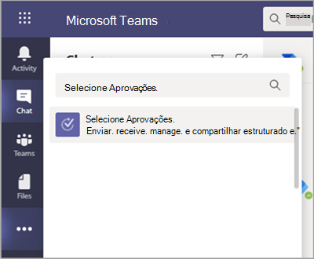
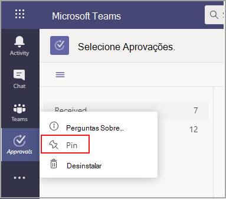
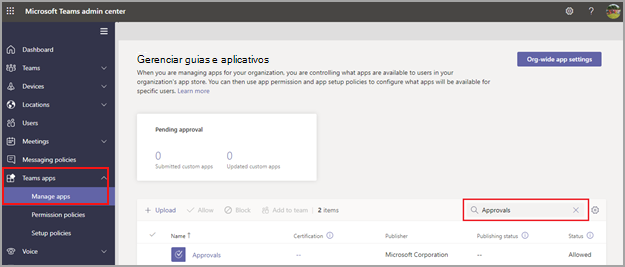

# Disponibilidade dos aplicativos de aprovação do Teams

O aplicativo Aprovações está disponível como um aplicativo pessoal para todos os usuários do Microsoft Teams.
O aplicativo Aprovações oferece uma maneira simples de levar auditoria, conformidade, responsabilidade e fluxos de trabalho para Aprovações estruturadas e não estruturadas em Equipes.

 

Os usuários podem fixar o aplicativo Aprovações para salvá-lo na barra de menus.

 

A primeira aprovação criada Aprovações aplicativo disparará o provisionamento da Solução de Aprovação no ambiente padrão do Microsoft Dataverse. Aprovações criado a partir do Aprovações aplicativo será armazenado no ambiente padrão do Microsoft Dataverse.

Este artigo descreve os requisitos e as funções do aplicativo Aprovações.

> [!NOTE]
> Esse recurso ainda não foi lançado para Nuvem da Comunidade Governamental alta (GCCH) e usuários do DoD (Departamento de Defesa).

## Permissões e licenças necessárias

Para implantar o Aprovações, você precisa de permissão para os seguintes itens:

- Permissões para criar um banco de dados do Microsoft Dataverse.

- Uma conta no [powerautomate.microsoft.com](https://powerautomate.microsoft.com/)

- Função de administrador no ambiente de destino.

- Licença para [Power Automate](/power-automate/get-started-approvals), Office 365 ou Dynamics 365.

- A licença Microsoft Forms é necessária para que os usuários configurem novos modelos de aprovação.

Para usar o aplicativo Aprovações, você precisa de uma licença para o Power Automate e sua conta será adicionada automaticamente à função de usuário do Aprovações no ambiente de destino em sua primeira atribuição de aprovação.

## Armazenamento com o Microsoft Dataverse

O CDM (Common Data Model) é a linguagem de dados compartilhada usada por aplicativos de negócios e analíticos no Microsoft Dataverse. Ele consiste em um conjunto de esquemas de dados padronizados e extensíveis publicados pela Microsoft e nossos parceiros que permitem a consistência dos dados e seu significado em aplicativos e processos de negócios. Saiba mais sobre o [dados comuns do Microsoft Power Platform](/power-automate/get-started-approvals).

Saiba mais sobre o fluxo [de trabalho aprovação](/power-automate/modern-approvals).

Aprovações criados com base em um modelo ainda armazenam dados no Microsoft Dataverse, como título, detalhes, ID do modelo e muito mais. As respostas enviadas na solicitação de aprovação são armazenadas em Formulários. Saiba mais sobre  [o Armazenamento de dados para Microsoft Forms](https://support.microsoft.com/office/data-storage-for-microsoft-forms-97a34e2e-98e1-4dc2-b6b4-7a8444cb1dc3#:~:text=Where%20data%20is%20stored%20for%20Microsoft%20Forms.%20Microsoft,European-based%20tenants%20is%20stored%20on%20servers%20in%20Europe).

>[!Note]
>Se você excluir o modelo de formulário no site Microsoft Forms, ele interromperá o modelo de Aprovação e os usuários não poderão iniciar a solicitação. Os usuários receberão um erro "CDB TableNotFound" ao tentar abrir um modelo de aprovação que foi excluído no Microsoft Forms.

Os modelos no escopo da organização compartilham o mesmo tempo de vida dos modelos de locatário e com escopo de equipe compartilham o mesmo tempo de vida da equipe. Portanto, excluir permanentemente a equipe exclui os modelos relacionados.

## Permissões do aplicativo Aprovações do Teams

O aplicativo Aprovações Teams permite que você acesse os seguintes recursos:

- Receba mensagens e dados que você fornece a ela.

- Enviar mensagens e notificações.

- Renderizar aplicativos pessoais e caixas de diálogo sem um header fornecido pelo Teams.

- Acesse suas informações de perfil, como nome, endereço de email, nome da empresa e idioma preferido.

- Receba mensagens e dados que os membros da equipe fornecem a ela em um canal.

- Enviar mensagens e notificações em um canal.

- Acesse as informações da sua equipe:
  - nome da equipe
  - lista de canais
  - lista de lista (nomes e endereços de email dos membros da equipe).

- Use as informações da equipe para contatá-los.

Permissões de modelo de aprovação

- Todos os proprietários da equipe podem criar um modelo de aprovação para as equipes que eles têm.

- Quando um administrador cria um modelo para toda a organização pela primeira vez, ele criará automaticamente um novo grupo Azure Active Directory (AAD) para todos os administradores do locatário, incluindo os administradores de serviços globais e Teams. Esses administradores serão adicionados como proprietários do grupo, para que possam cogerenciar modelos organizacionais. Os administradores que são novos na organização após a criação da equipe precisam ser adicionados manualmente como proprietários do grupo para que tenham as mesmas permissões para gerenciar modelos de toda a organização.

> [!Note]
> Se um administrador excluir o grupo, você terá um mês para restaurá-lo no portal Azure Active Directory (AAD) para restaurar todos os dados relacionados. Após um mês ou se o administrador excluir esse grupo dentro da lixeira, você perderá todos os dados relacionados.

## Desabilitar o aplicativo Aprovações

O aplicativo Aprovações está disponível por padrão. Você pode desabilitar o aplicativo no Centro de administração do Teams.

  1. Entre no Centro de administração do Teams.

  2. Vá para **Aplicativos do Microsoft Teams** > **Gerenciar aplicativos**.

  3. Procure o aplicativo Aprovações.

     

  4. Selecione **Aprovações**.

  5. Selecione o alternância para desabilitar o aplicativo em sua organização.

     :::image type="content" alt-text="mostra os detalhes do Aprovações aplicativo." source="media/approvals-details-new.png" lightbox="media/approvals-details-new.png":::

## Políticas de aplicativo

### Política de retenção

Aprovações criados a partir do Aprovações aplicativo são armazenados no ambiente padrão do Microsoft Dataverse, que não dá suporte a backups no momento. Saiba mais sobre como fazer [backup e restaurar ambientes - Power Platform \| Microsoft Docs](/power-platform/admin/backup-restore-environments).

Os dados armazenados no Forms não serão excluídos até que os proprietários da equipe os  limpem na guia formulários excluídos no Microsoft Forms Web.

### Políticas de acesso condicional

Atualmente, o aplicativo Aprovações no Teams não dá suporte a políticas de Acesso Condicional definidas para Microsoft Teams.

## Limitações de dados

Cada equipe pode conter no máximo 400 modelos de aprovações, e cada modelo pode coletar no máximo 50.000 solicitações com base na funcionalidade atual no Microsoft Forms.

## Auditoria

O aplicativo Approvals registra eventos de auditoria no Centro de Conformidade e Segurança do Microsoft 365. Você pode exibir o log de auditoria.

1. Vá para o Site de Conformidade do Microsoft 365.

2. Selecione a **seção** Auditoria.

3. Procure atividades em atividades em **de aprovação do Microsoft Teams**.

Você pode procurar as seguintes atividades:

- Criar nova solicitação de aprovação

- Exibir detalhes da solicitação de aprovação

- Solicitação de aprovação aprovada

- Solicitação de aprovação rejeitada

- Solicitação de aprovação cancelada

- Solicitação de aprovação compartilhada

- Arquivo anexado à solicitação de aprovação

- Solicitação de aprovação reatribuida

- Assinatura eletrônica adicionada à solicitação de aprovação

- Detalhes da solicitação de assinatura e exibida

- Solicitação de assinatura e revisada

- Solicitação de assinatura e cancelada

- Criar um novo modelo

- Editar um modelo existente

- Habilitar/desabilitar um modelo

- Modelo exibido

Para obter acesso a mais aprovações de auditoria no Power Automate, habilite e configure a auditoria no ambiente padrão para as entidades de aprovação primária Aprovação, Solicitação de Aprovação e Resposta de Aprovação. Operações de criação, atualização e exclusão são eventos auditáveis para registros de Aprovação. Saiba mais sobre [dados de Auditoria e atividade do usuário para segurança e conformidade - Power Platform \| Microsoft Docs](/power-platform/admin/audit-data-user-activity).

A auditoria pode ser personalizada ainda mais no [de Conformidade e Segurança do Microsoft 365](https://support.office.com/article/go-to-the-office-365-security-compliance-center-7e696a40-b86b-4a20-afcc-559218b7b1b8?ui=en-US&rs=en-US&ad=US).

1. Para usar os relatórios pré-configurados, entre em Segurança e Conformidade do Microsoft 365.

2. Selecione **pesquisa e investigação**.

3. Pesquise no log de Auditoria e selecione **atividades do Dynamics 365** dados.

Saiba mais sobre [registro em log de atividades de aplicativos orientados por modelos e dados de aplicativos do Microsoft Dataverse - Power Platform](/power-platform/admin/enable-use-comprehensive-auditing).

## Segurança

No aplicativo Aprovações de Equipes, os usuários têm acesso para criar novas Aprovações e exibir Aprovações que enviaram e receberam. Os usuários não terão acesso às Aprovações criadas por outras pessoas, a menos que sejam respondentes ou visualizadores da solicitação.

> [!Note]
> Um usuário terá uma função de visualizador de uma solicitação se ele for parte do chat ou canal no qual a aprovação foi criada. Ela não terá a capacidade de tomar medidas na solicitação caso não tenha sido concedida essa função quando a aprovação foi criada.

## Aprovações integração de assinatura de email

Para usar o Aprovações de assinatura e do aplicativo, você precisa de uma licença para o provedor de assinatura e específico que deseja usar. Para obter uma licença para sua organização, você precisará acessar o site do provedor.

### Habilitar ou desabilitar provedores de assinatura de e

Você pode usar o Teams de administração para controlar quais provedores de assinaturas de email de terceiros estão disponíveis para seus usuários no Aprovações aplicativo. Por padrão, os provedores de assinatura de e são habilitados no Aprovações aplicativo. Quando você desabilita um provedor de assinatura automática, os usuários não terão acesso a esse provedor quando criarem aprovações. Os usuários também não poderão exibir solicitações de assinatura e que foram criadas usando esse provedor.

1. No painel de navegação à esquerda do Teams de administração, acesse **Teams** **appsManage** > .
2. Pesquise o Aprovações aplicativo e selecione-o.
3. Vá para a **Configurações** e, em seguida, siga um ou mais dos seguintes procedimentos:

    - Para habilitar ou desabilitar o Adobe Sign, alterne a opção para **Ativar** ou **Desativar**.
    - Para habilitar ou desabilitar o DocuSign, alterne a alternância **para Ativado** ou **Desativado**.
4. Selecione **Enviar**.

As aprovações de assinatura E criadas Aprovações aplicativo são armazenadas no ambiente de nuvem do provedor selecionado. Para exportar dados sobre assinaturas e, você precisará acessar o site do provedor. Para obter mais informações sobre armazenamento, exportação e retenção de contratos de assinatura e, consulte a documentação do provedor.
