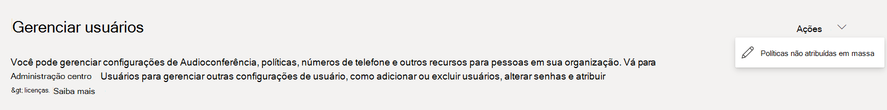
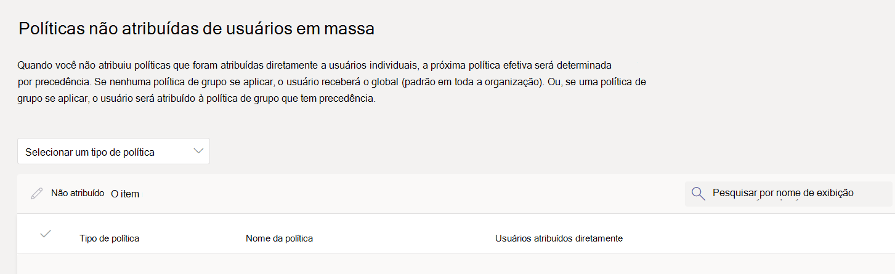

# <a name="assign-policies-to-users-and-groups"></a>Atribuir políticas a usuários e grupos

Este artigo revisa as diferentes maneiras de atribuir políticas a usuários e grupos no Microsoft Teams. Antes de ler, verifique se você leu Atribuir [políticas no Teams – introdução](policy-assignment-overview.md).

## <a name="assign-a-policy-to-individual-users"></a>Atribuir uma política a usuários individuais

Siga estas etapas para atribuir uma política a um usuário individual ou a alguns usuários por vez.

### <a name="use-the-microsoft-teams-admin-center"></a>Usar o centro de administração do Microsoft Teams

Para atribuir uma política a um usuário:

1. No painel de navegação esquerdo do Centro [de administração do Microsoft Teams](https://admin.teams.microsoft.com), vá para **Usuários** > **Gerenciar usuários**.
2. Selecione o usuário clicando à esquerda do nome de usuário e, em seguida, selecione **Editar configurações**.
3. Selecione a política que você deseja atribuir e, em seguida, **selecione Aplicar**.


> [!NOTE]
> Para cancelar a atribuição de uma política especializada de um usuário, você pode definir cada política como **Global (padrão em toda a organização)**. Você também pode remover atribuições de política em massa para todos os usuários atribuídos diretamente a uma política. Para saber mais, leia [Cancelar a atribuição de políticas em massa](#unassign-policies-in-bulk).

Você também pode fazer o seguinte para atribuir uma política a um usuário:

1. No painel de navegação esquerdo do Centro de administração do Microsoft Teams, vá para a página de política.
2. Selecione a política que você deseja atribuir clicando à esquerda do nome da política.
3. Selecione **Gerenciar usuários**.
4. No painel **Gerenciar usuários**, procure o usuário pelo nome de exibição ou pelo nome de usuário, escolha o nome e marque **Adicionar**. Repita esta etapa para cada usuário que você deseja adicionar.
5. Quando terminar de adicionar usuários, selecione **Aplicar**.


### <a name="use-powershell"></a>Usar o PowerShell

Cada tipo de política tem seu próprio conjunto de cmdlets para gerenciá-lo. Use o `Grant-` cmdlet para um determinado tipo de política para atribuir a política. Por exemplo, use o `Grant-CsTeamsMeetingPolicy` cmdlet para atribuir uma política de reunião do Teams aos usuários. Esses cmdlets estão incluídos no módulo powershell do Teams e estão documentados [na referência Skype for Business cmdlet.](/powershell/skype)

 Baixe e instale a [versão pública do PowerShell do Teams](https://www.powershellgallery.com/packages/MicrosoftTeams/) (caso ainda não tenha feito isso) e execute o seguinte para se conectar.

> [!NOTE]
> O Conector Skype for Business Online atualmente faz parte do módulo mais recente do PowerShell do Teams.
>
> Se você estiver usando a versão pública mais [recente do Teams PowerShell](https://www.powershellgallery.com/packages/MicrosoftTeams/), não precisará instalar o Skype for Business Online Connector.

```powershell
  # When using Teams PowerShell Module

   Import-Module MicrosoftTeams
   $credential = Get-Credential
   Connect-MicrosoftTeams -Credential $credential
```

Neste exemplo, atribuímos uma política de reunião do Teams chamada Política de Reunião do Aluno a um usuário chamado Reda.

```powershell
Grant-CsTeamsMeetingPolicy -Identity reda@contoso.com -PolicyName "Student Meeting Policy"
```

Para saber mais, leia [Gerenciar políticas por meio do PowerShell](teams-powershell-managing-teams.md#manage-policies-via-powershell).

## <a name="assign-a-policy-to-a-group"></a>Atribuir uma política a um grupo

A atribuição de política a grupos permite atribuir uma política a um grupo de usuários, como um grupo de segurança, uma unidade organizacional ou uma lista de distribuição. As atribuições de política serão propagadas para os membros do grupo, de acordo com as regras de precedência. À medida que os membros forem adicionados ou removidos de um grupo, as atribuições de política herdadas serão atualizadas.

A atribuição de política a grupos é recomendada para grupos de até 50.000 usuários, mas também funcionará com grupos maiores.

Quando você atribui a política, ela é imediatamente atribuída ao grupo. No entanto, a propagação da atribuição de política aos membros do grupo é executada como uma operação em segundo plano e pode levar algum tempo, dependendo do tamanho do grupo. O mesmo é verdadeiro quando uma política não é atribuída de um grupo ou quando os membros são adicionados ou removidos de um grupo.

As atribuições de política de grupo só são propagadas para usuários que são membros diretos do grupo. As atribuições não são propagadas para membros de grupos aninhados.

### <a name="what-you-need-to-know-about-policy-assignment-to-groups"></a>O que você precisa saber sobre a atribuição de política a grupos

Antes de começar, é importante entender as regras de precedência e a classificação de atribuição de grupo.

#### <a name="precedence-rules"></a>Regras de precedência

Para um determinado tipo de política, a política efetiva de um usuário é determinada de acordo com o seguinte:

- Uma política atribuída diretamente a um usuário tem precedência sobre qualquer outra política do mesmo tipo atribuída a um grupo. Em outras palavras, se um usuário receber diretamente uma política de um determinado tipo, esse usuário não herdará uma política do mesmo tipo de um grupo. Isso também significa que, se um usuário tiver uma política de um determinado tipo que foi atribuída diretamente a ele, você precisará remover essa política do usuário antes que ele possa herdar uma política do mesmo tipo de um grupo.
- Se um usuário não tiver uma política atribuída diretamente a ele e for membro de dois ou mais grupos e cada grupo tiver uma política do mesmo tipo atribuída a ele, o usuário herdará a política da atribuição de grupo que tem a classificação mais alta.
- Se um usuário não for membro de nenhum grupo atribuído a uma política, a política global (padrão em toda a organização) para esse tipo de política se aplicará ao usuário.

A política efetiva de um usuário é atualizada de acordo com estas regras:

- quando um usuário é adicionado ou removido de um grupo que recebe uma política.
- uma política não é atribuída de um grupo.
- uma política atribuída diretamente ao usuário é removida.

#### <a name="group-assignment-ranking"></a>Classificação de atribuição de grupo

> [!NOTE]
> Um determinado tipo de política pode ser atribuído a um máximo de 64 grupos entre instâncias de política para esse tipo.

Ao atribuir uma política a um grupo, você especifica uma classificação para a atribuição de grupo. Essa classificação é usada para determinar qual política um usuário deve herdar como sua política efetiva se o usuário for membro de dois ou mais grupos e cada grupo receber uma política do mesmo tipo.

A classificação de atribuição de grupo é relativa a outras atribuições de grupo do mesmo tipo. Por exemplo, se você estiver atribuindo uma política de chamada a dois grupos, defina a classificação de uma atribuição como 1 e a outra como 2, sendo 1 a classificação mais alta. A classificação de atribuição de grupo indica qual associação de grupo é mais importante ou mais relevante do que outras associações de grupo em relação à herança.

Por exemplo, você tem dois grupos: Funcionários da Loja e Gerentes da Loja. Ambos os grupos recebem uma política de chamada do Teams, a Política de Chamadas de Funcionários da Loja e a Política de Chamadas de Gerentes de Loja, respectivamente. Para um gerente de loja que está em ambos os grupos, sua função como gerente é mais relevante do que sua função como funcionário, portanto, a política de chamada atribuída ao grupo Gerentes da Loja deve ter uma classificação mais alta.

|Grupo |Nome da política de chamada do Teams  |Classificação|
|---------|---------|---|
|Gerentes da Loja   |Política de Chamada de Gerentes de Loja         |1|
|Armazenar funcionários    |Armazenar Política de Chamadas de Funcionários      |2|

Se você não especificar uma classificação, a atribuição de política receberá a classificação mais baixa.

### <a name="in-the-teams-admin-center"></a>No centro de administração do Teams

> [!NOTE]
> Atualmente, a atribuição de política a grupos usando o Centro de administração do Microsoft Teams só está disponível para a política de chamada do Teams, política de estacionamento de chamada do Teams, política do Teams, política de eventos ao vivo do Teams, política de reunião do Teams e política de mensagens do Teams. Para outros tipos de política, use o PowerShell.

1. No painel de navegação esquerdo do Centro de administração do Microsoft Teams, vá para a página de tipo de política. Por exemplo, vá para políticas **de Reunião** > **.**
2. Selecione a **guia Atribuição de política de** grupo.
3. Selecione **Adicionar grupo** e, em seguida, no painel Atribuir **política** ao grupo, faça o seguinte:
    1. Pesquise e adicione o grupo ao qual você deseja atribuir a política.
    2. Defina a classificação para a atribuição de grupo.
    3. Selecione a política que você deseja atribuir.
    4. Selecione **Aplicar**.


Para remover uma atribuição de política de grupo, na guia **Atribuição** de política de grupo da página de política, selecione a atribuição de grupo e, em seguida, **selecione Remover**.

Para alterar a classificação de uma atribuição de grupo, você precisa remover a atribuição de política de grupo primeiro. Em seguida, siga as etapas acima para atribuir a política a um grupo.

### <a name="use-the-powershell-option"></a>Usar a opção do PowerShell

> [!NOTE]
> Atualmente, a atribuição de política a grupos usando o PowerShell não está disponível para todos os tipos de política do Teams. Consulte [New-CsGroupPolicyAssignment para obter](/powershell/module/teams/new-csgrouppolicyassignment) a lista de tipos de política com suporte.

#### <a name="install-and-connect-to-the-microsoft-teams-powershell-module"></a>Instalar e conectar-se ao módulo PowerShell do Microsoft Teams

Para obter diretrizes passo a passo, consulte [Instalar o PowerShell do Teams](teams-powershell-install.md).

#### <a name="assign-a-policy-to-a-group-of-users"></a>Atribuir uma política a um grupo de usuários

Use o cmdlet [New-CsGroupPolicyAssignment](/powershell/module/teams/new-csgrouppolicyassignment) para atribuir uma política a um grupo. Você pode especificar um grupo usando a ID do objeto, o endereço SIP ou o endereço de email.

Neste exemplo, atribuímos uma política de reunião do Teams chamada Política de Reunião de Gerentes de Varejo a um grupo com uma classificação de atribuição de 1.

```powershell
New-CsGroupPolicyAssignment -GroupId d8ebfa45-0f28-4d2d-9bcc-b158a49e2d17 -PolicyType TeamsMeetingPolicy -PolicyName "Retail Managers Meeting Policy" -Rank 1
```

#### <a name="get-policy-assignments-for-a-group"></a>Obter atribuições de política para um grupo

Use o cmdlet [Get-CsGroupPolicyAssignment](/powershell/module/teams/get-csgrouppolicyassignment) para obter todas as políticas atribuídas a um grupo. Os grupos sempre são listados por sua ID de grupo, mesmo que seu endereço SIP ou endereço de email seja usado para atribuir a política.

Neste exemplo, recuperamos todas as políticas atribuídas a um grupo específico.

```powershell
Get-CsGroupPolicyAssignment -GroupId e050ce51-54bc-45b7-b3e6-c00343d31274
```

Neste exemplo, retornamos todos os grupos que recebem uma política de reunião do Teams.

```powershell
Get-CsGroupPolicyAssignment -PolicyType TeamsMeetingPolicy
```

#### <a name="remove-a-policy-from-a-group"></a>Remover uma política de um grupo

Use o cmdlet [Remove-CsGroupPolicyAssignment](/powershell/module/teams/remove-csgrouppolicyassignment) para remover uma política de um grupo. Quando você remove uma política de um grupo, as prioridades de outras políticas do mesmo tipo atribuídas a esse grupo e que têm uma classificação inferior são atualizadas. Por exemplo, se você remover uma política que tenha uma classificação de 2, as políticas que têm uma classificação de 3 e 4 serão atualizadas para refletir sua nova classificação. As duas tabelas a seguir mostram este exemplo.

Aqui está uma lista das atribuições de política e prioridades para uma política de reunião do Teams.

|Nome do grupo  |Nome da política  |Classificação|
|---------|---------|---------|
|Vendas    |Política de vendas       | 1        |
|Região Oeste     |Política da Região Oeste         |2         |
|Divisão    |Política de divisão         |3         |
|Subsidiário   |Política de subsidiária        |4         |

Se removermos a política da Região Oeste do grupo Região Oeste, as atribuições de política e as prioridades serão atualizadas da seguinte maneira.

|Nome do grupo  |Nome da política  |Classificação|
|---------|---------|---------|
|Vendas    |Política de vendas       | 1        |
|Divisão    |Política de divisão         |2         |
|Subsidiário   |Política de subsidiária        |3        |

Neste exemplo, removemos a política de reunião do Teams de um grupo.

```powershell
Remove-CsGroupPolicyAssignment -PolicyType TeamsMeetingPolicy -GroupId f985e013-0826-40bb-8c94-e5f367076044
```

#### <a name="change-a-policy-assignment-for-a-group"></a>Alterar uma atribuição de política para um grupo

> [!NOTE]
> O cmdlet [Set-CsGroupPolicyAssignment](/powershell/module/teams/set-csgrouppolicyassignment) estará disponível em breve. Enquanto isso, para alterar uma atribuição de política de grupo, você pode remover a atribuição de política atual do grupo e, em seguida, adicionar uma nova atribuição de política.

Depois de atribuir uma política a um grupo, você pode usar o cmdlet [Set-CsGroupPolicyAssignment](/powershell/module/teams/set-csgrouppolicyassignment) para alterar a atribuição de política desse grupo da seguinte maneira:

- Alterar a classificação
- Alterar a política de um determinado tipo de política
- Alterar a política de um determinado tipo de política e a classificação

Neste exemplo, alteramos a política de estacionamento de chamada do Teams de um grupo para uma política chamada SupportCallPark e a classificação de atribuição para 3.

```powershell
Set-CsGroupPolicyAssignment -GroupId 566b8d39-5c5c-4aaa-bc07-4f36278a1b38 -PolicyType TeamsMeetingPolicy -PolicyName SupportCallPark -Rank 3
```

#### <a name="change-the-effective-policy-for-a-user"></a>Alterar a política efetiva para um usuário

Aqui está um exemplo de como alterar a política efetiva para um usuário que recebe uma política diretamente.

Primeiro, usamos o cmdlet `PolicySource` [Get-CsUserPolicyAssignment](/powershell/module/teams/get-csuserpolicyassignment) junto com o parâmetro para obter detalhes das políticas de transmissão de reunião do Teams associadas ao usuário.

```powershell
Get-CsUserPolicyAssignment -Identity daniel@contoso.com -PolicyType TeamsMeetingBroadcastPolicy | select -ExpandProperty PolicySource
```

A saída mostra que o usuário foi atribuído diretamente a uma política de transmissão de reunião do Teams chamada Eventos de **Funcionário, que** tem precedência sobre a política chamada **Eventos** ao Vivo do Fornecedor atribuída a um grupo ao qual o usuário pertence.

```console
AssignmentType PolicyName         Reference
-------------- ----------         ---------
Direct         Employee Events
Group          Vendor Live Events 566b8d39-5c5c-4aaa-bc07-4f36278a1b38
```

Agora, removemos a política eventos de funcionário do usuário. Isso significa que o usuário não tem mais uma política de transmissão de reunião do Teams atribuída diretamente a ele e herdará a política eventos ao vivo do fornecedor atribuída ao grupo ao qual o usuário pertence.

Use o cmdlet a seguir no módulo Skype for Business PowerShell para fazer isso.

```powershell
Grant-CsTeamsMeetingBroadcastPolicy -Identity daniel@contoso.com -PolicyName $null
```

Use o cmdlet a seguir no módulo do PowerShell do Teams para fazer isso em escala por meio de uma atribuição de política de lote, em que $users é uma lista de usuários que você especifica.

```powershell
New-CsBatchPolicyAssignmentOperation -OperationName "Assigning null at bulk" -PolicyType TeamsMeetingBroadcastPolicy -PolicyName $null -Identity $users  
```

## <a name="assign-a-policy-to-a-batch-of-users"></a>Atribuir uma política a um lote de usuários

### <a name="use-the-admin-center"></a>Usar o centro de administração

Para atribuir uma política a usuários em massa:

1. No painel de navegação esquerdo do Centro de administração do Microsoft Teams, selecione **Usuários**.
2. Pesquise os usuários aos quais você deseja atribuir a política ou filtre a exibição para mostrar os usuários desejados.
3. Na coluna **&#x2713;** (marca de seleção), selecione os usuários. Para selecionar todos os usuários, selecione o &#x2713; (marca de seleção) na parte superior da tabela.
4. Selecione **Editar configurações**, faça as alterações desejadas e, em seguida, **selecione Aplicar**.

Para exibir o status da atribuição de política, na faixa que aparece na parte superior da página  Usuários depois de selecionar Aplicar  para enviar sua atribuição de política, selecione **Log de atividades**. Ou, no painel de navegação esquerdo do Centro de administração do Microsoft Teams, vá para o **Painel** e, em Log de **atividades, selecione** **Exibir detalhes**. O log de atividades mostra atribuições de política a lotes de mais de 20 usuários por meio do Centro de administração do Microsoft Teams dos últimos 30 dias. Para saber mais, confira [Exibir suas atribuições de política no log de atividades](activity-log.md).

### <a name="use-powershell-method"></a>Usar o método do PowerShell

> [!NOTE]
> Atualmente, a atribuição de política de lote usando o PowerShell não está disponível para todos os tipos de política do Teams. Consulte [New-CsBatchPolicyAssignmentOperation](/powershell/module/teams/new-csbatchpolicyassignmentoperation) para obter a lista de tipos de política com suporte.

Com a atribuição de política de lote, você pode atribuir uma política a grandes conjuntos de usuários por vez sem usar um script. Use o cmdlet [New-CsBatchPolicyAssignmentOperation](/powershell/module/teams/new-csbatchpolicyassignmentoperation) para enviar um lote de usuários e a política que você deseja atribuir. As atribuições são processadas como uma operação de plano de fundo e uma ID de operação é gerada para cada lote. Em seguida, você pode usar o cmdlet [Get-CsBatchPolicyAssignmentOperation](/powershell/module/teams/get-csbatchpolicyassignmentoperation) para acompanhar o progresso e o status das atribuições em um lote.

Especifique os usuários por sua ID de objeto ou endereço SIP (Protocolo de Iniciação de Sessão). O endereço SIP de um usuário geralmente tem o mesmo valor que o NOME UPN ou o endereço de email, mas isso não é necessário. Se um usuário for especificado usando seu UPN ou email, mas tiver um valor diferente do endereço SIP, a atribuição de política falhará para o usuário. Se um lote incluir usuários duplicados, as duplicatas serão removidas do lote antes do processamento e o status só será fornecido para os usuários exclusivos restantes no lote.

Um lote pode conter até 5.000 usuários. Para obter melhores resultados, não envie mais do que alguns lotes por vez. Permitir que lotes concluam o processamento antes de enviar mais lotes.

#### <a name="install-and-connect-to-the-teams-powershell-module"></a>Instalar e conectar-se ao módulo PowerShell do Teams

Execute o seguinte para instalar o [módulo do PowerShell do Microsoft Teams](https://www.powershellgallery.com/packages/MicrosoftTeams). Instale a versão 1.0.5 ou posterior.

```powershell
Install-Module -Name MicrosoftTeams
```

Execute o seguinte para se conectar ao Teams e iniciar uma sessão.

```powershell
Connect-MicrosoftTeams
```

Quando for solicitado, entre usando suas credenciais de administrador.

#### <a name="install-and-connect-to-the-azure-ad-powershell-for-graph-module-optional"></a>Instalar e conectar-se ao módulo Azure AD PowerShell para Graph (opcional)

Talvez você também queira baixar e instalar o módulo [do Azure AD PowerShell para Graph](/powershell/azure/active-directory/install-adv2) (se ainda não fez isso) e conectar-se ao Azure AD para que possa recuperar uma lista de usuários em sua organização.

Execute o seguinte para se conectar ao Azure AD.

```powershell
Connect-AzureAD
```

Quando for solicitado, entre usando as mesmas credenciais de administrador usadas para se conectar ao Teams.

#### <a name="assign-a-setup-policy-to-a-batch-of-users"></a>Atribuir uma política de instalação a um lote de usuários

Neste exemplo, usamos o cmdlet [New-CsBatchPolicyAssignmentOperation](/powershell/module/teams/new-csbatchpolicyassignmentoperation) para atribuir uma política de configuração de aplicativo chamada Política de Configuração de Aplicativos de RH a um lote de usuários listados no arquivo users_ids.text.

```powershell
$user_ids = Get-Content .\users_ids.txt
New-CsBatchPolicyAssignmentOperation -PolicyType TeamsAppSetupPolicy -PolicyName "HR App Setup Policy" -Identity $user_ids -OperationName "Example 1 batch"
```

Neste exemplo, nos conectamos ao Azure AD para recuperar uma coleção de usuários e, em seguida, atribuir uma política de mensagens chamada Nova Política de Mensagens de Contratação a um lote de usuários especificado usando seu endereço SIP.

```powershell
Connect-AzureAD
$users = Get-AzureADUser
New-CsBatchPolicyAssignmentOperation -PolicyType TeamsMessagingPolicy -PolicyName "New Hire Messaging Policy" -Identity $users.SipProxyAddress -OperationName "Example 2 batch"
```

#### <a name="get-the-status-of-a-batch-assignment"></a>Obter o status de uma atribuição de lote

Execute o seguinte para obter o status de uma atribuição de lote, em que OperationId é a ID `New-CsBatchPolicyAssignmentOperation` da operação retornada pelo cmdlet para um determinado lote.

```powershell
$Get-CsBatchPolicyAssignmentOperation -OperationId f985e013-0826-40bb-8c94-e5f367076044 | fl
```

Se a saída mostrar que ocorreu um erro, execute o seguinte para obter mais informações sobre erros, que estão na `UserState` propriedade.

```powershell
Get-CsBatchPolicyAssignmentOperation -OperationId f985e013-0826-40bb-8c94-e5f367076044 | Select -ExpandProperty UserState
```

Para saber mais, confira [Get-CsBatchPolicyAssignmentOperation](/powershell/module/teams/get-csbatchpolicyassignmentoperation).

## <a name="unassign-policies-in-bulk"></a>Cancelar a atribuição de políticas em massa

Ao cancelar a atribuição de políticas em massa, você está removendo atribuições de política que foram atribuídas a usuários individuais por meio de atribuição direta. Isso é útil nos seguintes cenários:

1. **Para que as atribuições globais (padrão de toda a organização) ou de política de grupo entre em vigor:** Devido a [regras de precedência](policy-assignment-overview.md#which-policy-takes-precedence), as atribuições globais (padrão em toda a organização) ou de política de grupo não entrarão em vigor para usos que têm uma atribuição de política direta. Como administrador, você pode cancelar a atribuição de políticas em massa para remover atribuições diretas para que as atribuições globais (padrão em toda a organização) ou de política de grupo entre em vigor.
1. **Limpe as atribuições de política do assistente de Educação do Teams:** O assistente de política de Educação do Teams aplica os padrões de política global para os alunos e atribui um conjunto de políticas personalizadas para um grupo de funcionários usando a atribuição de política de grupo. Os administradores precisam limpar as políticas individuais de alunos e funcionários para que as atribuições globais (padrão em toda a organização) e de grupo sejam eficazes.
1. **Remover atribuições de política incorretas:** Se houver um grande grupo de usuários individuais que foram atribuídos à política errada por meio de atribuição direta, você poderá usar políticas de cancelamento de atribuição em massa para remover essas atribuições.

 Você pode cancelar a atribuição de políticas em massa do centro [de administração do Microsoft Teams](https://admin.teams.microsoft.com).

1. Vá para **Usuários** > **Gerenciar usuários**.
2. No canto superior direito da página, selecione **Cancelar** a atribuição de políticas em massa no menu suspenso  Ações.

    

    > [!NOTE]
    > Você também pode cancelar a atribuição de políticas nas páginas de política individuais escolhendo uma política e selecionando **Gerenciar usuários**.

3. Selecione um tipo de política.

    

4. Escolha a política que você deseja reatribuir e selecione Carregar dados para obter o número de usuários atualmente atribuídos a essa política.

    > [!IMPORTANT]
    > Ao escolher uma política, você está removendo **todos os** usuários atribuídos individualmente dessa política.

5. Selecione **Cancelar a atribuição de política**.

Depois de cancelar a atribuição de políticas, você pode examinar os detalhes da operação no [log de atividades](https://admin.teams.microsoft.com/activity-log).

## <a name="related-topics"></a>Tópicos relacionados

- [Gerenciar o Teams com políticas](manage-teams-with-policies.md)
- [Visão Geral do PowerShell do Teams](teams-powershell-overview.md)
- [Atribuir políticas no Teams – introdução](policy-assignment-overview.md)
