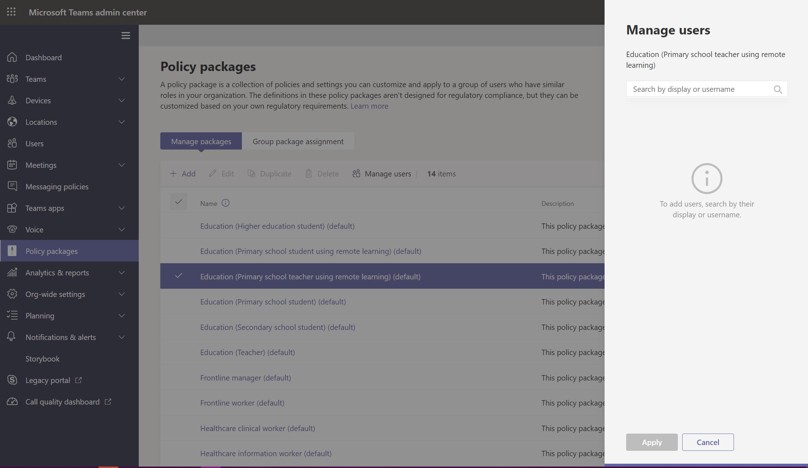

# <a name="assign-policy-packages-to-users-and-groups"></a>Atribuir pacotes de política a usuários e grupos

Este artigo analisa as diferentes maneiras de atribuir pacotes de política a usuários e grupos em Microsoft Teams. Antes de ler, certifique-se de ler [Atribuir políticas em](policy-assignment-overview.md)Teams - começando .

> [!NOTE]
> Cada usuário exigirá o complemento de Comunicações Avançadas para receber uma atribuição de pacote de políticas personalizadas. Para obter mais informações, consulte [Complemento de Comunicações Avançadas para o Microsoft Teams ](/microsoftteams/teams-add-on-licensing/advanced-communications).

## <a name="assign-a-policy-package-to-users"></a>Atribuir um pacote de política aos usuários

Um pacote de política no Teams é uma coleção de políticas e configurações de política predefinidas que você pode atribuir aos usuários que têm as mesmas funções ou funções semelhantes em sua organização. Cada pacote de política é projetado em torno de uma função de usuário e inclui políticas predefinidas e configurações de política que suportam atividades típicas para essa função. Alguns exemplos de pacotes de política são o pacote Educação (Professor) e o pacote Assistência Médica (Trabalho Médico). Para saber mais, confira [Gerenciar pacotes de política em Teams](manage-policy-packages.md).

### <a name="assign-a-policy-package-to-one-user"></a>Atribuir um pacote de política a um usuário

1. Na navegação à esquerda do centro de administração Microsoft Teams, vá para **Usuários** e selecione o usuário.
2. Na página do usuário, selecione **Políticas** e, ao lado de **Pacote de Política,** selecione **Editar**.
3. No painel **Atribuir pacote de** política, selecione o pacote que você deseja atribuir e selecione **Salvar**.


### <a name="assign-a-policy-package-to-multiple-users"></a>Atribuir um pacote de política a vários usuários

1. Na navegação à esquerda do centro de administração Microsoft Teams, vá para Pacotes de Política **e** selecione o pacote de política que você deseja atribuir clicando à esquerda do nome do pacote.
2. Escolha **Gerenciar usuários**.
3. No painel **Gerenciar usuários**, procure o usuário pelo nome de exibição ou pelo nome de usuário, escolha o nome e marque **Adicionar**. Repita esta etapa para cada usuário que você deseja adicionar.
4. Quando terminar de adicionar usuários, selecione **Salvar**.



## <a name="assign-a-policy-package-to-a-group"></a>Atribua o pacote de política a um grupo.

As atribuições de pacote de política aos grupos permitem atribuir várias políticas a um grupo de usuários, como uma lista de distribuição ou grupo de segurança. As atribuições de política serão propagadas para os membros do grupo, de acordo com as regras de precedência. À medida que os membros forem adicionados ou removidos de um grupo, as atribuições de política herdadas serão atualizadas.

A atribuição de pacote de política a grupos é recomendada para grupos de até 50.000 usuários, mas também funcionará com grupos maiores.

Quando você atribui o pacote de política, ele é imediatamente atribuído ao grupo. No entanto, a propagação da atribuição de política aos membros do grupo é executada como uma operação em segundo plano e pode levar algum tempo, dependendo do tamanho do grupo. O mesmo acontece quando uma política não é atribuída a um grupo ou quando os membros são adicionados ou removidos de um grupo.

> [!IMPORTANT]
> Antes de começar, é importante entender ( regras[de precedência](assign-policies-users-and-groups.md#precedence-rules)) e ( classificação[de atribuição de grupo](assign-policies-users-and-groups.md#group-assignment-ranking)). Leia e entenda os conceitos em ([O que](assign-policies-users-and-groups.md#what-you-need-to-know-about-policy-assignment-to-groups)você precisa saber sobre atribuição de política para grupos ) anteriormente neste artigo.

### <a name="assign-a-policy-package-to-a-group-of-users-in-the-admin-center"></a>Atribuir um pacote de política a um grupo de usuários no centro de administração

1. Entre no Centro de administração do Teams.
2. Na navegação à esquerda, vá para a página pacote de política.
3. Selecione a guia Atribuição de política de grupo.
4. Selecione **Adicionar grupo** e, em seguida, no painel Atribuir um pacote de política ao grupo, faça o seguinte:

    a. Pesquise e adicione o grupo ao que você deseja atribuir o pacote de política.

    b. Selecione um pacote de política.

    c. De definir a classificação para cada tipo de política.

    d. Selecione **Aplicar**.


5. Para gerenciar a classificação de um tipo de política específico, navegue até a página de política específica.
6. Para reatribuir um pacote de política a um grupo, primeiro remova a atribuição de política de grupo. Em seguida, siga as etapas acima para atribuir o pacote de política a um grupo.

### <a name="work-with-powershell"></a>Trabalhar com o PowerShell

#### <a name="get-the-teams-powershell-module"></a>Obter o módulo Teams PowerShell

Para obter orientações passo a passo, consulte [Install Teams PowerShell](teams-powershell-install.md).

#### <a name="assign-a-policy-package-to-a-group-of-users"></a>Atribuir um pacote de política a um grupo de usuários

Use o cmdlet [Grant-CsGroupPolicyPackageAssignment](/powershell/module/teams/grant-csgrouppolicypackageassignment) para atribuir um pacote de política a um grupo. Você pode especificar um grupo usando a ID do objeto, endereço SIP ou endereço de email. Ao atribuir o pacote de política, especifique um ( classificação de atribuição de[grupo](assign-policies-users-and-groups.md#group-assignment-ranking)) para cada tipo de política no pacote de política.

Neste exemplo, atribuímos o pacote de política Education_Teacher a um grupo com uma classificação de atribuição de 1 para TeamsAppSetupPolicy e TeamsMeetingBroadcastPolicy e uma classificação de 2 para TeamsMeetingPolicy.

```powershell
Grant-CsGroupPolicyPackageAssignment -GroupId "dae90bb4-120f-4a3e-a15d-30f142e79f69" -PackageName "Education_Teacher" -PolicyRankings "TeamsAppSetupPolicy, 1", "TeamsMeetingBroadcastPolicy, 1", "TeamsMeetingPolicy, 2"
```

## <a name="assign-a-policy-package-to-a-batch-of-users"></a>Atribuir um pacote de política a um lote de usuários

Com a atribuição de pacote de política em lote, você pode atribuir um pacote de política a grandes conjuntos de usuários por vez sem precisar usar um script. Use o cmdlet [New-CsBatchPolicyAssignmentOperation](/powershell/module/teams/new-csbatchpolicyassignmentoperation) para enviar um lote de usuários e o pacote de política que você deseja atribuir. As atribuições são processadas como uma operação de plano de fundo e uma ID de operação é gerada para cada lote. Em seguida, você pode usar o cmdlet [Get-CsBatchPolicyAssignmentOperation](/powershell/module/teams/get-csbatchpolicyassignmentoperation) para rastrear o progresso e o status das atribuições em um lote.

Especifique os usuários por sua ID de objeto ou endereço SIP (Session Initiation Protocol). O endereço SIP de um usuário geralmente tem o mesmo valor que o UPN (Nome principal do usuário) ou o endereço de email, mas isso não é necessário. Se um usuário for especificado usando seu UPN ou email, mas tiver um valor diferente do endereço SIP, a atribuição de política falhará para o usuário. Se um lote incluir usuários duplicados, as duplicatas serão removidas do lote antes do processamento e o status só será fornecido para os usuários exclusivos restantes no lote.

Um lote contém até 5.000 usuários. Para obter melhores resultados, não envie mais de alguns lotes por vez. Permitir que lotes concluam o processamento antes de enviar mais lotes.

### <a name="use-the-teams-powershell-module"></a>Usar o módulo Teams PowerShell

Execute o seguinte para instalar o [Microsoft Teams do PowerShell](https://www.powershellgallery.com/packages/MicrosoftTeams) (caso ainda não tenha feito isso). Instale a versão 1.0.5 ou posterior.

```powershell
Install-Module -Name MicrosoftTeams
```

Execute o seguinte para se conectar ao Teams e iniciar uma sessão.

```powershell
Connect-MicrosoftTeams
```

Quando for solicitado, entre usando suas credenciais de administrador.

### <a name="assign-policy-packages-to-a-batch-of-users"></a>Atribuir pacotes de política a um lote de usuários

Neste exemplo, usamos o cmdlet [New-CsBatchPolicyAssignmentOperation](/powershell/module/teams/new-csbatchpolicyassignmentoperation) para atribuir o pacote de política Education_PrimaryStudent a um lote de usuários.

```powershell
New-CsBatchPolicyPackageAssignmentOperation -Identity 1bc0b35f-095a-4a37-a24c-c4b6049816ab,user1@econtoso.com,user2@contoso.com -PackageName Education_PrimaryStudent
```

### <a name="see-the-status-of-a-batch-assignment"></a>Consulte o status de uma atribuição em lotes

Execute o seguinte para obter o status de uma atribuição em lotes, onde OperationId é a ID da operação retornada pelo ```New-CsBatchPolicyAssignmentOperation``` cmdlet para um determinado lote.

```powershell
$Get-CsBatchPolicyAssignmentOperation -OperationId f985e013-0826-40bb-8c94-e5f367076044 | fl
```

Se a saída mostrar que ocorreu um erro, execute o seguinte para obter mais informações sobre erros, que estão na ```UserState``` propriedade.

```powershell
Get-CsBatchPolicyAssignmentOperation -OperationId f985e013-0826-40bb-8c94-e5f367076044 | Select -ExpandProperty UserState
```

Para saber mais, confira [Get-CsBatchPolicyAssignmentOperation](/powershell/module/teams/get-csbatchpolicyassignmentoperation).

## <a name="related-topics"></a>Tópicos relacionados

- [Gerenciar Teams com políticas](manage-teams-with-policies.md)
- [Gerenciar pacotes de política em Microsoft Teams](manage-policy-packages.md)
- [Visão Geral do PowerShell do Teams](teams-powershell-overview.md)
- [Atribuir políticas em Teams - iniciando](policy-assignment-overview.md)
