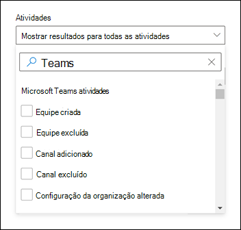
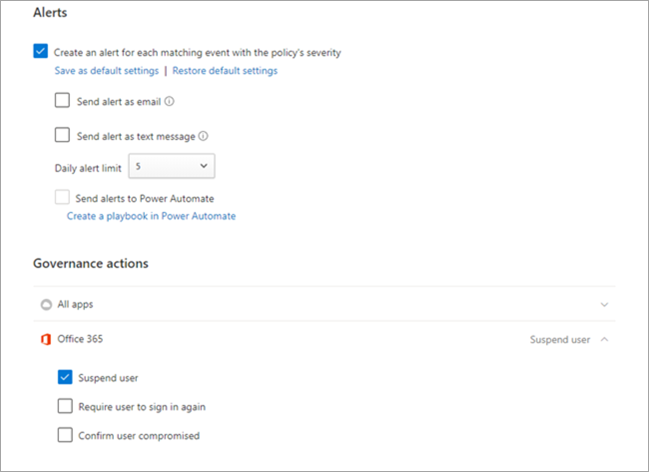

# Pesquisar o log de auditoria de eventos no Microsoft Teams

> [!IMPORTANT]
> [!INCLUDE [new-teams-sfb-admin-center-notice](includes/new-teams-sfb-admin-center-notice.md)]

O log de auditoria pode ajudá-lo a investigar atividades específicas em Microsoft 365 serviços. Para Microsoft Teams, aqui estão algumas das atividades que são auditadas:

- Criação de equipes
- Exclusão de equipes
- Canal adicionado
- Configuração alterada

Para uma lista completa de Teams que são auditadas, consulte [Teams](#teams-activities) atividades e Turnos em atividades Teams [(em visualização)](#shifts-in-teams-activities).

> [!NOTE]
> Eventos de auditoria de canais privados também são registrados como são para equipes e canais padrão.

## Ativar a auditoria no Microsoft Teams

Antes de poder ver os dados de auditoria, você precisa primeiro ativar a auditoria no Centro de Conformidade & [Segurança.](https://protection.office.com) Para ajudar a ativar a auditoria, leia Ativar ou desativar a pesquisa de [log de auditoria.](https://support.office.com/article/Turn-Office-365-audit-log-search-on-or-off-e893b19a-660c-41f2-9074-d3631c95a014)

> [!IMPORTANT]
> Os dados de auditoria só estão disponíveis a partir do ponto em que você afirmou a auditoria.

## Recuperar dados do Microsoft Teams a partir do log de auditoria

1. Para recuperar logs de auditoria, vá até o [Centro de Conformidade e Segurança](https://go.microsoft.com/fwlink/?linkid=855775). Em **Pesquisa,** selecione **Pesquisa de log de auditoria.**

2. Use a **Pesquisa** para filtrar pelas atividades, datas e usuários que você deseja auditar.

3. Exporte os resultados para o Excel para analisá-los melhor.

> [!IMPORTANT]
> Os dados de auditoria só serão visíveis no log de auditoria se a auditoria estiver 1ada.

O período de tempo em que um registro de auditoria é mantido e pesquisável no log de auditoria depende de sua assinatura Microsoft 365 ou Office 365, e especificamente o tipo de licença atribuída aos usuários. Para saber mais, confira a descrição do serviço [& Centro de Conformidade.](/office365/servicedescriptions/office-365-platform-service-description/office-365-securitycompliance-center)

## Dicas pesquisar o log de auditoria

Aqui estão dicas para pesquisar Teams atividades no log de auditoria.

- Você pode selecionar atividades específicas para pesquisar clicando no nome da atividade. Ou você pode pesquisar todas as atividades em um grupo (como atividades de arquivo e **pasta)** clicando no nome do grupo. Se uma atividade estiver selecionada, você poderá clicar nele para cancelar a seleção. Você também pode usar a caixa de pesquisa para exibir as atividades que contêm a palavra-chave que você digita.

  

- Para exibir eventos para atividades executados usando cmdlets, selecione **Mostrar resultados de** todas as atividades na lista **Atividades.** Se você sabe o nome da operação para essas atividades, pesquise todas as atividades e filtre os resultados digitando o nome da operação na caixa na coluna **Atividade.** Para saber mais, confira [Etapa 3: Filtrar os resultados da pesquisa](/microsoft-365/compliance/search-the-audit-log-in-security-and-compliance#step-3-filter-the-search-results).

- Para limpar os critérios de pesquisa atuais, clique em **Limpar**. O intervalo de datas retorna ao padrão dos últimos sete dias. Você também pode clicar em **Limpar tudo para mostrar resultados de todas as atividades para** cancelar todas as atividades selecionadas.

- Se 5.000 resultados são encontrados, você provavelmente pode supor que há mais de 5.000 eventos que atendidas aos critérios de pesquisa. Você pode refinar os critérios de pesquisa e reprisar a pesquisa para retornar menos resultados ou exportar todos os resultados da pesquisa selecionando **Exportar**  >  **Baixar todos os resultados**.

Confira este [vídeo para](https://www.youtube.com/embed/UBxaRySAxyE) usar a pesquisa de log de áudio. Participe de Ansuman Acharya, um gerente de programa para Teams, pois ele demonstra como fazer uma pesquisa de log de auditoria para Teams.

## Usar Cloud App Security para definir políticas de atividade

Usando [Microsoft Cloud App Security](/cloud-app-security/what-is-cloud-app-security) integração, você  pode definir políticas de atividade para impor uma ampla variedade de processos automatizados usando as APIs do provedor de aplicativos. Essas políticas permitem monitorar atividades específicas realizadas por vários usuários ou seguir taxas inesperadamente altas de um determinado tipo de atividade.

Depois de definir uma política de detecção de atividade, ela começa a gerar alertas. Os alertas só são gerados em atividades que ocorrem após a criação da política. Aqui estão alguns cenários de exemplo de como você pode usar as políticas de atividade no Cloud App Security para monitorar Teams atividades.

### Cenário de usuário externo

Um cenário em que você pode querer ficar de olho, de uma perspectiva de negócios, é a adição de usuários externos ao seu ambiente Teams ambiente. Se os usuários externos estão habilitados, monitorar sua presença é uma boa ideia.  Você pode usar [Cloud App Security](/cloud-app-security/what-is-cloud-app-security) para identificar possíveis ameaças.

A captura de tela dessa política para monitorar a adição de usuários externos permite nomear a política, definir a gravidade de acordo com suas necessidades de negócios, defini-la como (nesse caso) uma única atividade e, em seguida, estabelecer os parâmetros que monitorarão especificamente apenas a adição de usuários não internos e limitar essa atividade a Teams.

Os resultados dessa política podem ser exibidos no log de atividades:

Aqui você pode revisar as combinações com a política definida e fazer quaisquer ajustes conforme necessário ou exportar os resultados a ser usado em outro lugar.

### Cenário de exclusão em massa

Como mencionado anteriormente, você pode monitorar cenários de exclusão. É possível criar uma política que monitore a exclusão em massa de Teams sites. Neste exemplo, uma política baseada em alerta é configurada para detectar a exclusão em massa das equipes em um intervalo de 30 minutos.

Como mostra a captura de tela, você pode definir muitos parâmetros diferentes para essa política para monitorar as exclusões de Teams, incluindo gravidade, ação única ou repetida e parâmetros que limitam isso a Teams e exclusão de site. Isso pode ser feito independentemente de um modelo ou você pode ter um modelo criado para basear essa política, dependendo das suas necessidades organizacionais.

Depois de estabelecer uma política que funcione para sua empresa, você poderá revisar os resultados no log de atividades à medida que os eventos são disparados:

Você pode filtrar até a política definida para ver os resultados dessa política. Se os resultados que você está recebendo no log de atividades não são satisfatórios (talvez você esteja vendo muitos resultados ou nada), isso pode ajudá-lo a ajustar a consulta para torná-la mais relevante para o que você precisa fazer.

### Cenário de alerta e governança

Você pode definir alertas e enviar emails para administradores e outros usuários quando uma política de atividade é disparada. Você pode definir ações de governança automatizadas, como suspender um usuário ou fazer com que um usuário entre novamente de forma automatizada. Este exemplo mostra como uma conta de usuário pode ser suspensa quando uma política de atividade é disparada e determina que um usuário excluiu duas ou mais equipes em 30 minutos.

## Teams atividades

Aqui está uma lista de todos os eventos que estão registrados para atividades de usuário e administrador no Teams no log de auditoria Microsoft 365 usuário. A tabela inclui o nome amigável exibido  na coluna Atividades e o nome da operação correspondente que aparece nas informações detalhadas de um registro de auditoria e no arquivo CSV quando você exporta os resultados da pesquisa.

|Nome amigável  |Operação |Descrição |
|:---------|:---------|:---------|
|Bot adicionado à equipe   |BotAddedToTeam        |Um usuário adiciona um bot a uma equipe.        |
|Canal adicionado   |ChannelAdded         |Um usuário adiciona um canal a uma equipe.         |
|Conector adicionado  |ConnectorAdded          |Um usuário adiciona um conector a um canal.        |
|Membros adicionados    |MemberAdded         |Um proprietário de equipe adiciona membros a uma equipe, canal ou chat de grupo.         |
|Guia Adicionada    |TabAdded         |Um usuário adiciona uma guia a um canal.        |
|Configuração de canal alterada    |ChannelSettingChanged         |A operação ChannelSettingChanged é registrada quando as atividades a seguir são executadas por um membro da equipe. Para cada uma dessas atividades, uma descrição da configuração que foi alterada (mostrada entre parênteses é exibida na coluna **Item** nos resultados da pesquisa de log de auditoria. <ul><li>Altera o nome de um canal de equipe (**Nome do canal**)</li><li>Altera a descrição de um canal de equipe (**Descrição do canal**)</li> </ul>      |
|Configuração da organização alterada   |TeamsTenantSettingChanged         |A operação TeamsTenantSettingChanged é registrada quando as seguintes atividades são executadas por um administrador global no Centro de administração do Microsoft 365. Essas atividades afetam as configurações de Teams de toda a organização. Para saber mais, consulte [Manage Teams settings for your organization](enable-features-office-365.md).  Para cada uma dessas atividades, uma descrição da configuração que foi alterada (mostrada entre parênteses) é exibida na coluna **Item** nos resultados da pesquisa de log de auditoria.<ul><li>Habilita ou desabilita Teams para a organização (**Microsoft Teams**).</li><li>Habilita ou desabilita a interoperabilidade entre Microsoft Teams e Skype for Business para a organização (**Skype for Business interoperabilidade).**</li><li>Habilita ou desabilita o modo de exibição de gráfico organizacional Microsoft Teams clientes (**modo de exibição de gráfico de organização**).</li><li>Habilita ou desabilita a capacidade dos membros da equipe de agendar reuniões privadas (**Agendamento de reuniões particulares**).</li><li>Habilita ou desabilita a capacidade dos membros da equipe de agendar reuniões do canal (**Agendamento de reunião do canal**).</li><li>Habilita ou desabilita a chamada de vídeo Teams reuniões (**Vídeo para Skype reuniões).**</li><li>Habilita ou desabilita o compartilhamento de tela Microsoft Teams reuniões da organização ( Compartilhamento de tela **para Skype reuniões).**</li><li>Habilita ou desabilita a capacidade de adicionar imagens animadas (chamadas Giphys) Teams conversas (**imagens animadas**).</li><li>Altera a configuração de classificação de conteúdo para a organização (**Classificação de conteúdo**). A classificação de conteúdo restringe o tipo de imagem animada que pode ser exibida em conversas.</li><li>Habilita ou desabilita a capacidade dos membros da equipe de adicionar imagens personalizáveis (chamadas de memes personalizados) da Internet a conversas de equipe (**imagens personalizáveis da Internet**).</li><li>Habilita ou desabilita a capacidade dos membros da equipe de adicionar imagens editáveis (chamadas de adesivos) às conversas de equipe (**imagens editáveis**).</li><li>Habilita ou desabilita essa capacidade para os membros da equipe usarem bots em Microsoft Teams chats e canais (**bots em toda** a organização) .</li><li>Habilita bots específicos para Microsoft Teams. Isso não inclui o T-Bot, que é Teams bot de ajuda que está disponível quando os bots estão habilitados para a organização (**bots individuais**).</li><li>Habilita ou desabilita a capacidade dos membros da equipe de adicionar extensões ou guias (**Extensões ou guias**).</li><li>Habilita ou desabilita o side-loading de bots proprietários para Microsoft Teams (**Carregamento lateral de Bots**).</li><li>Habilita ou desabilita a capacidade de os usuários enviarem mensagens de email para um Microsoft Teams canal **(email do canal).**</li></ul>|
|Função alterada dos membros na equipe    |MemberRoleChanged         |Um proprietário de equipe altera a função de membros em uma equipe. Os valores a seguir indicam o tipo de função atribuído ao usuário.   **1** - Indica a função Membro. **2** - Indica a função Proprietário. **3** - Indica a função Convidado.  A propriedade Members também inclui o nome da sua organização e o endereço de email do membro.        |
|Configuração de equipe alterada    |TeamSettingChanged        |A operação TeamSettingChanged é registrada quando as seguintes atividades são executadas por um proprietário da equipe. Para cada uma dessas atividades, uma descrição da configuração que foi alterada (mostrada entre parênteses) é exibida na coluna **Item** nos resultados da pesquisa de log de auditoria.<ul><li>Altera o tipo de acesso de uma equipe. Teams pode ser definido como privado ou público (**Tipo de acesso de equipe**). Quando uma equipe é privada (a configuração padrão), os usuários podem acessar a equipe somente por convite. Quando uma equipe é pública, ela é descoberta por qualquer pessoa.</li><li>Altera a classificação de informações de uma equipe (**Classificação de equipe**). Por exemplo, os dados de equipe podem ser classificados como alto impacto comercial, médio impacto comercial ou baixo impacto comercial.</li><li>Altera o nome de uma equipe (**Nome da equipe**).</li><li>Altera a descrição da equipe (**Descrição da equipe**).</li><li>Alterações feitas nas configurações de equipe. Para acessar essas configurações, um proprietário da equipe pode clicar com o botão direito do mouse em uma equipe, selecione **Gerenciar** equipe e clique na **guia** Configurações. Para essas atividades, o nome da configuração que foi alterada é exibido na coluna **Item** nos resultados da pesquisa de log de auditoria.</li></ul>         |
|Criado um chat 1, 2| ChatCreated|    Um Teams chat foi criado.|
|Equipe criada    |TeamCreated         |Um usuário cria uma equipe.         |
|Excluiu uma mensagem  |MessageDeleted |Uma mensagem em um chat ou canal foi excluída.|
|Excluído todos os aplicativos da organização|DeletedAllOrganizationApps           |Excluiu todos os aplicativos da organização do catálogo.     |
|Aplicativo excluído |AppDeletedFromCatalog           |Um aplicativo foi excluído do catálogo.     |
|Canal excluído     |ChannelDeleted         |Um usuário exclui um canal de uma equipe.         |
|Equipe excluída  |TeamDeleted            |Um proprietário de equipe exclui uma equipe.      |
|Editei uma mensagem com um link de URL no Teams     |MessageEditedHasLink         |Um usuário edita uma mensagem e adiciona um link de URL a ela Teams.         |
|Mensagens exportadas 1, 2 | MessagesExported |Mensagens de chat ou canal foram exportadas|.
|Chat buscado  1</sup, 2>    |ChatRetrieved  |Um Microsoft Teams chat foi recuperado.|
|Buscar todo o conteúdo hospedado de uma mensagem1, 2  |MessageHostedContentsListed    |Todo o conteúdo hospedado em uma mensagem, como imagens ou trechos de código, foi recuperado.|
|Aplicativo instalado |AppInstalled         |Um aplicativo foi instalado.   |
|Ação executada no cartão|PerformedCardAction|Um usuário entrou em ação em um cartão adaptável dentro de um chat. Cartões adaptáveis geralmente são usados por bots para permitir a exibição rica de informações e interação em chats.   **Observação:** Somente ações de entrada em linha em um cartão adaptável dentro de um chat estarão disponíveis no log de auditoria. Por exemplo, quando um usuário envia uma resposta de sondagem em uma conversa de canal em um cartão adaptável gerado por um bot de Sondagem. Ações do usuário como "Exibir resultado", que abrirão uma caixa de diálogo ou ações do usuário dentro das caixas de diálogo não estarão disponíveis no log de auditoria.|
|Postou uma nova mensagem 1, 2    |MessageSent Uma nova mensagem foi postada em um chat ou canal.|
|Aplicativo publicado |AppPublishedToCatalog           |Um aplicativo foi adicionado ao catálogo.     |
|Ler uma mensagem 1, 2  |MessageRead    |Uma mensagem de um chat ou canal foi recuperada.|
|Ler conteúdo hospedado de uma mensagem 1, 2    |MessageHostedContentRead   |O conteúdo hospedado em uma mensagem, como uma imagem ou um trecho de código, foi recuperado.|
|Bot removido da equipe   |BotRemovedFromTeam         |Um usuário remove um bot de uma equipe.       |
|Conector removido     |ConnectorRemoved         |Um usuário remove um conector de um canal.         |
|Membros removidos    |MemberRemoved        |Um proprietário da equipe remove membros de uma equipe, canal ou chat de grupo.         |
|Guia Removida    |TabRemoved         |Um usuário remove uma guia de um canal.         |
|Mensagens recuperadas 1, 2  |MessagesListed |As mensagens de um chat ou canal foram recuperadas.|
|Enviou uma mensagem com um link de URL no Teams |MessageCreatedHasLink|Um usuário envia uma mensagem contendo um link de URL Teams.|
|Notificação de alteração enviada para criação de mensagens 1, 2   |MessageCreatedNotification |Uma notificação de alteração foi enviada para notificar um aplicativo ouvinte inscrito de uma nova mensagem.|
|Notificação de alteração enviada para exclusão de mensagem 1, 2   |MessageDeletedNotification |Uma notificação de alteração foi enviada para notificar um aplicativo ouvinte inscrito de uma mensagem excluída.|
|Notificação de alteração enviada para a atualização de mensagem 1, 2 |MessageUpdatedNotification |Uma notificação de alteração foi enviada para notificar um aplicativo ouvinte inscrito de uma mensagem atualizada.|
|Inscrito nas notificações de alteração de mensagem 1, 2  |SubscribedToMessages   |Uma assinatura foi criada por um aplicativo ouvinte para receber notificações de alteração para mensagens.|
|Aplicativo desinstalado |AppUninstalled           |Um aplicativo foi desinstalado.     |
|Aplicativo atualizado |AppUpdatedInCatalog           |Um aplicativo foi atualizado no catálogo.     |
|Atualizado um chat 1, 2  |ChatUpdated    |Um Teams chat foi atualizado.|
|Atualizado uma mensagem 1, 2   |MessageUpdated |Uma mensagem de um chat ou canal foi atualizada.|
|Conector atualizado    |ConnectorUpdated         |Um usuário modificou um conector em um canal.         |
|Guia Atualizado   |TabUpdated         |Um usuário modificou uma guia em um canal.         |
|Aplicativo atualizado |AppUpgraded           |Um aplicativo foi atualizado para sua versão mais recente no catálogo.     |
|O usuário se inscreveu no Teams     |TeamsSessionStarted         |Um usuário se insinte em um Microsoft Teams cliente. Esse evento não captura atividades de atualização de token.         |
||||

> [!NOTE]
> 1 Um registro de auditoria para esse evento só é registrado quando a operação é executada chamando uma API Graph Microsoft. Se a operação for executada no cliente Teams, um registro de auditoria não será registrado  2 Esse evento só está disponível na Auditoria Avançada. Isso significa que os usuários devem ter a licença apropriada antes que esses eventos sejam registrados no log de auditoria. Para obter mais informações sobre atividades disponíveis apenas na Auditoria Avançada, consulte [Auditoria Avançada em Microsoft 365](/microsoft-365/compliance/advanced-audit#advanced-audit-events). Para requisitos avançados de licenciamento de auditoria, consulte [Soluções de auditoria em Microsoft 365](/microsoft-365/compliance/auditing-solutions-overview#licensing-requirements).

## Mudanças nas Teams atividades

**(em visualização)**

Se sua organização estiver usando o aplicativo Shifts no Teams, você poderá pesquisar no log de auditoria atividades relacionadas ao aplicativo Shifts. Aqui está uma lista de todos os eventos que estão registrados para atividades shifts no Teams no log de auditoria Microsoft 365.

|Nome amigável  |Operação  |Descrição  |
|---------|---------|---------|
|Grupo de agendamento adicionado |ScheduleGroupAdded          |Um usuário adiciona com êxito um novo grupo de agendamento à agenda.|
|Grupo de agendamento editado     |ScheduleGroupEdited         |Um usuário edita com êxito um grupo de agendamento.          |
|Grupo de agendamento excluído         |ScheduleGroupDeleted              |Um usuário exclui com êxito um grupo de agendamento da agenda.|
|Agenda de retirada |ScheduleWithdrawn              |Um usuário retira com êxito uma agenda publicada.|
|Turno adicionado      |ShiftAdded          |Um usuário adiciona com êxito uma mudança.           |
|Turno editado       |ShiftEdited       |Um usuário edita com êxito um turno.        |
|Turno excluído          |ShiftDeleted          | Um usuário exclui com êxito um turno.               |
|Tempo de folga adicionado      |TimeOffAdded          |Um usuário adiciona folga com êxito na agenda.          |
|Tempo de folga editado         |TimeOffEdited           |Um usuário edita com êxito o tempo de folga.          |
|Tempo de folga excluído     |TimeOffDeleted              |Um usuário exclui com êxito o tempo de folga.           |
|Adicionado turno aberto     |OpenShiftAdded          |Um usuário adiciona com êxito um turno aberto a um grupo de agendamento.          |
|Turno aberto editado    |OpenShiftEdited          |Um usuário edita com êxito um turno aberto em um grupo de agendamento.          |
|Turno aberto excluído      |OpenShiftDeleted          |Um usuário exclui com êxito um turno aberto de um grupo de agendamento.         |
|Agenda compartilhada     |ScheduleShared                  |Um usuário compartilhou com êxito uma agenda de equipe para um intervalo de datas.          |
|Clocked in using Time clock         |ClockedIn          |Um usuário marca com êxito no uso do relógio time.          |
|Clocked out using Time clock      |ClockedOut          |Um usuário faz o clock out com êxito usando o relógio time.          |
|Começou a quebrar usando o relógio de hora      |BreakStarted          |Um usuário inicia com êxito uma pausa durante uma sessão de relógio de hora ativa.          |
|Terminou a pausa usando o relógio de hora    |BreakEnded          |Um usuário termina com êxito uma pausa durante uma sessão de relógio de hora ativa.          |
|Entrada de relógio de hora adicionada     |TimeClockEntryAdded          |Um usuário adiciona com êxito uma nova entrada manual do relógio time na Folha de Tempo.          |
|Entrada do relógio de hora editada     | TimeClockEntryEdited             |Um usuário edita com êxito uma entrada de relógio de hora na Folha de Tempo.          |
|Entrada de relógio de hora excluída    |TimeClockEntryDeleted              |Um usuário exclui com êxito uma entrada de relógio de hora na Folha de Tempo.          |
|Solicitação de turno adicionada         |RequestAdded              |Um usuário adicionou uma solicitação de turno.          |
|Resposta à solicitação de turno     |RequestRespondedTo                  |Um usuário respondeu a uma solicitação de turno.          |
|Solicitação de turno cancelada         |RequestCancelled               |Um usuário cancelou uma solicitação de turno.          |
|Configuração de agenda alterada      |ScheduleSettingChanged          |Um usuário altera uma configuração nas configurações shifts.         |
|Integração de força de trabalho adicionada      |WorkforceIntegrationAdded                  | O aplicativo Shifts é integrado a um sistema de terceiros.         |
|Mensagem de deslocamento aceita         |OffShiftDialogAccepted          |Um usuário reconhece a mensagem de folga para acessar Teams horário de turno.           |

## Office 365 API de Atividade de Gerenciamento

Você pode usar a API Office 365 Atividade de Gerenciamento para recuperar informações sobre Teams eventos. Para saber mais sobre o esquema da API de Atividade de Gerenciamento para Teams, [consulte Teams esquema](/office/office-365-management-api/office-365-management-activity-api-schema#microsoft-teams-schema).

## Atribuição em Teams logs de auditoria

As alterações de associação ao Teams (como usuários adicionados ou excluídos) feitas por meio do Azure Active Directory (Azure AD), do portal de administração do Microsoft 365 ou da API de Grupos Microsoft 365 Graph serão exibidas em mensagens de auditoria do Teams e no canal Geral com uma atribuição a um proprietário existente da equipe e não ao iniciador real da ação. Nesses cenários, consulte o Azure AD ou [Microsoft 365 de](/microsoft-365/compliance/search-the-audit-log-in-security-and-compliance) auditoria de grupo para ver as informações relevantes.

## Usar Cloud App Security para definir políticas de detecção de anomalias

 As políticas de detecção de anomalias no Cloud App Security fornecem a UEBA (análise comportamental de usuário e entidade) pronta para uso e entidade (ML) para que você possa executar imediatamente a detecção avançada de ameaças em seu ambiente de nuvem. Como elas são habilitadas automaticamente, as novas políticas de detecção de anomalias fornecem resultados imediatos, fornecendo detecções imediatas, direcionando várias anomalias comportamentais em seus usuários e nos dispositivos e máquinas e dispositivos conectados à sua rede. Além disso, as novas políticas expõem mais dados do mecanismo de detecção Cloud App Security, para ajudá-lo a acelerar o processo de investigação e a conter ameaças em andamento.

Estamos trabalhando para integrar Teams eventos em políticas de detecção de anomalias. Por enquanto, você pode configurar políticas de detecção de anomalias para outros produtos Office e tomar itens de ação em usuários que corresponderem a essas políticas.

## Tópicos relacionados

- [Pesquise o log de auditoria no Centro de conformidade do Microsoft 365](/microsoft-365/compliance/search-the-audit-log-in-security-and-compliance)
