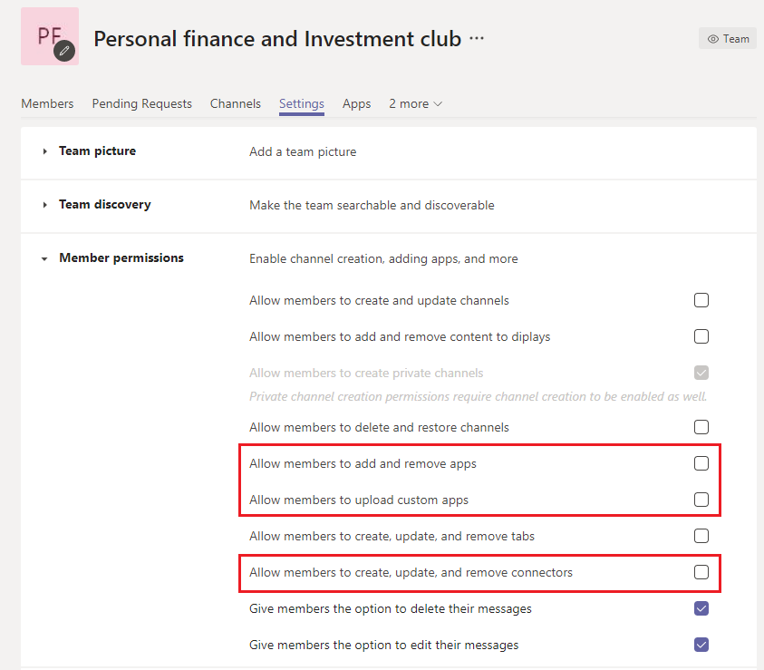

Gerenciar equipes grandes no Microsoft Teams - Práticas recomendadas
======================================================

O Microsoft Teams é igualmente eficaz para facilitar as comunicações entre pequenos grupos com dezenas de membros e grupos grandes com milhares de membros. Revise [limites e especificações do Teams para](limits-specifications-teams.md) atualizações sobre tamanhos de equipe. O aumento do tamanho da equipe gera desafios operacionais e de gerenciamento exclusivos. Este artigo descreve as práticas recomendadas para criar e gerenciar equipes grandes compostas por milhares de membros.

## Valor de equipes grandes

Equipes grandes são muito úteis na habilitação dos seguintes cenários de colaboração:

- **Colaboração** em todo o departamento: se sua organização tiver vários departamentos, como Finanças, Operações, R&D etc., você poderá criar uma única equipe que inclua todos os membros em um departamento específico. Agora todas as comunicações relevantes a um departamento podem ser compartilhadas nesta equipe, o que facilita o acesso instantâneo e o envolvimento dos membros.

- **Colaboração em grupos de recursos de** funcionários: as organizações geralmente têm grandes grupos de pessoas com interesses mútuos que pertencem a um departamento ou grupo de trabalho diferente. Por exemplo, pode haver um grupo de pessoas que compartilham uma paixão por finanças pessoais e investimentos. Muitas vezes é difícil se conectar em uma organização de grande porte. Para desenvolver comunidades para esses grupos, os administradores de locatários podem criar uma grande equipe que serve como um grupo público de recursos de toda a empresa do que qualquer pessoa pode ingressar e aproveitar. Eventualmente, essas comunidades coletam informações que membros novos e existentes podem aproveitar.

- **Colaboração entre membros internos e** externos: os produtos populares geralmente desenvolvem uma comunidade de usuários que estão ansiosos para experimentar novas versões de produtos e fornecer comentários. Os primeiros adotaram uma relação com grupos de produtos para ajudar a modelar o produto. Nesses cenários, os administradores de locatários podem configurar uma grande equipe que inclui grupos de produtos internos e avaliadores de produtos externos para facilitar um processo de desenvolvimento de produtos de alto nível. Essas equipes também podem fornecer suporte ao cliente para um conjunto seleto de clientes.

## Criar equipes a partir de grupos existentes

Use grupos de contatos, grupos de segurança ou grupos do Office para iniciar sua equipe. Você pode importar um grupo para criar uma equipe ou criar uma equipe a partir de um grupo do Office.

**Importe um** grupo para fazer uma equipe: quando você importa um grupo com até 3.500 membros para o Teams, o Teams calcula automaticamente o número total de membros no grupo. Esta é uma importação única e as alterações futuras no grupo não serão atualizadas automaticamente no Teams.

Crie uma equipe de um grande grupo do **Microsoft 365:** quando você cria uma equipe de um grande  grupo do Microsoft 365, os membros fazem automaticamente parte do grupo do Microsoft 365 e da equipe. No futuro, à medida que os membros da equipe ingressam ou saem do grupo do Microsoft 365, eles são adicionados ou removidos automaticamente da equipe.

## Crie canais para concentrar discussões

Você pode restringir as discussões em grupo criando canais com foco. Veja [as práticas recomendadas para organizar equipes.](best-practices-organizing.md)

## Restringir a criação de canal

Se qualquer membro da equipe tiver permissão para criar canais, essa equipe poderá ter a swlwl de canal. Os proprietários da equipe devem desativar a criação, a atualização, a exclusão e a restauração de canal para membros em Configurações **> Permissões de membro.** Consulte [Visão geral de equipes e canais.](teams-channels-overview.md)

## Adicionar canais favoritos

Para acelerar o novo envolvimento do usuário e a descoberta de conteúdo, você pode selecionar canais favoritos que estão disponíveis para o usuário por padrão. No painel **Canais** do centro de administração, verifique os canais na coluna **Mostrar para membros.**

 Consulte [Criar suas primeiras equipes e canais para](get-started-with-teams-create-your-first-teams-and-channels.md) obter detalhes.

## Regular aplicativos e bots em equipes grandes

Para evitar a adição de aplicativos ou bots distrativas, os proprietários da equipe podem desabilitar, adicionar, remover e carregar aplicativos e conectores para os membros da equipe. No centro de administração, em **Configurações > Permissões** de membro, desmarque as três opções que permitem aos membros adicionar aplicativos ou conectores.

Consulte [Aplicativos, bots e & conectores.](deploy-apps-microsoft-teams-landing-page.md)

## Regular as menções de equipe e canal

As menções de equipe e canal podem ser usadas para chamar a atenção de toda a equipe para determinadas postagens de canal. Quando uma menção é usada em uma postagem, uma notificação é enviada para milhares de membros da equipe. Se as notificações são muito frequentes, os membros da equipe podem ficar sobrecarregados e podem se queixar aos proprietários da equipe. Para evitar menções de equipe ou canal, desligue as menções de equipe e canal para membros desmarcando as caixas no painel Configurações **> @mentions** equipes.

## Considerar a configuração da moderação em seus canais

Os proprietários da equipe podem ativar a moderação de um canal para controlar quem pode iniciar novas postagens e responder a postagens no canal. Ao configurar a moderação, você pode escolher um ou mais membros da equipe para serem moderadores. Os proprietários da equipe são moderadores por padrão. Para obter mais informações, [consulte Configurar e gerenciar a moderação do canal.](manage-channel-moderation-in-teams.md)

## Tópicos relacionados

- [Práticas recomendadas para organizar o Teams](best-practices-organizing.md)
- [Criar uma equipe de toda a organização](create-an-org-wide-team.md)
