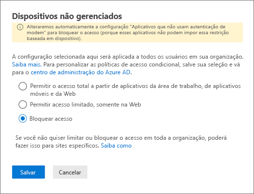
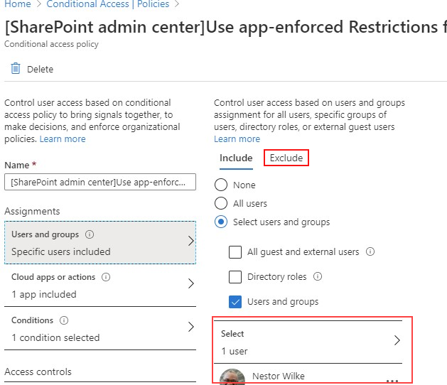

# Bloquear o acesso ao SharePoint para usuários específicosBlock access to SharePoint for specific users

A aplicação de qualquer política de Acesso Condicional (AC) do SharePoint no Microsoft 365 também se aplica ao Teams.Applying any Conditional Access (CA) policy on SharePoint in Microsoft 365 is also applied to Teams. No entanto, algumas organizações desejam bloquear o acesso aos arquivos do SharePoint (carregar, baixar, visualizar, editar, criar) e ainda permitir que seus funcionários usem clientes Web, móveis e da área de trabalho do Teams em dispositivos não gerenciados.However, some organizations want to block access to SharePoint files (upload, download, view, edit, create) yet allow their employees to use Teams desktop, mobile, and web clients on unmanaged devices. De acordo com as regras de política AC, o bloqueio do Sharepoint bloquearia também o Teams.Under the CA policy rules, blocking Sharepoint would lead to blocking Teams as well. Este artigo explica como você pode contornar essa limitação e permitir que seus funcionários continuem usando o Teams enquanto bloqueia completamente o acesso aos arquivos armazenados no SharePoint.This article explains how you can work around this limitation and allow your employees to continue using Teams while completely blocking access to files stored in SharePoint.

> [!Note]
> O bloqueio ou limitação do acesso em dispositivos não gerenciados depende das políticas de acesso condicional do Microsoft Azure AD.Blocking or limiting access on unmanaged devices relies on Azure AD conditional access policies. Saiba mais sobre o [Licenciamento do Microsoft Azure AD](https://azure.microsoft.com/pricing/details/active-directory/).Learn about [Azure AD licensing](https://azure.microsoft.com/pricing/details/active-directory/). Para obter uma visão geral do acesso condicional no Microsoft Azure AD, confira [Acesso condicional no Azure Active Directory](https://docs.microsoft.com/azure/active-directory/conditional-access/overview).For an overview of conditional access in Azure AD, see [Conditional access in Azure Active Directory](https://docs.microsoft.com/azure/active-directory/conditional-access/overview). Para obter informações sobre as políticas de acesso recomendadas do SharePoint Online, confira [Recomendações de política para proteger sites e arquivos do SharePoint](https://docs.microsoft.com/microsoft-365/enterprise/sharepoint-file-access-policies).For info about recommended SharePoint Online access policies, see [Policy recommendations for securing SharePoint sites and files](https://docs.microsoft.com/microsoft-365/enterprise/sharepoint-file-access-policies). Se você limitar o acesso a dispositivos não gerenciados, os usuários de dispositivos gerenciados deverão usar um dos [sistemas operacionais e combinações de navegador com suporte](https://docs.microsoft.com/azure/active-directory/conditional-access/technical-reference#client-apps-condition), ou terão seu acesso limitado também.If you limit access on unmanaged devices, users on managed devices must use one of the [supported OS and browser combinations](https://docs.microsoft.com/azure/active-directory/conditional-access/technical-reference#client-apps-condition), or they will also have limited access.

Você pode bloquear ou limitar o acesso de:You can block or limit access for:

- Usuários da organização ou apenas alguns usuários ou grupos de segurança.Users in the organization or only some users or security groups.

- Todos os sites da organização ou apenas alguns deles.All sites in the organization or only some sites.

Quando o acesso é bloqueado, os usuários verão uma mensagem de erro.When access is blocked, users will see an error message. O bloqueio de acesso ajuda a fornecer segurança e protege dados seguros.Blocking access helps provide security and protects secure data. Quando o acesso é bloqueado, os usuários verão uma mensagem de erro.When access is blocked, users will see an error message.

1. Abra o Centro de Administração do SharePoint.Open the SharePoint Admin Center.

2. Expanda **Políticas** > **Políticas de Acesso**.Expand **Policies** > **Access Policies**.

3. Na seção **Dispositivos não gerenciados**, selecione **Bloquear Acesso** e selecione **Salvar**.In the **Unmanaged Devices** section,  select **Block Access** and select **Save**.

   

4. Abra o portal do [Azure Active Directory](https://portal.azure.com/#blade/Microsoft_AAD_IAM/ConditionalAccessBlade/Policies) e acesse **Políticas de Acesso Condicional**.Open the [Azure Active Directory](https://portal.azure.com/#blade/Microsoft_AAD_IAM/ConditionalAccessBlade/Policies) portal and navigate to **Conditional Access Policies**.

    Você verá uma nova política criada pelo SharePoint semelhante a este exemplo:You'll see a new policy has been created by SharePoint that's similar to this example:

    

5. Atualize a política para direcionar apenas a usuários ou a um grupo específicos.Update the policy to target only specific users or a group.

    

  > [!Note]
> Configurar essa política impedirá seu acesso ao portal de administração do SharePoint.Setting this policy will cut your access to the SharePoint admin portal. Recomendamos que você configure a política de exclusão e selecione os Administradores globais e do SharePoint.We recommended that you configure the exclusion policy and select the Global and SharePoint admins.

6. Verificar se apenas o SharePoint está selecionado como Aplicativo na Nuvem de destinoVerify that only SharePoint is selected as targeted Cloud App

    

7. Atualize as **Condições** para incluir clientes da área de trabalho também.Update **Conditions** to include desktop clients, as well.

    

8. Certifique-se de que **Conceder acesso** está habilitadoMake sure that **Grant access** is enabled

    

9. Certifique-se de que **Usar restrições impostas pelo aplicativo** está habilitado.Make sure **Use app enforced restrictions** is enabled.

10. Habilite sua política e selecione **Salvar**.Enable your policy and select **Save**.

    

Para testar sua política, você precisa sair de qualquer cliente, como o aplicativo da área de trabalho do Teams ou o cliente de sincronização do OneDrive for Business e entrar novamente para ver a política funcionando.To test your policy, you need to sign out from any client such as the Teams desktop app or the OneDrive for Business sync client and sign in again to see the policy working. Se o seu acesso tiver sido bloqueado, você verá uma mensagem no Teams informando que o item pode não existir.If your access has been blocked, you'll see a message in Teams that states the item might not exist.

 

No Sharepoint, você receberá uma mensagem de acesso negado.In Sharepoint, you'll receive an access denied message.

## Tópicos relacionadosRelated topics

[Controle o acesso a dispositivos não gerenciados no SharePointControl access for unmanaged devices in SharePoint](https://docs.microsoft.com/sharepoint/control-access-from-unmanaged-devices)
