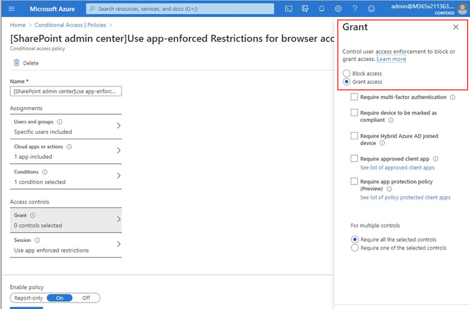

# Bloquear o acesso ao SharePoint para usuários específicosBlock access to SharePoint for specific users

A aplicação de qualquer política de acesso condicional (CA) no SharePoint Online (SPO) também é aplicada ao Teams.Applying any Conditional Access (CA) policy on SharePoint Online (SPO) is also applied to Teams. No entanto, algumas organizações desejam bloquear o acesso aos arquivos do SharePoint (carregar, baixar, exibir, editar, criar) ainda permitem que seus funcionários usem clientes da área de trabalho do Teams, dispositivos móveis e Web em dispositivos não gerenciados.However, some organizations want to block access to SharePoint files (upload, download, view, edit, create) yet allow their employees to use Teams desktop, mobile, and web clients on unmanaged devices. Nas regras de política da autoridade de certificação, o bloqueio de SPO também levaria a bloquear o Teams.Under the CA policy rules, blocking SPO would lead to blocking Teams as well. Este artigo explica como você pode contornar essa limitação e permitir que seus funcionários continuem a usar o Teams enquanto bloqueiam completamente o acesso a arquivos armazenados no SPO.This article explains how you can work around this limitation and allow your employees to continue using Teams while completely blocking access to files stored in SPO.

> [!Note]
> Bloquear ou limitar o acesso em dispositivos não gerenciados depende das políticas de acesso condicional do Azure AD.Blocking or limiting access on unmanaged devices relies on Azure AD conditional access policies. Saiba mais sobre o [Licenciamento do Azure ad](https://azure.microsoft.com/pricing/details/active-directory/).Learn about [Azure AD licensing](https://azure.microsoft.com/pricing/details/active-directory/). Para obter uma visão geral do acesso condicional no Azure AD, consulte [acesso condicional no Azure Active Directory](https://docs.microsoft.com/azure/active-directory/conditional-access/overview).For an overview of conditional access in Azure AD, see [Conditional access in Azure Active Directory](https://docs.microsoft.com/azure/active-directory/conditional-access/overview). Para obter informações sobre as políticas de acesso recomendadas do SharePoint, consulte [recomendações de política para proteger sites e arquivos do SharePoint](https://docs.microsoft.com/microsoft-365/enterprise/sharepoint-file-access-policies).For info about recommended SharePoint access policies, see [Policy recommendations for securing SharePoint sites and files](https://docs.microsoft.com/microsoft-365/enterprise/sharepoint-file-access-policies). Se você limitar o acesso em dispositivos não gerenciados, os usuários em dispositivos gerenciados devem usar uma das [combinações de sistema operacional e navegador compatíveis](https://docs.microsoft.com/azure/active-directory/conditional-access/technical-reference#client-apps-condition)ou também terão acesso limitado.If you limit access on unmanaged devices, users on managed devices must use one of the [supported OS and browser combinations](https://docs.microsoft.com/azure/active-directory/conditional-access/technical-reference#client-apps-condition), or they will also have limited access.

Você pode bloquear ou limitar o acesso para:You can block or limit access for:

- Usuários na organização ou somente alguns usuários ou grupos de segurança.Users in the organization or only some users or security groups.

- Todos os sites da organização ou somente alguns sites.All sites in the organization or only some sites.

Quando o Access estiver bloqueado, os usuários verão uma mensagem de erro.When access is blocked, users will see an error message. O bloqueio do Access ajuda a oferecer segurança e protege dados protegidos.Blocking access helps provide security and protects secure data. Quando o Access estiver bloqueado, os usuários verão uma mensagem de erro.When access is blocked, users will see an error message.

1. Abra o [centro de administração](https://admin.microsoft.com/sharepoint?page=accessControl&modern=true)do SharePoint.Open the SharePoint [Admin Center](https://admin.microsoft.com/sharepoint?page=accessControl&modern=true).

2. Expanda políticas de **Policies**  >  **acesso às**políticas.Expand **Policies** > **Access Policies**.

3. Na seção **dispositivos não gerenciados** , selecione **bloquear acesso** e selecione **salvar**.In the **Unmanaged Devices** section,  select **Block Access** and select **Save**.

   

4. Abra o portal [do Active Directory do Azure](https://portal.azure.com/#blade/Microsoft_AAD_IAM/ConditionalAccessBlade/Policies) e navegue até **políticas de acesso condicional**.Open the [Azure Active Directory](https://portal.azure.com/#blade/Microsoft_AAD_IAM/ConditionalAccessBlade/Policies) portal and navigate to **Conditional Access Policies**.

    Você verá que uma nova política foi criada pelo SharePoint semelhante a este exemplo:You'll see a new policy has been created by SharePoint that's similar to this example:

    

5. Atualize a política para direcionar apenas usuários específicos ou um grupo.Update the policy to target only specific users or a group.

    

  > [!Note]
> A configuração desta política recortará seu acesso ao portal de administração do SharePoint.Setting this policy will cut your access to the SharePoint admin portal. Recomendamos que você configure a política de exclusão e selecione os administradores globais e do SharePoint.We recommended that you configure the exclusion policy and select the Global and SharePoint admins.

6. Verificar se apenas o SharePoint Online está selecionado como aplicativo de nuvem direcionadoVerify that only SharePoint Online is selected as targeted Cloud App

    

7. Atualize **condições** para incluir clientes da área de trabalho também.Update **Conditions** to include desktop clients, as well.

    

8. Verifique se a opção **conceder acesso** está habilitadaMake sure that **Grant access** is enabled

    

9. Certifique-se de que a opção **usar restrições impostas de aplicativo** esteja habilitada.Make sure **Use app enforced restrictions** is enabled.

10. Habilite a política e selecione **salvar**.Enable your policy and select **Save**.

    

Para testar sua política, você precisa desconectar-se de qualquer cliente, como o aplicativo da área de trabalho Teams ou o cliente de sincronização do OneDrive, e entrar novamente para ver a política em funcionamento.To test your policy, you need to sign out from any client such as the Teams desktop app or the OneDrive sync client and sign in again to see the policy working. Se o seu acesso tiver sido bloqueado, você verá uma mensagem em Teams que informa que o item pode não existir.If your access has been blocked, you'll see a message in Teams that states the item might not exist.

 

No SharePoint, você receberá uma mensagem de acesso negado.In Sharepoint, you'll receive an access denied message. 

## Tópicos relacionadosRelated topics

[Controlar o acesso a dispositivos não gerenciados no SharePointControl access for unmanaged devices in SharePoint](https://docs.microsoft.com/sharepoint/control-access-from-unmanaged-devices)
