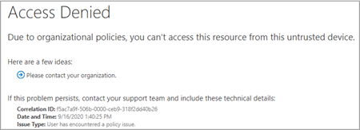

# Bloquear o acesso ao SharePoint para usuários específicos

A aplicação de qualquer política de acesso condicional (CA) no SharePoint Online (SPO) também é aplicada ao Teams. No entanto, algumas organizações desejam bloquear o acesso aos arquivos do SharePoint (carregar, baixar, exibir, editar, criar) ainda permitem que seus funcionários usem clientes da área de trabalho do Teams, dispositivos móveis e Web em dispositivos não gerenciados. Nas regras de política da autoridade de certificação, o bloqueio de SPO também levaria a bloquear o Teams. Este artigo explica como você pode contornar essa limitação e permitir que seus funcionários continuem a usar o Teams enquanto bloqueiam completamente o acesso a arquivos armazenados no SPO.

> [!Note]
> Bloquear ou limitar o acesso em dispositivos não gerenciados depende das políticas de acesso condicional do Azure AD. Saiba mais sobre o [Licenciamento do Azure ad](https://azure.microsoft.com/pricing/details/active-directory/). Para obter uma visão geral do acesso condicional no Azure AD, consulte [acesso condicional no Azure Active Directory](https://docs.microsoft.com/azure/active-directory/conditional-access/overview). Para obter informações sobre as políticas de acesso recomendadas do SharePoint, consulte [recomendações de política para proteger sites e arquivos do SharePoint](https://docs.microsoft.com/microsoft-365/enterprise/sharepoint-file-access-policies). Se você limitar o acesso em dispositivos não gerenciados, os usuários em dispositivos gerenciados devem usar uma das [combinações de sistema operacional e navegador compatíveis](https://docs.microsoft.com/azure/active-directory/conditional-access/technical-reference#client-apps-condition)ou também terão acesso limitado.

Você pode bloquear ou limitar o acesso para:

- Usuários na organização ou somente alguns usuários ou grupos de segurança.

- Todos os sites da organização ou somente alguns sites.

Quando o Access estiver bloqueado, os usuários verão uma mensagem de erro. O bloqueio do Access ajuda a oferecer segurança e protege dados protegidos. Quando o Access estiver bloqueado, os usuários verão uma mensagem de erro.

1. Abra o [centro de administração](https://admin.microsoft.com/sharepoint?page=accessControl&modern=true)do SharePoint.

2. Expanda políticas de **Policies**  >  **acesso às**políticas.

3. Na seção **dispositivos não gerenciados** , selecione **bloquear acesso** e selecione **salvar**.

   

4. Abra o portal [do Active Directory do Azure](https://portal.azure.com/#blade/Microsoft_AAD_IAM/ConditionalAccessBlade/Policies) e navegue até **políticas de acesso condicional**.

    Você verá que uma nova política foi criada pelo SharePoint semelhante a este exemplo:

    

5. Atualize a política para direcionar apenas usuários específicos ou um grupo.

    

  > [!Note]
> A configuração desta política recortará seu acesso ao portal de administração do SharePoint. Recomendamos que você configure a política de exclusão e selecione os administradores globais e do SharePoint.

6. Verificar se apenas o SharePoint Online está selecionado como aplicativo de nuvem direcionado

    

7. Atualize **condições** para incluir clientes da área de trabalho também.

    

8. Verifique se a opção **conceder acesso** está habilitada

    

9. Certifique-se de que a opção **usar restrições impostas de aplicativo** esteja habilitada.

10. Habilite a política e selecione **salvar**.

    

Para testar sua política, você precisa desconectar-se de qualquer cliente, como o aplicativo da área de trabalho Teams ou o cliente de sincronização do OneDrive, e entrar novamente para ver a política em funcionamento. Se o seu acesso tiver sido bloqueado, você verá uma mensagem em Teams que informa que o item pode não existir.

 

No SharePoint, você receberá uma mensagem de acesso negado. 

## Tópicos relacionados

[Controlar o acesso a dispositivos não gerenciados no SharePoint](https://docs.microsoft.com/sharepoint/control-access-from-unmanaged-devices)
