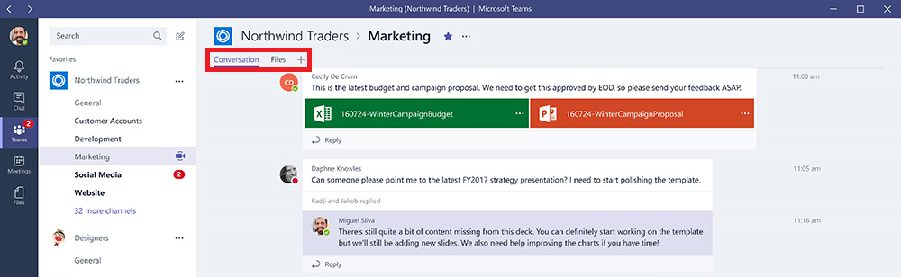

Usar guias internas e personalizadas no Microsoft Teams
==================================================

As guias permitem que os membros da equipe acessem serviços em uma tela exclusiva dentro de um canal. Isso permite que a equipe trabalhe diretamente com as ferramentas e os dados que você forneceu e tenha conversas sobre eles no contexto do canal. Com cada novo canal, duas guias são provisionadas por padrão, conforme listado e mostrado na imagem abaixo:

-   Conversas

-   Arquivos

1.  Os proprietários e membros da equipe podem incluir novas guias em cada canal para ajudar a integrar seus serviços em nuvem.

2.  Os arquivos Excel, PowerPoint, Word e PDF podem ser carregados para a **guia Arquivos** antes de serem convertidos em guias. Como alternativa, todos os arquivos carregados existentes podem ser convertidos em guias com um só clique, conforme mostrado abaixo.

    

3.  Para incluir um site, a URL precisa começar com o **prefixo https** para que todas as informações trocadas permaneçam protegidas.

4.  Serão fornecidas instruções detalhadas quando um membro da equipe tentar adicionar uma guia personalizada em seu canal.

5.  Quando uma guia personalizada é adicionada em um canal, é criada uma **guia de conversa**, que permite que os membros da equipe tenham uma discussão focada sobre o conteúdo.

    

6.  Guias adicionais podem ser adicionadas aos canais para ajudar os usuários a acessar e gerenciar sem dificuldades os dados de que precisam ou interagem mais. Isso pode ser um relatório Power BI, um painel ou mesmo uma [Transmissão Microsoft](https://go.microsoft.com/fwlink/?linkid=855785) de um canal de vídeo em que você publica vídeos de treinamento.

    

Desenvolvimento de guias personalizadas
-------------------

Além das guias internas, as organizações podem facilmente projetar e desenvolver suas próprias guias, que podem ser integradas ao Microsoft Teams ou compartilhadas com o restante da comunidade.

A Microsoft Developer Network oferece [instruções detalhadas](https://go.microsoft.com/fwlink/?linkid=855786) para projetar e construir suas próprias guias, bem como baixar e implantar [guias de exemplo](https://go.microsoft.com/fwlink/?linkid=855787) desenvolvidas pela Microsoft.

