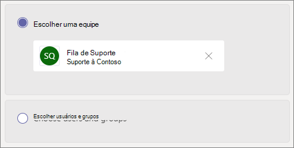

# Criar uma fila de chamada - tutorial de pequenas empresasCreate a call queue - small business tutorial

Filas de chamadas fornecem um método de roteamento de chamadores para pessoas em sua organização que podem ajudar com um determinado problema ou pergunta.Call queues provide a method of routing callers to people in your organization who can help with with a particular issue or question. As chamadas são distribuídas uma por vez para as pessoas na fila (que são conhecidas como *agentes*).Calls are distributed one at a time to the people in the queue (who are known as *agents*). 

As filas de chamada fornecem:Call queues provide:

- Uma mensagem de saudação.A greeting message.

- Música enquanto as pessoas estão em espera em uma fila.Music while people are waiting on hold in a queue.

- Roteamento de chamadas, na ordem *Primeiro a Entrar, Primeiro a Sair* (PEPS), para os agentes.Call routing - in *First In, First Out* (FIFO) order - to agents.

- Opções de administração para estouro da fila e tempo limite.Handling options for queue overflow and timeout.

#### Antes de você começarBefore you begin

Obter algumas [licenças do](../teams-add-on-licensing/virtual-user.md) Sistema de Telefonia - Usuário Virtual se você ainda não as tiver.Get some [Phone System - Virtual User licenses](../teams-add-on-licensing/virtual-user.md) if you don't already have them. Obter uma para cada fila de chamada e o atendimento automático que você planeja configurar.Get one for each call queue and auto attendant that you plan to set up. Essas licenças são gratuitas, portanto, sugerimos obter alguns extras caso você decida fazer alterações em sua instalação no futuro.These licenses are free, so we suggest getting a few extra in case you decide to make changes to your setup in the future.

Como os agentes em uma fila de chamadas podem discar para retornar uma chamada de cliente, considere definir a ID do chamador para seus agentes de chamada para o número de telefone principal ou o número de um atendimento automático apropriado.Since agents in a call queue may dial out to return a customer call, consider setting the caller ID for your call agents to your main phone number or the number of an appropriate auto attendant. Para mais informações, confira [Gerenciar políticas de identificação de chamadas no Microsoft Teams](../caller-id-policies.md).See [Manage caller ID policies in Microsoft Teams](../caller-id-policies.md) for more information.

#### Siga estas etapas para configurar sua fila de chamadaFollow these steps to set up your call queue

# [Etapa 1   Criar uma equipeStep 1 Create a team](#tab/create-team)

Ao criar uma fila de chamada, você pode adicionar usuários individuais à fila ou usar um grupo de segurança existente, grupo do Microsoft 365 ou equipe do Microsoft Teams.When creating a call queue, you can add individual users to the queue, or you can use an existing security group, Microsoft 365 group, or Microsoft Teams team. Recomendamos [o uso de um canal de equipe](https://support.microsoft.com/office/9f07dabe-91c6-4a9b-a545-8ffdddd2504e).We recommend [using a team channel](https://support.microsoft.com/office/9f07dabe-91c6-4a9b-a545-8ffdddd2504e). Isso permite que os membros da fila conversem uns com os outros, compartilhem ideias e criem documentos ou outros recursos para ajudá-los a ajudar seus clientes.This allows members of the queue to chat with each other, share ideas, and create documents or other resources to help them help your customers. Uma equipe também fornece uma caixa de correio de voz para os chamadores deixarem uma mensagem após o horário ou se a fila atingir sua capacidade máxima.A team also provides a voice mailbox for callers to leave a message after hours or if the queue reaches its maximum capacity.

Para criar uma equipeTo create a team

1. Primeiro, clique **em Equipes** no lado esquerdo do aplicativo e clique em Ingressar ou **criar** uma equipe na parte inferior da lista de equipes.First, click **Teams** on the left side of the app, then click **Join or create a team** at the bottom of your teams list.

2. Em **seguida, clique em** Criar equipe (primeiro cartão, canto superior esquerdo).Then click **Create team** (first card, top left corner).

3. Escolha **Criar uma equipe do zero**.Choose **Build a team from scratch**.

4. Em seguida, escolha se deseja uma equipe pública ou privada.Next, choose whether you want a public or private team. Recomendamos **o Private** para sua fila de chamada para evitar que as pessoas se tornem parte da fila involundendo-se à equipe.We recommend **Private** for your call queue to avoid people unintentionally becoming part of the queue by joining the team.

5. Nomeia sua equipe e adicione uma descrição opcional.Name your team and add an optional description.

6. Quando terminar, clique em **Criar**.When you're done, click **Create**.

8. Digite os nomes das pessoas que você deseja ter na fila de chamada e clique em **Adicionar**.Type the names of the people that you want to have in your call queue, and then click **Add**.

9. Clique em **Fechar**.Click **Close**. As pessoas que você adicionar a uma equipe receberão um email para que saibam que agora são membros da sua equipe e que a equipe será acionda na lista de equipes.People you add to a team will receive an email letting them know they are now a member of your team and the team will show up in their teams list.

Em seguida, adicionaremos um canal a ser usado com a fila de chamada.Next, we'll add a channel to use with the call queue.

Para adicionar um canalTo add a channel

1. No Teams, encontre a equipe que você acabou de criar, clique em **Mais opções** (...) e clique em **Adicionar canal**.In Teams, find the team you just created, click **More options** (...), and then click **Add channel**.

2. Digite um nome e uma descrição para o canal e clique em **Adicionar**.Type a name and description for the channel, and then click **Add**.

> [!div class="nextstepaction"]
> [Etapa 2 - Contas de recursos >Step 2 - Resource accounts >](/microsoftteams/business-voice/create-a-phone-system-call-queue-smb?tabs=resource-account#steps)

# [Etapa 2   Contas de recursosStep 2 Resource accounts](#tab/resource-account)

Cada fila de chamada que você criar requer uma conta de recurso.Each call queue that you create requires a resource account. Isso é semelhante a uma conta de usuário, exceto que a conta está associada a um atendimento automático ou fila de chamada em vez de uma pessoa.This is similar to a user account, except the account is associated with an auto attendant or call queue instead of a person. Nesta etapa, criaremos a conta, atribuiremos a ela uma licença do Sistema de Telefonia do *Microsoft 365 - Usuário Virtual* e a usaremos para começar a criar a fila de chamadas.In this step, we'll create the account, assign it a *Microsoft 365 Phone System - Virtual User* license, and then use it to start creating the call queue.

### Criar uma conta de recursoCreate a resource account

Você pode criar uma conta de recurso no centro de administração do Teams.You can create a resource account in the Teams admin center.

1. No centro de administração do Teams, expanda **configurações** em toda a organização e clique em **Contas de recursos.**In the Teams admin center, expand **Org-wide settings**, and then click **Resource accounts**.

2. Clique em **Adicionar**.Click **Add**.

3. No painel **Adicionar conta de** recurso, preencha **Nome** de exibição, Nome de **usuário** e escolha **Fila** de chamada para o tipo de conta **de recurso**.In the **Add resource account** pane, fill out **Display name**, **Username**, and choose **Call queue** for the **Resource account type**.

    

4. Clique em **Salvar**.Click **Save**.

A nova conta aparecerá na lista de contas.The new account will appear in the list of accounts.

### Atribuir uma licençaAssign a license

Você deve atribuir uma licença do Sistema de Telefonia do *Microsoft 365 - Usuário Virtual* à conta de recurso.You must assign a *Microsoft 365 Phone System - Virtual User* license to the resource account.

1. No Centro de administração do Microsoft 365, clique na conta de recurso à qual você deseja atribuir uma licença.In the Microsoft 365 admin center, click the resource account to which you want to assign a license.

2. Na guia **Licenças e Aplicativos,** em **Licenças,** selecione Sistema de Telefonia do **Microsoft 365 - Usuário Virtual**.On the **Licenses and Apps** tab, under **Licenses**, select **Microsoft 365 Phone System - Virtual User**.

3. Clique **em Salvar alterações**.Click **Save changes**.

    

### Criar uma fila de chamadasCreate a call queue

Em seguida, vamos começar a criar uma nova fila de chamada e atribuir a conta de recurso.Next, we'll start creating a new call queue and assign the resource account.

1. No centro de administração do Teams, **expanda Voz,** clique em **Filas de chamadas** e clique em **Adicionar**.In the Teams admin center, expand **Voice**, click **Call queues**, and then click **Add**.

1. Digite um nome para a fila de chamadas.Type a name for the call queue. Os agentes verão esse nome ao receberem uma chamada da fila.Agents will see this name when they receive an incoming call from the queue.

2. Clique em **Adicionar contas**, procure a conta de recurso que você deseja usar com a fila de chamadas, clique em **Adicionar** e, em seguida, clique em **Adicionar**.Click **Add accounts**, search for the resource account that you want to use with this call queue, click **Add**, and then click **Add**.

3. Escolha um idioma.Choose a language. Esse idioma será usado para comandos de voz gerados pelo sistema e para a transcrição da caixa postal (se habilitados).This language will be used for system-generated voice prompts and voicemail transcription (if you enable them).

    

4. Especifique se você deseja reproduzir uma saudação aos chamadores quando eles chegarem na fila.Specify if you want to play a greeting to callers when they arrive in the queue. Carregue um arquivo MP3, WAV ou WMA contendo a saudação que deseja reproduzir.You must upload an MP3, WAV, or WMA file containing the greeting that you want to play.

5. O Teams fornece música padrão aos chamadores enquanto eles estão em espera em uma fila.Teams provides default music to callers while they are on hold in a queue. Se você quiser reproduzir um arquivo de áudio específico, escolha **Reproduzir um arquivo de áudio** e carregue um arquivo MP3, WAV ou WMA.If you want to play a specific audio file, choose **Play an audio file** and upload an MP3, WAV, or WMA file.

> [!NOTE]
> A gravação carregada não pode ser maior do que 5 MB.The uploaded recording can be no larger than 5 MB.
> A música padrão fornecida nas filas de chamadas do Teams é livre de royalties pagáveis pela organização.The default music supplied in Teams call queues is free of any royalties payable by your organization. 

> [!div class="nextstepaction"]
> [Etapa 3 - Agentes de chamada >Step 3 - Call agents >](/microsoftteams/business-voice/create-a-phone-system-call-queue-smb?tabs=call-agents#steps)

# [Etapa 3   Agentes de chamadaStep 3 Call agents](#tab/call-agents)

Para adicionar agentes à fila de chamada, vamos adicioná-los à equipe e ao canal que criamos anteriormente.To add agents to the call queue, we'll add them to the team and channel that we created earlier.

1. Selecione a **opção Escolher uma equipe** e clique em Adicionar um **canal**.Select the **Choose a team** option and click **Add a channel**.
2. Digite o nome da equipe que você criou, selecione-a e clique em **Adicionar**.Type the name of the team that you created, select it, and click **Add**.
3. Selecione o canal que você criou para a fila.Select the channel that you created for the queue.
3. Clique em **Aplicar**.Click **Apply**.

    

> [!NOTE]
> Quando novos usuários são adicionados à equipe, pode levar até oito horas para a primeira chamada chegar.When new users are added to the team, it can take up to eight hours for their first call to arrive.

> [!div class="nextstepaction"]
> [Etapa 4 - Contas de recursos >Step 4 - Resource accounts >](/microsoftteams/business-voice/create-a-phone-system-call-queue-smb?tabs=call-routing#steps)

# [Etapa 4   Roteamento de ChamadasStep 4 Call routing](#tab/call-routing)

Escolha o método de roteamento de chamadas que você deseja usar.Choose the call routing method that you want to use.

1. Definir **o modo de conferência** como **Automático**.Set **Conference mode** to **Auto**.

2. Escolha o **método routing** que você deseja usar.Choose the **Routing method** you want to use. Isso determina a ordem na qual os agentes recebem chamadas da fila.This determines the order in which agents receive calls from the queue. Recomendamos **roteamento serial** ou  **round robin**.We recommend **Serial routing** or  **Round robin**. Escolha uma destas opções:Choose from these options:

    - O **Roteamento de atendedor** chama todos os agentes na fila ao mesmo tempo.**Attendant routing** rings all agents in the queue at the same time. O primeiro agente de chamada que atender recebe a chamada.The first call agent to pick up the call gets the call.

    - **O roteamento** serial toca todos os agentes de chamada um por um.**Serial routing** rings all call agents one by one. Se um agente ignora ou não atende uma chamada, ela tocará para o próximo agente e tentará com todos os agentes até que seja atendida ou atinja o tempo limite.If an agent dismisses or does not pick up a call, the call will ring the next agent and will try all agents until it is picked up or times out.

    - O **Round robin** equilibra o roteamento das chamadas de entrada para que cada agente de chamada receba o mesmo número de chamadas da fila.**Round robin** balances the routing of incoming calls so that each call agent gets the same number of calls from the queue. Isso pode ser desejável em um ambiente de vendas de entrada para garantir igualdade de oportunidades entre todos os agentes de chamada.This may be desirable in an inbound sales environment to assure equal opportunity among all the call agents.

    - O **Ocioso por mais tempo** encaminha cada chamada para o agente que está ocioso há mais tempo.**Longest idle** routes each call to the agent who has been idle the longest time. (Agentes cujo estado de presença foi afastado por mais de 10 minutos não estão incluídos.)(Agents whose presence state has been Away for more than 10 minutes are not included.)

    

3. Ativar **o roteamento baseado em** presença.Turn **Presence-based routing** on. Isso encaminha chamadas para agentes cujo status de presença **está Disponível**.This routes calls to agents whose presence status is **Available**.

4. Escolha se deseja permitir que os agentes optem por não fazer chamadas.Choose if you want to allow agents to opt out of calls.

5. De definir **um tempo de alerta do** Agente para especificar por quanto tempo o telefone de um agente tocará antes que a fila redirecione a chamada para o próximo agente.Set an **Agent alert time** to specify how long an agent's phone will ring before the queue redirects the call to the next agent.

    

> [!div class="nextstepaction"]
> [Etapa 5 - Estouro de chamada >Step 5 - Call overflow >](/microsoftteams/business-voice/create-a-phone-system-call-queue-smb?tabs=call-overflow#steps)

# [Etapa 5   Estouro de chamadaStep 5 Call overflow](#tab/call-overflow)

Escolha como você deseja lidar com chamadas que excedem o máximo na fila.Choose how you want to handle calls that exceed the maximum in the queue.

1. De definir **as chamadas Máximas na fila**.Set the **Maximum calls in the queue**.

2. Escolha o que você deseja fazer quando o número máximo de chamadas for atingido.Choose what you want to do when the maximum number of calls is reached. Você pode desconectar a chamada ou redirecioná-la.You can disconnect the call or redirect it. Recomendamos redirecionar a chamada para um dos seguintes destinos:We recommend that you redirect the call to one of the following destinations:
    - **Pessoa na organização** - uma pessoa em sua organização que é capaz de receber chamadas de voz**Person in the organization** - a person in your organization who is able to receive voice calls
    - **Aplicativo de voz** - um atendimento automático ou outra fila de chamadas.**Voice app** - an auto attendant or another call queue. (Escolha a conta de recurso associada ao atendimento automático ou fila de chamada ao escolher esse destino.)(Choose the resource account associated with the auto attendant or call queue when choosing this destination.)
    - **Número de telefone externo** - qualquer número de telefone.**External phone number** - any phone number. Use este formato: +[código do país][código de área][número de telefone]Use this format: +[country code][area code][phone number]
    - **Caixa** postal - você pode usar a caixa de correio de voz da equipe que você criou.**Voicemail** - you can use the voice mailbox of the team that you created.

    

> [!div class="nextstepaction"]
> [Etapa 6 - Tempo de >Step 6 - Call timeout >](/microsoftteams/business-voice/create-a-phone-system-call-queue-smb?tabs=call-timeout#steps)

# [Etapa 6   Tempo de tempo de chamadaStep 6 Call timeout](#tab/call-timeout)

Escolha o que você deseja que aconteça quando as chamadas estão esperando na fila por muito tempo.Choose what you want to happen when calls have been waiting in the queue for too long.

1. Definir o **Tempo limite de chamada: tempo máximo de espera**.Set the **Call Timeout: maximum wait time**.

2. Escolha o que você deseja fazer quando uma chamada chegar ao tempo de saída. Você pode desconectar a chamada ou redirecioná-la.Choose what you want to do when a call times out. You can disconnect the call or redirect it. Recomendamos redirecionar a chamada para um dos seguintes destinos:We recommend that you redirect the call to one of the following destinations:
    - **Pessoa na organização** - uma pessoa em sua organização que é capaz de receber chamadas de voz**Person in the organization** - a person in your organization who is able to receive voice calls
    - **Aplicativo de voz** - um atendimento automático ou outra fila de chamadas.**Voice app** - an auto attendant or another call queue. (Escolha a conta de recurso associada ao atendimento automático ou fila de chamada ao escolher esse destino.)(Choose the resource account associated with the auto attendant or call queue when choosing this destination.)
    - **Número de telefone externo** - qualquer número de telefone.**External phone number** - any phone number. Use este formato: +[código do país][código de área][número de telefone]Use this format: +[country code][area code][phone number]
    - **Caixa** postal - você pode usar a caixa de correio de voz da equipe que você criou.**Voicemail** - you can use the voice mailbox of the team that you created.

    

3. Clique em **Salvar**.Click **Save**.

Isso conclui a instalação da fila de chamada.This completes the setup of your call queue. Em seguida, talvez você [queira configurar um atendimento automático.](create-a-phone-system-auto-attendant-smb.md)Next, you may want to [set up an auto attendant](create-a-phone-system-auto-attendant-smb.md).

---

