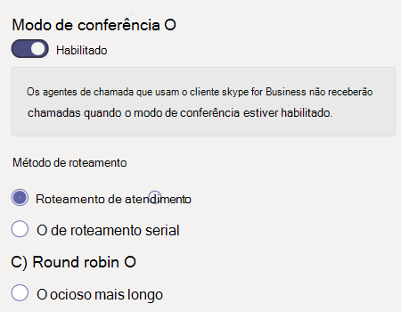

# Criar uma fila de chamada – tutorial para pequenas empresas

As filas de chamadas fornecem um método de roteamento de chamadores para pessoas em sua organização que podem ajudar com um problema ou pergunta específico. As chamadas são distribuídas uma por vez para as pessoas na fila (que são conhecidas como *agentes).* 

As filas de chamada fornecem:

- Uma mensagem de saudação.

- Música enquanto as pessoas estão aguardando em espera em uma fila.

- Roteamento de chamadas *- na ordem First In, First Out* (FIFO) - para agentes.

- Opções de manipulação para excesso de fila e tempo de tempo.

#### Antes de você começar

Obter algumas [licenças do Sistema de Telefonia – Usuário Virtual,](../teams-add-on-licensing/virtual-user.md) caso ainda não as tenha. Obter uma para cada fila de chamada e o atendimento automático que você planeja configurar. Essas licenças são gratuitas, portanto, sugerimos receber algumas extra caso você decida fazer alterações na configuração no futuro.

Como os agentes em uma fila de chamadas podem discar para retornar uma chamada de cliente, considere configurar a ID de chamadas para seus agentes de chamada para seu número de telefone principal ou o número de um atender automático apropriado. Consulte [Gerenciar políticas de ID de chamada no Microsoft Teams](../caller-id-policies.md) para obter mais informações.

#### Siga estas etapas para configurar sua fila de chamada

# [Etapa 1   Criar uma equipe](#tab/create-team)

Ao criar uma fila de chamada, você pode adicionar usuários individuais à fila ou usar um grupo de segurança existente, grupo do Microsoft 365 ou equipe do Microsoft Teams. Recomendamos usar uma equipe. Isso permite que os membros da fila conversem entre si, compartilhem ideias e criem documentos ou outros recursos para ajudá-los a ajudar seus clientes. Uma equipe também fornece uma caixa de correio de voz para que os chamadores deixem uma mensagem após o expediente ou se a fila atingir sua capacidade máxima.

Para criar uma equipe

1. Primeiro, clique **em Equipes** no lado  esquerdo do aplicativo e, em seguida, clique em Ingressar ou criar uma equipe na parte inferior da sua lista de equipes.

2. Em **seguida, clique em Criar** equipe (primeiro cartão, canto superior esquerdo).

3. Escolha **Criar uma equipe do zero.**

4. Em seguida, escolha se deseja uma equipe pública ou privada. Recomendamos **o Private** para sua fila de chamada para evitar que as pessoas se tornem parte da fila involundendo-se na equipe.

5. Nomeia sua equipe e adicione uma descrição opcional.

6. Quando terminar, clique em **Criar.**

8. Digite os nomes das pessoas que você deseja ter na fila de chamada e clique em **Adicionar.**

9. Clique em **Fechar**. As pessoas que você adicionar a uma equipe receberão um email para que saibam que agora são membros da sua equipe e que a equipe será a mesma na lista de equipes.

> [!div class="nextstepaction"]
> [Etapa 2 - Contas de recursos >](https://review.docs.microsoft.com/microsoftteams/business-voice/create-a-phone-system-call-queue-smb?branch=mikeplum-smb-voice&tabs=resource-account#steps)

# [Etapa 2   Contas de recursos](#tab/resource-account)

Cada fila de chamada que você criar requer uma conta de recurso. Isso é semelhante a uma conta de usuário, exceto que a conta está associada a um atendimento automático ou fila de chamada em vez de uma pessoa. Nesta etapa, criaremos a conta, atribuiremos a ela uma licença do *Microsoft 365 Phone System – Usuário Virtual* e a usaremos para começar a criar a fila de chamadas.

### Criar uma conta de recurso

Você pode criar uma conta de recurso no Centro de administração do Teams.

1. No Centro de administração do Teams, expanda **as configurações de** toda a organização e clique em **Contas de recursos.**

2. Clique em **Adicionar**.

3. No painel **Adicionar conta de recurso,** preencha **o nome** de exibição, nome de usuário e escolha **Fila** de chamada para o tipo de conta **recurso.** 

    

4. Clique em **Salvar**.

A nova conta aparecerá na lista de contas.

### Atribuir uma licença

Você deve atribuir uma *licença do Microsoft 365 Phone System – Usuário Virtual* à conta de recurso.

1. No Centro de administração do Microsoft 365, clique na conta de recurso à qual você deseja atribuir uma licença.

2. Na guia **Licenças e Aplicativos,** em **Licenças,** selecione **Microsoft 365 Phone System - Usuário Virtual.**

3. Clique **em Salvar alterações.**

    

### Criar uma fila de chamadas

Em seguida, vamos começar a criar uma nova fila de chamada e atribuir a conta de recurso.

1. No Centro de administração do Teams, **expanda o Voice,** clique em **Filas de chamadas** e, em seguida, clique em **Adicionar.**

1. Digite um nome para a fila de chamada. Os agentes verão esse nome quando receberem uma chamada recebida da fila.

2. Clique **em Adicionar contas,** procure a conta de recurso que você deseja usar com essa fila de chamada, clique em Adicionar **e,** em seguida, clique em **Adicionar.**

3. Escolha um idioma. Esse idioma será usado para avisos de voz gerados pelo sistema e transcrição da caixa postal (se você habilita-los).

    

4. Especifique se você deseja reproduzir uma saudação para os chamadores quando eles chegam na fila. Você deve carregar um arquivo MP3, WAV ou WMA contendo a saudação que deseja reproduzir.

5. O Teams fornece músicas padrão para os chamadores enquanto eles estão em espera em uma fila. Se você quiser reproduzir um arquivo de áudio específico, escolha **Reproduzir** um arquivo de áudio e carregue um arquivo MP3, WAV ou WMA.

> [!NOTE]
> A gravação carregada não pode ter mais de 5 MB.
> A música padrão fornecida nas filas de chamada do Teams está livre de royalties a pagar pela sua organização. 

> [!div class="nextstepaction"]
> [Etapa 3 - Agentes de chamada >](https://review.docs.microsoft.com/microsoftteams/business-voice/create-a-phone-system-call-queue-smb?branch=mikeplum-smb-voice&tabs=call-agents#steps)

# [Etapa 3   Agentes de chamada](#tab/call-agents)

Para adicionar agentes à fila de chamada, adicionaremos a equipe que criamos anteriormente.

1. Clique **em Adicionar grupos.**
2. Digite o nome da equipe que você criou.
3. Clique **em Adicionar** e, em seguida, clique em **Adicionar.**

    

Você pode adicionar até 20 agentes individualmente e até 200 agentes por meio de grupos ou equipes.

> [!NOTE]
> Quando novos usuários são adicionados à equipe, pode levar até oito horas para que a primeira chamada chegue.

> [!div class="nextstepaction"]
> [Etapa 4 - Contas de recursos >](https://review.docs.microsoft.com/microsoftteams/business-voice/create-a-phone-system-call-queue-smb?branch=mikeplum-smb-voice&tabs=call-routing#steps)

# [Etapa 4   Roteamento de chamadas](#tab/call-routing)

Escolha o método de roteamento de chamadas que você deseja usar.

1. Definir **o modo de conferência** como **Automático.**

2. Escolha o **método de roteamento** que você deseja usar. Isso determina a ordem em que os agentes recebem chamadas da fila. Recomendamos **roteamento em série** ou Round **robin.** Escolha uma destas opções:

    - **O roteamento** do attendant toca em todos os agentes na fila ao mesmo tempo. O primeiro agente de chamada a atender a chamada recebe a chamada.

    - **O roteamento** de série toca em todos os agentes de chamada, um por um. Se um agente descartar ou não atender uma chamada, a chamada tocará no próximo agente e tentará todos os agentes até que ela seja escolhida ou a qualquer momento.

    - **A round robin** equilibra o roteamento de chamadas de entrada para que cada agente de chamada obtém o mesmo número de chamadas da fila. Isso pode ser desejável em um ambiente de vendas de entrada para garantir a oportunidade igual entre todos os agentes de chamada.

    - **O tempo ocioso** mais longo encaminha cada chamada para o agente que ficou ocioso por mais tempo. (Os agentes cujo estado de presença está fora por mais de 10 minutos não são incluídos.)

    

3. Ativar **o roteamento baseado em** presença. Isso faz chamadas para agentes cujo status de presença **está Disponível.**

4. Escolha se você deseja permitir que os agentes optem por não fazer chamadas.

5. De definir **um horário de alerta** do Agente para especificar por quanto tempo o telefone de um agente tocará antes que a fila redirecione a chamada para o próximo agente.

    

> [!div class="nextstepaction"]
> [Etapa 5 - Chamada excedente >](https://review.docs.microsoft.com/microsoftteams/business-voice/create-a-phone-system-call-queue-smb?branch=mikeplum-smb-voice&tabs=call-overflow#steps)

# [Etapa 5   Estouro de chamada](#tab/call-overflow)

Escolha como você deseja lidar com chamadas que excedem o máximo na fila.

1. De definir **o número máximo de chamadas na fila.**

2. Escolha o que você deseja fazer quando o número máximo de chamadas for atingido. Você pode desconectar a chamada ou redirecioná-la. Recomendamos que você redirecione a chamada para um dos seguintes destinos:
    - **Pessoa na organização** - uma pessoa em sua organização que pode receber chamadas de voz
    - **Aplicativo de voz** – um atendimento automático ou outra fila de chamadas. (Escolha a conta de recurso associada ao atendimento automático ou fila de chamada ao escolher este destino.)
    - **Número de telefone externo** – qualquer número de telefone. Use este formato: +[código do país][código de área][número de telefone]
    - **Caixa** postal : você pode usar a caixa de correio de voz da equipe que você criou.

    

> [!div class="nextstepaction"]
> [Etapa 6 - Tempo de tempo de >](https://review.docs.microsoft.com/microsoftteams/business-voice/create-a-phone-system-call-queue-smb?branch=mikeplum-smb-voice&tabs=call-timeout#steps)

# [Etapa 6   Tempo de tempo de chamada](#tab/call-timeout)

Escolha o que você deseja que aconteça quando as chamadas estão aguardando muito tempo na fila.

1. Definir o **Tempo Limite da Chamada: tempo máximo de espera.**

2. Escolha o que você deseja fazer quando uma chamada estiver com o tempo de saída. Você pode desconectar a chamada ou redirecioná-la. Recomendamos que você redirecione a chamada para um dos seguintes destinos:
    - **Pessoa na organização** - uma pessoa em sua organização que pode receber chamadas de voz
    - **Aplicativo de voz** – um atendimento automático ou outra fila de chamadas. (Escolha a conta de recurso associada ao atendimento automático ou fila de chamada ao escolher este destino.)
    - **Número de telefone externo** – qualquer número de telefone. Use este formato: +[código do país][código de área][número de telefone]
    - **Caixa** postal : você pode usar a caixa de correio de voz da equipe que você criou.

    

3. Clique em **Salvar**.

Isso conclui a configuração da fila de chamada. Em seguida, talvez você queira [configurar um assistente automático.](create-a-phone-system-auto-attendant-smb.md)

---

