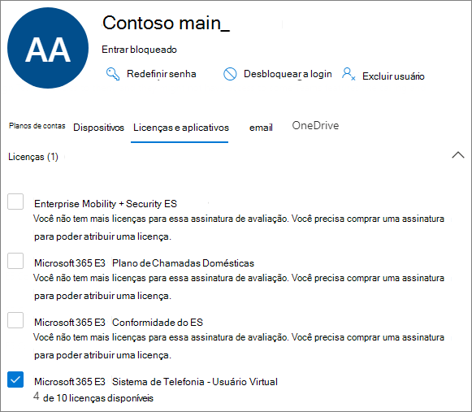

# Criar uma fila de chamadas-tutorial para empresas de pequeno porte

As filas de chamadas fornecem um método de roteamento de chamadores para as pessoas em sua organização que podem ajudá-lo com um problema ou uma pergunta específica. As chamadas são distribuídas uma de cada vez para as pessoas na fila (que são conhecidas como *agentes*). 

As filas de chamadas fornecem:

- Uma mensagem de saudação.

- Música enquanto as pessoas estão aguardando em espera em uma fila.

- Roteamento de chamadas em *primeiro lugar, em primeiro lugar* (FIFO) para agentes.

- Opções de manipulação para estouro de fila e tempo limite.

#### Antes de você começar

Obtenha alguns [sistemas de telefonia-licenças de usuário virtual](../teams-add-on-licensing/virtual-user.md) se você ainda não tiver os mesmos. Obtenha um para cada fila de chamadas e atendedor automático que você planeja configurar. Essas licenças são gratuitas, portanto, sugerimos que você tenha alguns recursos adicionais para que você decida fazer alterações na sua configuração no futuro.

Como os agentes em uma fila de chamadas podem discar para devolver uma chamada de cliente, considere definir a identificação de chamadas para seus agentes de chamadas para o número de telefone principal ou o número de um atendedor automático apropriado. Consulte [gerenciar políticas de identificação de chamadas no Microsoft Teams](../caller-id-policies.md) para obter mais informações.

#### Siga estas etapas para configurar sua fila de chamadas

# [Etapa 1   criar uma equipe](#tab/create-team)

Ao criar uma fila de chamadas, você pode adicionar usuários individuais à fila ou usar um grupo de segurança existente, o grupo do Microsoft 365 ou a equipe do Microsoft Teams. Recomendamos o uso de uma equipe. Isso permite que os membros da fila conversem uns com os outros, Compartilhe ideias e criem documentos ou outros recursos para ajudá-los a ajudar seus clientes. Uma equipe também fornece uma caixa de correio de voz para os chamadores deixarem uma mensagem após o expediente ou se a fila atingir sua capacidade máxima.

Para criar uma equipe

1. Primeiro, clique em **equipes** no lado esquerdo do aplicativo e, em seguida, clique em **ingressar ou criar uma equipe** na parte inferior da sua lista de equipes.

2. Em seguida, clique em **criar equipe** (primeiro cartão, canto superior esquerdo).

3. Escolha **criar uma equipe a partir do zero**.

4. Em seguida, escolha se você deseja uma equipe pública ou particular. Recomendamos **particular** para a sua fila de chamadas para evitar que pessoas se tornem não intencionalmente parte da fila ingressando na equipe.

5. Nomeie sua equipe e adicione uma descrição opcional.

6. Quando tiver terminado, clique em **criar**.

8. Digite os nomes das pessoas que você deseja ter na fila de chamadas e, em seguida, clique em **Adicionar**.

9. Clique em **Fechar**. As pessoas que você adicionar a uma equipe receberão um email informando que eles são membros da sua equipe e a equipe será exibida na lista de equipes deles.

> [!div class="nextstepaction"]
> [Etapa 2-contas de recursos >](https://review.docs.microsoft.com/microsoftteams/business-voice/create-a-phone-system-call-queue-smb?branch=mikeplum-smb-voice&tabs=resource-account#steps)

# [Etapa 2   contas de recursos](#tab/resource-account)

Cada fila de chamadas que você cria requer uma conta de recurso. Isso é semelhante a uma conta de usuário, exceto que a conta é associada a um atendedor automático ou fila de chamada em vez de uma pessoa. Nesta etapa, criaremos a conta, atribuímos a ela um *sistema telefônico Microsoft 365-licença de usuário virtual* e, em seguida, use-a para começar a criar a fila de chamadas.

### Criar uma conta de recurso

Você pode criar uma conta de recurso no centro de administração do Microsoft Teams.

1. No centro de administração do Teams, expanda **configurações de toda a organização** e clique em **contas de recursos**.

2. Clique em **Adicionar**.

3. No painel **adicionar conta do recurso** , preencha o **nome para exibição**, o nome de **usuário** e escolha **fila de chamadas** para o tipo de **conta do recurso**.

    

4. Clique em **Salvar**.

A nova conta será exibida na lista de contas.

### Atribuir uma licença

Você deve atribuir um *sistema telefônico Microsoft 365-licença de usuário virtual* para a conta do recurso.

1. No centro de administração do Microsoft 365, clique na conta de recurso à qual você deseja atribuir uma licença.

2. Na guia **licenças e aplicativos** , em **licenças**, selecione **sistema telefônico Microsoft 365-usuário virtual**.

3. Clique em **salvar alterações**.

    

### Criar uma fila de chamadas

Em seguida, vamos começar a criar uma nova fila de chamadas e atribuir a conta do recurso.

1. No centro de administração do Teams, expanda **voz**, clique em **filas de chamadas** e, em seguida, clique em **Adicionar**.

1. Digite um nome para a fila de chamadas. Os agentes verão esse nome quando receberem uma chamada de entrada da fila.

2. Clique em **Adicionar contas**, procure a conta de recurso que você deseja usar com esta fila de chamadas, clique em **Adicionar** e, em seguida, clique em **Adicionar**.

3. Escolha um idioma. Esse idioma será usado para solicitações de voz geradas pelo sistema e para a transcrição de correio de voz (se você habilitá-las).

    

4. Especifique se deseja reproduzir uma saudação para os chamadores quando chegarem na fila. Você deve carregar um arquivo MP3, WAV ou WMA contendo a saudação que deseja reproduzir.

5. O Teams oferece música padrão para chamadores enquanto estiverem em espera em uma fila. Se você quiser executar um arquivo de áudio específico, escolha **executar um arquivo de áudio** e carregar um arquivo MP3, WAV ou WMA.

> [!NOTE]
> A gravação carregada não pode ter mais de 5 MB.
> A música padrão fornecida nas filas de chamadas do teams é de graça dos royalties pagos por sua organização. 

> [!div class="nextstepaction"]
> [Etapa 3-agentes de chamada >](https://review.docs.microsoft.com/microsoftteams/business-voice/create-a-phone-system-call-queue-smb?branch=mikeplum-smb-voice&tabs=call-agents#steps)

# [Etapa 3   agentes de chamada](#tab/call-agents)

Para adicionar agentes à fila de chamadas, adicionaremos a equipe que criamos anteriormente.

1. Clique em **Adicionar grupos**.
2. Digite o nome da equipe que você criou.
3. Clique em **Adicionar** e, em seguida, clique em **Adicionar**.

    

Você pode adicionar até 20 agentes individualmente e até 200 agentes via grupos ou equipes.

> [!NOTE]
> Quando novos usuários são adicionados à equipe, pode levar até oito horas para que a primeira chamada seja recebida.

> [!div class="nextstepaction"]
> [Etapa 4-contas de recursos >](https://review.docs.microsoft.com/microsoftteams/business-voice/create-a-phone-system-call-queue-smb?branch=mikeplum-smb-voice&tabs=call-routing#steps)

# [Etapa 4   encaminhamento de chamadas](#tab/call-routing)

Escolha o método de roteamento de chamadas que você deseja usar.

1. Definir o **modo de conferência** como **automático**.

2. Escolha o **método de roteamento** que você deseja usar. Isso determina a ordem em que os agentes recebem chamadas da fila. Recomendamos **Roteamento serial** ou  **Round Robin**. Escolha uma destas opções:

    - O **Roteamento do atendente** toca todos os agentes na fila ao mesmo tempo. O primeiro agente de chamadas para atender a chamada recebe a chamada.

    - O **Roteamento serial** toca todos os agentes de chamada um por um. Se um agente ignorar ou não atender a chamada, a chamada tocará no próximo agente e experimentará todos os agentes até que ele seja retirado ou expirado.

    - A **repetição redonda** equilibra o roteamento de chamadas de entrada para que cada agente de chamadas obtenha o mesmo número de chamadas da fila. Isso pode ser desejável em um ambiente de vendas de entrada para garantir uma oportunidade igual entre todos os agentes de chamadas.

    - O mais **longo** é direcionado a cada chamada para o agente que esteve ocioso ao longo do tempo mais longo. (Os agentes cujo estado de presença esteve ausente há mais de 10 minutos não são incluídos.)

    

3. Ative o **roteamento baseado em presença** . Isso roteia chamadas para agentes cujo status de presença está **disponível**.

4. Escolha se deseja permitir que os agentes recusem as chamadas.

5. Defina um **tempo de alerta do agente** para especificar por quanto tempo o telefone do agente tocará antes de a fila redirecionar a chamada para o próximo agente.

    

> [!div class="nextstepaction"]
> [Etapa 5-estouro na chamada >](https://review.docs.microsoft.com/microsoftteams/business-voice/create-a-phone-system-call-queue-smb?branch=mikeplum-smb-voice&tabs=call-overflow#steps)

# [Etapa 5   estouro de chamada](#tab/call-overflow)

Escolha como você deseja manipular as chamadas que excederam o máximo na fila.

1. Defina o **número máximo de chamadas na fila**.

2. Escolha o que você deseja fazer quando o número máximo de chamadas for atingido. Você pode desconectar a chamada ou redirecioná-la. Recomendamos que você redirecione a chamada para um dos seguintes destinos:
    - **Pessoa na organização** -uma pessoa em sua organização que pode receber chamadas de voz
    - **Aplicativo de voz** -um atendedor automático ou outra fila de chamadas. (Escolha a conta de recurso associada ao atendedor automático ou à fila de chamadas ao escolher este destino.)
    - **Número de telefone externo** – qualquer número de telefone. Use este formato: + [código do país] [código de área] [número de telefone]
    - Correio de **voz** -você pode usar a caixa de correio de voz da equipe que você criou.

    

> [!div class="nextstepaction"]
> [Etapa 6-tempo limite de chamada >](https://review.docs.microsoft.com/microsoftteams/business-voice/create-a-phone-system-call-queue-smb?branch=mikeplum-smb-voice&tabs=call-timeout#steps)

# [Etapa 6   tempo limite de chamada](#tab/call-timeout)

Escolha o que você deseja que aconteça quando as chamadas estiverem aguardando na fila por muito tempo.

1. Definir o tempo **limite de chamada: tempo máximo de espera**.

2. Escolha o que você deseja fazer quando uma chamada expira. Você pode desconectar a chamada ou redirecioná-la. Recomendamos que você redirecione a chamada para um dos seguintes destinos:
    - **Pessoa na organização** -uma pessoa em sua organização que pode receber chamadas de voz
    - **Aplicativo de voz** -um atendedor automático ou outra fila de chamadas. (Escolha a conta de recurso associada ao atendedor automático ou à fila de chamadas ao escolher este destino.)
    - **Número de telefone externo** – qualquer número de telefone. Use este formato: + [código do país] [código de área] [número de telefone]
    - Correio de **voz** -você pode usar a caixa de correio de voz da equipe que você criou.

    

3. Clique em **Salvar**.

Isso conclui a configuração da fila de chamadas. Em seguida, talvez você queira [configurar um atendedor automático](create-a-phone-system-auto-attendant-smb.md).

---

