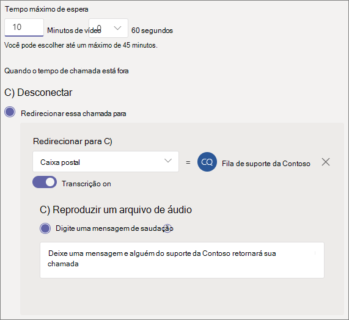

# Criar uma fila de chamada - tutorial de pequenas empresas

As filas de chamadas fornecem um método de roteamento de chamadas para as pessoas da organização que podem ajudar com um problema ou pergunta específica. As chamadas são distribuídas uma por vez para as pessoas na fila (que são conhecidas como *agentes*). 

As filas de chamada fornecem:

- Uma mensagem de saudação.

- Música enquanto as pessoas estão em espera em uma fila.

- Roteamento de chamadas, na ordem *Primeiro a Entrar, Primeiro a Sair* (PEPS), para os agentes.

- Opções de administração para estouro da fila e tempo limite.

#### Demonstração de vídeo

Este vídeo demonstra como criar uma fila de chamada em Teams.

> [!VIDEO https://www.microsoft.com/videoplayer/embed/RWCF23?autoplay=false]

#### Antes de você começar

Obter algumas [Sistema de Telefonia - Licenças](../teams-add-on-licensing/virtual-user.md) de usuário virtual se você ainda não as tiver. Obter uma para cada fila de chamada e o atendimento automático que você planeja configurar. Essas licenças são gratuitas, portanto, sugerimos obter alguns extras caso você decida fazer alterações em sua instalação no futuro.

Como os agentes em uma fila de chamadas podem discar para retornar uma chamada de cliente, considere definir a ID do chamador para seus agentes de chamada para o número de telefone principal ou o número de um atendimento automático apropriado. Para mais informações, confira [Gerenciar políticas de identificação de chamadas no Microsoft Teams](../caller-id-policies.md).

#### Siga estas etapas para configurar sua fila de chamada

# [Etapa 1   Criar uma equipe](#tab/create-team)

Ao criar uma fila de chamada, você pode adicionar usuários individuais à fila ou usar um grupo de segurança existente, Microsoft 365 grupo ou Microsoft Teams equipe. Recomendamos [o uso de um canal de equipe](https://support.microsoft.com/office/9f07dabe-91c6-4a9b-a545-8ffdddd2504e). Isso permite que os membros da fila conversem uns com os outros, compartilhem ideias e criem documentos ou outros recursos para ajudá-los a ajudar seus clientes. Uma equipe também fornece uma caixa de correio de voz para os chamadores deixarem uma mensagem após o horário ou se a fila atingir sua capacidade máxima.

Para criar uma equipe

1. Primeiro, clique **Teams** lado esquerdo do aplicativo e  clique em Ingressar ou criar uma equipe na parte inferior da lista de equipes.

2. Em **seguida, clique em** Criar equipe (primeiro cartão, canto superior esquerdo).

3. Escolha **Criar uma equipe do zero**.

4. Em seguida, escolha se deseja uma equipe pública ou privada. Recomendamos **o Private** para sua fila de chamada para evitar que as pessoas se tornem parte da fila involundendo-se à equipe.

5. Nomeia sua equipe e adicione uma descrição opcional.

6. Quando terminar, clique em **Criar**.

8. Digite os nomes das pessoas que você deseja ter na fila de chamada e clique em **Adicionar**.

9. Clique em **Fechar**. As pessoas que você adicionar a uma equipe receberão um email para que saibam que agora são membros da sua equipe e que a equipe será acionda na lista de equipes.

Em seguida, adicionaremos um canal a ser usado com a fila de chamada.

Para adicionar um canal

1. Em Teams, encontre a equipe que você acabou de criar, clique em **Mais opções** (...) e clique em **Adicionar canal**.

2. Digite um nome e uma descrição para o canal.

3. Em **Privacidade**, escolha **Padrão - Acessível a todos na equipe** e clique em **Adicionar**.

> [!div class="nextstepaction"]
> [Etapa 2 - Contas de recursos >](/microsoftteams/business-voice/create-a-phone-system-call-queue-smb?tabs=resource-account#steps)

# [Etapa 2   Contas de recursos](#tab/resource-account)

Cada fila de chamada que você criar requer uma conta de recurso. Isso é semelhante a uma conta de usuário, exceto que a conta está associada a um atendimento automático ou fila de chamada em vez de uma pessoa. Nesta etapa, criaremos a conta, atribuiremos uma Microsoft 365 Sistema de Telefonia *- Licença* de usuário virtual e a usaremos para começar a criar a fila de chamada.

### Criar uma conta de recurso

Você pode criar uma conta de recurso no Teams de administração.

1. No centro Teams de administração, expanda **as** configurações de toda a organização e clique em **Contas de recursos.**

2. Clique em **Adicionar**.

3. No painel **Adicionar conta de** recurso, preencha **Nome** de exibição, Nome de **usuário** e escolha **Fila** de chamada para o tipo de conta **de recurso**. Os agentes verão o nome de exibição quando receberem uma chamada de entrada da fila.

    

4. Clique em **Salvar**.

   A nova conta aparecerá na lista de contas.

   

### Atribuir uma licença

Você deve atribuir uma *Microsoft 365 Sistema de Telefonia - Licença de usuário virtual* à conta de recurso.

1. Na Centro de administração do Microsoft 365, na **lista** Usuários ativos, clique na conta de recurso à qual você deseja atribuir uma licença.

2. Na guia **Licenças e Aplicativos,** em **Licenças,** selecione **Microsoft 365 Sistema de Telefonia - Usuário Virtual**.

3. Clique em **Salvar alterações**.

    

### Criar uma fila de chamadas

Em seguida, vamos começar a criar uma nova fila de chamada e atribuir a conta de recurso.

1. No centro Teams de administração, **expanda Voz,** clique em **Filas de chamadas** e clique em **Adicionar**.

1. Digite um nome para a fila de chamadas.

2. Clique em **Adicionar contas**, procure a conta de recurso que você deseja usar com a fila de chamadas, clique em **Adicionar** e, em seguida, clique em **Adicionar**.

3. (Opcional) Em **Atribuir ID** de chamada, clique em **Adicionar**, pesquisar as contas de recurso que você criou para o seu assistente automático, clique em Adicionar **e** clique em **Adicionar**. Isso dará aos seus agentes de chamada a ID do chamador da sua linha principal quando eles chamarem.

    

3. Escolha um idioma. Esse idioma será usado para comandos de voz gerados pelo sistema e para a transcrição da caixa postal (se habilitados).

    

4. Especifique se você deseja reproduzir uma saudação aos chamadores quando eles chegarem na fila. Carregue um arquivo MP3, WAV ou WMA contendo a saudação que deseja reproduzir.

5. O Teams fornece música padrão aos chamadores enquanto eles estão em espera em uma fila. Se você quiser reproduzir um arquivo de áudio específico, escolha **Reproduzir um arquivo de áudio** e carregue um arquivo MP3, WAV ou WMA.

   > [!NOTE]
   > A gravação carregada não pode ser maior do que 5 MB.
   > A música padrão fornecida nas filas de chamadas do Teams é livre de royalties pagáveis pela organização. 

> [!div class="nextstepaction"]
> [Etapa 3 - Agentes de chamada >](/microsoftteams/business-voice/create-a-phone-system-call-queue-smb?tabs=call-agents#steps)

# [Etapa 3   Agentes de chamada](#tab/call-agents)

Para adicionar agentes à fila de chamada, vamos adicioná-los à equipe e ao canal que criamos anteriormente. Você precisa ser membro da equipe para fazer isso.

1. Selecione a **opção Escolher uma equipe** e clique em Adicionar um **canal**.
2. Digite o nome da equipe que você criou, selecione-a e clique em **Adicionar**.
3. Selecione o canal que você criou para a fila.
3. Clique em **Aplicar**.

    

> [!NOTE]
> Quando novos usuários são adicionados à equipe, pode levar até oito horas para a primeira chamada chegar.

> [!div class="nextstepaction"]
> [Etapa 4 - Contas de recursos >](/microsoftteams/business-voice/create-a-phone-system-call-queue-smb?tabs=call-routing#steps)

# [Etapa 4   Roteamento de Chamadas](#tab/call-routing)

Escolha o método de roteamento de chamadas que você deseja usar.

1. Definir **o modo de conferência** como **Automático**.

2. Escolha o **método routing** que você deseja usar. Isso determina a ordem na qual os agentes recebem chamadas da fila. Recomendamos **roteamento serial** ou  **round robin**. Escolha uma destas opções:

    - O **Roteamento de atendedor** chama todos os agentes na fila ao mesmo tempo. O primeiro agente de chamada que atender recebe a chamada.

    - **O roteamento** serial toca todos os agentes de chamada um por um. Se um agente ignora ou não atende uma chamada, ela tocará para o próximo agente e tentará com todos os agentes até que seja atendida ou atinja o tempo limite.

    - O **Round robin** equilibra o roteamento das chamadas de entrada para que cada agente de chamada receba o mesmo número de chamadas da fila. Isso pode ser desejável em um ambiente de vendas de entrada para garantir igualdade de oportunidades entre todos os agentes de chamada.

    - O **Ocioso por mais tempo** encaminha cada chamada para o agente que está ocioso há mais tempo. (Agentes cujo estado de presença foi afastado por mais de 10 minutos não estão incluídos.)

    

3. Ativar **o roteamento baseado em** presença. Isso encaminha chamadas para agentes cujo status de presença **está Disponível**.

4. Escolha se deseja permitir que os agentes optem por não fazer chamadas.

5. De definir **um tempo de alerta do** Agente para especificar por quanto tempo o telefone de um agente tocará antes que a fila redirecione a chamada para o próximo agente.

    

> [!div class="nextstepaction"]
> [Etapa 5 - Estouro de chamada >](/microsoftteams/business-voice/create-a-phone-system-call-queue-smb?tabs=call-overflow#steps)

# [Etapa 5   Estouro de chamada](#tab/call-overflow)

Escolha como você deseja lidar com chamadas que excedem o máximo na fila.

1. De definir **as chamadas Máximas na fila**.

2. Escolha o que você deseja fazer quando o número máximo de chamadas for atingido. Você pode desconectar a chamada ou redirecioná-la. Recomendamos redirecionar a chamada para um dos seguintes destinos:
    - **Pessoa na organização** - uma pessoa em sua organização que é capaz de receber chamadas de voz
    - **Aplicativo de voz** - um atendimento automático ou outra fila de chamadas. (Escolha a conta de recurso associada ao atendimento automático ou fila de chamada ao escolher esse destino.)
    - **Número de telefone externo** - qualquer número de telefone. Use este formato: +[código do país][código de área][número de telefone]
    - **Caixa** postal - você pode usar a caixa de correio de voz da equipe que você criou.

    

> [!div class="nextstepaction"]
> [Etapa 6 - Tempo de >](/microsoftteams/business-voice/create-a-phone-system-call-queue-smb?tabs=call-timeout#steps)

# [Etapa 6   Tempo de tempo de chamada](#tab/call-timeout)

Escolha o que você deseja que aconteça quando as chamadas estão esperando na fila por muito tempo.

1. De definir **o tempo máximo de espera**.

2. Escolha o que você deseja fazer quando uma chamada chegar ao tempo de saída. Você pode desconectar a chamada ou redirecioná-la. Recomendamos redirecionar a chamada para um dos seguintes destinos:
    - **Pessoa na organização** - uma pessoa em sua organização que é capaz de receber chamadas de voz
    - **Aplicativo de voz** - um atendimento automático ou outra fila de chamadas. (Escolha a conta de recurso associada ao atendimento automático ou fila de chamada ao escolher esse destino.)
    - **Número de telefone externo** - qualquer número de telefone. Use este formato: +[código do país][código de área][número de telefone]
    - **Caixa** postal - você pode usar a caixa de correio de voz da equipe que você criou.

    

3. Clique em **Salvar**.

Isso conclui a instalação da fila de chamada. Em seguida, talvez você [queira configurar um atendimento automático.](create-a-phone-system-auto-attendant-smb.md)

---

